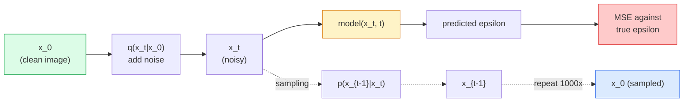

# Image Generation — Diffusion Models / 图像生成：Diffusion Models

> Diffusion model 学会的是 denoise。训练它从 noisy image 中去掉一点点 noise，再把这个反向过程重复一千次，你就得到一个 image generator。

**Type / 类型：** Build / 构建
**Languages / 语言：** Python
**Prerequisites / 前置知识：** Phase 4 Lesson 07 (U-Net), Phase 1 Lesson 06 (Probability), Phase 3 Lesson 06 (Optimizers)
**Time / 时间：** 约 75 分钟

## Learning Objectives / 学习目标

- 推导 forward noising process `x_0 -> x_1 -> ... -> x_T`，并解释为什么 closed-form `q(x_t | x_0)` 对任意 t 都成立
- 实现 DDPM-style training objective：regress 每一步加入的 noise，并实现一个从 pure noise 走回 image 的 sampler
- 构建一个 time-conditioned U-Net（小到可以在 CPU 上训练），为任意 timestep 预测 noise
- 解释 DDPM 与 DDIM sampling 的区别，以及各自适用场景（Lesson 23 会深入讲 flow matching 和 rectified flow）

## The Problem / 问题

GANs 是 one-shot generation：noise 输入，image 输出，一次 forward pass。它们速度快，但训练难。Diffusion models 是 iterative generation：从 pure noise 开始，分小步骤 denoise，image 逐渐浮现。它们速度慢，但训练容易。过去五年里，后一种性质占了上风：任何小团队都能训练一个 diffusion model 并得到合理 samples；GAN training 则是要在多年失败运行中磨出来的手艺。

除了训练稳定性，diffusion 的迭代结构还解锁了现代 image generation 的几乎所有能力：text conditioning、inpainting、image editing、super-resolution、controllable style。Sampling loop 的每一步都是注入新约束的位置。这个 hook 解释了为什么 Stable Diffusion、Imagen、DALL-E 3、Midjourney，以及你会用到的每个 controllable image model 都基于 diffusion。

本课构建最小 DDPM：forward noising、backward denoising、training loop。下一课（Stable Diffusion）会把它接成 production system：VAE、text encoder 和 classifier-free guidance。

## The Concept / 概念

### The forward process / forward process

取一张图像 `x_0`。加入很少量 Gaussian noise 得到 `x_1`。再加入一点点得到 `x_2`。持续 T 步，直到 `x_T` 几乎与 pure Gaussian noise 无法区分。

```
q(x_t | x_{t-1}) = N(x_t; sqrt(1 - beta_t) * x_{t-1},  beta_t * I)
```

`beta_t` 是一个很小的 variance schedule，通常在 T=1000 steps 上从 0.0001 线性增加到 0.02。每一步都会略微缩小 signal，并注入新 noise。

### The closed-form jump / closed-form 跳转

逐步加 noise 是一个 Markov chain，但数学可以折叠：你可以一步从 `x_0` 直接 sample 出 `x_t`。

```
Define alpha_t = 1 - beta_t
Define alpha_bar_t = prod_{s=1..t} alpha_s

Then:
  q(x_t | x_0) = N(x_t; sqrt(alpha_bar_t) * x_0,  (1 - alpha_bar_t) * I)

Equivalently:
  x_t = sqrt(alpha_bar_t) * x_0 + sqrt(1 - alpha_bar_t) * epsilon
  where epsilon ~ N(0, I)
```

这个单一方程是 diffusion 变得实用的根本原因。训练时你随机选择 `t`，直接从 `x_0` sample `x_t`，并一步完成训练，不需要模拟完整 Markov chain。

### The reverse process / reverse process

Forward process 是固定的。Reverse process `p(x_{t-1} | x_t)` 是神经网络要学习的东西。Diffusion models 不直接预测 `x_{t-1}`；它们预测 step t 加入的 noise `epsilon`，再由数学推导得到 `x_{t-1}`。



### The training loss / training loss

每个 training step：

1. Sample 一张真实图像 `x_0`。
2. 从 [1, T] 均匀 sample 一个 timestep `t`。
3. Sample noise `epsilon ~ N(0, I)`。
4. 计算 `x_t = sqrt(alpha_bar_t) * x_0 + sqrt(1 - alpha_bar_t) * epsilon`。
5. 用网络预测 `epsilon_theta(x_t, t)`。
6. 最小化 `|| epsilon - epsilon_theta(x_t, t) ||^2`。

就是这样。神经网络学习在任意 timestep 预测 noise。Loss 是 MSE。没有 adversarial game，没有 collapse，没有 oscillation。

### The sampler (DDPM) / sampler（DDPM）

生成时：从 `x_T ~ N(0, I)` 开始，一步步反向走回去。

```
for t = T, T-1, ..., 1:
    eps = model(x_t, t)
    x_{t-1} = (1 / sqrt(alpha_t)) * (x_t - (beta_t / sqrt(1 - alpha_bar_t)) * eps) + sqrt(beta_t) * z
    where z ~ N(0, I) if t > 1, else 0
return x_0
```

关键在于，虽然一般情况下 reverse conditional 没有 closed form，但对这个特定 Gaussian forward process 来说它有。那些看起来难看的系数，就是 Bayes' rule 给出的结果。

### Why 1000 steps / 为什么是 1000 steps

Forward noise schedule 的选择目标是：每一步加入的 noise 足够小，使得 reverse step 近似 Gaussian。Step 太少，reverse step 离 Gaussian 很远，网络难以建模。Step 太多，sampling 变贵，收益递减。T=1000 加 linear schedule 是 DDPM 默认配置。

### DDIM: 20x faster sampling / DDIM：快 20 倍的 sampling

训练不变，sampling 改变。DDIM（Song et al., 2020）定义了一个 deterministic reverse process，可以不 retrain 就跳过 timesteps。用 DDIM 50 steps sampling，质量接近 1000-step DDPM。每个 production system 都会使用 DDIM 或更快的 variant（DPM-Solver、Euler ancestral）。

### Time conditioning / Time conditioning

网络 `epsilon_theta(x_t, t)` 需要知道自己正在 denoise 哪个 timestep。现代 diffusion models 通过 sinusoidal time embeddings 注入 `t`（与 transformer positional encoding 同一思想），并在每个 U-Net level 加到 feature maps 上。

```
t_embedding = sinusoidal(t)
feature_map += MLP(t_embedding)
```

没有 time conditioning 时，网络只能从图像本身猜 noise level，这也能工作，但 sample efficiency 低很多。

## Build It / 动手构建

### Step 1: Noise schedule / Step 1：noise schedule

```python
import torch

def linear_beta_schedule(T=1000, beta_start=1e-4, beta_end=2e-2):
    return torch.linspace(beta_start, beta_end, T)


def precompute_schedule(betas):
    alphas = 1.0 - betas
    alphas_cumprod = torch.cumprod(alphas, dim=0)
    return {
        "betas": betas,
        "alphas": alphas,
        "alphas_cumprod": alphas_cumprod,
        "sqrt_alphas_cumprod": torch.sqrt(alphas_cumprod),
        "sqrt_one_minus_alphas_cumprod": torch.sqrt(1.0 - alphas_cumprod),
        "sqrt_recip_alphas": torch.sqrt(1.0 / alphas),
    }

schedule = precompute_schedule(linear_beta_schedule(T=1000))
```

预先计算一次，训练和 sampling 时按 index gather。

### Step 2: Forward diffusion (q_sample) / Step 2：forward diffusion（q_sample）

```python
def q_sample(x0, t, noise, schedule):
    sqrt_a = schedule["sqrt_alphas_cumprod"][t].view(-1, 1, 1, 1)
    sqrt_one_minus_a = schedule["sqrt_one_minus_alphas_cumprod"][t].view(-1, 1, 1, 1)
    return sqrt_a * x0 + sqrt_one_minus_a * noise
```

一行 closed form。`t` 是一个 batch 的 timesteps，每张图一个。

### Step 3: A tiny time-conditioned U-Net / Step 3：一个 tiny time-conditioned U-Net

```python
import torch.nn as nn
import torch.nn.functional as F
import math

def timestep_embedding(t, dim=64):
    half = dim // 2
    freqs = torch.exp(-math.log(10000) * torch.arange(half, device=t.device) / half)
    args = t[:, None].float() * freqs[None]
    emb = torch.cat([args.sin(), args.cos()], dim=-1)
    return emb


class TinyUNet(nn.Module):
    def __init__(self, img_channels=3, base=32, t_dim=64):
        super().__init__()
        self.t_mlp = nn.Sequential(
            nn.Linear(t_dim, base * 4),
            nn.SiLU(),
            nn.Linear(base * 4, base * 4),
        )
        self.t_dim = t_dim
        self.enc1 = nn.Conv2d(img_channels, base, 3, padding=1)
        self.enc2 = nn.Conv2d(base, base * 2, 4, stride=2, padding=1)
        self.mid = nn.Conv2d(base * 2, base * 2, 3, padding=1)
        self.dec1 = nn.ConvTranspose2d(base * 2, base, 4, stride=2, padding=1)
        self.dec2 = nn.Conv2d(base * 2, img_channels, 3, padding=1)
        self.time_proj = nn.Linear(base * 4, base * 2)

    def forward(self, x, t):
        t_emb = timestep_embedding(t, self.t_dim)
        t_emb = self.t_mlp(t_emb)
        t_proj = self.time_proj(t_emb)[:, :, None, None]

        h1 = F.silu(self.enc1(x))
        h2 = F.silu(self.enc2(h1)) + t_proj
        h3 = F.silu(self.mid(h2))
        d1 = F.silu(self.dec1(h3))
        d2 = torch.cat([d1, h1], dim=1)
        return self.dec2(d2)
```

两层 U-Net，在 bottleneck 注入 time conditioning。真实图像需要扩展 depth 和 width。

### Step 4: Training loop / Step 4：training loop

```python
def train_step(model, x0, schedule, optimizer, device, T=1000):
    model.train()
    x0 = x0.to(device)
    bs = x0.size(0)
    t = torch.randint(0, T, (bs,), device=device)
    noise = torch.randn_like(x0)
    x_t = q_sample(x0, t, noise, schedule)
    pred = model(x_t, t)
    loss = F.mse_loss(pred, noise)
    optimizer.zero_grad()
    loss.backward()
    optimizer.step()
    return loss.item()
```

这就是完整 training loop。没有 GAN game，没有 specialised loss，只有一次 MSE call。

### Step 5: Sampler (DDPM) / Step 5：sampler（DDPM）

```python
@torch.no_grad()
def sample(model, schedule, shape, T=1000, device="cpu"):
    model.eval()
    x = torch.randn(shape, device=device)
    betas = schedule["betas"].to(device)
    sqrt_one_minus_a = schedule["sqrt_one_minus_alphas_cumprod"].to(device)
    sqrt_recip_alphas = schedule["sqrt_recip_alphas"].to(device)

    for t in reversed(range(T)):
        t_batch = torch.full((shape[0],), t, dtype=torch.long, device=device)
        eps = model(x, t_batch)
        coef = betas[t] / sqrt_one_minus_a[t]
        mean = sqrt_recip_alphas[t] * (x - coef * eps)
        if t > 0:
            x = mean + torch.sqrt(betas[t]) * torch.randn_like(x)
        else:
            x = mean
    return x
```

生成一个 sample batch 需要 1000 次 forward pass。真实代码里你会把它换成 50-step DDIM sampler。

### Step 6: DDIM sampler (deterministic, ~20x faster) / Step 6：DDIM sampler（确定性，约快 20 倍）

```python
@torch.no_grad()
def sample_ddim(model, schedule, shape, steps=50, T=1000, device="cpu", eta=0.0):
    model.eval()
    x = torch.randn(shape, device=device)
    alphas_cumprod = schedule["alphas_cumprod"].to(device)

    ts = torch.linspace(T - 1, 0, steps + 1).long()
    for i in range(steps):
        t = ts[i]
        t_prev = ts[i + 1]
        t_batch = torch.full((shape[0],), t, dtype=torch.long, device=device)
        eps = model(x, t_batch)
        a_t = alphas_cumprod[t]
        a_prev = alphas_cumprod[t_prev] if t_prev >= 0 else torch.tensor(1.0, device=device)
        x0_pred = (x - torch.sqrt(1 - a_t) * eps) / torch.sqrt(a_t)
        sigma = eta * torch.sqrt((1 - a_prev) / (1 - a_t) * (1 - a_t / a_prev))
        dir_xt = torch.sqrt(1 - a_prev - sigma ** 2) * eps
        noise = sigma * torch.randn_like(x) if eta > 0 else 0
        x = torch.sqrt(a_prev) * x0_pred + dir_xt + noise
    return x
```

`eta=0` 完全 deterministic（相同 noise input 总会产生相同 output）。`eta=1` 会恢复 DDPM。

## Use It / 应用它

生产工作使用 `diffusers`：

```python
from diffusers import DDPMScheduler, UNet2DModel

unet = UNet2DModel(sample_size=32, in_channels=3, out_channels=3, layers_per_block=2)
scheduler = DDPMScheduler(num_train_timesteps=1000)
```

这个库提供现成 schedulers（DDPM、DDIM、DPM-Solver、Euler、Heun）、可配置 U-Nets、text-to-image 和 image-to-image pipelines，以及 LoRA fine-tuning helpers。

研究工作中，`k-diffusion`（Katherine Crowson）有最忠实的 reference implementations 和最好的 sampling variants。

## Ship It / 交付它

本课产出：

- `outputs/prompt-diffusion-sampler-picker.md`：一个 prompt，基于 quality target、latency budget 和 conditioning type 选择 DDPM / DDIM / DPM-Solver / Euler。
- `outputs/skill-noise-schedule-designer.md`：一个 skill，给定 T 和 target corruption level，生成 linear、cosine 或 sigmoid beta schedule，并输出 signal-to-noise ratio 随时间变化的 diagnostic plots。

## Exercises / 练习

1. **(Easy / 简单)** 可视化 forward process：取一张图，在 `t in [0, 100, 250, 500, 750, 1000]` 上画出 `x_t`。验证 `x_1000` 看起来像 pure Gaussian noise。
2. **(Medium / 中等)** 在 synthetic-circles dataset 上训练 TinyUNet 20 epochs，并 sample 16 个 circles。对比 DDPM（1000 steps）和 DDIM（50 steps）sampling：它们从同一个 noise seed 生成的图像是否相似？
3. **(Hard / 困难)** 实现 cosine noise schedule（Nichol & Dhariwal, 2021）：`alpha_bar_t = cos^2((t/T + s) / (1 + s) * pi / 2)`。用 linear 和 cosine schedules 分别训练同一个 model，展示 cosine 在低 step counts 下 sample 更好。

## Key Terms / 关键术语

| 术语 | 常见说法 | 实际含义 |
|------|----------------|----------------------|
| Forward process | “随时间加 noise” | 固定 Markov chain，在 T steps 内把 image 腐蚀成 Gaussian noise |
| Reverse process | “一步步 denoise” | 学到的 distribution，从 noise 走回 image |
| Epsilon prediction | “预测 noise” | 训练 target：`epsilon_theta(x_t, t)` 预测 step t 加入的 noise |
| Beta schedule | “noise amounts” | T 个小 variances 序列，定义每一步加入多少 noise |
| alpha_bar_t | “cumulative retain factor” | 到时间 t 为止 (1 - beta_s) 的乘积；t 越大，剩余 signal 越少 |
| DDPM sampler | “ancestral, stochastic” | 从 conditional Gaussian 中 sample 每个 x_{t-1}；1000 steps |
| DDIM sampler | “deterministic, fast” | 把 sampling 改写成 deterministic ODE；20-100 steps 即有相似质量 |
| Time conditioning | “告诉 model 当前 t” | 把 t 的 sinusoidal embedding 注入 U-Net，让它知道 noise level |

## Further Reading / 延伸阅读

- [Denoising Diffusion Probabilistic Models (Ho et al., 2020)](https://arxiv.org/abs/2006.11239)：让 diffusion 实用并在 FID 上击败 GAN 的论文
- [Improved DDPM (Nichol & Dhariwal, 2021)](https://arxiv.org/abs/2102.09672)：cosine schedule 与 v-parameterisation
- [DDIM (Song, Meng, Ermon, 2020)](https://arxiv.org/abs/2010.02502)：让 real-time inference 变得可能的 deterministic sampler
- [Elucidating the Design Space of Diffusion (Karras et al., 2022)](https://arxiv.org/abs/2206.00364)：统一理解所有 diffusion 设计选择的当前最佳参考
