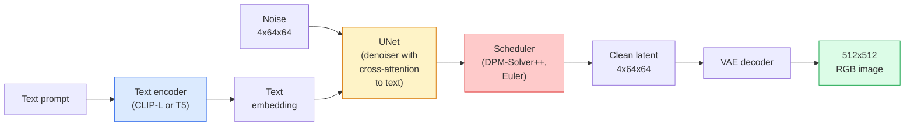

# Stable Diffusion — Architecture & Fine-Tuning / Stable Diffusion：架构与微调

> Stable Diffusion 是一个在 pretrained VAE latent space 中运行的 DDPM，通过 cross-attention 接收 text conditioning，用快速 deterministic ODE solver 采样，并由 classifier-free guidance 引导。

**Type / 类型：** Learn + Use / 学习 + 使用
**Languages / 语言：** Python
**Prerequisites / 前置知识：** Phase 4 Lesson 10 (Diffusion), Phase 7 Lesson 02 (Self-Attention)
**Time / 时间：** 约 75 分钟

## Learning Objectives / 学习目标

- 梳理 Stable Diffusion pipeline 的五个部分：VAE、text encoder、U-Net、scheduler、safety checker，并说明它们各自真正做什么
- 解释 latent diffusion，以及为什么在 4x64x64 latent space（而不是 3x512x512 image）中训练，可以在不损失质量的情况下降低 48x compute
- 使用 `diffusers` 生成图像、运行 image-to-image、inpainting 和 ControlNet-guided generation
- 在小型 custom dataset 上用 LoRA fine-tune Stable Diffusion，并在 inference 时加载 LoRA adapter

## The Problem / 问题

直接在 512x512 RGB images 上训练 DDPM 很贵。每个 training step 都要反向传播一个看到 3x512x512 = 786,432 个 input values 的 U-Net，sampling 还要通过同一个 U-Net 做 50+ 次 forward pass。在 Stable Diffusion 1.5（2022 年发布）的质量水平上，pixel-space diffusion 大约需要 256 GPU-months 训练，在消费级 GPU 上每张图需要 10-30 秒。

让 open-weight text-to-image 变得实用的技巧是 **latent diffusion**（Rombach et al., CVPR 2022）。先训练一个 VAE，把 3x512x512 image 映射到 4x64x64 latent tensor 并能还原，再在 latent space 中做 diffusion。Compute 降低 `(3*512*512)/(4*64*64) = 48x`。在同一张 GPU 上，sampling 从几十秒降到两秒以内。

几乎每个现代 image-generation model，SDXL、SD3、FLUX、HunyuanDiT、Wan-Video，都是 latent diffusion model，只是在 autoencoder、denoiser（U-Net 或 DiT）和 text conditioning 上有变化。学会 Stable Diffusion，就学会了模板。

## The Concept / 概念

### The pipeline / pipeline



- **VAE**：frozen autoencoder。Encoder 把 image 转成 latents（用于 img2img 和 training）。Decoder 把 latents 转回 image。
- **Text encoder**：CLIP text encoder（SD 1.x/2.x）、CLIP-L + CLIP-G（SDXL）或 T5-XXL（SD3/FLUX）。产出一串 token embeddings。
- **U-Net**：denoiser。它有 cross-attention layers，在每个 resolution level 从 latents attend 到 text embedding。
- **Scheduler**：sampling algorithm（DDIM、Euler、DPM-Solver++）。选择 sigmas，把 predicted noise 混回 latent。
- **Safety checker**：可选的 NSFW / illegal-content 输出过滤器。

### Classifier-free guidance (CFG) / Classifier-free guidance（CFG）

Plain text conditioning 会学习每个 prompt `c` 的 `epsilon_theta(x_t, t, c)`。CFG 用同一个网络训练，但有 10% 的时间把 `c` drop 掉（替换成 empty embedding），从而让单个 model 同时预测 conditional 和 unconditional noise。Inference 时：

```
eps = eps_uncond + w * (eps_cond - eps_uncond)
```

`w` 是 guidance scale。`w=0` 是 unconditional，`w=1` 是 plain conditional，`w>1` 会把输出推向“更受 prompt 约束”，代价是 diversity 降低。SD 默认 `w=7.5`。

CFG 是 text-to-image 达到 production quality 的原因。没有它，prompt 只会弱弱地偏置输出；有了它，prompt 会主导输出。

### Latent space geometry / latent space 几何

VAE 的 4-channel latent 不只是 compressed image。它是一个 manifold，其中 arithmetic 大致对应 semantic edits（prompt engineering + interpolation 都发生在这里），而 diffusion U-Net 的全部建模预算都花在这个空间。解码一个 random 4x64x64 latent 不会生成 random-looking image，而会生成垃圾，因为只有 latent 的特定 submanifold 能解码成 valid images。

两个后果：

1. **Img2img** = 把 image encode 成 latent，加入部分 noise，运行 denoiser，再 decode。因为 encoding 近似可逆，image structure 会保留；content 根据 prompt 改变。
2. **Inpainting** = 与 img2img 相同，但 denoiser 只更新 masked regions；unmasked regions 保持 encoded latent。

### The U-Net architecture / U-Net 架构

SD U-Net 是 Lesson 10 中 TinyUNet 的放大版本，并加入三件事：

- **Transformer blocks**：每个 spatial resolution 都有 self-attention + cross-attention to text embedding。
- **Time embedding**：对 sinusoidal encoding 过 MLP。
- **Skip connections**：encoder 与 decoder 的 matching resolutions 之间相连。

SD 1.5 总参数约 860M。SDXL 约 2.6B。FLUX 约 12B。参数增长主要来自 attention layers。

### LoRA fine-tuning / LoRA 微调

Full fine-tuning Stable Diffusion 需要 20+ GB VRAM，并更新 860M parameters。LoRA（Low-Rank Adaptation）保持 base model frozen，只向 attention layers 注入小型 rank-decomposition matrices。SD 的 LoRA adapter 通常只有 10-50 MB，可在单张消费级 GPU 上训练 10-60 分钟，并在 inference 时作为 drop-in modification 加载。

```
Original: W_q : (d_in, d_out)   frozen
LoRA:     W_q + alpha * (A @ B)   where A : (d_in, r), B : (r, d_out)

r is typically 4-32.
```

LoRA 是几乎所有社区 fine-tune 的分发方式。CivitAI 和 Hugging Face 上托管了数百万个。

### Schedulers you will see / 常见 scheduler

- **DDIM**：deterministic，约 50 steps，简单。
- **Euler ancestral**：stochastic，30-50 steps，sample 略更有创造性。
- **DPM-Solver++ 2M Karras**：deterministic，20-30 steps，production default。
- **LCM / TCD / Turbo**：consistency models 和 distilled variants；1-4 steps，牺牲一些质量换速度。

在 `diffusers` 中切换 scheduler 是一行代码，有时不用 retrain 就能修复 sample 问题。

## Build It / 动手构建

本课端到端使用 `diffusers`，而不是从零重建 Stable Diffusion。要重建的部件（VAE、text encoder、U-Net、scheduler）各自都是完整课程；这里的目标是熟悉 production API。

### Step 1: Text-to-image / Step 1：text-to-image

```python
import torch
from diffusers import StableDiffusionPipeline

pipe = StableDiffusionPipeline.from_pretrained(
    "runwayml/stable-diffusion-v1-5",
    torch_dtype=torch.float16,
).to("cuda")

image = pipe(
    prompt="a dog riding a skateboard in tokyo, studio ghibli style",
    guidance_scale=7.5,
    num_inference_steps=25,
    generator=torch.Generator("cuda").manual_seed(42),
).images[0]
image.save("dog.png")
```

`float16` 可以把 VRAM 减半，几乎没有可见质量损失。使用默认 DPM-Solver++ 时，`num_inference_steps=25` 与 DDIM 的 `num_inference_steps=50` 质量接近。

### Step 2: Swap the scheduler / Step 2：切换 scheduler

```python
from diffusers import DPMSolverMultistepScheduler, EulerAncestralDiscreteScheduler

pipe.scheduler = DPMSolverMultistepScheduler.from_config(pipe.scheduler.config)
pipe.scheduler = EulerAncestralDiscreteScheduler.from_config(pipe.scheduler.config)
```

Scheduler state 与 U-Net weights 解耦。你可以用 DDPM 训练，用任意 scheduler 采样。

### Step 3: Image-to-image / Step 3：image-to-image

```python
from diffusers import StableDiffusionImg2ImgPipeline
from PIL import Image

img2img = StableDiffusionImg2ImgPipeline.from_pretrained(
    "runwayml/stable-diffusion-v1-5",
    torch_dtype=torch.float16,
).to("cuda")

init_image = Image.open("dog.png").convert("RGB").resize((512, 512))
out = img2img(
    prompt="a dog riding a skateboard, oil painting",
    image=init_image,
    strength=0.6,
    guidance_scale=7.5,
).images[0]
```

`strength` 表示 denoising 前加入多少 noise（0.0 = 不变，1.0 = 完全重生成）。0.5-0.7 是 style transfer 的标准范围。

### Step 4: Inpainting / Step 4：inpainting

```python
from diffusers import StableDiffusionInpaintPipeline

inpaint = StableDiffusionInpaintPipeline.from_pretrained(
    "runwayml/stable-diffusion-inpainting",
    torch_dtype=torch.float16,
).to("cuda")

image = Image.open("dog.png").convert("RGB").resize((512, 512))
mask = Image.open("dog_mask.png").convert("L").resize((512, 512))

out = inpaint(
    prompt="a cat",
    image=image,
    mask_image=mask,
    guidance_scale=7.5,
).images[0]
```

Mask 中白色 pixels 是要重新生成的区域。黑色 pixels 会被保留。

### Step 5: LoRA loading / Step 5：加载 LoRA

```python
pipe.load_lora_weights("sayakpaul/sd-lora-ghibli")
pipe.fuse_lora(lora_scale=0.8)

image = pipe(prompt="a village square in ghibli style").images[0]
```

`lora_scale` 控制强度；0.0 = 无效果，1.0 = 完整效果。`fuse_lora` 会把 adapter 原地烘进 weights 以提升速度，但会阻止快速切换。加载另一个 adapter 前调用 `pipe.unfuse_lora()`。

### Step 6: LoRA training (sketch) / Step 6：LoRA training（草图）

真实 LoRA training 在 `peft` 或 `diffusers.training` 中。本质流程：

```python
# Pseudocode
for step, batch in enumerate(dataloader):
    images, prompts = batch
    latents = vae.encode(images).latent_dist.sample() * 0.18215

    t = torch.randint(0, num_train_timesteps, (batch_size,))
    noise = torch.randn_like(latents)
    noisy_latents = scheduler.add_noise(latents, noise, t)

    text_emb = text_encoder(tokenizer(prompts))

    pred_noise = unet(noisy_latents, t, text_emb)  # LoRA weights injected here

    loss = F.mse_loss(pred_noise, noise)
    loss.backward()
    optimizer.step()
```

只有 LoRA matrices 接收 gradient；base U-Net、VAE 和 text encoder 都是 frozen。Batch size 为 1 并打开 gradient checkpointing 时，8 GB VRAM 可以跑。

## Use It / 应用它

生产中你真正要做的决策：

- **Model family**：SD 1.5 适合 open-source community fine-tunes，SDXL 适合更高 fidelity，SD3 / FLUX 适合 state of the art 和严格 licensing requirements。
- **Scheduler**：20-30 steps 用 DPM-Solver++ 2M Karras，latency 低于 1s 时用 LCM-LoRA。
- **Precision**：4080/4090 上用 `float16`，A100 及更新硬件上用 `bfloat16`，VRAM 紧张时用 `int8`（通过 `bitsandbytes` 或 `compel`）。
- **Conditioning**：plain text 可用；需要更强控制时，在 base pipeline 上加入 ControlNet（canny、depth、pose）。

Batch generation 使用 `AUTO1111` / `ComfyUI` 这类社区工具；production API 使用 `diffusers` + `accelerate`，或通过 `optimum-nvidia` 做 TensorRT compilation。

## Ship It / 交付它

本课产出：

- `outputs/prompt-sd-pipeline-planner.md`：一个 prompt，根据 latency budget、fidelity target 和 licensing constraint 选择 SD 1.5 / SDXL / SD3 / FLUX，以及 scheduler 和 precision。
- `outputs/skill-lora-training-setup.md`：一个 skill，为 custom dataset 生成完整 LoRA training config，包括 captions、rank、batch size 和 learning rate。

## Exercises / 练习

1. **(Easy / 简单)** 用 `[1, 3, 5, 7.5, 10, 15]` 中的 `guidance_scale` 生成同一个 prompt。描述图像如何变化。在哪个 guidance value 开始出现 artefacts？
2. **(Medium / 中等)** 取任意真实照片，用 `StableDiffusionImg2ImgPipeline` 在 `[0.2, 0.4, 0.6, 0.8, 1.0]` 中的 `strength` 上运行。哪个 strength 能保留 composition 同时改变 style？为什么 1.0 会完全忽略 input？
3. **(Hard / 困难)** 用 10-20 张单一 subject（宠物、logo、角色）的图片训练 LoRA，并生成包含该 subject 的新场景。报告在不过拟合输入图像的前提下，identity preservation 最好的 LoRA rank 和 training steps。

## Key Terms / 关键术语

| 术语 | 常见说法 | 实际含义 |
|------|----------------|----------------------|
| Latent diffusion | “在 latents 中 diffuse” | 在 VAE latent space（4x64x64）而不是 pixel space（3x512x512）中运行整个 DDPM；节省 48x compute |
| VAE scale factor | “0.18215” | 把 VAE raw latent rescale 到大致 unit variance 的常数；每个 SD pipeline 都 hardcode |
| Classifier-free guidance | “CFG” | 混合 conditional 与 unconditional noise predictions；最有影响力的 inference knob |
| Scheduler | “Sampler” | 把 noise + model predictions 转成 denoised latent trajectory 的算法 |
| LoRA | “Low-rank adapter” | 小型 rank-decomposition matrices，无需触碰 base weights 就能 fine-tune attention layers |
| Cross-attention | “Text-image attention” | 从 latent tokens 到 text tokens 的 attention；在每个 U-Net level 注入 prompt information |
| ControlNet | “Structure conditioning” | 单独训练的 adapter，用额外 input（canny、depth、pose、segmentation）引导 SD |
| DPM-Solver++ | “默认 scheduler” | 二阶 deterministic ODE solver；2026 年在低 step counts（20-30）下质量最好 |

## Further Reading / 延伸阅读

- [High-Resolution Image Synthesis with Latent Diffusion (Rombach et al., 2022)](https://arxiv.org/abs/2112.10752)：Stable Diffusion 论文，包含支撑该设计的所有 ablation
- [Classifier-Free Diffusion Guidance (Ho & Salimans, 2022)](https://arxiv.org/abs/2207.12598)：CFG 论文
- [LoRA: Low-Rank Adaptation of Large Language Models (Hu et al., 2021)](https://arxiv.org/abs/2106.09685)：LoRA 首先来自 NLP；几乎无需改动就迁移到 SD
- [diffusers documentation](https://huggingface.co/docs/diffusers)：所有 SD / SDXL / SD3 / FLUX pipeline 的参考
