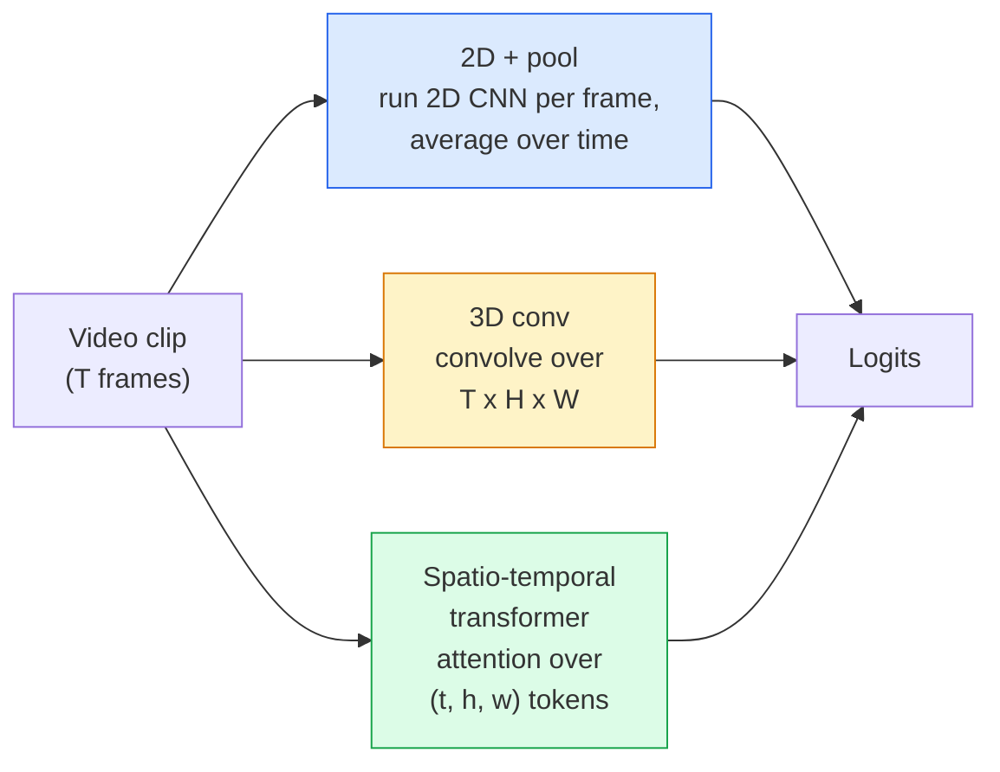

# Video Understanding — Temporal Modeling / 视频理解：时间建模

> 视频是一串图像，加上连接它们的物理过程。每个 video model 要么把时间当成额外 axis（3D conv），要么把时间当成要 attention 的 sequence（transformer），要么只抽一次 feature 后做 pooling（2D+pool）。

**Type / 类型：** Learn + Build / 学习 + 构建
**Languages / 语言：** Python
**Prerequisites / 前置知识：** Phase 4 Lesson 03 (CNNs), Phase 4 Lesson 04 (Image Classification)
**Time / 时间：** 约 45 分钟

## Learning Objectives / 学习目标

- 区分三种主要 video-modelling approaches（2D+pool、3D conv、spatio-temporal transformer），并预测它们的成本与 accuracy 权衡
- 在 PyTorch 中实现 frame sampling、temporal pooling 和 2D+pool baseline classifier
- 解释 I3D 的 “inflated” 3D kernels 为什么能从 ImageNet weights 良好迁移，以及 factorised (2+1)D conv 有什么不同
- 阅读标准 action-recognition datasets 和 metrics：Kinetics-400/600、UCF101、Something-Something V2；clip level 和 video level 的 top-1 accuracy

## The Problem / 问题

30 秒、30 fps 的视频有 900 张图。朴素做法是把 video classification 当成 image classification 运行 900 次，再做某种 aggregation。当 action 几乎在每一帧都可见时（sports、cooking、exercise videos），这能工作；但当 action 本身由 motion 定义时，它会严重失败：“把某物从左推到右”在每一张静止帧里都只像两个静止物体。

每个 video architecture 的核心问题都是：temporal structure 何时被建模，如何被建模？答案会决定其他一切：compute cost、pretraining strategy、是否能复用 ImageNet weights、model 训练在哪些 datasets 上。

本课故意比 static-image lessons 短。核心图像机制已经建立好，video understanding 主要是 temporal story：sampling、modelling、aggregating。

## The Concept / 概念

### The three architectural families / 三类架构 family



### 2D + pool / 2D + pool

取一个 2D CNN（ResNet、EfficientNet、ViT）。在每个 sampled frame 上独立运行。对 per-frame embeddings 做 average（或 max-pool、attention-pool）。把 pooled vector 喂给 classifier。

优点：
- ImageNet pretraining 可以直接迁移。
- 实现最简单。
- 便宜：T frames * single-image inference cost。

缺点：
- 无法建模 motion。Action = appearances 的 aggregate。
- Temporal pooling 是 order-invariant；“open door”和“close door”看起来相同。

适用：appearance-heavy tasks、小型 video datasets 上的 transfer learning、初始 baselines。

### 3D convolutions / 3D convolutions

把 2D (H, W) kernels 换成 3D (T, H, W) kernels。网络同时在 space 和 time 上做 convolution。早期 family 包括 C3D、I3D、SlowFast。

I3D 技巧：取一个 pretrained 2D ImageNet model，把每个 2D kernel 沿着新的 time axis 复制，完成 “inflate”。一个 3x3 2D conv 变成 3x3x3 3D conv。这让 3D model 获得强 pretrained weights，而不必 from scratch training。

优点：
- 直接建模 motion。
- I3D inflation 免费带来 transfer learning。

缺点：
- FLOPs 比 2D 对应模型多 T/8（对于时间 kernel 为 3、堆叠 3 次的情况）。
- Temporal kernels 很小；long-range motion 需要 pyramid 或 dual-stream approach。

适用：motion 是信号的 action recognition（Something-Something V2、Kinetics 中 motion-heavy classes）。

### Spatio-temporal transformers / Spatio-temporal transformers

把 video tokenise 成 space-time patches grid，并在所有 tokens 上做 attention。代表包括 TimeSformer、ViViT、Video Swin、VideoMAE。

关键 attention patterns：
- **Joint**：在 (t, h, w) 上做一个大 attention。对 `T*H*W` 二次方；昂贵。
- **Divided**：每个 block 两个 attentions：一个 over time，一个 over space。近似线性缩放。
- **Factorised**：time attention 与 space attention 在 blocks 间交替。

优点：
- 在每个主要 benchmark 上都是 SOTA accuracy。
- 可通过 patch inflation 从 image transformers（ViT）迁移。
- 通过 sparse attention 支持 long-context video。

缺点：
- 计算消耗高。
- 需要仔细选择 attention pattern，否则 runtime 会膨胀。

适用：大 datasets、高保真 video understanding、multi-modal video+text tasks。

### Frame sampling / Frame sampling

10 秒 30 fps 的 clip 有 300 frames；把全部 300 frames 喂给任何 model 都浪费。标准策略：

- **Uniform sampling**：在 clip 中均匀选择 T frames。2D+pool 默认方式。
- **Dense sampling**：随机连续 T-frame window。3D conv 常用，因为 motion 需要相邻 frames。
- **Multi-clip**：从同一个 video 采样多个 T-frame windows，分别 classify，并在 test time 平均 predictions。

T 通常是 8、16、32 或 64。更高 T = 更多 temporal signal，也意味着更多 compute。

### Evaluation / 评估

两个层级：
- **Clip-level accuracy**：model 看到一个 T-frame clip，报告 top-k。
- **Video-level accuracy**：对同一个 video 的多个 clips 的 predictions 求平均；更高、更稳定。

两个都要报告。一个 78% clip / 82% video 的 model 高度依赖 test-time averaging；一个 80% / 81% 的 model 每个 clip 更鲁棒。

### Datasets you will meet / 常见 datasets

- **Kinetics-400 / 600 / 700**：通用 action dataset。400k clips；YouTube URLs（现在很多已失效）。
- **Something-Something V2**：由 motion 定义的 actions（“moving X from left to right”）。2D+pool 无法解决。
- **UCF-101**, **HMDB-51**：更老、更小，但仍常被报告。
- **AVA**：space 和 time 上的 action *localisation*；比 classification 更难。

## Build It / 动手构建

### Step 1: Frame sampler / Step 1：frame sampler

适用于 frame list（或 video tensor）的 uniform 和 dense samplers。

```python
import numpy as np

def sample_uniform(num_frames_total, T):
    if num_frames_total <= T:
        return list(range(num_frames_total)) + [num_frames_total - 1] * (T - num_frames_total)
    step = num_frames_total / T
    return [int(i * step) for i in range(T)]


def sample_dense(num_frames_total, T, rng=None):
    rng = rng or np.random.default_rng()
    if num_frames_total <= T:
        return list(range(num_frames_total)) + [num_frames_total - 1] * (T - num_frames_total)
    start = int(rng.integers(0, num_frames_total - T + 1))
    return list(range(start, start + T))
```

二者都返回 `T` 个 indices，你用它们 slice video tensor。

### Step 2: A 2D+pool baseline / Step 2：一个 2D+pool baseline

在每个 frame 上运行 2D ResNet-18，average-pool features，然后 classify。

```python
import torch
import torch.nn as nn
from torchvision.models import resnet18, ResNet18_Weights

class FramePool(nn.Module):
    def __init__(self, num_classes=400, pretrained=True):
        super().__init__()
        weights = ResNet18_Weights.IMAGENET1K_V1 if pretrained else None
        backbone = resnet18(weights=weights)
        self.features = nn.Sequential(*(list(backbone.children())[:-1]))  # global avg pool kept
        self.head = nn.Linear(512, num_classes)

    def forward(self, x):
        # x: (N, T, 3, H, W)
        N, T = x.shape[:2]
        x = x.view(N * T, *x.shape[2:])
        feats = self.features(x).view(N, T, -1)
        pooled = feats.mean(dim=1)
        return self.head(pooled)

model = FramePool(num_classes=10)
x = torch.randn(2, 8, 3, 224, 224)
print(f"output: {model(x).shape}")
print(f"params: {sum(p.numel() for p in model.parameters()):,}")
```

1100 万参数，ImageNet pretrained，逐 frame 运行、平均、分类。这个 baseline 在 appearance-heavy tasks 上经常只比真正的 3D models 低 5-10 个点，有时更好，因为它复用了更强的 ImageNet backbone。

### Step 3: An I3D-style inflated 3D conv / Step 3：I3D-style inflated 3D conv

把一个 2D conv 沿新的 time axis 重复 weights，变成 3D conv。

```python
def inflate_2d_to_3d(conv2d, time_kernel=3):
    out_c, in_c, kh, kw = conv2d.weight.shape
    weight_3d = conv2d.weight.data.unsqueeze(2)  # (out, in, 1, kh, kw)
    weight_3d = weight_3d.repeat(1, 1, time_kernel, 1, 1) / time_kernel
    conv3d = nn.Conv3d(in_c, out_c, kernel_size=(time_kernel, kh, kw),
                        padding=(time_kernel // 2, conv2d.padding[0], conv2d.padding[1]),
                        stride=(1, conv2d.stride[0], conv2d.stride[1]),
                        bias=False)
    conv3d.weight.data = weight_3d
    return conv3d

conv2d = nn.Conv2d(3, 64, kernel_size=3, padding=1, bias=False)
conv3d = inflate_2d_to_3d(conv2d, time_kernel=3)
print(f"2D weight shape:  {tuple(conv2d.weight.shape)}")
print(f"3D weight shape:  {tuple(conv3d.weight.shape)}")
x = torch.randn(1, 3, 8, 56, 56)
print(f"3D output shape:  {tuple(conv3d(x).shape)}")
```

除以 `time_kernel` 可以让 activation magnitudes 大致保持不变，这对不破坏第一次 forward 的 batch-norm statistics 很重要。

### Step 4: Factorised (2+1)D conv / Step 4：factorised (2+1)D conv

把 3D conv 拆成 2D（spatial）conv 和 1D（temporal）conv。Receptive field 相同，参数更少，并且在某些 benchmark 上 accuracy 更好。

```python
class Conv2Plus1D(nn.Module):
    def __init__(self, in_c, out_c, kernel_size=3):
        super().__init__()
        mid_c = (in_c * out_c * kernel_size * kernel_size * kernel_size) \
                // (in_c * kernel_size * kernel_size + out_c * kernel_size)
        self.spatial = nn.Conv3d(in_c, mid_c, kernel_size=(1, kernel_size, kernel_size),
                                 padding=(0, kernel_size // 2, kernel_size // 2), bias=False)
        self.bn = nn.BatchNorm3d(mid_c)
        self.act = nn.ReLU(inplace=True)
        self.temporal = nn.Conv3d(mid_c, out_c, kernel_size=(kernel_size, 1, 1),
                                  padding=(kernel_size // 2, 0, 0), bias=False)

    def forward(self, x):
        return self.temporal(self.act(self.bn(self.spatial(x))))

c = Conv2Plus1D(3, 64)
x = torch.randn(1, 3, 8, 56, 56)
print(f"(2+1)D output: {tuple(c(x).shape)}")
```

完整 R(2+1)D network 就是把 ResNet-18 中每个 3x3 conv 替换成 `Conv2Plus1D`。

## Use It / 应用它

两个库覆盖生产级 video work：

- `torchvision.models.video`：R(2+1)D、MViT、Swin3D，带 pretrained Kinetics weights。API 与 image models 相同。
- `pytorchvideo`（Meta）：model zoo、Kinetics / SSv2 / AVA data loaders、标准 transforms。

对 Vision-Language video models（video captioning、video QA），使用 `transformers`（`VideoMAE`、`VideoLLaMA`、`InternVideo`）。

## Ship It / 交付它

本课产出：

- `outputs/prompt-video-architecture-picker.md`：一个 prompt，根据 appearance-vs-motion、dataset size 和 compute budget 选择 2D+pool / I3D / (2+1)D / transformer。
- `outputs/skill-frame-sampler-auditor.md`：一个 skill，检查 video pipeline 的 sampler 并标记常见 bug：off-by-one index、`num_frames < T` 时 sampling 不均、缺少 aspect-preserving crop 等。

## Exercises / 练习

1. **(Easy / 简单)** 近似计算 T=8 时 FramePool 和 T=8 的 I3D-style 3D ResNet 的 FLOPs。解释为什么 2D+pool 便宜 3-5 倍。
2. **(Medium / 中等)** 生成一个 synthetic video dataset：随机球以随机方向移动，按运动方向标注（“left-to-right”、“right-to-left”、“diagonal-up”）。在其上训练 FramePool。展示它接近 chance accuracy，从而证明 motion tasks 只靠 appearance 不够。
3. **(Hard / 困难)** 通过把 ResNet-18 中每个 Conv2d 替换为 `Conv2Plus1D` 构建 R(2+1)D-18。用 ImageNet-pretrained ResNet-18 inflate 第一层 conv weights。在 exercise 2 的 motion dataset 上训练并超过 FramePool。

## Key Terms / 关键术语

| 术语 | 常见说法 | 实际含义 |
|------|----------------|----------------------|
| 2D + pool | “per-frame classifier” | 在每个 sampled frame 上运行 2D CNN，跨时间 average-pool features，再分类 |
| 3D convolution | “Spatio-temporal kernel” | 在 (T, H, W) 上做 convolution 的 kernel；可以原生建模 motion |
| Inflation | “把 2D weights 提升到 3D” | 通过沿新 time axis 重复 2D conv weights 初始化 3D conv weights，再除以 kernel_T 保持 activation scale |
| (2+1)D | “Factorised conv” | 把 3D 拆成 2D spatial + 1D temporal；参数更少，中间多一个 non-linearity |
| Divided attention | “Time then space” | Transformer block 每层两个 attentions：一个 over 同一 frame 的 tokens，一个 over 同一 position 的 tokens |
| Clip | “T-frame window” | T frames 的 sampled subsequence；video model 消耗的基本单元 |
| Clip vs video accuracy | “两种 eval settings” | Clip = 每个 video 一个 sample，video = 对多个 sampled clips 求平均 |
| Kinetics | “video 的 ImageNet” | 400-700 action classes、300k+ YouTube clips，标准 video pretraining corpus |

## Further Reading / 延伸阅读

- [I3D: Quo Vadis, Action Recognition (Carreira & Zisserman, 2017)](https://arxiv.org/abs/1705.07750)：提出 inflation 和 Kinetics dataset
- [R(2+1)D: A Closer Look at Spatiotemporal Convolutions (Tran et al., 2018)](https://arxiv.org/abs/1711.11248)：factorised conv，到今天仍是强 baseline
- [TimeSformer: Is Space-Time Attention All You Need? (Bertasius et al., 2021)](https://arxiv.org/abs/2102.05095)：第一个强 video transformer
- [VideoMAE (Tong et al., 2022)](https://arxiv.org/abs/2203.12602)：video 的 masked autoencoder pretraining；当前主流 pretraining recipe
