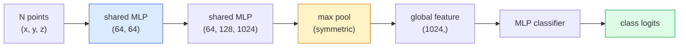

# 3D Vision — Point Clouds & NeRFs / 3D 视觉：点云与 NeRF

> 3D vision 有两种主要形态。Point clouds 是 sensor 的原始输出。NeRFs 是学到的 volumetric field。二者都在回答“空间里什么东西在哪里”。

**Type / 类型：** Learn + Build / 学习 + 构建
**Languages / 语言：** Python
**Prerequisites / 前置知识：** Phase 4 Lesson 03 (CNNs), Phase 1 Lesson 12 (Tensor Operations)
**Time / 时间：** 约 45 分钟

## Learning Objectives / 学习目标

- 区分 explicit（point cloud、mesh、voxel）和 implicit（signed distance field、NeRF）3D representations，并判断何时使用各自
- 理解 PointNet 的 symmetric-function 技巧，它如何让 neural network 对 unordered points set 保持 permutation-invariant
- 跟踪一次 NeRF forward pass：ray casting、volumetric rendering、positional encoding、MLP density+colour head
- 使用 `nerfstudio` 或 `instant-ngp`，从少量 posed images 做 pretrained 3D reconstruction

## The Problem / 问题

Camera 产生 2D image。LIDAR 产生无序 3D points set。Structure-from-motion pipeline 产生稀疏 3D keypoints cloud。NeRF 从少量 posed images 重建完整 3D scene。这些都是“vision”，但它们都不像 CNN 期待的 dense tensor。

3D vision 重要，是因为几乎每个高价值 robot task 都运行在 3D 中：grasping、obstacle avoidance、navigation、AR occlusion、3D content capture。只理解 2D images 的视觉工程师，会被挡在增长最快的领域之外：AR/VR content、robotics、autonomous driving stacks、面向 real-estate 或 construction 的 NeRF-based 3D reconstruction。

两种 representation 因不同原因占主导。Point clouds 是 sensor 免费给你的东西。NeRFs 及其后继者（3D Gaussian splatting、neural SDFs）则是你要求 neural network 学习一个 scene 时得到的东西。

## The Concept / 概念

### Point clouds / 点云

Point cloud 是 R^3 中 N 个 points 的 unordered set，每个 point 可选带 features（colour、intensity、normal）。

```
cloud = [
  (x1, y1, z1, r1, g1, b1),
  (x2, y2, z2, r2, g2, b2),
  ...
  (xN, yN, zN, rN, gN, bN),
]
```

没有 grid，没有 connectivity。两个性质让 neural networks 很难处理它：

- **Permutation invariance**：output 不能依赖 points 的顺序。
- **Variable N**：同一个 model 必须处理不同大小的 clouds。

PointNet（Qi et al., 2017）用一个想法解决了二者：对每个 point 应用 shared MLP，然后用 symmetric function（max pool）聚合。结果是一个 fixed-size vector，且不依赖输入顺序。

```
f(P) = max_{p in P} MLP(p)
```

这就是 PointNet 的全部核心。更深的 variants（PointNet++、Point Transformer）加入 hierarchical sampling 和 local aggregation，但 symmetric-function 技巧不变。

### The PointNet architecture / PointNet 架构



“Shared MLP” 表示同一个 MLP 独立运行在每个 point 上。为了效率，通常实现为沿 point dimension 的 1x1 conv。

### Neural Radiance Fields (NeRFs) / Neural Radiance Fields（NeRFs）

NeRFs（Mildenhall et al., 2020）提出问题：“能否从 N 张照片重建一个 3D scene？”答案是：用一个 neural network 表示 scene。网络把 `(x, y, z, viewing_direction)` 映射到 `(density, colour)`。渲染一个新视角，就是在这个网络上做 ray-casting loop。

```
NeRF MLP:  (x, y, z, theta, phi) -> (sigma, r, g, b)

To render a pixel (u, v) of a new view:
  1. Cast a ray from the camera through pixel (u, v)
  2. Sample points along the ray at distances t_1, t_2, ..., t_N
  3. Query the MLP at each point
  4. Composite the colours weighted by (1 - exp(-sigma * dt))
  5. The sum is the rendered pixel colour
```

Loss 会比较 rendered pixel 与 training photos 中的 ground-truth pixel。通过 rendering step 反向传播会更新 MLP。没有 3D ground truth，没有 explicit geometry，scene 存在 MLP weights 中。

### Positional encoding in NeRF / NeRF 中的 positional encoding

直接把 `(x, y, z)` 输入 vanilla MLP 无法表示 high-frequency details，因为 MLP 有偏向低频的 spectral bias。NeRF 在进入 MLP 前把每个 coordinate 编码成 Fourier feature vector：

```
gamma(p) = (sin(2^0 pi p), cos(2^0 pi p), sin(2^1 pi p), cos(2^1 pi p), ...)
```

最多 L=10 个 frequency levels。这与 transformer 对 position 使用的技巧相同，也会再次出现在 diffusion time conditioning（Lesson 10）中。没有它，NeRFs 会显得模糊。

### Volumetric rendering / Volumetric rendering

```
C(r) = sum_i T_i * (1 - exp(-sigma_i * delta_i)) * c_i

T_i  = exp(- sum_{j<i} sigma_j * delta_j)
delta_i = t_{i+1} - t_i
```

`T_i` 是 transmittance，也就是有多少光能到达 point i。`(1 - exp(-sigma_i * delta_i))` 是 point i 的 opacity。`c_i` 是 colour。最终 pixel 是沿 ray 的 weighted sum。

### What replaced NeRFs / 什么替代了 NeRFs

Pure NeRFs 训练慢（小时级），渲染慢（每张图数秒）。后续谱系：

- **Instant-NGP**（2022）：hash-grid encoding 替代 MLP 的 position input；秒级训练。
- **Mip-NeRF 360**：处理 unbounded scenes 和 anti-aliasing。
- **3D Gaussian Splatting**（2023）：用数百万个 3D Gaussians 替代 volumetric field；分钟级训练，实时渲染。当前 production default。

2026 年几乎每个真实 NeRF 产品，其实都是 3D Gaussian splatting。心智模型仍然是 NeRF。

### Datasets and benchmarks / datasets 与 benchmarks

- **ShapeNet**：把 3D CAD models 当作 point clouds 做 classification 和 segmentation。
- **ScanNet**：用于 segmentation 的真实室内 scans。
- **KITTI**：autonomous driving 的 outdoor LIDAR point clouds。
- **NeRF Synthetic** / **Blended MVS**：用于 view synthesis 的 posed-image datasets。
- **Mip-NeRF 360** dataset：unbounded real scenes。

## Build It / 动手构建

### Step 1: PointNet classifier / Step 1：PointNet classifier

```python
import torch
import torch.nn as nn

class PointNet(nn.Module):
    def __init__(self, num_classes=10):
        super().__init__()
        self.mlp1 = nn.Sequential(
            nn.Conv1d(3, 64, 1),    nn.BatchNorm1d(64),   nn.ReLU(inplace=True),
            nn.Conv1d(64, 64, 1),   nn.BatchNorm1d(64),   nn.ReLU(inplace=True),
        )
        self.mlp2 = nn.Sequential(
            nn.Conv1d(64, 128, 1),  nn.BatchNorm1d(128),  nn.ReLU(inplace=True),
            nn.Conv1d(128, 1024, 1), nn.BatchNorm1d(1024), nn.ReLU(inplace=True),
        )
        self.head = nn.Sequential(
            nn.Linear(1024, 512),   nn.BatchNorm1d(512),  nn.ReLU(inplace=True),
            nn.Dropout(0.3),
            nn.Linear(512, 256),    nn.BatchNorm1d(256),  nn.ReLU(inplace=True),
            nn.Dropout(0.3),
            nn.Linear(256, num_classes),
        )

    def forward(self, x):
        # x: (N, 3, num_points) — transposed for Conv1d
        x = self.mlp1(x)
        x = self.mlp2(x)
        x = torch.max(x, dim=-1)[0]       # (N, 1024)
        return self.head(x)

pts = torch.randn(4, 3, 1024)
net = PointNet(num_classes=10)
print(f"output: {net(pts).shape}")
print(f"params: {sum(p.numel() for p in net.parameters()):,}")
```

约 1.6M 参数。每个 cloud 处理 1,024 个 points。

### Step 2: Positional encoding / Step 2：positional encoding

```python
def positional_encoding(x, L=10):
    """
    x: (..., D) -> (..., D * 2 * L)
    """
    freqs = 2.0 ** torch.arange(L, dtype=x.dtype, device=x.device)
    args = x.unsqueeze(-1) * freqs * 3.141592653589793
    sinc = torch.cat([args.sin(), args.cos()], dim=-1)
    return sinc.reshape(*x.shape[:-1], -1)

x = torch.randn(5, 3)
y = positional_encoding(x, L=10)
print(f"input:  {x.shape}")
print(f"encoded: {y.shape}     # (5, 60)")
```

乘以 `2^l * pi` 会得到逐渐更高的 frequencies。

### Step 3: Tiny NeRF MLP / Step 3：Tiny NeRF MLP

```python
class TinyNeRF(nn.Module):
    def __init__(self, L_pos=10, L_dir=4, hidden=128):
        super().__init__()
        self.L_pos = L_pos
        self.L_dir = L_dir
        pos_dim = 3 * 2 * L_pos
        dir_dim = 3 * 2 * L_dir
        self.trunk = nn.Sequential(
            nn.Linear(pos_dim, hidden), nn.ReLU(inplace=True),
            nn.Linear(hidden, hidden),  nn.ReLU(inplace=True),
            nn.Linear(hidden, hidden),  nn.ReLU(inplace=True),
            nn.Linear(hidden, hidden),  nn.ReLU(inplace=True),
        )
        self.sigma = nn.Linear(hidden, 1)
        self.color = nn.Sequential(
            nn.Linear(hidden + dir_dim, hidden // 2), nn.ReLU(inplace=True),
            nn.Linear(hidden // 2, 3), nn.Sigmoid(),
        )

    def forward(self, x, d):
        x_enc = positional_encoding(x, self.L_pos)
        d_enc = positional_encoding(d, self.L_dir)
        h = self.trunk(x_enc)
        sigma = torch.relu(self.sigma(h)).squeeze(-1)
        rgb = self.color(torch.cat([h, d_enc], dim=-1))
        return sigma, rgb

nerf = TinyNeRF()
x = torch.randn(128, 3)
d = torch.randn(128, 3)
s, c = nerf(x, d)
print(f"sigma: {s.shape}   rgb: {c.shape}")
```

它比原始 NeRF 小很多（原始 NeRF 有两个 depth 8 的 MLP trunks），但足够展示架构。

### Step 4: Volumetric rendering along a ray / Step 4：沿 ray 做 volumetric rendering

```python
def volumetric_render(sigma, rgb, t_vals):
    """
    sigma: (..., N_samples)
    rgb:   (..., N_samples, 3)
    t_vals: (N_samples,) distances along the ray
    """
    delta = torch.cat([t_vals[1:] - t_vals[:-1], torch.full_like(t_vals[:1], 1e10)])
    alpha = 1.0 - torch.exp(-sigma * delta)
    trans = torch.cumprod(torch.cat([torch.ones_like(alpha[..., :1]), 1.0 - alpha + 1e-10], dim=-1), dim=-1)[..., :-1]
    weights = alpha * trans
    rendered = (weights.unsqueeze(-1) * rgb).sum(dim=-2)
    depth = (weights * t_vals).sum(dim=-1)
    return rendered, depth, weights


N = 64
t_vals = torch.linspace(2.0, 6.0, N)
sigma = torch.rand(N) * 0.5
rgb = torch.rand(N, 3)
rendered, depth, weights = volumetric_render(sigma, rgb, t_vals)
print(f"rendered colour: {rendered.tolist()}")
print(f"depth:           {depth.item():.2f}")
```

一条 ray，64 个 samples，composite 成一个 RGB pixel 和一个 depth。

## Use It / 应用它

真实工作中：

- `nerfstudio`（Tancik et al.）：当前 NeRF / Instant-NGP / Gaussian Splatting 的参考库。命令行加 web viewer。
- `pytorch3d`（Meta）：differentiable rendering、point-cloud utilities、mesh ops。
- `open3d`：point cloud processing、registration、visualisation。

部署时，3D Gaussian splatting 已经大体替代 pure NeRFs，因为渲染快 100 倍。重建质量相近。

## Ship It / 交付它

本课产出：

- `outputs/prompt-3d-task-router.md`：一个 prompt，基于 task 和 input data 路由到正确的 3D representation（point cloud、mesh、voxel、NeRF、Gaussian splat）。
- `outputs/skill-point-cloud-loader.md`：一个 skill，为 .ply / .pcd / .xyz files 生成 PyTorch `Dataset`，包含正确 normalisation、centring 和 point sampling。

## Exercises / 练习

1. **(Easy / 简单)** 证明 PointNet 是 permutation-invariant：把同一个 cloud 跑两次，一次打乱 points。验证 outputs 只在 floating-point noise 范围内不同。
2. **(Medium / 中等)** 实现一个 minimal ray-generation function：给定 camera intrinsics 和 pose，为 H x W image 的每个 pixel 生成 ray origins 和 directions。
3. **(Hard / 困难)** 在 synthetic dataset 上训练 TinyNeRF，该 dataset 是彩色 cube 的 rendered views（用 differentiable rendering 或简单 ray tracer 生成）。报告 epoch 1、10、100 的 rendering loss。第几个 epoch 开始产生可识别视角？

## Key Terms / 关键术语

| 术语 | 常见说法 | 实际含义 |
|------|----------------|----------------------|
| Point cloud | “LIDAR 的 3D points” | 无序的 (x, y, z) points set，每个 point 可选带 features |
| PointNet | “第一个 point cloud neural net” | 每个 point 一个 shared MLP + symmetric (max) pool；天然 permutation-invariant |
| NeRF | “表示 scene 的 MLP” | 把 (x, y, z, dir) 映射到 (density, colour) 的网络；通过 ray casting 渲染 |
| Positional encoding | “Fourier features” | 把每个 coordinate 编码成多个频率上的 sin/cos，以克服 MLP low-frequency bias |
| Volumetric rendering | “Ray integration” | 使用 transmittance 和 alpha，把 ray 上的 samples composite 成单个 pixel |
| Instant-NGP | “Hash-grid NeRF” | 用 multi-resolution hash grid 替换 NeRF 的 coordinate MLP；快 100-1000 倍 |
| 3D Gaussian splatting | “数百万 Gaussians” | Scene = 一组 3D Gaussians；实时渲染，分钟级训练 |
| SDF | “Signed distance field” | 返回到最近 surface 的 signed distance 的函数；另一种 implicit representation |

## Further Reading / 延伸阅读

- [PointNet (Qi et al., 2017)](https://arxiv.org/abs/1612.00593)：permutation-invariant classifier
- [NeRF (Mildenhall et al., 2020)](https://arxiv.org/abs/2003.08934)：把从照片做 3D reconstruction 变成 neural-net problem 的论文
- [Instant-NGP (Müller et al., 2022)](https://arxiv.org/abs/2201.05989)：hash grids，1000x speedup
- [3D Gaussian Splatting (Kerbl et al., 2023)](https://arxiv.org/abs/2308.04079)：在生产中替代 NeRFs 的 architecture
