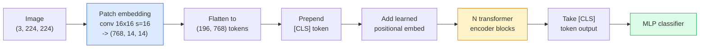

# Vision Transformers (ViT) / 视觉 Transformer（ViT）

> 把图像切成 patches，把每个 patch 当作一个词，跑标准 transformer。然后不要回头。

**Type / 类型：** Build / 构建
**Languages / 语言：** Python
**Prerequisites / 前置知识：** Phase 7 Lesson 02 (Self-Attention), Phase 4 Lesson 04 (Image Classification)
**Time / 时间：** 约 45 分钟

## Learning Objectives / 学习目标

- 从零实现 patch embedding、learned positional embedding、class token 和 transformer encoder blocks，构建一个 minimal ViT
- 解释为什么 ViT 曾被认为需要海量 pretraining data，直到 DeiT 和 MAE 证明并非如此
- 比较 ViT、Swin 和 ConvNeXt 的 architectural priors（无先验、local window attention、conv backbone）
- 使用 `timm` 在小型 dataset 上 fine-tune pretrained ViT，并应用标准 linear-probe / fine-tune recipe

## The Problem / 问题

十年来，convolution 几乎等同于 computer vision。CNNs 有强 inductive biases：locality、translation equivariance，所以大家都认为它不可替代。然后 Dosovitskiy et al.（2020）证明，把 plain transformer 直接应用到 flattened image patches 上，完全不用 convolutional machinery，也能在 scale 足够大时追平或超过最好的 CNNs。

问题在于“at scale”。ImageNet-1k 上的 ViT 输给 ResNet。先在 ImageNet-21k 或 JFT-300M 上 pretrain，再 fine-tune 到 ImageNet-1k，ViT 才赢。结论是：transformer 缺乏有用 prior，但可以从足够数据中学到它们。后续工作（DeiT、MAE、DINO）又证明，只要 training recipe 合适，例如强 augmentation、self-supervised pretraining、distillation，ViTs 在小数据上也能正常训练。

到 2026 年，pure CNNs 在 edge devices 上仍有竞争力（ConvNeXt 最强），但 transformers 主导了其他几乎所有东西：segmentation（Mask2Former、SegFormer）、detection（DETR、RT-DETR）、multimodal（CLIP、SigLIP）、video（VideoMAE、VJEPA）。ViT block structure 是必须掌握的结构。

## The Concept / 概念

### The pipeline / pipeline



七个步骤。Patches -> tokens -> attention -> classifier。每个 variant（DeiT、Swin、ConvNeXt、MAE pretraining）都只改其中一两个步骤，其余保持不变。

### Patch embedding / Patch embedding

第一个 conv 是秘密所在。Kernel size 16、stride 16，因此 224x224 image 会变成 14x14 的 16x16 patches grid，每个 patch 被 projected 成 768-dim embedding。这个单一 conv 同时完成 patchify 和 linear projection。

```
Input:  (3, 224, 224)
Conv (3 -> 768, k=16, s=16, no padding):
Output: (768, 14, 14)
Flatten spatial: (196, 768)
```

196 patches = 196 tokens。每个 token 的 feature dimension 是 768（ViT-B）、1024（ViT-L）或 1280（ViT-H）。

### Class token / Class token

一个 learned vector 被 prepend 到 sequence 前面：

```
tokens = [CLS; patch_1; patch_2; ...; patch_196]   shape (197, 768)
```

经过 N 个 transformer blocks 后，`[CLS]` output 就是 global image representation。Classification head 只读取这一个 vector。

### Positional embedding / Positional embedding

Transformers 没有内置 spatial position 概念。需要给每个 token 加一个 learned vector：

```
tokens = tokens + learned_pos_embedding   (also shape (197, 768))
```

Embedding 是 model parameter；gradient-based training 会让它适应 2D image structure。Sinusoidal 2D alternatives 存在，但实践中很少使用。

### Transformer encoder block / Transformer encoder block

标准结构：multi-head self-attention、MLP、residual connections、pre-LayerNorm。

```
x = x + MSA(LN(x))
x = x + MLP(LN(x))

MLP is two-layer with GELU: Linear(d -> 4d) -> GELU -> Linear(4d -> d)
```

ViT-B/16 堆叠 12 个这样的 blocks，每个 block 有 12 个 attention heads，总计 86M 参数。

### Why pre-LN / 为什么使用 pre-LN

早期 transformers 使用 post-LN（`x = LN(x + sublayer(x))`），没有 warmup 时很难训练超过 6-8 层。Pre-LN（`x = x + sublayer(LN(x))`）可以稳定训练更深网络而不依赖 warmup。每个 ViT 和每个现代 LLM 都使用 pre-LN。

### Patch size trade-off / patch size 权衡

- 16x16 patches -> 196 tokens，标准配置。
- 32x32 patches -> 49 tokens，更快但 resolution 更低。
- 8x8 patches -> 784 tokens，更细，但 O(n^2) attention cost 增长很快。

Patch 越大，tokens 越少，速度越快，但 spatial detail 越少。SwinV2 在 hierarchical windows 中使用 4x4 patches。

### DeiT's recipe for training ViT on ImageNet-1k / DeiT 在 ImageNet-1k 上训练 ViT 的配方

原始 ViT 需要 JFT-300M 才能击败 CNNs。DeiT（Touvron et al., 2020）只用 ImageNet-1k，把 ViT-B 训练到 81.8% top-1，靠四个变化：

1. Heavy augmentation：RandAugment、Mixup、CutMix、Random Erasing。
2. Stochastic depth：训练时随机 drop 整个 blocks。
3. Repeated augmentation：同一张图在每个 batch 中 sample 3 次。
4. 从 CNN teacher 做 distillation（可选，但会进一步提升 accuracy）。

每个现代 ViT training recipe 都继承自 DeiT。

### Swin vs ConvNeXt / Swin vs ConvNeXt

- **Swin**（Liu et al., 2021）：window-based attention。每个 block 只在 local window 内 attend；交替 blocks 会 shift window，以混合跨 window 信息。它把 CNN-like locality prior 带回来，同时保留 attention operator。
- **ConvNeXt**（Liu et al., 2022）：重新设计的 CNN，匹配 Swin 的 architecture choices（depthwise convs、LayerNorm、GELU、inverted bottleneck）。它证明差距不是 “attention vs convolution”，而是 “modern training recipe + architecture”。

2026 年，ConvNeXt-V2 和 Swin-V2 都是 production-grade；选择取决于 inference stack（ConvNeXt 更适合 edge 编译）和 pretraining corpus。

### MAE pretraining / MAE pretraining

Masked Autoencoder（He et al., 2022）：随机 mask 75% patches，训练 encoder 只处理可见的 25%，训练一个小 decoder 从 encoder output 重建 masked patches。Pretraining 后丢弃 decoder，只 fine-tune encoder。

MAE 让 ViT 只用 ImageNet-1k 也能训练，达到 SOTA，并成为当前默认 self-supervised recipe。

## Build It / 动手构建

### Step 1: Patch embedding / Step 1：patch embedding

```python
import torch
import torch.nn as nn

class PatchEmbedding(nn.Module):
    def __init__(self, in_channels=3, patch_size=16, dim=192, image_size=64):
        super().__init__()
        assert image_size % patch_size == 0
        self.proj = nn.Conv2d(in_channels, dim, kernel_size=patch_size, stride=patch_size)
        num_patches = (image_size // patch_size) ** 2
        self.num_patches = num_patches

    def forward(self, x):
        x = self.proj(x)
        return x.flatten(2).transpose(1, 2)
```

一个 conv、一个 flatten、一个 transpose。这就是完整 image-to-tokens step。

### Step 2: Transformer block / Step 2：transformer block

Pre-LN、multi-head self-attention、带 GELU 的 MLP、residual connections。

```python
class Block(nn.Module):
    def __init__(self, dim, num_heads, mlp_ratio=4, dropout=0.0):
        super().__init__()
        self.ln1 = nn.LayerNorm(dim)
        self.attn = nn.MultiheadAttention(dim, num_heads, dropout=dropout, batch_first=True)
        self.ln2 = nn.LayerNorm(dim)
        self.mlp = nn.Sequential(
            nn.Linear(dim, dim * mlp_ratio),
            nn.GELU(),
            nn.Dropout(dropout),
            nn.Linear(dim * mlp_ratio, dim),
            nn.Dropout(dropout),
        )

    def forward(self, x):
        a, _ = self.attn(self.ln1(x), self.ln1(x), self.ln1(x), need_weights=False)
        x = x + a
        x = x + self.mlp(self.ln2(x))
        return x
```

`nn.MultiheadAttention` 会处理 heads 拆分、scaled dot-product 和 output projection。`batch_first=True`，所以 shape 是 `(N, seq, dim)`。

### Step 3: The ViT / Step 3：ViT

```python
class ViT(nn.Module):
    def __init__(self, image_size=64, patch_size=16, in_channels=3,
                 num_classes=10, dim=192, depth=6, num_heads=3, mlp_ratio=4):
        super().__init__()
        self.patch = PatchEmbedding(in_channels, patch_size, dim, image_size)
        num_patches = self.patch.num_patches
        self.cls_token = nn.Parameter(torch.zeros(1, 1, dim))
        self.pos_embed = nn.Parameter(torch.zeros(1, num_patches + 1, dim))
        self.blocks = nn.ModuleList([
            Block(dim, num_heads, mlp_ratio) for _ in range(depth)
        ])
        self.ln = nn.LayerNorm(dim)
        self.head = nn.Linear(dim, num_classes)
        nn.init.trunc_normal_(self.pos_embed, std=0.02)
        nn.init.trunc_normal_(self.cls_token, std=0.02)

    def forward(self, x):
        x = self.patch(x)
        cls = self.cls_token.expand(x.size(0), -1, -1)
        x = torch.cat([cls, x], dim=1)
        x = x + self.pos_embed
        for blk in self.blocks:
            x = blk(x)
        x = self.ln(x[:, 0])
        return self.head(x)

vit = ViT(image_size=64, patch_size=16, num_classes=10, dim=192, depth=6, num_heads=3)
x = torch.randn(2, 3, 64, 64)
print(f"output: {vit(x).shape}")
print(f"params: {sum(p.numel() for p in vit.parameters()):,}")
```

约 2.8M 参数，是 CPU 可跑的 tiny ViT。真实 ViT-B 是 86M；同一个 class definition 只需要设 `dim=768, depth=12, num_heads=12`。

### Step 4: Sanity check — single image inference / Step 4：sanity check：单图 inference

```python
logits = vit(torch.randn(1, 3, 64, 64))
print(f"logits: {logits}")
print(f"probs:  {logits.softmax(-1)}")
```

应该能无错误运行。Probabilities 之和为 1。

## Use It / 应用它

`timm` 提供每个 ViT variant 的 ImageNet pretrained weights。一行代码：

```python
import timm

model = timm.create_model("vit_base_patch16_224", pretrained=True, num_classes=10)
```

`timm` 是 2026 年 vision transformers 的 production default。ViT、DeiT、Swin、Swin-V2、ConvNeXt、ConvNeXt-V2、MaxViT、MViT、EfficientFormer 以及几十个其他模型都使用同一 API。

Multi-modal 工作（image + text）使用 `transformers` 中的 CLIP、SigLIP、BLIP-2、LLaVA。这些模型的 image encoder 都是 ViT variant。

## Ship It / 交付它

本课产出：

- `outputs/prompt-vit-vs-cnn-picker.md`：一个 prompt，基于 dataset size、compute 和 inference stack，在 ViT、ConvNeXt、Swin 之间选择。
- `outputs/skill-vit-patch-and-pos-embed-inspector.md`：一个 skill，验证 ViT patch embedding 和 positional embedding shapes 是否匹配 model 预期 sequence length，抓住最常见的 porting bugs。

## Exercises / 练习

1. **(Easy / 简单)** 打印上面 tiny ViT 一次 forward 中每个 intermediate tensor 的 shape。确认：input `(N, 3, 64, 64)` -> patches `(N, 16, 192)` -> with CLS `(N, 17, 192)` -> classifier input `(N, 192)` -> output `(N, num_classes)`。
2. **(Medium / 中等)** 在 Lesson 4 的 synthetic-CIFAR dataset 上 fine-tune pretrained `timm` ViT-S/16。与同一数据上的 ResNet-18 fine-tuning 对比。报告 training time 和 final accuracy。
3. **(Hard / 困难)** 为 tiny ViT 实现 MAE pretraining：mask 75% patches，训练 encoder + small decoder 重建 masked patches。在 synthetic data 上评估 pretraining 前后的 linear-probe accuracy。

## Key Terms / 关键术语

| 术语 | 常见说法 | 实际含义 |
|------|----------------|----------------------|
| Patch embedding | “第一层 conv” | kernel size = stride = patch size 的 conv；把 image 转成 token embeddings grid |
| Class token | “[CLS]” | prepend 到 token sequence 前的 learned vector；其最终 output 是 global image representation |
| Positional embedding | “learned pos” | 加到每个 token 上的 learned vector，让 transformer 知道每个 patch 来自哪里 |
| Pre-LN | “sublayer 前的 LayerNorm” | 稳定 transformer variant：`x + sublayer(LN(x))`，而不是 `LN(x + sublayer(x))` |
| Multi-head attention | “parallel attention” | 标准 transformer attention 被拆成 num_heads 个独立 subspaces，之后 concatenate |
| ViT-B/16 | “Base, patch 16” | 经典尺寸：dim=768、depth=12、heads=12、patch_size=16、image=224；约 86M params |
| DeiT | “Data-efficient ViT” | 只用 ImageNet-1k 加强 augmentation 训练 ViT；证明大规模 pretraining dataset 并非绝对必要 |
| MAE | “Masked autoencoder” | Self-supervised pretraining：mask 75% patches 并重建；主流 ViT pretraining recipe |

## Further Reading / 延伸阅读

- [An Image is Worth 16x16 Words (Dosovitskiy et al., 2020)](https://arxiv.org/abs/2010.11929)：ViT 论文
- [DeiT: Data-efficient Image Transformers (Touvron et al., 2020)](https://arxiv.org/abs/2012.12877)：如何只用 ImageNet-1k 训练 ViT
- [Masked Autoencoders are Scalable Vision Learners (He et al., 2022)](https://arxiv.org/abs/2111.06377)：MAE pretraining
- [timm documentation](https://huggingface.co/docs/timm)：生产中会用到的每个 vision transformer 的参考
