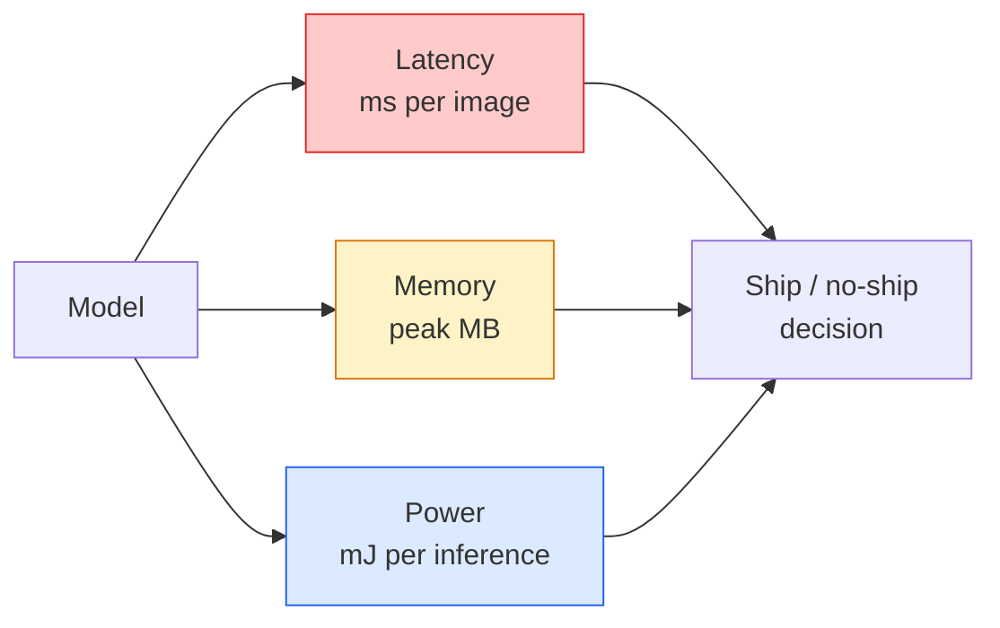

# Real-Time Vision — Edge Deployment / 实时视觉：边缘部署

> Edge inference 的核心，是让一个 90-accuracy model 在只有 2 GB RAM 的设备上跑到 30 fps。每一个 accuracy 百分点都要和几毫秒 latency 交换。

**Type / 类型：** Learn + Build / 学习 + 构建
**Languages / 语言：** Python
**Prerequisites / 前置知识：** Phase 4 Lesson 04 (Image Classification), Phase 10 Lesson 11 (Quantization)
**Time / 时间：** 约 75 分钟

## Learning Objectives / 学习目标

- 测量任意 PyTorch model 的 inference latency、peak memory 和 throughput，并读取 FLOPs / params / latency trade-off
- 使用 PyTorch post-training quantisation 把 vision model quantise 到 INT8，并验证 accuracy loss < 1%
- Export 到 ONNX，并用 ONNX Runtime 或 TensorRT compile；说出三类最常见 export failures 及修复方法
- 解释在 edge constraint 下何时选择 MobileNetV3、EfficientNet-Lite、ConvNeXt-Tiny 或 MobileViT

## The Problem / 问题

Training-time vision model 是 floating-point monster。100M parameters、每次 forward 10 GFLOPs、2 GB VRAM。它们无法放进手机、车机、工业相机或无人机。上线一个 vision system，意味着把同样的预测能力塞进小 100 倍的预算。

三个旋钮完成大部分工作：model choice（用同样 recipe 的更小架构）、quantisation（INT8 替代 FP32）和 inference runtime（ONNX Runtime、TensorRT、Core ML、TFLite）。调对它们，就是 workstation demo 和能跑在 30 美元 camera module 上的产品之间的差别。

本课先建立 measurement discipline（你无法优化无法测量的东西），再走过三个旋钮。目标不是学会每个 edge runtime，而是知道有哪些 levers，以及如何验证每个 lever 是否真的按你想的那样工作。

## The Concept / 概念

### The three budgets / 三个预算



- **Latency**：p50、p95、p99。只看 p50 会隐藏 real-time system 关心的 tail behaviour。
- **Peak memory**：设备曾经看到的最大值，而不是 steady-state average。Embedded target 上 OOM 是致命的。
- **Power / energy**：battery-powered device 上每次 inference 的 millijoules。通常用 CPU/GPU utilisation * time 近似。

Edge decision 来自一张 (model, latency, memory, accuracy) 表。每个 cell 都必须在 target device 上测量，而不是 workstation。

### Measurement discipline / 测量纪律

每次 edge profile 都要遵守三条规则：

1. 测量前用 5-10 次 dummy forward passes **warm up** model。Cold caches 和 JIT compilation 会产生没有代表性的首个数字。
2. GPU workload 在 timed block 前后用 `torch.cuda.synchronize()` **synchronise**。否则你测到的是 kernel dispatch，不是 kernel execution。
3. 把 input sizes 固定到 production resolution。224x224 的 latency 不是 512x512 的 latency。

### FLOPs as a proxy / FLOPs 作为 proxy

FLOPs（每次 inference 的 floating-point operations）是便宜且 device-independent 的 latency proxy。它适合 architecture comparison，但不能当作绝对 wall-clock。一个 FLOPs 多 10% 的 model，在实践中可能快 2 倍，因为它使用了硬件友好的 ops（depthwise convs 编译得好，大 7x7 convs 不一定）。

规则：architecture search 用 FLOPs，deployment decision 用 on-device latency。

### Quantisation in one paragraph / 一段话理解 quantisation

用 INT8 替换 FP32 weights 和 activations。Model size 降 4 倍，memory bandwidth 降 4 倍，在有 INT8 kernels 的硬件上 compute 降 2-4 倍（每个现代 mobile SoC、每个带 Tensor Cores 的 NVIDIA GPU）。Vision task 上 post-training static quantisation 的 accuracy loss 通常只有 0.1-1 percentage points。

类型：

- **Dynamic**：weights quantise 到 INT8，activations 仍用 FP 计算。简单，提速小。
- **Static (post-training)**：quantise weights，并用小 calibration set 校准 activation ranges。比 dynamic 快得多。
- **Quantisation-aware training (QAT)**：训练时模拟 quantisation，让 model 学会绕开它。Accuracy 最好，需要 labelled data。

对视觉来说，post-training static quantisation 用 5% 的努力拿到 95% 的收益。只有 PTQ accuracy loss 不可接受时才用 QAT。

### Pruning and distillation / Pruning 与 distillation

- **Pruning**：移除不重要 weights（magnitude-based）或 channels（structured）。对 overparameterised models 很有用，对已经紧凑的 architectures 作用较小。
- **Distillation**：训练小 student 模仿大 teacher 的 logits。通常能恢复大部分因缩小模型损失的 accuracy。生产 edge models 的标准做法。

### The inference runtimes / inference runtimes

- **PyTorch eager**：慢，不适合部署。只用于开发。
- **TorchScript**：legacy。已被 `torch.compile` 和 ONNX export 取代。
- **ONNX Runtime**：中立 runtime。CPU、CUDA、CoreML、TensorRT、OpenVINO 都有 ONNX providers。从这里开始。
- **TensorRT**：NVIDIA compiler。NVIDIA GPUs（workstation 和 Jetson）上 latency 最好。可与 ONNX Runtime 集成，也可 standalone。
- **Core ML**：Apple iOS/macOS runtime。需要 `.mlmodel` 或 `.mlpackage`。
- **TFLite**：Google Android/ARM runtime。需要 `.tflite`。
- **OpenVINO**：Intel CPU/VPU runtime。需要 `.xml` + `.bin`。

实践路径：PyTorch -> ONNX -> 根据 target 选择 runtime。ONNX 是 lingua franca。

### Edge architecture picker / edge 架构选择器

| Budget / 预算 | Model | Why / 原因 |
|--------|-------|-----|
| < 3M params | MobileNetV3-Small | 到处都能编译，优秀 baseline |
| 3-10M | EfficientNet-Lite-B0 | TFLite 上 param accuracy 最好 |
| 10-20M | ConvNeXt-Tiny | accuracy-per-param 最好，对 CPU 友好 |
| 20-30M | MobileViT-S or EfficientViT | 具备 ImageNet accuracy 的 transformer |
| 30-80M | Swin-V2-Tiny | 如果 stack 支持 window attention |

除非有明确理由，否则这些模型都 quantise 到 INT8。

```figure
cnn-param-count
```

## Build It / 动手构建

### Step 1: Measure latency correctly / Step 1：正确测量 latency

```python
import time
import torch

def measure_latency(model, input_shape, device="cpu", warmup=10, iters=50):
    model = model.to(device).eval()
    x = torch.randn(input_shape, device=device)
    with torch.no_grad():
        for _ in range(warmup):
            model(x)
        if device == "cuda":
            torch.cuda.synchronize()
        times = []
        for _ in range(iters):
            if device == "cuda":
                torch.cuda.synchronize()
            t0 = time.perf_counter()
            model(x)
            if device == "cuda":
                torch.cuda.synchronize()
            times.append((time.perf_counter() - t0) * 1000)
    times.sort()
    return {
        "p50_ms": times[len(times) // 2],
        "p95_ms": times[int(len(times) * 0.95)],
        "p99_ms": times[int(len(times) * 0.99)],
        "mean_ms": sum(times) / len(times),
    }
```

Warm up、synchronise、使用 `time.perf_counter()`。报告 percentiles，不只报告 mean。

### Step 2: Parameter and FLOP counts / Step 2：parameter 与 FLOP counts

```python
def parameter_count(model):
    return sum(p.numel() for p in model.parameters())

def flops_estimate(model, input_shape):
    """
    Rough FLOP count for a conv/linear-only model. For production use `fvcore` or `ptflops`.
    """
    total = 0
    def conv_hook(m, inp, out):
        nonlocal total
        c_out, c_in, kh, kw = m.weight.shape
        h, w = out.shape[-2:]
        total += 2 * c_in * c_out * kh * kw * h * w
    def linear_hook(m, inp, out):
        nonlocal total
        total += 2 * m.in_features * m.out_features
    hooks = []
    for m in model.modules():
        if isinstance(m, torch.nn.Conv2d):
            hooks.append(m.register_forward_hook(conv_hook))
        elif isinstance(m, torch.nn.Linear):
            hooks.append(m.register_forward_hook(linear_hook))
    model.eval()
    with torch.no_grad():
        model(torch.randn(input_shape))
    for h in hooks:
        h.remove()
    return total
```

真实项目使用 `fvcore.nn.FlopCountAnalysis` 或 `ptflops`；它们能正确处理每种 module type。

### Step 3: Post-training static quantisation / Step 3：post-training static quantisation

```python
def quantise_ptq(model, calibration_loader, backend="x86"):
    import torch.ao.quantization as tq
    model = model.eval().cpu()
    model.qconfig = tq.get_default_qconfig(backend)
    tq.prepare(model, inplace=True)
    with torch.no_grad():
        for x, _ in calibration_loader:
            model(x)
    tq.convert(model, inplace=True)
    return model
```

三步：configure、prepare（插入 observers）、用真实数据 calibrate、convert（fuse + quantise）。要求 model 已经 fused（`Conv -> BN -> ReLU` -> `ConvBnReLU`），可用 `torch.ao.quantization.fuse_modules` 处理。

### Step 4: Export to ONNX / Step 4：export 到 ONNX

```python
def export_onnx(model, sample_input, path="model.onnx"):
    model = model.eval()
    torch.onnx.export(
        model,
        sample_input,
        path,
        input_names=["input"],
        output_names=["output"],
        dynamic_axes={"input": {0: "batch"}, "output": {0: "batch"}},
        opset_version=17,
    )
    return path
```

`opset_version=17` 是 2026 年安全默认值。`dynamic_axes` 让 ONNX model 支持任意 batch size。

### Step 5: Benchmark and compare regimes / Step 5：benchmark 并比较不同 regime

```python
import torch.nn as nn
from torchvision.models import mobilenet_v3_small

def compare_regimes():
    model = mobilenet_v3_small(weights=None, num_classes=10)
    params = parameter_count(model)
    flops = flops_estimate(model, (1, 3, 224, 224))
    lat_fp32 = measure_latency(model, (1, 3, 224, 224), device="cpu")
    print(f"FP32 MobileNetV3-Small: {params:,} params  {flops/1e9:.2f} GFLOPs  "
          f"p50={lat_fp32['p50_ms']:.2f}ms  p95={lat_fp32['p95_ms']:.2f}ms")
```

对 `resnet50`、`efficientnet_v2_s` 和 `convnext_tiny` 运行同一个函数，就能得到部署决策需要的 comparison table。

## Use It / 应用它

Production stacks 通常收敛到三条路径之一：

- **Web / serverless**：PyTorch -> ONNX -> ONNX Runtime（CPU 或 CUDA provider）。最简单，对大多数任务足够。
- **NVIDIA edge (Jetson, GPU server)**：PyTorch -> ONNX -> TensorRT。Latency 最好，工程量最大。
- **Mobile**：PyTorch -> ONNX -> Core ML（iOS）或 TFLite（Android）。Export 前 quantise。

测量工具：`torch-tb-profiler`、`nvprof` / `nsys`，以及 macOS Instruments 可以给出 layer-by-layer breakdowns。`benchmark_app`（OpenVINO）和 `trtexec`（TensorRT）给 standalone CLI numbers。

## Ship It / 交付它

本课产出：

- `outputs/prompt-edge-deployment-planner.md`：一个 prompt，基于 target device 和 latency SLA 选择 backbone、quantisation strategy 和 runtime。
- `outputs/skill-latency-profiler.md`：一个 skill，生成完整 latency-benchmarking script，包含 warmup、synchronisation、percentiles 和 memory tracking。

## Exercises / 练习

1. **(Easy / 简单)** 在 CPU 上以 224x224 测量 `resnet18`、`mobilenet_v3_small`、`efficientnet_v2_s` 和 `convnext_tiny` 的 p50 latency。报告表格，并指出哪个 architecture 的 accuracy-per-ms 最好。
2. **(Medium / 中等)** 对 `mobilenet_v3_small` 应用 post-training static quantisation。在 CIFAR-10 或类似 held-out subset 上报告 FP32 vs INT8 latency 和 accuracy loss。
3. **(Hard / 困难)** 把 `convnext_tiny` export 到 ONNX，用 `CPUExecutionProvider` 跑 `onnxruntime`，并与 PyTorch eager baseline 比较 latency。找出 ONNX Runtime 第一个更快的 layer，并解释原因。

## Key Terms / 关键术语

| 术语 | 常见说法 | 实际含义 |
|------|----------------|----------------------|
| Latency | “多快” | 从 input 到 output 的时间；看 p50/p95/p99 percentiles，而不是 mean |
| FLOPs | “model size” | 每次 forward 的 floating-point ops；compute cost 的粗略 proxy |
| INT8 quantisation | “8-bit” | 用 8-bit integers 替换 FP32 weights/activations；约小 4 倍、快 2-4 倍 |
| PTQ | “Post-training quantisation” | 不重新训练就 quantise 训练好的 model；简单，通常足够 |
| QAT | “Quantisation-aware training” | 训练时模拟 quantisation；accuracy 最好，需要 labelled data |
| ONNX | “中立格式” | 每个主流 inference runtime 都支持的 model exchange format |
| TensorRT | “NVIDIA compiler” | 把 ONNX 编译成面向 NVIDIA GPUs 的 optimised engine |
| Distillation | “Teacher -> student” | 训练小模型模仿大模型 logits；恢复大部分损失的 accuracy |

## Further Reading / 延伸阅读

- [EfficientNet (Tan & Le, 2019)](https://arxiv.org/abs/1905.11946)：efficient architectures 的 compound scaling
- [MobileNetV3 (Howard et al., 2019)](https://arxiv.org/abs/1905.02244)：带 h-swish 和 squeeze-excite 的 mobile-first architecture
- [A Practical Guide to TensorRT Optimization (NVIDIA)](https://developer.nvidia.com/blog/accelerating-model-inference-with-tensorrt-tips-and-best-practices-for-pytorch-users/)：如何真正拿到论文里的 throughput 数字
- [ONNX Runtime docs](https://onnxruntime.ai/docs/)：quantisation、graph optimisation、provider selection
