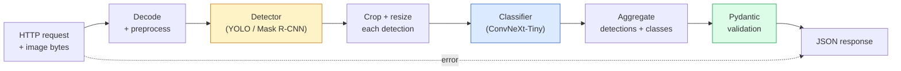

# Build a Complete Vision Pipeline — Capstone / 构建完整视觉 Pipeline：Capstone

> 生产级视觉系统是一串 models 和 rules，用 data contracts 串起来。本 phase 的部件已经准备好；capstone 会把它们端到端连接起来。

**Type / 类型：** Build / 构建
**Languages / 语言：** Python
**Prerequisites / 前置知识：** Phase 4 Lessons 01-15
**Time / 时间：** 约 120 分钟

## Learning Objectives / 学习目标

- 设计一个 production vision pipeline：检测 objects、分类它们、输出 structured JSON，并处理每条 failure path
- 把 detector（Mask R-CNN 或 YOLO）、classifier（ConvNeXt-Tiny）和 data contract（Pydantic）接入同一个 service
- Benchmark end-to-end pipeline，并识别第一个 bottleneck（通常先是 preprocessing，然后是 detector）
- 交付一个 minimal FastAPI service，接受 image upload，运行 pipeline，并返回带 classifications 的 detections

## The Problem / 问题

单个 vision model 很有用；vision product 则是一串 model。Retail shelf audit 是 detector 加 product classifier 加 price-OCR pipeline。Autonomous driving 是 2D detector 加 3D detector 加 segmenter 加 tracker 加 planner。Medical pre-screen 是 segmenter 加 region classifier 加 clinician UI。

把这些 chain 接起来，才是 ML prototype 与 product 的分界。Models 之间的每个 interface 都是新的 bug 入口。每次 coordinate transform、每次 normalisation、每次 mask resize 都可能静默失败。Pipeline 的强度取决于最弱的 interface。

这个 capstone 搭建 minimum viable pipeline：detection + classification + structured output + serving layer。Phase 4 里的其他所有东西都能插进这个 skeleton：把 Mask R-CNN 换成 YOLOv8，加 OCR head，加 segmentation branch，加 tracker。架构稳定，部件可插拔。

## The Concept / 概念

### The pipeline / pipeline



七个阶段。两个 model stage 昂贵；另外五个 stage 最容易藏 bug。

### Data contracts with Pydantic / 用 Pydantic 做 data contracts

每个 model boundary 都变成 typed object。这样可以把 silent failures 变成 loud failures。

```
Detection(
    box: tuple[float, float, float, float],   # (x1, y1, x2, y2), absolute pixels
    score: float,                              # [0, 1]
    class_id: int,                             # from detector's label map
    mask: Optional[list[list[int]]],           # RLE-encoded if present
)

PipelineResult(
    image_id: str,
    detections: list[Detection],
    classifications: list[Classification],
    inference_ms: float,
)
```

当 detector 返回 `(cx, cy, w, h)` 而不是 `(x1, y1, x2, y2)` 的 boxes 时，Pydantic validation 会在 boundary 失败，你会立刻知道问题，而不是去 debug 下游某个悄悄返回 empty regions 的 crop。

### Where latency goes / latency 花在哪里

几乎每个 vision pipeline 都有三条真相：

1. **Preprocessing 常常是最大的单块。** JPEG decode、colour space conversion、resizing 都是 CPU-bound，而且容易被忘掉。
2. **Detector 主导 GPU time。** 70-90% GPU time 在 detection forward pass。
3. **Postprocessing（NMS、RLE encode/decode）在 GPU 上便宜，在 CPU 上昂贵。** 一定要用真实 target profile。

知道分布，才能把 optimisation 变成按优先级排序的列表。

### Failure modes / 失败模式

- **Empty detections**：返回 empty list，不要 crash。记录日志。
- **Out-of-bounds boxes**：crop 前 clamp 到 image size。
- **Tiny crops**：小于 classifier minimum input 的 boxes 跳过 classification。
- **Corrupt upload**：返回带具体 error code 的 400，不要返回 500。
- **Model load failure**：service startup 时失败，不要等到第一条 request。

Production pipeline 会处理每种情况，但不会写隐藏失败的 generic `try/except`。每个 failure 都有命名 code 和 response。

### Batching / Batching

生产 service 会服务多个 clients。跨 requests batching detections 和 classifications 可以倍增 throughput。权衡是：等待 batch 填满会增加 latency。典型设置：最多收集 20ms 内的 requests，batch 处理，再分发 responses。`torchserve` 和 `triton` 原生支持；负载可预测的小服务可以自己写 micro-batcher。

## Build It / 动手构建

### Step 1: Data contracts / Step 1：data contracts

```python
from pydantic import BaseModel, Field
from typing import List, Optional, Tuple

class Detection(BaseModel):
    box: Tuple[float, float, float, float]
    score: float = Field(ge=0, le=1)
    class_id: int = Field(ge=0)
    mask_rle: Optional[str] = None


class Classification(BaseModel):
    detection_index: int
    class_id: int
    class_name: str
    score: float = Field(ge=0, le=1)


class PipelineResult(BaseModel):
    image_id: str
    detections: List[Detection]
    classifications: List[Classification]
    inference_ms: float
```

五秒钟代码，可以在任何严肃 pipeline 中省掉一小时 debug。

### Step 2: A minimal Pipeline class / Step 2：一个 minimal Pipeline class

```python
import time
import numpy as np
import torch
from PIL import Image

class VisionPipeline:
    def __init__(self, detector, classifier, class_names,
                 device="cpu", min_crop=32):
        self.detector = detector.to(device).eval()
        self.classifier = classifier.to(device).eval()
        self.class_names = class_names
        self.device = device
        self.min_crop = min_crop

    def preprocess(self, image):
        """
        image: PIL.Image or np.ndarray (H, W, 3) uint8
        returns: CHW float tensor on device
        """
        if isinstance(image, Image.Image):
            image = np.asarray(image.convert("RGB"))
        tensor = torch.from_numpy(image).permute(2, 0, 1).float() / 255.0
        return tensor.to(self.device)

    @torch.no_grad()
    def detect(self, image_tensor):
        return self.detector([image_tensor])[0]

    @torch.no_grad()
    def classify(self, crops):
        if len(crops) == 0:
            return []
        batch = torch.stack(crops).to(self.device)
        logits = self.classifier(batch)
        probs = logits.softmax(-1)
        scores, cls = probs.max(-1)
        return list(zip(cls.tolist(), scores.tolist()))

    def run(self, image, image_id="anonymous"):
        t0 = time.perf_counter()
        tensor = self.preprocess(image)
        det = self.detect(tensor)

        crops = []
        detections = []
        valid_indices = []
        for i, (box, score, cls) in enumerate(zip(det["boxes"], det["scores"], det["labels"])):
            x1, y1, x2, y2 = [max(0, int(b)) for b in box.tolist()]
            x2 = min(x2, tensor.shape[-1])
            y2 = min(y2, tensor.shape[-2])
            detections.append(Detection(
                box=(x1, y1, x2, y2),
                score=float(score),
                class_id=int(cls),
            ))
            if (x2 - x1) < self.min_crop or (y2 - y1) < self.min_crop:
                continue
            crop = tensor[:, y1:y2, x1:x2]
            crop = torch.nn.functional.interpolate(
                crop.unsqueeze(0),
                size=(224, 224),
                mode="bilinear",
                align_corners=False,
            )[0]
            crops.append(crop)
            valid_indices.append(i)

        class_preds = self.classify(crops)

        classifications = []
        for valid_idx, (cls_id, cls_score) in zip(valid_indices, class_preds):
            classifications.append(Classification(
                detection_index=valid_idx,
                class_id=int(cls_id),
                class_name=self.class_names[cls_id],
                score=float(cls_score),
            ))

        return PipelineResult(
            image_id=image_id,
            detections=detections,
            classifications=classifications,
            inference_ms=(time.perf_counter() - t0) * 1000,
        )
```

每个 interface 都有类型。每条 failure path 都有明确处理决策。

### Step 3: Wire a detector and a classifier / Step 3：接入 detector 和 classifier

```python
from torchvision.models.detection import maskrcnn_resnet50_fpn_v2
from torchvision.models import convnext_tiny

# Use ImageNet-pretrained weights for a realistic pipeline without training
detector = maskrcnn_resnet50_fpn_v2(weights="DEFAULT")
classifier = convnext_tiny(weights="DEFAULT")
class_names = [f"imagenet_class_{i}" for i in range(1000)]

pipe = VisionPipeline(detector, classifier, class_names)

# Smoke test with a synthetic image
test_image = (np.random.rand(400, 600, 3) * 255).astype(np.uint8)
result = pipe.run(test_image, image_id="demo")
print(result.model_dump_json(indent=2)[:500])
```

### Step 4: FastAPI service / Step 4：FastAPI service

```python
from fastapi import FastAPI, UploadFile, HTTPException
from io import BytesIO

app = FastAPI()
pipe = None  # initialised on startup

@app.on_event("startup")
def load():
    global pipe
    detector = maskrcnn_resnet50_fpn_v2(weights="DEFAULT").eval()
    classifier = convnext_tiny(weights="DEFAULT").eval()
    pipe = VisionPipeline(detector, classifier, class_names=[f"c{i}" for i in range(1000)])

@app.post("/detect")
async def detect_endpoint(file: UploadFile):
    if file.content_type not in {"image/jpeg", "image/png", "image/webp"}:
        raise HTTPException(status_code=400, detail="unsupported image type")
    data = await file.read()
    try:
        img = Image.open(BytesIO(data)).convert("RGB")
    except Exception:
        raise HTTPException(status_code=400, detail="cannot decode image")
    result = pipe.run(img, image_id=file.filename or "upload")
    return result.model_dump()
```

用 `uvicorn main:app --host 0.0.0.0 --port 8000` 运行。用 `curl -F 'file=@dog.jpg' http://localhost:8000/detect` 测试。

### Step 5: Benchmark the pipeline / Step 5：benchmark pipeline

```python
import time

def benchmark(pipe, num_runs=20, image_size=(400, 600)):
    img = (np.random.rand(*image_size, 3) * 255).astype(np.uint8)
    pipe.run(img)  # warm up

    stages = {"preprocess": [], "detect": [], "classify": [], "total": []}
    for _ in range(num_runs):
        t0 = time.perf_counter()
        tensor = pipe.preprocess(img)
        t1 = time.perf_counter()
        det = pipe.detect(tensor)
        t2 = time.perf_counter()
        crops = []
        for box in det["boxes"]:
            x1, y1, x2, y2 = [max(0, int(b)) for b in box.tolist()]
            x2 = min(x2, tensor.shape[-1])
            y2 = min(y2, tensor.shape[-2])
            if (x2 - x1) >= pipe.min_crop and (y2 - y1) >= pipe.min_crop:
                crop = tensor[:, y1:y2, x1:x2]
                crop = torch.nn.functional.interpolate(
                    crop.unsqueeze(0), size=(224, 224), mode="bilinear", align_corners=False
                )[0]
                crops.append(crop)
        pipe.classify(crops)
        t3 = time.perf_counter()
        stages["preprocess"].append((t1 - t0) * 1000)
        stages["detect"].append((t2 - t1) * 1000)
        stages["classify"].append((t3 - t2) * 1000)
        stages["total"].append((t3 - t0) * 1000)

    for stage, times in stages.items():
        times.sort()
        print(f"{stage:12s}  p50={times[len(times)//2]:7.1f} ms  p95={times[int(len(times)*0.95)]:7.1f} ms")
```

CPU 上典型输出：preprocess ~3 ms，detect 300-500 ms，classify 20-40 ms，total 350-550 ms。GPU 上 detect 是 20-40 ms，preprocess + classify 的相对重要性会更高。

## Use It / 应用它

Production template 通常会收敛到同一结构，再加上：

- **Model versioning**：response 中永远记录 model name 和 weights hash。
- **Per-request trace IDs**：每个 request 记录每个 stage timing，方便把 slow response 关联到具体 stage。
- **Fallback path**：如果 classifier timeout，返回 detections without classifications，而不是让整个 request 失败。
- **Safety filters**：NSFW / PII filters 在 classification 后、response 离开 service 前运行。
- **Batch endpoint**：`/detect_batch` 接收 image URLs list，用于 bulk processing。

生产 serving 中，`torchserve`、`Triton Inference Server` 和 `BentoML` 原生处理 batching、versioning、metrics 和 health checks。直接运行 `FastAPI` 适合 prototypes 和 small-scale products。

## Ship It / 交付它

本课产出：

- `outputs/prompt-vision-service-shape-reviewer.md`：一个 prompt，review vision service code 中的 contract/response shape violations，并指出第一个 breaking bug。
- `outputs/skill-pipeline-budget-planner.md`：一个 skill，给定 target latency 和 throughput，为每个 pipeline stage 分配时间预算，并标记哪个 stage 会最先 miss budget。

## Exercises / 练习

1. **(Easy / 简单)** 在任意 open dataset 的 10 张图上运行 pipeline。报告每个 stage 的平均时间，以及每张图 detection count 的分布。
2. **(Medium / 中等)** 给 `Detection` 增加 mask output field，并用 RLE 编码。验证即使 10-object image，JSON 也保持在 1MB 以下。
3. **(Hard / 困难)** 在 classifier 前添加 micro-batcher：最多收集 10 ms 的 crops，一次 GPU call 完成分类，再按 request 返回 results。在每秒 5 个 concurrent requests 下测量 throughput gain 和增加的 latency。

## Key Terms / 关键术语

| 术语 | 常见说法 | 实际含义 |
|------|----------------|----------------------|
| Pipeline | “system” | Preprocessing、inference 和 postprocessing steps 的有序 chain，每对 stages 之间都有 typed interface |
| Data contract | “schema” | 每个 stage input/output 都要符合的 Pydantic / dataclass definitions；在 boundary 捕获 integration bugs |
| Preprocessing | “model 前” | Decoding、colour conversion、resizing、normalising；通常是最大的 CPU time sink |
| Postprocessing | “model 后” | NMS、mask resize、threshold、RLE encode；GPU 上便宜，CPU 上贵 |
| Microbatcher | “收集后 forward” | Aggregator 等待固定窗口收集多个 requests，再运行一次 batched forward pass |
| Trace ID | “request id” | 每个 stage 都记录的 per-request identifier，便于 end-to-end tracing slow requests |
| Failure code | “named error” | 每类 failure 的具体 error code，而不是 generic 500；支持 client retry logic |
| Health check | “readiness probe” | 报告 service 是否能响应的轻量 endpoint；loadbalancers 依赖它 |

## Further Reading / 延伸阅读

- [Full Stack Deep Learning — Deploying Models](https://fullstackdeeplearning.com/course/2022/lecture-5-deployment/)：production ML deployment 的经典总览
- [BentoML docs](https://docs.bentoml.com)：带 batching、versioning 和 metrics 的 serving framework
- [torchserve docs](https://pytorch.org/serve/)：PyTorch 官方 serving library
- [NVIDIA Triton Inference Server](https://developer.nvidia.com/triton-inference-server)：支持 batching 和 multi-model 的 high-throughput serving
