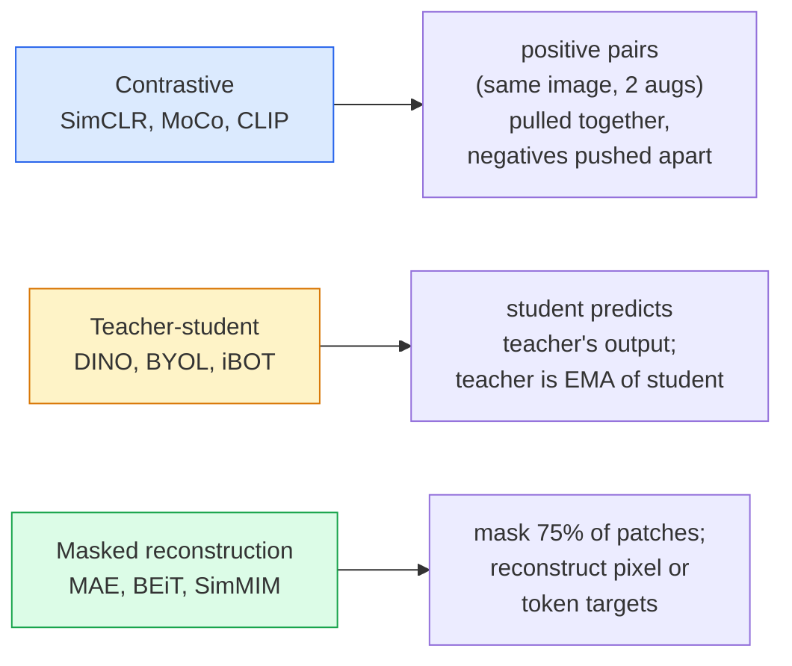

# Self-Supervised Vision — SimCLR, DINO, MAE / 自监督视觉：SimCLR、DINO、MAE

> Labels 是 supervised vision 的瓶颈。Self-supervised pretraining 去掉了它们：从 100M unlabelled images 学视觉特征，再在 10k labelled images 上 fine-tune。

**Type / 类型：** Learn + Build / 学习 + 构建
**Languages / 语言：** Python
**Prerequisites / 前置知识：** Phase 4 Lesson 04 (Image Classification), Phase 4 Lesson 14 (ViT)
**Time / 时间：** 约 75 分钟

## Learning Objectives / 学习目标

- 梳理三类主要 self-supervised families：contrastive（SimCLR）、teacher-student（DINO）、masked reconstruction（MAE），并说明各自优化什么
- 从零实现 InfoNCE loss，并解释为什么 batch size 512 能工作、batch size 32 会失败
- 解释 MAE 的 75% masking ratio 为什么不是随意选择，以及它与 BERT 文本 15% mask 的差异
- 使用 DINOv2 或 MAE ImageNet checkpoints 做 linear probing 和 zero-shot retrieval

## The Problem / 问题

Supervised ImageNet 有 1.3M labelled images，据估算标注成本约 1000 万美元。Medical 和 industrial datasets 更小，标注更贵。每个 vision team 都会问：能否在廉价 unlabelled data 上 pretrain，例如 YouTube frames、web crawls、webcam footage、satellite sweeps，然后在小 labelled set 上 fine-tune？

Self-supervised learning 就是答案。现代 self-supervised ViT 在 LAION 或 JFT 上训练后，fine-tune 时可以达到或超过 supervised ImageNet accuracy。它迁移到 downstream tasks（detection、segmentation、depth）也比 supervised pretraining 更好。DINOv2（Meta, 2023）和 MAE（Meta, 2022）是当前 transferable vision features 的 production default。

概念转变在于：pretext task，也就是 model 训练时做的事，不需要等同于 downstream task。关键是它必须迫使 model 学到有用 features。预测 grayscale images 的颜色、旋转 images 并让 model classify rotation、mask patches 后重建，都曾成功。真正能 scale 的三类方法是 contrastive learning、teacher-student distillation 和 masked reconstruction。

## The Concept / 概念

### Three families / 三类 family



### Contrastive learning (SimCLR) / Contrastive learning（SimCLR）

取一张 image，应用两次 random augmentations，得到两个 views。把二者送入同一个 encoder 加 projection head。最小化一个 loss，表示“这两个 embeddings 应该接近”，同时“这个 embedding 应该远离 batch 中其他 images 的 embeddings”。

```
Loss for positive pair (z_i, z_j) among 2N views per batch:

   L_ij = -log( exp(sim(z_i, z_j) / tau) / sum_k in batch \ {i} exp(sim(z_i, z_k) / tau) )

sim = cosine similarity
tau = temperature (0.1 standard)
```

这就是 InfoNCE loss。它要求每个 positive 有很多 negatives，因此 batch size 很重要，SimCLR 需要 512-8192。MoCo 引入 past batches 的 momentum queue，把 negative count 与 batch size 解耦。

### Teacher-student (DINO) / Teacher-student（DINO）

两个 architecture 相同的 networks：student 和 teacher。Teacher 是 student weights 的 exponential moving average（EMA）。二者看到 image 的 augmented views。训练目标是让 student output 匹配 teacher output，不需要 explicit negatives。

```
loss = CE( student_output(view_1),  teacher_output(view_2) )
     + CE( student_output(view_2),  teacher_output(view_1) )

teacher_weights = m * teacher_weights + (1 - m) * student_weights   (m ≈ 0.996)
```

它为什么不会 collapse 成“预测常数”？Teacher output 会被 centred（减去 per-dimension mean）和 sharpened（除以小 temperature）。Centering 防止某个 dimension 支配输出；sharpening 防止输出 collapse 成 uniform。

DINOv2 在 142M curated images 上放大了 DINO。得到的 features 是当前 zero-shot visual retrieval 和 dense prediction 的 SOTA。

### Masked reconstruction (MAE) / Masked reconstruction（MAE）

Mask 掉 ViT input 的 75% patches。只把可见的 25% 输入 encoder。小 decoder 接收 encoder output，以及 masked positions 的 mask tokens，并训练重建 masked patches 的 pixels。

```
Encoder:  visible 25% of patches -> features
Decoder:  features + mask tokens at masked positions -> reconstructed pixels
Loss:     MSE between reconstructed and original pixels on masked patches only
```

让 MAE 有效的关键设计：

- **75% mask ratio**：很高。迫使 encoder 学语义 features；只重建 25% 会接近 trivial（相邻 pixels 相关性太强，CNN 可以轻松做对）。
- **Asymmetric encoder/decoder**：大的 ViT encoder 只看 visible patches；小 decoder（8-layer, 512-dim）负责 reconstruction。比 naive BEiT pretraining 快 3 倍。
- **Pixel-space reconstruction target**：比 BEiT 的 tokenised target 更简单，而且在 ViT 上效果更好。

Pretraining 后丢弃 decoder。Encoder 就是 feature extractor。

### Why 75% and not 15% / 为什么是 75%，不是 15%

BERT mask 15% tokens。MAE mask 75%。差异来自 information density。

- Natural language 每个 token entropy 高。预测 15% tokens 已经很难，因为每个 masked position 都有很多合理 completions。
- Image patches entropy 低，未 mask 的 neighbourhood 往往几乎完全决定 masked patch 的 pixels。要让 prediction 需要 semantic understanding，就必须 aggressive masking。

75% 高到 simple spatial extrapolation 无法解决任务；encoder 必须表示 image content。

### Linear-probe evaluation / Linear-probe evaluation

Self-supervised pretraining 后，标准评估是 **linear probe**：freeze encoder，在 ImageNet labels 上训练单个 linear classifier。报告 top-1 accuracy。

- SimCLR ResNet-50：~71%（2020）
- DINO ViT-S/16：~77%（2021）
- MAE ViT-L/16：~76%（2022）
- DINOv2 ViT-g/14：~86%（2023）

Linear probe 是纯粹的 feature quality 度量；fine-tuning 通常会再加 2-5 点，但也混入 head retraining 的影响。

## Build It / 动手构建

### Step 1: Two-view augmentation pipeline / Step 1：two-view augmentation pipeline

```python
import torch
import torchvision.transforms as T

two_view_train = lambda: T.Compose([
    T.RandomResizedCrop(96, scale=(0.2, 1.0)),
    T.RandomHorizontalFlip(),
    T.ColorJitter(0.4, 0.4, 0.4, 0.1),
    T.RandomGrayscale(p=0.2),
    T.ToTensor(),
])


class TwoViewDataset(torch.utils.data.Dataset):
    def __init__(self, base):
        self.base = base
        self.aug = two_view_train()

    def __len__(self):
        return len(self.base)

    def __getitem__(self, i):
        img, _ = self.base[i]
        v1 = self.aug(img)
        v2 = self.aug(img)
        return v1, v2
```

每个 `__getitem__` 返回同一 image 的两个 augmented views；不需要 labels。

### Step 2: InfoNCE loss / Step 2：InfoNCE loss

```python
import torch.nn.functional as F

def info_nce(z1, z2, tau=0.1):
    """
    z1, z2: (N, D) L2-normalised embeddings of paired views
    """
    N, D = z1.shape
    z = torch.cat([z1, z2], dim=0)  # (2N, D)
    sim = z @ z.T / tau              # (2N, 2N)

    mask = torch.eye(2 * N, dtype=torch.bool, device=z.device)
    sim = sim.masked_fill(mask, float("-inf"))

    targets = torch.cat([torch.arange(N, 2 * N), torch.arange(0, N)]).to(z.device)
    return F.cross_entropy(sim, targets)
```

调用前要 L2-normalise embeddings。`tau=0.1` 是 SimCLR 默认值；更低的 tau 会让 loss 更尖锐，并需要更多 negatives。

### Step 3: Sanity check InfoNCE / Step 3：sanity check InfoNCE

```python
z1 = F.normalize(torch.randn(16, 32), dim=-1)
z2 = z1.clone()
loss_same = info_nce(z1, z2, tau=0.1).item()
z2_random = F.normalize(torch.randn(16, 32), dim=-1)
loss_random = info_nce(z1, z2_random, tau=0.1).item()
print(f"InfoNCE with identical pairs:  {loss_same:.3f}")
print(f"InfoNCE with random pairs:     {loss_random:.3f}")
```

Identical pairs 应该给出低 loss（大 batch 和低 temperature 下接近 0）。Random pairs 应该给出 log(2N-1)，16-pair batch 时约 log(31) = ~3.4。

### Step 4: MAE-style masking / Step 4：MAE-style masking

```python
def random_mask_indices(num_patches, mask_ratio=0.75, seed=0):
    g = torch.Generator().manual_seed(seed)
    n_keep = int(num_patches * (1 - mask_ratio))
    perm = torch.randperm(num_patches, generator=g)
    visible = perm[:n_keep]
    masked = perm[n_keep:]
    return visible.sort().values, masked.sort().values


num_patches = 196
visible, masked = random_mask_indices(num_patches, mask_ratio=0.75)
print(f"visible: {len(visible)} / {num_patches}")
print(f"masked:  {len(masked)} / {num_patches}")
```

简单、快速，并且对给定 seed deterministic。真实 MAE implementation 会 batch 这个过程，并为每个 sample 保留 mask。

## Use It / 应用它

DINOv2 是 2026 年 production standard：

```python
import torch
from transformers import AutoImageProcessor, AutoModel

processor = AutoImageProcessor.from_pretrained("facebook/dinov2-base")
model = AutoModel.from_pretrained("facebook/dinov2-base")
model.eval()

# Per-image embeddings for zero-shot retrieval
with torch.no_grad():
    inputs = processor(images=[pil_image], return_tensors="pt")
    outputs = model(**inputs)
    embedding = outputs.last_hidden_state[:, 0]  # CLS token
```

得到的 768-dim embedding 是现代 image retrieval、dense correspondence 和 zero-shot transfer pipelines 的 backbone。在 downstream task 上 fine-tuning 通常只需要 linear head。

对 image-text embeddings，SigLIP 或 OpenCLIP 是对应选择；对 MAE-style fine-tuning，`timm` repo 提供每个 MAE checkpoint。

## Ship It / 交付它

本课产出：

- `outputs/prompt-ssl-pretraining-picker.md`：一个 prompt，基于 dataset size、compute 和 downstream task 选择 SimCLR / MAE / DINOv2。
- `outputs/skill-linear-probe-runner.md`：一个 skill，为任意 frozen encoder + labelled dataset 编写 linear-probe evaluation。

## Exercises / 练习

1. **(Easy / 简单)** 验证：对 aligned embeddings，降低 temperature 会让 InfoNCE loss 下降；对 random embeddings，降低 temperature 会让 loss 上升。画出 `tau in [0.05, 0.1, 0.2, 0.5]` vs loss。
2. **(Medium / 中等)** 实现 DINO-style centre buffer。展示没有 centring 时，student 会在几个 epoch 内 collapse 成 constant vector。
3. **(Hard / 困难)** 使用 Lesson 10 的 TinyUNet 作为 backbone，在 CIFAR-100 上训练 MAE。报告 10、50、200 epochs 的 linear-probe accuracy。展示 MAE-pretrained linear probe 在同一个 1,000-image subset 上超过 from-scratch supervised linear probe。

## Key Terms / 关键术语

| 术语 | 常见说法 | 实际含义 |
|------|----------------|----------------------|
| Self-supervised | “Label-free” | 从 unlabelled data 通过 pretext task 学到有用 representations |
| Pretext task | “fake task” | SSL 中使用的 objective（reconstruct patches、match views）；pretraining 后被丢弃 |
| Linear probe | “Frozen encoder + linear head” | 标准 SSL evaluation：只在 frozen features 上训练 linear classifier |
| InfoNCE | “Contrastive loss” | 对 cosine similarities 做 softmax；positive pair 是 target class，其余都是 negatives |
| EMA teacher | “Moving-average teacher” | Teacher weights 是 student 的 exponential moving average；BYOL、MoCo、DINO 都用 |
| Mask ratio | “隐藏 patches 百分比” | MAE 中被 mask 的 patches 比例；vision 用 75%，text 用 15% |
| Representation collapse | “Constant output” | SSL failure：encoder 对所有 inputs 输出 constant vector；用 centring、sharpening 或 negatives 防止 |
| DINOv2 | “Production SSL backbone” | Meta 2023 年 self-supervised ViT；2026 年最强通用 image features |

## Further Reading / 延伸阅读

- [SimCLR (Chen et al., 2020)](https://arxiv.org/abs/2002.05709)：contrastive learning 参考论文
- [DINO (Caron et al., 2021)](https://arxiv.org/abs/2104.14294)：带 momentum、centring、sharpening 的 teacher-student
- [MAE (He et al., 2022)](https://arxiv.org/abs/2111.06377)：ViT 的 masked autoencoder pretraining
- [DINOv2 (Oquab et al., 2023)](https://arxiv.org/abs/2304.07193)：把 self-supervised ViT scale 到 production features
