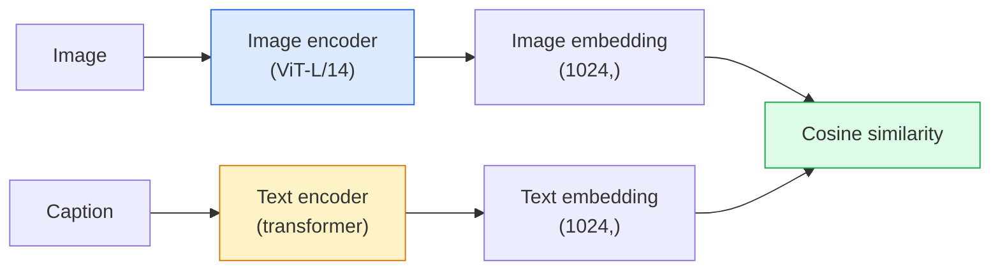

# Open-Vocabulary Vision — CLIP / 开放词表视觉：CLIP

> 一起训练 image encoder 和 text encoder，让匹配的 (image, caption) pairs 落在 shared space 中同一个位置。这就是全部诀窍。

**Type / 类型：** Build + Use / 构建 + 使用
**Languages / 语言：** Python
**Prerequisites / 前置知识：** Phase 4 Lesson 14 (ViT), Phase 4 Lesson 17 (Self-Supervised)
**Time / 时间：** 约 45 分钟

## Learning Objectives / 学习目标

- 解释 CLIP 的 two-tower architecture 和 contrastive training objective
- 使用 pretrained CLIP（或 SigLIP）做 zero-shot classification，不做任何 task-specific training
- 从零实现 zero-shot classification：encode class prompts、计算 cosine similarity、取 argmax
- 区分 CLIP、SigLIP、OpenCLIP 和 LLaVA/LLaMA-vision models：2026 年它们各自适合什么

## The Problem / 问题

传统 classifier 是 closed-vocabulary：一个 1000-class ImageNet model 只能预测 1000 个 labels。每个新 category 都需要 labelled data 和 retrained head。

CLIP（Radford et al., OpenAI 2021）证明：在从 web 抓取的 400M (image, caption) pairs 上训练，可以得到一个 inference 时能分类到任意 category set 的 model，而这些 categories 只需要用 natural language 描述。你只要写一句话，就能给它一个新 class。

这种能力，也就是 zero-shot transfer，是每个现代 vision system 都从 CLIP-family checkpoint 开始的原因。Detection（Grounding DINO、OWL-ViT）、segmentation（CLIPSeg、SAM）、retrieval、content moderation、VLMs 和 text-to-image generation 都建立在 CLIP-style joint embeddings 之上。

## The Concept / 概念

### Two towers / 双塔结构



两个 encoders 都以同一 embedding dimension 的 linear projection 结束（CLIP-B/32 是 512，CLIP-L/14 是 1024）。L2-normalise 后计算 cosine similarity。

### The objective / 训练目标

给定一个包含 N 个 (image, caption) pairs 的 batch，构建 NxN similarity matrix。训练两个 encoders，让 diagonal（匹配 pairs）similarity 高，让 off-diagonals（不匹配 pairs）similarity 低。

```
sim_matrix = image_embeddings @ text_embeddings.T / tau

loss_i2t = cross_entropy(sim_matrix,       targets=arange(N))
loss_t2i = cross_entropy(sim_matrix.T,     targets=arange(N))
loss = (loss_i2t + loss_t2i) / 2
```

它是 symmetric，因为 image-to-text 和 text-to-image retrieval 都应该可用。`tau`（temperature）通常是 learned scalar parameter，初始化为 0.07。

### SigLIP: a better loss / SigLIP：更好的 loss

SigLIP（Zhai et al., 2023）把 softmax 换成 per-pair sigmoid：

```
loss = mean over pairs of log(1 + exp(-y_ij * sim_ij))
y_ij = +1 if matching, -1 otherwise
```

Per-pair loss 移除了 CLIP 需要的 batch-level normalisation。SigLIP 在小 batch sizes 上训练更好，在相同数据下能追平或超过 CLIP。

### Zero-shot classification / Zero-shot classification

给定训练好的 CLIP：

1. 对每个 class 构造 prompt：“a photo of a {class}”。
2. 用 text encoder encode 所有 class prompts -> `T` shape (C, d)。
3. Encode test image -> `I` shape (1, d)。
4. Similarity = `I @ T.T` shape (1, C)。
5. Argmax -> predicted class。

Prompt engineering 很重要。OpenAI 为 ImageNet 发布了 80 个 prompt templates（“a photo of a {}”、“a blurry photo of a {}”、“a sketch of a {}” 等）。对每个 class 平均所有 templates 的 embeddings，可以额外提升 1-3% top-1 accuracy。

### Where CLIP-style models are used in 2026 / 2026 年 CLIP-style models 用在哪里

- **Zero-shot classification**：直接使用。
- **Image retrieval**：预先 encode 全部 images，inference 时 embed query。
- **Text-conditioned detection**：Grounding DINO、OWL-ViT 在 detector 外包一层 CLIP text tower。
- **Text-conditioned segmentation**：CLIPSeg；SAM 通过 CLIP 接收 text-prompt inputs。
- **VLMs**：LLaVA、Qwen-VL、InternVL 把 CLIP-family vision encoder 接进 LLM。
- **Text-to-image gen**：Stable Diffusion、DALL-E 3 基于 CLIP text embeddings 做 conditioning。

一旦有 shared embedding space，每个 vision+language task 都变成 distance computation。

## Build It / 动手构建

### Step 1: A tiny two-tower model / Step 1：一个 tiny two-tower model

真实 CLIP 是 ViT + transformer。本课的 towers 是基于 pre-extracted features 的小 MLP，这样 CPU 上也能看到 training signal。

```python
import torch
import torch.nn as nn
import torch.nn.functional as F


class TwoTower(nn.Module):
    def __init__(self, img_in=128, txt_in=64, emb=64):
        super().__init__()
        self.image_proj = nn.Sequential(nn.Linear(img_in, 128), nn.ReLU(), nn.Linear(128, emb))
        self.text_proj = nn.Sequential(nn.Linear(txt_in, 128), nn.ReLU(), nn.Linear(128, emb))
        self.logit_scale = nn.Parameter(torch.ones([]) * 2.6592)  # ln(1/0.07)

    def forward(self, img_feats, txt_feats):
        i = F.normalize(self.image_proj(img_feats), dim=-1)
        t = F.normalize(self.text_proj(txt_feats), dim=-1)
        return i, t, self.logit_scale.exp()
```

两个 projections、shared-dim output、learned temperature。Shape 与真实 CLIP API 相同。

### Step 2: Contrastive loss / Step 2：contrastive loss

```python
def clip_loss(image_emb, text_emb, logit_scale):
    N = image_emb.size(0)
    sim = logit_scale * image_emb @ text_emb.T
    targets = torch.arange(N, device=sim.device)
    l_i = F.cross_entropy(sim, targets)
    l_t = F.cross_entropy(sim.T, targets)
    return (l_i + l_t) / 2
```

Symmetric。更高 logit_scale = 更尖锐 softmax = 更 confident，但有 instability 风险。

### Step 3: Zero-shot classifier / Step 3：zero-shot classifier

```python
@torch.no_grad()
def zero_shot_classify(model, image_feats, class_text_feats, class_names):
    """
    image_feats:      (N, img_in)
    class_text_feats: (C, txt_in)   one averaged embedding per class
    """
    i = F.normalize(model.image_proj(image_feats), dim=-1)
    t = F.normalize(model.text_proj(class_text_feats), dim=-1)
    sim = i @ t.T
    pred = sim.argmax(dim=-1)
    return [class_names[p] for p in pred.tolist()]
```

每一步都一行。这正是 production CLIP checkpoint 使用的 zero-shot procedure。

### Step 4: Sanity check / Step 4：sanity check

```python
torch.manual_seed(0)
model = TwoTower()

img = torch.randn(8, 128)
txt = torch.randn(8, 64)
i, t, scale = model(img, txt)
loss = clip_loss(i, t, scale)
print(f"batch size: {i.size(0)}   loss: {loss.item():.3f}")
```

随机初始化 model 的 loss 应该接近 `log(N) = log(8) = 2.08`，这是没有学到结构时 symmetric cross-entropy 的目标。

## Use It / 应用它

OpenCLIP 是 2026 年社区默认选择：

```python
import open_clip
import torch
from PIL import Image

model, _, preprocess = open_clip.create_model_and_transforms("ViT-B-32", pretrained="laion2b_s34b_b79k")
tokenizer = open_clip.get_tokenizer("ViT-B-32")

image = preprocess(Image.open("dog.jpg")).unsqueeze(0)
text = tokenizer(["a photo of a dog", "a photo of a cat", "a photo of a car"])

with torch.no_grad():
    image_features = model.encode_image(image)
    text_features = model.encode_text(text)
    image_features = image_features / image_features.norm(dim=-1, keepdim=True)
    text_features = text_features / text_features.norm(dim=-1, keepdim=True)
    probs = (100.0 * image_features @ text_features.T).softmax(dim=-1)

print(probs)
```

SigLIP 更新，在小规模训练上更好，新项目优先选择它：`google/siglip-base-patch16-224`。Hugging Face 同时提供二者。

## Ship It / 交付它

本课产出：

- `outputs/prompt-zero-shot-class-picker.md`：一个 prompt，给定 class list 和 domain，为 zero-shot CLIP 设计 class templates。
- `outputs/skill-image-text-retriever.md`：一个 skill，用任意 CLIP checkpoint 构建 image embedding index，支持 query-by-text 和 query-by-image。

## Exercises / 练习

1. **(Easy / 简单)** 使用 pretrained OpenCLIP ViT-B/32 和 80-template prompt set，在 CIFAR-10 上做 zero-shot classification。报告 top-1 accuracy；应在 85-90% 左右。
2. **(Medium / 中等)** 在同一 CIFAR-10 任务上，对比 single-template（“a photo of a {}”）和 80-template averaged embeddings。量化差距，并解释 templates 为什么有帮助。
3. **(Hard / 困难)** 构建 zero-shot image retrieval index：用 CLIP embed 1,000 张 images，建立 FAISS index，用 natural language description 查询。对你手写的 20 个 held-out queries 报告 retrieval recall@5。

## Key Terms / 关键术语

| 术语 | 常见说法 | 实际含义 |
|------|----------------|----------------------|
| Two-tower | “Dual encoder” | 独立 image 和 text encoders，最后接 shared-dim projection head |
| Zero-shot | “No task-specific training” | Inference 时只用 text 描述的 classes 分类；不碰 labels |
| Temperature / logit_scale | “tau” | Softmax 前缩放 similarity matrix 的 learned scalar |
| Prompt template | “A photo of a {}” | 包裹 class names 的 natural-language wrapper；平均多个 templates 可提升 zero-shot accuracy |
| CLIP | “Image+text model” | OpenAI 2021 年模型；2026 年领域词汇表的一部分 |
| SigLIP | “Sigmoid CLIP” | 把 softmax 换成 per-pair sigmoid；小 batch 训练更好 |
| OpenCLIP | “Open reproduction” | 社区在 LAION 上训练的 CLIP variants；open-source pipelines 的 production default |
| VLM | “Vision-language model” | CLIP-family encoder 加 LLM，训练来回答图像问题 |

## Further Reading / 延伸阅读

- [CLIP: Learning Transferable Visual Models from Natural Language Supervision (Radford et al., 2021)](https://arxiv.org/abs/2103.00020)
- [SigLIP: Sigmoid Loss for Language-Image Pre-Training (Zhai et al., 2023)](https://arxiv.org/abs/2303.15343)
- [OpenCLIP](https://github.com/mlfoundations/open_clip)：社区代码库
- [DINOv2 vs CLIP vs MAE: a features comparison](https://huggingface.co/blog/dinov2)：带并列用例的 Hugging Face 指南
