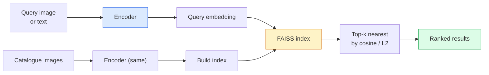

# Image Retrieval & Metric Learning / 图像检索与度量学习

> Retrieval system 按 embedding space 中的 distance 给候选排序。Metric learning 是塑造这个空间的学科，让 distances 表达你真正想要的含义。

**Type / 类型：** Build / 构建
**Languages / 语言：** Python
**Prerequisites / 前置知识：** Phase 4 Lesson 14 (ViT), Phase 4 Lesson 18 (CLIP)
**Time / 时间：** 约 45 分钟

## Learning Objectives / 学习目标

- 解释 triplet、contrastive 和 proxy-based metric learning losses，并为给定 dataset 选择正确 loss
- 正确实现 L2-normalisation 和 cosine similarity，并审计 “same item” 与 “same class” retrieval 的差异
- 构建 FAISS index，用 text 和 image 查询，并在 held-out query set 上报告 recall@K
- 使用 DINOv2、CLIP 和 SigLIP 作为 off-the-shelf embedding backbones，并知道何时各自占优

## The Problem / 问题

Retrieval 在生产视觉中无处不在：duplicate detection、reverse image search、visual search（“find similar products”）、face re-identification、surveillance 的 person re-ID、e-commerce 的 instance-level matching。产品问题永远一样：“给定这张 query image，给我的 catalogue 排序。”

两个设计决策塑造整个系统。Embedding，也就是哪个 model 产生 vectors。Index，也就是如何在 scale 下找到 nearest neighbours。到 2026 年二者都已经 commodity（embedding 用 DINOv2，index 用 FAISS），因此门槛提高了：真正难的是为你的应用定义 *什么算相似*，再塑造 embedding space 让 distances 与这个定义一致。

这种塑造就是 metric learning。它是一个小而高杠杆的学科。

## The Concept / 概念

### Retrieval at a glance / retrieval 一览



### The four loss families / 四类 loss family

| Loss | Requires / 需要 | Pros / 优点 | Cons / 缺点 |
|------|----------|------|------|
| **Contrastive** | (anchor, positive) + negatives | 简单，适用于任意 pair label | 没有很多 negatives 时收敛慢 |
| **Triplet** | (anchor, positive, negative) | 直观，可直接控制 margin | Hard-triplet mining 昂贵 |
| **NT-Xent / InfoNCE** | Pairs + batch-mined negatives | 可扩展到大 batch | 需要大 batch 或 momentum queue |
| **Proxy-based (ProxyNCA)** | Class labels only | 快、稳定、不需要 mining | 小 dataset 上可能 overfit proxies |

多数生产场景下，先从 pretrained backbone 开始。只有 off-the-shelf embeddings 在 test set 上表现不够时，再加 metric-learning fine-tune。

### Triplet loss formally / Triplet loss 形式化

```
L = max(0, ||f(a) - f(p)||^2 - ||f(a) - f(n)||^2 + margin)
```

把 anchor `a` 拉近 positive `p`，推远 negative `n`，并通过 `margin` 保证间隔。三图结构可以泛化到任何 similarity ordering。

Mining 很重要：easy triplets（`n` 已经离 `a` 很远）贡献零 loss；只有 hard triplets 能教网络。Semi-hard mining（`n` 比 `p` 远，但仍在 margin 内）是 2016 FaceNet 配方，到现在仍占主导。

### Cosine similarity vs L2 / Cosine similarity 与 L2

两种 metric、两种 convention：

- **Cosine**：vectors 之间的角度。要求 L2-normalised embeddings。
- **L2**：Euclidean distance。可用于 raw 或 normalised embeddings，但通常搭配 L2-normalised + squared L2。

对多数现代网络来说，二者等价：当 `||a|| = ||b|| = 1` 时，`||a - b||^2 = 2 - 2 cos(a, b)`。选择与你 embedding training 一致的 convention；混用会悄悄改变“nearest”的含义。

### Recall@K / Recall@K

标准 retrieval metric：

```
recall@K = fraction of queries where at least one correct match is in the top K results
```

并排报告 recall@1、@5、@10。Recall@10 高于 0.95 但 recall@1 低于 0.5，说明 embedding space 大结构正确，但 ranking noisy，可以尝试更长 fine-tune 或 re-ranking step。

Duplicate detection 更关注 precision@K，因为每个 false positive 都是用户可见错误。Visual search 中 recall@K 更接近产品信号。

### FAISS in one paragraph / 一段话理解 FAISS

Facebook AI Similarity Search。Nearest-neighbour search 的事实标准库。三种 index choices：

- `IndexFlatIP` / `IndexFlatL2`：brute force、exact、不需要 training。适合 ~1M vectors 以内。
- `IndexIVFFlat`：划分成 K 个 cells，只搜索最近的少数 cells。Approximate、快、需要 training data。
- `IndexHNSW`：graph-based，对大量 queries 最快，index size 较大。

100k vectors 基本用 cosine similarity 上的 `IndexFlatIP`。10M 用 `IndexIVFFlat`。100M+ 用 product quantisation（`IndexIVFPQ`）组合。

### Instance-level vs category-level retrieval / instance-level 与 category-level retrieval

同名下的两个完全不同问题：

- **Category-level**：“在 catalogue 里找 cats。”Class-conditional similarity；off-the-shelf CLIP / DINOv2 embeddings 表现很好。
- **Instance-level**：“在 catalogue 里找 *这个具体 product*。”需要区分同一 class 中视觉相似的对象；off-the-shelf embeddings 表现不足；metric learning fine-tuning 很重要。

选择 model 前，先问清楚你解决的是哪一个。

## Build It / 动手构建

### Step 1: Triplet loss / Step 1：triplet loss

```python
import torch
import torch.nn.functional as F

def triplet_loss(anchor, positive, negative, margin=0.2):
    d_ap = F.pairwise_distance(anchor, positive, p=2)
    d_an = F.pairwise_distance(anchor, negative, p=2)
    return F.relu(d_ap - d_an + margin).mean()
```

一行代码。可用于 L2-normalised 或 raw embeddings。

### Step 2: Semi-hard mining / Step 2：semi-hard mining

给定一个 batch 的 embeddings 和 labels，为每个 anchor 找最难的 semi-hard negative。

```python
def semi_hard_negatives(emb, labels, margin=0.2):
    dist = torch.cdist(emb, emb)
    same_class = labels[:, None] == labels[None, :]
    diff_class = ~same_class
    N = emb.size(0)

    positives = dist.clone()
    positives[~same_class] = float("-inf")
    positives.fill_diagonal_(float("-inf"))
    pos_idx = positives.argmax(dim=1)

    semi_hard = dist.clone()
    semi_hard[same_class] = float("inf")
    d_ap = dist[torch.arange(N), pos_idx].unsqueeze(1)
    semi_hard[dist <= d_ap] = float("inf")
    neg_idx = semi_hard.argmin(dim=1)

    fallback_mask = semi_hard[torch.arange(N), neg_idx] == float("inf")
    if fallback_mask.any():
        hardest = dist.clone()
        hardest[same_class] = float("inf")
        neg_idx = torch.where(fallback_mask, hardest.argmin(dim=1), neg_idx)
    return pos_idx, neg_idx
```

每个 anchor 得到 in-class hardest positive，以及一个比 positive 更远但仍在 margin 内的 semi-hard negative。

### Step 3: Recall@K / Step 3：Recall@K

```python
def recall_at_k(query_emb, gallery_emb, query_labels, gallery_labels, k=1):
    sim = query_emb @ gallery_emb.T
    _, top_k = sim.topk(k, dim=-1)
    matches = (gallery_labels[top_k] == query_labels[:, None]).any(dim=-1)
    return matches.float().mean().item()
```

在 L2-normalised embeddings 上，inner product top-k 等于 cosine top-k。报告至少一个正确 neighbour 出现在 top K 中的 query 比例均值。

### Step 4: Putting it together / Step 4：组装起来

```python
import torch
import torch.nn as nn
from torch.optim import Adam

class Encoder(nn.Module):
    def __init__(self, in_dim=128, emb_dim=64):
        super().__init__()
        self.net = nn.Sequential(
            nn.Linear(in_dim, 128), nn.ReLU(),
            nn.Linear(128, emb_dim),
        )

    def forward(self, x):
        return F.normalize(self.net(x), dim=-1)

torch.manual_seed(0)
num_classes = 6
protos = F.normalize(torch.randn(num_classes, 128), dim=-1)

def sample_batch(bs=32):
    labels = torch.randint(0, num_classes, (bs,))
    x = protos[labels] + 0.15 * torch.randn(bs, 128)
    return x, labels

enc = Encoder()
opt = Adam(enc.parameters(), lr=3e-3)

for step in range(200):
    x, y = sample_batch(32)
    emb = enc(x)
    pos_idx, neg_idx = semi_hard_negatives(emb, y)
    loss = triplet_loss(emb, emb[pos_idx], emb[neg_idx])
    opt.zero_grad(); loss.backward(); opt.step()
```

几百步后，embedding clusters 会形成每个 class 一个 cluster。

## Use It / 应用它

2026 年 production stacks：

- **DINOv2 + FAISS**：通用 visual retrieval。Off-the-shelf 即可用。
- **CLIP + FAISS**：当 queries 是 text。
- **Fine-tuned DINOv2 + FAISS**：instance-level retrieval、face re-ID、fashion、e-commerce。
- **Milvus / Weaviate / Qdrant**：围绕 FAISS 或 HNSW 的 managed vector DB wrappers。

SOTA instance retrieval 的 recipe：DINOv2 backbone，加 embedding head，在 instance-labelled pairs 上用 triplet 或 InfoNCE loss fine-tune，再用 FAISS 建 index。

## Ship It / 交付它

本课产出：

- `outputs/prompt-retrieval-loss-picker.md`：一个 prompt，为给定 retrieval problem 选择 triplet / InfoNCE / ProxyNCA。
- `outputs/skill-recall-at-k-runner.md`：一个 skill，使用 train/val/gallery splits 和正确 data contract 编写 recall@K evaluation harness。

## Exercises / 练习

1. **(Easy / 简单)** 运行上面的 toy example。用 PCA 绘制训练前后 embeddings，观察六个 clusters 的形成。
2. **(Medium / 中等)** 添加 ProxyNCA loss implementation：每个 class 一个 learned “proxy”，在 cosine similarity 上做标准 cross-entropy。与 toy data 上的 triplet loss 比较 convergence speed。
3. **(Hard / 困难)** 取 1,000 张 ImageNet validation images，通过 HuggingFace 用 DINOv2 embed，构建 FAISS flat index，并对同一 images 作为 queries 报告 recall@{1, 5, 10}（应为 1.0），再对以 ImageNet labels 为 ground truth 的 held-out split 报告结果。

## Key Terms / 关键术语

| 术语 | 常见说法 | 实际含义 |
|------|----------------|----------------------|
| Metric learning | “Shape the space” | 训练 encoder，让 output space 中的 distances 反映目标 similarity |
| Triplet loss | “Pull and push” | L = max(0, d(a, p) - d(a, n) + margin)；经典 metric-learning loss |
| Semi-hard mining | “Useful negatives” | 比 positive 离 anchor 更远、但仍在 margin 内的 negatives；经验上最有信息量 |
| Proxy-based loss | “Class prototypes” | 每个 class 一个 learned proxy；对 similarity-to-proxies 做 cross-entropy；不需要 pair mining |
| Recall@K | “Top-K hit rate” | Top K 中至少有一个正确 result 的 query 比例 |
| Instance retrieval | “Find this exact thing” | Fine-grained matching；off-the-shelf features 通常表现不足 |
| FAISS | “NN library” | Facebook nearest-neighbour library；支持 exact 和 approximate indexes |
| HNSW | “Graph index” | Hierarchical navigable small world；快速 approximate NN，memory overhead 小 |

## Further Reading / 延伸阅读

- [FaceNet: A Unified Embedding for Face Recognition (Schroff et al., 2015)](https://arxiv.org/abs/1503.03832)：triplet loss / semi-hard mining 论文
- [In Defense of the Triplet Loss for Person Re-Identification (Hermans et al., 2017)](https://arxiv.org/abs/1703.07737)：triplet fine-tuning 实践指南
- [FAISS documentation](https://github.com/facebookresearch/faiss/wiki)：每种 index 和 trade-off
- [SMoT: Metric Learning Taxonomy (Kim et al., 2021)](https://arxiv.org/abs/2010.06927)：现代 losses 及其关系综述
