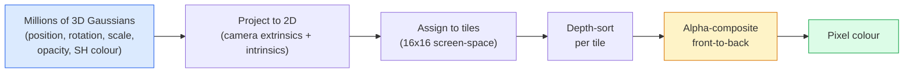

# 3D Gaussian Splatting from Scratch / 从零构建 3D Gaussian Splatting

> 一个场景就是由数百万个 3D Gaussians 组成的点云。每个 Gaussian 都有位置、朝向、尺度、透明度，以及随视角变化的颜色。把它们 rasterise，再通过 rasterisation 反向传播，事情就完成了。

**Type / 类型：** Build / 构建
**Languages / 语言：** Python
**Prerequisites / 前置知识：** Phase 4 Lesson 13 (3D Vision & NeRF), Phase 1 Lesson 12 (Tensor Operations), Phase 4 Lesson 10 (Diffusion basics optional)
**Time / 时间：** 约 90 分钟

## Learning Objectives / 学习目标

- 解释为什么到 2026 年，3D Gaussian Splatting 已经取代 NeRF，成为 photorealistic 3D reconstruction 的生产默认方案
- 说清每个 Gaussian 的六类参数（position、rotation quaternion、scale、opacity、spherical harmonics colour、optional feature），以及每类贡献多少 floats
- 从零实现一个使用 `alpha` compositing 的 2D Gaussian splatting rasterizer，并说明 3D case 如何投影到同一个循环
- 使用 `nerfstudio`、`gsplat` 或 `SuperSplat` 从 20-50 张照片重建一个场景，并导出到 `KHR_gaussian_splatting` glTF extension 或 OpenUSD 26.03 的 `UsdVolParticleField3DGaussianSplat` schema

## The Problem / 问题

NeRF 把场景存成一个 MLP 的权重。每个渲染像素都要沿一条 ray 做数百次 MLP query。训练要数小时，渲染要数秒，而且权重不可直接编辑：如果你想把场景里的椅子挪一下，就必须重新训练。

3D Gaussian Splatting（Kerbl, Kopanas, Leimkühler, Drettakis, SIGGRAPH 2023）替换了这一整套做法。场景被表示成一组显式的 3D Gaussians。渲染是在 GPU 上以 100+ fps 做 rasterisation。训练只要几分钟。编辑也是直接的：平移某一组 Gaussians，就相当于移动了椅子。到 2026 年，Khronos Group 已经批准了 Gaussian splats 的 glTF extension，OpenUSD 26.03 发布了 Gaussian splat schema，Zillow 和 Apartments.com 用它们渲染房产，大多数新的 3D reconstruction 研究论文也都是围绕核心 3DGS 思想的变体。

心智模型很简单，但数学上有足够多的部件，所以大多数介绍从 rasterisation 开始，却跳过 projection 和 spherical harmonics。本课会把整件事搭完整：先做 2D 版本，再扩展到 3D。

## The Concept / 概念

### What a Gaussian carries / 一个 Gaussian 携带什么

一个 3D Gaussian 是空间中的参数化 blob，带有这些属性：

```
position         mu         (3,)    centre in world coordinates
rotation         q          (4,)    unit quaternion encoding orientation
scale            s          (3,)    log-scales per axis (exponentiated at render time)
opacity          alpha      (1,)    post-sigmoid opacity [0, 1]
SH coefficients  c_lm       (3 * (L+1)^2,)   view-dependent colour
```

Rotation + scale 会构造出一个 3x3 covariance：`Sigma = R S S^T R^T`。这就是 Gaussian 在 3D 里的形状。Spherical harmonics 让颜色可以随观察方向变化：specular highlights、轻微光泽、view-dependent glow，而不需要存 per-view textures。SH degree 3 会给每个颜色通道 16 个系数，也就是仅颜色就有 48 个 floats per Gaussian。

一个场景通常有 1-5 million Gaussians。每个大约存 60 个 floats（3 + 4 + 3 + 1 + 48 + misc）。五百万个 Gaussian 的场景约 240 MB，比等价的 per-point texture point cloud 小得多，也比高分辨率重新渲染的 NeRF MLP weights 小一个数量级。

### Rasterisation, not ray marching / Rasterisation，而不是 ray marching



五个步骤，全都适合 GPU。没有 per-pixel MLP query。一张 RTX 3080 Ti 就能以 147 fps 渲染 6 million splats。

### The projection step / Projection 步骤

位于 world position `mu`、拥有 3D covariance `Sigma` 的 3D Gaussian，会投影成 screen position `mu'`、2D covariance `Sigma'` 的 2D Gaussian：

```
mu' = project(mu)
Sigma' = J W Sigma W^T J^T          (2 x 2)

W = viewing transform (rotation + translation of camera)
J = Jacobian of the perspective projection at mu'
```

2D Gaussian 的 footprint 是一个 ellipse，它的轴由 `Sigma'` 的 eigenvectors 决定。这个 ellipse 内的每个 pixel 都会收到该 Gaussian 的贡献，权重是 `exp(-0.5 * (p - mu')^T Sigma'^-1 (p - mu'))`。

### The alpha-compositing rule / Alpha compositing 规则

对一个 pixel 来说，覆盖它的 Gaussians 会按 back-to-front 排序（或者等价地，用反向公式做 front-to-back）。颜色用 1980 年代以来所有 semi-transparent rasteriser 都在用的同一个公式来合成：

```
C_pixel = sum_i alpha_i * T_i * c_i

T_i = prod_{j < i} (1 - alpha_j)       transmittance up to i
alpha_i = opacity_i * exp(-0.5 * d^T Sigma'^-1 d)   local contribution
c_i = eval_SH(SH_i, view_direction)    view-dependent colour
```

这和 **NeRF 的 volumetric render 是同一个方程**，只是 NeRF 在 ray 上对 dense samples 积分，而这里是在显式稀疏 Gaussians 上积分。正因为这个等价关系，渲染质量才会匹配 NeRF：两者都在积分同一个 radiance-field equation。

### Why this is differentiable / 为什么它可微

每一步，projection、tile assignment、alpha compositing、SH evaluation，都对 Gaussian parameters 可微。给定 ground-truth image，计算 rendered pixel loss，通过 rasteriser 反向传播，用 gradient descent 更新所有 `(mu, q, s, alpha, c_lm)`。经过约 30,000 次迭代，Gaussians 会找到合适的位置、尺度和颜色。

### Densification and pruning / Densification 与 pruning

固定数量的 Gaussians 无法覆盖复杂场景。训练里包含两种自适应机制：

- **Clone**：当某个 Gaussian 的 gradient magnitude 很高但 scale 很小时，在当前位置复制它。意思是这里的 reconstruction 需要更多细节。
- **Split**：当一个大尺度 Gaussian 的 gradient 很高时，把它拆成两个更小的。一个大 Gaussian 太平滑，拟合不了这个区域。
- **Prune**：删除 opacity 掉到阈值以下的 Gaussians。它们已经没有贡献。

Densification 每 N 次迭代运行一次。一个场景通常从约 100k 初始 Gaussians（由 SfM points 初始化）增长到训练结束时的 1-5M。

### Spherical harmonics in one paragraph / 用一段话理解 spherical harmonics

View-dependent colour 是单位球面上的函数 `c(direction)`。Spherical harmonics 是球面上的 Fourier basis。截断到 degree `L` 后，每个通道会得到 `(L+1)^2` 个 basis functions。对新视角求颜色，就是把 learned SH coefficients 与观察方向处的 basis evaluation 做 dot product。Degree 0 = 一个系数 = constant colour。Degree 3 = 16 个系数 = 足以捕捉 Lambertian shading、specular 和轻微 reflection。3D Gaussian Splatting papers 默认使用 degree 3。

### The 2026 production stack / 2026 年生产栈

```
1. Capture         smartphone / DJI drone / handheld scanner
2. SfM / MVS       COLMAP or GLOMAP derives camera poses + sparse points
3. Train 3DGS      nerfstudio / gsplat / inria official / PostShot (~10-30 min on RTX 4090)
4. Edit            SuperSplat / SplatForge (clean floaters, segment)
5. Export          .ply -> glTF KHR_gaussian_splatting or .usd (OpenUSD 26.03)
6. View            Cesium / Unreal / Babylon.js / Three.js / Vision Pro
```

### 4D and generative variants / 4D 与生成式变体

- **4D Gaussian Splatting**：Gaussians 是时间的函数；用于 volumetric video（Superman 2026, A$AP Rocky's "Helicopter"）。
- **Generative splats**：text-to-splat models（World Labs 的 Marble），可以 hallucinate 整个场景。
- **3D Gaussian Unscented Transform**：NVIDIA NuRec 用于 autonomous driving simulation 的变体。

## Build It / 动手构建

### Step 1: A 2D Gaussian / 步骤 1：一个 2D Gaussian

我们先构建一个 2D rasteriser。3D case 在 projection 之后会归约到它。

```python
import torch
import torch.nn as nn
import torch.nn.functional as F


def eval_2d_gaussian(means, covs, points):
    """
    means:  (G, 2)      centres
    covs:   (G, 2, 2)   covariance matrices
    points: (H, W, 2)   pixel coordinates
    returns: (G, H, W)  density at every pixel for every Gaussian
    """
    G = means.size(0)
    H, W, _ = points.shape
    flat = points.view(-1, 2)
    inv = torch.linalg.inv(covs)
    diff = flat[None, :, :] - means[:, None, :]
    d = torch.einsum("gpi,gij,gpj->gp", diff, inv, diff)
    density = torch.exp(-0.5 * d)
    return density.view(G, H, W)
```

`einsum` 会为每个 (Gaussian, pixel) pair 计算 quadratic form `diff^T Sigma^-1 diff`。

### Step 2: 2D splatting rasteriser / 步骤 2：2D splatting rasteriser

Front-to-back alpha-compositing。在 2D 里 depth 没有意义，所以我们用一个 learned per-Gaussian scalar 来决定顺序。

```python
def rasterise_2d(means, covs, colours, opacities, depths, image_size):
    """
    means:     (G, 2)
    covs:      (G, 2, 2)
    colours:   (G, 3)
    opacities: (G,)     in [0, 1]
    depths:    (G,)     per-Gaussian scalar used for ordering
    image_size: (H, W)
    returns:   (H, W, 3) rendered image
    """
    H, W = image_size
    yy, xx = torch.meshgrid(
        torch.arange(H, dtype=torch.float32, device=means.device),
        torch.arange(W, dtype=torch.float32, device=means.device),
        indexing="ij",
    )
    points = torch.stack([xx, yy], dim=-1)

    densities = eval_2d_gaussian(means, covs, points)
    alphas = opacities[:, None, None] * densities
    alphas = alphas.clamp(0.0, 0.99)

    order = torch.argsort(depths)
    alphas = alphas[order]
    colours_sorted = colours[order]

    T = torch.ones(H, W, device=means.device)
    out = torch.zeros(H, W, 3, device=means.device)
    for i in range(means.size(0)):
        a = alphas[i]
        out += (T * a)[..., None] * colours_sorted[i][None, None, :]
        T = T * (1.0 - a)
    return out
```

这并不快，真实实现会使用 tile-based CUDA kernels，但数学完全正确，而且完全可微。

### Step 3: A trainable 2D splat scene / 步骤 3：可训练的 2D splat scene

```python
class Splats2D(nn.Module):
    def __init__(self, num_splats=128, image_size=64, seed=0):
        super().__init__()
        g = torch.Generator().manual_seed(seed)
        H, W = image_size, image_size
        self.means = nn.Parameter(torch.rand(num_splats, 2, generator=g) * torch.tensor([W, H]))
        self.log_scale = nn.Parameter(torch.ones(num_splats, 2) * math.log(2.0))
        self.rot = nn.Parameter(torch.zeros(num_splats))  # single angle in 2D
        self.colour_logits = nn.Parameter(torch.randn(num_splats, 3, generator=g) * 0.5)
        self.opacity_logit = nn.Parameter(torch.zeros(num_splats))
        self.depth = nn.Parameter(torch.rand(num_splats, generator=g))

    def covs(self):
        s = torch.exp(self.log_scale)
        c, si = torch.cos(self.rot), torch.sin(self.rot)
        R = torch.stack([
            torch.stack([c, -si], dim=-1),
            torch.stack([si, c], dim=-1),
        ], dim=-2)
        S = torch.diag_embed(s ** 2)
        return R @ S @ R.transpose(-1, -2)

    def forward(self, image_size):
        covs = self.covs()
        colours = torch.sigmoid(self.colour_logits)
        opacities = torch.sigmoid(self.opacity_logit)
        return rasterise_2d(self.means, covs, colours, opacities, self.depth, image_size)
```

`log_scale`、`opacity_logit` 和 `colour_logits` 都是 unconstrained parameters，在 render time 通过合适的 activation 映射到有效范围。这是每个 3DGS implementation 的标准模式。

### Step 4: Fit 2D Gaussians to a target image / 步骤 4：用 2D Gaussians 拟合目标图像

```python
import math
import numpy as np

def make_target(size=64):
    yy, xx = np.meshgrid(np.arange(size), np.arange(size), indexing="ij")
    img = np.zeros((size, size, 3), dtype=np.float32)
    # Red circle
    mask = (xx - 20) ** 2 + (yy - 20) ** 2 < 10 ** 2
    img[mask] = [1.0, 0.2, 0.2]
    # Blue square
    mask = (np.abs(xx - 45) < 8) & (np.abs(yy - 40) < 8)
    img[mask] = [0.2, 0.3, 1.0]
    return torch.from_numpy(img)


target = make_target(64)
model = Splats2D(num_splats=64, image_size=64)
opt = torch.optim.Adam(model.parameters(), lr=0.05)

for step in range(200):
    pred = model((64, 64))
    loss = F.mse_loss(pred, target)
    opt.zero_grad(); loss.backward(); opt.step()
    if step % 40 == 0:
        print(f"step {step:3d}  mse {loss.item():.4f}")
```

经过 200 steps，64 个 Gaussians 会收敛到两个形状上。这就是完整思想：对显式 geometric primitives 做 gradient descent。

### Step 5: From 2D to 3D / 步骤 5：从 2D 到 3D

3D 扩展保留同一个循环。新增部分是：

1. Per-Gaussian rotation 从一个 angle 变成 quaternion。
2. Covariance 是 `R S S^T R^T`，其中 `R` 由 quaternion 构造，`S = diag(exp(log_scale))`。
3. Projection `(mu, Sigma) -> (mu', Sigma')` 使用 camera extrinsics，以及 `mu` 处 perspective projection 的 Jacobian。
4. Colour 变成 spherical-harmonics expansion；在 viewing direction 上 evaluate。
5. Depth-sort 从 learned scalar 变成真实 camera-space z。

每个生产实现（`gsplat`、`inria/gaussian-splatting`、`nerfstudio`）都在 GPU 上用 tile-based CUDA kernels 做的正是这些事。

### Step 6: Spherical harmonics evaluation / 步骤 6：Spherical harmonics evaluation

SH basis 到 degree 3 时，每个通道有 16 个 terms。Evaluation 如下：

```python
def eval_sh_degree_3(sh_coeffs, dirs):
    """
    sh_coeffs: (..., 16, 3)   last dim is RGB channels
    dirs:      (..., 3)       unit vectors
    returns:   (..., 3)
    """
    C0 = 0.282094791773878
    C1 = 0.488602511902920
    C2 = [1.092548430592079, 1.092548430592079,
          0.315391565252520, 1.092548430592079,
          0.546274215296039]
    x, y, z = dirs[..., 0], dirs[..., 1], dirs[..., 2]
    x2, y2, z2 = x * x, y * y, z * z
    xy, yz, xz = x * y, y * z, x * z

    result = C0 * sh_coeffs[..., 0, :]
    result = result - C1 * y[..., None] * sh_coeffs[..., 1, :]
    result = result + C1 * z[..., None] * sh_coeffs[..., 2, :]
    result = result - C1 * x[..., None] * sh_coeffs[..., 3, :]

    result = result + C2[0] * xy[..., None] * sh_coeffs[..., 4, :]
    result = result + C2[1] * yz[..., None] * sh_coeffs[..., 5, :]
    result = result + C2[2] * (2.0 * z2 - x2 - y2)[..., None] * sh_coeffs[..., 6, :]
    result = result + C2[3] * xz[..., None] * sh_coeffs[..., 7, :]
    result = result + C2[4] * (x2 - y2)[..., None] * sh_coeffs[..., 8, :]

    # degree 3 terms omitted here for brevity; full 16-coefficient version in the code file
    return result
```

Learned `sh_coeffs` 存的是这个 Gaussian “每个方向上的颜色”。Render time 用当前 view direction 做 evaluation，得到一个 3-vector RGB。

## Use It / 使用它

真实 3DGS 工作请使用 `gsplat`（Meta）或 `nerfstudio`：

```bash
pip install nerfstudio gsplat
ns-download-data example
ns-train splatfacto --data path/to/data
```

`splatfacto` 是 nerfstudio 的 3DGS trainer。对典型场景，在 RTX 4090 上一次运行需要 10-30 分钟。

2026 年重要的 export options：

- `.ply`：raw Gaussian cloud（portable，文件最大）。
- `.splat`：PlayCanvas / SuperSplat quantised format。
- glTF `KHR_gaussian_splatting`：Khronos standard，可在 viewers 间移植（Feb 2026 RC）。
- OpenUSD `UsdVolParticleField3DGaussianSplat`：USD-native，用于 NVIDIA Omniverse 和 Vision Pro pipelines。

对 4D / dynamic scenes，`4DGS` 和 `Deformable-3DGS` 会用 time-varying means 和 opacities 扩展同一套机制。

## Ship It / 交付内容

本课会产出：

- `outputs/prompt-3dgs-capture-planner.md`：一个 prompt，用于针对给定场景类型规划 capture session（照片数量、camera path、lighting）。
- `outputs/skill-3dgs-export-router.md`：一个 skill，根据下游 viewer 或 engine 选择正确的 export format（`.ply` / `.splat` / glTF / USD）。

## Exercises / 练习

1. **（Easy）** 在另一个 synthetic image 上运行上面的 2D splat trainer。在 `[16, 64, 256]` 中改变 `num_splats`，并画出每个设置下 MSE vs step 曲线。找出收益递减点。
2. **（Medium）** 扩展 2D rasteriser，让 per-Gaussian RGB colours 可以通过 degree-2 harmonic 依赖一个 scalar "view angle"。在一对 target images 上训练，并验证模型能重建两者。
3. **（Hard）** Clone `nerfstudio`，在你自己拍摄的任意场景（desk、plant、face、room）的 20 张照片上训练 `splatfacto`。导出到 glTF `KHR_gaussian_splatting`，并在 viewer 中打开（Three.js `GaussianSplats3D`、SuperSplat、Babylon.js V9）。报告 training time、number of Gaussians 和 rendered fps。

## Key Terms / 关键术语

| 术语 | 常见说法 | 实际含义 |
|------|----------------|----------------------|
| 3DGS | “Gaussian splats” | 把场景显式表示为数百万个 3D Gaussians，每个 Gaussian 有 position、rotation、scale、opacity、SH colour |
| Covariance | “Shape of the Gaussian” | `Sigma = R S S^T R^T`；一个 Gaussian 的 orientation 和 anisotropic scale |
| Alpha compositing | “Back-to-front blend” | 与 NeRF volumetric render 相同的方程，只是现在作用在显式稀疏集合上 |
| Densification | “Clone and split” | 在 reconstruction 欠拟合的位置自适应添加新 Gaussians |
| Pruning | “Delete low-opacity” | 移除训练中 opacity 接近 0、已经坍缩的 Gaussians |
| Spherical harmonics | “View-dependent colour” | 球面上的 Fourier basis；把颜色存成 viewing direction 的函数 |
| Splatfacto | “nerfstudio's 3DGS” | 2026 年训练 3DGS 最容易上手的路径 |
| `KHR_gaussian_splatting` | “glTF standard” | Khronos 2026 extension，让 3DGS 可以在 viewers 和 engines 之间移植 |

## Further Reading / 延伸阅读

- [3D Gaussian Splatting for Real-Time Radiance Field Rendering (Kerbl et al., SIGGRAPH 2023)](https://repo-sam.inria.fr/fungraph/3d-gaussian-splatting/) — original paper
- [gsplat (Meta/nerfstudio)](https://github.com/nerfstudio-project/gsplat) — production-quality CUDA rasteriser
- [nerfstudio Splatfacto](https://docs.nerf.studio/nerfology/methods/splat.html) — reference training recipe
- [Khronos KHR_gaussian_splatting extension](https://github.com/KhronosGroup/glTF/blob/main/extensions/2.0/Khronos/KHR_gaussian_splatting/README.md) — 2026 portable format
- [OpenUSD 26.03 release notes](https://openusd.org/release/) — `UsdVolParticleField3DGaussianSplat` schema
- [THE FUTURE 3D State of Gaussian Splatting 2026](https://www.thefuture3d.com/blog-0/2026/4/4/state-of-gaussian-splatting-2026) — industry overview
