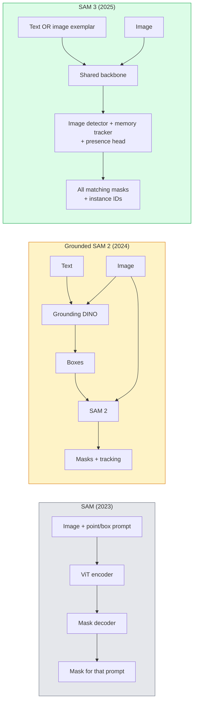

# SAM 3 & Open-Vocabulary Segmentation / SAM 3 与开放词表分割

> 给模型一个 text prompt 和一张 image，它就返回每个匹配对象的 masks。SAM 3 把这件事变成了一次 forward pass。

**Type / 类型：** Use + Build / 使用 + 构建
**Languages / 语言：** Python
**Prerequisites / 前置知识：** Phase 4 Lesson 07 (U-Net), Phase 4 Lesson 08 (Mask R-CNN), Phase 4 Lesson 18 (CLIP)
**Time / 时间：** 约 60 分钟

## Learning Objectives / 学习目标

- 区分 SAM（只支持 visual prompts）、Grounded SAM / SAM 2（detector + SAM）和 SAM 3（通过 Promptable Concept Segmentation 原生支持 text prompts）
- 解释 SAM 3 architecture：shared backbone + image detector + memory-based video tracker + presence head + decoupled detector-tracker design
- 使用 Hugging Face `transformers` 的 SAM 3 integration 做 text-prompted detection、segmentation 和 video tracking
- 根据 latency、concept complexity 和 deployment target，在 SAM 3、Grounded SAM 2、YOLO-World 和 SAM-MI 之间做选择

## The Problem / 问题

2023 年的 SAM 是 visual-prompt-only model：你点击一个 point 或画一个 box，它返回一个 mask。对于 “give me all the oranges in this photo” 这种请求，你需要一个 detector（Grounding DINO）先产生 boxes，再用 SAM 分割每个 box。Grounded SAM 把它变成了 pipeline，但它仍然是两个 frozen models 的 cascade，错误累积不可避免。

SAM 3（Meta, Nov 2025, ICLR 2026）把这个 cascade 合并了。它接受一个短 noun phrase 或一个 image exemplar 作为 prompt，并在单次 forward pass 中返回所有匹配的 masks 和 instance IDs。这就是 **Promptable Concept Segmentation（PCS）**。结合 2026 年 3 月的 Object Multiplex update（SAM 3.1），它还能高效跟踪 video 中同一 concept 的多个 instances。

本课关注这个结构性转变。2D seg、detection 和 text-image grounding 已经合并到一个模型里。生产问题不再是“我应该串联哪个 pipeline”，而是“哪个 promptable model 能端到端覆盖我的 use case”。

## The Concept / 概念

### The three generations / 三代模型



### Promptable Concept Segmentation / Promptable Concept Segmentation

“Concept prompt” 是一个短 noun phrase（`"yellow school bus"`、`"striped red umbrella"`、`"hand holding a mug"`）或一个 image exemplar。模型会返回 image 中每个匹配 concept 的 instance segmentation masks，并为每个 match 提供唯一 instance ID。

它与 classic visual-prompt SAM 有三个差异：

1. 不需要 per-instance prompting：一个 text prompt 返回所有 matches。
2. Open-vocabulary：concept 可以是任何能用自然语言描述的东西。
3. 一次返回 multiple instances，而不是每个 prompt 返回一个 mask。

### Key architectural pieces / 关键架构部件

- **Shared backbone**：单个 ViT 处理 image。Detector head 和 memory-based tracker 都从中读取特征。
- **Presence head**：预测 concept 是否存在于 image 中。把 “is this here?” 与 “where is it?” 解耦，降低 absent concepts 上的 false positives。
- **Decoupled detector-tracker**：image-level detection 和 video-level tracking 使用 separate heads，避免互相干扰。
- **Memory bank**：跨 frames 存储 per-instance features，用于 video tracking（与 SAM 2 使用的机制相同）。

### Training at scale / 大规模训练

SAM 3 在 **4 million unique concepts** 上训练，这些 concepts 由一个 data engine 生成，并通过 AI + human review 迭代标注和纠正。新的 **SA-CO benchmark** 包含 270K unique concepts，是此前 benchmarks 的 50x。SAM 3 在 SA-CO 上达到人类表现的 75-80%，并在 image + video PCS 上把现有系统提升到两倍。

### SAM 3.1 Object Multiplex / SAM 3.1 Object Multiplex

2026 年 3 月更新：**Object Multiplex** 引入了 shared-memory mechanism，用于一次联合跟踪同一 concept 的多个 instances。过去，跟踪 N 个 instances 意味着 N 个 separate memory banks。Multiplex 把它折叠成一个 shared memory，并配合 per-instance queries。结果是 multi-object tracking 明显更快，同时不牺牲 accuracy。

### Where Grounded SAM still matters in 2026 / 2026 年 Grounded SAM 仍然重要的场景

- 你需要替换特定 open-vocabulary detector（DINO-X、Florence-2）时。
- SAM 3 license（HF gated）成为 blocker 时。
- 你需要比 SAM 3 暴露得更多的 detector threshold 控制时。
- 做 detector component 的 research / ablation work 时。

Modular pipelines 仍然有位置。对大多数 production work，SAM 3 是更简单的答案。

### YOLO-World vs SAM 3 / YOLO-World 与 SAM 3

- **YOLO-World**：只做 open-vocabulary detector（没有 masks）。Real-time。当你需要 high fps boxes 时最合适。
- **SAM 3**：完整 segmentation + tracking。更慢，但输出更丰富。

生产上的拆分：YOLO-World 用于快速 detection-only pipelines（robotics navigation、fast dashboards），SAM 3 用于任何需要 masks 或 tracking 的场景。

### SAM-MI efficiency / SAM-MI 的效率

SAM-MI（2025-2026）解决 SAM 的 decoder bottleneck。关键思想：

- **Sparse point prompting**：使用少量精心选择的 points，而不是 dense prompts；decoder calls 减少 96%。
- **Shallow mask aggregation**：把粗略 mask predictions 合并成一个更清晰的 mask。
- **Decoupled mask injection**：decoder 接收 pre-computed mask features，而不是重新运行。

结果：在 open-vocabulary benchmarks 上，比 Grounded-SAM 约快 1.6×。

### Output format for the three models / 三类模型的输出格式

它们都返回相同的大体结构（boxes + labels + scores + masks + IDs），这很有用：你的 downstream pipeline 不需要根据运行的是哪个模型分支处理。

## Build It / 动手构建

### Step 1: Prompt construction / 步骤 1：Prompt construction

构建一个 helper，把 user sentence 转成 SAM 3 concept prompts 列表。这是 “what the user typed” 与 “what the model consumes” 之间的边界。

```python
def split_concepts(sentence):
    """
    Heuristic splitter for multi-concept prompts.
    Returns list of short noun phrases.
    """
    for sep in [",", ";", "and", "or", "&"]:
        if sep in sentence:
            parts = [p.strip() for p in sentence.replace("and ", ",").split(",")]
            return [p for p in parts if p]
    return [sentence.strip()]

print(split_concepts("cats, dogs and balloons"))
```

SAM 3 每次 forward pass 接受一个 concept；对 multi-concept queries，可以循环或 batch。

### Step 2: Post-processing helpers / 步骤 2：Post-processing helpers

把 SAM 3 的 raw outputs 转成干净的 detections list，并匹配我们 Phase 4 Lesson 16 的 pipeline contract。

```python
from dataclasses import dataclass
from typing import List

@dataclass
class ConceptDetection:
    concept: str
    instance_id: int
    box: tuple          # (x1, y1, x2, y2)
    score: float
    mask_rle: str       # run-length encoded


def rle_encode(binary_mask):
    flat = binary_mask.flatten().astype("uint8")
    runs = []
    prev, count = flat[0], 0
    for v in flat:
        if v == prev:
            count += 1
        else:
            runs.append((int(prev), count))
            prev, count = v, 1
    runs.append((int(prev), count))
    return ";".join(f"{v}x{c}" for v, c in runs)
```

即使有很多 high-resolution masks，RLE 也能让 response payload 保持较小。同一格式可以跨 SAM 2、SAM 3、Grounded SAM 2 使用。

### Step 3: A unified open-vocab segmentation interface / 步骤 3：统一的 open-vocab segmentation interface

把你拥有的任何 backend（SAM 3、Grounded SAM 2、YOLO-World + SAM 2）包装到一个 method 后面。Backend 改变时，下游代码不变。

```python
from abc import ABC, abstractmethod
import numpy as np

class OpenVocabSeg(ABC):
    @abstractmethod
    def detect(self, image: np.ndarray, concept: str) -> List[ConceptDetection]:
        ...


class StubOpenVocabSeg(OpenVocabSeg):
    """
    Deterministic stub used for pipeline testing when real models are not loaded.
    """
    def detect(self, image, concept):
        h, w = image.shape[:2]
        return [
            ConceptDetection(
                concept=concept,
                instance_id=0,
                box=(w * 0.2, h * 0.3, w * 0.5, h * 0.8),
                score=0.89,
                mask_rle="0x100;1x50;0x200",
            ),
            ConceptDetection(
                concept=concept,
                instance_id=1,
                box=(w * 0.55, h * 0.25, w * 0.85, h * 0.75),
                score=0.74,
                mask_rle="0x80;1x40;0x220",
            ),
        ]
```

真实的 `SAM3OpenVocabSeg` subclass 会包装 `transformers.Sam3Model` 和 `Sam3Processor`。

### Step 4: Hugging Face SAM 3 usage (reference) / 步骤 4：Hugging Face SAM 3 使用方式（参考）

真实模型的 `transformers` integration：

```python
from transformers import Sam3Processor, Sam3Model
import torch

processor = Sam3Processor.from_pretrained("facebook/sam3")
model = Sam3Model.from_pretrained("facebook/sam3").eval()

inputs = processor(images=pil_image, return_tensors="pt")
inputs = processor.set_text_prompt(inputs, "yellow school bus")

with torch.no_grad():
    outputs = model(**inputs)

masks = processor.post_process_masks(
    outputs.masks, inputs.original_sizes, inputs.reshaped_input_sizes
)
boxes = outputs.boxes
scores = outputs.scores
```

一个 prompt，一次调用，返回所有 matches。

### Step 5: Measure what Grounded SAM 2 gave you for free / 步骤 5：衡量 Grounded SAM 2 免费提供了什么

一个诚实的 benchmark：当你在真实 pipeline 中把 Grounded SAM 2 替换成 SAM 3，会发生什么？

- Latency：SAM 3 省掉一次 forward pass（没有 separate detector），但模型本身更重；通常整体持平或略快。
- Accuracy：SAM 3 在 rare 或 compositional concepts（“striped red umbrella”）上明显更好。在 common single-word concepts 上接近。
- Flexibility：Grounded SAM 2 允许替换 detectors（DINO-X、Florence-2、Grounding DINO 1.5）；SAM 3 是 monolithic。

结论：SAM 3 是 2026 年 open-vocab seg 的默认选择。需要 detector flexibility 或不同 license terms 时，Grounded SAM 2 仍然是正确答案。

## Use It / 使用它

Production deployment patterns：

- **Real-time annotation**：SAM 3 + CVAT 的 label-as-text-prompt feature。Annotators 选择一个 label name；SAM 3 会预标注每个 matching instance。然后 review 和 correct。
- **Video analytics**：SAM 3.1 Object Multiplex 用于 multi-object tracking；把 frames 输入 memory-based tracker。
- **Robotics**：SAM 3 用于 open-vocab manipulation（“pick up the red cup”）；作为 planning primitive 运行。
- **Medical imaging**：在 medical concepts 上 fine-tuned 的 SAM 3；需要在 HF 上申请 access。

Ultralytics 在它的 Python package 中封装了 SAM 3：

```python
from ultralytics import SAM

model = SAM("sam3.pt")
results = model(image_path, prompts="yellow school bus")
```

与 YOLO 和 SAM 2 相同的 interface。

## Ship It / 交付内容

本课会产出：

- `outputs/prompt-open-vocab-stack-picker.md`：一个 prompt，根据 latency、concept complexity 和 licensing 选择 SAM 3 / Grounded SAM 2 / YOLO-World / SAM-MI。
- `outputs/skill-concept-prompt-designer.md`：一个 skill，把用户话语转成 well-formed SAM 3 concept prompts（splitting、disambiguation、fallbacks）。

## Exercises / 练习

1. **（Easy）** 用你选择的 concept prompts 在 10 张图片上运行 SAM 3。再在相同图片上与 SAM 2 + Grounding DINO 1.5 对比。报告每个模型漏掉了哪些 concepts。
2. **（Medium）** 在 SAM 3 上构建一个 “click-to-include / click-to-exclude” UI：text prompt 返回 candidate instances；用户点击保留哪些算 positive。最终 concept set 输出为 JSON。
3. **（Hard）** 在 custom concept set（例如 5 类电子元件）上 fine-tune SAM 3，每类 20 张 labelled images。与同一 test set 上的 zero-shot SAM 3 对比；测量 mask IoU improvement。

## Key Terms / 关键术语

| 术语 | 常见说法 | 实际含义 |
|------|----------------|----------------------|
| Open-vocabulary segmentation | “Segment by text” | 为自然语言描述的 objects 生成 masks，而不是固定 label set |
| PCS | “Promptable Concept Segmentation” | SAM 3 的核心任务：给定 noun-phrase 或 image exemplar，分割所有 matching instances |
| Concept prompt | “The text input” | 短 noun phrase 或 image exemplar；不是完整句子 |
| Presence head | “Is it here?” | SAM 3 中在 localisation 前判断 image 中是否存在该 concept 的模块 |
| SA-CO | “SAM 3 benchmark” | 270K-concept open-vocabulary segmentation benchmark；比此前 open-vocab benchmarks 大 50x |
| Object Multiplex | “SAM 3.1 update” | Shared-memory multi-object tracking；快速联合跟踪许多 instances |
| Grounded SAM 2 | “Modular pipeline” | Detector + SAM 2 cascade；当 detector swap 重要时仍有价值 |
| SAM-MI | “Efficient SAM variant” | Mask Injection，比 Grounded-SAM 快 1.6x |

## Further Reading / 延伸阅读

- [SAM 3: Segment Anything with Concepts (arXiv 2511.16719)](https://arxiv.org/abs/2511.16719)
- [SAM 3.1 Object Multiplex (Meta AI, March 2026)](https://ai.meta.com/blog/segment-anything-model-3/)
- [SAM 3 model page on Hugging Face](https://huggingface.co/facebook/sam3)
- [Grounded SAM 2 tutorial (PyImageSearch)](https://pyimagesearch.com/2026/01/19/grounded-sam-2-from-open-set-detection-to-segmentation-and-tracking/)
- [Ultralytics SAM 3 docs](https://docs.ultralytics.com/models/sam-3/)
- [SAM3-I: Instruction-aware SAM (arXiv 2512.04585)](https://arxiv.org/abs/2512.04585)
