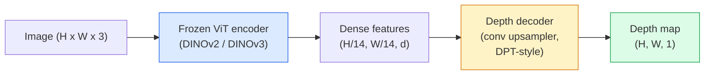

# Monocular Depth & Geometry Estimation / 单目深度与几何估计

> Depth map 是一张单通道图像，其中每个 pixel 都表示到 camera 的距离。过去，不靠 stereo 或 LiDAR，单张 RGB frame 几乎不可能预测深度。到 2026 年，一个 frozen ViT encoder 加轻量 head 就能接近 ground truth 的几个百分点误差。

**Type / 类型：** Build + Use / 构建 + 使用
**Languages / 语言：** Python
**Prerequisites / 前置知识：** Phase 4 Lesson 14 (ViT), Phase 4 Lesson 17 (Self-Supervised Vision), Phase 4 Lesson 07 (U-Net)
**Time / 时间：** 约 60 分钟

## Learning Objectives / 学习目标

- 区分 relative depth 和 metric depth，并说清每个 production model（MiDaS、Marigold、Depth Anything V3、ZoeDepth）解决哪一种
- 使用 Depth Anything V3（DINOv2 backbone）在没有 calibration 的任意单张图片上预测 depth
- 解释为什么单张 image 也能做 monocular depth（perspective cues、texture gradients、learned priors），以及它无法恢复什么（absolute scale、occluded geometry）
- 使用 depth map 和 pinhole camera intrinsics，把 2D detections 提升成 3D points

## The Problem / 问题

Depth 是 2D computer vision 中缺失的轴。给定 RGB，你知道物体在 image plane 上出现在哪里；但不知道它们有多远。Depth sensors（stereo rigs、LiDAR、time-of-flight）可以直接解决这个问题，但昂贵、脆弱，而且 range 有限。

Monocular depth estimation，也就是从单张 RGB frame 预测 depth，过去会产生模糊且不可靠的输出。到 2026 年，大型 pretrained encoders 改变了局面：Depth Anything V3 使用 frozen DINOv2 backbone，可以生成跨 indoor、outdoor、medical 和 satellite domains 泛化的 depth maps。Marigold 把 depth 改写为 conditional diffusion 问题。ZoeDepth 则 regress 真实 metric distances。

Depth 也是 2D detection 和 3D understanding 之间的桥：把 detected box 的 pixels 乘以 depth，就能把 2D object 提升为 3D point cloud。这是每个 AR occlusion system、obstacle-avoidance pipeline，以及每个 “pick up the cup” robot 的核心。

## The Concept / 概念

### Relative vs metric depth / Relative depth 与 metric depth

- **Relative depth**：没有真实单位的有序 `z` 值。“Pixel A 比 pixel B 更近，但距离比例并没有锚定到 metres。”
- **Metric depth**：从 camera 出发的绝对距离，单位是 metres。要求模型学到 image cues 与真实距离之间的统计关系。

MiDaS 和 Depth Anything V3 产生 relative depth。Marigold 产生 relative depth。ZoeDepth、UniDepth 和 Metric3D 产生 metric depth。Metric models 对 camera intrinsics 敏感；relative models 不敏感。

### The encoder-decoder pattern / Encoder-decoder 模式



Depth Anything V3 会 freeze encoder，只训练 DPT-style decoder。Encoder 提供丰富 features；decoder 把这些 features 插值回 image resolution 并 regress depth。

### Why a single image produces depth at all / 为什么单张 image 也能产生 depth

2D image 中包含很多与 depth 相关的 monocular cues：

- **Perspective**：3D 中的 parallel lines 在 2D 中会汇聚。
- **Texture gradient**：远处 surfaces 的 texture 更小、更密。
- **Occlusion order**：近处 objects 会遮挡远处 objects。
- **Size constancy**：已知 objects（cars、humans）提供近似 scale。
- **Atmospheric perspective**：户外场景中，远处 objects 更雾化、更偏蓝。

在数十亿 images 上训练的 ViT 会内化这些 cues。只要数据足够、backbone 足够强，monocular depth 即使没有显式 3D supervision 也能达到合理精度。

### What monocular depth cannot do / Monocular depth 做不到什么

- 缺少 intrinsics 或场景中已知 object 时，无法获得 **absolute metric scale**。Network 可以预测 “cup 是 spoon 的两倍远”，但不知道 cup 是 1 m 还是 10 m 远。
- 无法可靠恢复 **occluded geometry**：椅子背面不可见，就不能可靠推断。
- 对 **truly untextured / reflective surfaces** 表现差：mirrors、glass、uniform walls。Network 会报告看起来 plausible 但错误的 depth。

### Depth Anything V3 in 2026 / 2026 年的 Depth Anything V3

- 使用 vanilla DINOv2 ViT-L/14 作为 encoder（frozen）。
- DPT decoder。
- 在来自多样来源的 posed image pairs 上训练（除 photometric consistency 外，不需要显式 depth supervision）。
- 可以从 **任意数量的 visual inputs 中预测 spatially consistent geometry，无论是否知道 camera poses**。
- 在 monocular depth、any-view geometry、visual rendering、camera pose estimation 上达到 SOTA。

当你在 2026 年需要 depth 时，这是最适合直接调用的模型。

### Marigold — diffusion for depth / Marigold：用于 depth 的 diffusion

Marigold（Ke et al., CVPR 2024）把 depth estimation 改写成 conditional image-to-image diffusion。Conditioning 是 RGB，target 是 depth map。它使用 pretrained Stable Diffusion 2 U-Net 作为 backbone。输出 depth maps 在 object boundaries 上异常锐利。代价是 inference 比 feed-forward models 慢（10-50 denoising steps）。

### Intrinsics and the pinhole camera / Intrinsics 与 pinhole camera

把带 depth `d` 的 pixel `(u, v)` 提升为 camera coordinates 中的 3D point `(X, Y, Z)`：

```
fx, fy, cx, cy = camera intrinsics
X = (u - cx) * d / fx
Y = (v - cy) * d / fy
Z = d
```

Intrinsics 来自 EXIF metadata、calibration pattern，或 monocular intrinsics estimator（Perspective Fields、UniDepth）。没有 intrinsics 时，也可以假设 60-70° FOV 和中等分辨率 principal point 来渲染 point cloud；这适合 visualisation，不适合 measurement。

### Evaluation / 评估

两个标准指标：

- **AbsRel**（absolute relative error）：`mean(|d_pred - d_gt| / d_gt)`。越低越好。Production models 通常在 0.05-0.1。
- **delta < 1.25**（threshold accuracy）：满足 `max(d_pred/d_gt, d_gt/d_pred) < 1.25` 的 pixels 占比。越高越好。SOTA 通常 0.9+。

对 relative depth（Depth Anything V3、MiDaS），evaluation 会使用 scale-and-shift invariant 版本的两个指标。

## Build It / 动手构建

### Step 1: Depth metrics / 步骤 1：Depth metrics

```python
import torch

def abs_rel_error(pred, target, mask=None):
    if mask is not None:
        pred = pred[mask]
        target = target[mask]
    return (torch.abs(pred - target) / target.clamp(min=1e-6)).mean().item()


def delta_accuracy(pred, target, threshold=1.25, mask=None):
    if mask is not None:
        pred = pred[mask]
        target = target[mask]
    ratio = torch.maximum(pred / target.clamp(min=1e-6), target / pred.clamp(min=1e-6))
    return (ratio < threshold).float().mean().item()
```

Evaluation 前始终 mask invalid depth pixels（zero、NaN、saturated）。

### Step 2: Scale-and-shift alignment / 步骤 2：Scale-and-shift alignment

对 relative-depth models，先把 prediction 对齐到 ground truth，再计算 metrics。对 `a * pred + b = target` 做 least-squares fit：

```python
def align_scale_shift(pred, target, mask=None):
    if mask is not None:
        p = pred[mask]
        t = target[mask]
    else:
        p = pred.flatten()
        t = target.flatten()
    A = torch.stack([p, torch.ones_like(p)], dim=1)
    coeffs, *_ = torch.linalg.lstsq(A, t.unsqueeze(-1))
    a, b = coeffs[:2, 0]
    return a * pred + b
```

评估 MiDaS / Depth Anything 时，在 `abs_rel_error` 前运行 `align_scale_shift`。

### Step 3: Lift depth to a point cloud / 步骤 3：把 depth 提升为 point cloud

```python
import numpy as np

def depth_to_point_cloud(depth, intrinsics):
    H, W = depth.shape
    fx, fy, cx, cy = intrinsics
    v, u = np.meshgrid(np.arange(H), np.arange(W), indexing="ij")
    z = depth
    x = (u - cx) * z / fx
    y = (v - cy) * z / fy
    return np.stack([x, y, z], axis=-1)


depth = np.random.uniform(0.5, 4.0, (240, 320))
intr = (320.0, 320.0, 160.0, 120.0)
pc = depth_to_point_cloud(depth, intr)
print(f"point cloud shape: {pc.shape}  (H, W, 3)")
```

一个函数，覆盖所有 3D-lifted application。把 point cloud 导出成 `.ply`，再用 MeshLab 或 CloudCompare 打开。

### Step 4: Smoke test with a synthetic depth scene / 步骤 4：用 synthetic depth scene 做 smoke test

```python
def synthetic_depth(size=96):
    yy, xx = np.meshgrid(np.arange(size), np.arange(size), indexing="ij")
    # Floor: linear gradient from near (top) to far (bottom)
    depth = 1.0 + (yy / size) * 4.0
    # Box in the middle: closer
    mask = (np.abs(xx - size / 2) < size / 6) & (np.abs(yy - size * 0.6) < size / 6)
    depth[mask] = 2.0
    return depth.astype(np.float32)


gt = torch.from_numpy(synthetic_depth(96))
pred = gt + 0.3 * torch.randn_like(gt)  # simulated prediction
aligned = align_scale_shift(pred, gt)
print(f"before align  absRel = {abs_rel_error(pred, gt):.3f}")
print(f"after align   absRel = {abs_rel_error(aligned, gt):.3f}")
```

### Step 5: Depth Anything V3 usage (reference) / 步骤 5：Depth Anything V3 使用方式（参考）

```python
import torch
from transformers import pipeline
from PIL import Image

pipe = pipeline(task="depth-estimation", model="LiheYoung/depth-anything-v2-large")

image = Image.open("street.jpg").convert("RGB")
out = pipe(image)
depth_np = np.array(out["depth"])
```

三行。`out["depth"]` 是 PIL grayscale；转成 numpy 后再做数学处理。对 Depth Anything V3，发布后只需替换 model id；API 不变。

## Use It / 使用它

- **Depth Anything V3**（Meta AI / ByteDance, 2024-2026）：relative depth 的默认选择。Production 中最快的 ViT-large-backbone model。
- **Marigold**（ETH, 2024）：visual quality 最高，inference 较慢。
- **UniDepth**（ETH, 2024）：metric depth，并能估计 camera intrinsics。
- **ZoeDepth**（Intel, 2023）：metric depth；更老，但仍可靠。
- **MiDaS v3.1**：legacy but stable；适合作为 comparison baseline。

典型 integration pattern：

1. RGB frame arrives。
2. Depth model produces depth map。
3. Detector produces boxes。
4. 通过 depth 把 box centroids 提升到 3D；如果有 point cloud，也与它 merge。
5. Downstream：AR occlusion、path planning、object-size estimation、stereo replacement。

Real-time 使用中，Depth Anything V2 Small（INT8 quantised）在 consumer GPU 上以 518x518 分辨率可达到约 30 fps。

## Ship It / 交付内容

本课会产出：

- `outputs/prompt-depth-model-picker.md`：根据 latency、metric-vs-relative need 和 scene type，在 Depth Anything V3、Marigold、UniDepth、MiDaS 之间做选择。
- `outputs/skill-depth-to-pointcloud.md`：一个 skill，使用正确 intrinsics handling 从 depth maps 构建 point clouds，并导出到 `.ply`。

## Exercises / 练习

1. **（Easy）** 在你桌子的任意 10 张 images 上运行 Depth Anything V2。把 depth 保存为 grayscale PNGs 并检查。找出一个 predicted depth 明显错误的 object，并解释 monocular cues 为什么失败。
2. **（Medium）** 给定 RGB + Depth Anything V2 的 depth，提升成 point cloud 并用 `open3d` 渲染。比较两个 scenes（indoor / outdoor），记录哪个看起来更可信。
3. **（Hard）** 取 5 对 images，它们只差一个已知 object 的位置（例如 bottle 靠近 30 cm）。用 UniDepth 在两张图上预测 metric depth。报告 predicted distance delta 与真实 30 cm 的差异。

## Key Terms / 关键术语

| 术语 | 常见说法 | 实际含义 |
|------|----------------|----------------------|
| Monocular depth | “Single-image depth” | 从单张 RGB frame 估计 depth，不使用 stereo 或 LiDAR |
| Relative depth | “Ordered depth” | 没有真实世界单位的有序 z-values |
| Metric depth | “Absolute distance” | 以 metres 为单位的 depth；需要 calibration 或用 metric supervision 训练的模型 |
| AbsRel | “Absolute relative error” | `|d_pred - d_gt| / d_gt` 的平均值；标准 depth metric |
| Delta accuracy | “delta < 1.25” | Prediction 与 ground truth 相差不超过 25% 的 pixels 占比 |
| Pinhole camera | “fx, fy, cx, cy” | 用来把 (u, v, d) 提升为 (X, Y, Z) 的 camera model |
| DPT | “Dense Prediction Transformer” | 在 frozen ViT encoders 上用于 depth 的 conv-based decoder |
| DINOv2 backbone | “The reason it works” | 不依赖 depth labels 也能跨 domains 泛化的 self-supervised features |

## Further Reading / 延伸阅读

- [Depth Anything V3 paper page](https://depth-anything.github.io/) — SOTA monocular depth with DINOv2 encoder
- [Marigold (Ke et al., CVPR 2024)](https://marigoldmonodepth.github.io/) — diffusion-based depth estimation
- [UniDepth (Piccinelli et al., 2024)](https://arxiv.org/abs/2403.18913) — metric depth with intrinsics
- [MiDaS v3.1 (Intel ISL)](https://github.com/isl-org/MiDaS) — canonical relative-depth baseline
- [DINOv3 blog post (Meta)](https://ai.meta.com/blog/dinov3-self-supervised-vision-model/) — encoder family that lifts depth accuracy
