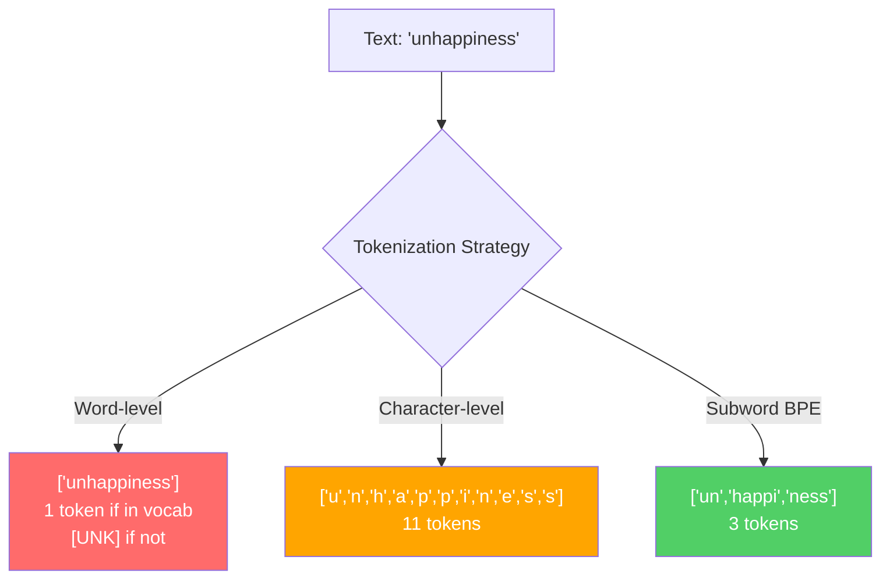
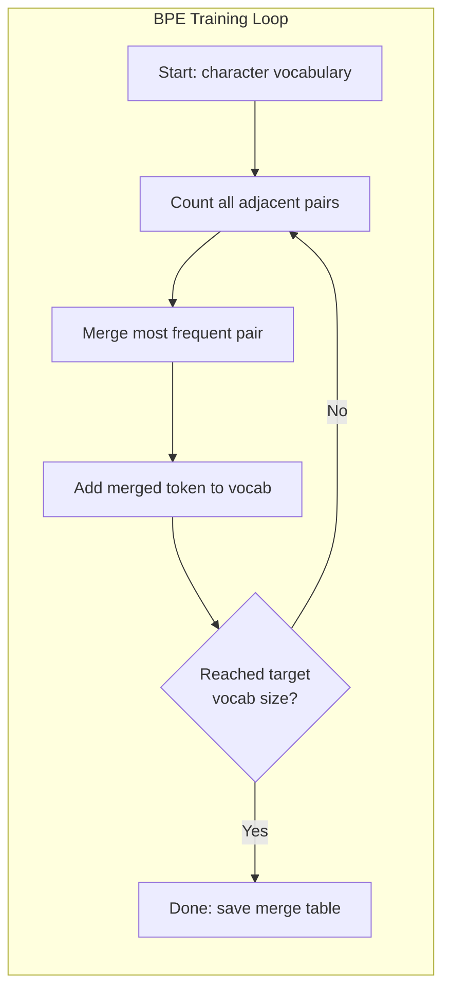
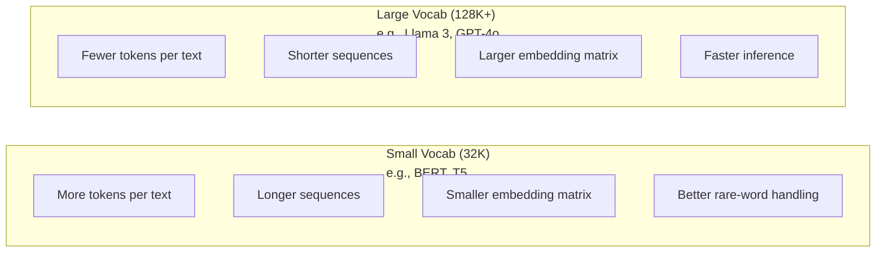

# Tokenizers: BPE, WordPiece, SentencePiece / 分词器：BPE、WordPiece、SentencePiece

> LLM 读不懂英文。它读的是整数。tokenizer 决定这些整数承载的是意义，还是浪费。

**类型：** Build
**语言：** Python
**前置基础：** Phase 05（NLP Foundations）
**时间：** 约 90 分钟

## Learning Objectives / 学习目标

- 从零实现 BPE、WordPiece 和 Unigram 分词算法，并比较它们的 merge 策略
- 解释词表大小如何影响模型效率：太小会拉长序列，太大又会浪费 embedding 参数
- 分析不同语言和代码中的分词伪影，定位具体 tokenizer 在哪里失效
- 使用 `tiktoken` 和 `sentencepiece` 库对文本分词，并检查得到的 token ID

## The Problem / 问题

LLM 读的不是英文。它也读不了任何自然语言。它读的是数字。

从 `"Hello, world!"` 到 `[15496, 11, 995, 0]`，中间的桥就是 tokenizer。每个单词、每个空格、每个标点，都必须先变成一个整数，模型才能处理。这个转换不是中性的：它会把一组假设固化进模型，而且后面无法撤销。

如果这一步做错，模型就会把容量浪费在常见词的多 token 表示上。`"unfortunately"` 本来可以是一个 token，却变成四个。对多音节词密集的文本来说，你的 128K context window 等价于缩水 75%。如果做对，同样的上下文窗口能容纳两倍的意义。一个模型是“擅长代码”，还是“遇到 Python 就卡住”，很多时候差别就在 tokenizer 的训练方式。

你对 GPT-4 或 Claude 发出的每次 API 调用，都是按 token 计费。模型生成的每个 token 都消耗计算。表达同一段输出所需的 token 越少，端到端推理越快。Tokenization 不是预处理，它是架构的一部分。

## The Concept / 概念

### Three Approaches That Failed (and One That Won) / 三种失败方案和一种胜出方案

把文本转成数字，有三种直觉上很自然的方法。其中两种无法在规模化场景下工作。

**词级分词** 按空格和标点切分。`"The cat sat"` 变成 `["The", "cat", "sat"]`。这很简单。但 `"tokenization"` 呢？`"GPT-4o"` 呢？德语复合词 `"Geschwindigkeitsbegrenzung"` 呢？词级分词需要一个巨大词表，覆盖每种语言里的每个词。漏掉一个词，就只能得到可怕的 `[UNK]` token，也就是模型在说“我不知道这是什么”。仅英文就有超过百万种词形。再加上代码、URL、科学计数法和 100 多种语言，词表会趋近无限大。

**字符级分词** 走向另一个极端。`"hello"` 变成 `["h", "e", "l", "l", "o"]`。词表非常小，通常只有几百个字符；也永远不会出现 unknown token。但序列会变得极长。原本 10 个词级 token 的句子，可能变成 50 个字符级 token。模型还必须学会 `"t"`、`"h"`、`"e"` 连在一起表示 `"the"`，把注意力容量浪费在三岁小孩都已经掌握的东西上。

**子词分词** 找到了中间地带。常见词保持完整：`"the"` 是一个 token。罕见词拆成有意义的片段：`"unhappiness"` 变成 `["un", "happi", "ness"]`。词表保持可控，通常是 30K 到 128K tokens；序列也保持较短。由于任何词都可以由子词片段拼出来，unknown token 基本消失。

现代 LLM 都使用子词分词。GPT-2、GPT-4、BERT、Llama 3、Claude 都是如此。真正的问题是：用哪一种算法？



### BPE: Byte Pair Encoding / BPE：字节对编码

BPE 原本是一个贪心压缩算法，后来被重新用于 tokenization。它的核心思路简单到可以写在一张索引卡片上。

先从单个字符开始。统计训练语料里所有相邻 pair 的出现次数。把最常出现的 pair 合并成一个新 token。不断重复，直到达到目标词表大小。

```figure
tokenizer-bpe
```

下面是在一个很小语料上运行 BPE 的过程，语料包含 `"lower"`、`"lowest"` 和 `"newest"`：

```
Corpus (with word frequencies):
  "lower"  x5
  "lowest" x2
  "newest" x6

Step 0 -- Start with characters:
  l o w e r       (x5)
  l o w e s t     (x2)
  n e w e s t     (x6)

Step 1 -- Count adjacent pairs:
  (e,s): 8    (s,t): 8    (l,o): 7    (o,w): 7
  (w,e): 13   (e,r): 5    (n,e): 6    ...

Step 2 -- Merge most frequent pair (w,e) -> "we":
  l o we r        (x5)
  l o we s t      (x2)
  n e we s t      (x6)

Step 3 -- Recount and merge (e,s) -> "es":
  l o we r        (x5)
  l o we s t      (x2)    <- 'es' only forms from 'e'+'s', not 'we'+'s'
  n e we s t      (x6)    <- wait, the 'e' before 'we' and 's' after 'we'

Actually tracking this precisely:
  After "we" merge, remaining pairs:
  (l,o): 7   (o,we): 7   (we,r): 5   (we,s): 8
  (s,t): 8   (n,e): 6    (e,we): 6

Step 3 -- Merge (we,s) -> "wes" or (s,t) -> "st" (tied at 8, pick first):
  Merge (we,s) -> "wes":
  l o we r        (x5)
  l o wes t       (x2)
  n e wes t       (x6)

Step 4 -- Merge (wes,t) -> "west":
  l o we r        (x5)
  l o west        (x2)
  n e west        (x6)

...continue until target vocab size reached.
```

merge table 就是 tokenizer。对新文本编码时，按照训练时学到的顺序应用这些 merge。训练语料决定哪些 merge 存在，而这个选择会永久改变模型“看到”的输入形态。



### Byte-Level BPE (GPT-2, GPT-3, GPT-4) / 字节级 BPE（GPT-2、GPT-3、GPT-4）

标准 BPE 运行在 Unicode 字符上。字节级 BPE 运行在原始字节（0-255）上。这样基础词表恰好有 256 个条目，可以处理任何语言或编码，并且永远不会产生 unknown token。

GPT-2 推广了这种做法。基础词表覆盖所有可能的字节，BPE merge 在此之上构建。OpenAI 的 `tiktoken` 库实现了字节级 BPE，常见词表大小如下：

- GPT-2: 50,257 tokens
- GPT-3.5/GPT-4: ~100,256 tokens（`cl100k_base` encoding）
- GPT-4o: 200,019 tokens（`o200k_base` encoding）

### WordPiece (BERT) / WordPiece（BERT）

WordPiece 看起来很像 BPE，但选择 merge 的方式不同。它不是看原始频次，而是最大化训练数据的似然：

```
BPE merge criterion:      count(A, B)
WordPiece merge criterion: count(AB) / (count(A) * count(B))
```

BPE 问的是：“哪个 pair 出现次数最多？”WordPiece 问的是：“哪个 pair 的共同出现程度超过随机预期最多？”这个细微差别会得到不同的词表。WordPiece 偏好“共现很意外”的 merge，而不只是高频 merge。

WordPiece 还用 `"##"` 前缀标记延续子词：

```
"unhappiness" -> ["un", "##happi", "##ness"]
"embedding"   -> ["em", "##bed", "##ding"]
```

`"##"` 前缀表示这个片段延续前一个 token。BERT 使用 30,522 token 词表的 WordPiece。所有 BERT 变体都围绕这个思路展开；注意 RoBERTa 的 tokenizer 实际上是 BPE，但 BERT 本身是 WordPiece。

### SentencePiece (Llama, T5) / SentencePiece（Llama、T5）

SentencePiece 把输入视为一条原始 Unicode 字符流，包括空白。没有预分词步骤，也没有针对某种语言的词边界规则。因此它真正语言无关，能处理中文、日文、泰文等不靠空格分词的语言。

SentencePiece 支持两种算法：

- **BPE mode**：和标准 BPE 一样的 merge 逻辑，只是应用在原始字符序列上
- **Unigram mode**：从一个很大的词表开始，迭代删除对整体似然影响最小的 token。它相当于 BPE 的反向过程：不是合并，而是裁剪。

Llama 2 使用词表大小为 32,000 的 SentencePiece BPE。T5 使用词表大小为 32,000 的 SentencePiece Unigram。注意：Llama 3 切换到了基于 `tiktoken` 的字节级 BPE tokenizer，词表大小为 128,256。

### Vocabulary Size Tradeoffs / 词表大小的取舍

这是一个真实工程决策，并且后果可以测量。



看具体数字。一个 128K 词表配 4,096 维 embedding，仅 embedding 矩阵就是 128,000 x 4,096 = 5.24 亿参数。32K 词表则是 1.31 亿参数。仅 tokenizer 的选择就带来 4 亿参数差异。

但更大的词表会更激进地压缩文本。同一段英文段落，用 32K 词表可能需要 100 个 token，用 128K 词表可能只需要 70 个。这意味着生成时少做 30% 的 forward pass。对每天服务数百万请求的模型来说，这就是直接的计算成本下降。

趋势很明确：词表越来越大。GPT-2 是 50,257。GPT-4 约 100K。Llama 3 是 128K。GPT-4o 是 200K。

| Model | Vocab Size | Tokenizer Type | Avg Tokens per English Word |
|-------|-----------|----------------|---------------------------|
| BERT | 30,522 | WordPiece | ~1.4 |
| GPT-2 | 50,257 | Byte-level BPE | ~1.3 |
| Llama 2 | 32,000 | SentencePiece BPE | ~1.4 |
| GPT-4 | ~100,256 | Byte-level BPE | ~1.2 |
| Llama 3 | 128,256 | Byte-level BPE (tiktoken) | ~1.1 |
| GPT-4o | 200,019 | Byte-level BPE | ~1.0 |

### The Multilingual Tax / 多语言税

主要在英文上训练的 tokenizer 对其他语言非常苛刻。GPT-2 的 tokenizer 处理韩文时，平均一个词要 2-3 个 token。中文有时更糟。这意味着韩文用户有效拥有的 context window 可能只有英文用户的一半，却支付同样的价格、获得更低的信息密度。

这就是 Llama 3 把词表从 32K 扩大到 128K 的原因。给非英文文字系统分配更多 token，可以让不同语言之间的压缩效率更公平。

```figure
tokenizer-tradeoff
```

## Build It / 动手构建

### Step 1: Character-Level Tokenizer / 步骤 1：字符级 Tokenizer

从地基开始。字符级 tokenizer 把每个字符映射到它的 Unicode code point。不需要训练，没有 unknown token，就是直接映射。

```python
class CharTokenizer:
    def encode(self, text):
        return [ord(c) for c in text]

    def decode(self, tokens):
        return "".join(chr(t) for t in tokens)
```

`"hello"` 会变成 `[104, 101, 108, 108, 111]`。每个字符都是自己的 token。这是后续改进的 baseline。

### Step 2: BPE Tokenizer from Scratch / 步骤 2：从零实现 BPE Tokenizer

这是实际实现。我们在原始字节上训练（类似 GPT-2），统计 pair，合并最频繁者，并按顺序记录每一次 merge。merge table 就是 tokenizer。

```python
from collections import Counter

class BPETokenizer:
    def __init__(self):
        self.merges = {}
        self.vocab = {}

    def _get_pairs(self, tokens):
        pairs = Counter()
        for i in range(len(tokens) - 1):
            pairs[(tokens[i], tokens[i + 1])] += 1
        return pairs

    def _merge_pair(self, tokens, pair, new_token):
        merged = []
        i = 0
        while i < len(tokens):
            if i < len(tokens) - 1 and tokens[i] == pair[0] and tokens[i + 1] == pair[1]:
                merged.append(new_token)
                i += 2
            else:
                merged.append(tokens[i])
                i += 1
        return merged

    def train(self, text, num_merges):
        tokens = list(text.encode("utf-8"))
        self.vocab = {i: bytes([i]) for i in range(256)}

        for i in range(num_merges):
            pairs = self._get_pairs(tokens)
            if not pairs:
                break
            best_pair = max(pairs, key=pairs.get)
            new_token = 256 + i
            tokens = self._merge_pair(tokens, best_pair, new_token)
            self.merges[best_pair] = new_token
            self.vocab[new_token] = self.vocab[best_pair[0]] + self.vocab[best_pair[1]]

        return self

    def encode(self, text):
        tokens = list(text.encode("utf-8"))
        for pair, new_token in self.merges.items():
            tokens = self._merge_pair(tokens, pair, new_token)
        return tokens

    def decode(self, tokens):
        byte_sequence = b"".join(self.vocab[t] for t in tokens)
        return byte_sequence.decode("utf-8", errors="replace")
```

BPE 的训练循环就是：统计 pair，合并赢家，重复。每次 merge 都会减少总 token 数。经过 `num_merges` 轮后，词表从 256 个基础字节增长到 256 + num_merges。

编码时必须按学习顺序应用 merge。这很重要。如果第 1 次 merge 产生 `"th"`，第 5 次 merge 产生 `"the"`，编码必须先应用第 1 次 merge，这样第 5 次才可能从 `"th"` + `"e"` 形成 `"the"`。

解码是反向过程：在词表里查每个 token ID，拼接字节，再按 UTF-8 解码。

### Step 3: Encode and Decode Roundtrip / 步骤 3：编码解码往返

```python
corpus = (
    "The cat sat on the mat. The cat ate the rat. "
    "The dog sat on the log. The dog ate the frog. "
    "Natural language processing is the study of how computers "
    "understand and generate human language. "
    "Tokenization is the first step in any NLP pipeline."
)

tokenizer = BPETokenizer()
tokenizer.train(corpus, num_merges=40)

test_sentences = [
    "The cat sat on the mat.",
    "Natural language processing",
    "tokenization pipeline",
    "unhappiness",
]

for sentence in test_sentences:
    encoded = tokenizer.encode(sentence)
    decoded = tokenizer.decode(encoded)
    raw_bytes = len(sentence.encode("utf-8"))
    ratio = len(encoded) / raw_bytes
    print(f"'{sentence}'")
    print(f"  Tokens: {len(encoded)} (from {raw_bytes} bytes) -- ratio: {ratio:.2f}")
    print(f"  Roundtrip: {'PASS' if decoded == sentence else 'FAIL'}")
```

压缩率说明 tokenizer 有多有效。ratio 为 0.50 表示 tokenizer 把文本压缩到原始字节数的一半 token。越低越好。在训练语料上，ratio 会很好；在 `"unhappiness"` 这种分布外文本上（它没有出现在语料里），ratio 会变差，因为 tokenizer 会退回到更接近字符级的编码。

### Step 4: Compare with tiktoken / 步骤 4：与 tiktoken 比较

```python
import tiktoken

enc = tiktoken.get_encoding("cl100k_base")

texts = [
    "The cat sat on the mat.",
    "unhappiness",
    "Hello, world!",
    "def fibonacci(n): return n if n < 2 else fibonacci(n-1) + fibonacci(n-2)",
    "Geschwindigkeitsbegrenzung",
]

for text in texts:
    our_tokens = tokenizer.encode(text)
    tiktoken_tokens = enc.encode(text)
    tiktoken_pieces = [enc.decode([t]) for t in tiktoken_tokens]
    print(f"'{text}'")
    print(f"  Our BPE:   {len(our_tokens)} tokens")
    print(f"  tiktoken:  {len(tiktoken_tokens)} tokens -> {tiktoken_pieces}")
```

`tiktoken` 使用同一个算法，但它在数百 GB 文本上训练，并拥有 100,000 次 merge。算法相同，差别在训练数据和 merge 数量。你用一个段落和 40 次 merge 训练出来的 tokenizer，不可能在大规模语料训练的 `tiktoken` 面前胜出。但机制完全一样。

### Step 5: Vocabulary Analysis / 步骤 5：词表分析

```python
def analyze_vocabulary(tokenizer, test_texts):
    total_tokens = 0
    total_chars = 0
    token_usage = Counter()

    for text in test_texts:
        encoded = tokenizer.encode(text)
        total_tokens += len(encoded)
        total_chars += len(text)
        for t in encoded:
            token_usage[t] += 1

    print(f"Vocabulary size: {len(tokenizer.vocab)}")
    print(f"Total tokens across all texts: {total_tokens}")
    print(f"Total characters: {total_chars}")
    print(f"Avg tokens per character: {total_tokens / total_chars:.2f}")

    print(f"\nMost used tokens:")
    for token_id, count in token_usage.most_common(10):
        token_bytes = tokenizer.vocab[token_id]
        display = token_bytes.decode("utf-8", errors="replace")
        print(f"  Token {token_id:4d}: '{display}' (used {count} times)")

    unused = [t for t in tokenizer.vocab if t not in token_usage]
    print(f"\nUnused tokens: {len(unused)} out of {len(tokenizer.vocab)}")
```

这会暴露词表里的 Zipf 分布。少数 token 占据主要使用量，比如空格、`"the"`、`"e"`。大多数 token 很少使用。生产 tokenizer 正是围绕这个分布优化的：常见模式得到短 token ID，稀有模式用更长表示。

## Use It / 应用它

你已经写出了可工作的 scratch BPE。现在看看生产工具是什么样子。

### tiktoken (OpenAI) / tiktoken（OpenAI）

```python
import tiktoken

enc = tiktoken.get_encoding("cl100k_base")

text = "Tokenizers convert text to integers"
tokens = enc.encode(text)
print(f"Tokens: {tokens}")
print(f"Pieces: {[enc.decode([t]) for t in tokens]}")
print(f"Roundtrip: {enc.decode(tokens)}")
```

`tiktoken` 用 Rust 编写，并提供 Python 绑定。它每秒可以编码数百万 token。仍然是同一个 BPE 算法，只是实现达到工业强度。

### Hugging Face tokenizers / Hugging Face tokenizers

```python
from tokenizers import Tokenizer
from tokenizers.models import BPE
from tokenizers.trainers import BpeTrainer
from tokenizers.pre_tokenizers import ByteLevel

tokenizer = Tokenizer(BPE())
tokenizer.pre_tokenizer = ByteLevel()

trainer = BpeTrainer(vocab_size=1000, special_tokens=["<pad>", "<eos>", "<unk>"])
tokenizer.train(["corpus.txt"], trainer)

output = tokenizer.encode("The cat sat on the mat.")
print(f"Tokens: {output.tokens}")
print(f"IDs: {output.ids}")
```

Hugging Face 的 `tokenizers` 库底层同样是 Rust。它能在几秒内完成 GB 级语料上的 BPE 训练。训练自有模型时，这才是实际会使用的工具。

### Loading Llama's Tokenizer / 加载 Llama 的 Tokenizer

```python
from transformers import AutoTokenizer

tokenizer = AutoTokenizer.from_pretrained("meta-llama/Llama-3.1-8B")

text = "Tokenizers are the unsung heroes of LLMs"
tokens = tokenizer.encode(text)
print(f"Token IDs: {tokens}")
print(f"Tokens: {tokenizer.convert_ids_to_tokens(tokens)}")
print(f"Vocab size: {tokenizer.vocab_size}")

multilingual = ["Hello world", "Hola mundo", "Bonjour le monde"]
for text in multilingual:
    ids = tokenizer.encode(text)
    print(f"'{text}' -> {len(ids)} tokens")
```

Llama 3 的 128K 词表对非英文文本的压缩明显优于 GPT-2 的 50K 词表。你可以自己验证：用多种语言编码同一句子，然后数 token。

## Ship It / 交付它

本课产出 `outputs/prompt-tokenizer-analyzer.md`：一个可复用 prompt，用于分析任意文本和模型组合的 tokenization 效率。把文本样本交给它，它会告诉你哪个模型的 tokenizer 处理得最好。

## Exercises / 练习

1. 修改 BPE tokenizer，让它在每次 merge 后打印词表。观察 `"t"` + `"h"` 如何变成 `"th"`，再观察 `"th"` + `"e"` 如何变成 `"the"`。追踪常见英文词是怎样一步步组装出来的。

2. 给 BPE tokenizer 添加 special tokens（`<pad>`、`<eos>`、`<unk>`）。为它们分配 ID 0、1、2，并相应平移所有其他 token。实现一个预分词步骤，在运行 BPE 前先按空白切分。

3. 实现 WordPiece 的 merge 标准，也就是似然比而不是频次。在同一语料、相同 merge 次数下分别训练 BPE 和 WordPiece。比较得到的词表：哪个会产生更有语言学意义的子词？

4. 构建一个多语言 tokenizer 效率 benchmark。选取英文、西班牙文、中文、韩文和阿拉伯文各 10 个句子。用 `tiktoken`（`cl100k_base`）分词，并测量平均每字符 token 数。量化每种语言的“multilingual tax”。

5. 在更大语料上训练你的 BPE tokenizer，例如下载一篇 Wikipedia 文章。调整 merge 次数，让它在同一文本上的压缩率达到 `tiktoken` 的 10% 以内。这个练习会迫使你理解语料规模、merge 数量和压缩质量之间的关系。

## Key Terms / 关键术语

| 术语 | 常见说法 | 实际含义 |
|------|----------------|----------------------|
| Token | “一个词” | 模型词表中的一个单位；可能是字符、子词、词，也可能是多个词组成的片段 |
| BPE | “某种压缩东西” | Byte Pair Encoding；反复合并最频繁的相邻 token pair，直到达到目标词表大小 |
| WordPiece | “BERT 的 tokenizer” | 类似 BPE，但 merge 依据是似然比 count(AB)/(count(A)*count(B))，而不是原始频次 |
| SentencePiece | “一个 tokenizer 库” | 语言无关 tokenizer，直接在原始 Unicode 上运行，无需预分词，支持 BPE 和 Unigram |
| Vocabulary size | “它认识多少词” | 唯一 token 总数：GPT-2 有 50,257，BERT 有 30,522，Llama 3 有 128,256 |
| Fertility | “不像 tokenizer 术语” | 平均每个词对应多少 token；衡量跨语言 tokenizer 效率（1.0 最理想，3.0 表示模型要多做三倍工作） |
| Byte-level BPE | “GPT 的 tokenizer” | 在原始字节（0-255）而不是 Unicode 字符上运行的 BPE，保证任何输入都没有 unknown token |
| Merge table | “tokenizer 文件” | 训练期间学到的有序 pair merge 列表；它就是 tokenizer 本身，而且顺序很重要 |
| Pre-tokenization | “按空格切分” | 子词分词前应用的规则：空白切分、数字分离、标点处理 |
| Compression ratio | “tokenizer 有多高效” | 输出 token 数除以输入字节数；越低表示压缩越好，推理越快 |

## Further Reading / 延伸阅读

- [Sennrich et al., 2016 -- "Neural Machine Translation of Rare Words with Subword Units"](https://arxiv.org/abs/1508.07909) -- 将 BPE 引入 NLP 的论文，把一个 1994 年的压缩算法变成现代 tokenization 的基础
- [Kudo & Richardson, 2018 -- "SentencePiece: A simple and language independent subword tokenizer"](https://arxiv.org/abs/1808.06226) -- 让多语言模型变得实用的语言无关 tokenization
- [OpenAI tiktoken repository](https://github.com/openai/tiktoken) -- GPT-3.5/4/4o 使用的生产级 Rust BPE 实现，提供 Python 绑定
- [Hugging Face Tokenizers documentation](https://huggingface.co/docs/tokenizers) -- 具备 Rust 性能的生产级 tokenizer 训练工具
