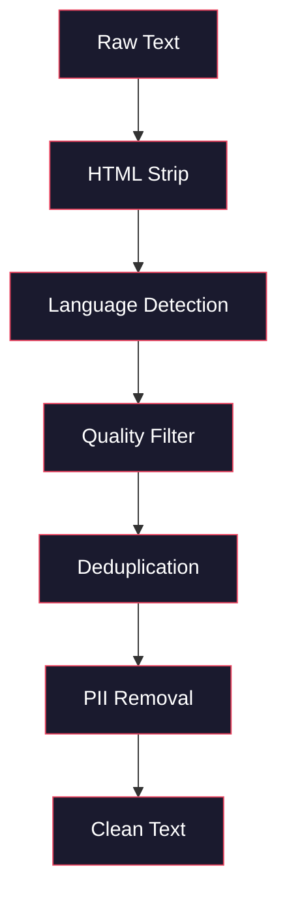
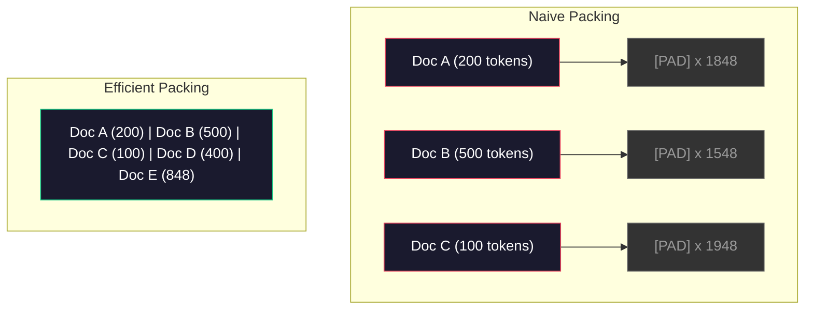

# Data Pipelines for Pre-Training / 预训练数据流水线

> 模型是一面镜子。你喂给它什么数据，它就会用完美流畅度反射出什么。如果喂垃圾，它也会流畅地反射垃圾。

**类型：** Build
**语言：** Python
**前置基础：** Phase 10, Lessons 01-02（Tokenizers, Building a Tokenizer）
**时间：** 约 90 分钟

## Learning Objectives / 学习目标

- 构建一条流式数据流水线，在不把 TB 级文本全部载入内存的情况下完成 tokenization、chunking、shuffling 和 batching
- 实现真实预训练流水线中的数据质量过滤，包括 deduplication、language detection 和 content filtering
- 创建固定长度训练序列，并正确处理 attention masks 和文档边界
- profile 数据流水线吞吐，确保 dataloader 能跟上 GPU 训练速度

## The Problem / 问题

你已经有了 tokenizer。现在你需要数据。

不是一个 dataset，不是一份 CSV 文件，而是 TB 级文本：清洗、去重、按质量过滤、tokenize 成固定长度序列，并以足够快的速度随机批量供给训练，让你的 8-GPU 集群永远不用等下一批数据。

大多数人以为训练 LLM 的重点是模型架构。其实不是。Llama 3 使用了 15.6 万亿 tokens。GPT-3 使用了 3000 亿。DeepSeek-V2 使用了 8.1 万亿。三者架构大体相同：堆叠 transformer blocks，包含 attention 和 feedforward layers。输出质量的差异，压倒性地来自数据。

DeepMind 的 Chinchilla 论文把这件事量化了。对于给定 compute budget，模型参数量与训练 token 数存在一个最优比例。Chinchilla 说明 2022 年的大多数模型都严重 undertrained：参数太多，见过的数据太少。一个用 1.4 万亿 tokens 训练的 70B 参数模型（Chinchilla-optimal），击败了用 3000 亿 tokens 训练的 280B 模型（Gopher）。

数据流水线决定了你的模型是在学习语言，还是在学习噪声。

## The Concept / 概念

### Where the Data Comes From / 数据从哪里来

每个大语言模型都是在多种数据源的混合上训练的。大多数实验室会严格保密精确配比，但我们已经知道足够多，可以理解这些类别。

| Source | Size | Quality | Used By |
|--------|------|---------|---------|
| Common Crawl | ~250 TB raw | 低（需要重度过滤） | GPT-3, Llama, most open models |
| Wikipedia | ~20 GB | 高 | Every major LLM |
| GitHub code | ~1 TB+ | 中（大量重复和废弃代码） | StarCoder, CodeLlama, DeepSeek-Coder |
| Books (BookCorpus, Pile) | ~100 GB | 高 | GPT-2, GPT-3, early models |
| Academic papers (arXiv, S2ORC) | ~100 GB | STEM 领域高 | Llama, Galactica |
| StackOverflow, Reddit | ~100 GB | 中 | Llama, Falcon |
| Curated web (C4, RefinedWeb) | ~5 TB | 中到高（已预过滤） | T5, Falcon |

Llama 3 公开过数据 mix：约 50% web data、25% code、13% books and academic papers、8% math data、4% multilingual web data。总量是 15.6 万亿 tokens，来自超过 5 TB 的原始文本。

比例和总量同样重要。web data 太多，模型会变成 Reddit 复读机。code 太少，它就不会编程。math 太少，它就无法推理。把 mix 调对是训练 LLM 最难的部分之一，而且没有公式，只能通过实验和评估逼近。

### Data Cleaning / 数据清洗

原始 web data 非常脏。典型 Common Crawl dump 包含：

- HTML tags 和 JavaScript
- boilerplate headers、footers、navigation menus
- duplicate pages，包括 exact 和 near-duplicate
- machine-generated spam
- personally identifiable information（PII）
- low-quality text，比如关键词列表、SEO spam
- 以文本形式编码的非文本内容

清洗不是可选项。它决定模型是生成连贯段落，还是输出混杂着 HTML tags 和商品列表的文本。



每一步都消除一类噪声：

**HTML stripping:** 移除所有 markup，只保留可见文本内容。`trafilatura` 或 `readability` 这类库会抽取正文，同时丢弃导航、广告和 boilerplate。

**Language detection:** 使用 fastText 的 language identification model（`lid.176.bin`）为每个文档分类。只保留目标语言。一个被分类为英文但置信度低于 0.8 的文档，很可能不是干净英文。

**Quality filtering:** 这里开始有意思。RefinedWeb（Falcon 背后的数据集）使用 perplexity-based filter：先在 Wikipedia 上训练一个小语言模型，再给每个文档打分。高 perplexity 表示文档不像 Wikipedia，很可能是 spam、关键词列表或机器生成内容。超过阈值的文档会被移除。

**Deduplication:** 最有影响力的清洗步骤。Common Crawl 里有海量重复页面，比如法律免责声明、cookie notice、服务条款。对重复内容训练会浪费 compute，还会导致模型记忆并逐字吐出特定段落。

**PII removal:** 姓名、邮箱、电话号码、社会保障号。结构化 PII 可用 regex 检测，语境中的姓名可用 NER 模型检测。

### Deduplication with MinHash / 用 MinHash 去重

精确去重很简单：hash 每个文档，删除重复项。但真正麻烦的是 near-duplicates。同一篇新闻报道，广告稍有不同，就是 near-duplicate。正文 95% 相同，但字节级不完全一致。

MinHash + Locality-Sensitive Hashing（LSH）可以高效解决这个问题。


基本思路：

1. **Shingling:** 把每个文档转成 n-gram 集合，例如词级或字符级 5-grams。`"the quick brown fox"` 用 3-word shingles 会变成 `{"the quick brown", "quick brown fox"}`。

2. **MinHash:** 对每个文档的 shingle set 计算 k 个 hash values。每个 hash value 是在一个不同 hash function 下，所有 shingles 的最小 hash。这会得到固定长度的 signature，用来近似两个文档的 Jaccard similarity。

3. **LSH:** 按 MinHash signature 的 bands 把文档放进 buckets。同一 bucket 中的文档是候选 near-duplicates。这样不必比较所有 pair，只比较候选项。

4. **Verify:** 对每个候选 pair 计算精确 Jaccard similarity。如果 similarity 超过阈值，通常是 0.8，就删除其中一个副本。

Llama 团队报告说，他们通过 deduplication 移除了约 38% web data。这不是小数目。超过三分之一的 Common Crawl 都是重复或近重复内容。

### Sequence Packing / 序列打包

模型需要固定长度输入序列。但你的文档是变长的。有些 50 tokens，有些 50,000 tokens。

朴素做法是把每个文档 pad 到最大序列长度。这会把大量 compute 浪费在对学习没有贡献的 padding tokens 上。

更好的做法是把多个文档打包进同一序列，中间用 end-of-sequence tokens 分隔。一个 2048-token 序列可能包含三个短文档，用 [EOS] tokens 连接。



attention mask 必须正确设置。同一 packed sequence 中，Document A 的 tokens 不应 attend 到 Document B 的 tokens。这需要 block-diagonal attention mask。

长文档会被截断，或按序列边界切成 chunks。切分点很重要：在句子中间切开会让模型看到不完整思想。有些流水线会尽可能按段落或句子边界切分。

### The Chinchilla Scaling Law / Chinchilla 缩放律

对于固定 compute budget C（以 FLOPs 计），最优模型大小 N 和数据集大小 D 满足：

```
N_opt ~ C^0.5
D_opt ~ C^0.5
```

实践含义是：模型大小和数据大小应该大致同比增长。参数量增加 10 倍的模型，需要大约 10 倍训练 tokens 才能达到同等 loss。

| Model | Parameters | Training Tokens | Chinchilla-Optimal? |
|-------|-----------|----------------|-------------------|
| GPT-3 | 175B | 300B | No (undertrained 3-4x) |
| Chinchilla | 70B | 1.4T | Yes (by design) |
| Llama 2 | 70B | 2T | Overtrained (intentionally) |
| Llama 3 | 70B | 15T | Heavily overtrained |

Llama 3 有意违反 Chinchilla law。Meta 发现，用更多数据进行 overtraining，远超 compute-optimal ratio，会得到更适合推理部署的模型。额外训练成本只支付一次，但更小的模型可以永久降低服务成本。这常被称为 “inference-optimal” scaling approach，并从 2024 年起成为行业标准。

## Build It / 动手构建

### Step 1: Text Cleaning / 步骤 1：文本清洗

去掉 HTML，规范化空白，移除非文本内容。我们会用一份 public domain text（Project Gutenberg）作为小语料。

```python
import re

def clean_text(text):
    text = re.sub(r"<[^>]+>", "", text)
    text = re.sub(r"http\S+", "", text)
    text = re.sub(r"[^\x20-\x7E\n]", "", text)
    text = re.sub(r"\n{3,}", "\n\n", text)
    text = re.sub(r" {2,}", " ", text)
    return text.strip()

def quality_filter(text, min_words=50, max_ratio_caps=0.3, max_ratio_special=0.1):
    words = text.split()
    if len(words) < min_words:
        return False
    caps_ratio = sum(1 for w in words if w.isupper()) / len(words)
    if caps_ratio > max_ratio_caps:
        return False
    special_chars = sum(1 for c in text if not c.isalnum() and not c.isspace())
    if special_chars / max(len(text), 1) > max_ratio_special:
        return False
    return True
```

这个 quality filter 能抓住 SEO spam（ALL CAPS）、machine-generated noise（特殊字符比例过高）和 stub pages（过短）。仅这三项检查，就能从 web crawls 里移除相当多垃圾。

### Step 2: MinHash Deduplication / 步骤 2：MinHash 去重

从零实现 MinHash。不需要外部库，只用 `hashlib`。

```python
import hashlib
from collections import defaultdict

def get_shingles(text, k=5):
    words = text.lower().split()
    if len(words) < k:
        return set()
    return {" ".join(words[i:i+k]) for i in range(len(words) - k + 1)}

def minhash_signature(shingles, num_hashes=128):
    signature = []
    for i in range(num_hashes):
        min_hash = float("inf")
        for shingle in shingles:
            h = int(hashlib.sha256(f"{i}:{shingle}".encode()).hexdigest(), 16)
            min_hash = min(min_hash, h)
        signature.append(min_hash)
    return signature

def lsh_buckets(signature, bands=16):
    rows_per_band = len(signature) // bands
    buckets = []
    for b in range(bands):
        start = b * rows_per_band
        band_data = tuple(signature[start:start + rows_per_band])
        bucket_hash = hashlib.md5(str(band_data).encode()).hexdigest()
        buckets.append((b, bucket_hash))
    return buckets

def deduplicate(documents, threshold=0.8, num_hashes=128, bands=16):
    signatures = []
    shingle_sets = []
    for doc in documents:
        shingles = get_shingles(doc)
        shingle_sets.append(shingles)
        signatures.append(minhash_signature(shingles, num_hashes))

    bucket_map = defaultdict(list)
    for doc_idx, sig in enumerate(signatures):
        for band_id, bucket_hash in lsh_buckets(sig, bands):
            bucket_map[(band_id, bucket_hash)].append(doc_idx)

    duplicate_pairs = set()
    for bucket_docs in bucket_map.values():
        if len(bucket_docs) < 2:
            continue
        for i in range(len(bucket_docs)):
            for j in range(i + 1, len(bucket_docs)):
                duplicate_pairs.add((bucket_docs[i], bucket_docs[j]))

    removed = set()
    for i, j in duplicate_pairs:
        if i in removed or j in removed:
            continue
        s1, s2 = shingle_sets[i], shingle_sets[j]
        if not s1 or not s2:
            continue
        jaccard = len(s1 & s2) / len(s1 | s2)
        if jaccard >= threshold:
            removed.add(j)

    return [doc for idx, doc in enumerate(documents) if idx not in removed], len(removed)
```

`num_hashes=128` 和 `bands=16` 控制 precision-recall tradeoff。更多 hashes 会给出更准确的相似度估计。更多 bands 会提高 recall，也就是抓到更多重复，但 false positives 也会增加。对典型 web text 来说，这组值效果不错。

### Step 3: Tokenize and Pack Sequences / 步骤 3：Tokenize 并打包序列

把清洗、去重后的文本 tokenize，然后打包成训练用的固定长度序列。

```python
def tokenize_corpus(documents, tokenizer):
    all_tokens = []
    for doc in documents:
        tokens = tokenizer.encode(doc)
        all_tokens.extend(tokens)
        all_tokens.append(tokenizer.eos_id)
    return all_tokens

def pack_sequences(token_ids, seq_length, pad_id=0):
    sequences = []
    attention_masks = []
    for i in range(0, len(token_ids), seq_length):
        seq = token_ids[i:i + seq_length]
        mask = [1] * len(seq)
        if len(seq) < seq_length:
            pad_count = seq_length - len(seq)
            seq = seq + [pad_id] * pad_count
            mask = mask + [0] * pad_count
        sequences.append(seq)
        attention_masks.append(mask)
    return sequences, attention_masks
```

### Step 4: DataLoader for Training / 步骤 4：训练用 DataLoader

产出随机 batch 的 packed sequences。这就是训练循环消费的对象。

```python
import random

class PreTrainingDataLoader:
    def __init__(self, sequences, attention_masks, batch_size, shuffle=True):
        self.sequences = sequences
        self.attention_masks = attention_masks
        self.batch_size = batch_size
        self.shuffle = shuffle

    def __len__(self):
        return (len(self.sequences) + self.batch_size - 1) // self.batch_size

    def __iter__(self):
        indices = list(range(len(self.sequences)))
        if self.shuffle:
            random.shuffle(indices)
        for start in range(0, len(indices), self.batch_size):
            batch_idx = indices[start:start + self.batch_size]
            batch_seqs = [self.sequences[i] for i in batch_idx]
            batch_masks = [self.attention_masks[i] for i in batch_idx]
            yield batch_seqs, batch_masks
```

### Step 5: Dataset Statistics / 步骤 5：数据集统计

计算真正重要的数字：总 token 数、unique tokens、compression ratio 和文档长度分布。

```python
from collections import Counter

def compute_statistics(documents, token_ids, sequences, tokenizer_vocab_size):
    total_chars = sum(len(d) for d in documents)
    total_tokens = len(token_ids)
    unique_tokens = len(set(token_ids))
    compression_ratio = total_chars / total_tokens

    doc_lengths = [len(d.split()) for d in documents]
    avg_doc_length = sum(doc_lengths) / max(len(doc_lengths), 1)
    max_doc_length = max(doc_lengths) if doc_lengths else 0
    min_doc_length = min(doc_lengths) if doc_lengths else 0

    token_counts = Counter(token_ids)
    top_tokens = token_counts.most_common(10)

    non_pad_tokens = sum(sum(1 for t in seq if t != 0) for seq in sequences)
    total_positions = sum(len(seq) for seq in sequences)
    utilization = non_pad_tokens / max(total_positions, 1)

    stats = {
        "total_documents": len(documents),
        "total_characters": total_chars,
        "total_tokens": total_tokens,
        "unique_tokens": unique_tokens,
        "vocab_utilization": unique_tokens / tokenizer_vocab_size,
        "compression_ratio": compression_ratio,
        "avg_doc_length_words": avg_doc_length,
        "max_doc_length_words": max_doc_length,
        "min_doc_length_words": min_doc_length,
        "num_sequences": len(sequences),
        "sequence_utilization": utilization,
        "top_10_tokens": top_tokens,
    }
    return stats
```

compression ratio 告诉你 tokenizer 在这份语料上有多高效。英文文本通常约为每 token 3-4 个字符。如果你看到每 token 1.5 个字符，说明 tokenizer 切得太碎。如果看到 8+，说明它学到了非常强的领域特定 merge。

sequence utilization 告诉你 packed sequences 中有多少是真实数据，多少是 padding。低于 90% 说明 packing 不够高效，你正在把 compute 浪费在 padding tokens 上。

## Use It / 应用它

### Compare With HuggingFace Datasets / 与 HuggingFace Datasets 比较

通过 HuggingFace 的 `datasets` 库加载同一语料，并比较流水线速度。

```python
from datasets import load_dataset
from transformers import AutoTokenizer

ds = load_dataset("wikitext", "wikitext-2-raw-v1", split="train")
tokenizer = AutoTokenizer.from_pretrained("meta-llama/Meta-Llama-3-8B")

import time

start = time.time()
tokenized = ds.map(
    lambda x: tokenizer(x["text"], truncation=True, max_length=2048),
    batched=True,
    num_proc=4,
)
hf_time = time.time() - start
total_tokens = sum(len(t) for t in tokenized["input_ids"])
print(f"HuggingFace: {total_tokens:,} tokens in {hf_time:.2f}s ({total_tokens/hf_time:,.0f} tokens/sec)")
```

HuggingFace 流水线底层使用 Rust tokenizer，并在 4 个 CPU core 上并行处理。你的纯 Python 流水线会慢 10-50 倍。这正是生产团队使用编译 tokenizer 的原因。算法一样，差异在实现语言。

## Ship It / 交付它

本课产出一个用于验证和调试 LLM 训练数据质量的 prompt，见 `outputs/prompt-data-quality-checker.md`。

## Exercises / 练习

1. **Easy:** 使用一个简单启发式（字符集分析）给清洗流水线添加 language detection。只保留英文文档，并测量被移除的文档数量。
2. **Medium:** 在 MinHash near-deduplication 之外，实现基于 SHA-256 hash 的 exact deduplication。在 web-scraped corpus 上比较两种方法分别抓到多少重复。
3. **Hard:** 构建一个 perplexity-based quality filter。先在 Wikipedia 文本上训练一个小 bigram language model，再按 perplexity 给每个文档打分，并移除最差的 20%。比较 filtered 和 unfiltered 数据训练出的模型输出质量。

## Key Terms / 关键术语

| 术语 | 常见说法 | 实际含义 |
|------|----------------|----------------------|
| Common Crawl | “互联网” | 一个每月抓取 web 的非营利项目；约 250TB raw，是大多数 LLM 训练数据的起点 |
| MinHash | “某种 hash 技巧” | 用固定长度 signature 估计集合间 Jaccard similarity 的技术，可在规模化场景做 near-duplicate detection |
| LSH | “Locality-Sensitive Hashing” | 把相似 item 分到同一 bucket 的方法，把 pairwise comparison 从 O(n^2) 降到近似线性 |
| Sequence packing | “拼接文档” | 把多个文档装进固定长度序列，并正确设置 attention masks，以消除 padding 浪费 |
| Chinchilla scaling | “多训练点数据” | 在固定 compute budget 下，最优性能要求模型大小和训练 tokens 大致同比增长 |
| Fertility | “每词 token 数” | 平均每个词对应的 token 数；GPT-4 英文约 1.3，非拉丁文字更高 |
| Data mixing | “选训练数据” | code、text、math、multilingual data 之间的比例；没有公式，需要实验 |
| Perplexity filter | “质量评分” | 用小语言模型给文档打分；高 perplexity 表示文本不像干净参考数据 |
| Deduplication | “删除副本” | 消除 exact 和 near-duplicate documents；通常会移除 30-40% 原始 web data |
| Attention mask | “看哪些 token” | 防止 packed sequences 中跨文档边界 attention 的二值 mask |

## Further Reading / 延伸阅读

- [Hoffmann et al., 2022 -- Training Compute-Optimal Large Language Models (Chinchilla)](https://arxiv.org/abs/2203.15556) -- 改变我们理解数据规模方式的论文
- [Penedo et al., 2023 -- The RefinedWeb Dataset for Falcon LLM](https://arxiv.org/abs/2306.01116) -- 如何把 Common Crawl 过滤成高质量数据
- [Touvron et al., 2023 -- Llama 2: Open Foundation and Fine-Tuned Chat Models](https://arxiv.org/abs/2307.09288) -- Llama 2 的数据流水线细节
- [Lee et al., 2022 -- Deduplicating Training Data Makes Language Models Better](https://arxiv.org/abs/2107.06499) -- 为什么 deduplication 比你想的更重要
- [Broder, 1997 -- On the Resemblance and Containment of Documents](https://ieeexplore.ieee.org/document/666900) -- MinHash 原始论文
- [Meta, 2024 -- Llama 3 Technical Report](https://arxiv.org/abs/2407.21783) -- 15.6T tokens、data mixing ratios 和 filtering pipeline
