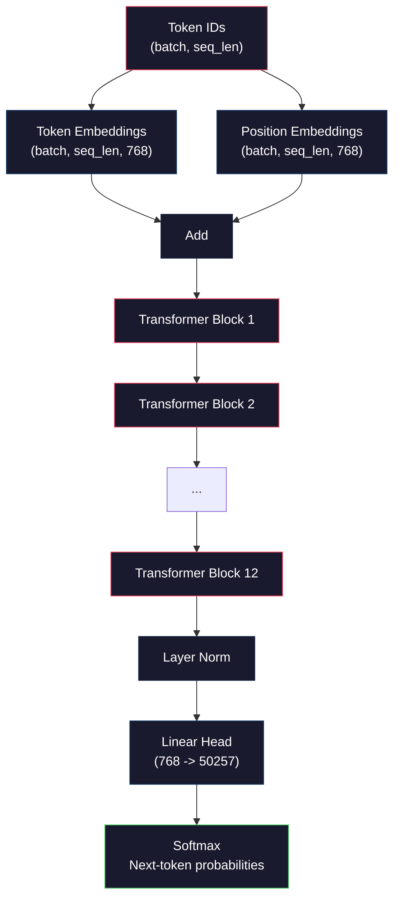
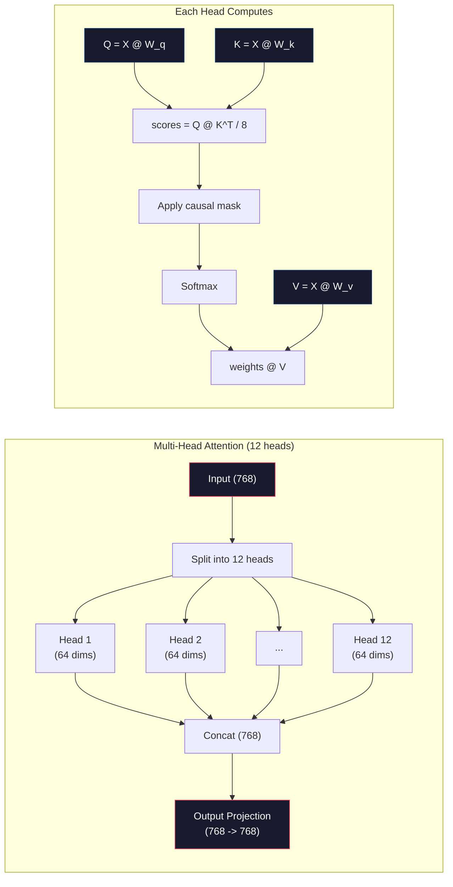
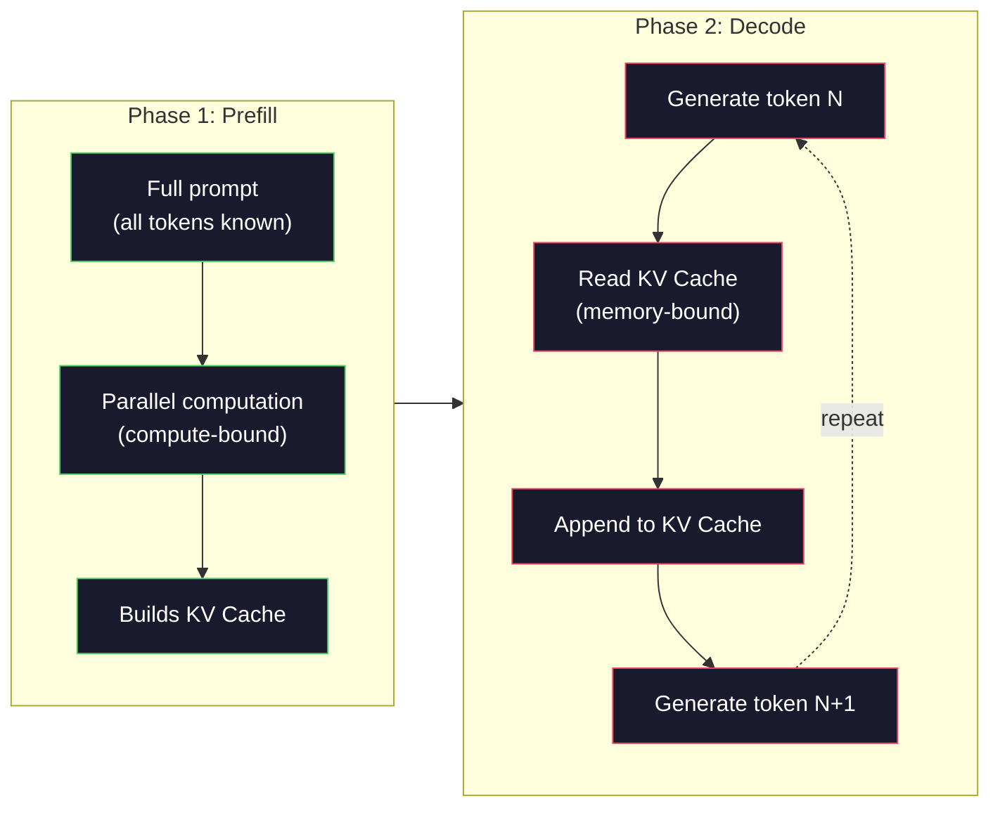

# Pre-Training a Mini GPT (124M Parameters) / 预训练一个 Mini GPT（124M 参数）

> GPT-2 Small 有 1.24 亿参数：12 个 transformer layers、12 个 attention heads、768 维 embeddings。你可以在单张 GPU 上从零训练它，几个小时就能跑完。大多数人从不这么做，他们直接使用预训练 checkpoint。但如果你没有亲手训练过一个，你其实并不真正理解自己正在构建产品所依赖的模型内部发生了什么。

**类型：** Build
**语言：** Python（with numpy）
**前置基础：** Phase 10, Lessons 01-03（Tokenizers, Building a Tokenizer, Data Pipelines）
**时间：** 约 120 分钟

## Learning Objectives / 学习目标

- 从零实现完整 GPT-2 架构（124M 参数）：token embeddings、positional embeddings、transformer blocks 和 language model head
- 使用 next-token prediction 和 cross-entropy loss 在文本语料上训练 GPT model
- 实现 autoregressive text generation，包含 temperature sampling 和 top-k/top-p filtering
- 监控训练 loss 曲线，并验证模型确实学到了连贯语言模式

## The Problem / 问题

你知道 transformer 是什么。你看过那些结构图。你能背出 “attention is all you need”，也能在白板上画出标着 “Multi-Head Attention” 的盒子。

这些都不意味着你理解模型生成文本时到底发生了什么。

GPT-2 Small（使用 weight tying）有 124,438,272 个参数。每一个参数都是通过训练循环设置出来的：forward pass、compute loss、backward pass、update weights。12 个 transformer blocks。每个 block 12 个 attention heads。768 维 embedding space。50,257 个 token 的词表。模型每生成一个 token，全部 1.24 亿参数都参与一条矩阵乘法链，把 token ID 序列变成下一个 token 的概率分布。

如果你从未亲手构建它，你就在使用黑箱。你可以调用 API，也可以 fine-tune。但当事情出错，比如模型 hallucinate、重复自己、不遵循指令时，你没有关于 *why* 的心智模型。

本课从零构建 GPT-2 Small。不是用 PyTorch，而是用 numpy。每个矩阵乘法都可见。每个梯度都由你的代码计算。你会清楚看到 1.24 亿个数字如何合谋预测下一个词。

## The Concept / 概念

### The GPT Architecture / GPT 架构

GPT 是 autoregressive language model。所谓 “autoregressive”，是指它一次生成一个 token，每个 token 都以之前所有 token 为条件。架构是一叠 transformer decoder blocks。

从 token IDs 到 next-token probabilities 的完整计算图如下：

1. 输入 token IDs。形状：(batch_size, seq_len)。
2. token embedding lookup。每个 ID 映射到 768 维向量。形状：(batch_size, seq_len, 768)。
3. position embedding lookup。每个位置（0, 1, 2, ...）映射到 768 维向量。形状相同。
4. token embeddings + position embeddings 相加。
5. 通过 12 个 transformer blocks。
6. final layer normalization。
7. 线性投影到词表大小。形状：(batch_size, seq_len, vocab_size)。
8. softmax 得到概率。

这就是整个模型。没有卷积，没有递归。只有 embeddings、attention、feedforward networks 和 layer norms，堆叠 12 次。



### The Transformer Block / Transformer Block

12 个 blocks 中的每一个都遵循同一模式。GPT-2 使用 pre-norm architecture，而不是原始 transformer 的 post-norm：

1. LayerNorm
2. Multi-Head Self-Attention
3. Residual connection，把输入加回来
4. LayerNorm
5. Feed-Forward Network（MLP）
6. Residual connection，把输入加回来

residual connections 至关重要。没有它们，反向传播时梯度到达 block 1 前就会消失。有了它们，梯度可以沿 “skip” path 从 loss 直接流向任意层。这就是为什么可以堆 12、32，甚至 96 个 blocks（传闻 GPT-4 使用 120 层）的原因。

### Attention: The Core Mechanism / Attention：核心机制

self-attention 让每个 token 都能查看之前所有 token，并决定该关注每个 token 多少。数学形式如下。

对每个 token position，从输入计算三个向量：

- **Query (Q)**：我在找什么？
- **Key (K)**：我包含什么？
- **Value (V)**：我携带什么信息？

```
Q = input @ W_q    (768 -> 768)
K = input @ W_k    (768 -> 768)
V = input @ W_v    (768 -> 768)

attention_scores = Q @ K^T / sqrt(d_k)
attention_scores = mask(attention_scores)   # causal mask: -inf for future positions
attention_weights = softmax(attention_scores)
output = attention_weights @ V
```

causal mask 让 GPT 具备 autoregressive 特性。position 5 可以 attend 到 positions 0-5，但不能 attend 到 6、7、8 等未来位置。这防止模型在训练时偷看未来 token。

**Multi-head attention** 把 768 维空间切成 12 个 heads，每个 head 64 维。每个 head 学习一种不同的 attention pattern。一个 head 可能跟踪句法关系，比如 subject-verb agreement；另一个可能跟踪语义相似性，比如 synonyms；还有一个可能跟踪位置邻近性。12 个 heads 的输出拼接后，再投影回 768 维。



除以 sqrt(d_k)，也就是 sqrt(64) = 8，是 scaling。没有它，高维向量的 dot product 会变得很大，把 softmax 推到梯度几乎为零的区域。这是原始 “Attention Is All You Need” 论文中的关键洞察之一。

### KV Cache: Why Inference Is Fast / KV Cache：推理为什么能快

训练时，你一次处理完整序列。推理时，你一次生成一个 token。如果不优化，生成第 N 个 token 需要重新计算前面 N-1 个 token 的 attention。生成第 N 个 token 单步约为 O(N^2)，长度为 N 的整段生成总计约为 O(N^3)。

KV Cache 解决这个问题。为每个 token 计算 K 和 V 后，把它们存下来。生成 token N+1 时，只需要为新 token 计算 Q，然后查出之前所有 token 缓存的 K 和 V。这样 K/V 计算的 per-token cost 从 O(N) 降到 O(1)。attention score 计算仍是 O(N)，因为要 attend 到所有历史位置，但输入上的冗余矩阵乘法被消除了。

对 12 层、12 heads 的 GPT-2，每个 token 的 KV cache 存储 2（K + V）x 12 layers x 12 heads x 64 dims = 18,432 个值。1024-token 序列在 FP32 下约 75MB。对 128 层的 Llama 3 405B，单条序列的 KV cache 可能超过 10GB。这就是 long-context inference 受内存限制的原因。

### Prefill vs Decode: Two Phases of Inference / Prefill 与 Decode：推理的两个阶段

当你向 LLM 发送 prompt 时，推理分成两个阶段。

**Prefill** 并行处理整个 prompt。所有 token 都已知，因此模型可以同时计算所有位置的 attention。这个阶段是 compute-bound：GPU 正在以高吞吐做矩阵乘法。对 A100 上的 1000-token prompt，prefill 大约需要 20-50ms。

**Decode** 一次生成一个 token。每个新 token 都依赖之前所有 token。这个阶段是 memory-bound：瓶颈是从 GPU memory 读取模型权重和 KV cache，而不是矩阵计算本身。GPU 计算核心多数时间在等待内存读取。对 GPT-2 来说，每个 decode step 的耗时主要受内存带宽约束，而不是 matmul 的 FLOPs。

这个区分对生产系统很重要。Prefill throughput 随 GPU compute 增长（FLOPS 越高，prefill 越快）。Decode throughput 随 memory bandwidth 增长（内存越快，生成越快）。这就是 NVIDIA H100 相比 A100 重点提升 memory bandwidth 的原因：它直接加速 token generation。



### The Training Loop / 训练循环

训练 LLM 就是 next-token prediction。给定 tokens `[0, 1, 2, ..., N-1]`，预测 tokens `[1, 2, 3, ..., N]`。loss function 是模型预测概率分布和真实下一个 token 之间的 cross-entropy。

一次训练 step：

1. **Forward pass**：把 batch 送过全部 12 个 blocks，得到每个位置的 logits（pre-softmax scores）。
2. **Compute loss**：计算 logits 与 target tokens（输入右移一位）之间的 cross-entropy。
3. **Backward pass**：用 backpropagation 计算 124M 参数的梯度。
4. **Optimizer step**：更新权重。GPT-2 使用 Adam，并配合 learning rate warmup 和 cosine decay。

learning rate schedule 比你直觉上更重要。GPT-2 在前 2,000 steps 从 0 warm up 到 peak learning rate，然后按 cosine curve 衰减。一开始就用高学习率会导致模型发散。后期一直保持高学习率会导致振荡。warmup-then-decay 是所有主流 LLM 都在使用的模式。

### GPT-2 Small: The Numbers / GPT-2 Small 的数字

| Component | Shape | Parameters |
|-----------|-------|------------|
| Token embeddings | (50257, 768) | 38,597,376 |
| Position embeddings | (1024, 768) | 786,432 |
| Per-block attention (W_q, W_k, W_v, W_out) | 4 x (768, 768) | 2,359,296 |
| Per-block FFN (up + down) | (768, 3072) + (3072, 768) | 4,718,592 |
| Per-block LayerNorms (2x) | 2 x 768 x 2 | 3,072 |
| Final LayerNorm | 768 x 2 | 1,536 |
| **Total per block** | | **7,080,960** |
| **Total (12 blocks)** | | **85,054,464 + 39,383,808 = 124,438,272** |

输出投影（logits head）与 token embedding matrix 共享权重。这叫 weight tying：它减少 38M 参数，并提升性能，因为它强迫模型用同一个表示空间来理解 token（input）和预测 token（output）。

## Build It / 动手构建

### Step 1: Embedding Layer / 步骤 1：Embedding Layer

Token embeddings 把 50,257 个可能 token 中的每一个映射到 768 维向量。Position embeddings 添加每个 token 在序列中所处位置的信息。两者相加。

```python
import numpy as np

class Embedding:
    def __init__(self, vocab_size, embed_dim, max_seq_len):
        self.token_embed = np.random.randn(vocab_size, embed_dim) * 0.02
        self.pos_embed = np.random.randn(max_seq_len, embed_dim) * 0.02

    def forward(self, token_ids):
        seq_len = token_ids.shape[-1]
        tok_emb = self.token_embed[token_ids]
        pos_emb = self.pos_embed[:seq_len]
        return tok_emb + pos_emb
```

初始化时使用 0.02 standard deviation 来自 GPT-2 论文。太大，初始 forward pass 会产生极端值，破坏训练稳定性；太小，所有输入的初始输出几乎相同，早期梯度信号没用。

### Step 2: Self-Attention with Causal Mask / 步骤 2：带 Causal Mask 的 Self-Attention

先实现 single-head attention。causal mask 在 softmax 前把未来位置设为负无穷，确保每个位置只能 attend 到自己和更早位置。

```python
def attention(Q, K, V, mask=None):
    d_k = Q.shape[-1]
    scores = Q @ K.transpose(0, -1, -2 if Q.ndim == 4 else 1) / np.sqrt(d_k)
    if mask is not None:
        scores = scores + mask
    weights = np.exp(scores - scores.max(axis=-1, keepdims=True))
    weights = weights / weights.sum(axis=-1, keepdims=True)
    return weights @ V
```

softmax 实现会在 exponentiating 前减去最大值。否则 `exp(large_number)` 会 overflow 到 infinity。这是数值稳定技巧，而且不改变输出，因为对任意常数 c，softmax(x - c) = softmax(x)。

### Step 3: Multi-Head Attention / 步骤 3：Multi-Head Attention

把 768 维输入切成 12 个 heads，每个 head 64 维。每个 head 独立计算 attention。结果拼接后再投影回 768 维。

```python
class MultiHeadAttention:
    def __init__(self, embed_dim, num_heads):
        self.num_heads = num_heads
        self.head_dim = embed_dim // num_heads
        self.W_q = np.random.randn(embed_dim, embed_dim) * 0.02
        self.W_k = np.random.randn(embed_dim, embed_dim) * 0.02
        self.W_v = np.random.randn(embed_dim, embed_dim) * 0.02
        self.W_out = np.random.randn(embed_dim, embed_dim) * 0.02

    def forward(self, x, mask=None):
        batch, seq_len, d = x.shape
        Q = (x @ self.W_q).reshape(batch, seq_len, self.num_heads, self.head_dim).transpose(0, 2, 1, 3)
        K = (x @ self.W_k).reshape(batch, seq_len, self.num_heads, self.head_dim).transpose(0, 2, 1, 3)
        V = (x @ self.W_v).reshape(batch, seq_len, self.num_heads, self.head_dim).transpose(0, 2, 1, 3)

        scores = Q @ K.transpose(0, 1, 3, 2) / np.sqrt(self.head_dim)
        if mask is not None:
            scores = scores + mask
        weights = np.exp(scores - scores.max(axis=-1, keepdims=True))
        weights = weights / weights.sum(axis=-1, keepdims=True)
        attn_out = weights @ V

        attn_out = attn_out.transpose(0, 2, 1, 3).reshape(batch, seq_len, d)
        return attn_out @ self.W_out
```

reshape-transpose-reshape 这套动作是 multi-head attention 最容易让人迷糊的部分。过程是：(batch, seq_len, 768) 变成 (batch, seq_len, 12, 64)，再变成 (batch, 12, seq_len, 64)。现在 12 个 heads 各自拥有一个 (seq_len, 64) 矩阵用于 attention。attention 后反向操作：(batch, 12, seq_len, 64) 变回 (batch, seq_len, 12, 64)，再变回 (batch, seq_len, 768)。

### Step 4: Transformer Block / 步骤 4：Transformer Block

一个完整 transformer block：LayerNorm、带 residual 的 multi-head attention、LayerNorm、带 residual 的 feedforward。

```python
class LayerNorm:
    def __init__(self, dim, eps=1e-5):
        self.gamma = np.ones(dim)
        self.beta = np.zeros(dim)
        self.eps = eps

    def forward(self, x):
        mean = x.mean(axis=-1, keepdims=True)
        var = x.var(axis=-1, keepdims=True)
        return self.gamma * (x - mean) / np.sqrt(var + self.eps) + self.beta


class FeedForward:
    def __init__(self, embed_dim, ff_dim):
        self.W1 = np.random.randn(embed_dim, ff_dim) * 0.02
        self.b1 = np.zeros(ff_dim)
        self.W2 = np.random.randn(ff_dim, embed_dim) * 0.02
        self.b2 = np.zeros(embed_dim)

    def forward(self, x):
        h = x @ self.W1 + self.b1
        h = np.maximum(0, h)  # GELU approximation: ReLU for simplicity
        return h @ self.W2 + self.b2


class TransformerBlock:
    def __init__(self, embed_dim, num_heads, ff_dim):
        self.ln1 = LayerNorm(embed_dim)
        self.attn = MultiHeadAttention(embed_dim, num_heads)
        self.ln2 = LayerNorm(embed_dim)
        self.ffn = FeedForward(embed_dim, ff_dim)

    def forward(self, x, mask=None):
        x = x + self.attn.forward(self.ln1.forward(x), mask)
        x = x + self.ffn.forward(self.ln2.forward(x))
        return x
```

feedforward network 把 768 维输入扩展到 3,072 维（4x），应用 nonlinear activation，再投影回 768。这个 expansion-contraction pattern 让模型在每个位置上有更“宽”的内部表示空间可用。GPT-2 使用 GELU activation，但这里为了简单使用 ReLU；对理解架构来说差异不大。

### Step 5: Full GPT Model / 步骤 5：完整 GPT Model

堆叠 12 个 transformer blocks。前面加 embedding layer，后面加 output projection。

```python
class MiniGPT:
    def __init__(self, vocab_size=50257, embed_dim=768, num_heads=12,
                 num_layers=12, max_seq_len=1024, ff_dim=3072):
        self.embedding = Embedding(vocab_size, embed_dim, max_seq_len)
        self.blocks = [
            TransformerBlock(embed_dim, num_heads, ff_dim)
            for _ in range(num_layers)
        ]
        self.ln_f = LayerNorm(embed_dim)
        self.vocab_size = vocab_size
        self.embed_dim = embed_dim

    def forward(self, token_ids):
        seq_len = token_ids.shape[-1]
        mask = np.triu(np.full((seq_len, seq_len), -1e9), k=1)

        x = self.embedding.forward(token_ids)
        for block in self.blocks:
            x = block.forward(x, mask)
        x = self.ln_f.forward(x)

        logits = x @ self.embedding.token_embed.T
        return logits

    def count_parameters(self):
        total = 0
        total += self.embedding.token_embed.size
        total += self.embedding.pos_embed.size
        for block in self.blocks:
            total += block.attn.W_q.size + block.attn.W_k.size
            total += block.attn.W_v.size + block.attn.W_out.size
            total += block.ffn.W1.size + block.ffn.b1.size
            total += block.ffn.W2.size + block.ffn.b2.size
            total += block.ln1.gamma.size + block.ln1.beta.size
            total += block.ln2.gamma.size + block.ln2.beta.size
        total += self.ln_f.gamma.size + self.ln_f.beta.size
        return total
```

注意 weight tying：`logits = x @ self.embedding.token_embed.T`。输出投影复用 token embedding matrix 的转置。这不只是省参数技巧。它意味着模型用同一个向量空间来理解 tokens（embeddings）和预测 tokens（output）。

### Step 6: Training Loop / 步骤 6：训练循环

真正训练 124M 参数需要 GPU 和 PyTorch。这个训练循环在一个纯 numpy 可运行的小模型上展示机制。我们使用 tiny model（4 layers、4 heads、128 dims）让它可计算。

```python
def cross_entropy_loss(logits, targets):
    batch, seq_len, vocab_size = logits.shape
    logits_flat = logits.reshape(-1, vocab_size)
    targets_flat = targets.reshape(-1)

    max_logits = logits_flat.max(axis=-1, keepdims=True)
    log_softmax = logits_flat - max_logits - np.log(
        np.exp(logits_flat - max_logits).sum(axis=-1, keepdims=True)
    )

    loss = -log_softmax[np.arange(len(targets_flat)), targets_flat].mean()
    return loss


def train_mini_gpt(text, vocab_size=256, embed_dim=128, num_heads=4,
                   num_layers=4, seq_len=64, num_steps=200, lr=3e-4):
    tokens = np.array(list(text.encode("utf-8")[:2048]))
    model = MiniGPT(
        vocab_size=vocab_size, embed_dim=embed_dim, num_heads=num_heads,
        num_layers=num_layers, max_seq_len=seq_len, ff_dim=embed_dim * 4
    )

    print(f"Model parameters: {model.count_parameters():,}")
    print(f"Training tokens: {len(tokens):,}")
    print(f"Config: {num_layers} layers, {num_heads} heads, {embed_dim} dims")
    print()

    for step in range(num_steps):
        start_idx = np.random.randint(0, max(1, len(tokens) - seq_len - 1))
        batch_tokens = tokens[start_idx:start_idx + seq_len + 1]

        input_ids = batch_tokens[:-1].reshape(1, -1)
        target_ids = batch_tokens[1:].reshape(1, -1)

        logits = model.forward(input_ids)
        loss = cross_entropy_loss(logits, target_ids)

        if step % 20 == 0:
            print(f"Step {step:4d} | Loss: {loss:.4f}")

    return model
```

loss 一开始接近 ln(vocab_size)。对 256-token 字节级词表来说，ln(256) = 5.55。随机模型会给每个 token 分配相等概率。随着训练推进，loss 会下降，因为模型学会预测常见模式：`"t"` 后面的 `"h"`，句号后的空格，等等。

生产训练会使用 Adam optimizer、gradient accumulation、learning rate warmup 和 gradient clipping。但 forward-pass-loss-backward-update 循环完全一样，只是 optimizer 更复杂。

### Step 7: Text Generation / 步骤 7：文本生成

生成阶段使用训练好的模型一次预测一个 token。每个预测都从输出分布中采样，或贪心取 argmax。

```python
def generate(model, prompt_tokens, max_new_tokens=100, temperature=0.8):
    tokens = list(prompt_tokens)
    seq_len = model.embedding.pos_embed.shape[0]

    for _ in range(max_new_tokens):
        context = np.array(tokens[-seq_len:]).reshape(1, -1)
        logits = model.forward(context)
        next_logits = logits[0, -1, :]

        next_logits = next_logits / temperature
        probs = np.exp(next_logits - next_logits.max())
        probs = probs / probs.sum()

        next_token = np.random.choice(len(probs), p=probs)
        tokens.append(next_token)

    return tokens
```

Temperature 控制随机性。Temperature 1.0 使用原始分布。Temperature 0.5 会 sharpen 分布，更确定，模型更常选择 top choices。Temperature 1.5 会 flatten 分布，更随机，低概率 token 有更大机会。Temperature 0.0 是 greedy decoding，永远选择最高概率 token。

`tokens[-seq_len:]` 窗口是必要的，因为模型有最大 context length（GPT-2 是 1024）。一旦超过它，就必须丢弃最旧的 token。这就是人们常说的 “context window”。

```figure
sampling-decoder
```

## Use It / 应用它

### Full Training and Generation Demo / 完整训练与生成 Demo

```python
corpus = """The transformer architecture has revolutionized natural language processing.
Attention mechanisms allow the model to focus on relevant parts of the input.
Self-attention computes relationships between all pairs of positions in a sequence.
Multi-head attention splits the representation into multiple subspaces.
Each attention head can learn different types of relationships.
The feedforward network provides nonlinear transformations at each position.
Residual connections enable gradient flow through deep networks.
Layer normalization stabilizes training by normalizing activations.
Position embeddings give the model information about token ordering.
The causal mask ensures autoregressive generation during training.
Pre-training on large text corpora teaches the model general language understanding.
Fine-tuning adapts the pre-trained model to specific downstream tasks."""

model = train_mini_gpt(corpus, num_steps=200)

prompt = list("The transformer".encode("utf-8"))
output_tokens = generate(model, prompt, max_new_tokens=100, temperature=0.8)
generated_text = bytes(output_tokens).decode("utf-8", errors="replace")
print(f"\nGenerated: {generated_text}")
```

在小语料和小模型上，生成文本最多只能半连贯。它会从训练文本中学到一些字节级模式，但无法像 GPT-2 那样依靠 40GB 训练数据和完整 124M 参数架构进行泛化。重点不是输出质量，而是你能追踪每一步：embedding lookup、attention computation、feedforward transformation、logit projection、softmax 和 sampling。每个操作都可见。

## Ship It / 交付它

本课产出 `outputs/prompt-gpt-architecture-analyzer.md`：一个用于分析任意 GPT-style model 架构选择的 prompt。输入 model card 或 technical report，它会拆解 parameter allocation、attention design 和 scaling decisions。

## Exercises / 练习

1. 把模型改成 24 layers 和 16 heads，而不是 12/12。计算参数量。加倍 depth 与加倍 width（embedding dimension）相比，参数量如何变化？

2. 实现 GELU activation function（GELU(x) = x * 0.5 * (1 + erf(x / sqrt(2))))，替换 feedforward network 中的 ReLU。每种 activation 训练 500 steps，比较 final loss。

3. 给 generation function 添加 KV cache。第一次 forward pass 后，为每层存储 K 和 V tensors，后续 token 复用它们。测量 speedup：分别用有 cache 和无 cache 生成 200 tokens，比较 wall-clock time。

4. 实现 top-k sampling（只考虑概率最高的 k 个 token）和 top-p sampling（nucleus sampling：考虑 cumulative probability 超过 p 的最小 token 集合）。在 temperature 0.8 下比较 top-k=50 与 top-p=0.95 的输出质量。

5. 构建 training loss curve plotter。训练模型 1000 steps 并绘制 loss vs step。识别三个阶段：快速初始下降（学习常见 bytes）、较慢中期（学习 byte patterns）、plateau（在小语料上 overfitting）。无论训练 128-dim model 还是 GPT-4，这条曲线的形状都相同。

## Key Terms / 关键术语

| 术语 | 常见说法 | 实际含义 |
|------|----------------|----------------------|
| Autoregressive | “一次生成一个词” | 每个输出 token 都以前面所有 token 为条件：模型预测 P(token_n \| token_0, ..., token_{n-1}) |
| Causal mask | “它看不到未来” | 一个由 -infinity 组成的上三角矩阵，防止训练时 attention 到未来位置 |
| Multi-head attention | “多个 attention patterns” | 把 Q、K、V 切成并行 heads，例如 GPT-2 的 12 个 64 维 heads，让每个 head 学不同关系类型 |
| KV Cache | “为了速度做缓存” | 存储之前 tokens 计算出的 Key 和 Value tensors，避免 autoregressive generation 中重复计算 |
| Prefill | “处理 prompt” | 推理第一阶段，所有 prompt tokens 并行处理；在 GPU FLOPS 上 compute-bound |
| Decode | “生成 token” | 推理第二阶段，一次生成一个 token；在 GPU bandwidth 上 memory-bound |
| Weight tying | “共享 embeddings” | 输入 token embeddings 和输出 projection head 使用同一矩阵；GPT-2 中节省 38M 参数 |
| Residual connection | “Skip connection” | 把输入直接加到 sublayer 输出上（x + sublayer(x)），让深层网络中的梯度可以流动 |
| Layer normalization | “归一化 activations” | 沿 feature dimension 归一化到均值 0、方差 1，并带可学习 scale 和 bias 参数 |
| Cross-entropy loss | “预测错了多少” | -log(分配给正确 next token 的概率)，对所有位置平均；标准 LLM 训练目标 |

## Further Reading / 延伸阅读

- [Radford et al., 2019 -- "Language Models are Unsupervised Multitask Learners" (GPT-2)](https://cdn.openai.com/better-language-models/language_models_are_unsupervised_multitask_learners.pdf) -- 介绍 124M 到 1.5B 参数 GPT-2 family 的论文
- [Vaswani et al., 2017 -- "Attention Is All You Need"](https://arxiv.org/abs/1706.03762) -- 原始 transformer 论文，提出 scaled dot-product attention 和 multi-head attention
- [Llama 3 Technical Report](https://arxiv.org/abs/2407.21783) -- Meta 如何用 16K GPUs 把 GPT 架构扩展到 405B 参数
- [Pope et al., 2022 -- "Efficiently Scaling Transformer Inference"](https://arxiv.org/abs/2211.05102) -- 形式化 prefill vs decode 与 KV cache 分析的论文
