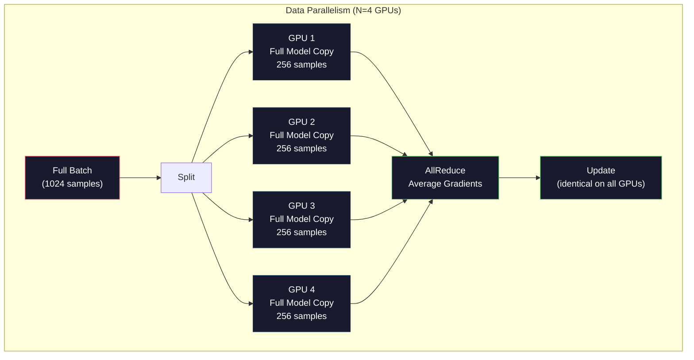
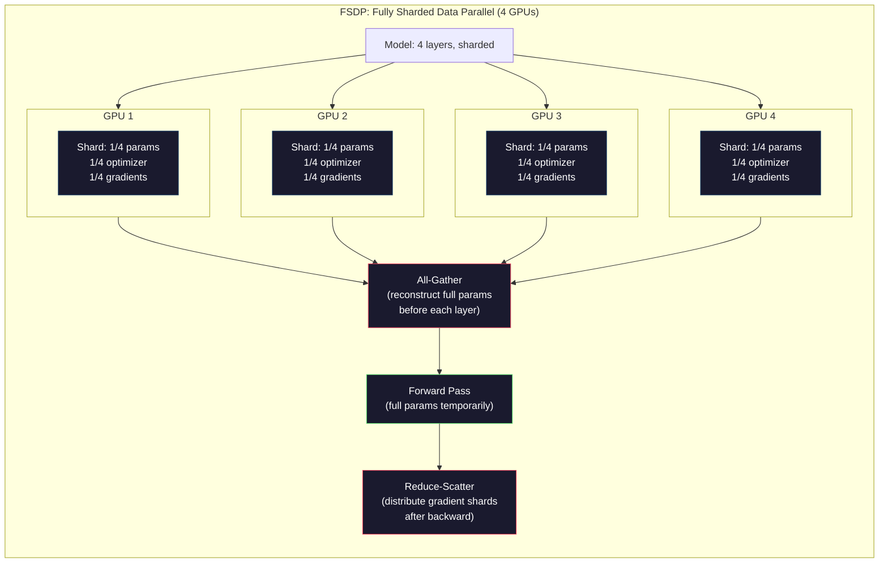
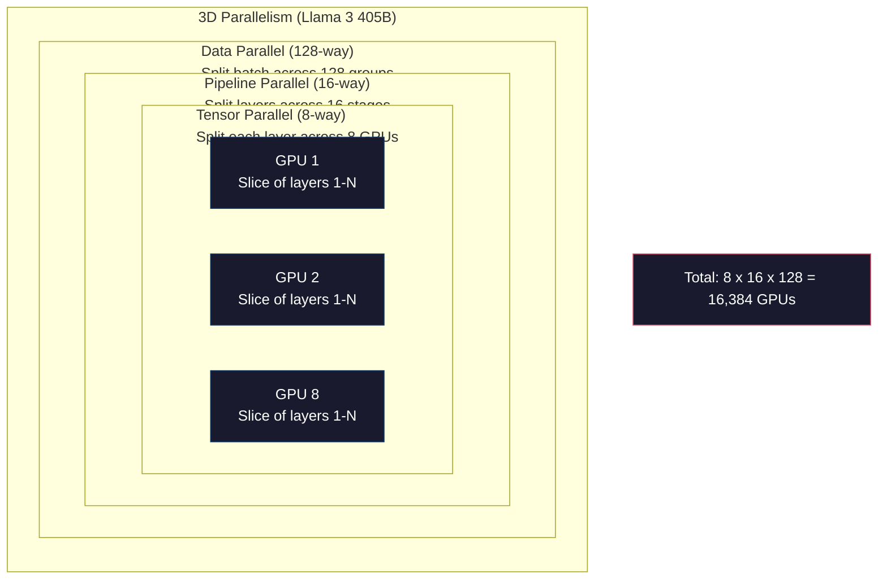

# Scaling: Distributed Training, FSDP, DeepSpeed / 扩展：分布式训练、FSDP、DeepSpeed

> 你的 124M 模型可以在一张 GPU 上训练。现在试试 70 亿参数。模型放不进显存。数据在单机上要跑数周。规模上来后，分布式训练不是可选项，而是唯一道路。

**类型：** Build
**语言：** Python
**前置基础：** Phase 10, Lesson 04（Pre-Training a Mini GPT）
**时间：** 约 120 分钟

## Learning Objectives / 学习目标

- 解释三类 parallelism（data、tensor、pipeline），并根据模型大小和集群规模判断何时需要哪一种
- 使用 PyTorch DDP 实现 data-parallel training，并在多 GPU 间同步 gradients
- 计算给定模型大小的内存预算（weights + optimizer states + gradients + activations），从而判断最低硬件需求
- 配置 FSDP 或 DeepSpeed ZeRO stages，在 GPU 间 shard model states，让超过单卡显存的模型也能训练

## The Problem / 问题

一个 7B 参数模型用 FP16 仅权重就需要 14GB。Adam optimizer 会为每个参数额外存两份副本，也就是 first and second moment estimates。这又是 28GB。反向传播期间 gradients 再加 14GB。还没存任何 activation，你已经用了 56GB。

一张 NVIDIA A100 有 80GB 显存。

80GB 里已经用了 56GB，只剩 24GB 给 activations，也就是 forward pass 中计算出的、反向传播必须保留的中间值。对于 2048-token 序列和 4096-dimensional model，一层 activations 大约 64MB。32 层就是每个 sample 2GB。batch size 8 需要 16GB。你剩 24GB。batch size 12 就爆。

现在试试 70B 参数。仅 FP16 权重就是 140GB。单卡根本放不下。至少需要 2 张 A100（2 x 80GB = 160GB）才能容纳权重。再加 optimizer states 和 gradients，就需要更多：至少 3+ GPUs，现实中根据 sharding strategy 通常要 8-16 张。

Llama 3 405B 使用 16,384 张 NVIDIA H100 GPUs 训练。训练 compute 估计花费 1 亿美元。DeepSeek V3 用更聪明的架构（Mixture of Experts 表示每个 token 只激活部分参数）和训练效率，以约 560 万美元训练了可比模型。

本课覆盖让大规模训练成为可能的四种策略：data parallelism、tensor parallelism、pipeline parallelism 和 fully sharded data parallelism。你会先用纯 Python 模拟每一种机制，再去接触真正的分布式训练框架。

## The Concept / 概念

### Why Distribution is Required / 为什么必须分布式

下面是真实模型的内存计算。每个数字都是算出来的，不是估计。

| Model | Params | Weights (FP16) | Adam States | Gradients (FP16) | Total (no activations) |
|-------|--------|----------------|-------------|------------------|----------------------|
| GPT-2 Small | 124M | 248 MB | 992 MB | 248 MB | 1.5 GB |
| Llama 3 8B | 8B | 16 GB | 64 GB | 16 GB | 96 GB |
| Llama 3 70B | 70B | 140 GB | 560 GB | 140 GB | 840 GB |
| Llama 3 405B | 405B | 810 GB | 3,240 GB | 810 GB | 4,860 GB |

“Adam States” 这一列才是真正杀手。Adam 为每个参数存一个 running mean（m）和一个 running variance（v），二者都是 FP32。对 70B 模型来说，就是 70B x 4 bytes x 2 = 560GB。仅 optimizer 就需要七张 A100。

单张 H100 有 80GB。Llama 3 405B 至少需要 61 张 H100 才能装下 weights、optimizer 和 gradients。再加 activations，数量还会增加。Meta 使用 16,384 GPUs 不是因为想用，而是因为不得不用。

### Data Parallelism / 数据并行

最简单的分布式策略。把完整模型复制到 N 张 GPUs。把每个 training batch 切成 N 份。每张 GPU 在自己的 data shard 上运行 forward 和 backward。backward 后，跨所有 GPUs 平均 gradients。每张 GPU 用同一个 averaged gradients 更新自己的权重副本，从而保持同步。

**优点：** throughput 近似线性扩展。N 张 GPUs 每 step 处理 N 倍数据。通信仅限 gradient averaging，而且可以与计算 overlap。

**缺点：** 每张 GPU 都持有完整模型、optimizer states 和 gradients。对 70B 模型，每张 GPU 都要 840GB。data parallelism 不降低 per-GPU memory，只缩短训练时间。

**数学：** effective batch size = per_gpu_batch_size x N。N=64 GPUs、每卡 batch 16 时，effective batch 是 1,024。Llama 3 每 step 使用 1600 万 tokens 的 effective batch size。



### Tensor Parallelism / 张量并行

把单个层切到多张 GPUs 上。一个矩阵乘法被分解到多张 GPUs，每张 GPU 计算结果的一部分。

考虑 feedforward layer 中形状为 (8192, 8192) 的权重矩阵。使用 4-way tensor parallelism 时，每张 GPU 持有一个 (8192, 2048) shard。每张 GPU 用输入乘自己的 shard，得到 partial result。partial results 通过 all-reduce 或 all-gather 合并成完整输出。

**优点：** 降低每张 GPU 的 model weights 内存。70B 模型切到 8 张 GPUs 上，每张 GPU 大约只持有 8.75B 参数的权重。

**缺点：** 每层后都需要高速 GPU 间通信。每次 matmul 后的 all-reduce 会增加 latency。它在 NVLink 上表现很好（同节点 GPUs 之间 900 GB/s），但跨 InfiniBand 节点较差（400 Gb/s，约 50 GB/s）。tensor parallelism 几乎总是限制在单节点内（8 GPUs）。

**真实使用：** Megatron-LM 推广了 tensor parallelism。Llama 3 405B 在每个节点内使用 8-way tensor parallelism。

### Pipeline Parallelism / 流水线并行

按 layers 切分模型。GPU 1 跑 layers 1-8。GPU 2 跑 layers 9-16。GPU 3 跑 layers 17-24。GPU 4 跑 layers 25-32。数据流过 pipeline：GPU 1 计算自己的 layers，把 activations 发给 GPU 2；GPU 2 计算后发给 GPU 3，依此类推。

**优点：** GPUs 之间通信最少，只传 layer 边界上的 activations；相比 gradients 或 weights，它们小得多。带宽需求低，因此可以跨节点工作。

**缺点：** pipeline bubbles。当 GPU 4 正在计算 micro-batch 1 的 forward pass 时，GPU 1、2、3 是 idle 的，因为它们已经完成了自己的部分。backward pass 时模式反过来。朴素 pipelining 下，N 个 pipeline stages 的 GPU utilization 只有 1/N。

**GPipe 和 PipeDream** 通过把 batch 切成 micro-batches 来解决 bubble。GPU 1 一完成 micro-batch 1 的 forward，就开始 micro-batch 2。这样 pipeline stages 之间可以 overlap computation。M 个 micro-batches、N 个 stages 时，bubble fraction 降到 (N-1)/M。N=4 stages、M=16 micro-batches 时，bubble 是 3/16 = 18.75% idle time。

### FSDP: Fully Sharded Data Parallel / FSDP：完全分片数据并行

FSDP 结合了 data parallelism 的可扩展性和 sharding 的内存效率。每张 GPU 不再持有完整模型，而只持有 parameters、gradients 和 optimizer states 的 1/N。

在某一层 forward pass 前，FSDP 运行 **all-gather**，从所有 GPUs 收集完整参数到每张 GPU 的显存。forward 结束后，每张 GPU 丢弃非本地参数。backward 时，再次 all-gather 重建参数以计算梯度。backward 后，**reduce-scatter** 分发 gradient shards，让每张 GPU 只存储 1/N gradients。

**70B 模型在 8 GPUs 上的数学：**

| Component | Without FSDP | With FSDP |
|-----------|-------------|-----------|
| Weights (FP16) | 140 GB per GPU | 17.5 GB per GPU |
| Adam States (FP32) | 560 GB per GPU | 70 GB per GPU |
| Gradients (FP16) | 140 GB per GPU | 17.5 GB per GPU |
| **Total** | **840 GB per GPU** | **105 GB per GPU** |

没有 FSDP，70B 模型无法放进单张 80GB GPU。使用 8 GPUs 的 FSDP 后，每张 GPU 仍要 105GB，等等，这还是放不下。你至少需要 16 GPUs 才能降到 80GB 以下，或者把 FSDP 与 activation checkpointing 结合，在 backward 时重算 activations 而不是存储它们。

通信成本高于普通 data parallelism，因为每层前都要 all-gather。但内存节省让原本不可能的训练变成可能。



### DeepSpeed ZeRO / DeepSpeed ZeRO

DeepSpeed 的 ZeRO（Zero Redundancy Optimizer）在概念上与 FSDP 相同，但由 Microsoft 独立开发。它定义了三个 stages，每一阶段的 sharding 更激进：

| Stage | Shards | Memory Savings | Communication |
|-------|--------|---------------|---------------|
| ZeRO-1 | Optimizer states only | ~4x reduction | Same as data parallel |
| ZeRO-2 | + Gradients | ~8x reduction | Slightly more |
| ZeRO-3 | + Parameters | ~Nx reduction (N GPUs) | All-gather per layer |

ZeRO-3 等价于 FSDP。命名不同，机制相同。DeepSpeed 证明了这个概念之后，PyTorch 才加入原生 FSDP 实现。

DeepSpeed 还引入了 ZeRO-Offload（把 optimizer states offload 到更便宜、更大的 CPU RAM）和 ZeRO-Infinity（offload 到 NVMe SSDs）。这些方案用 compute speed 换 memory capacity：offloaded operations 更慢，但释放了 GPU memory。

### Mixed Precision Training / 混合精度训练

现代训练会同时使用多种 floating-point formats：

- **Forward pass**：FP16 或 BF16（16-bit）。内存是 FP32 的一半。matmuls 在 tensor cores 上快 2 倍。
- **Master weights**：FP32（32-bit）。由 optimizer 维护，用于权重更新时的数值精度。
- **Loss scaling**：backward pass 前把 loss 乘以一个大常数，防止 FP16 gradients underflow 到 0。optimizer step 前再除回来。

BF16（Brain Float 16）与 FP32 有相同 exponent range（8 exponent bits），但精度更低（7 mantissa bits，FP32 是 23）。它很少需要 loss scaling，因为可表示值域相同。FP16 有 5 exponent bits 和 10 mantissa bits：能表示更细粒度的值，但在极端量级容易 overflow/underflow。

Google 的 TPUs 原生使用 BF16。NVIDIA A100 和 H100 同时支持 FP16 与 BF16。行业基本转向 BF16，因为它消除了 loss scaling 的麻烦。

**7B 模型内存对比：**

| Precision | Weights | Optimizer | Gradients | Total |
|-----------|---------|-----------|-----------|-------|
| FP32 everywhere | 28 GB | 56 GB | 28 GB | 112 GB |
| Mixed (BF16 + FP32 master) | 14 GB | 56 GB | 14 GB | 84 GB |

mixed precision 在这个模型上节省 28GB。optimizer states 仍保持 FP32，这也是大部分内存去处。

### Megatron-LM and 3D Parallelism / Megatron-LM 与 3D 并行

真实的大规模训练会组合三种 parallelisms：

- **Data parallelism** 跨节点组扩展 batch size
- **Tensor parallelism** 在节点内把 layers 切到 8 GPUs
- **Pipeline parallelism** 跨节点把 layer groups 切到多台机器

Llama 3 405B 在 16,384 张 H100 上：

- 每个节点内 8-way tensor parallelism（每节点 8 GPUs）
- 跨节点 16-way pipeline parallelism（16 pipeline stages）
- 剩余维度上 128-way data parallelism（16,384 / 8 / 16 = 128）

这个 3D decomposition（8 x 16 x 128 = 16,384）就是扩展到数千 GPUs 的方式。每张 GPU 看到不同 data shard（data parallel），持有每层的一个 slice（tensor parallel），并计算不同层组（pipeline parallel）。

DeepSeek V3 采取了不同路线。它的 Mixture of Experts 架构在每个 token 上只激活 671B 参数中的 37B。这意味着每张 GPU 只需要计算并存储 active parameters 的 activations。它们用 2,048 张 H800 GPUs 完成训练，GPU 数量不到 Meta 的 1/8，成本约 560 万美元，而不是 Meta 估计的 1 亿美元。



```figure
paged-kv-cache
```

## Build It / 动手构建

### Step 1: Simulate Data Parallelism / 步骤 1：模拟数据并行

把一个 batch 切到模拟 GPUs 上。每张 GPU 在自己的 shard 上计算 forward pass。平均“gradients”（这里用 loss values 模拟）。

```python
import numpy as np

def simulate_data_parallelism(data, num_gpus, model_fn):
    batch_size = len(data)
    shard_size = batch_size // num_gpus
    remainder = batch_size % num_gpus

    gpu_losses = []
    gpu_gradients = []

    offset = 0
    for gpu_id in range(num_gpus):
        extra = 1 if gpu_id < remainder else 0
        shard = data[offset:offset + shard_size + extra]
        offset += shard_size + extra

        loss, grad = model_fn(shard)
        gpu_losses.append(loss)
        gpu_gradients.append(grad)

    avg_loss = np.mean(gpu_losses)
    avg_gradient = np.mean(gpu_gradients, axis=0)

    return avg_loss, avg_gradient
```

all-reduce operation（平均 gradients）是 data parallelism 中唯一通信。实践中，NVIDIA GPUs 上使用 NCCL library，它实现 ring all-reduce：每张 GPU 向邻居发送自己 1/N 的 gradients，也从另一侧邻居接收 1/N；经过 N-1 步后，每张 GPU 都拥有完整平均值。总通信量：2 x gradient_size x (N-1)/N，当 N 很大时接近 gradient size 的 2 倍。

### Step 2: Simulate Tensor Parallelism / 步骤 2：模拟张量并行

把 weight matrix 切到多张 GPUs。每张 GPU 计算 partial matrix multiplication，再合并结果。

```python
def simulate_tensor_parallelism(input_data, weight_matrix, num_gpus):
    d_in, d_out = weight_matrix.shape
    assert d_out % num_gpus == 0, f"d_out {d_out} not divisible by num_gpus {num_gpus}"
    shard_size = d_out // num_gpus

    partial_results = []
    for gpu_id in range(num_gpus):
        start = gpu_id * shard_size
        end = start + shard_size
        weight_shard = weight_matrix[:, start:end]

        partial = input_data @ weight_shard
        partial_results.append(partial)

    full_output = np.concatenate(partial_results, axis=-1)

    direct_output = input_data @ weight_matrix
    error = np.abs(full_output - direct_output).max()

    return full_output, error
```

error 应该严格为零，或只有 machine epsilon。tensor parallelism 在数学上是精确的，结果与单张 GPU 上完整 matmul 相同。这里沿输出维度切分，所以每张 GPU 生成不同列块，concatenation 重建完整结果。

对于 column-parallel linear layers（切输出维度），你做 concatenate。对于 row-parallel（切输入维度），你做 sum。在 transformer FFN 中，第一个 linear（expand）使用 column-parallel，第二个 linear（contract）使用 row-parallel。这样能避免两层之间的 all-reduce。

### Step 3: Simulate Pipeline Parallelism / 步骤 3：模拟流水线并行

把模型 layers 分配到虚拟 GPUs。展示 bubble problem：后段计算时，早期 stages 处于 idle。

```python
def simulate_pipeline_parallelism(num_layers, num_stages, num_microbatches):
    layers_per_stage = num_layers // num_stages

    timeline = {}
    clock = 0

    for mb in range(num_microbatches):
        for stage in range(num_stages):
            start_time = max(
                timeline.get((stage, mb - 1, "fwd"), (0, 0))[1] if mb > 0 else 0,
                timeline.get((stage - 1, mb, "fwd"), (0, 0))[1] if stage > 0 else 0,
            )
            end_time = start_time + layers_per_stage
            timeline[(stage, mb, "fwd")] = (start_time, end_time)

    last_fwd_end = max(v[1] for v in timeline.values())

    for mb in range(num_microbatches - 1, -1, -1):
        for stage in range(num_stages - 1, -1, -1):
            deps = [last_fwd_end]
            if mb < num_microbatches - 1 and (stage, mb + 1, "bwd") in timeline:
                deps.append(timeline[(stage, mb + 1, "bwd")][1])
            if stage < num_stages - 1 and (stage + 1, mb, "bwd") in timeline:
                deps.append(timeline[(stage + 1, mb, "bwd")][1])
            start_time = max(deps)
            end_time = start_time + layers_per_stage
            timeline[(stage, mb, "bwd")] = (start_time, end_time)

    total_time = max(v[1] for v in timeline.values())
    compute_time = num_microbatches * num_stages * layers_per_stage * 2
    bubble_fraction = 1.0 - compute_time / (total_time * num_stages)

    return timeline, total_time, bubble_fraction
```

4 stages、1 micro-batch 时，bubble fraction 是 75%，也就是任意时刻四张 GPUs 中有三张 idle。16 micro-batches 时，降到约 19%。消除 bubbles 的代价是内存：你必须同时存储所有 in-flight micro-batches 的 activations。

### Step 4: Memory Calculator / 步骤 4：内存计算器

计算任意模型大小的精确训练内存需求。

```python
def memory_calculator(
    params_billions,
    precision_bytes=2,
    optimizer="adam",
    num_gpus=1,
    sharding="none",
    sequence_length=2048,
    batch_size_per_gpu=1,
    hidden_dim=None,
    num_layers=None,
):
    params = params_billions * 1e9

    weight_memory = params * precision_bytes

    if optimizer == "adam":
        optimizer_memory = params * 4 * 2
    elif optimizer == "sgd":
        optimizer_memory = params * 4
    else:
        optimizer_memory = 0

    gradient_memory = params * precision_bytes

    total_no_activation = weight_memory + optimizer_memory + gradient_memory

    if hidden_dim and num_layers:
        activation_per_layer = (
            sequence_length * batch_size_per_gpu * hidden_dim * precision_bytes * 4
        )
        activation_memory = activation_per_layer * num_layers
    else:
        activation_memory = params * precision_bytes * 0.5

    if sharding == "fsdp" or sharding == "zero3":
        weight_memory /= num_gpus
        optimizer_memory /= num_gpus
        gradient_memory /= num_gpus
    elif sharding == "zero2":
        optimizer_memory /= num_gpus
        gradient_memory /= num_gpus
    elif sharding == "zero1":
        optimizer_memory /= num_gpus

    per_gpu_total = weight_memory + optimizer_memory + gradient_memory + activation_memory

    return {
        "params_billions": params_billions,
        "weights_gb": weight_memory / 1e9,
        "optimizer_gb": optimizer_memory / 1e9,
        "gradients_gb": gradient_memory / 1e9,
        "activations_gb": activation_memory / 1e9,
        "per_gpu_total_gb": per_gpu_total / 1e9,
        "total_across_gpus_gb": per_gpu_total * num_gpus / 1e9,
        "fits_on_80gb": per_gpu_total / 1e9 <= 80,
        "num_gpus": num_gpus,
        "sharding": sharding,
    }
```

这个 calculator 回答每个 ML engineer 都会问的问题：“我需要多少张 GPUs？”输入 model size，看它是否能放下。调整 sharding strategy，直到 per-GPU total 低于 80GB。

### Step 5: Mixed Precision Simulation / 步骤 5：混合精度模拟

比较 FP32、FP16 和 mixed precision training 的内存使用。

```python
def mixed_precision_comparison(params_billions):
    params = params_billions * 1e9

    fp32_weights = params * 4
    fp32_optimizer = params * 4 * 2
    fp32_gradients = params * 4
    fp32_total = fp32_weights + fp32_optimizer + fp32_gradients

    fp16_weights = params * 2
    fp16_master = params * 4
    fp16_optimizer = params * 4 * 2
    fp16_gradients = params * 2
    fp16_total = fp16_weights + fp16_master + fp16_optimizer + fp16_gradients

    mixed_weights = params * 2
    mixed_optimizer = params * 4 * 2
    mixed_gradients = params * 2
    mixed_total = mixed_weights + mixed_optimizer + mixed_gradients

    return {
        "fp32_total_gb": fp32_total / 1e9,
        "fp16_with_master_gb": fp16_total / 1e9,
        "mixed_bf16_gb": mixed_total / 1e9,
        "savings_vs_fp32": 1 - mixed_total / fp32_total,
    }
```

多数人第一次看到会惊讶：mixed precision 不会把内存减半。optimizer states（Adam 的 m 和 v）无论精度如何都保持 FP32。7B 模型用 FP32 训练需要 112GB，mixed precision 需要 84GB。节省是 25%，不是 50%。optimizer 才是主导项。

## Use It / 应用它

### Run All Simulations / 运行全部模拟

```python
def run_all_demos():
    print("=" * 70)
    print("DATA PARALLELISM SIMULATION")
    print("=" * 70)

    np.random.seed(42)
    data = np.random.randn(64, 32)
    weight = np.random.randn(32, 16)

    def model_fn(batch):
        output = batch @ weight
        loss = np.mean(output ** 2)
        grad = 2 * batch.T @ (batch @ weight) / len(batch)
        return loss, grad

    for n_gpus in [1, 2, 4, 8]:
        loss, grad = simulate_data_parallelism(data, n_gpus, model_fn)
        print(f"  {n_gpus} GPUs: loss={loss:.4f}, grad_norm={np.linalg.norm(grad):.4f}")

    print()
    print("=" * 70)
    print("TENSOR PARALLELISM SIMULATION")
    print("=" * 70)

    x = np.random.randn(4, 8192)
    W = np.random.randn(8192, 8192)

    for n_gpus in [1, 2, 4, 8]:
        output, error = simulate_tensor_parallelism(x, W, n_gpus)
        print(f"  {n_gpus} GPUs: output_shape={output.shape}, max_error={error:.2e}")

    print()
    print("=" * 70)
    print("PIPELINE PARALLELISM SIMULATION")
    print("=" * 70)

    for n_mb in [1, 4, 8, 16, 32]:
        _, total_t, bubble = simulate_pipeline_parallelism(32, 4, n_mb)
        print(f"  {n_mb:2d} micro-batches: total_time={total_t:4d}, bubble={bubble:.1%}")

    print()
    print("=" * 70)
    print("MEMORY CALCULATOR")
    print("=" * 70)

    configs = [
        (7, "none", 1),
        (7, "fsdp", 8),
        (70, "none", 1),
        (70, "fsdp", 8),
        (70, "fsdp", 16),
        (405, "fsdp", 64),
        (405, "fsdp", 128),
    ]

    print(f"  {'Model':>8} {'Sharding':>8} {'GPUs':>5} {'Per-GPU':>10} {'Fits 80GB':>10}")
    print("  " + "-" * 50)
    for params, shard, gpus in configs:
        result = memory_calculator(params, num_gpus=gpus, sharding=shard)
        fits = "Yes" if result["fits_on_80gb"] else "No"
        print(f"  {params:>6}B {shard:>8} {gpus:>5} {result['per_gpu_total_gb']:>8.1f}GB {fits:>10}")

    print()
    print("=" * 70)
    print("MIXED PRECISION COMPARISON")
    print("=" * 70)

    for params_b in [7, 13, 70, 405]:
        result = mixed_precision_comparison(params_b)
        print(f"  {params_b}B: FP32={result['fp32_total_gb']:.0f}GB, "
              f"Mixed BF16={result['mixed_bf16_gb']:.0f}GB, "
              f"Savings={result['savings_vs_fp32']:.0%}")
```

## Ship It / 交付它

本课产出 `outputs/prompt-distributed-training-planner.md`：一个 prompt，接收模型大小和可用硬件，生成完整 distributed training plan，包括 parallelism strategy、memory budget、communication overhead 和 expected throughput。

## Exercises / 练习

1. 修改 memory calculator，加入 activation checkpointing。使用 checkpointing 时，只在每 K 层存一次 activations（典型 K=1，表示全部重算）。展示 memory-compute tradeoff：checkpointing 节省多少内存，又让训练慢多少（full checkpointing 约多 33% compute）？

2. 扩展 pipeline parallelism simulation，实现 PipeDream 使用的 1F1B（one forward, one backward）schedule。对 4 stages 和 8 micro-batches，与朴素 schedule 比较 bubble fraction。1F1B schedule 应该有更低 peak memory，因为 backward passes 更早开始。

3. 实现 gradient accumulation simulator。不要每个 micro-batch 后都 all-reduce，而是本地累积 K steps gradients，再 all-reduce。展示这如何把通信减少 K 倍，同时产生完全相同的 final gradients（因此训练等价）。

4. 构建 cost estimator。给定 model size、target token count、GPU type（A100 at $2/hr, H100 at $3.50/hr）和 parallelism strategy，估计总训练成本。用已知成本验证：Llama 3 405B 据称约 $100M，DeepSeek V3 约 $5.6M。

5. 给 memory calculator 添加 ZeRO-Offload。假设每个节点 CPU RAM 512GB、NVMe 2TB。展示把 optimizer states offload 到 CPU 如何让 70B 模型从需要 16 GPUs 降到 4 GPUs 可训练，代价是 optimizer steps 慢 30-50%。

## Key Terms / 关键术语

| 术语 | 常见说法 | 实际含义 |
|------|----------------|----------------------|
| Data parallelism | “把模型复制到每张 GPU” | 每张 GPU 处理不同 data shard；每步后通过 all-reduce 平均 gradients |
| Tensor parallelism | “把一层切到多张 GPU” | 切分 weight matrices，让每张 GPU 计算 matmul 的一部分；需要高速 NVLink 互联 |
| Pipeline parallelism | “按层切到多张 GPU” | 每张 GPU 运行不同 layer group；数据通过 pipeline 流动，并用 micro-batches 减少 bubbles |
| FSDP | “全部 shard” | Fully Sharded Data Parallel；每张 GPU 持有 weights、gradients、optimizer states 的 1/N，计算前 all-gather |
| ZeRO | “DeepSpeed 版 FSDP” | Zero Redundancy Optimizer，有 3 stages：shard optimizer（Stage 1）、+ gradients（Stage 2）、+ parameters（Stage 3） |
| All-reduce | “跨 GPUs 求平均” | collective operation，结束后每张 GPU 都拥有所有 GPUs 输入的 sum 或 average；通常用 ring all-reduce |
| All-gather | “从所有 GPUs 收集” | collective operation，结束后每张 GPU 都拥有所有 GPUs 数据的拼接；FSDP 用它重建完整参数 |
| Reduce-scatter | “求和并分发” | collective operation，先 reduce（sum）数据，再把不同 chunks scatter 到不同 GPUs；FSDP 用于 gradient sharding |
| Mixed precision | “半精度训练” | forward/backward 用 FP16/BF16，optimizer states 用 FP32；节省约 25% 内存，而非 50%，因为 optimizer 占主导 |
| Pipeline bubble | “pipeline 里的 idle time” | GPUs 等待上一 stage 数据而空闲的时间比例；可通过更多 micro-batches 降低 |

## Further Reading / 延伸阅读

- [Rajbhandari et al., 2020 -- "ZeRO: Memory Optimizations Toward Training Trillion Parameter Models"](https://arxiv.org/abs/1910.02054) -- 定义三类 sharding stages 的 DeepSpeed ZeRO 论文
- [Shoeybi et al., 2020 -- "Megatron-LM: Training Multi-Billion Parameter Language Models Using Model Parallelism"](https://arxiv.org/abs/1909.08053) -- NVIDIA 的 transformer tensor parallelism
- [Narayanan et al., 2021 -- "Efficient Large-Scale Language Model Training on GPU Clusters Using Megatron-LM"](https://arxiv.org/abs/2104.04473) -- 组合 data、tensor 和 pipeline 的 3D parallelism
- [Zhao et al., 2023 -- "PyTorch FSDP: Experiences on Scaling Fully Sharded Data Parallel"](https://arxiv.org/abs/2304.11277) -- PyTorch 原生 FSDP 实现经验
- [Llama 3 Technical Report](https://arxiv.org/abs/2407.21783) -- 使用 3D parallelism 进行 16,384 GPU 训练的细节
- [DeepSeek-V3 Technical Report](https://arxiv.org/abs/2412.19437) -- MoE 架构如何将训练成本降低一个数量级
