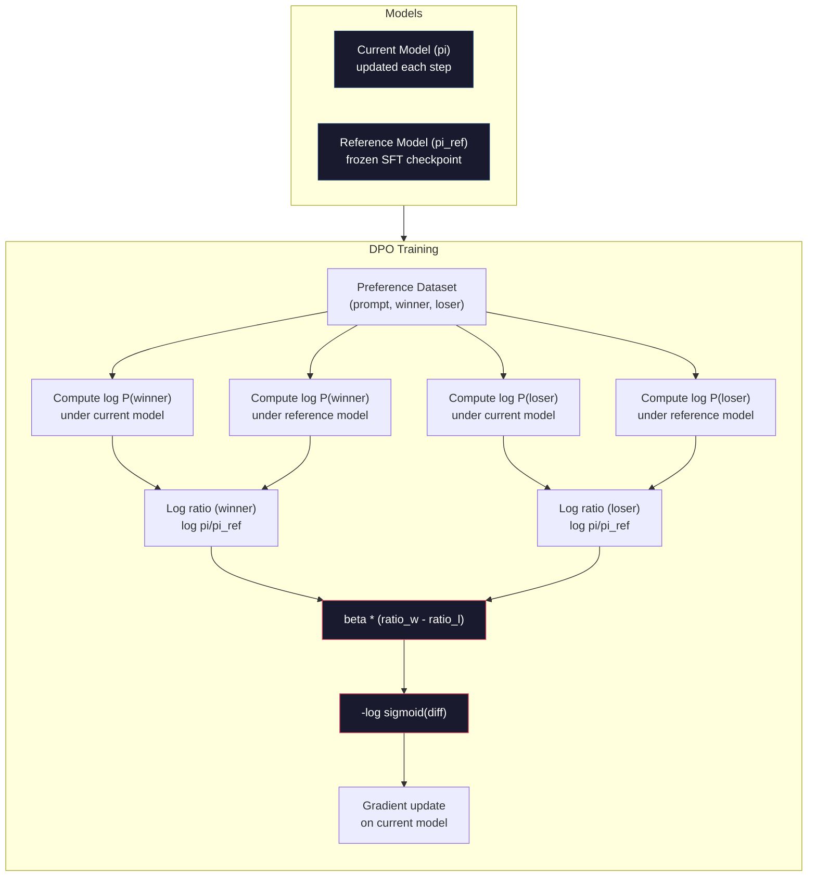

# DPO: Direct Preference Optimization / DPO：直接偏好优化

> RLHF 有效，但它需要训练三个模型（SFT、reward model、policy），管理 PPO 的不稳定性，还要调 KL penalty。DPO 问的是：如果能跳过这一切呢？DPO 直接在 preference pairs 上优化 language model。没有 reward model，没有 PPO。一个训练循环，得到相近结果。

**类型：** Build
**语言：** Python（with numpy）
**前置基础：** Phase 10, Lesson 07（RLHF）
**时间：** 约 90 分钟

## Learning Objectives / 学习目标

- 实现 DPO training：不使用单独 reward model，直接在 preference pairs 上优化 language model
- 推导 DPO loss function，并解释它如何通过 policy log probabilities 隐式表示 reward model
- 比较 DPO 与 RLHF 在 training stability、compute cost 和所需模型数量上的差异
- 调整 beta 参数，控制 trained policy 偏离 reference model 的程度

## The Problem / 问题

你在 Lesson 07 构建了一个 RLHF pipeline。三个阶段，三个模型：SFT model、reward model，以及用 PPO 优化的 policy model。仅 reward model 就需要数千个人类 preference pairs 和独立训练循环。PPO 又需要仔细调整 KL coefficient、learning rate、clip ratio 和 epochs。

实践中，PPO training 以不稳定著称。很小的 hyperparameter 改动就可能导致训练发散。reward model 只是 human preferences 的不完美代理，policy 会寻找方式利用它的弱点。KL penalty 有帮助，但也要单独调：太低会 reward hacking，太高则模型几乎学不到。

这就是为什么 InstructGPT 发表后多年里，大多数开源模型很难复现 RLHF。三阶段 pipeline 很脆。每个阶段都有自己的失败模式，而且错误会叠加。

2023 年 5 月，Rafael Rafailov、Archit Sharma 和 Stanford 同事发布了 “Direct Preference Optimization: Your Language Model is Secretly a Reward Model”。关键洞察是：你不需要单独的 reward model。最优 reward function 在数学上由 language model 自身的 token probabilities 决定。你可以完全跳过 reward model，直接在 preference pairs 上优化 language model。

DPO 把 RLHF 简化成一步 supervised learning。一个模型，一个 loss function，一个训练循环。没有 reinforcement learning。Zephyr-7B 是最早规模化使用 DPO 的模型之一，它在多个 benchmarks 上匹配或超过完整 RLHF 训练的模型。Meta 在 Llama 3 alignment pipeline 中也使用了 DPO。Anthropic 在 alignment research 中也引用过 DPO-style methods。

## The Concept / 概念

### The Key Insight / 核心洞察

RLHF 优化的目标是：

```
maximize: E[R(x, y)] - beta * KL(pi || pi_ref)
```

其中 R 是 reward model，pi 是 policy，pi_ref 是 reference model，beta 是 KL coefficient。

DPO 论文证明，这个目标有 closed-form optimal solution。对任意 reward function R，最优 policy 为：

```
pi*(y | x) = pi_ref(y | x) * exp(R(x, y) / beta) / Z(x)
```

其中 Z(x) 是 normalizing constant。重排得到：

```
R(x, y) = beta * log(pi*(y | x) / pi_ref(y | x)) + beta * log Z(x)
```

这就是突破点。reward 完全可以用 policy model probabilities 与 reference model probabilities 表达。不需要训练单独 reward model。reward *隐含* 在概率比中。

把它代入 Bradley-Terry preference model：

```
P(y_w > y_l | x) = sigmoid(R(x, y_w) - R(x, y_l))
                  = sigmoid(beta * (log pi(y_w|x)/pi_ref(y_w|x) - log pi(y_l|x)/pi_ref(y_l|x)))
```

Z(x) 项会抵消，因为两个 responses 都以同一个 prompt x 为条件。剩下的只依赖 policy model 与 reference model 在 preferred 和 rejected responses 上的 log-probabilities。

### The DPO Loss / DPO Loss

```
L_DPO = -log(sigmoid(beta * (log pi(y_w|x)/pi_ref(y_w|x) - log pi(y_l|x)/pi_ref(y_l|x))))
```

拆开来看：

- **y_w** = preferred（winning）response
- **y_l** = rejected（losing）response
- **x** = prompt
- **pi** = 当前正在训练的 model
- **pi_ref** = reference model（冻结的 SFT checkpoint）
- **beta** = 控制偏离 reference 程度的 temperature parameter，通常 0.1 到 0.5

`log pi(y|x) / pi_ref(y|x)` 是 log-probability ratio。当这个 ratio 为正，表示当前模型给 response y 的概率高于 reference；为负，则表示当前模型给的概率更低。

DPO loss 推动模型提高 preferred responses 的 log-probability ratio，并降低 rejected responses 的 ratio。beta 参数控制模型能多激进地偏离 reference：小 beta 允许更大偏离，大 beta 让模型更贴近 reference。



### Why DPO is Simpler / 为什么 DPO 更简单

| Aspect | RLHF (PPO) | DPO |
|--------|-----------|-----|
| Models to train | 3 (SFT + reward + policy) | 1 (policy only) |
| Training loops | 3 (SFT, RM training, PPO) | 2 (SFT, DPO) |
| Hyperparameters | lr, KL coeff, clip ratio, RM lr, epochs x3 | lr, beta, epochs |
| Reward model | Required (separate training) | Implicit in model probabilities |
| RL algorithm | PPO (complex, unstable) | Supervised learning (stable) |
| GPU memory | 3-4 models in memory during PPO | 2 models (current + reference) |
| Training stability | Sensitive to hyperparameters | Robust, similar to SFT |

DPO 训练时需要两个模型在内存中：current model 和 frozen reference。RLHF 需要三到四个：policy、reference、reward model，以及可选的 value function baseline。对 70B 模型来说，每个 FP16 副本要 140GB。移除 reward model 带来的内存节省很可观。

### When DPO Beats RLHF / DPO 什么时候优于 RLHF

**小数据集。** 在 5,000-20,000 个 preference pairs 下，DPO 经常匹配或超过 RLHF。RLHF 的 reward model 需要足够数据才能泛化；数据有限时，它会 overfit 并产生不可靠 reward signal。DPO 不需要 reward model，因此绕过了这个问题。

**有限 compute。** DPO 大约只需要完整 RLHF 三分之一的 compute，因为它只有一个训练循环而不是三个。对没有大型 GPU cluster 的团队，这是更现实的选择。

**快速迭代。** 想试 10 个不同 preference datasets，看哪个模型最好？DPO 可以让每个实验在数小时内跑完。RLHF 则需要为每个 dataset 重新训练 reward model。

### When RLHF Beats DPO / RLHF 什么时候优于 DPO

**大规模训练。** 在 GPT-4 或 Claude 规模上，RLHF 的独立 reward model 可以捕捉更细腻的 preference signals。reward model 相当于一个学习出来的 loss function，能适配复杂质量标准。

**复杂 reward signals。** 当“更好”包含多个维度（helpfulness、harmlessness、honesty）时，reward model 可以学习这个 multi-objective tradeoff。DPO 把每个 preference pair 视为二元信号：一个更好、一个更差，而不建模原因。

**迭代式 alignment。** RLHF pipelines 可以让当前 policy 生成新 responses，再让人类评分，重新训练 reward model，形成 online loop。DPO 工作在固定 preference pairs 数据集上。Anthropic 的 Constitutional AI 大量利用了 RLHF 的这种迭代特性。

### Beyond DPO: KTO, ORPO, SimPO / DPO 之后：KTO、ORPO、SimPO

DPO 启发了一系列简化 alignment 方法。

**KTO（Kahneman-Tversky Optimization，2024）：** 甚至不需要成对数据。KTO 使用 unpaired feedback，只要把每个 response 标成 “good” 或 “bad”，无需与替代 response 比较。这大幅简化数据收集。你不再向标注者展示两个 responses 并问“哪个更好？”，而是展示一个 response 并问“这好吗？”loss function 借鉴 prospect theory 中的 loss aversion：bad responses 的惩罚强于 good responses 的奖励。

**ORPO（Odds Ratio Preference Optimization，2024）：** 在单个训练步骤中结合 SFT 与 alignment。不是先 SFT 再 DPO，而是修改 SFT loss，把 preference signal 加进去。loss 有两项：preferred responses 上的标准 next-token prediction loss，加上一个 odds ratio term，用来拉大 preferred 与 rejected response probabilities 的差距。一个训练循环替代两个。

**SimPO（Simple Preference Optimization，2024）：** 完全移除 reference model。它不再计算相对 frozen reference 的 log-probability ratios，而是用 response 的平均 log-probability（按长度归一化）作为 implicit reward。这样节省内存（不需要 reference model），也简化训练。length normalization 防止模型偏好更短 responses。

| Method | Year | Models in Memory | Needs Pairs? | Needs Reference? | Training Loops |
|--------|------|-----------------|-------------|-----------------|----------------|
| RLHF | 2022 | 3-4 | Yes (for RM) | Yes | 3 |
| DPO | 2023 | 2 | Yes | Yes | 2 |
| KTO | 2024 | 2 | No (unpaired) | Yes | 2 |
| ORPO | 2024 | 1 | Yes | No | 1 |
| SimPO | 2024 | 1 | Yes | No | 1 |

趋势很清楚：每种方法都继续消除一块复杂度。RLHF 需要 reward model 和 PPO。DPO 消除了二者。KTO 消除了 paired data。ORPO 消除了独立 SFT stage。SimPO 消除了 reference model。alignment tax，也就是从 base model 到 aligned model 所需的 compute 与复杂度，正在持续下降。

### Real DPO Deployments / 真实 DPO 部署

**Zephyr-7B（HuggingFace，2023 年 10 月）：** 以 Mistral 7B base 为起点，在 UltraChat（200K examples）上 SFT，然后在 UltraFeedback（60K preference pairs）上 DPO。MT-Bench 得分 6.47，是当时最高的 7B model。作为对比，Llama 2 Chat 70B 得分 6.86，也就是说 Zephyr 仅用 DPO alignment 就达到了一个大 10 倍模型 94% 左右的水平。

**Llama 3（Meta，2024 年 4 月）：** 在初始 RLHF 阶段后使用 DPO。这个组合说明 DPO 与 RLHF 可以互补：RLHF 做 broad alignment，DPO 做 targeted refinement。

**Neural Magic / nm-chat（2024）：** 在多个开源模型上应用 DPO，相比 SFT-only baselines，在 alignment benchmarks 上稳定提升 5-15%。

```figure
dpo-loss
```

## Build It / 动手构建

### Step 1: Preference Dataset / 步骤 1：Preference Dataset

与 RLHF 相同的格式：(prompt, preferred, rejected) triples。DPO 直接消费这份数据，不需要中间 reward model。

```python
import numpy as np
import sys
import os
sys.path.insert(0, os.path.join(os.path.dirname(__file__), "..", "..", "04-pre-training-mini-gpt", "code"))
from main import MiniGPT, LayerNorm, Embedding, TransformerBlock

PREFERENCE_DATA = [
    {
        "prompt": "What is the capital of France?",
        "preferred": "The capital of France is Paris.",
        "rejected": "France is a country in Europe. It has many cities. The capital is Paris. Paris is known for the Eiffel Tower.",
    },
    {
        "prompt": "Explain gravity in one sentence.",
        "preferred": "Gravity is the force that attracts objects with mass toward each other.",
        "rejected": "Gravity is something that makes things fall down when you drop them.",
    },
    {
        "prompt": "What is 15 times 7?",
        "preferred": "15 times 7 is 105.",
        "rejected": "Let me think about this. 15 times 7. Well, 10 times 7 is 70, and 5 times 7 is 35, so the answer might be around 105.",
    },
    {
        "prompt": "Name three programming languages.",
        "preferred": "Python, Rust, and TypeScript.",
        "rejected": "There are many programming languages. Some popular ones include various languages like Python and others.",
    },
    {
        "prompt": "What year did World War II end?",
        "preferred": "World War II ended in 1945.",
        "rejected": "World War II was a major global conflict. It involved many countries. The war ended in the mid-1940s, specifically in 1945.",
    },
    {
        "prompt": "Define machine learning.",
        "preferred": "Machine learning is a field where algorithms learn patterns from data to make predictions without being explicitly programmed.",
        "rejected": "Machine learning is a type of AI. AI stands for artificial intelligence. Machine learning uses data to learn.",
    },
]
```

### Step 2: Sequence Log-Probability / 步骤 2：序列 Log-Probability

DPO loss 需要计算给定 prompt 时 response 的总 log-probability。这意味着要在完整的 (prompt + response) 序列上运行模型，并累加每个 response token 的 log-probability。

```python
def tokenize_sequence(text, vocab_size=256):
    return [min(t, vocab_size - 1) for t in list(text.encode("utf-8"))]


def compute_sequence_log_prob(model, prompt_tokens, response_tokens, max_seq_len=128):
    full_sequence = prompt_tokens + response_tokens
    if len(full_sequence) > max_seq_len:
        full_sequence = full_sequence[:max_seq_len]

    if len(full_sequence) < 2:
        return 0.0

    input_ids = np.array(full_sequence[:-1]).reshape(1, -1)
    target_ids = np.array(full_sequence[1:])

    logits = model.forward(input_ids)
    logits = logits[0]

    max_logits = logits.max(axis=-1, keepdims=True)
    log_probs = logits - max_logits - np.log(
        np.exp(logits - max_logits).sum(axis=-1, keepdims=True)
    )

    prompt_len = len(prompt_tokens)
    response_start = max(0, prompt_len - 1)
    response_end = len(target_ids)

    if response_start >= response_end:
        return 0.0

    response_log_probs = log_probs[response_start:response_end, :]
    response_targets = target_ids[response_start:response_end]

    total_log_prob = 0.0
    for i, target in enumerate(response_targets):
        total_log_prob += response_log_probs[i, target]

    return total_log_prob
```

这个函数是 DPO 的 workhorse。对每个 preference pair，它运行四次：model on preferred response、model on rejected response、reference on preferred response、reference on rejected response。每个训练样本 4 次 forward pass；相比 RLHF 的 generation + reward scoring + value estimation + PPO update，它更简单、更快、更稳定。

### Step 3: The DPO Loss / 步骤 3：DPO Loss

论文核心变成代码就是一个函数。一个 loss，没有 reward model。

```python
def sigmoid(x):
    return np.where(
        x >= 0,
        1.0 / (1.0 + np.exp(-x)),
        np.exp(x) / (1.0 + np.exp(x))
    )


def dpo_loss(policy_logprob_preferred, policy_logprob_rejected,
             ref_logprob_preferred, ref_logprob_rejected, beta=0.1):
    preferred_ratio = policy_logprob_preferred - ref_logprob_preferred
    rejected_ratio = policy_logprob_rejected - ref_logprob_rejected

    logit = beta * (preferred_ratio - rejected_ratio)

    loss = -np.log(sigmoid(logit) + 1e-8)

    preferred_reward = beta * preferred_ratio
    rejected_reward = beta * rejected_ratio

    return loss, {
        "preferred_ratio": float(preferred_ratio),
        "rejected_ratio": float(rejected_ratio),
        "logit": float(logit),
        "implicit_preferred_reward": float(preferred_reward),
        "implicit_rejected_reward": float(rejected_reward),
        "reward_margin": float(preferred_reward - rejected_reward),
    }
```

`preferred_ratio` 和 `rejected_ratio` 是 DPO 推导中的 log-probability ratios。当当前模型相对 reference 给 preferred response 更高概率，同时给 rejected response 更低概率时，logit 为正，loss 变低。训练信号正是把模型推向这个方向。

`implicit_preferred_reward` 和 `implicit_rejected_reward` 是 DPO loss 隐式分配的 rewards。你可以把它们取出来验证训练是否有效：preferred 与 rejected rewards 之间的 margin 应该随训练增大。

### Step 4: DPO Training Loop / 步骤 4：DPO 训练循环

一个标准 supervised training loop。没有 PPO，没有 reward model，只有 forward passes 和 gradient updates。

```python
def copy_model_weights(source, target):
    target.embedding.token_embed = source.embedding.token_embed.copy()
    target.embedding.pos_embed = source.embedding.pos_embed.copy()
    target.ln_f.gamma = source.ln_f.gamma.copy()
    target.ln_f.beta = source.ln_f.beta.copy()
    for s_block, t_block in zip(source.blocks, target.blocks):
        t_block.attn.W_q = s_block.attn.W_q.copy()
        t_block.attn.W_k = s_block.attn.W_k.copy()
        t_block.attn.W_v = s_block.attn.W_v.copy()
        t_block.attn.W_out = s_block.attn.W_out.copy()
        t_block.ffn.W1 = s_block.ffn.W1.copy()
        t_block.ffn.W2 = s_block.ffn.W2.copy()
        t_block.ffn.b1 = s_block.ffn.b1.copy()
        t_block.ffn.b2 = s_block.ffn.b2.copy()
        t_block.ln1.gamma = s_block.ln1.gamma.copy()
        t_block.ln1.beta = s_block.ln1.beta.copy()
        t_block.ln2.gamma = s_block.ln2.gamma.copy()
        t_block.ln2.beta = s_block.ln2.beta.copy()


def dpo_train(policy_model, reference_model, preference_data,
              num_epochs=5, lr=5e-6, beta=0.1, max_seq_len=128):
    print(f"DPO Training: {len(preference_data)} pairs, {num_epochs} epochs, "
          f"lr={lr}, beta={beta}")
    print()

    losses = []
    margins = []

    for epoch in range(num_epochs):
        epoch_loss = 0.0
        epoch_margin = 0.0
        num_examples = 0

        indices = np.random.permutation(len(preference_data))

        for idx in indices:
            pair = preference_data[idx]

            prompt_tokens = tokenize_sequence(pair["prompt"])
            preferred_tokens = tokenize_sequence(pair["preferred"])
            rejected_tokens = tokenize_sequence(pair["rejected"])

            pi_logprob_w = compute_sequence_log_prob(
                policy_model, prompt_tokens, preferred_tokens, max_seq_len
            )
            pi_logprob_l = compute_sequence_log_prob(
                policy_model, prompt_tokens, rejected_tokens, max_seq_len
            )
            ref_logprob_w = compute_sequence_log_prob(
                reference_model, prompt_tokens, preferred_tokens, max_seq_len
            )
            ref_logprob_l = compute_sequence_log_prob(
                reference_model, prompt_tokens, rejected_tokens, max_seq_len
            )

            loss, metrics = dpo_loss(
                pi_logprob_w, pi_logprob_l,
                ref_logprob_w, ref_logprob_l, beta
            )

            update_direction = 1.0 if metrics["logit"] < 0 else -0.1
            for block in policy_model.blocks:
                block.ffn.W1 += lr * update_direction * np.random.randn(*block.ffn.W1.shape) * 0.01
                block.ffn.W2 += lr * update_direction * np.random.randn(*block.ffn.W2.shape) * 0.01

            epoch_loss += loss
            epoch_margin += metrics["reward_margin"]
            num_examples += 1
            losses.append(float(loss))
            margins.append(metrics["reward_margin"])

        avg_loss = epoch_loss / max(num_examples, 1)
        avg_margin = epoch_margin / max(num_examples, 1)

        print(f"  Epoch {epoch + 1}/{num_epochs} | Loss: {avg_loss:.4f} | "
              f"Avg Margin: {avg_margin:.4f}")

    return policy_model, losses, margins
```

相比 RLHF，这个训练循环简洁得多。对每个 preference pair：计算四个 log-probabilities（两个模型、两个 responses），代入 DPO loss，计算梯度，更新 policy。没有 generation step，没有 reward model inference，没有 advantage estimation，没有 clipping。

### Step 5: Compare DPO vs RLHF / 步骤 5：比较 DPO 与 RLHF

测量 implicit reward margins 和 log-probability shifts，比较 DPO 与 Lesson 07 的 RLHF model。

```python
def evaluate_preference_accuracy(model, reference_model, preference_data, beta=0.1, max_seq_len=128):
    correct = 0
    total = 0

    for pair in preference_data:
        prompt_tokens = tokenize_sequence(pair["prompt"])
        preferred_tokens = tokenize_sequence(pair["preferred"])
        rejected_tokens = tokenize_sequence(pair["rejected"])

        pi_w = compute_sequence_log_prob(model, prompt_tokens, preferred_tokens, max_seq_len)
        pi_l = compute_sequence_log_prob(model, prompt_tokens, rejected_tokens, max_seq_len)
        ref_w = compute_sequence_log_prob(reference_model, prompt_tokens, preferred_tokens, max_seq_len)
        ref_l = compute_sequence_log_prob(reference_model, prompt_tokens, rejected_tokens, max_seq_len)

        preferred_reward = beta * (pi_w - ref_w)
        rejected_reward = beta * (pi_l - ref_l)

        if preferred_reward > rejected_reward:
            correct += 1
        total += 1

    return correct / max(total, 1)


def analyze_implicit_rewards(model, reference_model, preference_data, beta=0.1, max_seq_len=128):
    print("Implicit Reward Analysis:")
    print("-" * 65)
    print(f"  {'Prompt':<30} {'Pref Reward':>12} {'Rej Reward':>12} {'Margin':>10}")
    print("  " + "-" * 60)

    for pair in preference_data:
        prompt_tokens = tokenize_sequence(pair["prompt"])
        preferred_tokens = tokenize_sequence(pair["preferred"])
        rejected_tokens = tokenize_sequence(pair["rejected"])

        pi_w = compute_sequence_log_prob(model, prompt_tokens, preferred_tokens, max_seq_len)
        pi_l = compute_sequence_log_prob(model, prompt_tokens, rejected_tokens, max_seq_len)
        ref_w = compute_sequence_log_prob(reference_model, prompt_tokens, preferred_tokens, max_seq_len)
        ref_l = compute_sequence_log_prob(reference_model, prompt_tokens, rejected_tokens, max_seq_len)

        pref_reward = beta * (pi_w - ref_w)
        rej_reward = beta * (pi_l - ref_l)
        margin = pref_reward - rej_reward

        truncated = pair["prompt"][:28] + ".." if len(pair["prompt"]) > 30 else pair["prompt"]
        print(f"  {truncated:<30} {pref_reward:>12.4f} {rej_reward:>12.4f} {margin:>10.4f}")

    print()
```

### Step 6: Beta Sensitivity Analysis / 步骤 6：Beta 敏感性分析

beta 参数是 DPO 中对应 RLHF KL coefficient 的东西。它控制模型能偏离 reference 多少。下面的实验展示它的影响。

```python
def beta_sensitivity_analysis(sft_model, preference_data, betas, max_seq_len=128):
    print("Beta Sensitivity Analysis")
    print("-" * 60)
    print(f"  {'Beta':>8} {'Final Loss':>12} {'Final Margin':>14} {'Accuracy':>10}")
    print("  " + "-" * 55)

    results = []

    for beta in betas:
        policy = MiniGPT(
            vocab_size=256, embed_dim=128, num_heads=4,
            num_layers=4, max_seq_len=max_seq_len, ff_dim=512
        )
        reference = MiniGPT(
            vocab_size=256, embed_dim=128, num_heads=4,
            num_layers=4, max_seq_len=max_seq_len, ff_dim=512
        )
        copy_model_weights(sft_model, policy)
        copy_model_weights(sft_model, reference)

        policy, losses, margins_list = dpo_train(
            policy, reference, preference_data,
            num_epochs=3, lr=5e-6, beta=beta, max_seq_len=max_seq_len
        )

        accuracy = evaluate_preference_accuracy(
            policy, reference, preference_data, beta, max_seq_len
        )

        final_loss = losses[-1] if losses else 0
        final_margin = margins_list[-1] if margins_list else 0

        print(f"  {beta:>8.3f} {final_loss:>12.4f} {final_margin:>14.4f} {accuracy:>10.1%}")
        results.append({
            "beta": beta,
            "final_loss": final_loss,
            "final_margin": final_margin,
            "accuracy": accuracy,
        })

        print()

    return results
```

小 beta（0.01）让模型自由偏离 reference，学习很快，但有退化风险。大 beta（1.0）让模型贴近 reference，稳定但学习慢。多数应用的 sweet spot 是 0.1 到 0.3。

## Use It / 应用它

### Full DPO Pipeline Demo / 完整 DPO Pipeline Demo

```python
if __name__ == "__main__":
    np.random.seed(42)

    print("=" * 70)
    print("DPO: DIRECT PREFERENCE OPTIMIZATION")
    print("=" * 70)
    print()

    print("STEP 1: Initialize SFT Model (from Lesson 06)")
    print("-" * 50)
    sft_model = MiniGPT(
        vocab_size=256, embed_dim=128, num_heads=4,
        num_layers=4, max_seq_len=128, ff_dim=512
    )
    print(f"  Parameters: {sft_model.count_parameters():,}")
    print()

    print("STEP 2: DPO Training")
    print("-" * 50)

    policy_model = MiniGPT(
        vocab_size=256, embed_dim=128, num_heads=4,
        num_layers=4, max_seq_len=128, ff_dim=512
    )
    reference_model = MiniGPT(
        vocab_size=256, embed_dim=128, num_heads=4,
        num_layers=4, max_seq_len=128, ff_dim=512
    )
    copy_model_weights(sft_model, policy_model)
    copy_model_weights(sft_model, reference_model)

    policy_model, losses, margins = dpo_train(
        policy_model, reference_model, PREFERENCE_DATA,
        num_epochs=5, lr=5e-6, beta=0.1
    )
    print()

    print("=" * 70)
    print("STEP 3: Evaluate")
    print("=" * 70)
    print()

    pre_accuracy = evaluate_preference_accuracy(
        sft_model, reference_model, PREFERENCE_DATA, beta=0.1
    )
    post_accuracy = evaluate_preference_accuracy(
        policy_model, reference_model, PREFERENCE_DATA, beta=0.1
    )

    print(f"  Preference accuracy (pre-DPO):  {pre_accuracy:.1%}")
    print(f"  Preference accuracy (post-DPO): {post_accuracy:.1%}")
    print()

    analyze_implicit_rewards(policy_model, reference_model, PREFERENCE_DATA, beta=0.1)

    print("=" * 70)
    print("STEP 4: Training Dynamics")
    print("=" * 70)
    print()

    if losses:
        print("  Loss curve:")
        window = max(1, len(losses) // 5)
        for i in range(0, len(losses), window):
            chunk = losses[i:i + window]
            avg = sum(chunk) / len(chunk)
            print(f"    Steps {i:3d}-{i + len(chunk) - 1:3d}: loss = {avg:.4f}")
        print()

    if margins:
        print("  Reward margin curve:")
        window = max(1, len(margins) // 5)
        for i in range(0, len(margins), window):
            chunk = margins[i:i + window]
            avg = sum(chunk) / len(chunk)
            print(f"    Steps {i:3d}-{i + len(chunk) - 1:3d}: margin = {avg:.4f}")
        print()

    print("=" * 70)
    print("STEP 5: Beta Sensitivity")
    print("=" * 70)
    print()

    beta_results = beta_sensitivity_analysis(
        sft_model, PREFERENCE_DATA, betas=[0.01, 0.1, 0.3, 1.0]
    )

    print("=" * 70)
    print("DPO vs RLHF COMPARISON")
    print("=" * 70)
    print()
    print("  DPO advantages:")
    print("    - 1 training loop (vs 3 for RLHF)")
    print("    - 2 models in memory (vs 3-4 for RLHF)")
    print("    - Supervised learning (vs RL, more stable)")
    print("    - No reward model to train or maintain")
    print()
    print("  RLHF advantages:")
    print("    - Separate reward model captures complex preferences")
    print("    - Online learning: generate, rate, retrain")
    print("    - Better for multi-objective alignment")
    print("    - Proven at largest scales (GPT-4, Claude)")
    print()
    print("  Practical guidance:")
    print("    - Start with DPO. It's simpler and often sufficient.")
    print("    - Switch to RLHF if DPO plateaus on your eval metrics.")
    print("    - Many production systems use both: RLHF first, DPO to refine.")
```

## Ship It / 交付它

本课产出 `outputs/prompt-alignment-method-selector.md`：一个帮助你为使用场景选择 alignment method（SFT、RLHF、DPO、KTO、ORPO、SimPO）的 prompt。给定数据可用性、compute budget 和 alignment goals，它会推荐方法与训练计划。

## Exercises / 练习

1. 实现 KTO（Kahneman-Tversky Optimization）。KTO 不需要 pairs，只要把每个 response 标为 “good” 或 “bad”。good response 的 loss 是 `-log(sigmoid(beta * log_ratio))`，bad response 的 loss 是 `-log(1 - sigmoid(beta * log_ratio))`，并对 bad response loss 使用 loss aversion multiplier（通常 1.5x）。在同一数据上训练（把 preferred 当作 “good”，rejected 当作 “bad” 独立处理），并与 DPO 比较 accuracy。

2. 实现 length-normalized DPO。不要使用原始 log-probabilities，而是除以 response token 数：`normalized_logprob = total_logprob / num_tokens`。这会防止模型偏好更短 responses（因为短 response 的 total log-prob 往往更高）。比较有无 normalization 时的 implicit reward margins。

3. 构建 ORPO-style combined loss。给 DPO loss 加上 preferred response 上的标准 next-token prediction loss：`L = L_sft(preferred) + alpha * L_dpo`。尝试 alpha = 0.1、0.5、1.0。combined loss 应该让模型既能遵循指令（来自 SFT term），又偏好更好 responses（来自 DPO term），从而消除单独 SFT stage 的需求。

4. 实现 iterative DPO。先运行 3 epochs DPO，然后用训练后的模型生成新 responses，把它们与原始 preferred responses 配成新的 preference pairs，再运行一轮 DPO。做两轮这种 “self-play” 过程。比较 round 1 与 round 2 后的 preference accuracy，看迭代 refinement 是否有帮助。

5. 比较不同 reference models。不要使用 SFT checkpoint 作为 reference，而试试：(a) base model（pre-SFT），(b) DPO epoch 1 的 checkpoint，(c) policy model 的 exponential moving average。报告哪个 reference 产生最高 preference accuracy 和最稳定 training curve。

## Key Terms / 关键术语

| 术语 | 常见说法 | 实际含义 |
|------|----------------|----------------------|
| DPO | “没有 RL 的 RLHF” | Direct Preference Optimization：一种 supervised learning 算法，直接在 preference pairs 上优化 language model，绕过 reward model 和 PPO |
| Implicit reward | “reward 在模型里” | reward function 由 policy 与 reference models 的 log-probability ratio 决定，不需要单独 reward model |
| Beta (DPO) | “temperature” | 控制 policy 可偏离 reference model 的程度；小 beta 允许大偏离，大 beta 让模型更贴近 |
| Log-probability ratio | “模型变化了多少” | log pi(y\|x) - log pi_ref(y\|x)；正值表示当前模型比 reference 给出更高概率 |
| Reference model | “冻结 checkpoint” | SFT model 的一份权重不变副本，用作计算 probability ratios 的锚点 |
| KTO | “无 pair 的 DPO” | Kahneman-Tversky Optimization：使用 unpaired “good” 或 “bad” labels，不要求 preference pairs |
| ORPO | “一步 alignment” | Odds Ratio Preference Optimization：通过给 SFT loss 增加 preference term，把 SFT 与 alignment 合并到一个训练循环 |
| SimPO | “不需要 reference” | Simple Preference Optimization：用 length-normalized average log-probability 作为 implicit reward，移除 reference model |
| Alignment tax | “让模型安全可用的成本” | 从 base model 到 aligned model 额外需要的 compute、data 和复杂度；DPO 显著降低了它 |

## Further Reading / 延伸阅读

- [Rafailov et al., 2023 -- "Direct Preference Optimization: Your Language Model is Secretly a Reward Model"](https://arxiv.org/abs/2305.18290) -- 把 alignment 从 RLHF 简化为 supervised learning 的 DPO 论文
- [Tunstall et al., 2023 -- "Zephyr: Direct Distillation of LM Alignment"](https://arxiv.org/abs/2310.16944) -- Zephyr-7B，展示在 UltraFeedback 上用 DPO 可以匹配 RLHF benchmarks
- [Ethayarajh et al., 2024 -- "KTO: Model Alignment as Prospect Theoretic Optimization"](https://arxiv.org/abs/2402.01306) -- 消除 paired preferences 需求
- [Hong et al., 2024 -- "ORPO: Monolithic Preference Optimization without Reference Model"](https://arxiv.org/abs/2403.07691) -- 一步结合 SFT 与 alignment
- [Meng et al., 2024 -- "SimPO: Simple Preference Optimization with a Reference-Free Reward"](https://arxiv.org/abs/2405.14734) -- 完全移除 reference model
- [Llama 3 Technical Report](https://arxiv.org/abs/2407.21783) -- Meta 结合 RLHF 和 DPO 的 alignment pipeline
