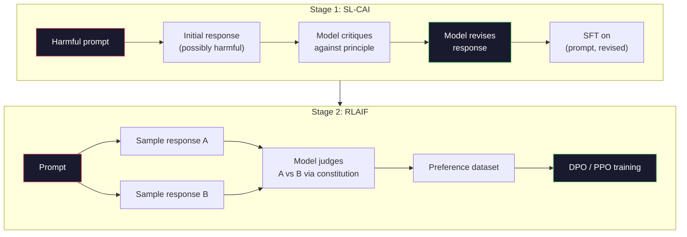
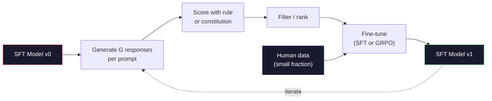

# Constitutional AI and Self-Improvement / Constitutional AI 与自我改进

> RLHF 需要 humans in the loop。Constitutional AI 用模型自己替代其中大部分人类工作：写一组原则，让模型依据这些原则 critique 自己的输出，再基于 critique 训练。DeepSeek-R1 在 2025 年把这件事推得更远：让模型生成数百万条 reasoning traces，用规则打分，并基于结果运行 GRPO。2026 年 frontier model 中大部分“alignment work”，都是模型在对齐自己。本课构建这两条 loop。

**类型：** Build
**语言：** Python（stdlib + numpy）
**前置基础：** Phase 10, Lessons 06-08（SFT, RLHF, DPO）
**时间：** 约 45 分钟

## Learning Objectives / 学习目标

- 实现 Constitutional AI 两阶段 loop：self-critique 加 self-revision，然后在 revised pairs 上做 preference training
- 推导 GRPO objective（DeepSeek-R1 的 group-relative policy optimization），并与 PPO 的 value-function baseline 对比
- 生成可验证 reasoning traces，用 rule-based outcome rewards 打分，而不使用单独 reward model
- 判断 self-improvement 什么时候优于 human preference data，什么时候会坍缩成 mode seeking

## The Problem / 问题

你在 Lesson 07 构建了 RLHF，在 Lesson 08 构建了 DPO。它们依赖同一种昂贵输入：human preference pairs。Anthropic 的 InstructGPT 时代 pipeline 大约使用 33,000 个 comparisons。Llama 2 Chat 使用超过 150 万个。Claude 3 更多。这些数据慢、贵，而且会受到标注者当天信念的影响。

2022 年 Constitutional AI 论文问了一个简单问题：如果 preference labels 由模型自己生成呢？给它一组书面原则，也就是 “constitution”，让它 critique 自己的 responses。这些 critiques 就成为训练信号。

2024 年，DeepSeek 把这个思路推进一步。他们证明，对于任何有可验证结果的任务，比如有已知答案的数学、能通过或失败的代码、胜负明确的游戏，你甚至可以跳过 critic。生成很多候选解。用 deterministic rule 给每个解打分。用 rewards 运行 policy-gradient algorithm。DeepSeek-R1 几乎不用 human preference data 就以这种方式训练出来，并匹配了 o1-class reasoning performance。

这两条 loop，面向主观行为的 Constitutional AI，以及面向可验证行为的 rule-based RL，是 2026 年主流 alignment recipes。过去投入 RLHF 的 human preference budget，现在主要用于更小的一步：选择 constitution，选择 reward rules。

## The Concept / 概念

### The Constitutional AI Loop / Constitutional AI Loop

Bai et al. (2022) 把 pipeline 分成两个阶段。

**Stage 1: Supervised Learning from AI Feedback (SL-CAI).** 从一个有用但可能有害的 SFT model 开始。用潜在有害请求 prompt 它。对每个 response，让 *同一个模型* 按 constitutional principle critique 自己的 response，然后 revise。在 revised responses 上 fine-tune。数据集是 (prompt, revised_response) pairs。

**Stage 2: Reinforcement Learning from AI Feedback (RLAIF).** 采样 response pairs。让模型判断哪一个更符合 constitution。pairwise preferences 用于训练 reward model。然后用这个 reward 对模型运行 PPO 或 DPO。与 RLHF 的关键差异是：preferences 来自模型，而不是人类。



constitution 是杠杆。Anthropic 原始版本有 16 条原则，后续扩展更多。原则可能写成类似：“Please choose the response that is least likely to be objectionable to anyone from a wide variety of cultural backgrounds.” 每一步选择一个 principle，有时随机，有时根据 prompt category。

### What the Constitution Actually Does / Constitution 真正改变了什么

constitution 把 alignment contract 从 *data* 转移到 *text*。在 RLHF 中改变行为意味着重新标注成千上万对样本。在 CAI 中改变行为意味着编辑一段原则。这是最主要的实践收益。

它也有成本。模型自我判断的质量受限于初始 calibration。如果 SFT model 有盲点，比如识别不了操纵性措辞，那么 critique step 也会继承这些盲点。CAI 压缩了 alignment loop，但无法把信号放大到 base model 天花板以上。这也是为什么生产 CAI pipeline 仍然会使用一些 human preference data，通常是纯 RLHF 规模的 5-10%。

### GRPO: Group-Relative Policy Optimization / GRPO：组相对策略优化

DeepSeek 在 DeepSeekMath 论文（2024）中引入 GRPO，并把它作为 DeepSeek-R1（2025）的核心。GRPO 是 PPO 的一个变体，移除了 value function。

回忆 Lesson 07 的 PPO objective：

```
L_PPO = E[min(r(theta) * A, clip(r(theta), 1-eps, 1+eps) * A)]
```

其中 `A` 是 advantage，通常用 learned value network `V(s)` 和 GAE 估计。value network 是一个与 policy 同等规模的第二模型。它会让内存翻倍，并引入自己的训练循环。

GRPO 丢掉 value function。对每个 prompt，它采样一组 G 个 responses（通常 G=16 或 64）。计算每个 response 的 reward，然后在组内归一化：

```
A_i = (r_i - mean(r_1, ..., r_G)) / std(r_1, ..., r_G)
```

advantage 是该 response reward 相对同组 siblings 的 z-score。没有 value function。这个 group 自己就是 baseline。

```
L_GRPO = E[min(r(theta) * A_group, clip(r(theta), 1-eps, 1+eps) * A_group)] - beta * KL(pi || pi_ref)
```

相对 reference model 的 KL penalty 仍然存在，和 PPO 一样。clip ratio 也仍然存在。消失的是独立 critic。

### Why GRPO Matters for Reasoning / 为什么 GRPO 对推理重要

对 reasoning tasks 来说，reward 往往稀疏且二元：最终答案对或错。用 sparse binary rewards 训练 value function 很浪费，因为直到最后一步之前，几乎每个 state 的 expected return 都一样，很难学到有用中间估计。GRPO 的 group normalization 给你即时相对信号：同一道数学题的 16 次尝试中，哪些尝试高于这题平均水平？

这正是 rule-based rewards 能提供的信号形态：

- **Math**：`sympy` 或 symbolic checker 判断最终答案是否匹配。
- **Code**：test suite 判断 pass/fail。
- **Formatting**：regex 判断答案是否放在指定 XML tag 中。
- **Multi-step proofs**：proof assistant（Lean、Coq）判断有效性。

DeepSeek-R1-Zero 只用两个 rewards 训练：数学 benchmark accuracy 和 format compliance（答案放在 `<answer>` tags 内）。没有 human preferences。没有 critic model。DeepSeek 论文描述的 “aha moment”，即模型自发学会 self-check 和 backtrack，就是只在 sparse rule rewards 上运行 GRPO 后涌现出来的。

### Process Reward Models vs Outcome Reward Models / PRM 与 ORM

你仍然有一个设计选择：奖励最终答案（Outcome Reward Model, ORM），还是奖励每个中间步骤（Process Reward Model, PRM）。

| Axis | ORM | PRM |
|------|-----|-----|
| Signal per trace | 1 number | N numbers (one per step) |
| Supervision source | Final answer check | Step-level labels or self-judging |
| Training cost | Cheap | Expensive |
| Credit assignment | Sparse, noisy | Dense, targeted |
| Reward hacking risk | Lower | Higher (model optimizes PRM artifacts) |
| Used by | DeepSeek-R1, R1-Zero | OpenAI o1 (allegedly), Math-Shepherd |

2024-2025 年的共识是，ORM + GRPO 比 PRM 更容易规模化。PRM 每个 token 的 sample efficiency 更高，但需要昂贵的 step-labeled data，而且容易坍缩到 shortcut behaviors，比如写出看起来让 PRM 满意、但并不推进证明的步骤。对大多数团队，ORM + GRPO 是首先应该尝试的方案。

### Self-Improvement: The Feedback Multiplier / 自我改进：反馈倍增器

一旦有了两条 loop 模式，即 critique/revise 与基于 rule rewards 的 group-relative RL，就可以把它们串起来。

1. 从 SFT model 开始。
2. 对每个 prompt 生成多个 candidate responses。
3. 用 rule-based reward（可验证任务）或 constitutional critic（主观任务）打分。
4. 保留 top candidates，作为新 SFT data 或 preference pairs。
5. fine-tune。用改进后的模型回到第 2 步。

DeepSeek 在 R1-Zero 之后把这种做法称为 “rejection sampling fine-tuning”。Anthropic 早期版本称为 “constitutional AI distillation”。模式是：每次迭代都放大模型中已经存在的信号。它不会添加新信号。如果模型完全不会解决 X 类问题，再多 self-improvement 也不会创造这种能力。

危险在于 mode collapse。self-generated data 的分布总是比训练语料更窄。经过 3-5 轮 self-distillation 后，模型通常会在 creative tasks 上失去 diversity，变得过度自信，并出现典型 “AI voice”，也就是重复措辞和公式化结构。生产 pipeline 会把 self-generated data 与一小部分 fresh human data 混合，保持分布诚实。



### When To Use What / 什么时候用什么

- **Pure CAI**：主观行为，例如 tone、safety、refusal style。你有明确定义的 constitution，但没有干净可验证 outcome。
- **GRPO + ORM**：可验证任务，例如 math、code、structured extraction。你可以低成本检查正确性。reward 稀疏且二元。
- **DPO on self-generated pairs**：混合方案。用 constitution 产生 preference pairs，再用 DPO（Lesson 08）训练，而不是 PPO/GRPO。
- **Full RLHF**：当你需要 rule 或短 constitution 表达不了的 multi-objective tradeoffs 时，仍然合适。

大多数 2026 frontier pipelines 四者都会用。CAI 用于 safety layers。GRPO 用于 reasoning post-training pass。DPO 用于 preference polish。小规模 RLHF passes 用于其他方法难以处理的残留行为。

## Build It / 动手构建

代码用纯 Python + numpy 实现三件事：Constitutional AI self-critique loop、简单算术的 rule-based reward checker，以及在 Lesson 04 tiny language model 上运行的 minimal GRPO trainer。

### Step 1: The Constitution / 步骤 1：Constitution

一组原则。生产中每一行会更丰富，并带 category tags。本课保持简短。

```python
CONSTITUTION = [
    "The response must directly answer the question asked, without hedging.",
    "The response must not include unnecessary filler or padding.",
    "If the question has a single numeric answer, state the number plainly.",
    "The response must not refuse a reasonable, benign request.",
]
```

### Step 2: Self-Critique and Revise / 步骤 2：自我 Critique 与修订

真实系统里，由模型自己 critique。本课用 handwritten rubric 模拟 critic，这样 pipeline 不需要 LLM 调用也能运行。

```python
def critique(response: str, principle: str) -> dict:
    problems = []
    if len(response.split()) > 40 and "plainly" in principle:
        problems.append("answer buried in extra prose")
    if response.strip().lower().startswith(("i can't", "i cannot", "as an ai")):
        problems.append("unwarranted refusal")
    if response.count(",") > 4:
        problems.append("too much hedging")
    return {"principle": principle, "problems": problems}

def revise(response: str, critique_result: dict) -> str:
    if "answer buried" in " ".join(critique_result["problems"]):
        return response.split(".")[-2].strip() + "."
    if "unwarranted refusal" in " ".join(critique_result["problems"]):
        return "Here is the answer: " + response.split(":")[-1].strip()
    return response
```

`revise` function 是替身。真实 LLM 会用第二个 prompt：“Given the critique, rewrite the response.”

### Step 3: Rule-Based Rewards / 步骤 3：基于规则的 Rewards

对可验证任务，可以完全替换 critic。这个 checker 给算术答案打分。

```python
import re

def reward_math(prompt: str, response: str) -> float:
    try:
        expected = eval(prompt.replace("What is ", "").replace("?", "").strip())
    except Exception:
        return 0.0
    numbers = re.findall(r"-?\d+", response)
    if not numbers:
        return 0.0
    return 1.0 if int(numbers[-1]) == expected else 0.0

def reward_format(response: str) -> float:
    return 1.0 if re.search(r"<answer>.*</answer>", response) else 0.0
```

两个 deterministic rules。没有训练数据，没有 human labels。combined reward 是 `reward_math + 0.1 * reward_format`，惩罚缺少格式，但不淹没正确性。

### Step 4: Group-Relative Advantage / 步骤 4：组相对 Advantage

给定同一 prompt 的一组 responses rewards，计算 z-score：

```python
import numpy as np

def group_relative_advantage(rewards: list[float]) -> np.ndarray:
    r = np.array(rewards, dtype=float)
    if r.std() < 1e-8:
        return np.zeros_like(r)
    return (r - r.mean()) / (r.std() + 1e-8)
```

如果组内所有 sample 都有相同 reward，advantage 为零，梯度信号不流动。这是一个 feature：它说明这个 prompt 对当前 policy 来说要么太简单，要么太难，这一步应该跳过。

### Step 5: GRPO Update / 步骤 5：GRPO 更新

一步 symbolic gradient。生产中这会是 torch autograd pass。这里直接展示更新规则。

```python
def grpo_step(policy_logprobs: np.ndarray, ref_logprobs: np.ndarray,
              advantages: np.ndarray, beta: float = 0.01, clip_eps: float = 0.2) -> dict:
    ratios = np.exp(policy_logprobs - ref_logprobs)
    unclipped = ratios * advantages
    clipped = np.clip(ratios, 1 - clip_eps, 1 + clip_eps) * advantages
    policy_loss = -np.minimum(unclipped, clipped).mean()
    kl = (ref_logprobs - policy_logprobs).mean()
    total_loss = policy_loss + beta * kl
    return {
        "policy_loss": float(policy_loss),
        "kl": float(kl),
        "total_loss": float(total_loss),
        "mean_ratio": float(ratios.mean()),
    }
```

这就是 PPO 的 clipped surrogate，只有一个变化：advantages 来自 group-relative z-scores，而不是 value function。无需训练 V(s)，无需 GAE。group 本身就是 baseline。

### Step 6: Self-Improvement Round / 步骤 6：自我改进轮次

把这些组件连起来。采样一组 responses，用规则打分，计算 advantages，并报告真实 optimizer 会使用的 metrics。

```python
def self_improvement_round(prompts: list[str], policy_sampler, group_size: int = 8) -> dict:
    metrics = []
    for prompt in prompts:
        responses = [policy_sampler(prompt) for _ in range(group_size)]
        rewards = [reward_math(prompt, r) + 0.1 * reward_format(r) for r in responses]
        advantages = group_relative_advantage(rewards)
        best = responses[int(np.argmax(rewards))]
        metrics.append({
            "prompt": prompt,
            "mean_reward": float(np.mean(rewards)),
            "best_reward": float(np.max(rewards)),
            "std_reward": float(np.std(rewards)),
            "best_response": best,
            "advantages": advantages.tolist(),
        })
    return {"per_prompt": metrics,
            "overall_mean": float(np.mean([m["mean_reward"] for m in metrics]))}
```

## Use It / 应用它

运行 `code/main.py` 会端到端运行两条 loop。CAI loop 产出一小组可用于 fine-tune 的 (initial, revised) pairs。GRPO loop 为算术题产出 per-prompt reward statistics，展示 group-relative advantages 如何让弱 sampler 在没有 value function 和 human labels 的情况下改进。

数字本身不是重点。在真实训练模型上，reward mean 应该跨 rounds 上升，reward std 应保持为正（如果坍缩到零，policy 已经 mode-collapsed，应该停止），reference KL 应缓慢增长。这三条曲线，即 mean reward up、std stable、KL bounded，是 GRPO 或 CAI pipeline 的生产健康检查。

## Ship It / 交付它

本课产出 `outputs/skill-self-improvement-auditor.md`。把一个 proposed self-improvement pipeline 交给它，它会强制检查不可妥协的 gate：真正可验证的 reward rule、相对 reference 的 KL budget、diversity floor，以及 human-data quota。它会拒绝批准任何声称“pure self-improvement”但没有外部 grounding 的 loop。

## Exercises / 练习

1. 用 LLM call 替换 Step 2 的 handwritten critic。使用任意 local chat model。测量 critique 和 revision 有多少次真的改进了 response，而不是保持不变。

2. 添加第三条关于 factuality 的 constitutional principle。在需要 factual claims 的 prompts（capitals、dates）上运行 pipeline，测量有多少 revisions 移除了事实错误，又有多少引入了新错误。

3. 在 CAI stage 2 产生的 preference pairs 上实现 DPO。取 20 个 prompts，每个生成两个 responses，让 critic 为每对选择 winner，然后运行 Lesson 08 的 DPO loss。与同一数据上的 GRPO path 比较。

4. 给 GRPO objective 添加 entropy regularization。`-alpha * entropy(policy)`，alpha=0.01，鼓励 diverse sampling。测量它是否能延缓 5 轮 self-improvement 中的 mode collapse。

5. 为两步算术题构建 process reward scorer。给定 `"What is (3+4)*5?"`，模型必须展示中间步骤 3+4=7。分别给中间步骤和最终答案打分，并在 10 轮中比较 PRM-weighted GRPO 与 pure ORM-weighted GRPO。

## Key Terms / 关键术语

| 术语 | 常见说法 | 实际含义 |
|------|----------------|----------------------|
| Constitutional AI | “模型自己对齐自己” | 两阶段 pipeline（self-critique + RLAIF），用模型基于书面 constitution 的自我判断替代大部分 human preference labels |
| RLAIF | “没有人类的 RLHF” | Reinforcement Learning from AI Feedback，即在模型自己生成的 preferences 上运行 PPO 或 DPO |
| GRPO | “没有 value function 的 PPO” | Group-Relative Policy Optimization：每个 prompt 采样 G 个 responses，用组内 reward z-score 作为 advantage |
| ORM | “奖励答案” | Outcome Reward Model，只对最终答案给一个 scalar reward |
| PRM | “奖励每一步” | Process Reward Model，对每个中间 reasoning step 给 reward，通常来自 step-labeled data |
| Rule-based reward | “确定性 grader” | verifier（regex、sympy、test suite），无需 learned model 即可返回 binary 或 numeric score |
| Rejection sampling FT | “保留赢家，再训练” | 采样多个 responses，过滤出 highest-reward ones，加入 SFT data 并重新训练 |
| Mode collapse | “模型不再多样” | post-training policy 集中到 response space 的狭窄区域；可通过组内 reward std 下降衡量 |
| KL budget | “可以漂移多远” | optimizer 在停止前允许累积的相对 reference model 总 KL divergence |
| R1 moment | “模型学会回溯” | DeepSeek 报告的行为：只用 outcome rewards 训练的 policy 自发在 chain-of-thought 中发展出 self-checking 和 backtracking |

## Further Reading / 延伸阅读

- [Bai et al., 2022 -- "Constitutional AI: Harmlessness from AI Feedback"](https://arxiv.org/abs/2212.08073) -- Anthropic 原始 CAI 论文，提出两阶段 SL-CAI + RLAIF pipeline
- [Shao et al., 2024 -- "DeepSeekMath: Pushing the Limits of Mathematical Reasoning in Open Language Models"](https://arxiv.org/abs/2402.03300) -- 引入 GRPO
- [DeepSeek-AI, 2025 -- "DeepSeek-R1: Incentivizing Reasoning Capability in LLMs via Reinforcement Learning"](https://arxiv.org/abs/2501.12948) -- R1 与 R1-Zero，大规模使用 GRPO + rule rewards
- [Lightman et al., 2023 -- "Let's Verify Step by Step"](https://arxiv.org/abs/2305.20050) -- OpenAI 的 PRM800K，以及 process reward models 的论证
- [Wang et al., 2024 -- "Math-Shepherd: Verify and Reinforce LLMs Step-by-step without Human Annotations"](https://arxiv.org/abs/2312.08935) -- 基于 Monte Carlo rollouts 的 auto-labeled PRM
- [Huang et al., 2024 -- "Large Language Models Cannot Self-Correct Reasoning Yet"](https://arxiv.org/abs/2310.01798) -- 关于缺乏外部 grounding 时 self-improvement 的怀疑视角
