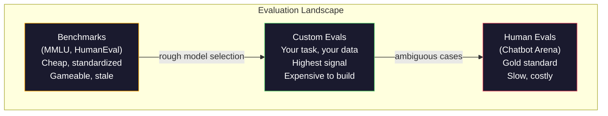
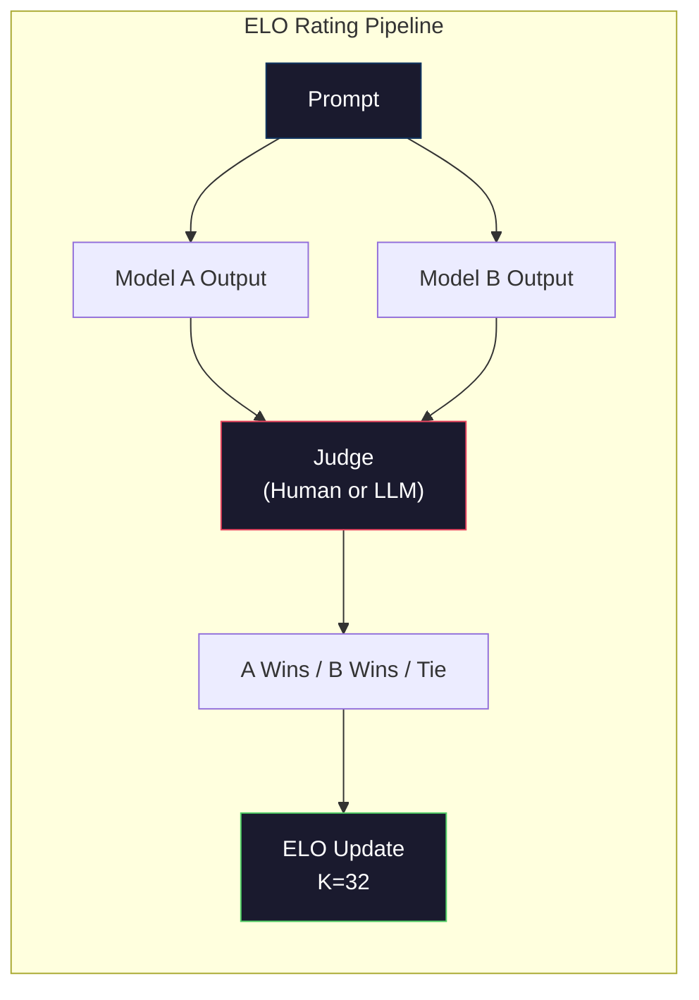

# Evaluation: Benchmarks, Evals, LM Harness / 评测：Benchmarks、Evals、LM Harness

> Goodhart's Law：当一个指标变成目标，它就不再是好指标。每个 frontier lab 都会优化 benchmark。MMLU 分数上涨，模型却仍然不一定能可靠数出 `"strawberry"` 里有几个 R。真正重要的 eval 只有你的 eval：在你的任务上，用你的数据，测试你的失败模式。

**类型：** Build
**语言：** Python
**前置基础：** Phase 10, Lessons 01-05（LLMs from Scratch）
**时间：** 约 90 分钟

## Learning Objectives / 学习目标

- 构建 custom evaluation harness，用于对 language model 运行 multiple-choice 和 open-ended benchmarks
- 解释为什么标准 benchmarks（MMLU、HumanEval）会饱和，并无法区分 frontier models
- 实现 task-specific evals，包含 proper metrics：exact match、F1、BLEU 和 LLM-as-judge scoring
- 设计面向具体使用场景的 custom evaluation suite，而不是只依赖 public leaderboards

## The Problem / 问题

MMLU 于 2020 年发布，包含 57 个学科的 15,908 道题。三年内，frontier models 就把它打到接近饱和。GPT-4 得 86.4%。Claude 3 Opus 得 86.8%。Llama 3 405B 得 88.6%。排行榜压缩到 3 分范围内，差异更多是 statistical noise，而不是真实 capability gap。

与此同时，这些模型仍会在一个 10 岁孩子不用思考就能完成的任务上失败。Claude 3.5 Sonnet 在 MMLU 上 88.7%，但早期无法数出 `"strawberry"` 中字母 R 的数量。这个任务不需要世界知识，也不需要推理，只需要字符级迭代。HumanEval 用 164 个问题测试 code generation。模型在其上得分 90%+，但仍然会产出 junior developer 一眼能发现 edge cases 会崩的代码。

benchmark performance 与 real-world reliability 之间的落差，是 LLM evaluation 的核心问题。benchmarks 告诉你模型在 benchmark 上表现如何。它几乎不告诉你模型在你的具体任务、你的具体数据、你的具体失败模式下会怎样。如果你在构建 customer support bot，MMLU 基本无关。如果你在构建 code assistant，HumanEval 只覆盖 function-level generation，不说明 debugging、refactoring 或跨文件解释代码能力。

你需要 custom evals。不是因为 benchmarks 没用，它们对粗略 model selection 有用；而是因为最终评估必须精确匹配部署条件。

## The Concept / 概念

### The Eval Landscape / 评测版图

evaluation 可以分成三类，每一类成本和信号质量都不同。

**Benchmarks** 是标准化测试集。MMLU、HumanEval、SWE-bench、MATH、ARC、HellaSwag。你让模型跑 benchmark，然后得到一个分数。优点是：大家用同一套测试，便于模型比较。缺点是：模型和训练数据越来越污染这些 benchmarks。实验室训练数据中可能包含 benchmark questions。分数上涨，能力不一定上涨。

**Custom evals** 是为具体使用场景构建的测试套件。你定义输入、expected outputs 和 scoring function。法律文档 summarizer 应该在法律文档上评测。SQL generator 应该在你的 database schema 上评测。它们创建成本高，但只有它们能预测生产表现。

**Human evals** 使用 paid annotators 按 helpfulness、correctness、fluency、safety 等标准判断模型输出。对 automated scoring 失效的 open-ended tasks 来说，这是 gold standard。Chatbot Arena 已经为 100+ models 收集超过 200 万个人类 preference votes。缺点是成本（每次 judgment $0.10-$2.00）和速度（数小时到数天）。



### Why Benchmarks Break / 为什么 Benchmarks 会失效

三个机制会让 benchmark scores 停止反映真实能力。

**Data contamination.** 训练语料会抓取互联网。benchmark questions 也在互联网上。模型在训练中见到答案。这不是传统意义上的作弊，实验室未必有意加入 benchmark data。但 web-scale scraping 几乎不可能完全排除。

**Teaching to the test.** 实验室会为 benchmark performance 优化 training mixtures。如果 5% 的 training mix 是 MMLU-style multiple choice，模型会学会格式和答案分布。MMLU 是 4-way multiple choice。模型会学到 A/B/C/D 分布近似均匀，即使不知道答案也有帮助。

**Saturation.** 当每个 frontier model 在某 benchmark 上都达到 85-90%，benchmark 就不再区分模型。剩下 10-15% 的题可能是 ambiguous、mislabeled，或需要冷门领域知识。MMLU 从 87% 提升到 89%，可能只是模型记住了两个更冷门的问题，而不是更聪明。

### Perplexity: A Quick Health Check / Perplexity：快速健康检查

Perplexity 衡量模型对一串 tokens 有多“惊讶”。形式上，它是平均负 log-likelihood 的指数：

```
PPL = exp(-1/N * sum(log P(token_i | context)))
```

perplexity 为 10，表示模型平均而言像是在每个 token 位置从 10 个选项中均匀选择那样不确定。越低越好。GPT-2 在 WikiText-103 上 perplexity 约 30。GPT-3 约 20。Llama 3 8B 约 7。

Perplexity 适合在同一 test set 上比较模型，但也有盲点。模型可以通过擅长预测常见模式得到低 perplexity，却在罕见但重要模式上很差。它也不说明 instruction following、reasoning 或 factual accuracy。把它当 sanity check，而不是最终结论。

### LLM-as-Judge / 用 LLM 做评审

用强模型评估弱模型输出。思路很简单：让 GPT-4o 或 Claude Sonnet 按 1-5 分评价某个 response 的 correctness、helpfulness 和 safety。用 GPT-4o-mini 时每次 judgment 大约 $0.01，并且与人类判断相关性出人意料地高，在多数任务上约 80% agreement。

scoring prompt 比 judge model 更重要。模糊 prompt（`"Rate this response"`）会产生 noisy scores。带 rubric 的结构化 prompt（`"Score 5 if the answer is factually correct and cites a source, 4 if correct but unsourced, 3 if partially correct..."`）会产生更一致、可复现的分数。

失败模式包括：judge models 有 position bias（pairwise comparison 中偏好第一个 response）、verbosity bias（偏好更长 response）和 self-preference（GPT-4 给 GPT-4 输出的分数高于等价 Claude 输出）。缓解方式：随机化顺序、按长度归一化、使用不同于被评估模型的 judge。

### ELO Ratings from Pairwise Comparisons / 基于成对比较的 ELO

这是 Chatbot Arena 的方法。向同一 prompt 展示来自不同模型的两个 responses。人类或 LLM judge 选择更好的一个。基于成千上万次比较，为每个模型计算 ELO rating，这和国际象棋使用的系统相同。

ELO 的优势：相对 ranking 比绝对 scoring 更可靠，能自然处理 ties，并且比独立给每个输出打分需要更少 comparisons 就能收敛。截至 2026 年初，Chatbot Arena 排名中 GPT-4o、Claude 3.5 Sonnet、Gemini 1.5 Pro 在榜首相差不到 20 ELO points。



### Eval Frameworks / 评测框架

**lm-evaluation-harness**（EleutherAI）：标准开源 eval framework。支持 200+ benchmarks。用一条命令让任意 Hugging Face model 跑 MMLU、HellaSwag、ARC 等。Open LLM Leaderboard 使用它。

**RAGAS**：专门用于 RAG pipelines 的 evaluation framework。测量 faithfulness（答案是否匹配 retrieved context）、relevance（retrieved context 是否与问题相关）和 answer correctness。

**promptfoo**：面向 prompt engineering 的 config-driven eval。用 YAML 定义 test cases，针对多个模型运行，得到 pass/fail report。适合 prompt regression testing，确保 prompt 改动没有破坏已有 test cases。

### Building Custom Evals / 构建自定义 Evals

这是生产中唯一真正重要的 eval。流程如下：

1. **Define the task.** 模型到底应该做什么？要精确。`"Answer questions"` 太模糊。`"Given a customer complaint email, extract the product name, issue category, and sentiment"` 才是可评估任务。

2. **Create test cases.** prototype eval 至少 50 个，生产 200+。每个 test case 是 (input, expected_output) pair。包含 edge cases：空输入、adversarial inputs、ambiguous inputs、其他语言输入。

3. **Define scoring.** structured outputs 用 exact match。文本相似度用 BLEU/ROUGE。open-ended quality 用 LLM-as-judge。extraction tasks 用 F1。多个 metrics 可加权组合。

4. **Automate.** 每个 eval 都能一条命令运行。没有手工步骤。结果存成能做时间对比的格式。

5. **Track over time.** 单次 eval score 没意义，你需要 trendline。上次 prompt 改动后分数是否提升？切换模型后是否退化？eval 要和 prompts 一起 version。

| Eval Type | Cost per judgment | Agreement with humans | Best for |
|-----------|------------------|----------------------|----------|
| Exact match | ~$0 | 100% (when applicable) | Structured output, classification |
| BLEU/ROUGE | ~$0 | ~60% | Translation, summarization |
| LLM-as-judge | ~$0.01 | ~80% | Open-ended generation |
| Human eval | $0.10-$2.00 | N/A (is the ground truth) | Ambiguous, high-stakes tasks |

```figure
perplexity-loss
```

## Build It / 动手构建

### Step 1: A Minimal Eval Framework / 步骤 1：最小 Eval Framework

定义核心抽象。一个 eval case 有 input、expected output 和可选 metadata dict。scorer 接收 prediction 与 reference，返回 0 到 1 之间的分数。

```python
import json
from collections import Counter

class EvalCase:
    def __init__(self, input_text, expected, metadata=None):
        self.input_text = input_text
        self.expected = expected
        self.metadata = metadata or {}

class EvalSuite:
    def __init__(self, name, cases, scorers):
        self.name = name
        self.cases = cases
        self.scorers = scorers

    def run(self, model_fn):
        results = []
        for case in self.cases:
            prediction = model_fn(case.input_text)
            scores = {}
            for scorer_name, scorer_fn in self.scorers.items():
                scores[scorer_name] = scorer_fn(prediction, case.expected)
            results.append({
                "input": case.input_text,
                "expected": case.expected,
                "prediction": prediction,
                "scores": scores,
            })
        return results
```

### Step 2: Scoring Functions / 步骤 2：Scoring Functions

构建 exact match、token F1 和一个 simulated LLM-as-judge scorer。

```python
def exact_match(prediction, expected):
    return 1.0 if prediction.strip().lower() == expected.strip().lower() else 0.0

def token_f1(prediction, expected):
    pred_tokens = set(prediction.lower().split())
    exp_tokens = set(expected.lower().split())
    if not pred_tokens or not exp_tokens:
        return 0.0
    common = pred_tokens & exp_tokens
    precision = len(common) / len(pred_tokens)
    recall = len(common) / len(exp_tokens)
    if precision + recall == 0:
        return 0.0
    return 2 * (precision * recall) / (precision + recall)

def llm_judge_simulated(prediction, expected):
    pred_words = set(prediction.lower().split())
    exp_words = set(expected.lower().split())
    if not exp_words:
        return 0.0
    overlap = len(pred_words & exp_words) / len(exp_words)
    length_penalty = min(1.0, len(prediction) / max(len(expected), 1))
    return round(overlap * 0.7 + length_penalty * 0.3, 3)
```

### Step 3: ELO Rating System / 步骤 3：ELO 评分系统

实现 pairwise comparisons 与 ELO updates。这正是 Chatbot Arena 用来排名模型的系统。

```python
class ELOTracker:
    def __init__(self, k=32, initial_rating=1500):
        self.ratings = {}
        self.k = k
        self.initial_rating = initial_rating
        self.history = []

    def _ensure_player(self, name):
        if name not in self.ratings:
            self.ratings[name] = self.initial_rating

    def expected_score(self, rating_a, rating_b):
        return 1 / (1 + 10 ** ((rating_b - rating_a) / 400))

    def record_match(self, player_a, player_b, outcome):
        self._ensure_player(player_a)
        self._ensure_player(player_b)

        ea = self.expected_score(self.ratings[player_a], self.ratings[player_b])
        eb = 1 - ea

        if outcome == "a":
            sa, sb = 1.0, 0.0
        elif outcome == "b":
            sa, sb = 0.0, 1.0
        else:
            sa, sb = 0.5, 0.5

        self.ratings[player_a] += self.k * (sa - ea)
        self.ratings[player_b] += self.k * (sb - eb)

        self.history.append({
            "a": player_a, "b": player_b,
            "outcome": outcome,
            "rating_a": round(self.ratings[player_a], 1),
            "rating_b": round(self.ratings[player_b], 1),
        })

    def leaderboard(self):
        return sorted(self.ratings.items(), key=lambda x: -x[1])
```

### Step 4: Perplexity Calculation / 步骤 4：Perplexity 计算

使用 token probabilities 计算 perplexity。实践中你会从 model logits 得到这些值。这里用 probability distribution 模拟。

```python
import numpy as np

def perplexity(log_probs):
    if not log_probs:
        return float("inf")
    avg_neg_log_prob = -np.mean(log_probs)
    return float(np.exp(avg_neg_log_prob))

def token_log_probs_simulated(text, model_quality=0.8):
    np.random.seed(hash(text) % 2**31)
    tokens = text.split()
    log_probs = []
    for i, token in enumerate(tokens):
        base_prob = model_quality
        if len(token) > 8:
            base_prob *= 0.6
        if i == 0:
            base_prob *= 0.7
        prob = np.clip(base_prob + np.random.normal(0, 0.1), 0.01, 0.99)
        log_probs.append(float(np.log(prob)))
    return log_probs
```

### Step 5: Aggregate Results / 步骤 5：汇总结果

计算一次 eval run 的 summary statistics：mean、median、threshold 下的 pass rate，以及每个 metric 的 breakdown。

```python
def summarize_results(results, threshold=0.8):
    all_scores = {}
    for r in results:
        for metric, score in r["scores"].items():
            all_scores.setdefault(metric, []).append(score)

    summary = {}
    for metric, scores in all_scores.items():
        arr = np.array(scores)
        summary[metric] = {
            "mean": round(float(np.mean(arr)), 3),
            "median": round(float(np.median(arr)), 3),
            "std": round(float(np.std(arr)), 3),
            "min": round(float(np.min(arr)), 3),
            "max": round(float(np.max(arr)), 3),
            "pass_rate": round(float(np.mean(arr >= threshold)), 3),
            "n": len(scores),
        }
    return summary

def print_summary(summary, suite_name="Eval"):
    print(f"\n{'=' * 60}")
    print(f"  {suite_name} Summary")
    print(f"{'=' * 60}")
    for metric, stats in summary.items():
        print(f"\n  {metric}:")
        print(f"    Mean:      {stats['mean']:.3f}")
        print(f"    Median:    {stats['median']:.3f}")
        print(f"    Std:       {stats['std']:.3f}")
        print(f"    Range:     [{stats['min']:.3f}, {stats['max']:.3f}]")
        print(f"    Pass rate: {stats['pass_rate']:.1%} (threshold >= 0.8)")
        print(f"    N:         {stats['n']}")
```

### Step 6: Run the Full Pipeline / 步骤 6：运行完整 Pipeline

把所有组件串起来。定义 task、创建 test cases、模拟两个模型、运行 evals、用 pairwise comparisons 计算 ELO，并打印 leaderboard。

```python
def demo_model_good(prompt):
    responses = {
        "What is the capital of France?": "Paris",
        "What is 2 + 2?": "4",
        "Who wrote Hamlet?": "William Shakespeare",
        "What language is PyTorch written in?": "Python and C++",
        "What is the boiling point of water?": "100 degrees Celsius",
    }
    return responses.get(prompt, "I don't know")

def demo_model_bad(prompt):
    responses = {
        "What is the capital of France?": "Paris is the capital city of France",
        "What is 2 + 2?": "The answer is four",
        "Who wrote Hamlet?": "Shakespeare",
        "What language is PyTorch written in?": "Python",
        "What is the boiling point of water?": "212 Fahrenheit",
    }
    return responses.get(prompt, "Unknown")

cases = [
    EvalCase("What is the capital of France?", "Paris"),
    EvalCase("What is 2 + 2?", "4"),
    EvalCase("Who wrote Hamlet?", "William Shakespeare"),
    EvalCase("What language is PyTorch written in?", "Python and C++"),
    EvalCase("What is the boiling point of water?", "100 degrees Celsius"),
]

suite = EvalSuite(
    name="General Knowledge",
    cases=cases,
    scorers={
        "exact_match": exact_match,
        "token_f1": token_f1,
        "llm_judge": llm_judge_simulated,
    },
)

results_good = suite.run(demo_model_good)
results_bad = suite.run(demo_model_bad)

print_summary(summarize_results(results_good), "Model A (concise)")
print_summary(summarize_results(results_bad), "Model B (verbose)")
```

“good” model 给出精确答案。“bad” model 给出 verbose paraphrases。Exact match 会严厉惩罚 verbose model。Token F1 和 LLM-as-judge 更宽容。这说明 metric choice 很关键：同一个模型在不同评分方式下可能看起来很好，也可能很糟。

### Step 7: ELO Tournament / 步骤 7：ELO Tournament

在多个 rounds 中运行 models 间 pairwise comparisons。

```python
elo = ELOTracker(k=32)

for case in cases:
    pred_a = demo_model_good(case.input_text)
    pred_b = demo_model_bad(case.input_text)

    score_a = token_f1(pred_a, case.expected)
    score_b = token_f1(pred_b, case.expected)

    if score_a > score_b:
        outcome = "a"
    elif score_b > score_a:
        outcome = "b"
    else:
        outcome = "tie"

    elo.record_match("model_a_concise", "model_b_verbose", outcome)

print("\nELO Leaderboard:")
for name, rating in elo.leaderboard():
    print(f"  {name}: {rating:.0f}")
```

### Step 8: Perplexity Comparison / 步骤 8：Perplexity 对比

比较不同质量“models”的 perplexity。

```python
test_text = "The quick brown fox jumps over the lazy dog in the garden"

for quality, label in [(0.9, "Strong model"), (0.7, "Medium model"), (0.4, "Weak model")]:
    log_probs = token_log_probs_simulated(test_text, model_quality=quality)
    ppl = perplexity(log_probs)
    print(f"  {label} (quality={quality}): perplexity = {ppl:.2f}")
```

## Use It / 应用它

### lm-evaluation-harness (EleutherAI) / lm-evaluation-harness（EleutherAI）

这是在任意模型上运行 benchmarks 的标准工具。

```python
# pip install lm-eval
# Command line:
# lm_eval --model hf --model_args pretrained=meta-llama/Llama-3.1-8B --tasks mmlu --batch_size 8

# Python API:
# import lm_eval
# results = lm_eval.simple_evaluate(
#     model="hf",
#     model_args="pretrained=meta-llama/Llama-3.1-8B",
#     tasks=["mmlu", "hellaswag", "arc_easy"],
#     batch_size=8,
# )
# print(results["results"])
```

### promptfoo / promptfoo

面向 prompt engineering 的 config-driven eval。用 YAML 定义 tests，并针对多个 providers 运行。

```yaml
# promptfoo.yaml
providers:
  - openai:gpt-4o-mini
  - anthropic:claude-3-haiku

prompts:
  - "Answer in one word: {{question}}"

tests:
  - vars:
      question: "What is the capital of France?"
    assert:
      - type: contains
        value: "Paris"
  - vars:
      question: "What is 2 + 2?"
    assert:
      - type: equals
        value: "4"
```

### RAGAS for RAG evaluation / 用 RAGAS 评测 RAG

```python
# pip install ragas
# from ragas import evaluate
# from ragas.metrics import faithfulness, answer_relevancy, context_precision
#
# result = evaluate(
#     dataset,
#     metrics=[faithfulness, answer_relevancy, context_precision],
# )
# print(result)
```

RAGAS 衡量通用 evals 会漏掉的东西：模型答案是否 grounded in retrieved context，而不仅仅是抽象意义上的“正确”。

## Ship It / 交付它

本课产出 `outputs/prompt-eval-designer.md`：一个可复用 prompt，用于为任意任务设计 custom eval suites。给它任务描述，它会生成 test cases、scoring functions 和 pass/fail threshold recommendation。

它还会产出 `outputs/skill-llm-evaluation.md`：一个 decision framework，根据 task type、budget 和 latency requirements 选择合适 evaluation strategy。

## Exercises / 练习

1. 添加一个 “consistency” scorer，让同一个 input 通过模型 5 次，并测量 outputs 匹配频率。deterministic inputs 上不一致的答案会暴露 fragile prompts 或高 temperature settings。

2. 扩展 ELO tracker，支持多个 judge functions（exact match、F1、LLM-as-judge）并加权。比较 exact match 权重大与 F1 权重大时 leaderboard 如何变化。

3. 为一个具体任务构建 eval suite：把 email classification 到 5 个 categories。创建 100 个 test cases，包含多样样本和 edge cases（可能属于多个 categories 的 emails、空 emails、其他语言 emails）。测量不同“models”（rule-based、keyword matching、simulated LLM）的表现。

4. 实现 contamination detection：给定一组 eval questions 和 training corpus，检查有多少比例 eval questions（或近似 paraphrases）出现在 training data 中。这是研究者审计 benchmark validity 的方式。

5. 构建 “model diff” 工具。给定两个 model versions 的 eval results，突出显示哪些具体 test cases 提升、哪些退化、哪些不变。这是 eval 领域的 code diff，对理解一次改动到底有益还是有害至关重要。

## Key Terms / 关键术语

| 术语 | 常见说法 | 实际含义 |
|------|----------------|----------------------|
| MMLU | “那个 benchmark” | Massive Multitask Language Understanding；57 个学科、15,908 道 multiple choice questions，到 2025 年已在 88% 以上饱和 |
| HumanEval | “代码 eval” | OpenAI 的 164 个 Python function-completion problems，只测试 isolated function generation |
| SWE-bench | “真实 coding eval” | 来自 12 个 Python repos 的 2,294 个 GitHub issues，衡量包含 test generation 在内的端到端 bug fixing |
| Perplexity | “模型有多困惑” | exp(-avg(log P(token_i given context)))；越低表示模型给真实 tokens 的概率越高 |
| ELO rating | “模型的国际象棋排名” | 从 pairwise win/loss records 计算的相对 skill rating，Chatbot Arena 用它排名 100+ models |
| LLM-as-judge | “用 AI 给 AI 打分” | 强模型按 rubric 给弱模型输出打分，与 human judges 约 80% agreement，成本约 $0.01/judgment |
| Data contamination | “模型见过测试题” | 训练数据包含 benchmark questions，抬高分数但不提升真实能力 |
| Eval suite | “一堆测试” | versioned collection of (input, expected_output, scorer) triples，用于衡量具体能力 |
| Pass rate | “做对比例” | eval cases 中分数超过阈值的比例；比 mean score 更可操作，因为它衡量 reliability |
| Chatbot Arena | “模型排名网站” | LMSYS 平台，拥有 2M+ human preference votes，通过 ELO ratings 生成最受信任的 LLM leaderboard |

## Further Reading / 延伸阅读

- [Hendrycks et al., 2021 -- "Measuring Massive Multitask Language Understanding"](https://arxiv.org/abs/2009.03300) -- MMLU 论文，尽管已饱和，仍是引用最多的 LLM benchmark
- [Chen et al., 2021 -- "Evaluating Large Language Models Trained on Code"](https://arxiv.org/abs/2107.03374) -- OpenAI 的 HumanEval 论文，建立代码生成 evaluation methodology
- [Zheng et al., 2023 -- "Judging LLM-as-a-Judge"](https://arxiv.org/abs/2306.05685) -- 系统分析用 LLMs 评估 LLMs，包括 position bias 和 verbosity bias
- [LMSYS Chatbot Arena](https://chat.lmsys.org/) -- 拥有 2M+ votes 的 crowdsourced model comparison platform，最受信任的真实世界 LLM ranking
