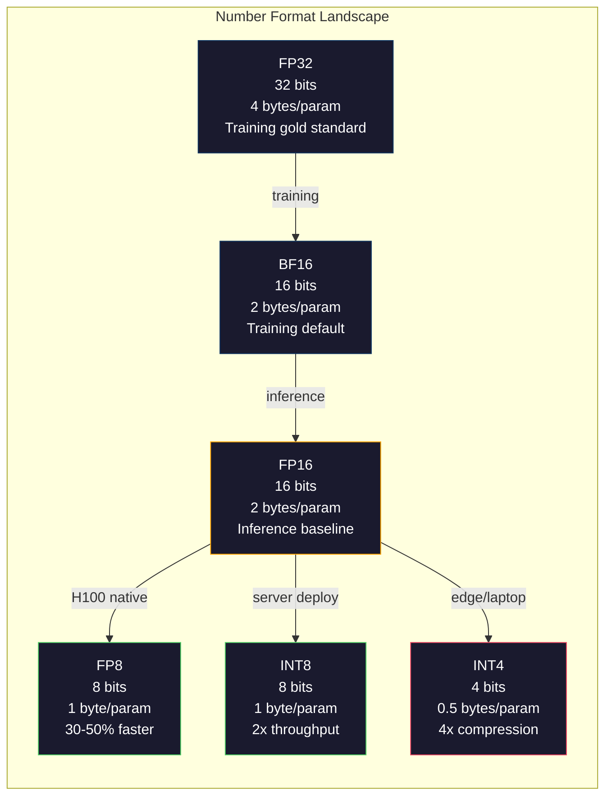
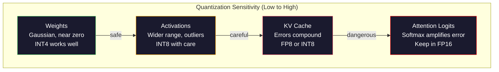
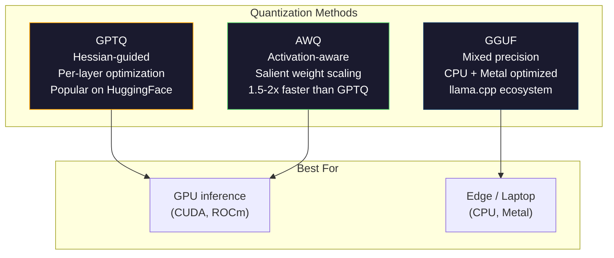

# Quantization: Making Models Fit / 量化：让模型放得下

> 70B 模型用 FP16 需要 140GB。光权重就要两张 A100。量化到 FP8：一张 80GB GPU。INT4：一台 MacBook。

**类型：** Build
**语言：** Python（with numpy）
**前置基础：** Phase 10, Lessons 01-10（LLMs from Scratch）
**时间：** 约 120 分钟

## Learning Objectives / 学习目标

- 实现从 FP16 到 INT8 和 INT4 的 symmetric 与 asymmetric quantization，包括 per-tensor 和 per-channel scaling
- 计算 quantization 带来的内存节省，并判断给定 GPU VRAM 能容纳哪种 precision
- 解释 post-training quantization（PTQ）与 quantization-aware training（QAT）的区别
- 使用 GPTQ 或 AWQ 量化真实模型，并在 benchmark 上测量 accuracy-memory tradeoff

## The Problem / 问题

Llama 3 70B 有 700 亿参数。每个参数是一个 16-bit floating point number，也就是 1400 亿字节，140GB。单张 A100 只有 80GB VRAM。你甚至无法在单卡加载权重，更不用说运行推理。仅服务一个模型，就需要两张每小时 2 美元的 A100。

但每个参数 16 bits 很浪费。神经网络大多数 weights 聚集在 0 附近。FP16 的完整动态范围（从 0.000000059 到 65,504）几乎完全用不上。测量 Llama 3 70B 的实际 weight distribution，95% 都落在 -0.1 到 +0.1 之间。你正在用 16 bits 表示本来 4 bits 就能容纳的值。

Quantization 用低精度数替换高精度数。FP16 到 FP8，内存减半。FP16 到 INT4，内存变成四分之一。140GB 模型变成 35GB，能放进单张消费级 GPU。推进到 2-bit quantization（激进、有损，但对某些任务可用），同一个模型可以在 16GB laptop 上跑。

代价是 accuracy。每少一 bit，都会丢失信息。问题是丢多少、丢在哪里。量化良好的 INT4 模型在多数 benchmarks 上能保留原模型 95-99% 的质量。naive INT4 quantization 可能直接毁掉模型。差别在方法。

社区用 GPTQ 把 Llama 3 量化到 INT4，在 WikiText 上大约损失 1-2 个 perplexity points。Mistral 发布的 Mixtral 8x22B FP8 checkpoints 在 MMLU 上没有可测质量损失。GGUF format 支撑 llama.cpp，让 70B 模型在 M-series MacBook 上运行。Quantization 不是 hack，而是所有大于 7B 模型的标准部署路径。

## The Concept / 概念

### Number Formats: What Each Bit Does / 数字格式：每个 bit 做什么

每个 floating-point number 都有三部分：sign、exponent 和 mantissa（也叫 significand）。sign 是 1 bit。exponent 决定范围，也就是数可以多大或多小。mantissa 决定精度，也就是能保留多少小数位。

```
FP32:  [1 sign] [8 exponent] [23 mantissa]  = 32 bits
FP16:  [1 sign] [5 exponent] [10 mantissa]  = 16 bits
BF16:  [1 sign] [8 exponent] [7  mantissa]  = 16 bits
FP8:   [1 sign] [4 exponent] [3  mantissa]  = 8  bits (E4M3)
FP8:   [1 sign] [5 exponent] [2  mantissa]  = 8  bits (E5M2)
INT8:  [1 sign] [7 value]                   = 8  bits (uniform steps)
INT4:  [1 sign] [3 value]                   = 4  bits (16 levels total)
```

**FP32** 是 full precision。23 mantissa bits 约等于 7 位十进制精度。范围大约是 1.2 x 10^-38 到 3.4 x 10^38。过去训练几乎全用 FP32；现在它仍用于 accumulation，也就是矩阵乘法中的 running sums。

**FP16** 把位数减半。10 mantissa bits 约等于 3.3 位十进制精度。exponent 缩到 5 bits，范围大幅变小（最大约 65,504）。这对 weights 没问题，因为它们集中在零附近；但对训练中可能 spike 的 activations 和 gradients 危险。FP16 training 需要 loss scaling 防止 underflow。

**BF16**（Brain Float 16）保留 FP32 的 8-bit exponent，把 mantissa 缩到 7 bits。范围与 FP32 相同，精度低于 FP16。Google 专门为深度学习设计了它。直觉是：对神经网络来说 range 比 precision 更重要。10^-20 的 gradient 在 FP16 中会 underflow 为 0，在 BF16 中仍能存在。0.07342 的 weight 在 BF16 中 round 到 0.0734，足够接近。现代训练基本都使用 BF16 或 BF16/FP32 mix。

**FP8** 有两种形态。E4M3（4 exponent、3 mantissa）用于推理时的 weights 和 activations。E5M2（5 exponent、2 mantissa）用于训练 gradients，因为此时 range 比 precision 更重要。H100 上的 FP8 inference 相比 FP16 有 30-50% speedup，质量损失可忽略。

**INT8** 是 integer format。没有 exponent，没有 mantissa，只有 -128 到 127 的 256 个均匀间隔值。你需要 scale factor 把 floating-point weights 映射到这个范围。优势是 integer arithmetic 比 floating-point 更快也更省电。A100 上 INT8 matrix multiplication 达 624 TOPS，而 FP16 是 312 TFLOPS。

**INT4** 更进一步。只有 16 个可能值。scale factor 承担大量工作。质量完全取决于如何选择 scale，以及量化哪些 weights。SOTA INT4 方法（GPTQ、AWQ）能保留原模型 95%+ 质量。



### How Quantization Works / 量化如何工作

核心操作很简单：拿一个 floating-point tensor，找到 scale factor，除以 scale、round 到最近整数，并存储这些 integers 加 scale factor。

**Quantize:**
```
scale = max(abs(tensor)) / max_int_value
quantized = round(tensor / scale)
```

**Dequantize:**
```
reconstructed = quantized * scale
```

对于 symmetric range 为 -127 到 127 的 INT8：

```
scale = max(abs(tensor)) / 127
quantized = clamp(round(tensor / scale), -128, 127)
```

误差就是 rounding error。每个值最多偏离 `scale / 2`。一层中的总误差取决于 weights 数量，以及模型对这些 weights 扰动的敏感程度。

**Per-tensor vs per-channel quantization.** Per-tensor 对整个 weight matrix 使用一个 scale factor。简单但有损：如果一列值很大、另一列值很小，小值会丢掉大部分精度。Per-channel 对每个 output channel 使用一个 scale factor，也就是 weight matrix 的每行或每列一个 scale。它需要多存 N 个 scale factors，但质量显著更好。生产 quantization 方法都使用 per-channel 或更细粒度方案。

**Asymmetric quantization** 增加 zero-point offset：`quantized = round(tensor / scale) + zero_point`。它处理不以零为中心的分布。例如 ReLU activations 永远非负。symmetric quantization 会把一半 integer range 浪费在永远不会出现的负值上。asymmetric quantization 把实际 [min, max] 映射到完整 integer range。

### Sensitivity Hierarchy / 敏感度层级

模型中不同部分对 quantization 的容忍度不同，而且有清晰层级。

**Weights（最稳健）。** 模型 weights 在训练中变化较慢，近似服从以零为中心的 Gaussian distribution。它们很适合量化。per-channel scales 的 INT8 weights 几乎无损。INT4 需要更复杂方法，但也可行。

**Activations（中等敏感）。** Activations 是推理期间流经网络的中间值。它们比 weights 动态范围更宽，并包含 outliers。单个 attention head 可能产生比均值大 100 倍的 activation values。这些 outliers 对质量关键。naive quantization 会破坏信息。解决方法包括：outlier channels 保持高精度（LLM.int8()），或使用 per-token/per-channel activation scales。

**KV cache（高敏感）。** key-value cache 存储所有历史 tokens 的 attention states。长上下文下，KV cache 主导内存。70B 模型在 32K context 时，KV cache 在 FP16 下单独就要 40GB。把 KV cache 量化到 FP8 或 INT8 可节省大量内存，但任何误差都会影响后续所有 attention computations。质量影响随 sequence length 增长。

**Attention logits（最敏感）。** attention 中的 softmax 对输入小变化高度敏感。pre-softmax logit 中 0.01 的 quantization error 就可能明显改变 attention distribution。因此多数 quantization schemes 即便量化其他部分，也会让 attention computation 保持较高精度（FP16 或 BF16）。



### PTQ vs QAT / PTQ 与 QAT

**Post-Training Quantization (PTQ)** 量化一个已经训练好的模型。不重新训练。取 FP16 weights，计算 scale factors，round，然后部署。它快且便宜，通常是数分钟到数小时。INT8 和 FP8 效果很好。对 INT4，naive PTQ 常常失败，因为 rounding errors 会累积。高级 PTQ 方法（GPTQ、AWQ）使用 calibration data 最小化 quantization error。

**Quantization-Aware Training (QAT)** 在训练 forward pass 中插入 fake quantization operations。模型学习把 weights 放到 rounding error 较小的位置。gradient 通过 straight-through estimator（STE）穿过 fake quantization：假装 rounding operation 的 gradient 是 1。QAT 在 INT4 和 INT2 上比 PTQ 更好，但需要完整训练 run。Google 曾为 Gemini 的高效 serving 使用 QAT。Meta 也在部分 Llama deployment targets 中使用 QAT。

| Aspect | PTQ | QAT |
|--------|-----|-----|
| Cost | Minutes to hours | Full training run |
| Quality at INT8 | Excellent (< 0.1% loss) | Excellent |
| Quality at INT4 | Good with GPTQ/AWQ (1-3% loss) | Better (< 1% loss) |
| Quality at INT2 | Poor | Usable for some tasks |
| Calibration data | 128-1024 examples | Full training dataset |
| When to use | Deployment, iteration | Maximum quality at low bit-width |

### GPTQ, AWQ, GGUF / GPTQ、AWQ、GGUF

**GPTQ (GPT Quantization)** 是 one-shot PTQ 方法。它逐层量化 weights，使用小 calibration dataset（通常 128 examples）测量 Hessian，也就是输出对每个 weight 的敏感度二阶信息。Hessian 显示重要的 weights 会被更谨慎地量化。GPTQ 是第一个让 LLM INT4 quantization 变得实用的方法。Hugging Face 上 TheBloke 通过发布数百个模型的 GPTQ 量化版本推广了它。

**AWQ (Activation-Aware Weight Quantization)** 观察到少量 weights（约 1%）格外重要，因为它们会与大 activation values 相乘。AWQ 用 calibration data 找到这些 salient weights，在量化前把它们 scale up，然后把对应 activations scale down。这让重要 weights 落在 INT4 quantization 更准确的范围内。AWQ 通常匹配或略优于 GPTQ，且应用速度快 1.5-2 倍。

**GGUF (GPT-Generated Unified Format)** 是 llama.cpp 生态使用的文件格式。它支持 mixed quantization：不同层使用不同 bit width。first and last layers（embedding 和 output head）通常保持较高精度，中间层使用 INT4 或 INT3。GGUF 文件自包含：weights、tokenizer、metadata 都在一个文件中。它面向 CPU inference 和 Apple Silicon 设计，因为在这些场景中，标准路径是把整个模型加载到内存，并在 CPU 或 Metal GPU 上运行矩阵乘法。Q4_K_M 是最流行的 GGUF quantization variant，在质量和大小之间折中。



### Quality Measurement / 质量测量

怎么知道 quantized model 仍然可用？

**Perplexity.** 最常见指标。越低越好。在 held-out dataset（标准是 WikiText-2）上分别计算原模型与量化模型 perplexity。delta 告诉你 quantization 摧毁了多少信息。经验规则：delta < 0.5 极好，0.5-1.0 好，1.0-2.0 对多数任务可接受，> 2.0 说明出问题。

**Task-specific benchmarks.** 在 MMLU、HumanEval、GSM8K 或你的 custom eval suite 上运行 quantized model，并与原模型对比。Quantization 对不同能力影响不均匀。数学和代码任务比一般知识更敏感。

**Output comparison.** 在同一 prompts 上分别生成原模型和量化模型 responses，然后比较。Lesson 10 的 LLM-as-judge 很适合这里。计算 win rate：quantized model 有多少比例 prompts 匹配或胜过原模型。

**Latency and throughput.** quantization 的目的就是让模型更快、更便宜。测量 tokens per second、time to first token 和 memory usage。一个比原模型还慢的 quantized model 没有价值。

| Model | Format | Size | Perplexity (WikiText-2) | MMLU | Tokens/sec (A100) |
|-------|--------|------|------------------------|------|-------------------|
| Llama 3 70B | FP16 | 140GB | 3.12 | 79.5% | 38 |
| Llama 3 70B | FP8 | 70GB | 3.14 | 79.3% | 55 |
| Llama 3 70B | GPTQ INT4 | 35GB | 4.32 | 77.8% | 72 |
| Llama 3 70B | AWQ INT4 | 35GB | 4.18 | 78.1% | 75 |
| Llama 3 70B | GGUF Q4_K_M | 40GB | 4.25 | 77.9% | 28 (CPU) |

模式很清楚：FP8 几乎是免费收益。INT4 损失 1-2 个 MMLU points，但吞吐翻倍、内存变成四分之一。对几乎所有部署，这个 tradeoff 都值得。

### Real Numbers / 真实数字

H100 上 FP16 到 FP8：30-50% inference speedup，< 0.1% quality loss。这是不需要犹豫的量化。每个 H100 部署都应使用它。

FP16 到 INT8（LLM.int8()）：内存减半，< 0.5% quality loss。mixed-precision 方法把 outlier features 保持在 FP16，其余量化到 INT8。

FP16 到 INT4（GPTQ/AWQ）：内存减少 4 倍，质量损失随模型和方法约 1-3%。让 70B 模型能跑在单张 48GB GPU 上。

FP16 到 INT4（GGUF Q4_K_M）：内存减少约 3.5 倍，质量损失 1-2%。面向 CPU inference 优化。Q4_K_M 的 70B 模型大约 40GB，在 64GB 的 M3 Max 上约 10-15 tokens/second。

FP16 到 INT2：内存减少 8 倍，质量损失 5-15%。只适合能容忍退化的窄任务。它是研究前沿，不是通用生产方案。

```figure
quantization
```

## Build It / 动手构建

### Step 1: Number Format Representations / 步骤 1：数字格式表示

构建每种格式的 bit-level representation，直接观察 sign、exponent 和 mantissa 各自做什么。

```python
import numpy as np


def float_to_fp32_bits(value):
    bits = np.float32(value).view(np.uint32)
    sign = (bits >> 31) & 1
    exponent = (bits >> 23) & 0xFF
    mantissa = bits & 0x7FFFFF
    return {"sign": int(sign), "exponent": int(exponent), "mantissa": int(mantissa),
            "exponent_bits": format(int(exponent), '08b'),
            "mantissa_bits": format(int(mantissa), '023b'),
            "value": float(value),
            "actual_exponent": int(exponent) - 127}


def float_to_fp16_bits(value):
    fp16 = np.float16(value)
    bits = fp16.view(np.uint16)
    sign = (bits >> 15) & 1
    exponent = (bits >> 10) & 0x1F
    mantissa = bits & 0x3FF
    return {"sign": int(sign), "exponent": int(exponent), "mantissa": int(mantissa),
            "exponent_bits": format(int(exponent), '05b'),
            "mantissa_bits": format(int(mantissa), '010b'),
            "value": float(fp16),
            "actual_exponent": int(exponent) - 15}


def float_to_bf16_bits(value):
    fp32_bits = np.float32(value).view(np.uint32)
    bf16_bits = (fp32_bits >> 16).astype(np.uint16)
    sign = (bf16_bits >> 15) & 1
    exponent = (bf16_bits >> 7) & 0xFF
    mantissa = bf16_bits & 0x7F
    reconstructed = np.uint32(bf16_bits.astype(np.uint32) << 16).view(np.float32)
    return {"sign": int(sign), "exponent": int(exponent), "mantissa": int(mantissa),
            "exponent_bits": format(int(exponent), '08b'),
            "mantissa_bits": format(int(mantissa), '07b'),
            "value": float(reconstructed),
            "actual_exponent": int(exponent) - 127}


def simulate_fp8_e4m3(value):
    sign = 1 if value < 0 else 0
    abs_val = abs(value)
    max_val = 448.0
    abs_val = min(abs_val, max_val)
    if abs_val == 0:
        return {"sign": sign, "exponent": 0, "mantissa": 0, "value": 0.0,
                "exponent_bits": "0000", "mantissa_bits": "000"}
    exp = int(np.floor(np.log2(abs_val)))
    exp = max(-6, min(8, exp))
    mantissa_val = abs_val / (2.0 ** exp) - 1.0
    mantissa_quant = round(mantissa_val * 8) / 8
    mantissa_quant = max(0, min(0.875, mantissa_quant))
    reconstructed = (1.0 + mantissa_quant) * (2.0 ** exp)
    if sign:
        reconstructed = -reconstructed
    mantissa_int = int(round(mantissa_quant * 8))
    return {"sign": sign, "exponent": exp + 7, "mantissa": mantissa_int,
            "exponent_bits": format(exp + 7, '04b'),
            "mantissa_bits": format(mantissa_int, '03b'),
            "value": float(reconstructed),
            "actual_exponent": exp}


def display_format_comparison(value):
    fp32 = float_to_fp32_bits(value)
    fp16 = float_to_fp16_bits(value)
    bf16 = float_to_bf16_bits(value)
    fp8 = simulate_fp8_e4m3(value)

    print(f"\n  Value: {value}")
    print(f"  {'Format':<8} {'Stored Value':>14} {'Error':>12} {'Sign':>5} {'Exp Bits':>10} {'Man Bits':>25}")
    print(f"  {'-'*76}")
    print(f"  {'FP32':<8} {fp32['value']:>14.6f} {abs(fp32['value'] - value):>12.8f} {fp32['sign']:>5} {fp32['exponent_bits']:>10} {fp32['mantissa_bits']:>25}")
    print(f"  {'FP16':<8} {fp16['value']:>14.6f} {abs(fp16['value'] - value):>12.8f} {fp16['sign']:>5} {fp16['exponent_bits']:>10} {fp16['mantissa_bits']:>25}")
    print(f"  {'BF16':<8} {bf16['value']:>14.6f} {abs(bf16['value'] - value):>12.8f} {bf16['sign']:>5} {bf16['exponent_bits']:>10} {bf16['mantissa_bits']:>25}")
    print(f"  {'FP8e4m3':<8} {fp8['value']:>14.6f} {abs(fp8['value'] - value):>12.8f} {fp8['sign']:>5} {fp8['exponent_bits']:>10} {fp8['mantissa_bits']:>25}")
```

### Step 2: Symmetric Quantization (Per-Tensor and Per-Channel) / 步骤 2：对称量化（Per-Tensor 与 Per-Channel）

最基础的 quantization operations。Per-tensor 对整个矩阵使用一个 scale。Per-channel 对每行或每列使用一个 scale。

```python
def quantize_symmetric(tensor, num_bits=8):
    qmin = -(2 ** (num_bits - 1))
    qmax = 2 ** (num_bits - 1) - 1
    abs_max = np.max(np.abs(tensor))
    if abs_max == 0:
        return np.zeros_like(tensor, dtype=np.int32), 1.0
    scale = abs_max / qmax
    quantized = np.clip(np.round(tensor / scale), qmin, qmax).astype(np.int32)
    return quantized, float(scale)


def dequantize_symmetric(quantized, scale):
    return quantized.astype(np.float64) * scale


def quantize_per_channel(tensor, num_bits=8, axis=0):
    qmin = -(2 ** (num_bits - 1))
    qmax = 2 ** (num_bits - 1) - 1

    if axis == 0:
        abs_max = np.max(np.abs(tensor), axis=1, keepdims=True)
    else:
        abs_max = np.max(np.abs(tensor), axis=0, keepdims=True)

    abs_max = np.where(abs_max == 0, 1.0, abs_max)
    scales = abs_max / qmax
    quantized = np.clip(np.round(tensor / scales), qmin, qmax).astype(np.int32)
    return quantized, scales.squeeze()


def dequantize_per_channel(quantized, scales, axis=0):
    if axis == 0:
        return quantized.astype(np.float64) * scales.reshape(-1, 1)
    else:
        return quantized.astype(np.float64) * scales.reshape(1, -1)


def quantize_asymmetric(tensor, num_bits=8):
    qmin = 0
    qmax = 2 ** num_bits - 1
    t_min = np.min(tensor)
    t_max = np.max(tensor)
    if t_max == t_min:
        return np.zeros_like(tensor, dtype=np.int32), 1.0, 0
    scale = (t_max - t_min) / (qmax - qmin)
    zero_point = int(np.round(qmin - t_min / scale))
    zero_point = max(qmin, min(qmax, zero_point))
    quantized = np.clip(np.round(tensor / scale + zero_point), qmin, qmax).astype(np.int32)
    return quantized, float(scale), int(zero_point)


def dequantize_asymmetric(quantized, scale, zero_point):
    return (quantized.astype(np.float64) - zero_point) * scale
```

### Step 3: Quality Measurement / 步骤 3：质量测量

测量 quantization 摧毁了多少信息：mean squared error、signal-to-noise ratio，以及 original 与 reconstructed tensors 的 cosine similarity。

```python
def quantization_error(original, reconstructed):
    diff = original - reconstructed
    mse = float(np.mean(diff ** 2))
    rmse = float(np.sqrt(mse))
    max_error = float(np.max(np.abs(diff)))
    signal_power = float(np.mean(original ** 2))
    snr_db = 10 * np.log10(signal_power / max(mse, 1e-20))

    orig_flat = original.flatten()
    recon_flat = reconstructed.flatten()
    norm_orig = np.linalg.norm(orig_flat)
    norm_recon = np.linalg.norm(recon_flat)
    if norm_orig == 0 or norm_recon == 0:
        cosine_sim = 0.0
    else:
        cosine_sim = float(np.dot(orig_flat, recon_flat) / (norm_orig * norm_recon))

    return {"mse": mse, "rmse": rmse, "max_error": max_error,
            "snr_db": float(snr_db), "cosine_similarity": cosine_sim}


def compare_quantization_methods(tensor, num_bits=8):
    q_pt, s_pt = quantize_symmetric(tensor, num_bits)
    recon_pt = dequantize_symmetric(q_pt, s_pt)
    err_pt = quantization_error(tensor, recon_pt)

    q_pc, s_pc = quantize_per_channel(tensor, num_bits, axis=0)
    recon_pc = dequantize_per_channel(q_pc, s_pc, axis=0)
    err_pc = quantization_error(tensor, recon_pc)

    q_asym, s_asym, zp = quantize_asymmetric(tensor, num_bits)
    recon_asym = dequantize_asymmetric(q_asym, s_asym, zp)
    err_asym = quantization_error(tensor, recon_asym)

    print(f"\n  Quantization Comparison ({num_bits}-bit, tensor shape {tensor.shape}):")
    print(f"  {'Method':<20} {'MSE':>12} {'SNR (dB)':>10} {'Cosine Sim':>12} {'Max Error':>12}")
    print(f"  {'-'*68}")
    print(f"  {'Per-tensor sym':<20} {err_pt['mse']:>12.8f} {err_pt['snr_db']:>10.2f} {err_pt['cosine_similarity']:>12.8f} {err_pt['max_error']:>12.8f}")
    print(f"  {'Per-channel sym':<20} {err_pc['mse']:>12.8f} {err_pc['snr_db']:>10.2f} {err_pc['cosine_similarity']:>12.8f} {err_pc['max_error']:>12.8f}")
    print(f"  {'Asymmetric':<20} {err_asym['mse']:>12.8f} {err_asym['snr_db']:>10.2f} {err_asym['cosine_similarity']:>12.8f} {err_asym['max_error']:>12.8f}")

    return {"per_tensor": err_pt, "per_channel": err_pc, "asymmetric": err_asym}
```

### Step 4: Bit-Width Sweep / 步骤 4：Bit-Width Sweep

把同一个 tensor 量化到不同 bit widths（2、3、4、8、16），并测量每个级别的质量。这样可以直接看到质量悬崖在哪里。

```python
def bit_width_sweep(tensor):
    print(f"\n  Bit-Width Sweep (tensor shape {tensor.shape}):")
    print(f"  {'Bits':>6} {'Levels':>8} {'MSE':>14} {'SNR (dB)':>10} {'Cosine Sim':>12} {'Compression':>12}")
    print(f"  {'-'*64}")

    results = []
    for bits in [2, 3, 4, 8, 16]:
        q, s = quantize_per_channel(tensor, bits, axis=0)
        recon = dequantize_per_channel(q, s, axis=0)
        err = quantization_error(tensor, recon)
        levels = 2 ** bits
        compression = 32.0 / bits

        print(f"  {bits:>6} {levels:>8} {err['mse']:>14.8f} {err['snr_db']:>10.2f} {err['cosine_similarity']:>12.8f} {compression:>11.1f}x")
        results.append({"bits": bits, "levels": levels, "error": err, "compression": compression})

    return results
```

### Step 5: Sensitivity Experiment / 步骤 5：敏感度实验

模拟量化 transformer 的不同组件，并测量哪些部分最敏感。它展示了敏感度层级：weights < activations < KV cache < attention。

```python
def simulate_transformer_layer(input_data, weights, kv_scale=1.0):
    hidden = input_data @ weights["qkv"]
    seq_len = hidden.shape[1]
    d_model = weights["qkv"].shape[1] // 3
    q, k, v = hidden[:, :, :d_model], hidden[:, :, d_model:2*d_model], hidden[:, :, 2*d_model:]

    attn_scores = (q @ k.transpose(0, 2, 1)) / np.sqrt(d_model) * kv_scale
    attn_max = np.max(attn_scores, axis=-1, keepdims=True)
    attn_exp = np.exp(attn_scores - attn_max)
    attn_weights = attn_exp / np.sum(attn_exp, axis=-1, keepdims=True)

    attn_output = attn_weights @ v
    output = attn_output @ weights["out"]
    return output, {"q": q, "k": k, "v": v, "attn_scores": attn_scores,
                    "attn_weights": attn_weights, "attn_output": attn_output}


def sensitivity_experiment(batch_size=2, seq_len=16, d_model=64, num_bits=8):
    np.random.seed(42)
    input_data = np.random.randn(batch_size, seq_len, d_model) * 0.1

    weights = {
        "qkv": np.random.randn(d_model, 3 * d_model) * (2.0 / d_model) ** 0.5,
        "out": np.random.randn(d_model, d_model) * (2.0 / d_model) ** 0.5,
    }

    baseline_output, baseline_internals = simulate_transformer_layer(input_data, weights)

    experiments = {}

    q_qkv, s_qkv = quantize_per_channel(weights["qkv"], num_bits, axis=0)
    q_out, s_out = quantize_per_channel(weights["out"], num_bits, axis=0)
    quantized_weights = {
        "qkv": dequantize_per_channel(q_qkv, s_qkv, axis=0),
        "out": dequantize_per_channel(q_out, s_out, axis=0),
    }
    weight_quant_output, _ = simulate_transformer_layer(input_data, quantized_weights)
    experiments["Weights only"] = quantization_error(baseline_output, weight_quant_output)

    _, fresh_internals = simulate_transformer_layer(input_data, weights)
    q_act, s_act = quantize_per_channel(
        fresh_internals["attn_output"].reshape(-1, d_model), num_bits, axis=0
    )
    quant_attn_out = dequantize_per_channel(q_act, s_act, axis=0).reshape(batch_size, seq_len, d_model)
    act_quant_output = quant_attn_out @ weights["out"]
    experiments["Activations only"] = quantization_error(baseline_output, act_quant_output)

    q_k, s_k = quantize_per_channel(fresh_internals["k"].reshape(-1, d_model), num_bits, axis=0)
    q_v, s_v = quantize_per_channel(fresh_internals["v"].reshape(-1, d_model), num_bits, axis=0)
    quant_k = dequantize_per_channel(q_k, s_k, axis=0).reshape(batch_size, seq_len, d_model)
    quant_v = dequantize_per_channel(q_v, s_v, axis=0).reshape(batch_size, seq_len, d_model)
    attn_scores_kv = (fresh_internals["q"] @ quant_k.transpose(0, 2, 1)) / np.sqrt(d_model)
    attn_max_kv = np.max(attn_scores_kv, axis=-1, keepdims=True)
    attn_exp_kv = np.exp(attn_scores_kv - attn_max_kv)
    attn_weights_kv = attn_exp_kv / np.sum(attn_exp_kv, axis=-1, keepdims=True)
    kv_quant_output = (attn_weights_kv @ quant_v) @ weights["out"]
    experiments["KV cache only"] = quantization_error(baseline_output, kv_quant_output)

    noise_scale = np.std(fresh_internals["attn_scores"]) * 0.05
    noisy_scores = fresh_internals["attn_scores"] + np.random.randn(*fresh_internals["attn_scores"].shape) * noise_scale
    noisy_max = np.max(noisy_scores, axis=-1, keepdims=True)
    noisy_exp = np.exp(noisy_scores - noisy_max)
    noisy_weights = noisy_exp / np.sum(noisy_exp, axis=-1, keepdims=True)
    attn_quant_output = (noisy_weights @ fresh_internals["v"]) @ weights["out"]
    experiments["Attention logits (5% noise)"] = quantization_error(baseline_output, attn_quant_output)

    print(f"\n  Sensitivity Experiment ({num_bits}-bit quantization):")
    print(f"  {'Component':<30} {'MSE':>14} {'SNR (dB)':>10} {'Cosine Sim':>12}")
    print(f"  {'-'*68}")
    for name, err in sorted(experiments.items(), key=lambda x: x[1]["mse"]):
        print(f"  {name:<30} {err['mse']:>14.8f} {err['snr_db']:>10.2f} {err['cosine_similarity']:>12.8f}")

    return experiments
```

### Step 6: Simulated GPTQ / 步骤 6：模拟 GPTQ

GPTQ 一列一列量化，并用 Hessian 决定如何分配 rounding error。这是一个简化版本，保留核心思想：用 calibration data 测量 weight importance，然后对较不重要的 weights 更激进地量化。

```python
def simulated_gptq(weight_matrix, calibration_inputs, num_bits=4):
    n_in, n_out = weight_matrix.shape
    qmin = -(2 ** (num_bits - 1))
    qmax = 2 ** (num_bits - 1) - 1

    H = np.zeros((n_in, n_in))
    for x in calibration_inputs:
        x = x.reshape(-1, 1) if x.ndim == 1 else x
        for row in range(x.shape[0]):
            xi = x[row].reshape(-1, 1)
            H += xi @ xi.T
    H /= len(calibration_inputs)
    H += np.eye(n_in) * 1e-4

    weight_importance = np.diag(H)

    quantized = np.zeros_like(weight_matrix, dtype=np.int32)
    scales = np.zeros(n_out)
    errors = np.zeros(n_out)

    W = weight_matrix.copy()

    for col in range(n_out):
        w_col = W[:, col]
        abs_max = np.max(np.abs(w_col))
        if abs_max == 0:
            scales[col] = 1.0
            continue
        scale = abs_max / qmax
        scales[col] = scale

        q_col = np.clip(np.round(w_col / scale), qmin, qmax).astype(np.int32)
        quantized[:, col] = q_col

        quant_error = w_col - q_col * scale
        errors[col] = np.sqrt(np.mean(quant_error ** 2))

        if col < n_out - 1:
            importance_weights = weight_importance / (np.max(weight_importance) + 1e-10)
            for next_col in range(col + 1, min(col + 4, n_out)):
                compensation = quant_error * importance_weights * 0.1
                W[:, next_col] += compensation

    return quantized, scales, {"column_errors": errors,
                               "mean_error": float(np.mean(errors)),
                               "max_error": float(np.max(errors))}


def dequantize_gptq(quantized, scales):
    result = np.zeros_like(quantized, dtype=np.float64)
    for col in range(quantized.shape[1]):
        result[:, col] = quantized[:, col] * scales[col]
    return result
```

### Step 7: AWQ Simulation / 步骤 7：AWQ 模拟

AWQ 找到 salient weights，也就是与大 activations 相乘的 weights，并在量化前通过 scaling 保护它们。

```python
def simulated_awq(weight_matrix, calibration_inputs, num_bits=4, salient_fraction=0.01):
    n_in, n_out = weight_matrix.shape
    qmin = -(2 ** (num_bits - 1))
    qmax = 2 ** (num_bits - 1) - 1

    activation_magnitudes = np.zeros(n_in)
    for x in calibration_inputs:
        if x.ndim == 1:
            activation_magnitudes += np.abs(x)
        else:
            activation_magnitudes += np.mean(np.abs(x), axis=0)
    activation_magnitudes /= len(calibration_inputs)

    n_salient = max(1, int(n_in * salient_fraction))
    salient_indices = np.argsort(activation_magnitudes)[-n_salient:]

    scale_factors = np.ones(n_in)
    for idx in salient_indices:
        col_max = np.max(np.abs(weight_matrix[idx, :]))
        if col_max > 0:
            scale_factors[idx] = min(4.0, 1.0 / (col_max + 1e-8) * np.mean(np.abs(weight_matrix)))

    scaled_weights = weight_matrix * scale_factors.reshape(-1, 1)

    quantized, scales = quantize_per_channel(scaled_weights, num_bits, axis=0)
    dequantized = dequantize_per_channel(quantized, scales, axis=0)

    result = dequantized / scale_factors.reshape(-1, 1)

    err = quantization_error(weight_matrix, result)

    return result, {"salient_indices": salient_indices,
                    "scale_factors": scale_factors[salient_indices],
                    "error": err,
                    "n_salient": n_salient}
```

### Step 8: Full Pipeline / 步骤 8：完整 Pipeline

把所有部分串起来。在同一个 weight matrix 上比较 naive quantization、per-channel、GPTQ 和 AWQ。

```python
def full_quantization_comparison(d_in=256, d_out=512, num_bits=4, n_calibration=32):
    np.random.seed(42)

    weight = np.random.randn(d_in, d_out) * 0.02
    outlier_rows = np.random.choice(d_in, size=5, replace=False)
    weight[outlier_rows] *= 10

    calibration = [np.random.randn(8, d_in) * 0.1 for _ in range(n_calibration)]

    q_naive, s_naive = quantize_symmetric(weight, num_bits)
    recon_naive = dequantize_symmetric(q_naive, s_naive)
    err_naive = quantization_error(weight, recon_naive)

    q_pc, s_pc = quantize_per_channel(weight, num_bits, axis=0)
    recon_pc = dequantize_per_channel(q_pc, s_pc, axis=0)
    err_pc = quantization_error(weight, recon_pc)

    q_gptq, s_gptq, gptq_info = simulated_gptq(weight, calibration, num_bits)
    recon_gptq = dequantize_gptq(q_gptq, s_gptq)
    err_gptq = quantization_error(weight, recon_gptq)

    recon_awq, awq_info = simulated_awq(weight, calibration, num_bits)
    err_awq = awq_info["error"]

    print(f"\n  Full Quantization Comparison ({num_bits}-bit, {d_in}x{d_out} matrix)")
    print(f"  Matrix has {len(outlier_rows)} outlier rows (10x scale)")
    print()
    print(f"  {'Method':<20} {'MSE':>14} {'SNR (dB)':>10} {'Cosine Sim':>12}")
    print(f"  {'-'*58}")
    print(f"  {'Naive per-tensor':<20} {err_naive['mse']:>14.8f} {err_naive['snr_db']:>10.2f} {err_naive['cosine_similarity']:>12.8f}")
    print(f"  {'Per-channel':<20} {err_pc['mse']:>14.8f} {err_pc['snr_db']:>10.2f} {err_pc['cosine_similarity']:>12.8f}")
    print(f"  {'Simulated GPTQ':<20} {err_gptq['mse']:>14.8f} {err_gptq['snr_db']:>10.2f} {err_gptq['cosine_similarity']:>12.8f}")
    print(f"  {'Simulated AWQ':<20} {err_awq['mse']:>14.8f} {err_awq['snr_db']:>10.2f} {err_awq['cosine_similarity']:>12.8f}")

    test_input = np.random.randn(4, d_in) * 0.1
    baseline = test_input @ weight
    output_naive = test_input @ recon_naive
    output_pc = test_input @ recon_pc
    output_gptq = test_input @ recon_gptq
    output_awq = test_input @ recon_awq

    print(f"\n  End-to-End Output Error (matmul with test input):")
    print(f"  {'Method':<20} {'Output MSE':>14} {'Output Cosine':>14}")
    print(f"  {'-'*50}")
    for name, output in [("Naive", output_naive), ("Per-channel", output_pc),
                          ("GPTQ", output_gptq), ("AWQ", output_awq)]:
        out_err = quantization_error(baseline, output)
        print(f"  {name:<20} {out_err['mse']:>14.8f} {out_err['cosine_similarity']:>14.8f}")

    return {"naive": err_naive, "per_channel": err_pc, "gptq": err_gptq, "awq": err_awq}


def memory_calculator(num_params_billions, bits_per_param):
    bytes_per_param = bits_per_param / 8
    total_bytes = num_params_billions * 1e9 * bytes_per_param
    total_gb = total_bytes / (1024 ** 3)
    return total_gb


def print_memory_table():
    print("\n  Memory Requirements by Model and Precision:")
    print(f"  {'Model':<15} {'FP32':>8} {'FP16':>8} {'FP8':>8} {'INT8':>8} {'INT4':>8} {'INT2':>8}")
    print(f"  {'-'*64}")
    for name, params in [("7B", 7), ("13B", 13), ("34B", 34), ("70B", 70), ("405B", 405)]:
        fp32 = memory_calculator(params, 32)
        fp16 = memory_calculator(params, 16)
        fp8 = memory_calculator(params, 8)
        int8 = memory_calculator(params, 8)
        int4 = memory_calculator(params, 4)
        int2 = memory_calculator(params, 2)
        print(f"  {name:<15} {fp32:>7.1f}G {fp16:>7.1f}G {fp8:>7.1f}G {int8:>7.1f}G {int4:>7.1f}G {int2:>7.1f}G")


if __name__ == "__main__":
    np.random.seed(42)

    print("=" * 70)
    print("QUANTIZATION: MAKING MODELS FIT")
    print("=" * 70)

    print("\nSTEP 1: Number Format Comparison")
    print("-" * 50)
    for val in [0.1, 3.14159, -0.00073, 42.5, 0.0000012]:
        display_format_comparison(val)

    print("\n\nSTEP 2: Memory Requirements")
    print("-" * 50)
    print_memory_table()

    print("\n\nSTEP 3: Quantization Methods Comparison")
    print("-" * 50)
    weight_matrix = np.random.randn(128, 256) * 0.02
    weight_matrix[0] *= 15
    weight_matrix[42] *= 8
    compare_quantization_methods(weight_matrix, num_bits=8)
    compare_quantization_methods(weight_matrix, num_bits=4)

    print("\n\nSTEP 4: Bit-Width Sweep")
    print("-" * 50)
    sweep_tensor = np.random.randn(64, 128) * 0.05
    bit_width_sweep(sweep_tensor)

    print("\n\nSTEP 5: Sensitivity Experiment")
    print("-" * 50)
    print("\n  INT8:")
    sensitivity_experiment(num_bits=8)
    print("\n  INT4:")
    sensitivity_experiment(num_bits=4)

    print("\n\nSTEP 6: GPTQ vs AWQ vs Naive (INT4)")
    print("-" * 50)
    full_quantization_comparison(d_in=256, d_out=512, num_bits=4)

    print("\n\nSTEP 7: Distribution Analysis")
    print("-" * 50)
    np.random.seed(0)
    simulated_weights = np.random.randn(1000) * 0.02
    abs_vals = np.abs(simulated_weights)
    pct_in_range = np.mean(abs_vals < 0.1) * 100
    print(f"\n  Simulated weight distribution (1000 params, std=0.02):")
    print(f"  Weights in [-0.1, 0.1]: {pct_in_range:.1f}%")
    print(f"  Weights in [-0.05, 0.05]: {np.mean(abs_vals < 0.05) * 100:.1f}%")
    print(f"  Weights in [-0.01, 0.01]: {np.mean(abs_vals < 0.01) * 100:.1f}%")
    print(f"  Max absolute value: {np.max(abs_vals):.6f}")
    print(f"  Mean absolute value: {np.mean(abs_vals):.6f}")

    histogram = np.histogram(simulated_weights, bins=20)
    print(f"\n  Weight histogram:")
    max_count = max(histogram[0])
    for i in range(len(histogram[0])):
        bar_len = int(histogram[0][i] / max_count * 40)
        lo = histogram[1][i]
        hi = histogram[1][i + 1]
        print(f"  [{lo:>7.4f}, {hi:>7.4f}] {'#' * bar_len} ({histogram[0][i]})")

    print("\n\n" + "=" * 70)
    print("DONE")
    print("=" * 70)
```

## Use It / 应用它

### Quantizing with AutoGPTQ / 使用 AutoGPTQ 量化

```python
# pip install auto-gptq transformers
# from auto_gptq import AutoGPTQForCausalLM, BaseQuantizeConfig
# from transformers import AutoTokenizer
#
# model_id = "meta-llama/Llama-3.1-8B"
# quantize_config = BaseQuantizeConfig(
#     bits=4,
#     group_size=128,
#     desc_act=False,
# )
#
# tokenizer = AutoTokenizer.from_pretrained(model_id)
# model = AutoGPTQForCausalLM.from_pretrained(model_id, quantize_config)
#
# calibration = [tokenizer(t, return_tensors="pt") for t in calibration_texts[:128]]
# model.quantize(calibration)
# model.save_quantized("llama-8b-gptq-int4")
```

### Quantizing with AutoAWQ / 使用 AutoAWQ 量化

```python
# pip install autoawq
# from awq import AutoAWQForCausalLM
# from transformers import AutoTokenizer
#
# model_id = "meta-llama/Llama-3.1-8B"
# model = AutoAWQForCausalLM.from_pretrained(model_id)
# tokenizer = AutoTokenizer.from_pretrained(model_id)
#
# model.quantize(tokenizer, quant_config={"zero_point": True, "q_group_size": 128, "w_bit": 4})
# model.save_quantized("llama-8b-awq-int4")
```

### Converting to GGUF / 转换为 GGUF

```bash
# pip install llama-cpp-python
# python convert_hf_to_gguf.py meta-llama/Llama-3.1-8B --outtype q4_k_m --outfile llama-8b-q4km.gguf
# llama-server -m llama-8b-q4km.gguf -c 4096 -ngl 99
```

### Serving with vLLM / 使用 vLLM Serving

```python
# pip install vllm
# vllm serve model-awq --quantization awq --dtype half --max-model-len 8192
```

vLLM 原生支持 AWQ 和 GPTQ models。它在矩阵乘法期间处理 dequantization，并使用 paged attention 管理 KV cache。H100 上用 FP8 时，添加 `--dtype float8_e4m3fn`。

## Ship It / 交付它

本课产出 `outputs/skill-quantization.md`，这是一个选择 quantization strategy 的 decision framework。给定 model size、target hardware 和 quality requirements，它会告诉你应使用哪种 format、method 和 validation steps。它包含 memory budget calculations、per-component precision recommendations，以及 vLLM、llama.cpp、TensorRT-LLM deployment recipes。

## Exercises / 练习

1. 实现 group quantization。不要每个 channel 一个 scale，而是 channel 内每 128 个 weights 一个 scale。这正是 GPTQ 和 AWQ 实际使用的方法。在同一个 weight matrix 上比较 group sizes 32、64、128、256。更小 groups 质量更好，但 scale factors 存储开销更高。

2. 构建 mixed-precision quantizer。multi-layer network 的 first and last layers 用 INT8，中间层用 INT4。与 uniform INT4 和 uniform INT8 比较端到端输出质量，并测量相对 all-INT8 的内存节省。

3. 实现 quantization-aware training 的 straight-through estimator（STE）。在一个 regression task 的 simple two-layer network forward pass 中插入 fake quantize/dequantize operations。比较正常训练后 PTQ 到 INT4 的模型，与从一开始就用 QAT 训练的模型的 final loss。

4. 构建受 LLM.int8() 启发的 outlier-aware quantizer。检测 activation magnitude 超过均值 6 倍的 channels，把这些 channels 保持 FP16，其余量化到 INT8。在 Step 5 的 transformer layer 上用不同 outlier thresholds（3x、6x、10x）测量端到端质量。

5. 实现 quantization quality dashboard。给定一个 weight matrix，计算并展示：weight distribution histogram、quantization error distribution、per-channel scale factors、量化最差的 channels（最高 reconstruction error），以及 100 个随机 inputs 上 original 与 quantized outputs 的 cosine similarity。识别哪些 channels 应保持更高精度。

## Key Terms / 关键术语

| 术语 | 常见说法 | 实际含义 |
|------|----------------|----------------------|
| FP16 | “半精度” | 16-bit float，5 exponent bits、10 mantissa bits，最大值 65,504，是标准 inference format |
| BF16 | “Brain float” | 16-bit float，8 exponent bits（与 FP32 同范围）和 7 mantissa bits，由 Google 为训练设计 |
| FP8 | “八位浮点” | 两种变体：E4M3（推理，更高精度）和 E5M2（训练，更大范围），H100 原生支持 |
| INT8 | “八位整数” | 从 -128 到 127 的 256 个均匀间隔值，需要 scale factor 从 floats 映射 |
| INT4 | “四位整数” | 总共 16 个 levels，需要 GPTQ、AWQ 等复杂方法保持质量 |
| Per-channel quantization | “每行一个 scale” | 每个 output channel 使用独立 scale factor，而不是整个 tensor 一个 scale，显著降低误差 |
| GPTQ | “Hessian 方法” | 使用二阶信息最小化输出误差的 post-training quantization，一次量化一层 |
| AWQ | “Activation-aware” | 在 quantization 前 scale salient weights，也就是那些与大 activations 相乘的 weights，以保护它们 |
| GGUF | “llama.cpp format” | 自包含 model file，包含 mixed-precision layers，针对 CPU 和 Apple Silicon inference 优化 |
| PTQ | “训练后量化” | 不重新训练，直接把已训练模型 weights 转成低精度；快，但极端压缩能力有限 |
| QAT | “训练中量化” | 在 forward pass 中插入 fake quantization，让模型学会容忍 rounding；INT4/INT2 下更好 |
| Calibration data | “那 128 个样本” | 小数据集，跑过模型以计算 activation statistics，用于设置 scale factors |
| Scale factor | “乘数” | 在 floating-point range 与 integer range 之间转换：`float_val = int_val * scale` |
| Perplexity delta | “变差多少” | 原模型与量化模型 perplexity 的差；< 0.5 极好，> 2.0 有问题 |

## Further Reading / 延伸阅读

- [Frantar et al., 2022 -- "GPTQ: Accurate Post-Training Quantization for Generative Pre-trained Transformers"](https://arxiv.org/abs/2210.17323) -- 使用 Hessian-guided weight rounding 让 LLM INT4 quantization 变得实用的论文
- [Lin et al., 2023 -- "AWQ: Activation-aware Weight Quantization for LLM Compression and Acceleration"](https://arxiv.org/abs/2306.00978) -- 在量化前 scale salient weights，匹配或超过 GPTQ
- [Dettmers et al., 2022 -- "LLM.int8(): 8-bit Matrix Multiplication for Transformers at Scale"](https://arxiv.org/abs/2208.07339) -- 保留 outlier features 为 FP16 的 mixed-precision INT8，使 INT8 inference 无质量损失
- [Xiao et al., 2023 -- "SmoothQuant: Accurate and Efficient Post-Training Quantization for Large Language Models"](https://arxiv.org/abs/2211.10438) -- 把 quantization 难点从 activations 转移到 weights，用于 W8A8 deployment
- [Micikevicius et al., 2022 -- "FP8 Formats for Deep Learning"](https://arxiv.org/abs/2209.05433) -- NVIDIA/ARM/Intel 定义 E4M3 与 E5M2 的论文，这些格式现在是 H100 原生能力
