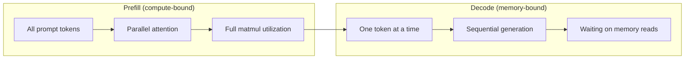
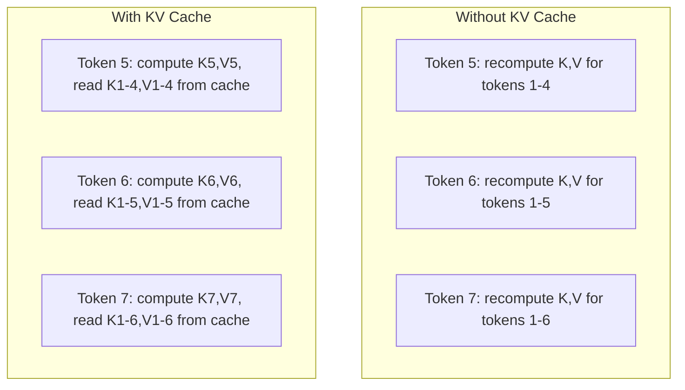
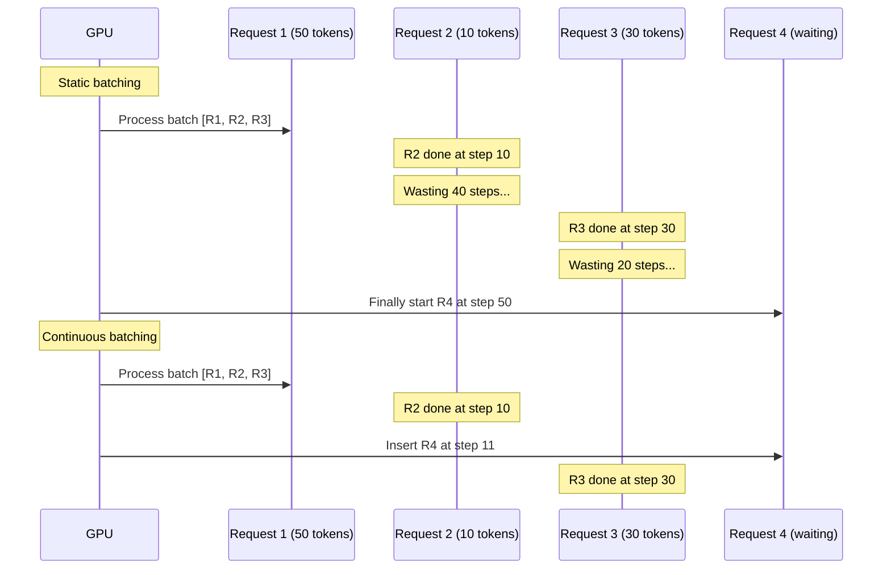
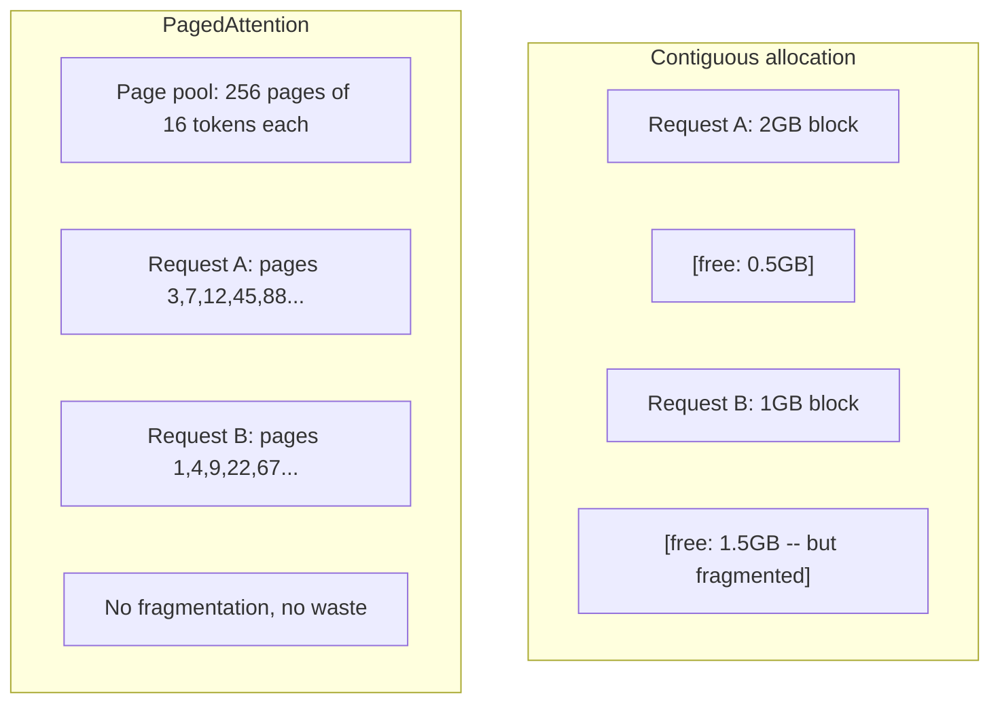
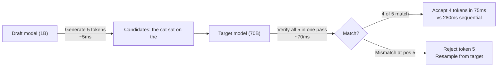

# Inference Optimization / 推理优化

> LLM 推理由两个阶段决定性能。Prefill 并行处理你的提示词，通常受计算限制；Decode 一次生成一个 token，通常受内存带宽限制。每一种优化，本质上都在针对其中一个阶段，或同时针对两个阶段。

**类型：** Build
**语言：** Python
**前置要求：** Phase 10，Lessons 01-08（Transformer 架构、attention）
**时间：** 约 120 分钟

## Learning Objectives / 学习目标

- 实现 KV-cache，消除自回归 token 生成过程中的重复计算
- 解释 LLM 推理中的 prefill 与 decode 阶段，以及为什么它们的瓶颈不同（compute-bound 与 memory-bound）
- 实现 continuous batching 和 PagedAttention 的核心概念，在并发请求下提升 GPU 利用率
- 对比 KV-cache、speculative decoding、flash attention 等推理优化技术，以及它们在吞吐与延迟之间的权衡

## The Problem / 问题

你把 Llama 3 70B 部署在 4xA100 GPU 上。单个用户大约能获得每秒 50 个 token，看起来很快。然后 100 个用户同时访问 endpoint。吞吐掉到每个用户每秒 3 个 token。你每月 25,000 美元的 GPU 账单，却在提供比人类打字还慢的响应。

从 1 个用户到 100 个用户，模型本身没有变化。同样的权重、同样的架构、同样的数学。变化的是你如何调度这些工作。朴素推理会浪费 90% 以上的可用 GPU 计算能力。一个等待第 47 个 token 的用户占着整个 batch slot，而 GPU 内存总线在矩阵乘法之间空等。与此同时，另一个新用户的 2,000-token prompt 本来可以把这些空档填满，变成有用的计算。

这不是规模问题，而是调度问题。本课中的技术，KV caching、continuous batching、PagedAttention、speculative decoding、prefix caching，正是同样流量下每月 25k 美元推理账单和每月 5k 美元账单之间的差别。

在 4xA100-80GB 上用 vLLM serving Llama 3 70B，低并发时能达到约 50 tokens/second/user；通过 continuous batching 和 PagedAttention，在 100 个并发请求下仍能维持每个用户 15-25 TPS。没有这些优化，同样硬件在该并发下只能提供约 5 TPS/user。同样的 GPU、同样的模型，吞吐差了 4 倍。

## The Concept / 概念

### Prefill vs Decode / Prefill 与 Decode

每个 LLM 推理请求都有两个不同阶段。

**Prefill** 处理完整输入 prompt。所有 token 都已知，因此 attention 可以在完整序列上并行计算。这是一次大型矩阵乘法，GPU core 能保持忙碌。瓶颈是计算：硬件每秒能提供多少 FLOPS。A100 可达到 312 TFLOPS（BF16）。在单张 A100 上，70B 模型对 4,096-token prompt 做 prefill 大约需要 400ms。

**Decode** 一次生成一个输出 token。每个新 token 都会 attend 到所有历史 token，但每次 forward pass 只产出一个 token。权重矩阵大小和 prefill 时相同，但你是在用一个向量而不是一个矩阵与它相乘。GPU core 在微秒级完成计算，然后等待下一批权重从内存送达。瓶颈是内存带宽：你能以多快速度把模型权重从 HBM 流式送到计算单元。A100 有 2 TB/s 带宽。FP16 的 70B 模型约 140 GB。完整读一遍模型需要 70ms，这就是单步 decode 的下限。



**ops:byte ratio**（也叫 arithmetic intensity）刻画了这个权衡。它衡量的是每从内存加载 1 byte 数据，你执行了多少次运算。

```
ops:byte ratio = FLOPs per token / bytes read from memory
```

在 batch 为 4,096 个 token 的 prefill 中，每加载一次权重，你大约会执行 4,096 次 multiply-accumulate。这个 ratio 很高，所以受计算限制。decode 且 batch size 为 1 时，每加载一次权重，你大约只执行 1 次运算。这个 ratio 很低，所以受内存限制。

核心洞察是：*decode 受内存限制，因为你为了生成一个 token 要读取整个模型*。下面所有优化，要么减少读取内容，要么增加每次读取后处理的 token batch，要么干脆避免读取。

### KV Cache / KV 缓存

在 attention 中，每个 token 的 query 会 attend 到所有前序 token 的 key 和 value 向量。没有缓存时，生成第 N 个 token 需要重新计算前 N-1 个 token 的 key 和 value projection。生成 token 2 时会投影 token 1，生成 token 3 时又投影 token 1，生成 token 4 时再投影 token 1。到 token 1,000 时，token 1 已经被投影了 999 次。

KV cache 存储所有历史 token 的 key 与 value projection。生成第 N 个 token 时，你只计算 token N 的 key 和 value，然后把它们与 token 1 到 N-1 的缓存 K/V 拼接起来。



**KV cache 的内存公式：**

```
KV cache size = 2 * num_layers * num_kv_heads * head_dim * seq_len * bytes_per_param
```

以 Llama 3 70B 为例（80 层、8 个使用 GQA 的 KV heads、head_dim=128、BF16）：

```
per token: 2 * 80 * 8 * 128 * 2 bytes = 327,680 bytes = 320 KB
at 4,096 tokens: 320 KB * 4,096 = 1.28 GB
at 128K tokens: 320 KB * 131,072 = 40 GB
```

Llama 3 70B 的一个 128K-context 对话，仅 KV cache 就会消耗 40 GB，也就是半张 A100 的显存。100 个并发用户、每人 4K tokens 时，光 KV cache 就需要 128 GB。这就是为什么 KV cache 管理是推理优化的核心挑战。

### Continuous Batching / 连续批处理

Static batching 会等待 N 个请求组成一个 batch，把它们一起处理，并等到*全部*完成后才接收新请求。如果一个请求需要 500 个 token，另一个只需要 10 个，短请求完成后还要空等 490 个 decode step。

Continuous batching（也叫 iteration-level batching）会在任意请求完成时立刻把新请求插入 batch。batch 会在每个 decode step 重新评估。一个 10 个 token 后完成的请求，会立即被等待队列中的新请求替换。



吞吐提升取决于输出长度的差异有多大。长度完全一致时，continuous batching 与 static batching 相当。长度变化明显时（真实场景通常如此），continuous batching 能带来 2-5 倍更高吞吐，因为 GPU slot 不会空着。

### PagedAttention / 分页 Attention

每个请求的 KV cache 通常是一块连续内存。请求不断到达和离开时，内存会碎片化，这和操作系统里的 RAM 碎片化完全一样。一个 4K-token 请求需要 1.28 GB 连续内存。即便总空闲显存有 2 GB，你也可能找不到 1.28 GB *连续*空间。结果要么浪费内存，要么拒绝请求。

PagedAttention（来自 vLLM）把操作系统式的虚拟内存思想应用到 KV cache。它不为每个请求分配一个连续大块，而是分配固定大小的 "pages"（通常每页 16 个 token）。page 可以位于物理 GPU 内存中的任意位置。page table 将每个请求的逻辑序列位置映射到物理 page 位置。



PagedAttention 还让共享前缀可以使用 **copy-on-write**。如果 50 个请求共享同一个 system prompt，那么该 system prompt 的 KV cache pages 只存一份，由 50 个请求共同引用。只有当某个请求分叉（不同用户消息）时，它才获得自己的 page。对于大量共享 system prompt 的应用，这会显著降低内存使用。

vLLM 报告称，通过 PagedAttention，内存浪费接近为零（约 4%，而朴素分配常见为 60-80%）。

### Speculative Decoding / 推测解码

Decode 慢，是因为它是顺序的：生成一个 token，把它喂回去，再生成下一个 token。但如果你能廉价地猜出接下来 5 个 token，然后一次性验证它们呢？

Speculative decoding 使用一个小而快的 **draft model** 生成 K 个候选 token。大的 **target model** 随后在一次 forward pass 中处理这 K 个候选（这看起来像 prefill：并行、compute-bound、高效）。如果 target model 同意 draft model 的预测，就用一次 target forward pass 的时间接受全部 K 个 token。如果它在位置 j 不同意，则接受 token 1 到 j-1，并丢弃剩余候选。



加速比取决于 **acceptance rate**：draft model 的预测有多常与 target 匹配。用 Llama 3 8B 为 Llama 3 70B 起草时，自然语言上的 acceptance rate 通常为 70-85%。这会转化成 2-3 倍 decode 加速。

三种 speculative decoding 方法：

| Method | Draft source | Acceptance rate | Overhead |
|--------|-------------|-----------------|----------|
| Draft-target (Leviathan et al.) | Separate small model | 70-85% | Draft model memory |
| EAGLE (Li et al.) | Lightweight head on target | 75-90% | ~1% extra parameters |
| N-gram lookup | Token n-gram table | 40-60% | Negligible |

**EAGLE** 在 target model 的 hidden states 之上训练一个小型 autoregressive head。它使用 target model 倒数第二层的特征预测下一个 token 的 embedding。因为它工作在 target model 自己的表示上（而不是另一个独立模型的表示上），所以能以极少额外内存获得更高 acceptance rate。EAGLE-2 增加了动态 draft tree，可根据上下文调整候选数量。

**N-gram speculative decoding** 维护一张来自当前上下文或预构建语料的 n-gram continuation 表。如果 draft 与同一对话中之前出现过的内容匹配（重复模式、代码、结构化输出），它几乎不需要神经网络开销就能触发。平均 acceptance rate 更低，但每次推测的成本基本为零。

Speculative decoding 在*数学上是精确的*，输出分布与 target model 的分布完全一致。它不是近似。验证步骤保证每个被接受的 token 都拥有 target model 本来会赋予它的精确概率。

### Prefix Caching / 前缀缓存

很多请求共享同一个 prefix。聊天机器人的 system prompt、RAG context block、few-shot 示例集合都是典型例子。没有 prefix caching 时，每个请求都要从头为这些共享 token 重新计算 KV cache。

Prefix caching 会存储常见 prefix 的 KV cache，并在请求之间复用。新请求带着已知 prefix 到达时，系统会复制（或引用）缓存的 KV entries，只为独有后缀计算 KV。

一个所有请求共享的 2,000-token system prompt，通过 prefix caching 可以为每个请求消除约 400ms prefill。若吞吐为 100 requests/second，这相当于每秒节省 40 秒 GPU compute，超过一张 GPU 的工作量。

SGLang 的 RadixAttention 用 radix tree（trie）实现 prefix caching，根据 token 内容索引 prefix。任何匹配已存 prefix 的请求，都能免费获得其 KV cache。这个树还支持部分 prefix 匹配：如果你与某个缓存条目共享 2,000 个 prefix token 中的 1,500 个，就复用这 1,500 个，只重新计算剩下的 500 个。

### Inference Engines / 推理引擎

三个引擎主导了生产级 LLM serving：

| Engine | Key innovation | Best for |
|--------|---------------|----------|
| vLLM | PagedAttention, continuous batching | General-purpose serving, highest compatibility |
| SGLang | RadixAttention (prefix caching), structured generation | Multi-turn chatbots, constrained decoding |
| TensorRT-LLM | NVIDIA kernel fusion, FP8 quantization | Maximum single-GPU throughput on NVIDIA hardware |

**vLLM** 是默认起点。它支持最广泛的模型，可以运行在任何 GPU vendor（NVIDIA、AMD、Intel）上，并通过 PagedAttention + continuous batching 获得强吞吐。OpenAI-compatible API 意味着你可以把它直接作为任何 OpenAI API 调用的替代品。

**SGLang** 构建在与 vLLM 相同的基础之上，但增加了用于 prefix caching 的 RadixAttention，以及面向结构化 LLM programs 的领域特定语言。如果你的 workload 涉及多轮对话、tool use 或 constrained decoding（JSON 输出、regex-guided generation），SGLang 常常能通过 prefix reuse 比 vLLM 快 2-5 倍。

**TensorRT-LLM** 会把模型编译成优化过的 NVIDIA GPU kernels。它融合操作（attention + linear + activation 放进一个 kernel），在 H100 GPU 上使用 FP8，并与 NVIDIA Triton Inference Server 集成用于生产部署。它在 NVIDIA 硬件上能达到最高单 GPU 吞吐，但配置成本更高，也只适用于 NVIDIA GPU。

Llama 3 70B 的真实世界数字（4xA100-80GB，BF16）：

| Metric | vLLM | SGLang | TensorRT-LLM |
|--------|------|--------|---------------|
| Throughput (1 user) | ~50 TPS | ~55 TPS | ~65 TPS |
| Throughput (100 users) | ~2,500 total TPS | ~3,200 total TPS | ~3,000 total TPS |
| Time to first token | ~400ms | ~300ms (prefix hit) | ~350ms |
| Max context | 128K | 128K | 128K |

### The Ops:Byte Framework / Ops:Byte 框架

你无法优化没有测量过的东西。ops:byte ratio 会告诉你 workload 是 compute-bound 还是 memory-bound，从而决定哪些优化真正有效。

```
Compute roof: peak FLOPS of the GPU
Memory roof:  peak bandwidth * ops:byte ratio
```

当 ops:byte 很低时（decode、小 batch），你会撞到 memory bandwidth roof。增加更多计算能力（更高频率、更多 core）没有帮助。你需要减少内存读取（quantization、KV cache compression），或增大 batch size，把一次读取摊到更多有用工作上。

当 ops:byte 很高时（prefill、大 batch），你会撞到 compute roof。优化内存带宽没有帮助。你需要更快的 GPU、kernel fusion，或 reduced precision 来压榨更多 FLOPS。

| Scenario | ops:byte | Bound | Optimize with |
|----------|----------|-------|---------------|
| Prefill, batch=1 | ~4,096 | Compute | Kernel fusion, FP8 |
| Decode, batch=1 | ~1 | Memory | Quantization, KV compression |
| Decode, batch=32 | ~32 | Memory | Larger batch, continuous batching |
| Decode, batch=256 | ~256 | Transitioning | Both matter |
| Decode, batch=1024 | ~1,024 | Compute | Kernel fusion, tensor parallelism |

A100 上的 crossover point 大约是 ops:byte = 156（312 TFLOPS / 2 TB/s）。低于 156 时，你受内存限制。高于 156 时，你受计算限制。Continuous batching 通过在每轮塞入更多 token，把 decode 推向这个 crossover。

```figure
context-window-slide
```

## Build It / 动手构建

### Step 1: KV Cache from Scratch / 步骤 1：从零构建 KV Cache

我们构建一个 multi-head KV cache，按 layer、head 存储 key 和 value projection，并展示它的内存增长模式。

```python
import numpy as np

class KVCache:
    def __init__(self, num_layers, num_heads, head_dim, max_seq_len, dtype=np.float16):
        self.num_layers = num_layers
        self.num_heads = num_heads
        self.head_dim = head_dim
        self.max_seq_len = max_seq_len
        self.dtype = dtype

        self.k_cache = np.zeros(
            (num_layers, num_heads, max_seq_len, head_dim), dtype=dtype
        )
        self.v_cache = np.zeros(
            (num_layers, num_heads, max_seq_len, head_dim), dtype=dtype
        )
        self.seq_len = 0

    def update(self, layer_idx, new_keys, new_values):
        num_new = new_keys.shape[1]
        end = self.seq_len + num_new
        self.k_cache[layer_idx, :, self.seq_len:end, :] = new_keys
        self.v_cache[layer_idx, :, self.seq_len:end, :] = new_values
        return (
            self.k_cache[layer_idx, :, :end, :],
            self.v_cache[layer_idx, :, :end, :]
        )

    def advance(self, num_tokens):
        self.seq_len += num_tokens

    def memory_bytes(self):
        return self.k_cache.nbytes + self.v_cache.nbytes

    def used_bytes(self):
        per_token = 2 * self.num_layers * self.num_heads * self.head_dim * np.dtype(self.dtype).itemsize
        return per_token * self.seq_len
```

### Step 2: Attention with KV Cache / 步骤 2：带 KV Cache 的 Attention

下面是一个简化版 multi-head attention，在 decode step 中使用 KV cache。

```python
def scaled_dot_product_attention(query, keys, values):
    head_dim = query.shape[-1]
    scores = np.matmul(query, keys.transpose(0, 1, 3, 2)) / np.sqrt(head_dim)
    seq_len_q = scores.shape[-2]
    seq_len_k = scores.shape[-1]
    if seq_len_q > 1:
        mask = np.triu(np.ones((seq_len_q, seq_len_k), dtype=np.float32), k=seq_len_k - seq_len_q + 1)
        scores = scores + mask * (-1e9)
    max_scores = np.max(scores, axis=-1, keepdims=True)
    exp_scores = np.exp(scores - max_scores)
    attn_weights = exp_scores / np.sum(exp_scores, axis=-1, keepdims=True)
    return np.matmul(attn_weights, values)


class MultiHeadAttention:
    def __init__(self, d_model, num_heads):
        self.num_heads = num_heads
        self.head_dim = d_model // num_heads
        scale = np.sqrt(2.0 / d_model)
        self.W_q = np.random.randn(d_model, d_model).astype(np.float32) * scale
        self.W_k = np.random.randn(d_model, d_model).astype(np.float32) * scale
        self.W_v = np.random.randn(d_model, d_model).astype(np.float32) * scale
        self.W_o = np.random.randn(d_model, d_model).astype(np.float32) * scale

    def forward(self, x, kv_cache=None, layer_idx=0):
        batch, seq_len, d_model = x.shape
        Q = np.matmul(x, self.W_q).reshape(batch, seq_len, self.num_heads, self.head_dim).transpose(0, 2, 1, 3)
        K = np.matmul(x, self.W_k).reshape(batch, seq_len, self.num_heads, self.head_dim).transpose(0, 2, 1, 3)
        V = np.matmul(x, self.W_v).reshape(batch, seq_len, self.num_heads, self.head_dim).transpose(0, 2, 1, 3)

        if kv_cache is not None:
            K_full, V_full = kv_cache.update(layer_idx, K[0], V[0])
            K = K_full[np.newaxis, :, :, :]
            V = V_full[np.newaxis, :, :, :]
            if seq_len == 1:
                kv_cache.advance(1)

        attn_out = scaled_dot_product_attention(Q, K, V)
        attn_out = attn_out.transpose(0, 2, 1, 3).reshape(batch, -1, d_model)
        return np.matmul(attn_out, self.W_o)
```

### Step 3: Continuous Batching Simulator / 步骤 3：Continuous Batching 模拟器

这个模拟器展示 static batching 与 continuous batching 的调度差异。

```python
import heapq

class Request:
    def __init__(self, request_id, prompt_tokens, output_tokens, arrival_step):
        self.request_id = request_id
        self.prompt_tokens = prompt_tokens
        self.output_tokens = output_tokens
        self.arrival_step = arrival_step
        self.tokens_generated = 0
        self.start_step = None
        self.end_step = None

    def is_done(self):
        return self.tokens_generated >= self.output_tokens


def simulate_static_batching(requests, batch_size):
    step = 0
    completed = []
    queue = list(requests)
    queue.sort(key=lambda r: r.arrival_step)

    while queue:
        batch = []
        while queue and len(batch) < batch_size:
            r = queue.pop(0)
            r.start_step = max(step, r.arrival_step)
            batch.append(r)

        if batch:
            step = max(step, max(r.start_step for r in batch))
            max_output = max(r.output_tokens for r in batch)
            for r in batch:
                r.tokens_generated = r.output_tokens
                r.end_step = step + max_output
            step += max_output
            completed.extend(batch)

    return completed


def simulate_continuous_batching(requests, batch_size):
    step = 0
    completed = []
    queue = sorted(requests, key=lambda r: r.arrival_step)
    queue_idx = 0
    active = []
    waiting = []

    while queue_idx < len(queue) or active or waiting:
        while queue_idx < len(queue) and queue[queue_idx].arrival_step <= step:
            waiting.append(queue[queue_idx])
            queue_idx += 1

        while waiting and len(active) < batch_size:
            r = waiting.pop(0)
            r.start_step = step
            active.append(r)

        if not active:
            if waiting:
                step += 1
                continue
            elif queue_idx < len(queue):
                step = queue[queue_idx].arrival_step
                continue
            else:
                break

        for r in active:
            r.tokens_generated += 1

        done = [r for r in active if r.is_done()]
        for r in done:
            r.end_step = step + 1
            completed.append(r)
        active = [r for r in active if not r.is_done()]

        step += 1

    return completed


def batching_stats(completed):
    latencies = [r.end_step - r.arrival_step for r in completed]
    total_time = max(r.end_step for r in completed) - min(r.arrival_step for r in completed)
    total_tokens = sum(r.output_tokens for r in completed)
    return {
        "avg_latency": np.mean(latencies),
        "p50_latency": np.median(latencies),
        "p99_latency": np.percentile(latencies, 99),
        "total_time": total_time,
        "throughput": total_tokens / total_time if total_time > 0 else 0,
    }
```

### Step 4: Prefix Cache / 步骤 4：Prefix Cache

下面是一个基于 trie 的 prefix cache，用于为共享 prefix 存储 KV entries。

```python
class TrieNode:
    def __init__(self):
        self.children = {}
        self.kv_data = None
        self.hit_count = 0


class PrefixCache:
    def __init__(self, max_entries=1000):
        self.root = TrieNode()
        self.max_entries = max_entries
        self.total_entries = 0
        self.hits = 0
        self.misses = 0

    def _walk(self, token_ids):
        node = self.root
        depth = 0
        for tid in token_ids:
            if tid not in node.children:
                break
            node = node.children[tid]
            depth += 1
        return node, depth

    def lookup(self, token_ids):
        node, depth = self._walk(token_ids)
        if depth > 0:
            self.hits += 1
            current = self.root
            for tid in token_ids[:depth]:
                current = current.children[tid]
                current.hit_count += 1
            kv_entries = []
            current = self.root
            for tid in token_ids[:depth]:
                current = current.children[tid]
                if current.kv_data is not None:
                    kv_entries.append(current.kv_data)
            return depth, kv_entries
        self.misses += 1
        return 0, []

    def insert(self, token_ids, kv_per_token):
        node = self.root
        for i, tid in enumerate(token_ids):
            if tid not in node.children:
                if self.total_entries >= self.max_entries:
                    return i
                node.children[tid] = TrieNode()
                self.total_entries += 1
            node = node.children[tid]
            if i < len(kv_per_token):
                node.kv_data = kv_per_token[i]
        return len(token_ids)

    def hit_rate(self):
        total = self.hits + self.misses
        return self.hits / total if total > 0 else 0.0
```

### Step 5: Speculative Decoding Simulator / 步骤 5：Speculative Decoding 模拟器

我们用可配置的 acceptance rate 来模拟 draft-target speculative decoding。

```python
class DraftModel:
    def __init__(self, vocab_size, acceptance_rate=0.8):
        self.vocab_size = vocab_size
        self.acceptance_rate = acceptance_rate

    def generate(self, context, num_tokens):
        tokens = np.random.randint(0, self.vocab_size, size=num_tokens)
        return tokens

    def get_probs(self, context, token):
        probs = np.random.dirichlet(np.ones(self.vocab_size))
        return probs


class TargetModel:
    def __init__(self, vocab_size):
        self.vocab_size = vocab_size

    def get_probs(self, context, tokens=None):
        if tokens is not None:
            return [np.random.dirichlet(np.ones(self.vocab_size)) for _ in tokens]
        return np.random.dirichlet(np.ones(self.vocab_size))


def speculative_decode(draft_model, target_model, context, num_speculative=5,
                       draft_cost=1.0, target_cost=10.0, verify_cost=12.0):
    total_tokens = 0
    total_cost = 0.0
    accepted_counts = []
    context = list(context)

    max_tokens = 100

    while total_tokens < max_tokens:
        draft_tokens = draft_model.generate(context, num_speculative)
        total_cost += draft_cost * num_speculative

        target_probs = target_model.get_probs(context, draft_tokens)
        total_cost += verify_cost

        accepted = 0
        for i, token in enumerate(draft_tokens):
            draft_p = draft_model.get_probs(context + list(draft_tokens[:i]), token)
            target_p = target_probs[i]

            r = np.random.random()
            acceptance_prob = min(1.0, target_p[token] / (draft_p[token] + 1e-10))

            if r < draft_model.acceptance_rate:
                accepted += 1
                context.append(token)
                total_tokens += 1
            else:
                new_token = np.random.choice(draft_model.vocab_size, p=target_p)
                context.append(new_token)
                total_tokens += 1
                break

        accepted_counts.append(accepted)

        if accepted == num_speculative:
            bonus_probs = target_model.get_probs(context)
            bonus_token = np.random.choice(draft_model.vocab_size, p=bonus_probs)
            context.append(bonus_token)
            total_tokens += 1

    sequential_cost = total_tokens * target_cost
    return {
        "total_tokens": total_tokens,
        "speculative_cost": total_cost,
        "sequential_cost": sequential_cost,
        "speedup": sequential_cost / total_cost if total_cost > 0 else 1.0,
        "avg_accepted": np.mean(accepted_counts),
        "acceptance_rate": np.mean(accepted_counts) / num_speculative,
    }


def compare_speculation_strategies(vocab_size=1000, num_trials=20):
    results = {}

    for name, acceptance_rate, spec_tokens in [
        ("Draft-target (8B->70B)", 0.78, 5),
        ("EAGLE", 0.85, 6),
        ("N-gram", 0.50, 4),
        ("No speculation", 0.0, 0),
    ]:
        if spec_tokens == 0:
            results[name] = {
                "speedup": 1.0,
                "acceptance_rate": 0.0,
                "avg_accepted": 0.0,
            }
            continue

        trial_results = []
        for _ in range(num_trials):
            draft = DraftModel(vocab_size, acceptance_rate=acceptance_rate)
            target = TargetModel(vocab_size)
            context = list(np.random.randint(0, vocab_size, size=10))
            result = speculative_decode(draft, target, context, num_speculative=spec_tokens)
            trial_results.append(result)

        results[name] = {
            "speedup": np.mean([r["speedup"] for r in trial_results]),
            "acceptance_rate": np.mean([r["acceptance_rate"] for r in trial_results]),
            "avg_accepted": np.mean([r["avg_accepted"] for r in trial_results]),
        }

    return results
```

### Step 6: KV Cache Memory Profiler / 步骤 6：KV Cache 内存分析器

为真实模型配置计算 KV cache 的内存需求。

```python
MODEL_CONFIGS = {
    "Llama-3-8B": {
        "num_layers": 32, "num_kv_heads": 8, "head_dim": 128,
        "model_params_b": 8, "gqa": True,
    },
    "Llama-3-70B": {
        "num_layers": 80, "num_kv_heads": 8, "head_dim": 128,
        "model_params_b": 70, "gqa": True,
    },
    "Llama-3-405B": {
        "num_layers": 126, "num_kv_heads": 8, "head_dim": 128,
        "model_params_b": 405, "gqa": True,
    },
    "Mistral-7B": {
        "num_layers": 32, "num_kv_heads": 8, "head_dim": 128,
        "model_params_b": 7, "gqa": True,
    },
    "GPT-4-est": {
        "num_layers": 120, "num_kv_heads": 96, "head_dim": 128,
        "model_params_b": 1800, "gqa": False,
    },
}


def kv_cache_memory(config, seq_len, dtype_bytes=2):
    per_token = 2 * config["num_layers"] * config["num_kv_heads"] * config["head_dim"] * dtype_bytes
    total = per_token * seq_len
    return {
        "per_token_bytes": per_token,
        "per_token_kb": per_token / 1024,
        "total_bytes": total,
        "total_mb": total / (1024 ** 2),
        "total_gb": total / (1024 ** 3),
    }


def memory_budget(config, gpu_memory_gb, model_dtype_bytes=2, kv_dtype_bytes=2):
    model_memory_gb = config["model_params_b"] * 1e9 * model_dtype_bytes / (1024 ** 3)
    overhead_gb = gpu_memory_gb * 0.1
    available_for_kv = gpu_memory_gb - model_memory_gb - overhead_gb

    if available_for_kv <= 0:
        return {"error": "Model does not fit in GPU memory", "model_memory_gb": model_memory_gb}

    per_token = 2 * config["num_layers"] * config["num_kv_heads"] * config["head_dim"] * kv_dtype_bytes
    max_tokens = int(available_for_kv * (1024 ** 3) / per_token)

    return {
        "gpu_memory_gb": gpu_memory_gb,
        "model_memory_gb": round(model_memory_gb, 1),
        "overhead_gb": round(overhead_gb, 1),
        "available_for_kv_gb": round(available_for_kv, 1),
        "max_total_tokens": max_tokens,
        "max_users_at_2k": max_tokens // 2048,
        "max_users_at_4k": max_tokens // 4096,
        "max_users_at_32k": max_tokens // 32768,
    }
```

## Use It / 使用它

使用 vLLM：

```python
from vllm import LLM, SamplingParams

llm = LLM(
    model="meta-llama/Llama-3-70B-Instruct",
    tensor_parallel_size=4,
    enable_prefix_caching=True,
    max_model_len=8192,
    gpu_memory_utilization=0.9,
)

params = SamplingParams(temperature=0.7, max_tokens=256)
outputs = llm.generate(["Explain inference optimization in one paragraph."], params)
```

使用 SGLang 做 prefix caching + structured output：

```python
import sglang as sgl

@sgl.function
def classify(s, text):
    s += sgl.system("You are a classifier. Output JSON only.")
    s += sgl.user(f"Classify this text: {text}")
    s += sgl.assistant(sgl.gen("result", regex=r'\{"label": "(positive|negative|neutral)"\}'))

runtime = sgl.Runtime(model_path="meta-llama/Llama-3-70B-Instruct", tp_size=4)
sgl.set_default_backend(runtime)

results = classify.run_batch([
    {"text": "This product is amazing!"},
    {"text": "Terrible experience."},
    {"text": "It was okay I guess."},
])
```

使用 TensorRT-LLM：

```python
import tensorrt_llm
from tensorrt_llm.runtime import ModelRunner

runner = ModelRunner.from_dir("./llama-70b-trt-engine/", rank=0)

outputs = runner.generate(
    batch_input_ids=[tokenizer.encode("Explain KV caching.")],
    max_new_tokens=256,
    temperature=0.7,
)
```

## Ship It / 交付

本课会产出：
- `outputs/skill-inference-optimization.md`：一个用于诊断和优化 LLM inference serving 的 skill

## Exercises / 练习

1. 修改 KV cache profiler，对比 FP16、FP8 和 INT4 KV cache quantization。对 Llama 3 70B、4K context，计算它们在 4xA100-80GB 上各自支持的最大并发用户数。把 KV quantization 降到 INT4 时，用户容量应该大约提升 4 倍。

2. 扩展 continuous batching simulator，跟踪 GPU utilization（每个 step 中被填满的 batch slot 比例）。对 static 与 continuous batching 画出利用率随时间变化曲线，使用 50 个请求，并让它们的输出长度服从 Pareto distribution（shape=1.5, scale=20）。Continuous batching 应该保持 >80% utilization。

3. 实现一个 grouped-query attention（GQA）版本的 KV cache，其中 `num_kv_heads < num_query_heads`。Llama 3 70B 使用 64 个 query heads，但只有 8 个 KV heads。计算它相对完整 multi-head attention 的内存节省（KV cache size 降低 8 倍）。

4. 构建一个使用 LRU eviction 的 prefix cache。把 max_entries 设为 500，并生成 1,000 个请求，其中 60% 共享 5 个常见 prefix 之一。测量 hit rate，并与无限 cache 对比。若 eviction 做得好，hit rate 应该保持在 55% 以上。

5. 扩展 speculative decoding simulator，实现 tree-based speculation（EAGLE-2 风格）。不要生成一条 K 个 draft token 的单链，而是生成候选树（例如每层 2 个分支、3 层 = 8 个 leaf candidates）。比较每轮 verification 接受的总 token 数与 linear speculation 的差异。

## Key Terms / 关键术语

| 术语 | 常见说法 | 实际含义 |
|------|----------------|----------------------|
| Prefill | “处理 prompt” | 在所有输入 token 上并行计算 attention。完整矩阵乘法能让 GPU core 保持忙碌，因此受计算限制 |
| Decode | “生成 token” | 每次 forward pass 生成一个 token，每次都读取完整模型权重。计算会先完成，然后等待下一批权重到达，因此受内存限制 |
| KV cache | “缓存 attention states” | 存储所有历史 token 的 key/value projection，避免每个 decode step 重算；用内存换计算 |
| Continuous batching | “动态 batching” | 任意请求完成后立即把新请求插入正在运行的 batch；按每个 decode iteration 评估，而不是等待整个 batch 完成 |
| PagedAttention | “KV cache 的虚拟内存” | 用固定大小 pages 而不是连续块分配 KV cache，消除内存碎片，并为共享 prefix 启用 copy-on-write |
| Speculative decoding | “Draft and verify” | 用快速 draft model 提议多个 token，然后在一次 target model forward pass 中全部验证；数学上精确，可带来 2-3 倍加速 |
| EAGLE | “Self-speculative decoding” | 一种 speculative decoding 变体，在 target model 自己的 hidden states 上训练 lightweight head，相比分离 draft model 通常有更高 acceptance rate |
| Prefix caching | “复用 system prompt KV” | 存储常见 prefix（system prompts、few-shot examples）的 KV cache entries，并跨请求复用，以跳过冗余 prefill |
| Ops:byte ratio | “Arithmetic intensity” | 计算操作数与读取内存字节数的比值；决定 workload 是 compute-bound（高 ratio）还是 memory-bound（低 ratio） |
| Time to first token | “TTFT” | 从收到请求到产出第一个输出 token 的延迟；长 prompt 时主要由 prefill 时间决定 |

## Further Reading / 延伸阅读

- Kwon et al., "Efficient Memory Management for Large Language Model Serving with PagedAttention" (2023)：提出分页式 KV cache 管理的 vLLM 论文，已成为 inference serving 的行业标准
- Leviathan et al., "Fast Inference from Transformers via Speculative Decoding" (2023)：奠基论文，证明 draft-verify speculation 能产生精确 target model 分布，同时实现 2-3 倍加速
- Li et al., "EAGLE: Speculative Sampling Requires Rethinking Feature Uncertainty" (2024)：通过在 target model 自身 features 上训练 head，而不是使用独立 draft model，获得更高 acceptance rate
- Zheng et al., "SGLang: Efficient Execution of Structured Language Model Programs" (2024)：提出用于 prefix caching 的 RadixAttention，以及面向多次 LLM 调用程序的编程模型
- Williams et al., "Roofline: An Insightful Visual Performance Model for Multicore Architectures" (2009)：最早形式化 ops:byte 框架的 roofline 论文，用于推理 compute 与 memory 瓶颈
