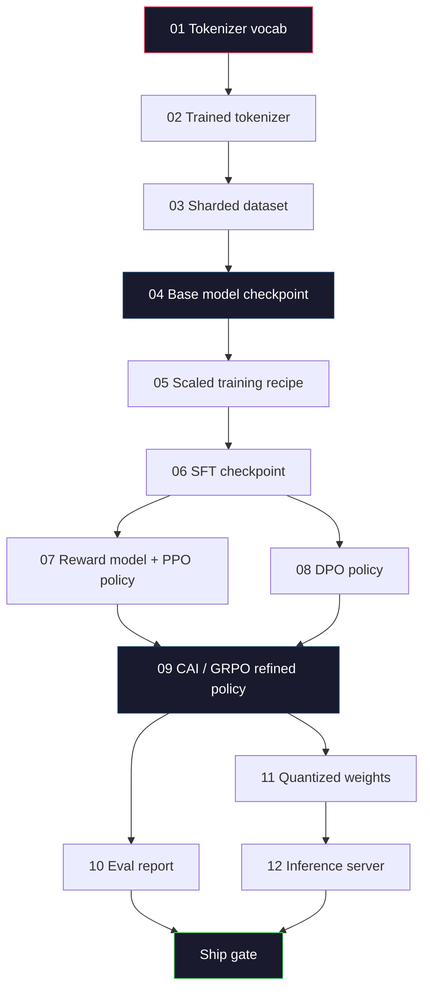
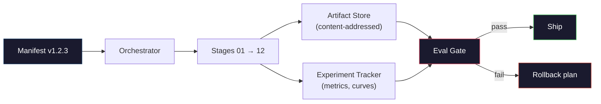

# Building a Complete LLM Pipeline / 构建完整 LLM Pipeline

> Lessons 01 到 12 的所有内容，都是同一条 pipeline 的一个阶段。本课提供脚手架，把这些阶段串成一次端到端运行：tokenize、pre-train、scale、SFT、align、evaluate、quantize、serve。你不会在笔记本电脑上训练 70B 模型。你会产出 orchestration layer、manifest、eval gate 和 rollback plan，而这些正是 2026 年 frontier team 用来决定什么可以 ship 的东西。这是本阶段的 capstone。

**类型：** Build
**语言：** Python (stdlib)
**前置要求：** Phase 10 Lessons 01-12 全部内容
**时间：** 约 120 分钟

## Learning Objectives / 学习目标

- 把前面十一课（tokenizer、data、pre-training、scaling、SFT、RLHF、DPO、CAI、eval、quantization、inference）组合成一个可复现的 pipeline spec
- 定义阶段之间的 artifact contract：每个阶段消费什么、产出什么、下一个阶段如何验证输入
- 构建 orchestrator，用于跟踪实验、对 artifact 做 hash，并根据 eval thresholds 决定是否可以 ship
- 设计 rollback plan：哪些 artifact 可以廉价重跑，哪些代价高昂，以及一个损坏 checkpoint 会带来什么成本

## The Problem / 问题

前面的课程每一课都能单独工作。Tokenizer 训练好了。Tiny GPT pre-trained 了。SFT dataset 组好了。Reward model 训练好了。DPO 跑完了。Evals 测完了。Quantized weights 导出了。Inference server 启动了。每一项都是一个 notebook。每一项都有自己的约定、自己的输出路径、自己的 seed。

frontier training run 不是 notebook。Llama 3 405B 大约用了 54 天、3,000 万 H100 hours。DeepSeek-V3 用了约 280 万 H800 hours。在这段时间里，一个损坏的 checkpoint、一次 data contamination、一个 eval regression，都可能让团队损失一周 wall-clock 和一个月 GPU 预算。团队靠 pipeline hygiene 活下来：每个阶段都有确定性输入、确定性输出、manifest、hash 和 gate。

这是 capstone。你不会在 laptop 上端到端运行整条 pipeline。你会编写协调各阶段的 orchestrator、描述 run 的 manifest、决定是否可 ship 的 verifier，以及让第三方可以从单个文件重放你工作的 replay plan。代码很小，纪律很大。

这个模式从 100M 到 1T 参数都不变。同样四个组件：manifest、orchestrator、eval gate、artifact store，既运行 Llama 3，也运行你的 hobby GPT。差别在于每个阶段 config 里的数字大小，而不是 pipeline 的形状。

## The Concept / 概念

### The Twelve Stages / 十二个阶段

每一节 Phase 10 课程都是一个阶段。完整依赖图如下。



阶段 07 和 08 可以并行。其他所有阶段都是硬依赖。stage 02（tokenizer）的变化会让所有下游 artifact 失效。stage 10（eval）的变化只会让 ship decision 失效。

### The Manifest / Manifest

manifest 是一个单文件，完整描述一次 run，足够让别人重放。pipeline 产出的任何东西，都不应该依赖 manifest 之外的状态。字段很无聊，但都是必需的。

```
pipeline_version: 1.2.3
seed: 42
git_commit: a1b2c3d4
stages:
  01_tokenizer:
    recipe: bpe_32k
    input_hash: sha256:...
    output_hash: sha256:...
    wall_clock_sec: 3600
    cost_usd: 12
```

stage N 的 output hash 就是 stage N+1 的 input hash。只要有任何偏差，pipeline 就停止。这是你早期发现数据损坏的方式，也是在另一个大洲的队友验证他们 replay 出来的 artifact 是否与你的一致的方式。

实践中，团队通常使用一个小型 YAML schema，加上一个 manifest checker，用它与上一次成功运行做 diff。任何超出预期字段（cost、wall clock）的 delta 都是红旗。

### Artifact Typing / Artifact 类型

每个阶段的输出都是 typed artifact。不是一个目录 blob，不是一个 pickle，而是一个带已知 schema 的命名类型。

| Stage | Artifact Type | Key Fields |
|-------|--------------|-----------|
| 01-02 | Tokenizer | vocab.json, merges.txt, config.json, hash |
| 03 | Dataset | shards[], row count, token count, dedup stats |
| 04-05 | Checkpoint | weights.safetensors, config.json, optimizer state, step count |
| 06 | SFT Model | checkpoint + SFT recipe + data mix |
| 07 | Reward Model | RM checkpoint + preference data hash |
| 08-09 | Policy | checkpoint + reference hash + beta + KL budget consumed |
| 10 | Eval Report | benchmark scores + regression diffs + eval data hash |
| 11 | Quantized Model | quantized weights + calibration data + accuracy delta vs FP16 |
| 12 | Server Spec | endpoint + model hash + config + observability hooks |

typing 可以避免最常见的失败模式：把 stage 08 的输出当成 stage 06 的输入，沿着 SFT 路径 ship 一个 DPO-trained model。typed artifacts 和 typed stage signatures 会把这类错误变成 compile-time failure，而不是第 5 天才爆出的故障。

### The Eval Gate / Eval Gate

Shipping 不是“训练结束”。Shipping 是“训练结束，并且 eval gate 通过”。gate 在 run 开始前就要定义好。

```
gates:
  mmlu:      >= baseline + 0.5   # no regression
  humaneval: >= baseline + 1.0
  truthfulqa: >= baseline         # no drop
  safety_refusal_rate: <= 0.05
  kl_from_reference: <= 25.0
  cost_total_usd: <= 50000
```

每个 gate 都是数值阈值。不要有 “looks good” gate。不要有主观 sign-off。如果所有 gate 通过，artifact 就标记为 shippable。如果任何 gate 失败，这次 run 会被 hold，直到某个具名 reviewer 明确 override，而 override 本身也会写入 manifest。

两个 gate 能抓住大多数灾难。*Regression* gate（新模型在核心 benchmark 上至少不比上一个差）抓训练 bug。*KL budget* gate（aligned policy 相对 reference 的漂移不能超过 X）抓 alignment overcooking。每条 production pipeline 都应该同时具备这两个。

### The Orchestrator / Orchestrator

Orchestrator 是一小段代码：读取 manifest、dispatch stages、跟踪 artifacts，并在任何 contract violation 上停止。它不是 Airflow，也不是 Kubeflow。为了 pipeline hygiene，你需要的是一段你自己写的、无聊可靠的东西。

orchestrator 的职责很窄：

1. 从 manifest 解析 DAG。
2. 对每个 stage，检查预期输出是否已经以正确 hash 存在（如果存在就跳过）。
3. 运行 stage，捕获 stdout/stderr，测量 wall clock 和 cost。
4. 用下游 stage 的 expected input hash 验证输出 hash。
5. 失败时，写出带精确失败 stage 的 partial manifest，并以非零退出。

这大约是 200 行 Python。它会像本课的 `code/main.py`。在底层，真实 pipeline 会用 `torchrun` 或 `ray` 在集群上执行各个阶段，但 orchestrator 本身运行在单机上。

### Experiment Tracking and Artifact Storage / 实验跟踪与 Artifact 存储

两个外部系统为 pipeline 定锚。

**Experiment tracker（wandb、neptune、mlflow）。** 按阶段记录 loss curves、eval metrics、system telemetry。当你三周后需要比较 run A 和 run B 时，tracker 是入口。团队几乎总是使用托管 tracker，因为自己写会浪费本该投入训练的时间。

**Artifact store（S3、R2、GCS）。** 用不可变 object store 存 checkpoints、datasets、tokenizers、eval reports。Artifacts 由 hash 而不是文件名寻址。像 `latest.pt` 这样的文件名是 foot-gun；`ckpt-7b-step-20000-sha256:abc123.safetensors` 才是 contract。

orchestrator 会同时写入二者。tracker 面向看图的人。artifact store 面向下一阶段查找输入。

### Costing / 成本核算

frontier run 总是带着明确的 dollar number。预算纪律发生在两个位置。

**Pre-run estimate。** 从 manifest 计算预期 FLOPs（pre-training：6 x params x tokens）、预期 GPU hours（FLOPs / peak throughput / utilization），以及按当前租赁价格得到的 dollar cost。如果估算超过 budget gate，pipeline 拒绝启动。

**In-run tracking。** stage-by-stage 的 wall clock 和 cost 会写入 manifest。每个阶段结束后检查剩余预算。如果某个阶段超支，下一个阶段的 gate 会用新的剩余预算评估。你不应该在 VC 打电话时才发现钱花完了。

Llama 3 披露成本为 6,100 万美元。DeepSeek-V3 披露主 pre-training run 成本为 560 万美元。这个比例主要来自硬件效率和 mixture-of-experts，但具体成本之所以可见，是因为两个团队都按 stage 跟踪成本，而不是只按整次 run 跟踪。

### Reproducibility vs Determinism / 可复现性与确定性

它们不是一回事。*Reproducible* 表示同一个 manifest、同一份代码、同一套基础设施，会产出下游指标等价的 checkpoint。*Deterministic* 表示 bit-identical output。

现代 LLM 训练通常可复现，但不确定。分布式训练中的 reduce-order、GPU kernel 非确定性（cuBLAS、flash-attn）、mixed precision rounding 会共同导致不同 run 的 float 在 1e-5 量级上不同。对最终指标来说这没问题，因为指标不会移动。若你想做 bit-level diff 调试，这就是灾难。解决方法是记录每个 stage 的 input hash、output hash 和 headline metrics；如果这些匹配，即便权重不是 bit-identical，这次 run 也算“reproduced”。



### Rollback Plan / 回滚计划

run 开始前，先写清楚每个 stage 失败时该怎么办。分三类。

- **Cheap to re-run**（小时级）：tokenizer、eval、quantization、inference server。直接重跑。
- **Medium**（天级）：SFT、DPO、CAI。保留 base model，只重跑 alignment stages。
- **Expensive**（周级、百万美元级）：pre-training。这里的 rollback plan 不是“重跑”，而是“使用最后一个 good checkpoint，并用修订后的数据重跑更便宜的下游阶段”。

由于 stage dependencies 都经过 typed 和 hash 约束，orchestrator 可以自动计算 rollback set：让失败阶段和所有 descendants 失效。stage 06（SFT）失败会让 06、07、08、09、10、11、12 失效。stage 11（quantization）失败只会让 11 和 12 失效。提前命名这件事，可以避免团队在凌晨 4 点疲惫时临场发挥。

### Production Recipes Observed in 2026 / 2026 年观察到的生产配方

大多数 frontier team 最终收敛到了同一套骨架。

- Tokenizer：128k BPE with byte fallback。用一个小而均衡的多语言 slice 训练。
- Pre-training：10-20T tokens，主要是 web、code 和 synthetic。Muon 或 AdamW optimizer。FSDP2 或 DeepSpeed ZeRO-3。Gradient checkpointing。BF16 weights，FP32 master。
- SFT：500k-2M instruction pairs，混合 human 与 synthetic，并严格对 eval set 去重。
- Alignment：DPO 或 CAI + GRPO。只有当 preference signal 对 DPO 来说过于多维时才使用 RLHF。
- Eval：MMLU-Pro、MATH、HumanEval+、GPQA、SWE-Bench Verified、LiveBench，加上一份公众看不到的 private held-out set。
- Quantization：serving 使用 4-bit GPTQ 或 AWQ；当 accuracy delta 重要时，safety evals 使用 8-bit。
- Serving：vLLM、TensorRT-LLM 或 in-house。Continuous batching。Speculative decoding。KV cache eviction。

数字每六个月变一次，骨架不会。

```figure
beam-search
```

## Build It / 动手构建

本课代码是 orchestrator 和 manifest checker，而不是十二个训练脚本。每个 stage 都用 placeholder 模拟，产出形状和 hash 正确的 output artifact。端到端运行 orchestrator，是为了在烧 GPU 钱之前先证明 pipeline plumbing 没问题。

完整实现见 `code/main.py`。关键组件包括：

- `Manifest` dataclass：pipeline version、seed、git commit、stages、gates。
- `Stage` dataclass：name、type、inputs（hashes）、output（hash）、wall clock、cost。
- `Orchestrator.run()`：解析 DAG、dispatch stages、验证 hashes、更新 manifest。
- `EvalGate.check()`：读取 thresholds，对比最新 eval report，返回 pass/fail。
- `ArtifactStore`（in-memory stub）：按 hash put/get，模拟 S3。
- `CostTracker`：按 stage 与累计成本跟踪，超过上限则停止。

`main.py` 中的 pipeline 会运行十二个 placeholder stages，产出一个 manifest，并触发一个失败的 eval gate，以展示被 hold 的 run 长什么样。把每个 placeholder 替换为相应课程里的真实训练脚本，你就得到了真实 frontier pipeline 会用的骨架。

## Use It / 使用它

规范 workflow 有三条命令。

```
python code/main.py plan    # validate manifest, compute cost estimate, print DAG
python code/main.py run     # execute stages, writing to manifest.out.yaml
python code/main.py gate    # read manifest.out.yaml, apply eval gates, ship-or-hold
```

每次都先跑 `plan`。大多数 pipeline bug 会在 plan time 暴露：缺失 gate thresholds、过期 hash、预算超支。跑 `plan` 免费。跑 `run` 昂贵。把 bug 捕获在便宜的一侧，才是在省钱。

`gate` 的输出要么是 `SHIP`，要么是 `HOLD: <reason>`。被 hold 的 run 不是失败，而是一个决策点。具名 reviewer 要么 override（并记录 override），要么批准 rollback。

## Ship It / 交付

本课会产出 `outputs/skill-llm-pipeline-reviewer.md`。把一个 proposed pipeline manifest 交给它，它会检查所有 contract：stage typing、hash chain、gates、rollback plan、cost estimate。只要 manifest 缺失 eval gate、KL budget 不设上限，或把 eval 和 training data 混在一起，它都会拒绝批准。

## Exercises / 练习

1. 扩展 orchestrator，让 stage 07 和 08 支持并行执行。使用 stdlib `concurrent.futures` module。确认最终 manifest 记录了两个阶段的输出，并且 stage 09 的 input hash 是二者的 deterministic combination。

2. 添加一个 "contamination check" gate。给定 eval dataset hash 与 training dataset shards，计算 overlap（exact string match 或 13-gram match）。如果 overlap 超过 0.1%，gate 失败。喂给它一份被污染的训练集，确认 gate 会 hold 这次 run。

3. 从 first principles 实现一个 cost estimator。对 stage 04（pre-training），估算 FLOPs 为 6 x params x tokens，假设 H100 上 BF16 峰值为 989 TFLOPs、MFU（model FLOPs utilization）为 40%，租金为 $2.50/GPU-hour。报告一个 7B 模型在 2T tokens 上训练的估算成本，并与公开的 Llama 2 数字对比。

4. 构建 partial rollback。模拟 stage 09（CAI）失败，然后只重跑 stage 09 到 12，同时保持 01-08 缓存。orchestrator 应该能通过 hash 识别 cached artifacts 并跳过它们。测量相对于 full re-run 节省的 wall-clock。

5. 添加 observability。为每个 stage 发出 OpenTelemetry spans，并带上 params、tokens seen、loss 和 cost 等 attributes。把 spans 送到 local collector。重点不是 dashboards，而是每个 stage 的健康状况都可以从一个 trace ID 追踪。

## Key Terms / 关键术语

| 术语 | 常见说法 | 实际含义 |
|------|----------------|----------------------|
| Manifest | “The recipe file” | 描述 pipeline version、seed、per-stage config 和 gate thresholds 的 YAML 或 JSON，足够 replay 一次 run |
| Content-addressed | “By hash not name” | Artifacts 按内容 SHA-256 存储，因此永远不会把 version A 和 version B 混淆 |
| Eval gate | “The ship criteria” | benchmark metrics 和 safety scores 上的数值阈值；全部通过后 artifact 才能标记为 shippable |
| KL budget | “How far alignment drifted” | 对 alignment stages 中累计 KL(policy || reference) 的上限，并作为 gate 强制执行 |
| MFU | “How much of the GPU you used” | Model FLOPs Utilization，即实际达到的 FLOPs 除以理论峰值。70B 规模常见约 40%，7B 规模可到 55% |
| Rollback plan | “What we do when it breaks” | 每个 stage 失败时预先写好的动作集合：re-run、fall back、用修订输入 retrain |
| Orchestrator | “The conductor” | 读取 manifest、dispatch stages、验证 hashes，并在任何 contract violation 上停止的进程 |
| Artifact store | “Versioned S3 for weights” | 不可变、content-addressed 的 object store，是 checkpoints、datasets、eval reports 的 single source of truth |
| Reproducible | “Same metrics on replay” | 权重在 bit level 可以不同，但下游指标等价；这是分布式 LLM 训练的现实目标 |
| Cost gate | “You cannot exceed X” | Pre-run cost estimate 加 in-run tracker；如果估算超过预算，pipeline 拒绝启动 |

## Further Reading / 延伸阅读

- [Dubey et al., 2024 -- "The Llama 3 Herd of Models"](https://arxiv.org/abs/2407.21783)：关于 frontier pipeline 的最详细公开描述之一，覆盖 data、training、alignment、eval
- [DeepSeek-AI, 2024 -- "DeepSeek-V3 Technical Report"](https://arxiv.org/abs/2412.19437)：以效率优先的 pipeline，用约 Llama 3 级训练成本的 1/10 完成训练
- [Kaplan et al., 2020 -- "Scaling Laws for Neural Language Models"](https://arxiv.org/abs/2001.08361)：最早的 compute-data-params scaling relationship
- [Hoffmann et al., 2022 -- "Training Compute-Optimal Large Language Models (Chinchilla)"](https://arxiv.org/abs/2203.15556)：对 Kaplan 的修正，重新校准了现代 data budgets
- [PyTorch FSDP2 documentation](https://pytorch.org/docs/stable/fsdp.html)：PyTorch 2.4+ 中替代 FSDP1 的 distributed training primitive
- [Weights & Biases LLM Reports](https://wandb.ai/site/llms)：真实 open-source LLM runs 的 manifests 和 experiment tracker output，可作为高价值模板参考
