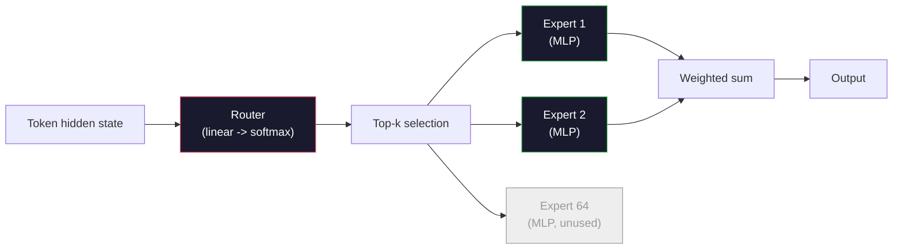

# Open Models: Architecture Walkthroughs / 开源模型架构走读

> 你在 Lesson 04 从零构建了一个 GPT-2 Small。2026 年的 frontier open models 仍属于同一家族，只是做了五六个具体变化：RMSNorm 替代 LayerNorm，SwiGLU 替代 GELU，RoPE 替代 learned positions，GQA 或 MLA 替代 full MHA，大规模使用 Mixture-of-Experts。你已经掌握的数学覆盖了其中 95%。本课把 Llama 3、DeepSeek-V3、Mixtral、Qwen 和 Gemma 并排阅读，并点名每种架构分叉发生在哪一行。

**类型：** Learn
**语言：** Python (stdlib)
**前置要求：** Phase 10，Lessons 04、05、12（Pre-training、Scaling、Inference）
**时间：** 约 45 分钟

## Learning Objectives / 学习目标

- 阅读 Llama 3、Mistral、Mixtral、Gemma 2、Qwen 2.5 和 DeepSeek-V3 的 config.json，并解释每个字段
- 说出每个模型相对 GPT-2 Small 的具体架构变化，并用 first principles 解释它为什么成立
- 仅凭 config 计算任意 open model 的参数量、KV cache size 和 activation memory
- 在 latency、memory 和 capability 约束下，为 deployment target 选择合适的 open model

## The Problem / 问题

在 Lesson 04，你写了 350 行 numpy，得到了一个 GPT-2-shaped model。Llama 3 405B 有一份 200 页的 technical report。直觉上你可能觉得它们是完全不同的物种。其实不是。那 200 页描述的是同一个对象，只做了五六个动机充分的修改，再加上大量关于 scaling 的实现细节。骨架仍然不变：embedding、transformer blocks、attention、MLP、norm、head。

本课是一份 diff。对每个主要 open model family，我们列出它相对 GPT-2 改了什么、为什么改、代价是什么。完成之后，你就能读一张新的 model card，并在脑中把它翻译回 GPT-2 baseline。

实际收益是：当 Meta 发布 Llama 5，或 DeepSeek 发布 V4 时，你不需要新的 mental model。你会看 config，看到哪些已知旋钮被移动，并知道它们对下游意味着什么。2026 年的架构是一个有限 toolbox。每个新模型只是选择了不同子集。

## The Concept / 概念

### The Invariant Core / 不变核心

所有 autoregressive open models 都共享这些组件：

- Token embedding matrix（vocab_size x hidden_dim）。
- N 个 decoder blocks 的堆叠：norm、self-attention、residual、norm、MLP、residual。
- Final norm 和投影到 vocab_size 的 linear head（通常与 embeddings weight-tied）。
- Causal mask、next-token cross-entropy loss。

这就是形状。其余都是旋钮。

### The Six Knobs That Actually Move / 真正会动的六个旋钮

在 2024-2026 年所有 frontier open model 中，被反复选择的设计只有同样六类：

1. **Normalization。** LayerNorm -> RMSNorm。
2. **Positional encoding。** Learned absolute -> RoPE（以及 YaRN、NTK 等变体）。
3. **Activation。** GELU -> SwiGLU（或 GeGLU）。
4. **Attention head sharing。** MHA -> GQA -> MQA -> MLA。
5. **Dense vs sparse MLP。** Dense -> Mixture-of-Experts。
6. **Pre-norm placement。** 保留 pre-norm。post-norm 已经退出。

其他东西（learning rate schedule、data mix、batch size、context length）属于 training config，而不是 architecture。就这六个旋钮。

### Knob 1: RMSNorm / 旋钮 1：RMSNorm

LayerNorm 会减去 mean、除以 std、scale 并 shift。RMSNorm 只保留 scale：

```
RMSNorm(x) = x / sqrt(mean(x^2) + eps) * gamma
```

不减 mean，没有 bias。每个 token 少一个 matmul。Zhang and Sennrich (2019) 认为它在机器翻译上匹配 LayerNorm，同时快约 10%。每个现代 open model 都在用它。

成本：无。收益：小幅吞吐提升，代码更简单。

### Knob 2: RoPE / 旋钮 2：RoPE

GPT-2 的 learned position embeddings 是一张 1024-slot lookup table。context 1025 会越过表尾。模型无法外推到训练长度之外。

Rotary Position Embedding（RoPE, Su et al. 2021）在 attention dot product 前，通过成对旋转每个 Q 和 K 向量注入位置。旋转角度是位置的确定性函数，因此没有需要学习的参数，也没有表尾问题。配合 scaling tricks（NTK-aware interpolation、YaRN），在 8k context 上训练的模型可以在 inference 时伸展到 128k，且精度损失适中。

```
q_rotated = rotate(q, angle(pos))
k_rotated = rotate(k, angle(pos))
score = q_rotated . k_rotated
```

所有 Llama、Mistral、Qwen、DeepSeek 和 Gemma 都使用 RoPE。Gemma 2 使用 hybrid 方案（多数层用 RoPE，另一些层使用 local sliding-window attention）。

### Knob 3: SwiGLU / 旋钮 3：SwiGLU

GPT-2 的 MLP 是 `x -> gelu(xW1 + b1) -> (...)W2 + b2`。SwiGLU（Shazeer 2020）把 activation 换成 gated product：

```
SwiGLU(x) = (xW1) * sigmoid(xW1) * xV
```

它使用两条并行 projection，而不是一条，并由 Swish activation 做 gating。经验上，它在每参数 perplexity 上更强。Llama 2 采用后，其他模型基本都跟进。MLP hidden size 通常会设置成让总参数量接近原始 dense MLP：如果 GPT-2 使用 `ff_dim = 4 * hidden`，SwiGLU 会使用 `ff_dim = (2/3) * 4 * hidden = 8/3 * hidden`。

### Knob 4: Attention Head Sharing / 旋钮 4：Attention Head 共享

GPT-2 使用 **Multi-Head Attention (MHA)**：每个 head 都有自己的 Q、K、V projection。

**Multi-Query Attention (MQA, Shazeer 2019)** 在所有 heads 之间共享一个 K 和一个 V。它会把 KV cache 降低 num_heads 倍，对典型模型来说是 12x 到 32x 的下降。代价是在困难 benchmark 上准确率略降。

**Grouped-Query Attention (GQA, Ainslie et al. 2023)** 是折中：G 组 Q heads 共享一个 K 和一个 V。Llama 3 8B 使用 32 个 Q heads 和 8 个 KV heads（G=8）的 GQA，因此 KV cache 比 full MHA 缩小 4 倍。

**Multi-Head Latent Attention (MLA, DeepSeek 2024)** 把 K 和 V 压缩到一个共享 low-rank latent，再按 head 投影回去。它进一步降低 KV cache，同时保留 per-head expressiveness。DeepSeek-V2 和 V3 依靠它获得 long-context 性能。

| Scheme | KV Heads | KV Cache | Accuracy |
|--------|----------|----------|----------|
| MHA    | num_heads | full | best |
| GQA    | num_groups (G < num_heads) | num_heads / G reduction | near-MHA |
| MQA    | 1 | num_heads reduction | small hit |
| MLA    | latent, per-head decompression | smaller than MQA | near-MHA |

对任何超过约 13B 参数的模型来说，GQA 或 MLA 基本是强制项。scale 到大模型后，full MHA 是 KV cache 灾难。

### Knob 5: Mixture of Experts / 旋钮 5：Mixture of Experts

dense MLP 会为每个 token 激活全部参数。MoE MLP 在每个 block 中有 K 个 experts 和一个 router，router 为每个 token 选择 top-k experts（通常 top-2）。只有这些 experts 的权重会参与该 token 的 forward pass。

```
router_logits = xW_r
indices, weights = top_k(router_logits, k=2)
output = sum_i weights[i] * expert[indices[i]](x)
```

吸引力在于：你可以有 64 个各自 7B 大小的 experts（所以总参数量很大），但每个 token 只运行其中 2 个（所以 per-token compute 接近 dense 7B 模型）。Mixtral 8x7B 总参数 47B，但每个 token 只激活 13B。DeepSeek-V3 总参数 671B，但每个 token 只激活 37B。



优点：同样 compute、更多参数、更强 capacity。缺点：expert memory 仍然要放在某处（所以 serving 需要比同等 dense 模型更多 VRAM），router load-balancing 很难，而且 alignment 阶段 fine-tune router 本身就是研究问题。

### Knob 6: Pre-norm stays / 旋钮 6：Pre-norm 保留

原始 Transformer 在每个 sublayer 之后应用 layer norm。GPT-2 之后的每个 open model 都把它放到每个 sublayer 之前。Pre-norm 在深层训练上明显更容易。这里没有争议。

### Model-by-Model Diff / 按模型逐个 Diff

下面这张表把所有内容具体化。

| Model | Year | Total Params | Active Params | Norm | Activation | Position | Attention | MoE | Context |
|-------|------|-------------|---------------|------|-----------|----------|-----------|-----|---------|
| GPT-2 Small | 2019 | 124M | 124M | LayerNorm | GELU | Learned | MHA (12 heads) | no | 1k |
| Llama 3 8B | 2024 | 8B | 8B | RMSNorm | SwiGLU | RoPE | GQA (32/8) | no | 128k |
| Llama 3 70B | 2024 | 70B | 70B | RMSNorm | SwiGLU | RoPE | GQA (64/8) | no | 128k |
| Llama 3 405B | 2024 | 405B | 405B | RMSNorm | SwiGLU | RoPE | GQA (128/16) | no | 128k |
| Mistral 7B | 2023 | 7.2B | 7.2B | RMSNorm | SwiGLU | RoPE | GQA | no | 32k |
| Mixtral 8x7B | 2023 | 47B | 13B | RMSNorm | SwiGLU | RoPE | GQA | yes (8 experts, top-2) | 32k |
| Gemma 2 9B | 2024 | 9B | 9B | RMSNorm (pre+post) | GeGLU | RoPE + sliding | GQA | no | 8k |
| Qwen 2.5 72B | 2024 | 72B | 72B | RMSNorm | SwiGLU | RoPE (YaRN) | GQA (64/8) | no | 128k |
| DeepSeek V2 236B | 2024 | 236B | 21B | RMSNorm | SwiGLU | RoPE | MLA | yes (160 experts, top-6) | 128k |
| DeepSeek V3 | 2024 | 671B | 37B | RMSNorm | SwiGLU | RoPE | MLA | yes (256 experts, top-8) | 128k |

扫一遍列。RMSNorm 是 universal。SwiGLU 或它的 GeGLU 近亲是 universal。RoPE 是 universal。7B 以上 GQA 几乎 universal，除非被 MLA 替代。MoE 是顶端模型的主要差异点。

### Reading a config.json / 阅读 config.json

Llama 3 8B config：

```
{
  "hidden_size": 4096,
  "intermediate_size": 14336,
  "num_hidden_layers": 32,
  "num_attention_heads": 32,
  "num_key_value_heads": 8,
  "max_position_embeddings": 131072,
  "rope_theta": 500000.0,
  "rms_norm_eps": 1e-5,
  "vocab_size": 128256
}
```

每个字段都对应你已经实现过的东西。

- `hidden_size`：embedding dimension。
- `intermediate_size`：MLP hidden size（3.5x hidden，也就是 SwiGLU math）。
- `num_hidden_layers`：stack depth。
- `num_attention_heads`：Q heads。
- `num_key_value_heads`：KV heads（GQA）。
- `max_position_embeddings`：training context length。
- `rope_theta`：RoPE base frequency。Meta 把它从默认 10k 扩到 500k，以支持 long-context extrapolation。
- `rms_norm_eps`：numerical stability。
- `vocab_size`：tokens。

仅凭这些字段，你就能计算 total parameters、KV cache 和 peak activation memory。精确公式见 `code/main.py`。

### Activation memory budget / Activation 内存预算

几 billion 参数以上训练时，activations 会主导训练内存。pre-training 的经验公式（带 gradient checkpointing）：

```
activation_mem ~ batch_size * seq_len * hidden_size * num_layers * bytes_per_element
```

对 Llama 3 8B，batch 1、seq 8192、BF16、32 layers、hidden 4096：仅 activations 在 checkpointing 下就约 8 GB，不用 checkpointing 则约 40 GB。这就是 flash-attention 和 ring-attention 重要的原因：它们重写 attention computation，让 activations 能放得下。

### KV Cache budget / KV Cache 预算

max context 下的 inference：

```
kv_cache = 2 * num_layers * num_kv_heads * head_dim * max_seq_len * bytes_per_element
```

Llama 3 8B 在 128k context、BF16、head_dim = hidden / num_heads = 128 时：
`2 * 32 * 8 * 128 * 131072 * 2 = 17.2 GB` per sequence。

8B 权重在 BF16 下是 16 GB。单个 128k sequence 的 KV cache 比权重还大。这正是推动 GQA、MLA 和 KV cache quantization 研究的内存压力。

### When Each Model Wins / 什么时候选哪个模型

- **Single 80GB GPU, no MoE**：Llama 3 8B、Mistral 7B、Gemma 2 9B。serving 简单，工具链广。
- **Single node (8x80GB), big capacity**：Llama 3 70B、Qwen 2.5 72B。最高 dense open capability。
- **Biggest open capability, accept MoE complexity**：DeepSeek V3、Mixtral 8x22B。每 active FLOP 的 capability 最强。
- **Long-context needs**：Llama 3（通过 RoPE scaling 到 128k）、DeepSeek（MLA 优势）。
- **Low-latency serving**：Gemma 2 9B（sliding window 降低 long-context compute）。

```figure
rmsnorm-vs-layernorm
```

## Build It / 动手构建

本课代码是一个 calculator。给定任意 config.json，它会打印按组件拆分的 parameter count、max context 下的 KV cache、SwiGLU MLP ratio，以及一段架构 verdict（dense / GQA / MLA / MoE）。

```python
config = {
    "hidden_size": 4096, "intermediate_size": 14336,
    "num_hidden_layers": 32, "num_attention_heads": 32,
    "num_key_value_heads": 8, "vocab_size": 128256,
    "max_position_embeddings": 131072,
}
```

脚本会逐字段遍历架构，计算 embedding、attention（带 GQA reduction）、MLP（带 SwiGLU expansion）、layernorms 和 head 的参数量。然后计算给定 context length 下的 KV cache，并打印 summary。

实现见 `code/main.py`。

## Use It / 使用它

在脚本内置的 Llama 3 8B、Mistral 7B、Mixtral 8x7B 和 DeepSeek V3 configs 上运行 calculator。比较参数拆分。注意 MoE 模型的 total param count 远大于 dense models，但 active param count 常常更小。也注意 DeepSeek V3 虽然总参数更多，但 KV cache 比 Llama 3 405B 更小，这就是 MLA 的效果。

然后插入你本地任意模型的 config，阅读 summary，并判断它是否能装进你的 GPU。

## Ship It / 交付

本课会产出 `outputs/skill-open-model-picker.md`。给定 deployment target（GPU type、VRAM、context length、latency budget）和 task profile（chat、code、reasoning、long-context），它会推荐 open model、Lesson 11 中的 quantization scheme，以及 Lesson 12 中的 inference stack，并明确说明六个架构旋钮上的推理。

## Exercises / 练习

1. 从 HuggingFace 读取 Qwen 2.5 72B config。从零计算 total parameters。与 HF 报告值对比，并识别任何 delta 的来源（head dim rounding、KV sharing factor 等）。

2. DeepSeek V3 使用 256 experts 和 top-8 routing。计算 activated experts 与 total experts 的比例，并与 Mixtral 8x7B 的 top-2 of 8 对比。从 sparse（25%）到 denser sparse（3%）的变化，对 capacity per FLOP 意味着什么？

3. 计算 Llama 3 405B 在 128k context 下 FP8 和 BF16 的 KV cache。FP8 是 BF16 的一半。在单个 8xH100 node（每张 80GB，总计 640GB，扣除 weight memory）上能服务多少 parallel sequences？

4. Gemma 2 交替使用 full-attention 和 sliding-window-attention layers。写出当一半 layers 使用 4096-token sliding window 而不是 full context 时的 KV cache 数学公式。在 8k total context 下能节省多少内存？

5. 找一个在本课写完之后发布的最新 frontier open model。识别它选择了六个旋钮中的哪些，以及是否引入了第七个旋钮。课程会在新架构发布时立刻显得过时，目标是让你更新表格，而不是重建 mental model。

## Key Terms / 关键术语

| 术语 | 常见说法 | 实际含义 |
|------|----------------|----------------------|
| RMSNorm | “LayerNorm without the mean” | 只按 root mean square 归一化，并带 learned scale；更便宜，效果接近 LayerNorm |
| RoPE | “Rotary positions” | 根据位置决定的角度，在 2D pairs 中旋转每个 Q 和 K 向量；配合 scaling tricks 可外推到训练长度之外 |
| SwiGLU | “The new MLP activation” | 带 Swish 的 gated linear unit：`(xW1) * sigmoid(xW1) * xV`；2024+ open model 的标准配置 |
| GQA | “Middle ground attention” | Grouped-Query Attention：G 组 Q heads 共享一个 K 和一个 V head；在不承受 MQA 精度损失的情况下缩小 KV cache |
| MLA | “DeepSeek's attention” | Multi-Head Latent Attention：把 K/V 压缩到 shared low-rank latent，再按 head decompress；大模型中 KV cache 最小 |
| MoE | “Sparse experts” | Mixture of Experts：每个 block 有 N 个 MLP，router 为每个 token 选择 top-k；total params 巨大，active params 很小 |
| Top-k routing | “Pick k experts per token” | router 为每个 expert 计算 score，并激活最高的 k 个；典型 k 从 2（Mixtral）到 8（DeepSeek） |
| YaRN | “Stretch RoPE” | Yet another RoPE extension；通过插值 rotary angles，把 context 从 8k 扩展到 inference 时的 128k+ |
| Sliding-window attention | “Don't attend to everything” | 每个 token 只 attend 到最近 W 个 token；将 attention cost 限制为每 token O(W)，Gemma 2 和早期 Mistral 使用过 |
| Active params | “What runs per token” | 对 MoE 模型来说，是每个 token 真正执行 forward pass 的参数量（远小于 total params），决定 per-token FLOPs |

## Further Reading / 延伸阅读

- [Dubey et al., 2024 -- "The Llama 3 Herd of Models"](https://arxiv.org/abs/2407.21783)：dense Llama 3 family 的架构和训练参考
- [DeepSeek-AI, 2024 -- "DeepSeek-V3 Technical Report"](https://arxiv.org/abs/2412.19437)：MLA、auxiliary-loss-free load balancing，以及 671B MoE
- [Jiang et al., 2024 -- "Mixtral of Experts"](https://arxiv.org/abs/2401.04088)：经典 MoE open model paper
- [Su et al., 2021 -- "RoFormer: Enhanced Transformer with Rotary Position Embedding"](https://arxiv.org/abs/2104.09864)：RoPE 论文
- [Shazeer, 2020 -- "GLU Variants Improve Transformer"](https://arxiv.org/abs/2002.05202)：SwiGLU、GeGLU 及相关变体
- [Ainslie et al., 2023 -- "GQA: Training Generalized Multi-Query Transformer Models"](https://arxiv.org/abs/2305.13245)：GQA 论文
- [Gemma 2 Team, 2024 -- "Gemma 2: Improving Open Language Models at a Practical Size"](https://arxiv.org/abs/2408.00118)：hybrid full+sliding attention、pre+post-norm
- [Qwen Team, 2024 -- "Qwen 2.5 Technical Report"](https://arxiv.org/abs/2412.15115)：YaRN context extension 与 long-context training recipes
