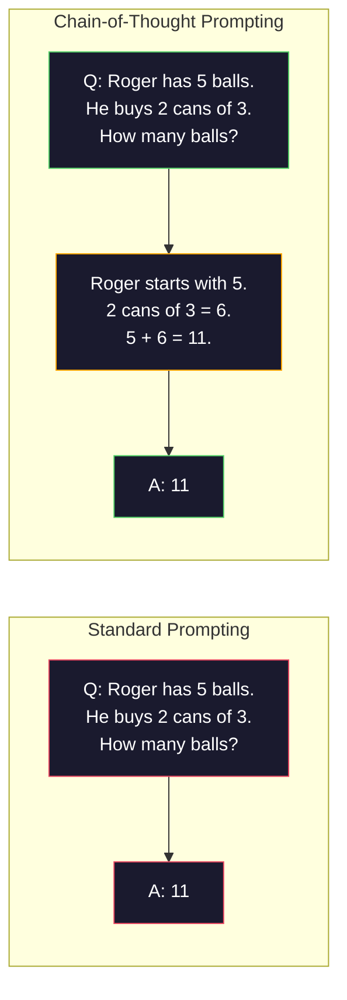
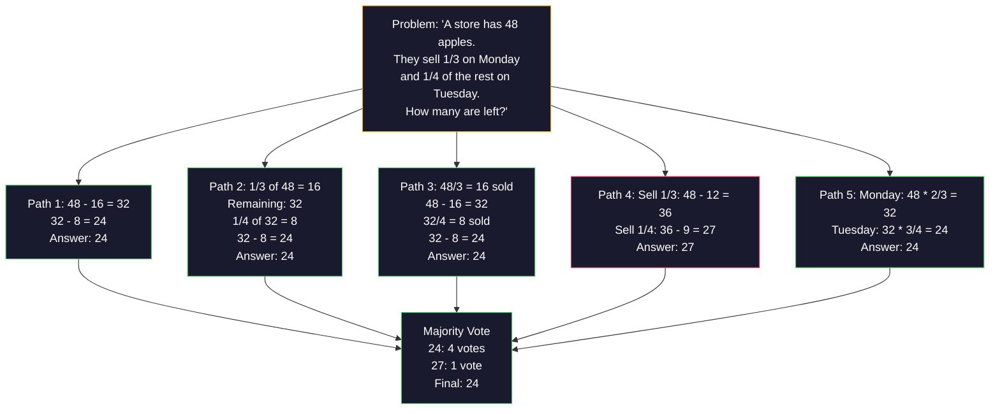
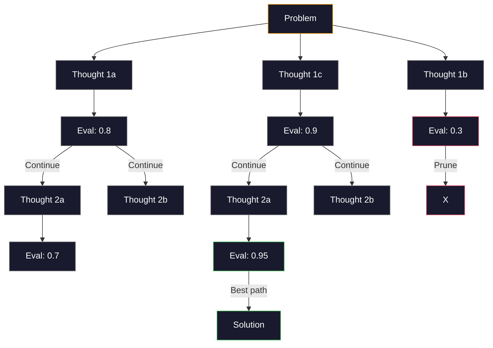

# Few-Shot, Chain-of-Thought, Tree-of-Thought / Few-Shot、Chain-of-Thought 与 Tree-of-Thought

> 告诉模型要做什么，是 prompting。展示它该如何思考，才是 engineering。同一个模型、同一个任务、同一份数据，准确率从 78% 到 91% 的差距，不来自更好的模型，而来自更好的推理策略。

**Type / 类型：** Build / 构建
**Languages / 语言：** Python
**Prerequisites / 前置知识：** Lesson 11.01 (Prompt Engineering)
**Time / 时间：** 约 45 分钟

## Learning Objectives / 学习目标

- 通过选择和格式化 example demonstrations，实现能最大化任务准确率的 few-shot prompting
- 应用 chain-of-thought（CoT）reasoning，提高数学文字题等 multi-step problems 的准确率
- 构建 tree-of-thought prompt，探索多条 reasoning paths 并选择最优路径
- 测量 zero-shot、few-shot 与 CoT 在标准 benchmark 上带来的 accuracy improvement

## The Problem / 问题

你在构建一个 math tutoring app。Prompt 写的是：“Solve this word problem.” GPT-5 在 GSM8K 这个标准小学数学 benchmark 上能答对 94%。你以为已经到顶了，其实没有：chain-of-thought 仍然能多带来 3-4 个点。

加五个词——“Let's think step by step”——准确率就能跃升。加入几个 worked examples 后，还会更高。同一个模型、同一个 temperature、同样 API cost。唯一差别是你给了模型草稿纸。

这不是 hack，而是 reasoning 的工作方式。人类不会一步心算解决 multi-step problems，transformers 也不会。当你强制模型生成 intermediate tokens 时，这些 tokens 会成为下一个 token 的 context。每个 reasoning step 都喂给下一个 step。模型是在字面意义上一步步算出答案。

但 “think step by step” 只是起点，不是终点。如果你 sample 五条 reasoning paths，然后 majority vote 呢？如果让模型探索一棵可能性树，评估并剪枝呢？如果把 reasoning 和 tool use 交错起来呢？这些都不是假设，而是有实测提升的已发表技术，本课会把它们全部构建出来。

## The Concept / 概念

### Zero-Shot vs Few-Shot: When Examples Beat Instructions / Zero-shot 与 few-shot：什么时候示例胜过指令

Zero-shot prompting 只给模型任务，不给其它信息。Few-shot prompting 会先给 examples。

Wei et al. (2022) 在 8 个 benchmark 上测量过这一点。对 sentiment classification 这类简单任务，zero-shot 和 few-shot 的差距在 2% 以内。对 multi-step arithmetic 和 symbolic reasoning 这类复杂任务，few-shot 能提升 10–25% accuracy。

直觉是：examples 是压缩后的 instructions。你不是描述 output format，而是展示它。你不是解释 reasoning process，而是演示它。模型对 examples 做 pattern match，通常比理解抽象 instruction 更可靠。


**When few-shot wins / few-shot 更强的场景：** format-sensitive tasks、classification、structured extraction、domain-specific jargon，以及任何需要模型匹配特定 pattern 的任务。

**When zero-shot wins / zero-shot 更强的场景：** 简单事实问题；examples 会限制创造力的 creative tasks；找好 examples 比写好 instructions 更难的任务。

### Example Selection: Similar Beats Random / Example selection：相似胜过随机

不是所有 examples 都一样。选择与目标 input 相似的 examples，在 classification tasks 上比 random selection 高 5–15%（Liu et al., 2022）。三条原则：

1. **Semantic similarity**：选择 embedding space 中最接近 input 的 examples
2. **Label diversity**：覆盖所有 output categories
3. **Difficulty matching**：匹配目标问题的复杂度

多数任务的最佳 example 数量是 3-5 个。少于 3 个，模型没有足够信号抽取 pattern。超过 5 个，收益递减且浪费 context window tokens。对多 label classification，可以每个 label 放一个 example。

### Chain-of-Thought: Giving Models Scratch Paper / Chain-of-thought：给模型草稿纸

Chain-of-Thought（CoT）prompting 由 Google Brain 的 Wei et al. (2022) 提出。想法很简单：不要只要求模型给答案，而是要求它先展示 reasoning steps。



它为什么在机制上有效？Transformer 生成的每个 token 都会成为下一个 token 的 context。没有 CoT 时，模型必须把全部 reasoning 压缩到一次 forward pass 的 hidden state 里。有了 CoT，模型把 intermediate computations 外化成 tokens。每个 reasoning token 都延长了有效计算深度。

**GSM8K benchmarks（小学数学，8.5K problems）：**

| Model | Zero-Shot | Zero-Shot CoT | Few-Shot CoT |
|-------|-----------|---------------|--------------|
| GPT-4o | 78% | 91% | 95% |
| GPT-5 | 94% | 97% | 98% |
| o4-mini (reasoning) | 97% | — | — |
| Claude Opus 4.7 | 93% | 97% | 98% |
| Gemini 3 Pro | 92% | 96% | 98% |
| Llama 4 70B | 80% | 89% | 94% |
| DeepSeek-V3.1 | 89% | 94% | 96% |

**Note on reasoning models / 关于 reasoning models。** OpenAI o-series（o3、o4-mini）和 DeepSeek-R1 这类模型会在输出 answer 前内部运行 chain-of-thought。再给 reasoning model 加 “Let's think step by step” 通常是冗余的，有时还会适得其反，因为它们已经做过这件事。

CoT 有两种形态：

**Zero-shot CoT**：在 prompt 后加 “Let's think step by step”。不需要 examples。Kojima et al. (2022) 证明，这一句话能在 arithmetic、commonsense 和 symbolic reasoning tasks 上提升准确率。

**Few-shot CoT**：提供包含 reasoning steps 的 examples。它比 zero-shot CoT 更有效，因为模型看到了你期望的具体 reasoning format。

**When CoT hurts / CoT 伤害效果的场景：** 简单事实召回（“What is the capital of France?”）、single-step classification、速度比准确率更重要的任务。CoT 每个 query 会额外消耗 50-200 tokens 的 reasoning overhead。对高吞吐、低复杂度任务，这是浪费成本。

### Self-Consistency: Sample Many, Vote Once / Self-consistency：多次采样，一次投票

Wang et al. (2023) 提出了 self-consistency。核心洞察是：单条 CoT path 可能包含 reasoning error。但如果你 sample N 条独立 reasoning paths（使用 temperature > 0），然后对 final answer 做 majority vote，错误会相互抵消。



在原始 PaLM 540B 实验中，self-consistency 把 GSM8K accuracy 从 56.5%（single CoT）提升到 N=40 时的 74.4%。在 GPT-5 上提升很小（97% 到 98%），因为 base accuracy 已经接近饱和。它最适合 base CoT accuracy 在 60-85% 的模型：单条 path 经常犯错，但错误又不是系统性的。对 reasoning models（o-series、R1），self-consistency 通常被内置 internal sampling 吸收了。

Tradeoff 是：N samples 意味着 N 倍 API cost 和 latency。实践中 N=5 能拿到大部分收益。N=3 是有意义投票的最低值。多数任务中 N > 10 开始收益递减。

### Tree-of-Thought: Branching Exploration / Tree-of-thought：分支探索

Yao et al. (2023) 提出了 Tree-of-Thought（ToT）。CoT 走一条线性 reasoning path；ToT 则探索多个 branches，并在继续前评估哪些 branch 更有希望。



ToT 有三个组成部分：

1. **Thought generation**：生成多个候选 next-steps
2. **State evaluation**：给每个 candidate 打分（可以让 LLM 自己做 evaluator）
3. **Search algorithm**：用 BFS 或 DFS 遍历 tree，剪掉低分 branches

在 Game of 24 任务中（用 4 个数和四则运算拼出 24），GPT-4 standard prompting 只能解决 7.3%。CoT 是 4.0%（这里 CoT 反而伤害效果，因为 search space 很宽）。ToT 达到 74%。

ToT 很贵。Tree 中每个 node 都需要一次 LLM call。Branching factor 3、depth 3 的 tree 最多需要 39 次 LLM calls。只在 search space 很大但可评估的问题上使用它，例如 planning、puzzle solving、带约束的 creative problem-solving。

### ReAct: Thinking + Doing / ReAct：思考 + 行动

Yao et al. (2022) 把 reasoning traces 与 actions 结合起来。模型在 thinking（生成 reasoning）和 acting（调用工具、搜索、计算）之间交替。

```mermaid
graph LR
    Q["Question:\nWhat is the\npopulation of the\ncountry where\nthe Eiffel Tower\nis located?"]
    T1["Thought: I need to\nfind which country\nhas the Eiffel Tower"]
    A1["Action: search\n'Eiffel Tower location'"]
    O1["Observation:\nParis, France"]
    T2["Thought: Now I need\nFrance's population"]
    A2["Action: search\n'France population 2024'"]
    O2["Observation:\n68.4 million"]
    T3["Thought: I have\nthe answer"]
    F["Answer:\n68.4 million"]

    Q --> T1 --> A1 --> O1 --> T2 --> A2 --> O2 --> T3 --> F

    style Q fill:#1a1a2e,stroke:#ffa500,color:#fff
    style T1 fill:#1a1a2e,stroke:#51cf66,color:#fff
    style A1 fill:#1a1a2e,stroke:#e94560,color:#fff
    style O1 fill:#1a1a2e,stroke:#808080,color:#fff
    style T2 fill:#1a1a2e,stroke:#51cf66,color:#fff
    style A2 fill:#1a1a2e,stroke:#e94560,color:#fff
    style O2 fill:#1a1a2e,stroke:#808080,color:#fff
    style T3 fill:#1a1a2e,stroke:#51cf66,color:#fff
    style F fill:#1a1a2e,stroke:#51cf66,color:#fff
```



ReAct 在 knowledge-intensive tasks 上胜过 pure CoT，因为它能把 reasoning grounding 到真实数据。在 HotpotQA（multi-hop question answering）上，ReAct with GPT-4 的 exact match 是 35.1%，而 CoT alone 是 29.4%。真正的能力在于 observations 会纠正 reasoning errors，模型能在执行中更新计划。

ReAct 是现代 AI agents 的基础。每个 agent framework（LangChain、CrewAI、AutoGen）都实现了某种 Thought-Action-Observation loop。你会在 Phase 14 构建完整 agents；本课只覆盖 prompting pattern。

### Structured Prompting: XML Tags, Delimiters, Headers / 结构化 prompting：XML tags、delimiters、headers

Prompt 变复杂后，结构能防止模型混淆 sections。三种方法：

**XML tags**（Claude 上最好，其它模型也稳定）：
```
<context>
You are reviewing a pull request.
The codebase uses TypeScript and React.
</context>

<task>
Review the following diff for bugs, security issues, and style violations.
</task>

<diff>
{diff_content}
</diff>

<output_format>
List each issue with: file, line, severity (critical/warning/info), description.
</output_format>
```

**Markdown headers**（通用）：
```
## Role
Senior security engineer at a fintech company.

## Task
Analyze this API endpoint for vulnerabilities.

## Input
{api_code}

## Rules
- Focus on OWASP Top 10
- Rate each finding: critical, high, medium, low
- Include remediation steps
```

**Delimiters**（最小但有效）：
```
---INPUT---
{user_text}
---END INPUT---

---INSTRUCTIONS---
Summarize the above in 3 bullet points.
---END INSTRUCTIONS---
```

### Prompt Chaining: Sequential Decomposition / Prompt chaining：顺序分解

有些任务太复杂，单个 prompt 承受不了。Prompt chaining 会把任务拆成多个步骤，一个 prompt 的 output 成为下一个 prompt 的 input。


Chaining 胜过 single-prompt 有三个原因：

1. **Each step is simpler**：模型一次处理一个聚焦任务，而不是同时 juggling 所有事情
2. **Intermediate outputs are inspectable**：你可以在步骤之间验证和纠正
3. **Different steps can use different models**：用便宜模型做 extraction，用昂贵模型做 reasoning

### Performance Comparison / 性能对比

| Technique | Best For | GSM8K Accuracy (GPT-5) | API Calls | Token Overhead | Complexity |
|-----------|----------|------------------------|-----------|----------------|------------|
| Zero-Shot | Simple tasks | 94% | 1 | None | Trivial |
| Few-Shot | Format matching | 96% | 1 | 200-500 tokens | Low |
| Zero-Shot CoT | Quick reasoning boost | 97% | 1 | 50-200 tokens | Trivial |
| Few-Shot CoT | Maximum single-call accuracy | 98% | 1 | 300-600 tokens | Low |
| Self-Consistency (N=5) | High-stakes reasoning | 98.5% | 5 | 5x token cost | Medium |
| Reasoning model (o4-mini) | Drop-in CoT replacement | 97% | 1 | hidden (2-10x internal) | Trivial |
| Tree-of-Thought | Search/planning problems | N/A (74% on Game of 24) | 10-40+ | 10-40x token cost | High |
| ReAct | Knowledge-grounded reasoning | N/A (35.1% on HotpotQA) | 3-10+ | Variable | High |
| Prompt Chaining | Complex multi-step tasks | 96% (pipeline) | 2-5 | 2-5x token cost | Medium |

该选哪种技术，取决于三件事：accuracy requirement、latency budget、cost tolerance。对多数生产系统来说，few-shot CoT 加 3-sample self-consistency fallback 能覆盖 90% 的 use cases。

## Build It / 动手构建

我们会构建一个 math problem solver，把 few-shot prompting、chain-of-thought reasoning 和 self-consistency voting 组合成单条 pipeline。然后为难题加入 tree-of-thought。

完整实现位于 `code/advanced_prompting.py`。下面是关键组件。

### Step 1: Few-Shot Example Store / 第 1 步：Few-shot example store

第一个组件管理 few-shot examples，并为给定 problem 选择最相关的 examples。

```python
GSM8K_EXAMPLES = [
    {
        "question": "Janet's ducks lay 16 eggs per day. She eats three for breakfast every morning and bakes muffins for her friends every day with four. She sells every egg at the farmers' market for $2. How much does she make every day at the farmers' market?",
        "reasoning": "Janet's ducks lay 16 eggs per day. She eats 3 and bakes 4, using 3 + 4 = 7 eggs. So she has 16 - 7 = 9 eggs left. She sells each for $2, so she makes 9 * 2 = $18 per day.",
        "answer": "18"
    },
    ...
]
```

每个 example 有三部分：question、reasoning chain 和 final answer。Reasoning chain 会把普通 few-shot example 变成 CoT few-shot example。

### Step 2: Chain-of-Thought Prompt Builder / 第 2 步：Chain-of-thought prompt builder

Prompt builder 会把 system message、带 reasoning chain 的 few-shot examples 和目标 question 组装成单个 prompt。

```python
def build_cot_prompt(question, examples, num_examples=3):
    system = (
        "You are a math problem solver. "
        "For each problem, show your step-by-step reasoning, "
        "then give the final numerical answer on the last line "
        "in the format: 'The answer is [number]'."
    )

    example_text = ""
    for ex in examples[:num_examples]:
        example_text += f"Q: {ex['question']}\n"
        example_text += f"A: {ex['reasoning']} The answer is {ex['answer']}.\n\n"

    user = f"{example_text}Q: {question}\nA:"
    return system, user
```

Format constraint（“The answer is [number]”）至关重要。没有它，self-consistency 无法跨 samples 抽取和比较答案。

### Step 3: Self-Consistency Voting / 第 3 步：Self-consistency voting

Sample N 条 reasoning paths，并选择 majority answer。

```python
def self_consistency_solve(question, examples, client, model, n_samples=5):
    system, user = build_cot_prompt(question, examples)

    answers = []
    reasonings = []
    for _ in range(n_samples):
        response = client.chat.completions.create(
            model=model,
            messages=[
                {"role": "system", "content": system},
                {"role": "user", "content": user}
            ],
            temperature=0.7
        )
        text = response.choices[0].message.content
        reasonings.append(text)
        answer = extract_answer(text)
        if answer is not None:
            answers.append(answer)

    vote_counts = Counter(answers)
    best_answer = vote_counts.most_common(1)[0][0] if vote_counts else None
    confidence = vote_counts[best_answer] / len(answers) if best_answer else 0

    return best_answer, confidence, reasonings, vote_counts
```

Temperature 0.7 很重要。Temperature 0.0 下 N 个 samples 会完全相同，失去投票意义。你需要足够 randomness 产生多样 reasoning paths，但不能高到让模型生成胡话。

### Step 4: Tree-of-Thought Solver / 第 4 步：Tree-of-thought solver

对线性 reasoning 失败的问题，ToT 会探索多种 approaches，并评估哪个方向更有希望。

```python
def tree_of_thought_solve(question, client, model, breadth=3, depth=3):
    thoughts = generate_initial_thoughts(question, client, model, breadth)
    scored = [(t, evaluate_thought(t, question, client, model)) for t in thoughts]
    scored.sort(key=lambda x: x[1], reverse=True)

    for current_depth in range(1, depth):
        next_thoughts = []
        for thought, score in scored[:2]:
            extensions = extend_thought(thought, question, client, model, breadth)
            for ext in extensions:
                ext_score = evaluate_thought(ext, question, client, model)
                next_thoughts.append((ext, ext_score))
        scored = sorted(next_thoughts, key=lambda x: x[1], reverse=True)

    best_thought = scored[0][0] if scored else ""
    return extract_answer(best_thought), best_thought
```

Evaluator 本身也是一次 LLM call。你问模型：“On a scale of 0.0 to 1.0, how promising is this reasoning path for solving the problem?” 这是 ToT 的关键洞察：模型可以评估自己的 partial solutions。

### Step 5: Full Pipeline / 第 5 步：完整 pipeline

Pipeline 用 escalation strategy 组合所有技术。

```python
def solve_with_escalation(question, examples, client, model):
    system, user = build_cot_prompt(question, examples)
    single_response = call_llm(client, model, system, user, temperature=0.0)
    single_answer = extract_answer(single_response)

    sc_answer, confidence, _, _ = self_consistency_solve(
        question, examples, client, model, n_samples=5
    )

    if confidence >= 0.8:
        return sc_answer, "self_consistency", confidence

    tot_answer, _ = tree_of_thought_solve(question, client, model)
    return tot_answer, "tree_of_thought", None
```

Escalation logic：先试 cheap 的 single CoT。若 self-consistency confidence 低于 0.8（5 个 samples 中少于 4 个一致），升级到 ToT。这能平衡 cost 和 accuracy：大多数问题低成本解决，难题才获得更多 compute。

## Use It / 应用它

### With LangChain / 使用 LangChain

LangChain 内置 prompt templates 和 output parsing，能简化 few-shot 与 CoT patterns：

```python
from langchain_core.prompts import FewShotPromptTemplate, PromptTemplate
from langchain_openai import ChatOpenAI

example_prompt = PromptTemplate(
    input_variables=["question", "reasoning", "answer"],
    template="Q: {question}\nA: {reasoning} The answer is {answer}."
)

few_shot_prompt = FewShotPromptTemplate(
    examples=examples,
    example_prompt=example_prompt,
    suffix="Q: {input}\nA: Let's think step by step.",
    input_variables=["input"]
)

llm = ChatOpenAI(model="gpt-4o", temperature=0.7)
chain = few_shot_prompt | llm
result = chain.invoke({"input": "If a train travels 120 km in 2 hours..."})
```

LangChain 还提供 `ExampleSelector` classes，用于 semantic similarity selection：

```python
from langchain_core.example_selectors import SemanticSimilarityExampleSelector
from langchain_openai import OpenAIEmbeddings

selector = SemanticSimilarityExampleSelector.from_examples(
    examples,
    OpenAIEmbeddings(),
    k=3
)
```

### With DSPy / 使用 DSPy

DSPy 把 prompting strategies 当作可优化模块。你不再手写 CoT prompts，而是定义 signature，让 DSPy 优化 prompt：

```python
import dspy

dspy.configure(lm=dspy.LM("openai/gpt-4o", temperature=0.7))

class MathSolver(dspy.Module):
    def __init__(self):
        self.solve = dspy.ChainOfThought("question -> answer")

    def forward(self, question):
        return self.solve(question=question)

solver = MathSolver()
result = solver(question="Janet's ducks lay 16 eggs per day...")
```

DSPy 的 `ChainOfThought` 会自动加入 reasoning traces。`dspy.majority` 实现 self-consistency：

```python
result = dspy.majority(
    [solver(question=q) for _ in range(5)],
    field="answer"
)
```

### Comparison: From-Scratch vs Frameworks / 对比：从零实现与框架

| Feature | From-Scratch (this lesson) | LangChain | DSPy |
|---------|--------------------------|-----------|------|
| Control over prompt format | Full | Template-based | Automatic |
| Self-consistency | Manual voting | Manual | Built-in (`dspy.majority`) |
| Example selection | Custom logic | `ExampleSelector` | `dspy.BootstrapFewShot` |
| Tree-of-Thought | Custom tree search | Community chains | Not built-in |
| Prompt optimization | Manual iteration | Manual | Automatic compilation |
| Best for | Learning, custom pipelines | Standard workflows | Research, optimization |

## Ship It / 交付它

本课产出两个 artifacts。

**1. Reasoning Chain Prompt**（`outputs/prompt-reasoning-chain.md`）：一个生产可用的 few-shot CoT + self-consistency prompt template。接入你的 examples 和 problem domain 即可。

**2. CoT Pattern Selection Skill**（`outputs/skill-cot-patterns.md`）：一个 decision framework，根据 task type、accuracy requirements 和 cost constraints 选择合适的 reasoning technique。

## Exercises / 练习

1. **Measure the gap / 测量差距**：取 10 道 GSM8K problems。分别用 zero-shot、few-shot、zero-shot CoT 和 few-shot CoT 求解。记录每种 accuracy。哪个 technique 在你的模型上提升最大？

2. **Example selection experiment / Example selection 实验**：对同样 10 道题，比较 random example selection 与手选相似 examples。测量 accuracy difference。什么时候 example quality 比 example quantity 更重要？

3. **Self-consistency cost curve / Self-consistency 成本曲线**：在 20 道 GSM8K problems 上分别用 N=1、3、5、7、10 跑 self-consistency。绘制 accuracy vs cost（total tokens）。你的模型在曲线的哪个位置出现收益拐点？

4. **Build a ReAct loop / 构建 ReAct loop**：用 calculator tool 扩展 pipeline。当模型生成 math expression 时，用 Python 的 `eval()`（sandbox 内）执行，并把结果喂回模型。测量 tool-grounded reasoning 是否优于 pure CoT。

5. **ToT for creative tasks / 创意任务中的 ToT**：把 Tree-of-Thought solver 改造成 creative writing 任务：“Write a 6-word story that is both funny and sad.” 用 LLM 作为 evaluator。Branching exploration 是否比 single-shot generation 生成更好的 creative outputs？

## Key Terms / 关键术语

| 术语 | 常见说法 | 实际含义 |
|------|----------------|----------------------|
| Few-shot prompting | “给它一些 examples” | 在 prompt 中加入 input-output demonstrations，用来锚定模型的 output format 和 behavior。 |
| Chain-of-Thought | “让它一步步想” | 诱导 intermediate reasoning tokens，在产出 final answer 前扩展模型的有效计算。 |
| Self-Consistency | “多跑几次” | 在 temperature > 0 下 sampling N 条多样 reasoning paths，并用 majority vote 选择最常见 final answer。 |
| Tree-of-Thought | “让它探索选项” | 对 reasoning branches 做结构化搜索，评估每个 partial solution，只扩展有希望的路径。 |
| ReAct | “Thinking + tool use” | 在 Thought-Action-Observation loop 中交错 reasoning traces 与外部 actions（search、compute、API calls）。 |
| Prompt chaining | “拆成多个步骤” | 把复杂任务分解成顺序 prompts，每一步 output 喂给下一步 input。 |
| Zero-shot CoT | “只加 ‘think step by step’” | 不给 examples，只在 prompt 中追加 reasoning trigger phrase，依赖模型的 latent reasoning capability。 |

## Further Reading / 延伸阅读

- [Chain-of-Thought Prompting Elicits Reasoning in Large Language Models](https://arxiv.org/abs/2201.11903) -- Wei et al. 2022。Google Brain 的原始 CoT paper。读 sections 2-3 理解核心结果。
- [Self-Consistency Improves Chain of Thought Reasoning in Language Models](https://arxiv.org/abs/2203.11171) -- Wang et al. 2023。Self-consistency paper。Table 1 有关键数字。
- [Tree of Thoughts: Deliberate Problem Solving with Large Language Models](https://arxiv.org/abs/2305.10601) -- Yao et al. 2023。ToT paper。Section 4 的 Game of 24 结果是重点。
- [ReAct: Synergizing Reasoning and Acting in Language Models](https://arxiv.org/abs/2210.03629) -- Yao et al. 2022。现代 AI agents 的基础。Section 3 解释 Thought-Action-Observation loop。
- [Large Language Models are Zero-Shot Reasoners](https://arxiv.org/abs/2205.11916) -- Kojima et al. 2022。“Let's think step by step” paper，简单到令人意外但很有效。
- [DSPy: Compiling Declarative Language Model Calls into Self-Improving Pipelines](https://arxiv.org/abs/2310.03714) -- Khattab et al. 2023。把 prompting 看成 compilation problem。如果想超越手工 prompt engineering，可以读它。
- [OpenAI — Reasoning models guide](https://platform.openai.com/docs/guides/reasoning) -- vendor guidance，说明 chain-of-thought 什么时候变成内部、按 token 计费的 “reasoning” mode，而不是 prompt-level trick。
- [Lightman et al., "Let's Verify Step by Step" (2023)](https://arxiv.org/abs/2305.20050) -- process reward models (PRM)，用于给 chain 中每一步打分；这是比 outcome-only rewards 更有效的 reasoning supervision signal。
- [Snell et al., "Scaling LLM Test-Time Compute Optimally" (2024)](https://arxiv.org/abs/2408.03314) -- 系统研究 CoT length、self-consistency sampling 和 MCTS；当 accuracy 比 latency 更重要时，“think step by step” 会发展到哪里。
