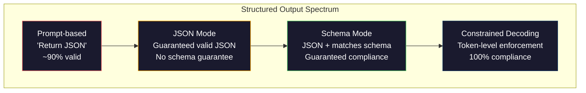
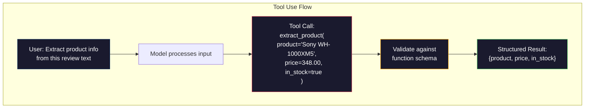

# Structured Outputs: JSON, Schema Validation, Constrained Decoding / 结构化输出：JSON、Schema Validation 与 Constrained Decoding

> 你的 LLM 返回的是字符串。你的应用需要的是 JSON。这个差距造成的生产事故，比任何一次模型 hallucination 都多。Structured output 是 natural language 与 typed data 之间的桥。做对了，LLM 会变成可靠 API；做错了，你会在凌晨 3 点用 regex 解析 free-text。

**Type / 类型：** Build / 构建
**Languages / 语言：** Python
**Prerequisites / 前置知识：** Phase 10, Lessons 01-05 (LLMs from Scratch)
**Time / 时间：** 约 90 分钟
**Related / 相关：** Phase 5 · 20 (Structured Outputs & Constrained Decoding) 覆盖 decoder-level theory（FSM/CFG logit processors、Outlines、XGrammar）。本课聚焦 production SDK surface（OpenAI `response_format`、Anthropic tool use、Instructor）；如果想理解 API 之下发生了什么，先读 Phase 5 · 20。

## Learning Objectives / 学习目标

- 使用 OpenAI 与 Anthropic API 参数实现 JSON-mode 和 schema-constrained outputs
- 构建 Pydantic validation layer，拒绝 malformed LLM outputs，并携带 error feedback 重试
- 解释 constrained decoding 如何在 token level 强制 valid JSON，而不是靠后处理
- 设计 robust extraction prompts，把 unstructured text 稳定转换成 typed data structures

## The Problem / 问题

你问 LLM：“Extract the product name, price, and availability from this text.” 它回答：

```
The product is the Sony WH-1000XM5 headphones, which cost $348.00 and are currently in stock.
```

这是一个完全正确的答案。对你的应用却完全没用。Inventory system 需要的是 `{"product": "Sony WH-1000XM5", "price": 348.00, "in_stock": true}`。你需要一个带特定 keys、特定 types 和特定 value constraints 的 JSON object，不需要一个句子。

天真的做法是在 prompt 里加一句 “Respond in JSON”。这在 90% 的时候有效。另外 10% 里，模型会把 JSON 包进 markdown code fences，或者加上 “Here's the JSON:” 这样的 preamble，或者因为提前闭合 bracket 生成 syntactically invalid JSON。你的 JSON parser crash。Pipeline break。你加了 try/except 和 retry loop。Retry 有时会产出不同数据。现在你不仅有 parsing problem，还有 consistency problem。

这不是 prompt engineering problem，而是 decoding problem。模型从左到右生成 tokens。每个位置上，它从 100K+ vocabulary 里选择最可能的 next token。在任意给定位置，大多数选项都会产生 invalid JSON。如果模型刚输出 `{"price":`，下一个 token 必须是数字、quote（string）、`null`、`true`、`false` 或负号。其它任何 token 都会产生 invalid JSON。没有约束时，模型可能选择一个完全合理的英文词，但语法上灾难性错误。

## The Concept / 概念

### The Structured Output Spectrum / 结构化输出光谱

Structured output control 有四个层级，每层都比上一层更可靠。



**Prompt-based**（“Respond in valid JSON”）：没有 enforcement。模型通常会遵守，但偶尔不会。可靠性约 90%。Failure mode 包括 markdown fences、preamble text、truncated output、wrong structure。

**JSON mode**：API 保证 output 是 valid JSON。OpenAI 的 `response_format: { type: "json_object" }` 会启用它。Output 一定能 parse。但它不保证匹配你的预期 schema：可能有 extra keys、wrong types、missing fields。

**Schema mode**：API 接收 JSON Schema，并保证 output 匹配它。到 2026 年，所有主要 provider 都原生支持：OpenAI 的 `response_format: { type: "json_schema", json_schema: {...} }`（也可用 `tool_choice="required"`）、Anthropic 带 `input_schema` 的 tool use，以及 Gemini 的 `response_schema` + `response_mime_type: "application/json"`。Output 会拥有你指定的 exact keys、types 和 constraints。

**Constrained decoding**：生成过程中，在每个 token 位置把所有会产生 invalid output 的 tokens mask 掉。如果 schema 要求 number，而模型想输出 letter，这个 token 的 probability 会设为 zero。模型只能生成能通向 valid output 的 token。OpenAI structured output mode，以及 Outlines、Guidance 等库，底层都在做这件事。

### JSON Schema: The Contract Language / JSON Schema：契约语言

JSON Schema 是你告诉模型（或 validation layer）output 必须长什么样的方式。每个主要 structured output system 都使用它。

```json
{
  "type": "object",
  "properties": {
    "product": { "type": "string" },
    "price": { "type": "number", "minimum": 0 },
    "in_stock": { "type": "boolean" },
    "categories": {
      "type": "array",
      "items": { "type": "string" }
    }
  },
  "required": ["product", "price", "in_stock"]
}
```

这个 schema 表示：output 必须是一个 object，包含 string `product`、非负 number `price`、boolean `in_stock`，以及可选的 string array `categories`。不匹配的 output 会被拒绝。

Schemas 可以处理困难情况：nested objects、带 typed items 的 arrays、enums（把 string 限制到特定值）、pattern matching（strings 上的 regex），以及 combinators（oneOf、anyOf、allOf，用于 polymorphic outputs）。

### The Pydantic Pattern / Pydantic 模式

在 Python 中，你通常不手写 JSON Schema，而是定义 Pydantic model，让它生成 schema。

```python
from pydantic import BaseModel

class Product(BaseModel):
    product: str
    price: float
    in_stock: bool
    categories: list[str] = []
```

它会生成与上面相同的 JSON Schema。Instructor library（以及 OpenAI SDK）可以直接接收 Pydantic models：传入 model class，返回 validated instance。如果 LLM output 不匹配，Instructor 会自动 retry。

### Function Calling / Tool Use / 函数调用与工具使用

这是同一个问题的另一种接口。你不直接要求模型生成 JSON，而是定义带 typed parameters 的 “tools”（functions）。模型输出带 structured arguments 的 function call。OpenAI 称之为 “function calling”，Anthropic 称之为 “tool use”。结果相同：structured data。



当模型需要选择调用哪个 function，而不只是填参数时，tool use 更合适。如果你有 10 种 extraction schemas，需要模型根据 input 选择正确的 schema，tool use 同时提供 schema selection 和 structured output。

### Common Failure Modes / 常见 failure modes

即使有 schema enforcement，structured outputs 仍然会以微妙方式失败。

**Hallucinated values / 编造值**：output 匹配 schema，但包含编造数据。文本里价格是 $348，模型输出 `{"price": 299.99}`。Schema validation 抓不住它，因为 type 正确，value 错误。

**Enum confusion / Enum 混淆**：你把字段限制为 `["in_stock", "out_of_stock", "preorder"]`。模型输出 `"available"`，语义正确，但不在 allowed set。好的 constrained decoding 会阻止它；prompt-based approaches 不会。

**Nested object depth / 嵌套深度**：深层嵌套 schema（4+ levels）会产生更多错误。每多一层 nesting，模型就多一个丢失结构跟踪的位置。

**Array length / 数组长度**：模型可能生成太多或太少 items。Schemas 支持 `minItems` 和 `maxItems`，但不是所有 provider 都在 decoding level 强制它们。

**Optional field omission / 可选字段遗漏**：模型会省略技术上 optional、但语义上对你的 use case 很重要的字段。即使数据有时缺失，也可以把它设为 required，强制模型显式生成 `null`。

## Build It / 动手构建

### Step 1: JSON Schema Validator / 第 1 步：JSON Schema validator

从零构建一个 validator，检查 Python object 是否匹配 JSON Schema。这是在 output 侧验证 compliance 的逻辑。

```python
import json

def validate_schema(data, schema):
    errors = []
    _validate(data, schema, "", errors)
    return errors

def _validate(data, schema, path, errors):
    schema_type = schema.get("type")

    if schema_type == "object":
        if not isinstance(data, dict):
            errors.append(f"{path}: expected object, got {type(data).__name__}")
            return
        for key in schema.get("required", []):
            if key not in data:
                errors.append(f"{path}.{key}: required field missing")
        properties = schema.get("properties", {})
        for key, value in data.items():
            if key in properties:
                _validate(value, properties[key], f"{path}.{key}", errors)

    elif schema_type == "array":
        if not isinstance(data, list):
            errors.append(f"{path}: expected array, got {type(data).__name__}")
            return
        min_items = schema.get("minItems", 0)
        max_items = schema.get("maxItems", float("inf"))
        if len(data) < min_items:
            errors.append(f"{path}: array has {len(data)} items, minimum is {min_items}")
        if len(data) > max_items:
            errors.append(f"{path}: array has {len(data)} items, maximum is {max_items}")
        items_schema = schema.get("items", {})
        for i, item in enumerate(data):
            _validate(item, items_schema, f"{path}[{i}]", errors)

    elif schema_type == "string":
        if not isinstance(data, str):
            errors.append(f"{path}: expected string, got {type(data).__name__}")
            return
        enum_values = schema.get("enum")
        if enum_values and data not in enum_values:
            errors.append(f"{path}: '{data}' not in allowed values {enum_values}")

    elif schema_type == "number":
        if not isinstance(data, (int, float)):
            errors.append(f"{path}: expected number, got {type(data).__name__}")
            return
        minimum = schema.get("minimum")
        maximum = schema.get("maximum")
        if minimum is not None and data < minimum:
            errors.append(f"{path}: {data} is less than minimum {minimum}")
        if maximum is not None and data > maximum:
            errors.append(f"{path}: {data} is greater than maximum {maximum}")

    elif schema_type == "boolean":
        if not isinstance(data, bool):
            errors.append(f"{path}: expected boolean, got {type(data).__name__}")

    elif schema_type == "integer":
        if not isinstance(data, int) or isinstance(data, bool):
            errors.append(f"{path}: expected integer, got {type(data).__name__}")
```

### Step 2: Pydantic-Style Model to Schema / 第 2 步：Pydantic-style model 转 schema

构建一个最小 class-to-schema converter。定义 Python class，并自动生成 JSON Schema。

```python
class SchemaField:
    def __init__(self, field_type, required=True, default=None, enum=None, minimum=None, maximum=None):
        self.field_type = field_type
        self.required = required
        self.default = default
        self.enum = enum
        self.minimum = minimum
        self.maximum = maximum

def python_type_to_schema(field):
    type_map = {
        str: "string",
        int: "integer",
        float: "number",
        bool: "boolean",
    }

    schema = {}

    if field.field_type in type_map:
        schema["type"] = type_map[field.field_type]
    elif field.field_type == list:
        schema["type"] = "array"
        schema["items"] = {"type": "string"}
    elif isinstance(field.field_type, dict):
        schema = field.field_type

    if field.enum:
        schema["enum"] = field.enum
    if field.minimum is not None:
        schema["minimum"] = field.minimum
    if field.maximum is not None:
        schema["maximum"] = field.maximum

    return schema

def model_to_schema(name, fields):
    properties = {}
    required = []

    for field_name, field in fields.items():
        properties[field_name] = python_type_to_schema(field)
        if field.required:
            required.append(field_name)

    return {
        "type": "object",
        "properties": properties,
        "required": required,
    }
```

### Step 3: Constrained Token Filter / 第 3 步：Constrained token filter

模拟 constrained decoding。给定 partial JSON string 和 schema，判断当前位置哪些 token categories 是合法的。

```python
def next_valid_tokens(partial_json, schema):
    stripped = partial_json.strip()

    if not stripped:
        return ["{"]

    try:
        json.loads(stripped)
        return ["<EOS>"]
    except json.JSONDecodeError:
        pass

    last_char = stripped[-1] if stripped else ""

    if last_char == "{":
        return ['"', "}"]
    elif last_char == '"':
        if stripped.endswith('":'):
            return ['"', "0-9", "true", "false", "null", "[", "{"]
        return ["a-z", '"']
    elif last_char == ":":
        return [" ", '"', "0-9", "true", "false", "null", "[", "{"]
    elif last_char == ",":
        return [" ", '"', "{", "["]
    elif last_char in "0123456789":
        return ["0-9", ".", ",", "}", "]"]
    elif last_char == "}":
        return [",", "}", "]", "<EOS>"]
    elif last_char == "]":
        return [",", "}", "<EOS>"]
    elif last_char == "[":
        return ['"', "0-9", "true", "false", "null", "{", "[", "]"]
    else:
        return ["any"]

def demonstrate_constrained_decoding():
    partial_states = [
        '',
        '{',
        '{"product"',
        '{"product":',
        '{"product": "Sony"',
        '{"product": "Sony",',
        '{"product": "Sony", "price":',
        '{"product": "Sony", "price": 348',
        '{"product": "Sony", "price": 348}',
    ]

    print(f"{'Partial JSON':<45} {'Valid Next Tokens'}")
    print("-" * 80)
    for state in partial_states:
        valid = next_valid_tokens(state, {})
        display = state if state else "(empty)"
        print(f"{display:<45} {valid}")
```

### Step 4: Extraction Pipeline / 第 4 步：Extraction pipeline

把所有组件合并成 extraction pipeline：定义 schema，模拟 LLM 生成 structured output，验证 output，并处理 retry。

```python
def simulate_llm_extraction(text, schema, attempt=0):
    if "headphones" in text.lower() or "sony" in text.lower():
        if attempt == 0:
            return '{"product": "Sony WH-1000XM5", "price": 348.00, "in_stock": true, "categories": ["audio", "headphones"]}'
        return '{"product": "Sony WH-1000XM5", "price": 348.00, "in_stock": true}'

    if "laptop" in text.lower():
        return '{"product": "MacBook Pro 16", "price": 2499.00, "in_stock": false, "categories": ["computers"]}'

    return '{"product": "Unknown", "price": 0, "in_stock": false}'

def extract_with_retry(text, schema, max_retries=3):
    for attempt in range(max_retries):
        raw = simulate_llm_extraction(text, schema, attempt)

        try:
            data = json.loads(raw)
        except json.JSONDecodeError as e:
            print(f"  Attempt {attempt + 1}: JSON parse error -- {e}")
            continue

        errors = validate_schema(data, schema)
        if not errors:
            return data

        print(f"  Attempt {attempt + 1}: Schema validation errors -- {errors}")

    return None

product_schema = {
    "type": "object",
    "properties": {
        "product": {"type": "string"},
        "price": {"type": "number", "minimum": 0},
        "in_stock": {"type": "boolean"},
        "categories": {"type": "array", "items": {"type": "string"}},
    },
    "required": ["product", "price", "in_stock"],
}
```

### Step 5: Run the Full Pipeline / 第 5 步：运行完整 pipeline

```python
def run_demo():
    print("=" * 60)
    print("  Structured Output Pipeline Demo")
    print("=" * 60)

    print("\n--- Schema Definition ---")
    product_fields = {
        "product": SchemaField(str),
        "price": SchemaField(float, minimum=0),
        "in_stock": SchemaField(bool),
        "categories": SchemaField(list, required=False),
    }
    generated_schema = model_to_schema("Product", product_fields)
    print(json.dumps(generated_schema, indent=2))

    print("\n--- Schema Validation ---")
    test_cases = [
        ({"product": "Test", "price": 10.0, "in_stock": True}, "Valid object"),
        ({"product": "Test", "price": -5.0, "in_stock": True}, "Negative price"),
        ({"product": "Test", "in_stock": True}, "Missing price"),
        ({"product": "Test", "price": "ten", "in_stock": True}, "String as price"),
        ("not an object", "String instead of object"),
    ]

    for data, label in test_cases:
        errors = validate_schema(data, product_schema)
        status = "PASS" if not errors else f"FAIL: {errors}"
        print(f"  {label}: {status}")

    print("\n--- Constrained Decoding Simulation ---")
    demonstrate_constrained_decoding()

    print("\n--- Extraction Pipeline ---")
    texts = [
        "The Sony WH-1000XM5 headphones are priced at $348 and currently available.",
        "The new MacBook Pro 16-inch laptop costs $2499 but is sold out.",
        "This is a random sentence with no product info.",
    ]

    for text in texts:
        print(f"\n  Input: {text[:60]}...")
        result = extract_with_retry(text, product_schema)
        if result:
            print(f"  Output: {json.dumps(result)}")
        else:
            print(f"  Output: FAILED after retries")
```

## Use It / 应用它

### OpenAI Structured Outputs / OpenAI structured outputs

```python
# from openai import OpenAI
# from pydantic import BaseModel
#
# client = OpenAI()
#
# class Product(BaseModel):
#     product: str
#     price: float
#     in_stock: bool
#
# response = client.beta.chat.completions.parse(
#     model="gpt-5-mini",
#     messages=[
#         {"role": "system", "content": "Extract product information."},
#         {"role": "user", "content": "Sony WH-1000XM5, $348, in stock"},
#     ],
#     response_format=Product,
# )
#
# product = response.choices[0].message.parsed
# print(product.product, product.price, product.in_stock)
```

OpenAI 的 structured output mode 在内部使用 constrained decoding。模型生成的每个 token 都保证能导向匹配 Pydantic schema 的 output。不需要 retry，不需要额外 validation。约束已经烘进 decoding process。

### Anthropic Tool Use / Anthropic tool use

```python
# import anthropic
#
# client = anthropic.Anthropic()
#
# response = client.messages.create(
#     model="claude-opus-4-7",
#     max_tokens=1024,
#     tools=[{
#         "name": "extract_product",
#         "description": "Extract product information from text",
#         "input_schema": {
#             "type": "object",
#             "properties": {
#                 "product": {"type": "string"},
#                 "price": {"type": "number"},
#                 "in_stock": {"type": "boolean"},
#             },
#             "required": ["product", "price", "in_stock"],
#         },
#     }],
#     messages=[{"role": "user", "content": "Extract: Sony WH-1000XM5, $348, in stock"}],
# )
```

Anthropic 通过 tool use 实现 structured output。模型会发出一个 tool call，并带上匹配 input_schema 的 structured arguments。结果相同，API surface 不同。

### Instructor Library / Instructor library

```python
# pip install instructor
# import instructor
# from openai import OpenAI
# from pydantic import BaseModel
#
# client = instructor.from_openai(OpenAI())
#
# class Product(BaseModel):
#     product: str
#     price: float
#     in_stock: bool
#
# product = client.chat.completions.create(
#     model="gpt-5-mini",
#     response_model=Product,
#     messages=[{"role": "user", "content": "Sony WH-1000XM5, $348, in stock"}],
# )
```

Instructor 会包装任意 LLM client，并加入 validation retry。如果第一次尝试 validation 失败，它会把 errors 作为 context 发回模型，请它修复 output。它适用于任何 provider，不只适用于 OpenAI。

## Ship It / 交付它

本课产出 `outputs/prompt-structured-extractor.md`：一个可复用 prompt template，给定 schema definition，即可从任意 text 中抽取 structured data。输入 JSON Schema 和 unstructured text，返回 validated JSON。

它还产出 `outputs/skill-structured-outputs.md`：一个 decision framework，根据 provider、reliability requirements 和 schema complexity 选择合适的 structured output strategy。

## Exercises / 练习

1. 扩展 schema validator，支持 `oneOf`（data 必须正好匹配多个 schemas 中的一个）。这能处理 polymorphic outputs，例如一个字段可以是 `Product` 或 `Service` object，且两者 shape 不同。

2. 构建一个 “schema diff” tool，比较两个 schemas，识别 breaking changes（removed required fields、changed types）和 non-breaking changes（added optional fields、relaxed constraints）。这对生产 extraction schemas 的版本管理很关键。

3. 实现一个更真实的 constrained decoding simulator。给定 JSON Schema 和包含 100 个 tokens 的 vocabulary（letters、digits、punctuation、keywords），逐步走过 generation，在每个位置 mask invalid tokens。测量每一步 vocabulary 中合法 token 的比例。

4. 构建 extraction eval suite。创建 50 条 product descriptions，并手工标注 JSON outputs。对全部 50 条运行 extraction pipeline，测量 exact match、field-level accuracy 和 type compliance。识别哪些字段最难正确抽取。

5. 给 extraction pipeline 增加 “confidence scores”。对每个抽取字段估计模型置信度（基于 token probabilities，或运行 3 次 extraction 测量一致性）。把 low-confidence fields 标记给 human review。

## Key Terms / 关键术语

| 术语 | 常见说法 | 实际含义 |
|------|----------------|----------------------|
| JSON mode | “Returns JSON” | API flag，保证 syntactically valid JSON output，但不强制特定 schema。 |
| Structured output | “Typed JSON” | 匹配特定 JSON Schema 的 output，包含正确 keys、types 和 constraints。 |
| Constrained decoding | “Guided generation” | 在每个 token position mask 掉会产生 invalid output 的 tokens，保证 100% schema compliance。 |
| JSON Schema | “A JSON template” | 描述 JSON data 结构、类型与约束的 declarative language（OpenAPI、JSON Forms 等也使用它）。 |
| Pydantic | “Python dataclasses+” | Python library，用 type validation 定义 data models；FastAPI 和 Instructor 用它生成 JSON Schemas。 |
| Function calling | “Tool use” | LLM 输出 structured function invocation（name + typed arguments），而不是 free text；OpenAI 和 Anthropic 都支持。 |
| Instructor | “Pydantic for LLMs” | Python library，包装 LLM clients 并返回 validated Pydantic instances，validation 失败时自动 retry。 |
| Token masking | “Filtering the vocabulary” | 生成期间把特定 token probabilities 设为 zero，防止模型生成它们。 |
| Schema compliance | “Matches the shape” | Output 包含每个 required field、正确 types、constraint 范围内的 values，且没有额外禁止字段。 |
| Retry loop | “Try again until it works” | 把 validation errors 发回模型，请它修复 output；Instructor 会自动执行，直到 configurable max。 |

## Further Reading / 延伸阅读

- [OpenAI Structured Outputs Guide](https://platform.openai.com/docs/guides/structured-outputs) -- OpenAI API 中基于 JSON Schema 的 constrained decoding 官方文档。
- [Willard & Louf, 2023 -- "Efficient Guided Generation for Large Language Models"](https://arxiv.org/abs/2307.09702) -- Outlines paper，描述如何把 JSON Schemas 编译成 finite state machines，以施加 token-level constraints。
- [Instructor documentation](https://python.useinstructor.com/) -- 使用 Pydantic validation 和 retries 从任意 LLM 获取 structured outputs 的标准库。
- [Anthropic Tool Use Guide](https://docs.anthropic.com/en/docs/tool-use) -- Claude 如何通过带 JSON Schema `input_schema` 的 tool use 实现 structured output。
- [JSON Schema specification](https://json-schema.org/) -- 主要 structured output systems 使用的 schema language 完整规范。
- [Outlines library](https://github.com/outlines-dev/outlines) -- 使用 regex 和编译为 finite state machines 的 JSON Schema 做 constrained generation 的开源库。
- [Dong et al., "XGrammar: Flexible and Efficient Structured Generation Engine for Large Language Models" (MLSys 2025)](https://arxiv.org/abs/2411.15100) -- 当前 state-of-the-art grammar engine；pushdown-automaton compilation，能以约 100 ns / token mask tokens。
- [Beurer-Kellner et al., "Prompting Is Programming: A Query Language for Large Language Models" (LMQL)](https://arxiv.org/abs/2212.06094) -- LMQL paper，把 constrained decoding 框定为带 type 和 value constraints 的 query language。
- [Microsoft Guidance (framework docs)](https://github.com/guidance-ai/guidance) -- template-driven constrained generation；Outlines 和 XGrammar 的 vendor-agnostic 补充。
