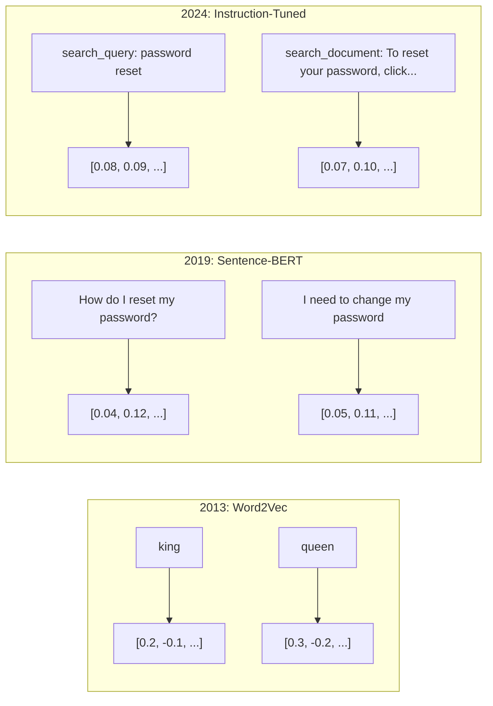
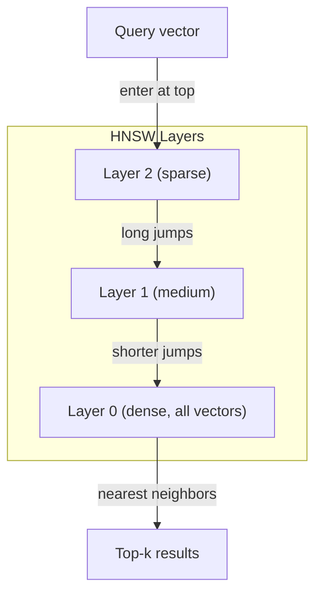
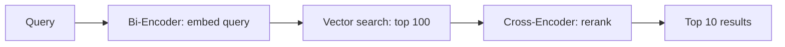

# Embeddings & Vector Representations / Embeddings 与向量表示

> 文本是离散的，数学是连续的。每次你要求 LLM 找“相似”文档、比较语义、或做超越关键词的搜索时，都依赖这两个世界之间的一座桥。那座桥就是 embedding。如果你不理解 embeddings，就不理解现代 AI，只是在使用它。

**Type / 类型：** Build / 构建
**Languages / 语言：** Python
**Prerequisites / 前置知识：** Phase 11, Lesson 01 (Prompt Engineering)
**Time / 时间：** 约 75 分钟
**Related / 相关：** Phase 5 · 22 (Embedding Models Deep Dive) 讲 dense vs sparse vs multi-vector、Matryoshka truncation 与 per-axis model selection。本课聚焦 production pipeline（vector DBs、HNSW、similarity math）。选模型前先读 Phase 5 · 22。

## Learning Objectives / 学习目标

- 使用 API providers 和 open-source models 生成 text embeddings，并计算它们之间的 cosine similarity
- 解释 embeddings 为什么能解决 keyword search 无法处理的 vocabulary mismatch problem
- 构建 semantic search index，根据语义而不是精确关键词检索 documents
- 用 retrieval benchmarks（precision@k、recall）评估 embedding quality，并为任务选择合适 embedding model

## The Problem / 问题

你有 10,000 条 support tickets。客户写：“my payment didn't go through.” 你需要找到相似历史 tickets。Keyword search 会找到包含 “payment” 和 “didn't go through” 的 tickets，却漏掉 “transaction failed”、“charge was declined” 和 “billing error”。这些 tickets 描述的是完全相同的问题，只是用了完全不同的词。

这就是 vocabulary mismatch problem。人类语言有几十种方式表达同一件事。Keyword search 把每个词当作彼此独立、没有意义的 symbol。它不知道 “declined” 和 “didn't go through” 指向同一个概念。

你需要一种 text representation，让意义而不是拼写决定 similarity。你需要把 “my payment didn't go through” 和 “transaction was declined” 放在某个数学空间中很近的位置，同时让 “my payment arrived on time” 虽然共享 “payment” 这个词，却被推远。

这种 representation 就是 embedding。

## The Concept / 概念

### What Is an Embedding? / 什么是 embedding？

Embedding 是一组 dense floating-point vector，用来表示文本含义。这里 “dense” 很重要：每个维度都承载信息，不像 bag-of-words、TF-IDF 这类 sparse representations，大多数维度都是 zero。

“The cat sat on the mat” 会变成类似 `[0.023, -0.041, 0.087, ..., 0.012]` 的东西，具体是 768 到 3072 个数字，取决于模型。这些数字编码了意义。你不会直接检查它们，而是比较它们。

### The Word2Vec Breakthrough / Word2Vec 的突破

2013 年，Google 的 Tomas Mikolov 及同事发布 Word2Vec。核心洞察是：训练一个 neural network 根据邻居预测词（或根据词预测邻居），hidden layer weights 就会成为有意义的 vector representations。

著名结果是：

```
king - man + woman = queen
```

Word embeddings 上的 vector arithmetic 捕获了 semantic relationships。从 “man” 到 “woman” 的方向，大致等同于从 “king” 到 “queen” 的方向。这是领域意识到 geometry 可以编码 meaning 的时刻。

Word2Vec 生成 300-dimensional vectors。每个词无论 context 如何，都只有一个 vector。“Bank” 在 “river bank” 和 “bank account” 里拥有同一个 embedding。这个限制推动了随后十年的研究。

### From Words to Sentences / 从词到句子

Word embeddings 表示单个 tokens。Production systems 需要 embed 整个 sentences、paragraphs 或 documents。出现了四类方法：

**Averaging**：取句子里所有 word vectors 的 mean。便宜、有损，但对短文本意外地不错。它完全丢失 word order，因此 “dog bites man” 和 “man bites dog” 会得到相同 embeddings。

**CLS token**：Transformer models（BERT, 2018）输出一个 special [CLS] token embedding，表示整个 input。比 averaging 更好，但 [CLS] token 当初是为 next-sentence prediction 训练的，不是为 similarity 训练的。

**Contrastive learning**：显式训练模型把相似 pairs 拉近、把不相似 pairs 推远。Sentence-BERT（Reimers & Gurevych, 2019）采用这种方式，并成为现代 embedding models 的基础。给定 “How do I reset my password?” 和 “I need to change my password”，模型会学到它们应拥有几乎相同的 vectors。

**Instruction-tuned embeddings**：最新方法。E5 和 GTE 这类模型接收 task prefix（“search_query:”、“search_document:”），告诉模型应该生成哪种 embedding。这让一个模型可以服务多种任务。



### Modern Embedding Models / 现代 embedding models

市场已经收敛到少数 production-grade 选项（MTEB scores as of early 2026, MTEB v2）：

| Model | Provider | Dimensions | MTEB | Context | Cost / 1M tokens |
|-------|----------|-----------|------|---------|------------------|
| Gemini Embedding 2 | Google | 3072 (Matryoshka) | 67.7 (retrieval) | 8192 | $0.15 |
| embed-v4 | Cohere | 1024 (Matryoshka) | 65.2 | 128K | $0.12 |
| voyage-4 | Voyage AI | 1024/2048 (Matryoshka) | 66.8 | 32K | $0.12 |
| text-embedding-3-large | OpenAI | 3072 (Matryoshka) | 64.6 | 8192 | $0.13 |
| text-embedding-3-small | OpenAI | 1536 (Matryoshka) | 62.3 | 8192 | $0.02 |
| BGE-M3 | BAAI | 1024 (dense+sparse+ColBERT) | 63.0 multilingual | 8192 | Open-weight |
| Qwen3-Embedding | Alibaba | 4096 (Matryoshka) | 66.9 | 32K | Open-weight |
| Nomic-embed-v2 | Nomic | 768 (Matryoshka) | 63.1 | 8192 | Open-weight |

MTEB（Massive Text Embedding Benchmark）v2 覆盖 retrieval、classification、clustering、reranking、summarization 等 100+ tasks。分数越高越好。到 2026 年，open-weight models（Qwen3-Embedding、BGE-M3）在多数维度上已经追平甚至超过 closed hosted models。Gemini Embedding 2 领先 pure retrieval；Voyage/Cohere 在特定领域（finance、law、code）领先。投入前必须在自己的 queries 上 benchmark。

### Similarity Metrics / 相似度指标

给定两个 embedding vectors，有三种方式测量它们的相似程度：

**Cosine similarity**：两个 vectors 夹角的 cosine。范围从 -1（相反）到 1（同方向）。忽略 magnitude；只要方向相同，10-word sentence 和 500-word document 也可以得到 1.0。90% use cases 默认用它。

```
cosine_sim(a, b) = dot(a, b) / (||a|| * ||b||)
```

**Dot product**：两个 vectors 的 raw inner product。当 vectors 已 normalized（unit length）时，它与 cosine similarity 相同。计算更快。OpenAI embeddings 已 normalized，因此 dot product 和 cosine 给出相同 ranking。

```
dot(a, b) = sum(a_i * b_i)
```

**Euclidean (L2) distance**：vector space 中的直线距离。越小越相似。对 magnitude differences 敏感。当绝对空间位置重要，而不只是方向重要时使用。

```
L2(a, b) = sqrt(sum((a_i - b_i)^2))
```

选择方式：

| Metric | Use when | Avoid when |
|--------|----------|------------|
| Cosine similarity | Comparing texts of different lengths; most retrieval tasks | Magnitude carries information |
| Dot product | Embeddings are already normalized; maximum speed | Vectors have varying magnitudes |
| Euclidean distance | Clustering; spatial nearest-neighbor problems | Comparing documents of wildly different lengths |

### Vector Databases and HNSW / Vector databases 与 HNSW

Brute-force similarity search 会把 query 与每个已存 vector 比较。100 万个 1536 维 vectors，每次 query 是 15 亿次 multiply-add operations。太慢。

Vector databases 用 Approximate Nearest Neighbor（ANN）algorithms 解决这个问题。主导算法是 HNSW（Hierarchical Navigable Small World）：

1. 构建 vectors 的 multi-layer graph
2. Top layers 稀疏，连接远距离 clusters
3. Bottom layers 密集，连接近邻 vectors
4. Search 从 top layer 开始，贪心下降并逐步 refine
5. 以 O(log n) 而非 O(n) 返回 approximate top-k results

HNSW 用少量 accuracy loss（通常 95–99% recall）换取巨大速度收益。1000 万 vectors 时，brute force 要秒级，HNSW 是毫秒级。



Production options：

| Database | Type | Best for | Max scale |
|----------|------|----------|-----------|
| Pinecone | Managed SaaS | Zero-ops production | Billions |
| Weaviate | Open source | Self-hosted, hybrid search | 100M+ |
| Qdrant | Open source | High performance, filtering | 100M+ |
| ChromaDB | Embedded | Prototyping, local dev | 1M |
| pgvector | Postgres extension | Already using Postgres | 10M |
| FAISS | Library | In-process, research | 1B+ |

### Chunking Strategies / Chunking 策略

Documents 太长，不能作为单个 vector embed。50 页 PDF 覆盖几十个 topic，它的 embedding 会变成“一切内容的平均值”，和任何具体问题都不够相似。你要把 documents 切成 chunks，并分别 embed。

**Fixed-size chunking**：每 N tokens 切一次，带 M-token overlap。简单可预测。适合没有清晰结构的 documents。512-token chunk + 50-token overlap：chunk 1 是 tokens 0-511，chunk 2 是 tokens 462-973。

**Sentence-based chunking**：在 sentence boundaries 切分，聚合 sentences 直到 token limit。每个 chunk 至少是一句完整话。比 fixed-size 好，因为不会把一个 thought 切成两半。

**Recursive chunking**：先尝试最大边界（section headers）。如果仍然太大，再尝试 paragraph boundaries，再尝试 sentence boundaries，最后才用 character limits。这是 LangChain 的 `RecursiveCharacterTextSplitter`，对 mixed-format corpora 效果很好。

**Semantic chunking**：对每个 sentence 做 embedding，然后把 embedding 相似的连续 sentences 分到一起。当 embedding similarity 低于 threshold，就开始新 chunk。昂贵（每个 sentence 都要 embed），但 chunk coherence 最好。

| Strategy | Complexity | Quality | Best for |
|----------|-----------|---------|----------|
| Fixed-size | Low | Decent | Unstructured text, logs |
| Sentence-based | Low | Good | Articles, emails |
| Recursive | Medium | Good | Markdown, HTML, mixed docs |
| Semantic | High | Best | Critical retrieval quality |

多数系统的最佳折中点：256-512 token chunks，50-token overlap。

### Bi-Encoders vs Cross-Encoders / Bi-encoders 与 cross-encoders

Bi-encoder 独立 embed query 和 documents，然后比较 vectors。快：query 只 embed 一次，documents embeddings 可以预先计算。Retrieval 用的就是它。

Cross-encoder 把 query 和一个 document 作为单个 input，输出 relevance score。慢：每个 query-document pair 都要过完整模型。但它准确得多，因为可以同时 attend query 和 document tokens。

Production pattern：bi-encoder retrieve top-100 candidates，cross-encoder rerank 到 top-10。这就是 retrieve-then-rerank pipeline。



Reranking models：Cohere Rerank 3.5（$2 per 1000 queries）、BGE-reranker-v2（free, open source）、Jina Reranker v2（free, open source）。

### Matryoshka Embeddings / Matryoshka embeddings

传统 embeddings 是 all-or-nothing。1536-dimensional vector 使用 1536 个 floats。你不能不重训就截断到 256 dimensions。

Matryoshka Representation Learning（Kusupati et al., 2022）解决了这个问题。模型训练时让前 N 个 dimensions 捕获最重要信息，就像俄罗斯套娃。把 1536-d Matryoshka embedding 截断到 256 dimensions，会损失一部分 accuracy，但仍然可用。

OpenAI 的 text-embedding-3-small 和 text-embedding-3-large 通过 `dimensions` 参数支持 Matryoshka truncation。请求 256 dimensions 而不是 1536 dimensions，可以把 storage 降低 6x，在 MTEB benchmarks 上大约损失 3–5% accuracy。

### Binary Quantization / 二值量化

1536-dimensional embedding 用 float32 存储需要 6,144 bytes。乘以 1000 万 documents，光 vectors 就是 61 GB。

Binary quantization 把每个 float 转成一个 bit：正值变 1，负值变 0。Storage 从 6,144 bytes 降到 192 bytes，减少 32x。Similarity 用 Hamming distance（不同 bit 的数量）计算，CPU 可以用单条指令完成。

Retrieval recall 上的 accuracy hit 大约是 5–10%。常见模式：第一轮在数百万 vectors 上用 binary quantization search，然后用 full-precision vectors 对 top-1000 rescore。这样用 32x 更少 memory 获得 95%+ 的 full-precision accuracy。

```figure
cosine-similarity
```

## Build It / 动手构建

我们从零构建 semantic search engine。不用 vector database，不用外部 embedding API。只用 Python 和 numpy 做数学。

### Step 1: Text Chunking / 第 1 步：Text chunking

```python
def chunk_text(text, chunk_size=200, overlap=50):
    words = text.split()
    chunks = []
    start = 0
    while start < len(words):
        end = start + chunk_size
        chunk = " ".join(words[start:end])
        chunks.append(chunk)
        start += chunk_size - overlap
    return chunks


def chunk_by_sentences(text, max_chunk_tokens=200):
    sentences = text.replace("\n", " ").split(".")
    sentences = [s.strip() + "." for s in sentences if s.strip()]
    chunks = []
    current_chunk = []
    current_length = 0
    for sentence in sentences:
        sentence_length = len(sentence.split())
        if current_length + sentence_length > max_chunk_tokens and current_chunk:
            chunks.append(" ".join(current_chunk))
            current_chunk = []
            current_length = 0
        current_chunk.append(sentence)
        current_length += sentence_length
    if current_chunk:
        chunks.append(" ".join(current_chunk))
    return chunks
```

### Step 2: Building Embeddings from Scratch / 第 2 步：从零构建 embeddings

我们用 TF-IDF + L2 normalization 实现一个简单 dense embedding。它不是 neural embedding，但遵守同样的 contract：text in、fixed-size vector out，相似 texts 产生相似 vectors。

```python
import math
import numpy as np
from collections import Counter

class SimpleEmbedder:
    def __init__(self):
        self.vocab = []
        self.idf = []
        self.word_to_idx = {}

    def fit(self, documents):
        vocab_set = set()
        for doc in documents:
            vocab_set.update(doc.lower().split())
        self.vocab = sorted(vocab_set)
        self.word_to_idx = {w: i for i, w in enumerate(self.vocab)}
        n = len(documents)
        self.idf = np.zeros(len(self.vocab))
        for i, word in enumerate(self.vocab):
            doc_count = sum(1 for doc in documents if word in doc.lower().split())
            self.idf[i] = math.log((n + 1) / (doc_count + 1)) + 1

    def embed(self, text):
        words = text.lower().split()
        count = Counter(words)
        total = len(words) if words else 1
        vec = np.zeros(len(self.vocab))
        for word, freq in count.items():
            if word in self.word_to_idx:
                tf = freq / total
                vec[self.word_to_idx[word]] = tf * self.idf[self.word_to_idx[word]]
        norm = np.linalg.norm(vec)
        if norm > 0:
            vec = vec / norm
        return vec
```

### Step 3: Similarity Functions / 第 3 步：Similarity functions

```python
def cosine_similarity(a, b):
    dot = np.dot(a, b)
    norm_a = np.linalg.norm(a)
    norm_b = np.linalg.norm(b)
    if norm_a == 0 or norm_b == 0:
        return 0.0
    return float(dot / (norm_a * norm_b))


def dot_product(a, b):
    return float(np.dot(a, b))


def euclidean_distance(a, b):
    return float(np.linalg.norm(a - b))
```

### Step 4: Vector Index with Brute-Force Search / 第 4 步：使用 brute-force search 的 vector index

```python
class VectorIndex:
    def __init__(self):
        self.vectors = []
        self.texts = []
        self.metadata = []

    def add(self, vector, text, meta=None):
        self.vectors.append(vector)
        self.texts.append(text)
        self.metadata.append(meta or {})

    def search(self, query_vector, top_k=5, metric="cosine"):
        scores = []
        for i, vec in enumerate(self.vectors):
            if metric == "cosine":
                score = cosine_similarity(query_vector, vec)
            elif metric == "dot":
                score = dot_product(query_vector, vec)
            elif metric == "euclidean":
                score = -euclidean_distance(query_vector, vec)
            else:
                raise ValueError(f"Unknown metric: {metric}")
            scores.append((i, score))
        scores.sort(key=lambda x: x[1], reverse=True)
        results = []
        for idx, score in scores[:top_k]:
            results.append({
                "text": self.texts[idx],
                "score": score,
                "metadata": self.metadata[idx],
                "index": idx
            })
        return results

    def size(self):
        return len(self.vectors)
```

### Step 5: The Semantic Search Engine / 第 5 步：Semantic search engine

```python
class SemanticSearchEngine:
    def __init__(self, chunk_size=200, overlap=50):
        self.embedder = SimpleEmbedder()
        self.index = VectorIndex()
        self.chunk_size = chunk_size
        self.overlap = overlap

    def index_documents(self, documents, source_names=None):
        all_chunks = []
        all_sources = []
        for i, doc in enumerate(documents):
            chunks = chunk_text(doc, self.chunk_size, self.overlap)
            all_chunks.extend(chunks)
            name = source_names[i] if source_names else f"doc_{i}"
            all_sources.extend([name] * len(chunks))
        self.embedder.fit(all_chunks)
        for chunk, source in zip(all_chunks, all_sources):
            vec = self.embedder.embed(chunk)
            self.index.add(vec, chunk, {"source": source})
        return len(all_chunks)

    def search(self, query, top_k=5, metric="cosine"):
        query_vec = self.embedder.embed(query)
        return self.index.search(query_vec, top_k, metric)

    def search_with_scores(self, query, top_k=5):
        results = self.search(query, top_k)
        return [
            {
                "text": r["text"][:200],
                "source": r["metadata"].get("source", "unknown"),
                "score": round(r["score"], 4)
            }
            for r in results
        ]
```

### Step 6: Comparing Similarity Metrics / 第 6 步：比较 similarity metrics

```python
def compare_metrics(engine, query, top_k=3):
    results = {}
    for metric in ["cosine", "dot", "euclidean"]:
        hits = engine.search(query, top_k=top_k, metric=metric)
        results[metric] = [
            {"score": round(h["score"], 4), "preview": h["text"][:80]}
            for h in hits
        ]
    return results
```

## Use It / 应用它

使用 production embedding API 时，architecture 不变，只有 embedder 变了：

```python
from openai import OpenAI

client = OpenAI()

def openai_embed(texts, model="text-embedding-3-small", dimensions=None):
    kwargs = {"model": model, "input": texts}
    if dimensions:
        kwargs["dimensions"] = dimensions
    response = client.embeddings.create(**kwargs)
    return [item.embedding for item in response.data]
```

OpenAI 的 Matryoshka truncation：同一个模型，更少 dimensions，更低 storage：

```python
full = openai_embed(["semantic search query"], dimensions=1536)
compact = openai_embed(["semantic search query"], dimensions=256)
```

256-d vector 使用 6x 更少 storage。对 1000 万 documents，这是 10 GB vs 61 GB。标准 benchmarks 上 accuracy loss 大约是 3–5%。

使用 Cohere 做 reranking：

```python
import cohere

co = cohere.ClientV2()

results = co.rerank(
    model="rerank-v3.5",
    query="What is the refund policy?",
    documents=["Full refund within 30 days...", "No refunds after 90 days..."],
    top_n=3
)
```

不依赖 API 的 local embeddings：

```python
from sentence_transformers import SentenceTransformer

model = SentenceTransformer("BAAI/bge-small-en-v1.5")
embeddings = model.encode(["semantic search query", "another document"])
```

我们构建的 `VectorIndex` class 可与上述任何方式配合。替换 embedding function，保留 search logic。

## Ship It / 交付它

本课产出：
- `outputs/prompt-embedding-advisor.md`：一个 prompt，用于为具体 use case 选择 embedding models 和 strategies
- `outputs/skill-embedding-patterns.md`：一个 skill，教 agents 如何在生产中有效使用 embeddings

## Exercises / 练习

1. **Metric comparison / 指标对比**：用 cosine similarity、dot product 和 euclidean distance 对 sample documents 运行同样 5 个 queries。记录每种 metric 的 top-3 results。哪些 queries 下 metrics 会分歧？为什么？

2. **Chunk size experiment / Chunk size 实验**：用 50、100、200、500 words 的 chunk size index sample documents。每种 size 下运行 5 个 queries 并记录 top-1 similarity score。画出 chunk size 与 retrieval quality 的关系。找出更大 chunks 开始伤害效果的点。

3. **Matryoshka simulation / Matryoshka 模拟**：构建一个输出 500-d vectors 的 `SimpleEmbedder`。截断到 50、100、200、500 dimensions。测量每个截断点 retrieval recall 如何下降。这能在没有真实训练技巧的情况下模拟 Matryoshka behavior。

4. **Binary quantization / 二值量化**：取 search engine 的 embeddings，转成 binary（positive 为 1，negative 为 0），并实现 Hamming distance search。与 full-precision cosine similarity 的 top-10 results 对比，测量 overlap percentage。

5. **Sentence-based chunking / 基于句子的 chunking**：用 `chunk_by_sentences` 替换 fixed-size chunking。运行同样 queries 并比较 retrieval scores。尊重 sentence boundaries 是否提升结果？

## Key Terms / 关键术语

| 术语 | 常见说法 | 实际含义 |
|------|----------------|----------------------|
| Embedding | “Text to numbers” | 几何距离编码 semantic similarity 的 dense vector。 |
| Word2Vec | “OG embedding” | 2013 年通过预测 context words 学习 word vectors 的模型；证明 vector arithmetic 能编码 meaning。 |
| Cosine similarity | “两个 vectors 有多像” | 两个 vectors 夹角的 cosine；1 = 同方向，0 = orthogonal，-1 = opposite。 |
| HNSW | “Fast vector search” | Hierarchical Navigable Small World graph，多层结构让 approximate nearest neighbor search 达到 O(log n)。 |
| Bi-encoder | “分别 embed，快速比较” | 独立把 query 和 document 编码成 vectors；支持预计算和快速 retrieval。 |
| Cross-encoder | “慢但准的 reranker” | 把 query-document pair 一起送入完整模型；准确率更高，但不能预计算。 |
| Matryoshka embeddings | “可截断 vectors” | 训练时让前 N dimensions 捕获最重要信息，从而支持 variable-size storage。 |
| Binary quantization | “1-bit embeddings” | 把 float vectors 转成 binary（只保留 sign bit），用 Hamming distance search 换取 32x storage reduction。 |
| Chunking | “把 docs 切给 embedding” | 把 documents 切成 256-512 token segments，使每段都能独立 embed 和 retrieve。 |
| Vector database | “Embeddings 的 search engine” | 为存储 vectors 并做 scale approximate nearest neighbor search 优化的数据存储。 |
| Contrastive learning | “通过比较来训练” | 训练时把 similar pair embeddings 拉近，把 dissimilar pair embeddings 推远。 |
| MTEB | “Embedding benchmark” | Massive Text Embedding Benchmark，包含 8 类任务的 56 个 datasets，是比较 embedding models 的标准。 |

## Further Reading / 延伸阅读

- Mikolov et al., "Efficient Estimation of Word Representations in Vector Space" (2013) -- 以 king-queen analogy 开启 embedding revolution 的 Word2Vec paper。
- Reimers & Gurevych, "Sentence-BERT: Sentence Embeddings using Siamese BERT-Networks" (2019) -- 如何训练 sentence-level similarity bi-encoders，是现代 embedding models 的基础。
- Kusupati et al., "Matryoshka Representation Learning" (2022) -- variable-dimension embeddings 背后的技术，OpenAI 在 text-embedding-3 中采用了它。
- Malkov & Yashunin, "Efficient and Robust Approximate Nearest Neighbor using Hierarchical Navigable Small World Graphs" (2018) -- HNSW paper，多数 production vector search 背后的算法。
- OpenAI Embeddings Guide (platform.openai.com/docs/guides/embeddings) -- text-embedding-3 models 的实用参考，包括 Matryoshka dimension reduction。
- MTEB Leaderboard (huggingface.co/spaces/mteb/leaderboard) -- 实时 benchmark，跨任务和语言比较 embedding models。
- [Muennighoff et al., "MTEB: Massive Text Embedding Benchmark" (EACL 2023)](https://arxiv.org/abs/2210.07316) -- 定义 leaderboard 报告的 8 类任务（classification、clustering、pair classification、reranking、retrieval、STS、summarization、bitext mining）的 benchmark；信任任何单个 MTEB score 前先读它。
- [Sentence Transformers documentation](https://www.sbert.net/) -- bi-encoder vs cross-encoder、pooling strategies，以及本课实现的 ingest-split-embed-store RAG pipeline 的权威参考。
