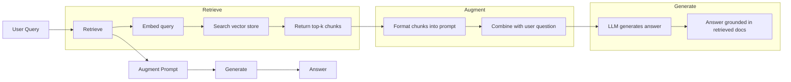
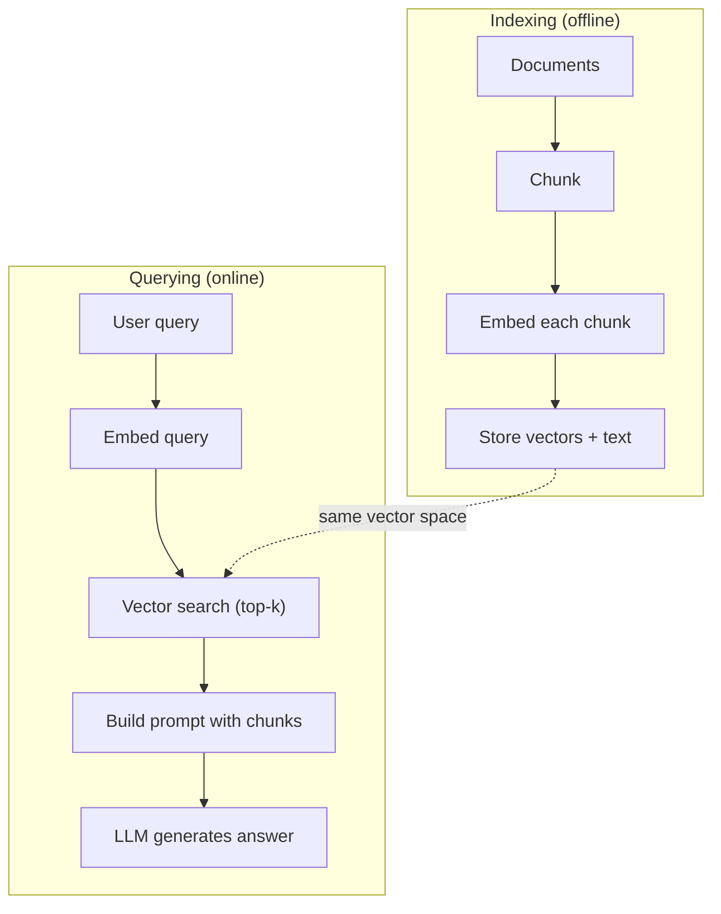

# RAG (Retrieval-Augmented Generation) / RAG（检索增强生成）

> 你的 LLM 知道训练截止日期之前的很多东西。它不知道你公司的 docs、你的 codebase，也不知道上周的会议纪要。RAG 通过检索相关 documents 并把它们塞进 prompt 来解决这个问题。它是 production AI 中部署最多的 pattern。如果这门课你只构建一个东西，就构建 RAG pipeline。

**Type / 类型：** Build / 构建
**Languages / 语言：** Python
**Prerequisites / 前置知识：** Phase 10 (LLMs from Scratch), Phase 11 Lessons 01-05
**Time / 时间：** 约 90 分钟
**Related / 相关：** Phase 5 · 23 (Chunking Strategies for RAG) 讲六种 chunking algorithms 以及各自适用场景。Phase 5 · 22 (Embedding Models Deep Dive) 讲 embedder 选择。Phase 11 · 07 (Advanced RAG) 讲 hybrid search、reranking 和 query transformation。

## Learning Objectives / 学习目标

- 构建完整 RAG pipeline：document loading、chunking、embedding、vector storage、retrieval、generation
- 使用 vector database（ChromaDB、FAISS 或 Pinecone）和正确 indexing 实现 semantic search
- 解释为什么 knowledge-grounded applications 更偏好 RAG 而不是 fine-tuning（cost、freshness、attribution）
- 使用 retrieval metrics（precision、recall）和 generation metrics（faithfulness、relevance）评估 RAG quality

## The Problem / 问题

你为公司构建了一个 chatbot。客户问：“What's the refund policy for enterprise plans?” LLM 给出一个泛化的 typical SaaS refund policies 答案。但真实 policy 藏在 200 页 internal wiki 里：enterprise customers 有 60-day window，且按比例退款。LLM 从未见过这份文档。它无法知道没有被训练过的东西。

Fine-tuning 是一种方案。拿 LLM，在 internal docs 上训练它，然后部署更新后的模型。它有效，但有严重问题。Fine-tuning 需要数千美元 compute。文档一变，模型就 stale。你无法知道模型回答来自哪个 source。如果公司下个月收购新 product line，你还要再 fine-tune。

RAG 是另一种方案。保持模型不变。当问题进来时，搜索 document store，找到 relevant passages，把它们贴到问题前的 prompt 里，让模型基于这些 passages 作为 context 回答。Document store 可以在几分钟内更新。你能看到究竟 retrieve 了哪些 documents。模型本身从不改变。这就是 RAG 成为 production dominant pattern 的原因：更便宜、更新鲜、可审计，并且适用于任何 LLM。

## The Concept / 概念

### The RAG Pattern / RAG 模式

整个 pattern 可以压缩成四步：



Query -> Retrieve -> Augment prompt -> Generate。每个 RAG system 都遵循这个模式。不同 production RAG systems 的差异，在每一步细节里：怎么 chunk、怎么 embed、怎么 search、怎么构造 prompt。

### Why RAG Beats Fine-Tuning / 为什么 RAG 胜过 fine-tuning

| Concern | Fine-tuning | RAG |
|---------|------------|-----|
| Cost | $1,000-$100,000+ per training run | $0.01-$0.10 per query (embedding + LLM) |
| Freshness | Stale until retrained | Updated in minutes by re-indexing docs |
| Auditability | Cannot trace answer to source | Can show exact retrieved passages |
| Hallucination | Still hallucinates freely | Grounded in retrieved documents |
| Data privacy | Training data baked into weights | Documents stay in your vector store |

Fine-tuning 会永久改变模型 weights。RAG 只临时改变模型 context。对多数应用来说，你想要的是 temporary context。

Fine-tuning 唯一胜出的情况：你需要模型采用特定 style、tone 或 reasoning pattern，而这些无法单靠 prompting 达成。对 factual knowledge retrieval，RAG 每次都赢。

### Embedding Models / Embedding models

Embedding model 把文本转换成 dense vector。相似文本在这个 high-dimensional space 里位置接近。“How do I reset my password?” 和 “I need to change my password” 尽管共享词很少，也会得到几乎相同的 vectors。“The cat sat on the mat” 则会非常不同。

常见 embedding models（2026 lineup，完整分析见 Phase 5 · 22）：

| Model | Dimensions | Provider | Notes |
|-------|-----------|----------|-------|
| text-embedding-3-small | 1536 (Matryoshka) | OpenAI | Best price/performance for most use cases |
| text-embedding-3-large | 3072 (Matryoshka) | OpenAI | Higher accuracy, truncatable to 256/512/1024 |
| Gemini Embedding 2 | 3072 (Matryoshka) | Google | Top MTEB retrieval; 8K context |
| voyage-4 | 1024/2048 (Matryoshka) | Voyage AI | Domain variants (code, finance, law) |
| Cohere embed-v4 | 1024 (Matryoshka) | Cohere | Strong multilingual, 128K context |
| BGE-M3 | 1024 (dense + sparse + ColBERT) | BAAI (open-weight) | Three views from one model |
| Qwen3-Embedding | 4096 (Matryoshka) | Alibaba (open-weight) | Top open-weight retrieval score |
| all-MiniLM-L6-v2 | 384 | Open-weight (Sentence Transformers) | Prototyping baseline |

本课会用 TF-IDF 自己构建一个简单 embedding。不是因为 production systems 用 TF-IDF，而是因为它能让概念具体：text 进去，vector 出来，相似 texts 产生相似 vectors。

### Vector Similarity / 向量相似度

给定两个 vectors，如何测量 similarity？有三种选择：

**Cosine similarity**：两个 vectors 夹角的 cosine。范围从 -1（opposite）到 1（identical）。忽略 magnitude，只关心方向。这是 RAG 默认选择。

```
cosine_sim(a, b) = dot(a, b) / (||a|| * ||b||)
```

**Dot product**：raw inner product。更大的 vectors 得分更高。当 magnitude 携带信息时有用，例如更长 documents 可能更相关。

```
dot(a, b) = sum(a_i * b_i)
```

**L2 (Euclidean) distance**：vector space 中的直线距离。距离越小越相似。对 magnitude differences 敏感。

```
L2(a, b) = sqrt(sum((a_i - b_i)^2))
```

Cosine similarity 是标准方案。它通过 magnitude normalization 优雅处理不同长度 documents。别人说 “vector search” 时，几乎总是在说 cosine similarity。

### Chunking Strategies / Chunking 策略

Documents 太长，不能作为单个 vector embed。50 页 PDF 可能生成很差的 embedding，因为它包含几十个 topics。你应该把 documents 切成 chunks，并单独 embed 每个 chunk。

**Fixed-size chunking**：每 N tokens 切一次。简单可预测。512-token chunk + 50-token overlap 表示 chunk 1 是 tokens 0-511，chunk 2 是 tokens 462-973，以此类推。Overlap 确保你不会在不幸边界切断句子。

**Semantic chunking**：按自然边界切分。Paragraphs、sections 或 markdown headers。每个 chunk 是 coherent unit of meaning。实现更复杂，但 retrieval 更好。

**Recursive chunking**：先尝试最大边界（section headers）。如果 section 仍然太大，再按 paragraph boundaries；如果 paragraph 仍太大，再按 sentence boundaries。这是 LangChain `RecursiveCharacterTextSplitter` 的方式，实践中很有效。

Chunk size 比很多人想象得更重要：

- Too small（64–128 tokens）：每个 chunk 缺少 context。“It increased 15% last quarter” 如果不知道 “it” 指什么，就没意义。
- Too large（2048+ tokens）：每个 chunk 覆盖多个 topics，稀释 relevance。搜索 revenue data 时，你可能拿到一个 10% 关于 revenue、90% 关于 headcount 的 chunk。
- Sweet spot（256–512 tokens）：足够自包含，又足够聚焦。

多数 production RAG systems 使用 256–512 token chunks，并带 50-token overlap。Anthropic RAG guidelines 推荐这个范围。

### Vector Databases / Vector databases

有了 embeddings 后，你需要地方存储和搜索它们。选项包括：

| Database | Type | Best for |
|----------|------|----------|
| FAISS | Library (in-process) | Prototyping, small to medium datasets |
| Chroma | Lightweight DB | Local development, small deployments |
| Pinecone | Managed service | Production without ops overhead |
| Weaviate | Open source DB | Self-hosted production |
| pgvector | Postgres extension | Already using Postgres |
| Qdrant | Open source DB | High-performance self-hosted |

本课会构建一个简单 in-memory vector store。它把 vectors 存在 list 中，并做 brute-force cosine similarity search。这等价于 FAISS flat index。它大概能扩展到 100,000 vectors，再往上会变慢。生产系统使用 HNSW 等 approximate nearest neighbor（ANN）algorithms，在数百万 vectors 上做到毫秒级搜索。

### The Full Pipeline / 完整 pipeline



Indexing phase 对每个 document 运行一次（或在 document 更新时运行）。Querying phase 在每次 user request 上运行。生产中，indexing 可能要花数小时处理数百万 documents。Querying 必须在一秒内响应。

### Real Numbers / 真实参数

多数 production RAG systems 使用这些参数：

- **k = 5 to 10** retrieved chunks per query
- **Chunk size = 256 to 512 tokens** with 50-token overlap
- **Context budget**：每个 query 2,500–5,000 tokens 的 retrieved content
- **Total prompt**：约 8,000–16,000 tokens（system prompt + retrieved chunks + conversation history + user query）
- **Embedding dimension**：384–3072，取决于模型
- **Indexing throughput**：使用 API embeddings 时每秒 100–1,000 documents
- **Query latency**：retrieval 50–200ms，generation 500–3000ms

```figure
rag-chunking
```

## Build It / 动手构建

### Step 1: Document Chunking / 第 1 步：Document chunking

```python
def chunk_text(text, chunk_size=200, overlap=50):
    words = text.split()
    chunks = []
    start = 0
    while start < len(words):
        end = start + chunk_size
        chunk = " ".join(words[start:end])
        chunks.append(chunk)
        start += chunk_size - overlap
    return chunks
```

### Step 2: TF-IDF Embeddings / 第 2 步：TF-IDF embeddings

我们构建一个简单 embedding function。TF-IDF（Term Frequency-Inverse Document Frequency）不是 neural embedding，但它能把文本转成 vectors，并捕获 word importance。某个词在 document 内越频繁，TF 越高；在 corpus 中越少见，IDF 越高。两者相乘，得到一个让重要、独特词拥有高值的 vector。

```python
import math
from collections import Counter

def build_vocabulary(documents):
    vocab = set()
    for doc in documents:
        vocab.update(doc.lower().split())
    return sorted(vocab)

def compute_tf(text, vocab):
    words = text.lower().split()
    count = Counter(words)
    total = len(words)
    return [count.get(word, 0) / total for word in vocab]

def compute_idf(documents, vocab):
    n = len(documents)
    idf = []
    for word in vocab:
        doc_count = sum(1 for doc in documents if word in doc.lower().split())
        idf.append(math.log((n + 1) / (doc_count + 1)) + 1)
    return idf

def tfidf_embed(text, vocab, idf):
    tf = compute_tf(text, vocab)
    return [t * i for t, i in zip(tf, idf)]
```

### Step 3: Cosine Similarity Search / 第 3 步：Cosine similarity search

```python
def cosine_similarity(a, b):
    dot = sum(x * y for x, y in zip(a, b))
    norm_a = math.sqrt(sum(x * x for x in a))
    norm_b = math.sqrt(sum(x * x for x in b))
    if norm_a == 0 or norm_b == 0:
        return 0.0
    return dot / (norm_a * norm_b)

def search(query_embedding, stored_embeddings, top_k=5):
    scores = []
    for i, emb in enumerate(stored_embeddings):
        sim = cosine_similarity(query_embedding, emb)
        scores.append((i, sim))
    scores.sort(key=lambda x: x[1], reverse=True)
    return scores[:top_k]
```

### Step 4: Prompt Construction / 第 4 步：Prompt construction

这里就是 RAG 中 “augmented” 发生的位置。取 retrieved chunks，把它们格式化进 prompt，并要求 LLM 基于提供的 context 回答。

```python
def build_rag_prompt(query, retrieved_chunks):
    context = "\n\n---\n\n".join(
        f"[Source {i+1}]\n{chunk}"
        for i, chunk in enumerate(retrieved_chunks)
    )
    return f"""Answer the question based ONLY on the following context.
If the context doesn't contain enough information, say "I don't have enough information to answer that."

Context:
{context}

Question: {query}

Answer:"""
```

### Step 5: The Complete RAG Pipeline / 第 5 步：完整 RAG pipeline

```python
class RAGPipeline:
    def __init__(self):
        self.chunks = []
        self.embeddings = []
        self.vocab = []
        self.idf = []

    def index(self, documents):
        all_chunks = []
        for doc in documents:
            all_chunks.extend(chunk_text(doc))
        self.chunks = all_chunks
        self.vocab = build_vocabulary(all_chunks)
        self.idf = compute_idf(all_chunks, self.vocab)
        self.embeddings = [
            tfidf_embed(chunk, self.vocab, self.idf)
            for chunk in all_chunks
        ]

    def query(self, question, top_k=5):
        query_emb = tfidf_embed(question, self.vocab, self.idf)
        results = search(query_emb, self.embeddings, top_k)
        retrieved = [(self.chunks[i], score) for i, score in results]
        prompt = build_rag_prompt(
            question, [chunk for chunk, _ in retrieved]
        )
        return prompt, retrieved
```

### Step 6: Generation (simulated) / 第 6 步：Generation（模拟）

生产环境中，这里会调用 LLM API。本课里，我们通过从 retrieved context 抽取最相关 sentence 来模拟 generation。

```python
def simple_generate(prompt, retrieved_chunks):
    query_words = set(prompt.lower().split("question:")[-1].split())
    best_sentence = ""
    best_score = 0
    for chunk in retrieved_chunks:
        for sentence in chunk.split("."):
            sentence = sentence.strip()
            if not sentence:
                continue
            words = set(sentence.lower().split())
            overlap = len(query_words & words)
            if overlap > best_score:
                best_score = overlap
                best_sentence = sentence
    return best_sentence if best_sentence else "I don't have enough information."
```

## Use It / 应用它

使用真实 embedding model 和 LLM 时，代码几乎不变：

```python
from openai import OpenAI

client = OpenAI()

def embed(text):
    response = client.embeddings.create(
        model="text-embedding-3-small",
        input=text
    )
    return response.data[0].embedding

def generate(prompt):
    response = client.chat.completions.create(
        model="gpt-4o-mini",
        messages=[{"role": "user", "content": prompt}],
        temperature=0
    )
    return response.choices[0].message.content
```

或使用 Anthropic：

```python
import anthropic

client = anthropic.Anthropic()

def generate(prompt):
    response = client.messages.create(
        model="claude-sonnet-4-20250514",
        max_tokens=1024,
        messages=[{"role": "user", "content": prompt}]
    )
    return response.content[0].text
```

Pipeline 相同。替换 embedding function，替换 generation function。Retrieval logic、chunking、prompt construction 都不依赖具体模型。

要做 scale vector storage，把 brute-force search 替换为正经 vector database：

```python
import chromadb

client = chromadb.Client()
collection = client.create_collection("my_docs")

collection.add(
    documents=chunks,
    ids=[f"chunk_{i}" for i in range(len(chunks))]
)

results = collection.query(
    query_texts=["What is the refund policy?"],
    n_results=5
)
```

Chroma 会内部处理 embedding（默认使用 all-MiniLM-L6-v2），并把 vectors 存到本地数据库。同一个 pattern，不同 plumbing。

## Ship It / 交付它

本课产出：
- `outputs/prompt-rag-architect.md`：一个 prompt，用于为具体 use case 设计 RAG systems
- `outputs/skill-rag-pipeline.md`：一个 skill，教 agents 构建和调试 RAG pipelines

## Exercises / 练习

1. 把 TF-IDF embeddings 替换成简单 bag-of-words approach（二值：word 存在为 1，不存在为 0）。在 sample documents 上比较 retrieval quality。TF-IDF 应该更好，因为它给 rare words 更高权重。

2. 实验 chunk sizes：在同一 document set 上尝试 50、100、200、500 words。每种 size 下跑同样 5 个 queries，统计 top-3 中返回 relevant chunk 的次数。找到 retrieval quality 达峰的 sweet spot。

3. 给每个 chunk 增加 metadata（source document name、chunk position）。修改 prompt template，加入 source attribution，让 LLM 引用 sources。

4. 实现一个简单 evaluation：给定 10 个 question-answer pairs，让每个 question 跑过 RAG pipeline，并测量 retrieved chunks 中包含答案的比例。这就是 retrieval recall at k。

5. 构建 conversation-aware RAG pipeline：维护最近 3 轮 exchanges 的 history，并和 retrieved chunks 一起加入 prompt。先问 pricing，再问 “What about enterprise?” 这类 follow-up questions 进行测试。

## Key Terms / 关键术语

| 术语 | 常见说法 | 实际含义 |
|------|----------------|----------------------|
| RAG | “会读你 docs 的 AI” | Retrieve relevant documents，把它们贴进 prompt，并生成 grounded in those documents 的 answer。 |
| Embedding | “把文本转数字” | 文本的 dense vector representation，相似含义会产生相似 vectors。 |
| Vector database | “AI search engine” | 为存储 vectors 并按 similarity 找 nearest neighbors 优化的数据存储。 |
| Chunking | “把 docs 切块” | 把 documents 切成较小 segments（通常 256–512 tokens），让每块可独立 embed 和 retrieve。 |
| Cosine similarity | “两个 vectors 多相似” | 两个 vectors 夹角的 cosine；1 = 同方向，0 = orthogonal，-1 = opposite。 |
| Top-k retrieval | “取 k 个最佳匹配” | 从 vector store 中返回与 query 最相似的 k 个 chunks。 |
| Context window | “LLM 能看多少文本” | LLM 在单次 request 中可处理的最大 tokens；retrieved chunks 必须放得进去。 |
| Augmented generation | “用给定 context 回答” | 用 retrieved documents 作为 context 生成 response，而不是只依赖 trained knowledge。 |
| TF-IDF | “词重要性评分” | Term Frequency × Inverse Document Frequency；根据词在 corpus 中的区分度加权。 |
| Indexing | “为搜索准备 docs” | Offline process：chunk、embed、store documents，使其可在 query time 被搜索。 |

## Further Reading / 延伸阅读

- Lewis et al., "Retrieval-Augmented Generation for Knowledge-Intensive NLP Tasks" (2020) -- Facebook AI Research 的原始 RAG paper，形式化 retrieve-then-generate pattern。
- Anthropic's RAG documentation (docs.anthropic.com) -- 关于 chunk sizes、prompt construction 和 evaluation 的实践指南。
- Pinecone Learning Center, "What is RAG?" -- 带 production considerations 的 RAG pipeline 可视化解释。
- Sentence-BERT: Reimers & Gurevych (2019) -- all-MiniLM embedding models 背后的论文，展示如何训练用于 semantic similarity 的 bi-encoders。
- [Karpukhin et al., "Dense Passage Retrieval for Open-Domain Question Answering" (EMNLP 2020)](https://arxiv.org/abs/2004.04906) -- DPR paper，证明 dense bi-encoder retrieval 在 open-domain QA 上胜过 BM25，并奠定现代 RAG retrievers 模式。
- [LlamaIndex High-Level Concepts](https://docs.llamaindex.ai/en/stable/getting_started/concepts.html) -- 构建 RAG pipelines 时要理解的核心概念：data loaders、node parsers、indices、retrievers、response synthesizers。
- [LangChain RAG tutorial](https://python.langchain.com/docs/tutorials/rag/) -- 另一种 orchestrator 风格；用 chain-of-runnables 视角表达同一个 retrieve-then-generate pattern。
