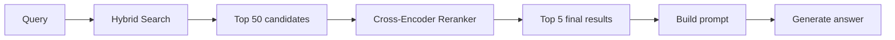
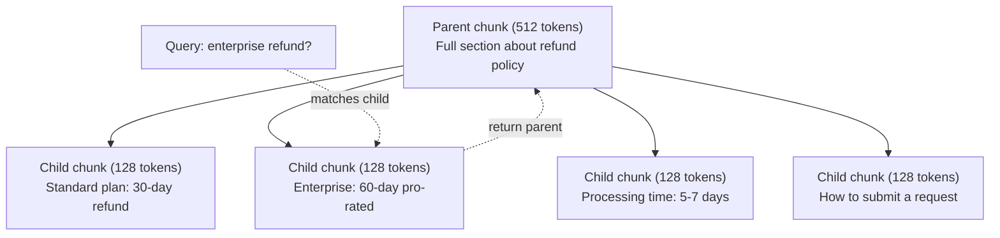
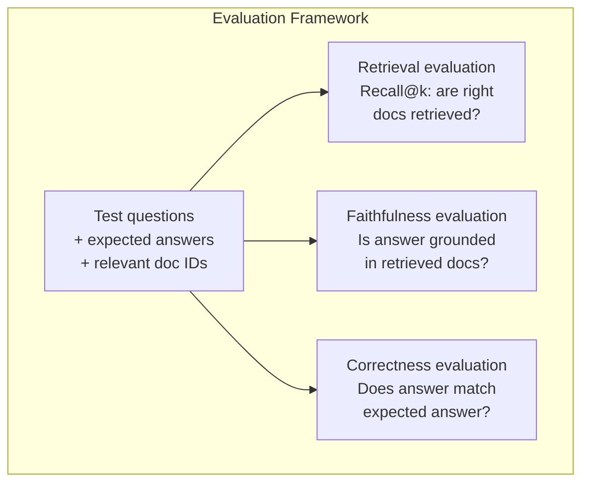

# Advanced RAG (Chunking, Reranking, Hybrid Search) / 高级 RAG：Chunking、Reranking 与 Hybrid Search

> 基础 RAG 只是 retrieve top-k 最相似 chunks。简单问题上它能工作；遇到 multi-hop reasoning、ambiguous queries 和 large corpora 就会崩。Advanced RAG 是“10 份文档上的 demo”和“1000 万份文档上的系统”之间的差距。

**Type / 类型：** Build / 构建
**Languages / 语言：** Python
**Prerequisites / 前置知识：** Phase 11, Lesson 06 (RAG)
**Time / 时间：** 约 90 分钟
**Related / 相关：** Phase 5 · 23 (Chunking Strategies for RAG) 覆盖全部六种 chunking algorithms，包括 recursive、semantic、sentence、parent-document、late chunking、contextual retrieval，并配有 Vectara/Anthropic benchmarks。本课在其上继续构建：hybrid search、reranking、query transformation。

## Learning Objectives / 学习目标

- 实现能保留 document structure 和 context 的 advanced chunking strategies（semantic、recursive、parent-child）
- 构建 hybrid search pipeline，组合 BM25 keyword matching、semantic vector search 和 cross-encoder reranker
- 应用 query transformation techniques（HyDE、multi-query、step-back），改善 ambiguous 或 complex questions 的 retrieval
- 诊断并修复常见 RAG failures：retrieved wrong chunk、answer not in context、multi-hop reasoning breakdown

## The Problem / 问题

你在 Lesson 06 构建了 basic RAG pipeline。它能处理小 corpus 上的直白问题。现在试试这些：

**Ambiguous query / 歧义查询**：“What was revenue last quarter?” Semantic search 返回 revenue strategy、revenue projections、CFO 关于 revenue growth 的看法。它们都和 “revenue” 语义相似，却都不包含实际数字。正确 chunk 写的是 “$47.2M in Q3 2025”，但用了 “earnings” 而不是 “revenue”。Embedding model 认为 “revenue strategy” 比 “Q3 earnings were $47.2M” 更接近 query。

**Multi-hop question / 多跳问题**：“Which team had the highest customer satisfaction score improvement?” 这要求找到每个 team 的 satisfaction scores、比较它们、找出最大值。没有任何单个 chunk 包含答案。信息散落在各个 team reports 中。

**Large corpus problem / 大规模语料问题**：你有 200 万 chunks。正确答案在 chunk #1,847,293。Top-5 retrieval 拉到的是 chunks #14、#89,201、#1,200,000、#44、#901,333。它们在 embedding space 里接近，但都不包含答案。在这个规模下，approximate nearest neighbor search 的误差足以把相关结果挤出 top-k。

Basic RAG 失败的原因是 vector similarity 不等于 relevance。一个 chunk 可以在语义上类似 query，却不能帮助回答问题。Advanced RAG 用四类技术处理这个问题：hybrid search（加入 keyword matching）、reranking（更仔细地给 candidates 打分）、query transformation（搜索前修正 query）、better chunking（以正确粒度 retrieve）。

## The Concept / 概念

### Hybrid Search: Semantic + Keyword / Hybrid search：语义 + 关键词

Semantic search（vector similarity）擅长理解 meaning。“How do I cancel my subscription?” 能匹配 “Steps to terminate your plan”，即使没有共享词。但它会漏掉 exact matches。“Error code E-4021” 可能无法匹配包含 “E-4021” 的 chunk，因为 embedding model 把它当成 noise。

Keyword search（BM25）正好相反。它擅长 exact matches。“E-4021” 完美匹配。但如果 document 写的是 “terminate your plan”，“cancel my subscription” 会返回零结果。

Hybrid search 两者都跑，然后合并结果。

**BM25**（Best Matching 25）是标准 keyword search algorithm。自 1990 年代以来一直是搜索引擎核心。公式如下：

```
BM25(q, d) = sum over terms t in q:
    IDF(t) * (tf(t,d) * (k1 + 1)) / (tf(t,d) + k1 * (1 - b + b * |d| / avgdl))
```

其中 tf(t,d) 是 term t 在 document d 中的 frequency，IDF(t) 是 inverse document frequency，|d| 是 document length，avgdl 是 average document length，k1 控制 term frequency saturation（默认 1.2），b 控制 length normalization（默认 0.75）。

用白话说：当 documents 包含 query terms（尤其是 rare terms）时，BM25 给更高分，但 repeated terms 有 diminishing returns。一个包含 “revenue” 50 次的 document，不会比只包含一次的 document 相关 50 倍。

### Reciprocal Rank Fusion (RRF) / Reciprocal rank fusion

你有两份 ranked lists：一份来自 vector search，一份来自 BM25。怎么合并？标准做法是 Reciprocal Rank Fusion。

```
RRF_score(d) = sum over rankings R:
    1 / (k + rank_R(d))
```

其中 k 是常数（通常 60），避免 top-ranked result 过度支配。

一个 document 在 vector search 排 #1，在 BM25 排 #5，得分是：1/(60+1) + 1/(60+5) = 0.0164 + 0.0154 = 0.0318

一个 document 在 vector search 排 #3，在 BM25 排 #2，得分是：1/(60+3) + 1/(60+2) = 0.0159 + 0.0161 = 0.0320

RRF 会自然平衡两种信号。两个 list 中都排名靠前的 document 得分最高。只在一个 list 中排名 #1、另一个 list 缺席的 document 得到中等分数。它很稳健，因为用的是 ranks 而不是 raw scores，所以两个系统 score distribution 的差异不重要。

### Reranking / 重排序

Retrieval（vector、keyword 或 hybrid）很快但不够精确。它使用 bi-encoders：query 和每个 document 独立 embed，再比较。Embeddings 可计算一次并缓存。这能扩展到数百万 documents。

Reranking 使用 cross-encoders：query 和 candidate document 一起输入模型，输出 relevance score。模型能同时看到两段文本，捕捉它们之间的细粒度交互。即使 bi-encoder 漏掉连接，cross-encoder 也能理解 “What were Q3 earnings?” 与包含 “$47.2M in Q3” 的 chunk 高度相关。

Trade-off：cross-encoders 比 bi-encoders 慢 100–1000x，因为它们联合处理 query-document pair。你无法为百万 documents 预计算 cross-encoder scores。方案是：先 retrieve 更大的 candidate set（hybrid search top-50），再用 cross-encoder rerank 到 final top-5。



常见 reranking models（2026 lineup）：
- Cohere Rerank 3.5：managed API、multilingual、在 mixed corpora 上 recall gain 最好
- Voyage rerank-2.5：managed API，hosted options 中 latency 最低
- Jina-Reranker-v2 Multilingual：open-weight，100+ languages
- bge-reranker-v2-m3：open-weight，强 baseline
- cross-encoder/ms-marco-MiniLM-L-6-v2：open-weight，可在 CPU 上做 prototyping
- ColBERTv2 / Jina-ColBERT-v2：late-interaction multi-vector rerankers，scoring time 是 O(tokens) 而不是 O(docs)

### Query Transformation / Query transformation

有时问题不在 retrieval，而在 query 本身。“What was that thing about the new policy change?” 是很糟糕的 search query。它没有具体 terms，embedding 也很模糊。没有任何 retrieval system 能从中找到正确 documents。

**Query rewriting**：把用户 query 改写成更好的 search query。LLM 可以做这件事：

```
User: "What was that thing about the new policy change?"
Rewritten: "Recent policy changes and updates"
```

**HyDE (Hypothetical Document Embeddings)**：不要直接用 query 搜索，而是先生成一个 hypothetical answer，embed 它，再搜索相似真实 documents。

```
Query: "What is the refund policy for enterprise?"
Hypothetical answer: "Enterprise customers are eligible for a full refund
within 60 days of purchase. Refunds are pro-rated based on the remaining
subscription period and processed within 5-7 business days."
```

Embed 这个 hypothetical answer，并搜索与它相似的真实 documents。直觉是：hypothetical answer 在 embedding space 里比原始 question 更接近真实答案。Questions 和 answers 的语言结构不同。生成 hypothetical answer 可以弥合 “question space” 和 “answer space” 的差距。

HyDE 会在 retrieval 前增加一次 LLM call，latency 增加 500–2000ms。当 raw queries retrieval quality 很差时值得使用。

### Parent-Child Chunking / Parent-child chunking

标准 chunking 被迫做 trade-off：小 chunks 用于 precise retrieval，大 chunks 提供 sufficient context。Parent-child chunking 消除了这个 trade-off。

Index small chunks（128 tokens）用于 retrieval。当 small chunk 被 retrieve 时，返回它的 parent chunk（512 tokens）给 prompt。Small chunk 精确匹配 query。Parent chunk 为 LLM 生成好答案提供足够 context。



Query “enterprise refund?” 精确匹配 child chunk C2。但 prompt 收到的是完整 parent chunk P，包含 processing time 和 submission process 等上下文。

### Metadata Filtering / Metadata filtering

运行 vector search 前，先按 metadata 过滤 corpus：date、source、category、author、language。这会减少 search space，并防止无关结果。

“What changed in the security policy last month?” 应该只搜索最近 30 天 security category 的 documents。没有 metadata filtering 时，你会搜索整个 corpus，可能 retrieve 到一份 2 年前语义相似的 security document。

Production RAG systems 会把 metadata 与每个 chunk 一起存储：source document、creation date、category、author、version。Vector databases 支持在 similarity search 前按 metadata pre-filtering，这对 scale performance 很关键。

### Evaluation / 评估

你构建了 RAG system。如何知道它有效？三个指标：

**Retrieval relevance (Recall@k)**：对一组有已知 relevant documents 的 test questions，相关 documents 有多少比例出现在 top-k results 中？如果某问题的答案在 chunk #47，chunk #47 是否出现在 top-5？

**Faithfulness**：generated answer 是否 grounded in retrieved documents？如果 retrieved chunks 写 “60-day refund window”，模型回答 “90-day refund window”，这就是 faithfulness failure。模型虽然有正确 context，仍然 hallucinated。

**Answer correctness**：generated answer 是否匹配 expected answer？这是 end-to-end metric，组合了 retrieval quality 和 generation quality。

一个简单 faithfulness check：把 generated answer 中每个 claim 拿出来，验证它是否实质上出现在 retrieved chunks 中。如果 answer 包含任何 retrieved chunk 中没有的事实，它很可能 hallucinated。



## Build It / 动手构建

### Step 1: BM25 Implementation / 第 1 步：BM25 实现

```python
import math
from collections import Counter

class BM25:
    def __init__(self, k1=1.2, b=0.75):
        self.k1 = k1
        self.b = b
        self.docs = []
        self.doc_lengths = []
        self.avg_dl = 0
        self.doc_freqs = {}
        self.n_docs = 0

    def index(self, documents):
        self.docs = documents
        self.n_docs = len(documents)
        self.doc_lengths = []
        self.doc_freqs = {}

        for doc in documents:
            words = doc.lower().split()
            self.doc_lengths.append(len(words))
            unique_words = set(words)
            for word in unique_words:
                self.doc_freqs[word] = self.doc_freqs.get(word, 0) + 1

        self.avg_dl = sum(self.doc_lengths) / self.n_docs if self.n_docs else 1

    def score(self, query, doc_idx):
        query_words = query.lower().split()
        doc_words = self.docs[doc_idx].lower().split()
        doc_len = self.doc_lengths[doc_idx]
        word_counts = Counter(doc_words)
        score = 0.0

        for term in query_words:
            if term not in word_counts:
                continue
            tf = word_counts[term]
            df = self.doc_freqs.get(term, 0)
            idf = math.log((self.n_docs - df + 0.5) / (df + 0.5) + 1)
            numerator = tf * (self.k1 + 1)
            denominator = tf + self.k1 * (1 - self.b + self.b * doc_len / self.avg_dl)
            score += idf * numerator / denominator

        return score

    def search(self, query, top_k=10):
        scores = [(i, self.score(query, i)) for i in range(self.n_docs)]
        scores.sort(key=lambda x: x[1], reverse=True)
        return scores[:top_k]
```

### Step 2: Reciprocal Rank Fusion / 第 2 步：Reciprocal rank fusion

```python
def reciprocal_rank_fusion(ranked_lists, k=60):
    scores = {}
    for ranked_list in ranked_lists:
        for rank, (doc_id, _) in enumerate(ranked_list):
            if doc_id not in scores:
                scores[doc_id] = 0.0
            scores[doc_id] += 1.0 / (k + rank + 1)
    fused = sorted(scores.items(), key=lambda x: x[1], reverse=True)
    return fused
```

### Step 3: Hybrid Search Pipeline / 第 3 步：Hybrid search pipeline

```python
def hybrid_search(query, chunks, vector_embeddings, vocab, idf, bm25_index, top_k=5, fusion_k=60):
    query_emb = tfidf_embed(query, vocab, idf)
    vector_results = search(query_emb, vector_embeddings, top_k=top_k * 3)
    bm25_results = bm25_index.search(query, top_k=top_k * 3)
    fused = reciprocal_rank_fusion([vector_results, bm25_results], k=fusion_k)
    return fused[:top_k]
```

### Step 4: Simple Reranker / 第 4 步：简单 reranker

生产中会使用 cross-encoder model。这里我们构建一个 reranker，用 word overlap、term importance 和 phrase matching 来给 query-document relevance 打分。

```python
def rerank(query, candidates, chunks):
    query_words = set(query.lower().split())
    stop_words = {"the", "a", "an", "is", "are", "was", "were", "what", "how",
                  "why", "when", "where", "do", "does", "for", "of", "in", "to",
                  "and", "or", "on", "at", "by", "it", "its", "this", "that",
                  "with", "from", "be", "has", "have", "had", "not", "but"}
    query_terms = query_words - stop_words

    scored = []
    for doc_id, initial_score in candidates:
        chunk = chunks[doc_id].lower()
        chunk_words = set(chunk.split())

        term_overlap = len(query_terms & chunk_words)

        query_bigrams = set()
        q_list = [w for w in query.lower().split() if w not in stop_words]
        for i in range(len(q_list) - 1):
            query_bigrams.add(q_list[i] + " " + q_list[i + 1])
        bigram_matches = sum(1 for bg in query_bigrams if bg in chunk)

        position_boost = 0
        for term in query_terms:
            pos = chunk.find(term)
            if pos != -1 and pos < len(chunk) // 3:
                position_boost += 0.5

        rerank_score = (
            term_overlap * 1.0
            + bigram_matches * 2.0
            + position_boost
            + initial_score * 5.0
        )
        scored.append((doc_id, rerank_score))

    scored.sort(key=lambda x: x[1], reverse=True)
    return scored
```

### Step 5: HyDE (Hypothetical Document Embeddings) / 第 5 步：HyDE

```python
def hyde_generate_hypothesis(query):
    templates = {
        "what": "The answer to '{query}' is as follows: Based on our documentation, {topic} involves specific policies and procedures that define how the process works.",
        "how": "To address '{query}': The process involves several steps. First, you need to initiate the request. Then, the system processes it according to the defined rules.",
        "default": "Regarding '{query}': Our records indicate specific details and policies related to this topic that provide a comprehensive answer."
    }
    query_lower = query.lower()
    if query_lower.startswith("what"):
        template = templates["what"]
    elif query_lower.startswith("how"):
        template = templates["how"]
    else:
        template = templates["default"]

    topic_words = [w for w in query.lower().split()
                   if w not in {"what", "is", "the", "how", "do", "does", "a", "an",
                                "for", "of", "to", "in", "on", "at", "by", "and", "or"}]
    topic = " ".join(topic_words) if topic_words else "this topic"

    return template.format(query=query, topic=topic)


def hyde_search(query, chunks, vector_embeddings, vocab, idf, top_k=5):
    hypothesis = hyde_generate_hypothesis(query)
    hypothesis_emb = tfidf_embed(hypothesis, vocab, idf)
    results = search(hypothesis_emb, vector_embeddings, top_k)
    return results, hypothesis
```

### Step 6: Parent-Child Chunking / 第 6 步：Parent-child chunking

```python
def create_parent_child_chunks(text, parent_size=200, child_size=50):
    words = text.split()
    parents = []
    children = []
    child_to_parent = {}

    parent_idx = 0
    start = 0
    while start < len(words):
        parent_end = min(start + parent_size, len(words))
        parent_text = " ".join(words[start:parent_end])
        parents.append(parent_text)

        child_start = start
        while child_start < parent_end:
            child_end = min(child_start + child_size, parent_end)
            child_text = " ".join(words[child_start:child_end])
            child_idx = len(children)
            children.append(child_text)
            child_to_parent[child_idx] = parent_idx
            child_start += child_size

        parent_idx += 1
        start += parent_size

    return parents, children, child_to_parent
```

### Step 7: Faithfulness Evaluation / 第 7 步：Faithfulness evaluation

```python
def evaluate_faithfulness(answer, retrieved_chunks):
    answer_sentences = [s.strip() for s in answer.split(".") if len(s.strip()) > 10]
    if not answer_sentences:
        return 1.0, []

    grounded = 0
    ungrounded = []
    context = " ".join(retrieved_chunks).lower()

    for sentence in answer_sentences:
        words = set(sentence.lower().split())
        stop_words = {"the", "a", "an", "is", "are", "was", "were", "and", "or",
                      "to", "of", "in", "for", "on", "at", "by", "it", "this", "that"}
        content_words = words - stop_words
        if not content_words:
            grounded += 1
            continue

        matched = sum(1 for w in content_words if w in context)
        ratio = matched / len(content_words) if content_words else 0

        if ratio >= 0.5:
            grounded += 1
        else:
            ungrounded.append(sentence)

    score = grounded / len(answer_sentences) if answer_sentences else 1.0
    return score, ungrounded


def evaluate_retrieval_recall(queries_with_relevant, retrieval_fn, k=5):
    total_recall = 0.0
    results = []

    for query, relevant_indices in queries_with_relevant:
        retrieved = retrieval_fn(query, k)
        retrieved_indices = set(idx for idx, _ in retrieved)
        relevant_set = set(relevant_indices)
        hits = len(retrieved_indices & relevant_set)
        recall = hits / len(relevant_set) if relevant_set else 1.0
        total_recall += recall
        results.append({
            "query": query,
            "recall": recall,
            "hits": hits,
            "total_relevant": len(relevant_set)
        })

    avg_recall = total_recall / len(queries_with_relevant) if queries_with_relevant else 0
    return avg_recall, results
```

## Use It / 应用它

使用真实 cross-encoder 做 reranking：

```python
from sentence_transformers import CrossEncoder

reranker = CrossEncoder("cross-encoder/ms-marco-MiniLM-L-6-v2")

def rerank_with_cross_encoder(query, candidates, chunks, top_k=5):
    pairs = [(query, chunks[doc_id]) for doc_id, _ in candidates]
    scores = reranker.predict(pairs)
    scored = list(zip([doc_id for doc_id, _ in candidates], scores))
    scored.sort(key=lambda x: x[1], reverse=True)
    return scored[:top_k]
```

使用 Cohere managed reranker：

```python
import cohere

co = cohere.Client()

def rerank_with_cohere(query, candidates, chunks, top_k=5):
    docs = [chunks[doc_id] for doc_id, _ in candidates]
    response = co.rerank(
        model="rerank-english-v3.0",
        query=query,
        documents=docs,
        top_n=top_k
    )
    return [(candidates[r.index][0], r.relevance_score) for r in response.results]
```

使用真实 LLM 做 HyDE：

```python
import anthropic

client = anthropic.Anthropic()

def hyde_with_llm(query):
    response = client.messages.create(
        model="claude-sonnet-4-20250514",
        max_tokens=256,
        messages=[{
            "role": "user",
            "content": f"Write a short paragraph that would be a good answer to this question. Do not say you don't know. Just write what the answer would look like.\n\nQuestion: {query}"
        }]
    )
    return response.content[0].text
```

使用 Weaviate 做 production hybrid search：

```python
import weaviate

client = weaviate.connect_to_local()

collection = client.collections.get("Documents")
response = collection.query.hybrid(
    query="enterprise refund policy",
    alpha=0.5,
    limit=10
)
```

`alpha` 参数控制平衡：0.0 = pure keyword（BM25），1.0 = pure vector，0.5 = equal weight。多数 production systems 使用 0.3 到 0.7 之间的 alpha。

## Ship It / 交付它

本课产出：
- `outputs/prompt-advanced-rag-debugger.md`：一个 prompt，用于诊断并修复 RAG quality issues
- `outputs/skill-advanced-rag.md`：一个 skill，用 hybrid search 和 reranking 构建 production-grade RAG

## Exercises / 练习

1. 在 sample documents 上比较 BM25、vector search 和 hybrid search。对 5 个 test queries，记录哪种方式把最相关 chunk 放在 position #1。Hybrid search 应该至少赢 5 个中的 3 个。

2. 实现 metadata filter。给每个 document 添加 `category` field（security、billing、api、product）。运行 vector search 前，只过滤到 relevant category。用 “What encryption is used?” 测试，并确认它只搜索 security-category chunks。

3. 用 Lesson 06 的 simple generate function 构建完整 HyDE pipeline。对全部 5 个 test queries，比较 direct query search 与 HyDE search 的 retrieval quality（top-3 relevance）。HyDE 应该改善 vague queries。

4. 在 sample documents 上实现 parent-child chunking strategy。使用 child_size=30、parent_size=100。用 child chunks 搜索，但在 prompt 中返回 parent chunks。将 generated answers 与 chunk_size=50 的 standard chunking 结果对比。

5. 创建 evaluation dataset：10 个 questions 和已知 answer chunks。测量 (a) vector search only，(b) BM25 only，(c) hybrid search，(d) hybrid + reranking 的 Recall@3、Recall@5、Recall@10。画出结果，识别 reranking 帮助最大的位置。

## Key Terms / 关键术语

| 术语 | 常见说法 | 实际含义 |
|------|----------------|----------------------|
| BM25 | “Keyword search” | 基于 term frequency、inverse document frequency 和 document length normalization 为 documents 打分的 probabilistic ranking algorithm。 |
| Hybrid search | “Best of both worlds” | 并行运行 semantic（vector）search 和 keyword（BM25）search，再用 rank fusion 合并结果。 |
| Reciprocal Rank Fusion | “合并 ranked lists” | 对每个 document 在所有 ranked lists 中求和 1/(k + rank)，组合多个排名。 |
| Reranking | “Second pass scoring” | 使用更昂贵的 cross-encoder model，对 initial retrieval 的 candidate set 重新打分。 |
| Cross-encoder | “Joint query-document model” | 把 query 和 document 作为单个 input，输出 relevance score；比 bi-encoders 更准，但太慢，不能全库搜索。 |
| Bi-encoder | “Independent embedding model” | 独立 embed queries 和 documents；因为 embeddings 可预计算，所以快，但准确率低于 cross-encoders。 |
| HyDE | “用假答案搜索” | 为 query 生成 hypothetical answer，embed 它，并搜索与之相似的真实 documents。 |
| Parent-child chunking | “小块搜索，大块进 context” | Index small chunks 以精确 retrieval，但返回 larger parent chunk 提供足够 context。 |
| Metadata filtering | “搜索前缩窄范围” | 运行 vector search 前按 attributes（date、source、category）过滤 documents，减少 search space。 |
| Faithfulness | “答案是否有依据” | Generated answer 是否由 retrieved documents 支持，而不是从模型训练数据中 hallucinate。 |

## Further Reading / 延伸阅读

- Robertson & Zaragoza, "The Probabilistic Relevance Framework: BM25 and Beyond" (2009) -- BM25 的权威参考，解释公式背后的 probabilistic foundations。
- Cormack et al., "Reciprocal Rank Fusion Outperforms Condorcet and Individual Rank Learning Methods" (2009) -- RRF 原始 paper，展示它优于更复杂 fusion methods。
- Gao et al., "Precise Zero-Shot Dense Retrieval without Relevance Labels" (2022) -- HyDE paper，证明 hypothetical document embeddings 能在没有训练数据的情况下改善 retrieval。
- Nogueira & Cho, "Passage Re-ranking with BERT" (2019) -- 展示在 BM25 之上使用 cross-encoder reranking 能显著提升 retrieval quality。
- [Khattab et al., "DSPy: Compiling Declarative Language Model Calls into Self-Improving Pipelines" (2023)](https://arxiv.org/abs/2310.03714) -- 把 prompt construction 和 weight selection 看作 retrieval pipelines 上的 optimization problem；想从 “prompt LLMs” 进入 “program LLMs” 时读它。
- [Edge et al., "From Local to Global: A Graph RAG Approach to Query-Focused Summarization" (Microsoft Research 2024)](https://arxiv.org/abs/2404.16130) -- GraphRAG paper：entity-relation extraction + Leiden community detection 做 query-focused summarization；区分 global vs local retrieval。
- [Asai et al., "Self-RAG: Learning to Retrieve, Generate, and Critique through Self-Reflection" (ICLR 2024)](https://arxiv.org/abs/2310.11511) -- 带 reflection tokens 的 self-evaluating RAG；静态 retrieve-then-generate 之后的 agentic frontier。
- [LangChain Query Construction blog](https://blog.langchain.dev/query-construction/) -- 如何把 natural-language queries 转成 structured database queries（Text-to-SQL、Cypher），作为 pre-retrieval step。
