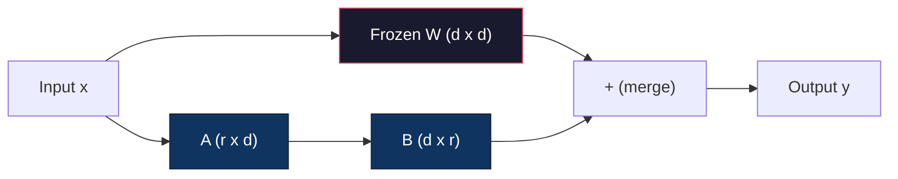
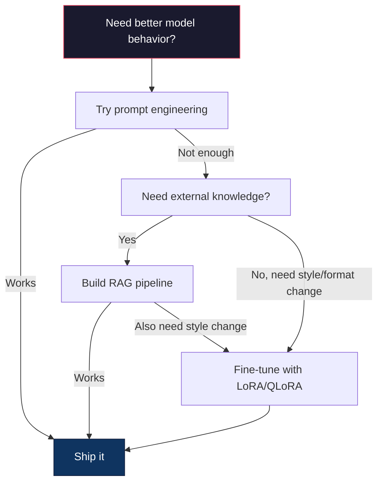

# Fine-Tuning with LoRA & QLoRA / 使用 LoRA 与 QLoRA 微调

> Full fine-tuning 一个 7B model 需要 56GB VRAM。你没有，大多数公司也没有。LoRA 让你通过训练不到 1% 的参数，在 6GB 显存里微调同一个模型。这不是妥协：它在多数任务上能匹配 full fine-tuning quality。整个 open-source fine-tuning ecosystem 都跑在这个技巧上。

**Type / 类型：** Build / 构建
**Languages / 语言：** Python
**Prerequisites / 前置知识：** Phase 10, Lesson 06 (Instruction Tuning / SFT)
**Time / 时间：** 约 75 分钟
**Related / 相关：** Phase 10 从零覆盖 SFT/DPO loops。本课把这些 loop 接入 2026 PEFT toolkits（PEFT、TRL、Unsloth、Axolotl、LLaMA-Factory）。

## Learning Objectives / 学习目标

- 通过向 pretrained model 的 attention layers 注入 low-rank adapter matrices（A 和 B）实现 LoRA
- 计算 LoRA 相比 full fine-tuning 的参数节省：rank r、d_model dimensions 时训练 2*r*d 参数，而不是 d^2
- 使用 QLoRA（4-bit quantized base + LoRA adapters）微调模型，使其适配 consumer GPU memory
- 将 LoRA weights merge 回 base model 用于部署，并比较带 adapters 与不带 adapters 的 inference speed

## The Problem / 问题

你有一个 base model：Llama 3 8B。你希望它用公司的语气回答 customer support tickets。SFT 是答案。但 SFT 有成本问题。

Full fine-tuning 会更新模型每个参数。Llama 3 8B 有 80 亿参数。fp16 中每个参数 2 bytes。光加载 weights 就要 16GB。训练时还需要 gradients（16GB）、Adam optimizer states（momentum + variance 32GB）和 activations。单个 8B model 总计大约 56GB VRAM。

一张 A100 80GB 勉强能装下。两张 A100 在 cloud providers 上每小时 $3–4。对 50,000 examples 训练 3 epochs 需要 6–10 小时。每次 experiment 要 $30–40。为了调对 hyperparameters 跑 10 次，就已经在部署前花掉 $400。

扩展到 Llama 3 70B，数字会变得荒唐。仅 weights 就 140GB。你需要 cluster，每次 experiment $100+。

还有更深的问题。Full fine-tuning 修改模型的每个 weight。如果你在 customer support data 上 fine-tune，可能会损伤模型的 general capabilities。这叫 catastrophic forgetting。模型在你的任务上变强，在其它任务上变差。

你需要一种方法，训练更少参数、使用更少 memory，并且不破坏模型已有知识。

## The Concept / 概念

### LoRA: Low-Rank Adaptation / LoRA：低秩适配

Microsoft 的 Edward Hu 及同事在 2021 年 6 月发布 LoRA。论文洞察是：fine-tuning 时的 weight updates 具有 low intrinsic rank。你不需要更新 4096x4096 weight matrix 中全部 16.7 million parameters。Update 中有用的信息可以由 rank 16 或 32 的矩阵捕获。

数学如下。标准 linear layer 计算：

```
y = Wx
```

其中 W 是 d_out x d_in matrix。对 4096x4096 attention projection 来说，是 16,777,216 个参数。

LoRA freeze W，并加入 low-rank decomposition：

```
y = Wx + BAx
```

其中 B 是 (d_out x r)，A 是 (r x d_in)。Rank r 远小于 d，通常是 8、16 或 32。

对 4096x4096 layer，r=16 时：
- Original parameters：4096 x 4096 = 16,777,216
- LoRA parameters：(4096 x 16) + (16 x 4096) = 65,536 + 65,536 = 131,072
- Reduction：131,072 / 16,777,216 = 0.78%

你只训练 0.78% 的参数，却获得 95–100% 的质量。



A 用 random Gaussian 初始化。B 初始化为 zero。这意味着 LoRA contribution 一开始为 zero：模型从原始行为开始训练，并逐渐学习 adaptation。

### The Scaling Factor: Alpha / Scaling factor：Alpha

LoRA 引入 scaling factor alpha，控制 low-rank update 对 output 的影响：

```
y = Wx + (alpha / r) * BAx
```

当 alpha = r，scaling 是 1x。当 alpha = 2r（常见默认），scaling 是 2x。这个 hyperparameter 独立于 base learning rate，控制 LoRA path 的 learning rate。

实践建议：
- alpha = 2 * rank 是常见 community convention（原始 paper 多数实验使用 alpha = rank）
- alpha = rank 给出 1x scaling，更保守但稳定
- 更高 alpha 意味着每步更大 update，可能加速收敛，也可能导致不稳定

### Where to Apply LoRA / LoRA 应该加在哪里

Transformer 有很多 linear layers。你不需要给所有层加 LoRA。原始论文测试了不同组合：

| Target Layers | Trainable Params (7B) | Quality |
|--------------|----------------------|---------|
| q_proj only | 4.7M | Good |
| q_proj + v_proj | 9.4M | Better |
| q_proj + k_proj + v_proj + o_proj | 18.9M | Best for attention |
| All linear (attention + MLP) | 37.7M | Marginal gain, 2x params |

多数任务的最佳折中点：q_proj + v_proj。这会针对 self-attention 中的 query 和 value projections，控制模型 attend 什么，以及提取什么信息。为 code generation 等复杂任务添加 MLP layers 有帮助，但对简单任务来说会让 parameter count 翻倍，收益递减。

### Rank Selection / Rank 选择

Rank r 控制 adaptation 的 expressiveness：

| Rank | Trainable Params (per layer) | Best For |
|------|---------------------------|----------|
| 4 | 32,768 | Simple classification, sentiment |
| 8 | 65,536 | Single-domain Q&A, summarization |
| 16 | 131,072 | Multi-domain tasks, instruction following |
| 32 | 262,144 | Complex reasoning, code generation |
| 64 | 524,288 | Diminishing returns for most tasks |
| 128 | 1,048,576 | Rarely justified |

Hu et al. 表明，r=4 对简单任务已经捕获大部分 adaptation。r=8 和 r=16 是实践中最常见选择。超过 r=64 很少提升 quality，并开始丢掉 LoRA 的 memory advantage。

### QLoRA: 4-Bit Quantization + LoRA / QLoRA：4-bit quantization + LoRA

University of Washington 的 Tim Dettmers 及同事在 2023 年 5 月发布 QLoRA。想法是：把 frozen base model quantize 到 4-bit precision，再在其上挂 fp16 LoRA adapters。

这会大幅改变 memory equation：

| Method | Weight Memory (7B) | Training Memory (7B) | GPU Required |
|--------|-------------------|---------------------|-------------|
| Full fine-tune (fp16) | 14GB | ~56GB | 1x A100 80GB |
| LoRA (fp16 base) | 14GB | ~18GB | 1x A100 40GB |
| QLoRA (4-bit base) | 3.5GB | ~6GB | 1x RTX 3090 24GB |

QLoRA 有三项技术贡献：

**NF4 (Normal Float 4-bit)**：一种专为 neural network weights 设计的新数据类型。Neural network weights 大致服从 normal distribution。NF4 把 16 个 quantization levels 放在 standard normal distribution 的 quantiles 上。对 normally distributed data 来说，这是 information-theoretically optimal。它比 uniform 4-bit quantization（INT4）或标准 Float4 损失更少信息。

**Double quantization**：Quantization constants 本身也占 memory。每 64 个 weights 需要一个 fp32 scale factor（4 bytes）。对 7B model，这是额外 0.4GB。Double quantization 把这些 constants 再 quantize 到 fp8，把 overhead 降到 0.1GB。幅度不大，但会累积。

**Paged optimizers**：训练期间，长序列上的 optimizer states（Adam 的 momentum 和 variance）可能超过 GPU memory。Paged optimizers 使用 NVIDIA unified memory，在 GPU memory 不足时自动把 optimizer states page 到 CPU RAM，需要时再 page 回来。它防止 OOM crash，代价是一些 throughput。

### The Quality Question / 质量问题

减少参数或 quantize base 会伤害 quality 吗？多篇论文结果如下：

| Method | MMLU (5-shot) | MT-Bench | HumanEval |
|--------|--------------|----------|-----------|
| Full fine-tune (Llama 2 7B) | 48.3 | 6.72 | 14.6 |
| LoRA r=16 | 47.9 | 6.68 | 14.0 |
| QLoRA r=16 (NF4) | 47.5 | 6.61 | 13.4 |
| QLoRA r=64 (NF4) | 48.1 | 6.70 | 14.2 |

LoRA r=16 在多数 benchmarks 上与 full fine-tuning 差距不到 1%。QLoRA r=16 又损失一点点。QLoRA r=64 基本匹配 full fine-tuning，却少用 90% memory。

### Real-World Costs / 真实成本

在 50,000 examples 上 fine-tune Llama 3 8B（3 epochs）：

| Method | GPU | Time | Cost |
|--------|-----|------|------|
| Full fine-tune | 2x A100 80GB | 8 hours | ~$32 |
| LoRA r=16 | 1x A100 40GB | 4 hours | ~$8 |
| QLoRA r=16 | 1x RTX 4090 24GB | 6 hours | ~$5 |
| QLoRA r=16 (Unsloth) | 1x RTX 4090 24GB | 2.5 hours | ~$2 |
| QLoRA r=16 | 1x T4 16GB | 12 hours | ~$4 |

单张 consumer GPU 上的 QLoRA 成本低于一顿午餐。这就是 2023 年 open-weight fine-tuning community 爆发的原因，也是 2026 年下面每个 training framework 默认支持 QLoRA 的原因。

### The 2026 PEFT stack / 2026 PEFT 技术栈

| Framework | What it is | Pick when |
|-----------|-----------|-----------|
| **Hugging Face PEFT** | The canonical LoRA/QLoRA/DoRA/IA3 library | You want raw control and your training loop is already on `transformers.Trainer` |
| **TRL** | HF's reinforcement-from-feedback trainers (SFT, DPO, GRPO, PPO, ORPO) | You need DPO/GRPO after SFT; built on top of PEFT |
| **Unsloth** | Triton-kernel rewrite of the forward/backward pass | You want 2-5x speedup + half the VRAM with no accuracy loss; Llama/Mistral/Qwen family |
| **Axolotl** | YAML-config wrapper over PEFT + TRL + DeepSpeed + Unsloth | You want reproducible, version-controlled training runs |
| **LLaMA-Factory** | GUI/CLI/API over PEFT + TRL | You want zero-code fine-tuning; 100+ model families supported |
| **torchtune** | Native PyTorch recipes, no `transformers` dep | You want minimal deps and your org already standardizes on PyTorch |

经验规则：研究或一次性实验 → PEFT。可重复生产 pipeline → Axolotl with Unsloth kernels enabled。快速 throwaway prototyping → LLaMA-Factory。

### Merging Adapters / 合并 adapters

训练完成后，你有两样东西：frozen base model 和一个小 LoRA adapter（通常 10–100MB）。你可以：

1. **Keep them separate / 分开保留**：加载 base model，再在上面加载 adapter。不同任务切换不同 adapters。这是用一个 base model 服务多个 fine-tuned variants 的方式。

2. **Merge them permanently / 永久合并**：计算 W' = W + (alpha/r) * BA，并把结果保存成新的 full model。Merged model 和原始模型一样大。没有 inference overhead，也不用管理 adapter。

为多个任务服务（customer support adapter、code adapter、translation adapter）时，分开保留。部署单个 specialized model 时，merge。

组合多个 adapters 的 advanced merging techniques：

- **TIES-Merging**（Yadav et al. 2023）：剪掉 small-magnitude parameters，解决 sign conflicts，然后 merge。减少 adapters 之间的 interference。
- **DARE**（Yu et al. 2023）：merge 前随机 drop adapter parameters，并 rescale 剩余参数。组合 capabilities 时意外有效。
- **Task arithmetic**：直接加减 adapter weights。加入 “code” adapter 和 “math” adapter 往往会产生两者都擅长的模型。

### When NOT to Fine-Tune / 什么时候不要 fine-tune

Fine-tuning 是第三选择，不是第一选择。

**First: prompt engineering.** 写更好的 system prompt。加入 few-shot examples。使用 chain-of-thought。这不花钱，只要几分钟。如果 prompting 已经能达成 80%，你很可能不需要 fine-tune。

**Second: RAG.** 如果模型需要了解你的具体数据（documents、knowledge base、product catalog），retrieval 比把知识烘进 weights 更便宜、更可维护。见 Lesson 06。

**Third: fine-tuning.** 当你需要模型采用特定 style、format 或 reasoning pattern，而 prompting 无法实现时使用。需要稳定 structured output 时使用。需要把大模型 distill 成小模型时使用。Latency 很关键、无法承担 few-shot prompting 额外 tokens 时使用。



```figure
lora-params
```

## Build It / 动手构建

我们用 pure PyTorch 从零实现 LoRA。不用库，不用 magic。你会构建 LoRA layer，把它注入 model，训练它，再把 weights merge 回去。

### Step 1: The LoRA Layer / 第 1 步：LoRA layer

```python
import torch
import torch.nn as nn
import math

class LoRALayer(nn.Module):
    def __init__(self, in_features, out_features, rank=8, alpha=16):
        super().__init__()
        self.rank = rank
        self.alpha = alpha
        self.scaling = alpha / rank

        self.A = nn.Parameter(torch.randn(in_features, rank) * (1 / math.sqrt(rank)))
        self.B = nn.Parameter(torch.zeros(rank, out_features))

    def forward(self, x):
        return (x @ self.A @ self.B) * self.scaling
```

A 用 scaled random values 初始化，B 初始化为 zero。Product BA 从 zero 开始，所以模型从原始行为起步。

### Step 2: LoRA-Wrapped Linear Layer / 第 2 步：LoRA-wrapped linear layer

```python
class LinearWithLoRA(nn.Module):
    def __init__(self, linear, rank=8, alpha=16):
        super().__init__()
        self.linear = linear
        self.lora = LoRALayer(
            linear.in_features, linear.out_features, rank, alpha
        )

        for param in self.linear.parameters():
            param.requires_grad = False

    def forward(self, x):
        return self.linear(x) + self.lora(x)
```

Original linear layer 被 freeze。只有 LoRA parameters（A 和 B）可训练。

### Step 3: Inject LoRA into a Model / 第 3 步：把 LoRA 注入模型

```python
def inject_lora(model, target_modules, rank=8, alpha=16):
    for param in model.parameters():
        param.requires_grad = False

    lora_layers = {}
    for name, module in model.named_modules():
        if isinstance(module, nn.Linear):
            if any(t in name for t in target_modules):
                parent_name = ".".join(name.split(".")[:-1])
                child_name = name.split(".")[-1]
                parent = dict(model.named_modules())[parent_name]
                lora_linear = LinearWithLoRA(module, rank, alpha)
                setattr(parent, child_name, lora_linear)
                lora_layers[name] = lora_linear
    return lora_layers
```

先 freeze 模型中每个 parameter。然后遍历 model tree，找到匹配 target names 的 linear layers，用 LoRA-wrapped versions 替换。LoRA A 和 B matrices 是整个模型里唯一 trainable parameters。

### Step 4: Count Parameters / 第 4 步：统计参数

```python
def count_parameters(model):
    total = sum(p.numel() for p in model.parameters())
    trainable = sum(p.numel() for p in model.parameters() if p.requires_grad)
    frozen = total - trainable
    return {
        "total": total,
        "trainable": trainable,
        "frozen": frozen,
        "trainable_pct": 100 * trainable / total if total > 0 else 0
    }
```

### Step 5: Merge Weights Back / 第 5 步：把 weights merge 回去

```python
def merge_lora_weights(model):
    for name, module in model.named_modules():
        if isinstance(module, LinearWithLoRA):
            with torch.no_grad():
                merged = (
                    module.lora.A @ module.lora.B
                ) * module.lora.scaling
                module.linear.weight.data += merged.T
            parent_name = ".".join(name.split(".")[:-1])
            child_name = name.split(".")[-1]
            if parent_name:
                parent = dict(model.named_modules())[parent_name]
            else:
                parent = model
            setattr(parent, child_name, module.linear)
```

Merge 后，LoRA layers 消失。模型与原始架构一样大，adaptation 已烘进 weights。没有 inference overhead。

### Step 6: Simulated QLoRA Quantization / 第 6 步：模拟 QLoRA quantization

```python
def quantize_to_nf4(tensor, block_size=64):
    blocks = tensor.reshape(-1, block_size)
    scales = blocks.abs().max(dim=1, keepdim=True).values / 7.0
    scales = torch.clamp(scales, min=1e-8)
    quantized = torch.round(blocks / scales).clamp(-8, 7).to(torch.int8)
    return quantized, scales

def dequantize_from_nf4(quantized, scales, original_shape):
    dequantized = quantized.float() * scales
    return dequantized.reshape(original_shape)
```

这通过把 weights 映射到每 64 个 block 内 16 个离散 levels，模拟 4-bit quantization。Production QLoRA 使用 bitsandbytes library 在 GPU 上实现真正 NF4。

### Step 7: Training Loop / 第 7 步：Training loop

```python
def train_lora(model, data, epochs=5, lr=1e-3, batch_size=4):
    optimizer = torch.optim.AdamW(
        [p for p in model.parameters() if p.requires_grad], lr=lr
    )
    criterion = nn.MSELoss()

    losses = []
    for epoch in range(epochs):
        epoch_loss = 0.0
        n_batches = 0
        indices = torch.randperm(len(data["inputs"]))

        for i in range(0, len(indices), batch_size):
            batch_idx = indices[i:i + batch_size]
            x = data["inputs"][batch_idx]
            y = data["targets"][batch_idx]

            output = model(x)
            loss = criterion(output, y)

            optimizer.zero_grad()
            loss.backward()
            optimizer.step()

            epoch_loss += loss.item()
            n_batches += 1

        avg_loss = epoch_loss / n_batches
        losses.append(avg_loss)

    return losses
```

### Step 8: Full Demo / 第 8 步：完整 demo

```python
def demo():
    torch.manual_seed(42)
    d_model = 256
    n_classes = 10

    model = nn.Sequential(
        nn.Linear(d_model, 512),
        nn.ReLU(),
        nn.Linear(512, 512),
        nn.ReLU(),
        nn.Linear(512, n_classes),
    )

    n_samples = 500
    x = torch.randn(n_samples, d_model)
    y = torch.randint(0, n_classes, (n_samples,))
    y_onehot = torch.zeros(n_samples, n_classes).scatter_(1, y.unsqueeze(1), 1.0)

    data = {"inputs": x, "targets": y_onehot}

    params_before = count_parameters(model)

    lora_layers = inject_lora(
        model, target_modules=["0", "2"], rank=8, alpha=16
    )

    params_after = count_parameters(model)

    losses = train_lora(model, data, epochs=20, lr=1e-3)

    merge_lora_weights(model)
    params_merged = count_parameters(model)

    return {
        "params_before": params_before,
        "params_after": params_after,
        "params_merged": params_merged,
        "losses": losses,
    }
```

这个 demo 创建一个小模型，把 LoRA 注入两层，训练它，再把 weights merge 回去。LoRA 训练期间，参数量从 full trainable 降到约 1% trainable；merge 后回到原始架构。

## Use It / 应用它

在 Hugging Face ecosystem 中，真实模型上的 LoRA 大约 20 行：

```python
from transformers import AutoModelForCausalLM, AutoTokenizer
from peft import LoraConfig, get_peft_model, TaskType

model = AutoModelForCausalLM.from_pretrained("meta-llama/Llama-3.1-8B")
tokenizer = AutoTokenizer.from_pretrained("meta-llama/Llama-3.1-8B")

lora_config = LoraConfig(
    task_type=TaskType.CAUSAL_LM,
    r=16,
    lora_alpha=32,
    lora_dropout=0.05,
    target_modules=["q_proj", "v_proj"],
)

model = get_peft_model(model, lora_config)
model.print_trainable_parameters()
```

QLoRA 只需加入 bitsandbytes quantization：

```python
from transformers import BitsAndBytesConfig

bnb_config = BitsAndBytesConfig(
    load_in_4bit=True,
    bnb_4bit_quant_type="nf4",
    bnb_4bit_compute_dtype=torch.bfloat16,
    bnb_4bit_use_double_quant=True,
)

model = AutoModelForCausalLM.from_pretrained(
    "meta-llama/Llama-3.1-8B",
    quantization_config=bnb_config,
    device_map="auto",
)

model = get_peft_model(model, lora_config)
```

就这样。同一条 training loop，同一条 data pipeline。Base model 现在以 4-bit 存在，LoRA adapters 用 fp16 训练，整套东西能装进 6GB。

使用 Hugging Face Trainer 训练：

```python
from transformers import TrainingArguments, Trainer
from datasets import load_dataset

dataset = load_dataset("tatsu-lab/alpaca", split="train[:5000]")

training_args = TrainingArguments(
    output_dir="./lora-llama",
    num_train_epochs=3,
    per_device_train_batch_size=4,
    gradient_accumulation_steps=4,
    learning_rate=2e-4,
    fp16=True,
    logging_steps=10,
    save_strategy="epoch",
    optim="paged_adamw_8bit",
)

trainer = Trainer(
    model=model,
    args=training_args,
    train_dataset=dataset,
)

trainer.train()

model.save_pretrained("./lora-adapter")
```

保存的 adapter 是 10–100MB。Base model 保持不变。你可以在 Hugging Face Hub 分享 adapters，而不用重新分发完整模型。

## Ship It / 交付它

本课产出：
- `outputs/prompt-lora-advisor.md`：一个 prompt，帮助你为具体任务选择 LoRA rank、target modules 和 hyperparameters
- `outputs/skill-fine-tuning-guide.md`：一个 skill，教 agents 判断什么时候以及如何 fine-tune

## Exercises / 练习

1. **Rank ablation study / Rank 消融实验。** 用 ranks 2、4、8、16、32、64 运行 demo。绘制 final loss vs. rank。找到 doubling rank 不再让 loss 减半的收益递减点。对 256-dim features 上的简单 classification task，这通常在 r=8–16。

2. **Target module comparison / Target module 对比。** 修改 `inject_lora`，分别只 target layer "0"、只 target layer "2"、只 target layer "4" 和三层全部 target。每种 variant 训练 20 epochs。比较 convergence speed 和 final loss。这对应真实决策：target q_proj、v_proj，还是 all linear layers。

3. **Quantization error analysis / 量化误差分析。** 取训练后模型的 weight matrices，在 `quantize_to_nf4` / `dequantize_from_nf4` 前后比较。计算 mean squared error、max absolute error，以及 original 与 reconstructed weights 的 correlation。实验 block_size 为 32、64、128、256。

4. **Multi-adapter serving / 多 adapter 服务。** 在不同 data subsets（even indices vs odd indices）上训练两个 LoRA adapters。保存两者。加载一次 base model，再切换 adapters，验证同一个 input 上它们产生不同 output。这就是 production systems 用一个 base 服务多个 fine-tuned models 的方式。

5. **Merge vs. unmerged inference / 合并与未合并推理。** 在同样 100 个 inputs 上比较 `merge_lora_weights` 前后 LoRA model 的 output。验证 output 在 floating-point tolerance 1e-5 内一致。然后 benchmark 两者 inference speed；merged 应该略快，因为它是一条 matrix multiply，而不是两条。

## Key Terms / 关键术语

| 术语 | 常见说法 | 实际含义 |
|------|----------------|----------------------|
| LoRA | “Efficient fine-tuning” | Low-Rank Adaptation：freeze base weights，只训练两个小矩阵 A 和 B，它们的 product 近似 full weight update。 |
| QLoRA | “在 laptop 上 fine-tune” | Quantized LoRA：把 base model 以 4-bit NF4 加载，再在上面训练 fp16 LoRA adapters，让 7B fine-tuning 可在 6GB VRAM 中运行。 |
| Rank (r) | “模型能学多少” | A 和 B matrices 的 inner dimension；控制 expressiveness 与 parameter count 的 tradeoff。 |
| Alpha | “LoRA learning rate” | 应用于 LoRA output 的 scaling factor；alpha/r 控制 adaptation 对 final output 的贡献。 |
| NF4 | “4-bit quantization” | Normal Float 4：4-bit data type，quantization levels 位于 normal distribution quantiles，适合 neural network weights。 |
| Adapter | “训练出来的小部分” | LoRA A 和 B matrices，保存为单独文件（10–100MB），可加载到任意 base model 副本上。 |
| Target modules | “哪些层要 LoRA” | 注入 LoRA adapters 的具体 linear layers（q_proj、v_proj 等）。 |
| Merging | “烘进去” | 计算 W + (alpha/r) * BA 并替换 original weight，消除 inference 时的 adapter overhead。 |
| Paged optimizers | “训练时别 OOM” | GPU memory 不足时，把 optimizer states（Adam momentum、variance）offload 到 CPU。 |
| Catastrophic forgetting | “Fine-tuning 把其它能力弄坏了” | 更新所有 weights 导致模型丢失先前学到的 capabilities。 |

## Further Reading / 延伸阅读

- Hu et al., "LoRA: Low-Rank Adaptation of Large Language Models" (2021) -- 引入 low-rank decomposition method 的原始论文，在 GPT-3 175B 上测试 rank 低至 4。
- Dettmers et al., "QLoRA: Efficient Finetuning of Quantized Language Models" (2023) -- 引入 NF4、double quantization 和 paged optimizers，让 65B fine-tuning 能在单张 48GB GPU 上运行。
- PEFT library documentation (huggingface.co/docs/peft) -- Hugging Face ecosystem 中 LoRA、QLoRA 和其它 parameter-efficient methods 的标准库。
- Yadav et al., "TIES-Merging: Resolving Interference When Merging Models" (2023) -- 组合多个 LoRA adapters 且不损害 quality 的技术。
- [Rafailov et al., "Direct Preference Optimization: Your Language Model is Secretly a Reward Model" (NeurIPS 2023)](https://arxiv.org/abs/2305.18290) -- DPO derivation；SFT 之后的 preference-tuning stage，不需要 reward model。
- [TRL documentation](https://huggingface.co/docs/trl/) -- `SFTTrainer`、`DPOTrainer`、`KTOTrainer` 以及与 PEFT/bitsandbytes/Unsloth 集成面的官方参考。
- [Unsloth documentation](https://docs.unsloth.ai/) -- fused kernels，可让 fine-tuning throughput 翻倍、memory 减半；TRL 之下的 performance layer。
- [Axolotl documentation](https://axolotl-ai-cloud.github.io/axolotl/) -- YAML-configured multi-GPU SFT/DPO/QLoRA trainer；手写 scripts 的 config-as-code 替代方案。
