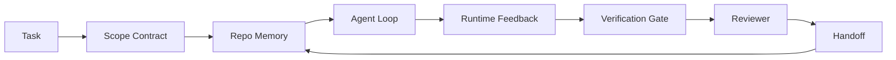

# Agent Workbench Engineering: Why Capable Models Still Fail / Agent Workbench 工程：为什么强模型仍然会失败

> 只有强模型还不够。可靠的 Agent 需要一个 workbench：instructions、state、scope、feedback、verification、review 和 handoff。去掉这些，即使是 frontier model 也会产出不适合发布的工作。

**类型：** 学习 + 构建
**语言：** Python（stdlib）
**前置知识：** 第 14 阶段 · 01（Agent Loop）, 第 14 阶段 · 26（Failure Modes）
**时间：** 约 45 分钟

## Learning Objectives / 学习目标

- 区分 model capability 与 execution reliability。
- 说出决定 Agent 是否能交付的七个 workbench surfaces。
- 在一个小型 repo task 上比较 prompt-only run 与 workbench-guided run。
- 产出 failure-mode report，把每个缺失 surface 映射到它导致的 symptom。

## The Problem / 问题

你把一个 frontier model 放进真实 repo，让它添加 input validation。它打开四个文件，写出看起来合理的代码，宣布成功，然后停止。你运行 tests。两个失败。第三个被修改的文件和 validation 毫无关系。没有记录说明 agent 假设了什么、最先尝试了什么、还剩什么要做。

模型不是不懂 Python。它不懂这份工作。它不知道什么才算 done，不知道允许写哪里，不知道哪些 tests 是权威的，也不知道下一次 session 应该如何接手。

这不是 model bug，而是 workbench bug。Agent 周围缺少把 one-shot generation 变成可靠、可恢复工程流程的那些工作面。

## The Concept / 概念

Workbench 是任务期间包裹模型的 operating environment。它有七个 surfaces：

| Surface | What it carries | Failure when missing |
|---------|-----------------|----------------------|
| Instructions | Startup rules, forbidden actions, definition of done | Agent 猜测什么叫 shipping |
| State | Current task, touched files, blockers, next action | 每个 session 都从零开始 |
| Scope | Allowed files, forbidden files, acceptance criteria | 改动泄漏到无关代码 |
| Feedback | Real command output captured into the loop | Agent 在 400 上宣布成功 |
| Verification | Tests, lint, smoke run, scope check | “Looks good” 进入 main |
| Review | A second pass with a different role | Builder 给自己的作业打分 |
| Handoff | What changed, why, what is left | 下一次 session 重新发现一切 |

Workbench 独立于模型。你可以替换模型并保留 surfaces。你不能替换 surfaces 还保留可靠性。



循环闭合在 state file 上，而不是 chat history 上。Chat 是易失的。Repo 才是 system of record。

### Workbench versus prompt engineering / Workbench 与 prompt engineering

Prompting 告诉模型这一轮你想要什么。Workbench 告诉模型如何跨 turns、跨 sessions 工作。大多数 Agent failure stories 都是披着 prompt-engineering 外衣的 workbench failures。

### Workbench versus framework / Workbench 与 framework

Framework 给你 runtime（LangGraph、AutoGen、Agents SDK）。Workbench 给 Agent 在 runtime 内工作的地方。两者都需要。这个 mini-track 讲的是第二件事。

### Reasoning from primitives, not from vendor taxonomies / 从 primitives 推理，而不是从 vendor 分类推理

现在有很多关于 “harness engineering” 的文章。Addy Osmani、OpenAI、Anthropic、LangChain、Martin Fowler、MongoDB、HumanLayer、Augment Code、Thoughtworks、walkinglabs awesome list，以及 Medium 和 Hacker News 上持续不断的文章都在讨论它。它们对 harness 的边界、scope、词汇并不一致。我们不需要选边。七个 surfaces 是一层 UX；每个 workbench 底下都是同一组 distributed-systems primitives，它们也支撑任何可靠后端。

暂时去掉 Agent 标签。一次 Agent run 是跨时间、进程和机器的 computation。要让它可靠，你需要生产系统一直需要的那些 primitives。

| Primitive | What it is | What it carries for an agent |
|-----------|------------|------------------------------|
| Function | Typed handler. Pure where possible. Owns its inputs and outputs. | Tool call、rule check、verification step、model invocation |
| Worker | Long-lived process that owns one or more functions and a lifecycle | Builder、reviewer、verifier、MCP server |
| Trigger | Event source that invokes a function | Agent loop tick、HTTP request、queue message、cron、file change、hook |
| Runtime | The boundary that decides what runs where, with what timeouts and resources | Claude Code 的 process、LangGraph 的 runtime、worker container |
| HTTP / RPC | The wire between caller and worker | Tool-call protocol、MCP request、model API |
| Queue | Durable buffer between trigger and worker; back-pressure, retry, idempotency | Task board、feedback log、review inbox |
| Session persistence | State that survives crashes, restarts, model swaps | `agent_state.json`、checkpoints、KV stores、repo itself |
| Authorization policy | Who can call what function with which scope | Allowed/forbidden files、approval boundaries、MCP capability lists |

现在把七个 workbench surfaces 映射到这些 primitives。

- **Instructions** — policy + function metadata。Rules 是 checks（functions）。Router（`AGENTS.md`）是附着在 runtime startup 上的 policy。
- **State** — session persistence。Runtime 每一步都读取 keyed store。可以是 file、KV 或 DB；重要的是 persistence semantics，不是 storage backend。
- **Scope** — per task 的 authorization policy。Allowed/forbidden globs 是 ACL。Required approvals 是 permission lattice。
- **Feedback** — 写入 queue 的 invocation log。每个 shell call 都是一条 durable、replayable record。
- **Verification** — 一个 function。对 inputs 确定性。任务关闭时触发。Fails closed。
- **Review** — 一个独立 worker，对 builder artifacts 只有 read-only authz，对 review reports 只有 write-only authz。
- **Handoff** — session-end trigger 发出的 durable record。下一次 session 的 startup trigger 会读取它。

Agent loop 本身就是一个 worker：消费 events（user message、tool result、timer tick），调用 functions（model，然后是 model 选择的 tools），写 records（state、feedback），并发出 triggers（verify、review、handoff）。没有神秘之处；形状和 job processor 一样。

### Patterns in circulation, translated to primitives / 流行模式翻译成 primitives

每个流行 harness pattern 都会还原为这八个 primitives。下面是翻译表。

| Vendor or community pattern | What it actually is |
|------------------------------|--------------------|
| Ralph Loop (Claude Code, Codex, agentic_harness book) — re-inject original intent into a fresh context window when the agent tries to stop early | 一个把 task 重新入队到 clean context 的 trigger；session persistence 负责把 goal 带过去 |
| Plan / Execute / Verify (PEV) | 三个 workers，每个 role 一个，通过 state 和 phases 之间的 queue 通信 |
| Harness-compute separation (OpenAI Agents SDK, April 2026) — split control plane from execution plane | 重新表述 control-plane / data-plane；这个概念早于 agent label 数十年 |
| Open Agent Passport (OAP, March 2026) — sign and audit every tool call against a declarative policy before execution | 一个由 pre-action worker 执行的 authorization policy，并写入 signed audit queue |
| Guides and Sensors (Birgitta Böckeler / Thoughtworks) — feedforward rules + feedback observability | Authorization policy + verification functions + observability traces |
| Progressive compaction, 5-stage (Claude Code reverse engineering, April 2026) | 一个 cron-like 地运行在 session persistence 上的 state-management worker，用于把 context 控制在 budget 内 |
| Hooks / middleware (LangChain, Claude Code) — intercept model and tool calls | 包裹 runtime invocation path 的 triggers + functions |
| Skills as Markdown with progressive disclosure (Anthropic, Flue) | function registry，其中 function metadata 会 just-in-time 加载进 context |
| Sandbox agents (Codex, Sandcastle, Vercel Sandbox) | compute plane：带 isolated filesystem、network 和 lifecycle 的 runtime |
| MCP servers | 通过稳定 RPC 暴露 functions 的 workers，capability lists 是 authorization |

表里的每一项，都是 Agent 社区重新到达一个在 distributed systems 中早已有名字的 primitive，并给它起了新名字。对 marketing 有用；对工程词汇没那么有用。

### What the receipts actually say / 证据数字说明了什么

harness-over-model 的论点现在有数字支撑。值得了解，因为这也是反驳 “just wait for a smarter model” 的唯一诚实论据。

- Terminal Bench 2.0 — 同一模型，仅 harness 改动就让 coding agent 从 top 30 之外升到第五（LangChain, *Anatomy of an Agent Harness*）。
- Vercel — 删除其 agent 80% 的 tools；success rate 从 80% 跳到 100%（MongoDB）。
- Harvey — legal agents 仅通过 harness optimization 就把 accuracy 提升了一倍以上（MongoDB）。
- 88% 的 enterprise AI agent projects 未能进入生产。Failures 聚集在 runtime，而不是 reasoning（preprints.org, *Harness Engineering for Language Agents*, March 2026）。
- 一个 2025 benchmark study 覆盖三个流行 open-source frameworks，报告约 50% task completion；long-context WebAgent 在 long-context conditions 中从 40-50% 跌到 10% 以下，主要因为 infinite loops 和 goal loss（2026 年初被广泛讨论）。

结论不是 “harness 永远赢”。模型会随着时间吸收 harness tricks。结论是：今天，承重工程在模型周围，而不是模型内部；承担这些负载的 primitives，正是每个生产系统一直需要的东西。

### Where vendor writeups stop short / Vendor 文章停在了哪里

这部分不需要客气。

- LangChain 的 *Anatomy of an Agent Harness* 枚举了十一项 components — prompts、tools、hooks、sandboxes、orchestration、memory、skills、subagents，以及一个 runtime “dumb loop”。它没有命名 queues、workers as a deployment unit、trigger semantics、session persistence as a separate concern，或者 authorization policy。它把 harness 当成一个配置对象，而不是一个要部署的系统。
- Addy Osmani 的 *Agent Harness Engineering* 给出了 `Agent = Model + Harness` 和 ratchet pattern 的 framing，但没有继续说明 harness 由什么构成。它更像 stance，而不是 spec。
- Anthropic 和 OpenAI 对 surfaces 讲得最深，但仍停留在自己的 runtimes 内部。2026 年 4 月 Agents SDK 的 “harness-compute separation” 公告，是第一篇明确支持 control-plane / data-plane split 的 vendor 文章。但那是 primitive idea，不是新概念。
- agentic_harness book 把 harness 当成 config object（Jaymin West 的 *Agentic Engineering*, chapter 6），其中最有力的一句是 “the harness is the primary security boundary in an agentic system.” 这只是 authorization policy 的重新表述。
- Hacker News threads 一直回到同一个点。2026 年 4 月的 thread *The agent harness belongs outside the sandbox* 认为 harness 应该 “more like a hypervisor that sits outside everything and authorises access based on context and user.” 这还是把 authorization policy 作为 separate plane。

你不需要反对这些文章，也能看见缺口。它们在写一个已经存在的系统的 UX 描述。我们要写的是系统本身。当系统构建正确时，七个 surfaces 会从 primitives 中自然长出来。构建错误时，再怎么打磨 `AGENTS.md` 也补不上缺失的 queue。

所以当你在别处听到 “harness engineering” 时，先翻译成 primitives。Prompts 和 rules 是 policy 与 functions。Scaffolding 是 runtime。Guardrails 是 authorization + verification。Hooks 是 triggers。Memory 是 session persistence。Ralph Loop 是 requeue。Subagents 是 workers。Sandboxes 是 compute planes。词汇会变；工程不会变。Workbench 是面向 Agent 的 UX；而能穿过下一轮 vendor 改名仍然成立的 harness，是 functions、workers、triggers、runtimes、queues、persistence 和 policy 被正确连接在一起。

## Build It / 动手构建

`code/main.py` 会对一个 tiny repo task 跑两次。第一次是 prompt only，第二次接入七个 surfaces。相同模型，相同任务。脚本会统计失败 run 中缺失了哪些 surfaces，并打印 failure-mode report。

Repo task 刻意很小：给一个 one-file FastAPI-style handler 添加 input validation，并写一个 passing test。

运行：

```
python3 code/main.py
```

输出：两次 run 的 side-by-side log、总结 prompt-only run 的 `failure_modes.json`，以及 workbench run 的一行 verdict。

Agent 是一个很小的 rule-based stub；重点是 surfaces，不是模型。这个 mini-track 的后续课程会把每个 surface 重新构建成真实、可复用的 artifact。

## Use It / 应用它

即使没人这么称呼，现实中已经有三类地方存在 workbench surfaces：

- **Claude Code, Codex, Cursor.** `AGENTS.md` 和 `CLAUDE.md` 是 instructions surface。Slash commands 是 scope。Hooks 是 verification。
- **LangGraph, OpenAI Agents SDK.** Checkpoints 和 session stores 是 state surface。Handoffs 是 handoff surface。
- **CI on a real repo.** Tests、lint、type-check 是 verification。PR template 是 handoff。CODEOWNERS 是 review。

Workbench engineering 的纪律，是把这些 surfaces 显式化、可复用化，而不是让每个团队重新发现它们。

## Ship It / 交付它

`outputs/skill-workbench-audit.md` 是一个 portable skill，用来审计现有 repo 的七个 workbench surfaces，并报告哪些缺失、哪些部分存在、哪些健康。把它放到任何 agent setup 旁边；它会告诉你先修什么。

## Exercises / 练习

1. 选一个你已经运行 agent 的 repo。给七个 surfaces 从 0（missing）到 2（healthy）打分。你最弱的 surface 是哪个？
2. 扩展 `main.py`，让 prompt-only run 也产出一个假的 “success” claim。验证 verification gate 会抓住它。
3. 为你的产品增加第八个 surface。说明为什么它不能折叠到现有七个之一。
4. 换一个会 hallucinate extra file write 的 stub agent 重新跑脚本。哪个 surface 最先抓住它？
5. 把 Phase 14 · 26 的五种 industry-recurring failure modes 映射到七个 surfaces。每个 surface 设计来吸收哪种 mode？

## Key Terms / 关键术语

| 术语 | 常见说法 | 实际含义 |
|------|----------------|------------------------|
| Workbench | “The setup” | 围绕模型构建的工程化 surfaces，让工作可靠 |
| Surface | “A doc” or “a script” | Agent 每轮读取或写入的 named, machine-readable input |
| System of record | “The notes” | chat history 消失后，Agent 仍视为真相的文件 |
| Definition of done | “Acceptance” | Agent 无法伪造的 objective, file-backed checklist |
| Workbench audit | “Repo readiness check” | 开工前扫描七个 surfaces，标出缺失部分 |

## Further Reading / 延伸阅读

把这些文章当作 data points，而不是 authorities。每篇都是 partial taxonomy。在决定是否采纳前，先把每个概念翻译回 primitive（function、worker、trigger、runtime、HTTP/RPC、queue、persistence、policy）。

Vendor framings:

- [Addy Osmani, Agent Harness Engineering](https://addyosmani.com/blog/agent-harness-engineering/) — `Agent = Model + Harness` and the ratchet pattern; thin on infrastructure
- [LangChain, The Anatomy of an Agent Harness](https://blog.langchain.com/the-anatomy-of-an-agent-harness/) — eleven components: prompts, tools, hooks, orchestration, sandboxes, memory, skills, subagents, runtime; omits queues, deployment, authz
- [OpenAI, Harness engineering: leveraging Codex in an agent-first world](https://openai.com/index/harness-engineering/) — Codex team's view of the surfaces around their runtime
- [OpenAI, Unrolling the Codex agent loop](https://openai.com/index/unrolling-the-codex-agent-loop/) — the agent loop reduced to a `while` over function calls
- [Anthropic, Effective harnesses for long-running agents](https://www.anthropic.com/engineering/effective-harnesses-for-long-running-agents) — long-horizon surfaces inside a specific runtime
- [Anthropic, Harness design for long-running application development](https://www.anthropic.com/engineering/harness-design-long-running-apps) — applied design notes
- [LangChain Deep Agents harness capabilities](https://docs.langchain.com/oss/python/deepagents/harness) — runtime config surface

Practitioner pieces with usable detail:

- [Martin Fowler / Birgitta Böckeler, Harness engineering for coding agent users](https://martinfowler.com/articles/harness-engineering.html) — guides (feedforward) + sensors (feedback); the cleanest control-theory framing
- [HumanLayer, Skill Issue: Harness Engineering for Coding Agents](https://www.humanlayer.dev/blog/skill-issue-harness-engineering-for-coding-agents) — "it's not a model problem, it's a configuration problem"
- [MongoDB, The Agent Harness: Why the LLM Is the Smallest Part of Your Agent System](https://www.mongodb.com/company/blog/technical/agent-harness-why-llm-is-smallest-part-of-your-agent-system) — receipts: Vercel 80% to 100%, Harvey 2x accuracy, Terminal Bench Top 30 to Top 5
- [Augment Code, Harness Engineering for AI Coding Agents](https://www.augmentcode.com/guides/harness-engineering-ai-coding-agents) — constraint-first walkthrough
- [Sequoia podcast, Harrison Chase on Context Engineering Long-Horizon Agents](https://sequoiacap.com/podcast/context-engineering-our-way-to-long-horizon-agents-langchains-harrison-chase/) — runtime concerns over model concerns

Books, papers, and reference implementations:

- [Jaymin West, Agentic Engineering — Chapter 6: Harnesses](https://www.jayminwest.com/agentic-engineering-book/6-harnesses) — book-length treatment, treats harness as the primary security boundary
- [preprints.org, Harness Engineering for Language Agents (March 2026)](https://www.preprints.org/manuscript/202603.1756) — academic framing as control / agency / runtime
- [walkinglabs/awesome-harness-engineering](https://github.com/walkinglabs/awesome-harness-engineering) — curated reading list across context, evaluation, observability, orchestration
- [ai-boost/awesome-harness-engineering](https://github.com/ai-boost/awesome-harness-engineering) — alternate curated list (tools, evals, memory, MCP, permissions)
- [andrewgarst/agentic_harness](https://github.com/andrewgarst/agentic_harness) — production-ready reference implementation with Redis-backed memory and eval suite
- [HKUDS/OpenHarness](https://github.com/HKUDS/OpenHarness) — open agent harness with built-in personal agent

Hacker News threads worth reading for the disagreements, not the consensus:

- [HN: Effective harnesses for long-running agents](https://news.ycombinator.com/item?id=46081704)
- [HN: Improving 15 LLMs at Coding in One Afternoon. Only the Harness Changed](https://news.ycombinator.com/item?id=46988596)
- [HN: The agent harness belongs outside the sandbox](https://news.ycombinator.com/item?id=47990675) — argues for authorization as a separate plane

Cross-references inside this curriculum:

- Phase 14 · 23 — OpenTelemetry GenAI conventions: the observability layer the sensors literature points at
- Phase 14 · 26 — Failure modes catalog the seven surfaces are designed to absorb
- Phase 14 · 27 — Prompt injection defenses that sit at the authorization-policy primitive
- Phase 14 · 29 — Production runtimes (queue, event, cron): where the primitives in this lesson live in deployment
