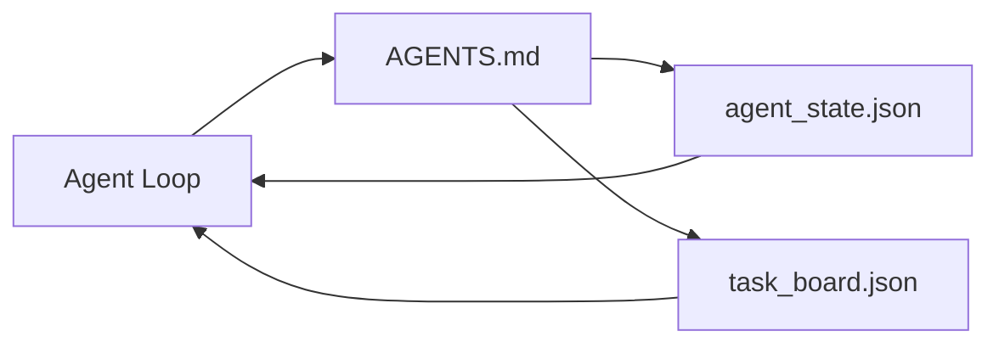

# The Minimal Agent Workbench / 最小可用 Agent Workbench

> 最小有用 workbench 只需要三个文件：根 instructions router、state file 和 task board。其他所有东西都叠在它们之上。如果一个 repo 连这三个都承载不了，再强的模型也救不了它。

**类型：** 构建
**语言：** Python（stdlib）
**前置知识：** 第 14 阶段 · 31（Why Capable Models Still Fail）
**时间：** 约 45 分钟

## Learning Objectives / 学习目标

- 定义组成 minimum viable workbench 的三个文件。
- 解释为什么短的 root router 优于冗长的整体式 `AGENTS.md`。
- 构建一个 agent 每轮都能读取、结束时能写回的 state file。
- 构建一个不依赖 chat history、能支撑 multi-session work 的 task board。

## The Problem / 问题

大多数团队搭 workbench 的方式，是写一个 3000 行的 `AGENTS.md`，然后宣布完成。模型加载它，忽略自己无法总结的部分，然后仍然会在原本缺失的那些工作面上反复出错。

你需要反过来做。一个很小的 root file，只在相关时把 agent 路由到更深的文件。Agent 行动前读取、行动后写回的 durable state。一个说明什么正在进行、什么被阻塞、下一步是什么的 task board。

三个文件。每个文件只做一件事。每个文件都足够 machine-readable，方便以后演化成真实系统。

## The Concept / 概念



### AGENTS.md is a router, not a manual / AGENTS.md 是 router，不是 manual

好的 `AGENTS.md` 很短。它把 agent 指向：

- State file（你现在在哪里）。
- Task board（还剩什么）。
- 更深的 rules（在 `docs/agent-rules.md` 下）。
- Verification command（如何知道它工作正常）。

更长的内容都放进更深的 docs，只在需要时加载。长 manual 会被忽略。短 router 会被遵守。

### agent_state.json is the system of record / agent_state.json 是 system of record

State 承载：active task id、touched files、assumptions made、blockers 和 next action。Agent 每轮读取它。下一次 session 读取它，而不是回放 chat。

State 存在文件里，因为 chat history 不可靠。Sessions 会死。Conversations 会被裁剪。文件不会。

### task_board.json is the queue / task_board.json 是队列

Task board 承载每个 task 及其 status：`todo | in_progress | done | blocked`。当 state 为空时，agent 从这个 queue 拉任务；当你想知道 agent 是否仍在轨道上时，你也读这个 queue。

Board 上的 task 有 id、goal、owner（`builder`, `reviewer`, 或 `human`）和 acceptance criteria。Board 刻意保持小：当它长到超过一屏，你遇到的是规划问题，不是 board 问题。

### 三个文件只是下限，不是上限

后续课程会增加 scope contracts、feedback runners、verification gates、reviewer checklists 和 handoff packets。本课的三个文件是它们共同假设的底座。

## Build It / 动手构建

`code/main.py` 会把 minimal workbench 写入一个空 repo，并演示一次 agent turn：

1. 读取 `agent_state.json`。
2. 如果 state 为空，就从 `task_board.json` 拉取下一个 task。
3. 在 scope 内只触碰一个文件。
4. 写回更新后的 state。

运行：

```
python3 code/main.py
```

脚本会在旁边创建 `workdir/`，放下三个文件，运行一轮，并打印 diff。再次运行它，可以看到第二轮如何从第一轮留下的位置继续。

## Use It / 应用它

在生产 Agent 产品里，相同的三个文件会以不同名字出现：

- **Claude Code:** 用 `AGENTS.md` 或 `CLAUDE.md` 做 router，用 `.claude/state.json` 风格的 stores 做 state，用 hooks 做 board。
- **Codex / Cursor:** workspace rules 做 router，session memory 做 state，chat sidebar 中的 queued tasks 做 board。
- **Custom Python agent:** 就是你刚写的这些文件。

名字会变。形状不会。

## Production patterns in the wild / 真实生产中的模式

当把三个模式叠加到最小 workbench 之上时，它就能经受真实 monorepos 的冲击。这些模式彼此独立；只选择你的 repo 确实需要的。

**Nested `AGENTS.md` with nearest-wins precedence.** OpenAI 在主 repo 中放了 88 个 `AGENTS.md` 文件，每个 subcomponent 一个。Codex、Cursor、Claude Code 和 Copilot 都会从工作文件向 repo root 回溯，并拼接沿途找到的每个 `AGENTS.md`。子目录文件扩展根文件。Codex 增加了 `AGENTS.override.md` 用于替换而不是扩展；override 机制是 Codex-specific，跨工具工作时应避免。Augment Code 的测量结论最重要：最好的 `AGENTS.md` 带来的质量跃迁相当于从 Haiku 升到 Opus；最差的会让输出比没有文件更差。

**Anti-patterns to refuse, even when they look like coverage.** 冲突 instructions 会让 agent 静默地从 interactive 模式掉到 greedy mode（ICLR 2026 AMBIG-SWE：48.8% → 28% resolve rate）；不要给 priorities 编号，而要把它们平铺。无法验证的 style rules（“follow the Google Python Style Guide”）如果没有 enforcement command，会让 agent 发明 compliance；每条 style rule 都要配 exact lint command。把 style 放在 commands 前面会埋掉 verification path；commands first，style last。给人写而不是给 agents 写会浪费 context budget；简洁是特性。

**Cross-tool symlinks.** 一个 root file 配合 symlinks（`ln -s AGENTS.md CLAUDE.md`, `ln -s AGENTS.md .github/copilot-instructions.md`, `ln -s AGENTS.md .cursorrules`）可以让每个 coding agent 使用同一个 source of truth。Nx 的 `nx ai-setup` 能从单一 config 为 Claude Code、Cursor、Copilot、Gemini、Codex 和 OpenCode 自动完成这一点。

## Ship It / 交付它

`outputs/skill-minimal-workbench.md` 会为任何新 repo 生成三文件 workbench：一个贴合项目的 `AGENTS.md` router，一个带正确 keys 的 `agent_state.json`，以及一个用当前 backlog 初始化的 `task_board.json`。

## Exercises / 练习

1. 给 `agent_state.json` 增加 `last_run` timestamp。如果文件超过 24 小时未更新，除非 operator 确认，否则拒绝运行。
2. 给 task board 增加 `priority` 字段，并修改 puller，使它总是选择最高优先级的 `todo`。
3. 把 `task_board.json` 迁移到 JSON Lines，让每个 task 占一行，版本控制中的 diff 更干净。
4. 写一个 `lint_workbench.py`：如果 `AGENTS.md` 超过 80 行，或引用了不存在的文件，就 fail。
5. 判断三个文件里丢掉哪一个伤害最大。说明理由。

## Key Terms / 关键术语

| 术语 | 常见说法 | 实际含义 |
|------|----------------|------------------------|
| Router | `AGENTS.md` | 指向更深 docs 和 files 的短根文件 |
| State file | “The notes” | agent 所处位置的 machine-readable record，每轮写入 |
| Task board | “The backlog” | 带 status、owner、acceptance 的 JSON work queue |
| System of record | “Source of truth” | chat 消失后，workbench 仍视为权威的文件 |

## Further Reading / 延伸阅读

- [agents.md — the open spec](https://agents.md/) — adopted by Cursor, Codex, Claude Code, Copilot, Gemini, OpenCode
- [Augment Code, A good AGENTS.md is a model upgrade. A bad one is worse than no docs at all](https://www.augmentcode.com/blog/how-to-write-good-agents-dot-md-files) — measured quality jumps
- [Blake Crosley, AGENTS.md Patterns: What Actually Changes Agent Behavior](https://blakecrosley.com/blog/agents-md-patterns) — what works empirically, what does not
- [Datadog Frontend, Steering AI Agents in Monorepos with AGENTS.md](https://dev.to/datadog-frontend-dev/steering-ai-agents-in-monorepos-with-agentsmd-13g0) — nested precedence in practice
- [Nx Blog, Teach Your AI Agent How to Work in a Monorepo](https://nx.dev/blog/nx-ai-agent-skills) — single-source generation across six tools
- [The Prompt Shelf, AGENTS.md Best Practices: Structure, Scope, and Real Examples](https://thepromptshelf.dev/blog/agents-md-best-practices/) — section ordering that survives review
- [Anthropic, Claude Code subagents and session store](https://docs.anthropic.com/en/docs/agents-and-tools/claude-code/sub-agents)
- Phase 14 · 31 — the failure modes this minimum absorbs
- Phase 14 · 34 — the durable state schema this lesson previews
