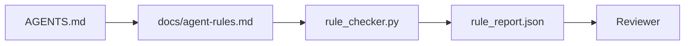

# Agent Instructions as Executable Constraints / 把 Agent 指令写成可执行约束

> 写成 prose 的 instructions 是愿望。写成 constraints 的 instructions 是测试。Workbench 会把每条 rule 变成 agent 运行时可以检查、reviewer 事后可以验证的东西。

**类型：** 构建
**语言：** Python（stdlib）
**前置知识：** 第 14 阶段 · 32（Minimal Workbench）
**时间：** 约 50 分钟

## Learning Objectives / 学习目标

- 区分 routing prose 与 operational rules。
- 把 startup rules、forbidden actions、definition of done、uncertainty handling 和 approval boundaries 表达为 machine-checkable constraints。
- 实现一个 rule checker，用 rule set 给一次 run 打分。
- 让 rule set diff-friendly，使 review 能看清改了什么。

## The Problem / 问题

典型 `AGENTS.md` 看起来像 onboarding documentation。它告诉 agent 要 “be careful”、“test thoroughly”、“ask if unsure”。三天后，agent 在没有 tests 的情况下交付改动，写入 forbidden directory，而且从不提问，因为它从来不知道边界在哪里。

Instructions 只有在 operational 时才强；当它们只是 aspirational 时就很弱。修复方式是写出 workbench 能解释、reviewer 能评分的 rules。

## The Concept / 概念

Rules 应放在 `docs/agent-rules.md`，从短的 root router 中移走。每条 rule 都有 name、category 和 check。



### Five categories that cover most rules / 覆盖大多数规则的五类

| Category | Question the rule answers | Example |
|----------|---------------------------|---------|
| Startup | 开始工作前必须满足什么？ | “state file exists and is fresh” |
| Forbidden | 什么永远不能发生？ | “do not edit `scripts/release.sh`” |
| Definition of done | 什么证明任务已完成？ | “pytest exits 0 and acceptance line passes” |
| Uncertainty | Agent 不确定时做什么？ | “open a question note instead of guessing” |
| Approval | 什么需要 human approval？ | “any new dependency, any prod write” |

无法放入这五类之一的 rule，通常应该拆成两条 rule。强制拆分。

### Rules are machine-readable / Rules 是机器可读的

每条 rule 有 slug、category、一行 description，以及命名 `rule_checker.py` 中某个 function 的 `check` field。增加 rule 意味着增加 check；checker 会随 workbench 一起成长。

### Rules are diff-friendly / Rules 对 diff 友好

Rules 在单个 markdown 文件中按 heading 一条一条存放。Renames 会在 diffs 中可见。新 rules 放在对应 category 顶部。Stale rules 直接删除，而不是注释掉，因为 workbench 是 source of truth，不是团队上个季度感受如何的 chat log。

### Rules versus framework guardrails / Rules 与 framework guardrails

Framework guardrails（OpenAI Agents SDK guardrails、LangGraph interrupts）在 runtime 层执行规则。本课的 rule set 是这些 guardrails 所实现的人类可读、可 review contract。两者都需要：runtime 在 turn 中抓 violations，rule set 证明 runtime 做的是正确的事。

### Progressive disclosure: a map, not an encyclopedia / 渐进披露：给地图，不给百科全书

`AGENTS.md` 不断变长，是因为每次 incident 都增加 rule，而没有 incident 会删除 rule。一年后，文件两千行，agent 只读第一屏，attention budget 耗尽，只按收到的一小部分指令行动。巨型 instruction file 失败的原因，与四十页 onboarding doc 一样：读者扫一遍，然后再也不回到真正重要的部分。

修复方式不是更短的文件，而是分层文件。Root router 小到每个 session 都能读完，只保存 pointers。深度内容放在 topic files 中，只有当任务触及相关主题时才加载。给 agent 地图，而不是整本百科，让它走到自己需要的页面。

```
AGENTS.md                  # router, < 50 lines: what this repo is, where to look, the 5 hard rules
docs/
  agent-rules.md           # the full rule set (this lesson)
  architecture.md          # loaded when the task touches module boundaries
  testing.md               # loaded when the task writes or runs tests
  deploy.md                # loaded only for release work, gated behind an approval rule
feature_list.json          # the backlog (Phase 14 · 36)
```

| Tier | Lives in | Read when | Size budget |
|------|----------|-----------|-------------|
| Router | `AGENTS.md` | Every session, always | Under ~50 lines |
| Rules | `docs/agent-rules.md` | Every session, on startup | One screen per category |
| Topic docs | `docs/<topic>.md` | Only when the task touches that topic | As deep as needed |

两个测试让分层保持诚实。Reachability test：agent 从 router 到任何 rule 最多两跳，所以 router 必须用 path 链接每个 topic doc，而不是用 prose 描述。Freshness test：router 短到 reviewer 每个 PR 都会重读，这是唯一能阻止它悄悄长回百科全书的方式。一个不再能解析的 pointer 比 missing rule 更糟，因此 router 中的 broken link 本身就是 startup-check violation。

## Build It / 动手构建

`code/main.py` 提供：

- `agent-rules.md` parser，把 rules 加载进 dataclass。
- `rule_checker.py` 风格的 checker functions，每个 `check` reference 一个。
- 一个 demo agent run，它违反两条 rules；check pass 会抓住它们。

运行：

```
python3 code/main.py
```

输出：parsed rule set、run trace、每条 rule 的 pass/fail，以及保存在脚本旁边的 `rule_report.json`。

## Production patterns in the wild / 真实生产中的模式

三种模式能区分一个可维持一季度的 rule set 和一周就腐烂的 rule set。

**Severity tagging at write time.** 每条 rule 都带 `severity`：`block`, `warn`, 或 `info`。Checker 报告三者；runtime 只在 `block` 上拒绝。大多数团队早期会夸大 severity，然后在 deadline 压力下悄悄削弱它；写入时 tagging 会迫使前置校准。与 verification gate（Phase 14 · 38）配合，任何 `block` rule 的 override 都会签入 `overrides.jsonl` audit log。

**Rule expiry as a forcing function.** 每条 rule 都带 `expires_at` date（默认从 authoring 起 90 天）。当一条未过期 rule 连续 60 天没有 violation 时，checker 发出 warning；下一次季度 review 必须证明保留它的理由、把它降为 `info`，或者删除它。Cloudflare 的生产 AI Code Review 数据（2026 年 4 月，30 天内 5,169 repos 上 131,246 次 review runs）显示，带 explicit expiry 的 rule sets 保持在每 repo 30 条以内；没有 expiry 的增长到 80+，且大多数从不触发。

**Markdown-as-source, JSON-as-cache.** `agent-rules.md` 是 authoring file；`agent-rules.lock.json` 是 checker 热路径读取的 cache。Lock 由 pre-commit hook 重新生成。Markdown diff 可 review；JSON parsing 不进入每个 turn。形状类似 `package.json` / `package-lock.json` 和 `Cargo.toml` / `Cargo.lock`。

## Use It / 应用它

生产中：

- Claude Code、Codex、Cursor 在 session start 读取 rules，并在拒绝 actions 时引用它们。Checker 在 CI 中重跑，抓 silent drift。
- OpenAI Agents SDK guardrails 把同样 checks 注册为 input 和 output guardrails。Markdown 是 docs surface；SDK 是 runtime surface。
- LangGraph interrupts 在 in-flight node 违反 rule 时触发。Interrupt handler 读取 rule，询问 human，然后 resume。

这个 rule set 可跨三者移植，因为它只是 markdown 加 function names。

## Ship It / 交付它

`outputs/skill-rule-set-builder.md` 会访谈 project owner，把现有 prose instructions 分类到五类中，并输出 versioned `agent-rules.md` 与 checker stub。

## Exercises / 练习

1. 如果你的产品真的需要，增加第六个 category。说明为什么它不能折叠进五类之一。
2. 扩展 checker，让 rule 能携带 severity（`block`, `warn`, `info`），并让 report 按 severity 聚合。
3. 把 checker 接入 CI：如果最新 agent run 上 block-severity rule 失败，就 fail build。
4. 给每条 rule 增加 “expiry” field。90 天没有 check fail 后，该 rule 进入 review。
5. 找一个真实 `AGENTS.md`，把它重写为五类 rules。多少行是 operational？多少行只是 aspirational？

## Key Terms / 关键术语

| 术语 | 常见说法 | 实际含义 |
|------|----------------|------------------------|
| Operational rule | “A real instruction” | workbench 能在 runtime 检查的 rule |
| Aspirational rule | “Be careful” | 没有 check 的 rule；要么删除，要么升级 |
| Definition of done | “Acceptance” | 证明任务完成的 objective, file-backed proof |
| Block severity | “Hard rule” | violation 会 halt run；没有 operator 不能静默 |
| Rule expiry | “Stale rule sweep” | N 天无失败的 rule 进入 retirement review |

## Further Reading / 延伸阅读

- [OpenAI Agents SDK guardrails](https://platform.openai.com/docs/guides/agents-sdk/guardrails)
- [LangGraph interrupts](https://langchain-ai.github.io/langgraph/how-tos/human_in_the_loop/breakpoints/)
- [Anthropic, Building Effective Agents](https://www.anthropic.com/research/building-effective-agents)
- [Rick Hightower, Agent RuleZ: A Deterministic Policy Engine](https://medium.com/@richardhightower/agent-rulez-a-deterministic-policy-engine-for-ai-coding-agents-9489e0561edf) — block/warn/info severity in production
- [Cloudflare, Orchestrating AI Code Review at Scale](https://blog.cloudflare.com/ai-code-review/) — 131k review runs, rule composition lessons
- [microservices.io, GenAI development platform — part 1: guardrails](https://microservices.io/post/architecture/2026/03/09/genai-development-platform-part-1-development-guardrails.html) — defense in depth between rules and CI
- [Type-Checked Compliance: Deterministic Guardrails (arXiv 2604.01483)](https://arxiv.org/pdf/2604.01483) — Lean 4 as the upper bound on rule-as-check
- [logi-cmd/agent-guardrails](https://github.com/logi-cmd/agent-guardrails) — merge-gate implementation: scope, mutation testing, violation budgets
- Phase 14 · 32 — the minimal workbench this rule set drops into
- Phase 14 · 38 — the verification gate that consumes the rule report
- Phase 14 · 39 — the reviewer agent that scores rule compliance
