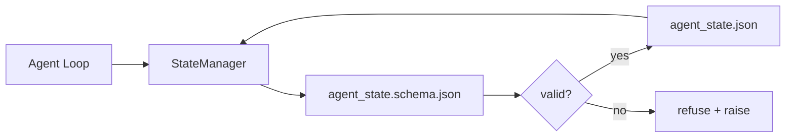

# Repo Memory and Durable State / Repo Memory 与持久状态

> Chat history 是易失的。Repo 是持久的。Workbench 把 agent state 存进 versioned files，让下一次 session、下一个 agent 和下一位 reviewer 都从同一个 source of truth 读取。

**类型：** 构建
**语言：** Python（stdlib + `jsonschema` optional）
**前置知识：** 第 14 阶段 · 32（Minimal Workbench）
**时间：** 约 60 分钟

## Learning Objectives / 学习目标

- 定义什么应该进入 repo memory，什么应该留在 chat history。
- 为 `agent_state.json` 和 `task_board.json` 编写 JSON Schemas。
- 构建一个 state manager，负责 load、validate、mutate，并以 atomic 方式 persist state。
- 用 schema 在坏写入腐蚀 workbench 前拒绝它。

## The Problem / 问题

Agent 完成一个 session。Chat 关闭。下一次 session 打开后问从哪里开始。模型说 “let me check the files”，读取 stale notes，然后重做已经完成的工作。更糟的是，它因为没人告诉它文件已经完成，而重写了 finished file。

Workbench 的修复方式是 repo memory：state 存在 repo 的 JSON files 中，受 schema 约束，以 atomic 方式持久化，并且在 code review 中 diff-friendly。Chat 是 transient feed；repo 是 system of record。

## The Concept / 概念



### What belongs in repo memory / 什么属于 repo memory

| Belongs | Does not belong |
|---------|-----------------|
| Active task id | Raw chat transcripts |
| Touched files this session | Token-level reasoning traces |
| Assumptions the agent made | “The user seemed frustrated” |
| Open blockers | Sampled completions |
| Next action | Vendor-specific model ids |

测试标准是 durability：三个月后在 CI rerun 中它是否仍有用？如果有，放 repo。如果没有，放 telemetry。

### Schema-first state / Schema 优先的状态

JSON Schema 是 contract。没有它，每个 agent 都会发明新字段，每个 reviewer 都要学习新形状，每个 CI script 都要 special-case 过去版本。有了它，坏写入就是 refused write。

Schema 覆盖：

- Required keys。
- Allowed `status` values。
- Forbidden values（例如 arrays 不能为 `null`）。
- Pattern constraints（task ids 匹配 `T-\d{3,}`）。
- 用于 migrations 的 version field。

### Atomic writes / 原子写入

State writes 必须能承受 partial failures：先写 tempfile，fsync，再 rename 覆盖目标文件。State file 是 source of truth；半写入文件比没有文件更糟。

### Migrations / 迁移

当 schema 变化时，schema bump 旁边要一起交付 migration script。State file 携带 `schema_version` field；manager 拒绝加载无法 migrate 的版本。

## Build It / 动手构建

`code/main.py` 实现：

- `agent_state.schema.json` 和 `task_board.schema.json`。
- 一个 stdlib-only validator（JSON Schema 的子集：required、type、enum、pattern、items）。
- 带 atomic temp-and-rename writes 的 `StateManager.load`, `StateManager.update`, `StateManager.commit`。
- 一个 demo：mutate state、persist、reload，并证明 round-trip。

运行：

```
python3 code/main.py
```

脚本会写入 `workdir/agent_state.json` 和 `workdir/task_board.json`，跨两轮 mutate 它们，并在每一步打印 validated state。

## Production patterns in the wild / 真实生产中的模式

四种模式能把本课的最小实现变成 multi-agent monorepo 能承受的系统。

**Atomic temp-and-rename is not optional.** 2026 年 3 月 Hive project 的一个 bug report 清楚记录了 failure mode：`state.json` 通过 `write_text()` 写入，并且 exceptions 被 catch 后吞掉。Partial writes 让 sessions 在 corrupt state 上 resume，却没有任何信号。修复总是：在目标文件同目录下 `tempfile.mkstemp`，write，`fsync`，`os.replace`（POSIX 和 Windows 上的 atomic rename）。本课的 `atomic_write` 正是这样做的。

**Idempotency keys on every non-idempotent tool call.** 如果 agent 调用 tool 后、checkpoint 结果前崩溃，恢复时会重试 tool call。读操作安全；emails、DB inserts、file uploads 很危险。模式是：执行前把每个 tool call ID 写入 `pending_calls.jsonl`。重试时检查 ID；如果存在，跳过调用并使用 cached result。Anthropic 和 LangChain 在 2026 guidance 中都强调这一点；LangGraph checkpointer 出于同样原因持久化 pending writes。

**Separate large artifacts from state.** 不要把 CSVs、long transcripts 或 generated files 存进 `agent_state.json`。把 artifact 另存为文件（或上传 object storage），state 中只保留 path。Checkpoints 保持小而快；artifacts 独立增长。

**Event sourcing for audit, snapshots for resume.** 每次 mutation 都 append 到 event log（`state.events.jsonl`）；周期性 snapshot 到 `state.json`。Resume 读取 snapshot，再 replay snapshot timestamp 后的 events。这更费磁盘，但能逐字 replay agent decisions — 对调试 long-horizon runs 至关重要。形状与 Postgres 内部 WAL 相同。

**Schema migrations or refuse to load.** `schema_version` integer 是 contract。Manager 加载 unknown version 文件时，拒绝读取。Schema bump 旁边交付 migration script；`tools/migrate_state.py` 在每次 startup 上幂等运行。

## Use It / 应用它

生产中：

- **LangGraph checkpointers.** 同一个想法，不同 storage。Checkpointer 把 graph state 持久化到 SQLite、Postgres 或 custom backend。本课的 schema，是当 checkpointer 坏掉、你需要手工读 state 时会用到的纪律。
- **Letta memory blocks.** 带 structured schemas 的 persistent blocks（Phase 14 · 08）。相同纪律，只是作用域在 long-running personas。
- **OpenAI Agents SDK session store.** Pluggable backends，schema-aware。本课的 state file 是 local-file backend。

## Ship It / 交付它

`outputs/skill-state-schema.md` 会生成 project-specific JSON Schema pair（state + board）、一个接入 atomic writes 的 Python `StateManager`，以及 migration scaffold，避免下一次 schema bump 破坏 workbench。

## Exercises / 练习

1. 增加 `last_human_touch` timestamp。Human edit 之后五秒内，拒绝任何 agent write。
2. 扩展 validator 支持 `oneOf`，让 task 可以是 build task 或 review task，并有不同 required fields。
3. 增加 `schema_version` field，并写 v1 到 v2 的 migration（把 `blockers` 改名为 `risks`）。
4. 把 storage backend 从 local file 换成 SQLite。保持 `StateManager` API 不变。
5. 让两个 agents 以 50 ms 写入竞争访问同一个 state file。会出什么问题？Atomic rename 如何救你？

## Key Terms / 关键术语

| 术语 | 常见说法 | 实际含义 |
|------|----------------|------------------------|
| Repo memory | “Notes file” | 在 repo tracked files 中、受 schema 约束的 state |
| Schema-first | “Validate inputs” | 先定义 contract，再写 writer；拒绝 drift |
| Atomic write | “Just rename” | 写 temp、fsync、rename，防止 partial failure corrupt |
| Migration | “Schema bump” | 把 vN state 转成 v(N+1) state 的脚本 |
| System of record | “Source of truth” | workbench 视为权威的 artifact |

## Further Reading / 延伸阅读

- [JSON Schema specification](https://json-schema.org/specification.html)
- [LangGraph checkpointers](https://langchain-ai.github.io/langgraph/concepts/persistence/)
- [Letta memory blocks](https://docs.letta.com/concepts/memory)
- [Fast.io, AI Agent State Checkpointing: A Practical Guide](https://fast.io/resources/ai-agent-state-checkpointing/) — schema-first checkpointing with idempotency
- [Fast.io, AI Agent Workflow State Persistence: Best Practices 2026](https://fast.io/resources/ai-agent-workflow-state-persistence/) — concurrency control, TTL, event sourcing
- [Hive Issue #6263 — non-atomic state.json writes silently ignored](https://github.com/aden-hive/hive/issues/6263) — the failure mode in a real project
- [eunomia, Checkpoint/Restore Systems: Evolution, Techniques, Applications](https://eunomia.dev/blog/2025/05/11/checkpointrestore-systems-evolution-techniques-and-applications-in-ai-agents/) — CR primitives from OS history applied to agents
- [Indium, 7 State Persistence Strategies for Long-Running AI Agents in 2026](https://www.indium.tech/blog/7-state-persistence-strategies-ai-agents-2026/)
- [Microsoft Agent Framework, Compaction](https://learn.microsoft.com/en-us/agent-framework/agents/conversations/compaction) — vendor checkpoint manager
- Phase 14 · 08 — memory blocks and sleep-time compute
- Phase 14 · 32 — the three-file minimum this lesson schematizes
- Phase 14 · 40 — handoff packets read from the same schema
