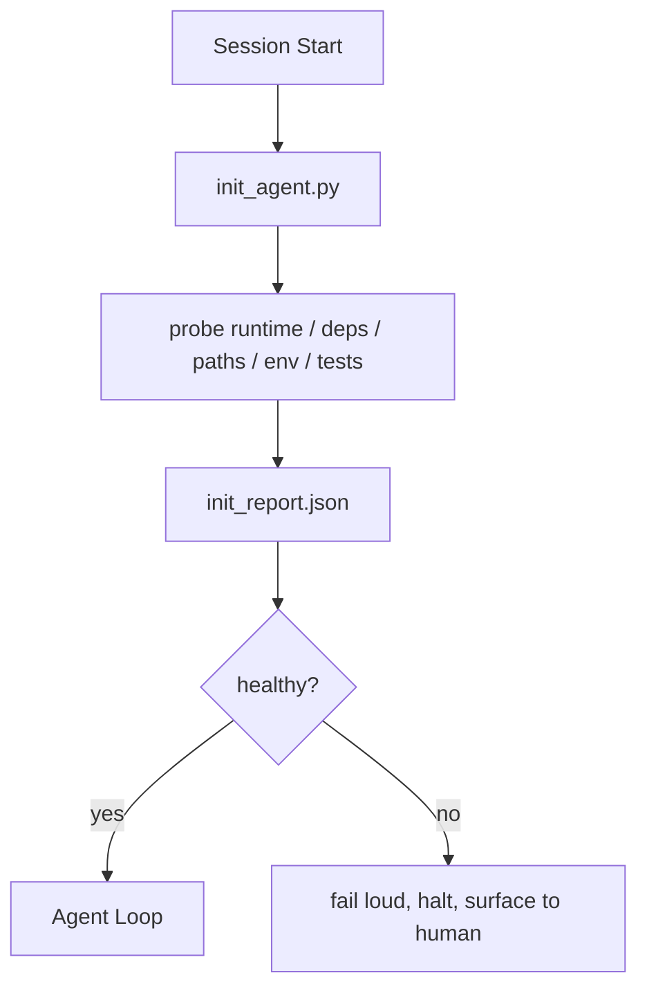

# Initialization Scripts for Agents / Agent 初始化脚本

> 每个 cold start session 都要交税。Agent 读取相同文件、重试相同 probes、重新发现相同路径。Init script 一次性支付这笔税，并把答案写进 state。

**类型：** 构建
**语言：** Python（stdlib）
**前置知识：** 第 14 阶段 · 32（Minimal Workbench）, 第 14 阶段 · 34（Repo Memory）
**时间：** 约 45 分钟

## Learning Objectives / 学习目标

- 识别哪些工作不应让 Agent 每个 session 都重做。
- 构建 deterministic init script，探测 runtime、dependencies 和 repo health。
- 持久化 probe result，让 agent 读取它，而不是重复运行 checks。
- 初始化失败时 loud、fast、且只有一个地方可查。

## The Problem / 问题

打开一个 session。Agent 猜 Python version。猜 test command。为了找到 entry point，五次列出 repo root。尝试 import 一个未安装的 package。问用户 config file 在哪里。等它真正开始编辑时，已经把一万 tokens 花在本该由一个脚本完成的 setup work 上。

修复方式是一个 initialization script：在 agent 做任何事之前运行，并写出 agent startup 时读取的 `init_report.json`。

## The Concept / 概念



### What the init script probes / Init script 探测什么

| Probe | Why it matters |
|-------|----------------|
| Runtime versions | 错误 Python 或 Node version 会导致 silent wrong-version bugs |
| Dependency availability | 现在抓到 missing package，成本只有事后发现的十分之一 |
| Test command | Agent 必须知道如何 verify；如果 command 缺失，workbench 已坏 |
| Repo paths | Hard-coded paths 会漂移；一次 resolve 并 pin |
| Environment variables | 缺失 `OPENAI_API_KEY` 是 failure surface，不是 runtime mystery |
| State + board freshness | 崩溃 session 留下的 stale state 是 footgun |
| Last-known-good commit | Session 结束时 handoff diff 的 anchor |

### Fail loud, fail fast, fail in one place / 大声失败、快速失败、集中失败

Probe failure 意味着 halt 并暴露给 human。不要说 “the agent will figure it out”。Init 的整个意义，就是在 workbench 坏掉时拒绝启动。

### Idempotent / 幂等

连续运行两次。第二次除了 fresh timestamp 外应该是 no-op。Idempotency 让你能把脚本接入 CI、hooks 或 pre-task slash command。

### Init versus startup rules / Init 与 startup rules

Rules（Phase 14 · 33）描述行动前必须为真的条件。Init 是建立这些规则可被检查的脚本。没有 init 的 rules 会变成 “be careful”。没有 rules 的 init 会变成精致的失败。

## Build It / 动手构建

`code/main.py` 实现 `init_agent.py`：

- 五个 probes：Python version、通过 `importlib.util.find_spec` 列出的 dependencies、test command resolvability、required env vars、state file freshness。
- 每个 probe 返回 `(name, status, detail)`。
- 脚本写入包含完整 probe set 的 `init_report.json`，如果任一 block-severity probe 失败，则以非零退出。

运行：

```
python3 code/main.py
```

脚本会打印 probes table，写入 `init_report.json`，happy path 下退出 0，否则以非零退出并列出 failed probes。

## Production patterns in the wild / 真实生产中的模式

三种模式能区分有用的 init script 和形式主义。

**Last-known-good commit anchoring.** 将当前 commit 与上次 successful merge 写入的 `LKG` 文件做 probe。如果 diff 超过预算（默认 50 files），拒绝启动，并要求 human 确认新的 baseline。这就是 Cloudflare 的 AI Code Review 用来约束 reviewer agents 的方式：每个 review session 都锚定到同一个 last-known-good，从不跨 sessions 叠加 drift。

**Lock files with TTL.** 第一次成功 probe pass 后写入 `prereqs.lock`。后续 runs 在 N 小时内（默认 24h）信任该 lock，并跳过 expensive probes。Init script 先读 lock；如果新鲜且 dependency manifest hash 匹配，就 short-circuit。这与 Docker layer caches 的模式相同：idempotent probe + content hash = skip。

**No network, no LLM, no surprises in the hot path.** Init probes 是 deterministic plumbing。一个 probe 如果调用 LLM 分类 failure，或访问 external service 检查 license，那就不是 probe，而是 workflow。如果某个 probe 在 dry run 中超过三秒，把它视为 workbench smell：要么移出 init，要么缓存结果。

## Use It / 应用它

生产中：

- **Claude Code hooks.** `pre-task` hook 调用 init script；失败时拒绝启动 agent。
- **GitHub Actions.** 一个 `setup-agent` job 运行 init script；agent job 依赖它。
- **Docker entrypoint.** Agent container 先运行 init script，再 exec agent runtime；失败时通过 logs 暴露。

Init script 可移植，因为它不调用特定 framework。Bash、Make 或 tasks file 都可以包它。

## Ship It / 交付它

`outputs/skill-init-script.md` 会访谈项目，把 setup work 分类为 probes，并输出 project-specific `init_agent.py` 与一个在任何 agent step 前运行它的 CI workflow。

## Exercises / 练习

1. 增加一个 probe，把当前 commit 与 last-known-good commit 做 diff，如果变更超过 50 个文件，则拒绝启动。
2. 让脚本写入 `prereqs.lock` 文件；如果 lock 超过七天，则拒绝启动。
3. 增加 `--fix` flag，自动安装缺失 dev dependencies，但未经 approval 永不修改 runtime dependencies。
4. 把 probes 从 hardcoded functions 移到 YAML registry。说明权衡。
5. 给每个 probe 增加 timing budget。任何超过三秒的 probe 都是 workbench smell。

## Key Terms / 关键术语

| 术语 | 常见说法 | 实际含义 |
|------|----------------|------------------------|
| Probe | “A check” | 返回 `(name, status, detail)` 的 deterministic function |
| Init report | “Setup output” | 写在 state 旁边、包含 probe results 的 JSON |
| Idempotent | “Safe to re-run” | 连续两次运行输出相同 reports，timestamp 除外 |
| Fail loud | “Don't swallow” | Halt 并暴露给 human；没有 silent fallback |
| Setup tax | “Bootstrap cost” | Agent 每个 session 为重新发现显而易见的东西花掉的 tokens |

## Further Reading / 延伸阅读

- [Anthropic, Effective harnesses for long-running agents](https://www.anthropic.com/engineering/effective-harnesses-for-long-running-agents)
- [GitHub Actions, composite actions for setup](https://docs.github.com/en/actions/sharing-automations/creating-actions/creating-a-composite-action)
- [microservices.io, GenAI dev platform: guardrails](https://microservices.io/post/architecture/2026/03/09/genai-development-platform-part-1-development-guardrails.html) — pre-commit + CI checks as init
- [Augment Code, How to Build Your AGENTS.md (2026)](https://www.augmentcode.com/guides/how-to-build-agents-md) — init expectations
- [Codex Blog, Codex CLI Context Compaction](https://codex.danielvaughan.com/2026/03/31/codex-cli-context-compaction-architecture/) — session start as compaction-aware init
- Phase 14 · 33 — the rule set this script enables
- Phase 14 · 34 — the state file this script seeds
- Phase 14 · 38 — the verification gate the init script feeds
- Phase 14 · 40 — the handoff that consumes the init report's last-known-good
