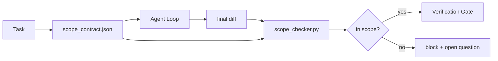

# Scope Contracts and Task Boundaries / Scope Contracts 与任务边界

> 模型不知道工作到哪里结束。Scope contract 是 per-task file，说明工作从哪里开始、到哪里结束，以及如果越界该如何回滚。Contract 把 “stay in scope” 从愿望变成 check。

**类型：** 构建
**语言：** Python（stdlib）
**前置知识：** 第 14 阶段 · 32（Minimal Workbench）, 第 14 阶段 · 33（Rules as Constraints）
**时间：** 约 50 分钟

## Learning Objectives / 学习目标

- 编写一个 agent 在 task start 读取、verifier 在 task end 读取的 scope contract。
- 指定 allowed files、forbidden files、acceptance criteria、rollback plan 和 approval boundaries。
- 实现 scope checker，把 diff 与 contract 对比并标记 violations。
- 让 scope creep 变得可见、自动化、可 review。

## The Problem / 问题

Agents 会 creep。任务是 “fix the login bug”。Diff 却碰了 login route、email helper、database driver、README 和 release script。每一次触碰在当时都有貌似合理的理由。合起来，它们就变成了一个和原 review 不同的 change。

Scope creep 是 agent work 中最缺少监控的 failure mode，因为 agent 会真诚地讲述每一步。修复方式不是更严格的 prompt，而是一个写在磁盘上的 contract：说明承诺过什么，并用 check 把结果与承诺对比。

## The Concept / 概念



### What goes in a scope contract / Scope contract 包含什么

| Field | Purpose |
|-------|---------|
| `task_id` | 链接到 board 上的 task |
| `goal` | reviewer 可以验证的一句话 |
| `allowed_files` | agent 可写的 globs |
| `forbidden_files` | 即使是意外也不能碰的 globs |
| `acceptance_criteria` | 证明 done 的 test commands 或 assertion lines |
| `rollback_plan` | 如果必须 halt，operator 可执行的一段 runbook |
| `approvals_required` | 超出 scope 且需要 explicit human sign-off 的 actions |

没有 `forbidden_files` 的 contract 是不完整的。Negative space 是 contract 的一半。

### Globs, not raw paths / 用 globs，而不是裸路径

真实 repo 会移动文件。用 globs（`app/**/*.py`, `tests/test_signup*.py`）绑定 contract，这样 sessions 之间的 refactor 不会让 contract 失效。

### Rollback is part of scope / Rollback 是 scope 的一部分

列出如何 rollback 会迫使 contract author 思考可能出错的地方。一个无法 rollback 的 contract，不应该被批准。

### Scope check is a diff check / Scope check 是 diff check

Agent 写出 diff。Checker 读取 diff、allowed globs、forbidden globs，以及已经运行的 acceptance commands 列表。每个 violation 都是带 tag 的 finding，verification gate 可以据此拒绝。

### Two altitudes of scope: the feature list and the task contract / 两层 scope：feature list 与 task contract

Scope contract 约束一个 task。它不约束整个 project。Agent 可以在 login fix 的 contract 内完全守规矩，然后在下一轮决定项目还需要 settings page、dark mode toggle，以及重写 router。Contract 从未被问过 project 哪些工作在 scope 内，它只被问了 task 哪些文件在 scope 内。

第二层需要自己的 primitive：一个 agent 在 session start 读取的 `feature_list.json`。它是 machine-readable、ordered 的 project backlog。Agent 精确选择一个 `status` 为 `todo` 的 feature，把它的 `id` 写入 active scope contract，并被禁止在同一个 session 中启动第二个 feature。“One feature at a time” 不再是 agent 可以合理化绕过的 prompt 句子，而是它从磁盘读取的值，以及 gate 强制执行的 check。

```json
{
  "project": "knowledge-base",
  "active": "import-pdf",
  "features": [
    { "id": "import-pdf",   "status": "in_progress", "goal": "import a PDF into the library",        "done_when": "pytest tests/test_import.py && a sample PDF appears in the library view" },
    { "id": "full-text-search", "status": "todo",     "goal": "search document text and rank hits",   "done_when": "query returns ranked results with snippets" },
    { "id": "cite-answers", "status": "todo",         "goal": "answers carry source citations",        "done_when": "every answer renders at least one clickable citation" }
  ]
}
```

| Field | Purpose |
|-------|---------|
| `active` | 当前 session 允许触碰的唯一 feature；为空时表示 pick one and set it |
| `features[].id` | scope contract 的 `task_id` 指向的 stable slug |
| `features[].status` | `todo`, `in_progress`, `done`, `blocked`；同一时间只能有一个 `in_progress` |
| `features[].goal` | reviewer 可验证的一句话 |
| `features[].done_when` | 将 `in_progress` 翻转到 `done` 的 acceptance line |

两条规则让 list 成为承重结构，而不是装饰。第一，不变量 “at most one `in_progress`” 本身是 startup check（Phase 14 · 33）：如果 list 显示两个，session 拒绝启动，直到 human 解决。第二，feature list 是文件，不是 chat message，因为 chat 会滚出 context，而文件会跨 sessions、跨 agents 持久存在。Handoff（Phase 14 · 40）会把 finished feature 的 status 写回 `done`，这样下一次 session 打开时看到的是准确 board，而不是重新推导剩余工作。

Contract 与 list 通过 least privilege 组合，正如下面的 merge 所述：task contract 的 `allowed_files` 必须位于 active feature 触碰范围之内，不能越界。

## Build It / 动手构建

`code/main.py` 实现：

- `scope_contract.json` schema（JSON Schema 子集，glob arrays）。
- 一个 diff parser，把 touched files 列表和 run commands 列表转成 `RunSummary`。
- 一个 `scope_check`，针对 contract 返回 `(violations, in_scope, off_scope)`。
- 两个 demo runs：一个守住 scope，一个 creep。Checker 会用 exact file 和 reason 标出 creep。

运行：

```
python3 code/main.py
```

输出：contract、两个 runs、per-run verdicts，以及保存的 `scope_report.json`。

## Production patterns in the wild / 真实生产中的模式

一位运行 “specsmaxxing”（调用 agent 前先用 YAML 写 scope contracts）的实践者报告：不更换 agent，三周内 rabbit-hole rate 从 52% 降到 21%。起作用的是 contract，不是模型。三种模式能让收益持续。

**Violation budgets, not binary failures.** `agent-guardrails`（Claude Code、Cursor、Windsurf、Codex 通过 MCP 使用的 OSS merge gate）为每个 task 提供 `violationBudget`：预算内的小 scope slips 会作为 warnings 暴露；只有超过预算时，merge gate 才拒绝。与 `violationSeverity: "error" | "warning"` 搭配。Budget 是一个 gate 能被团队保留，而不是因为讨厌它而被关闭的关键差异。

**Severity asymmetry by path family.** 对 `docs/**` 的 off-scope writes 通常是 `warn`；对 `scripts/**`、`migrations/**`、`config/prod/**` 的 off-scope writes 永远是 `block`。这种不对称必须存在 contract 中，而不是 runtime 中，因为它是 project-specific 且会随 task 变化。

**Time and network budgets next to file budgets.** `time_budget_minutes` field 约束 wall clock；runtime 超过后未经 re-approval 拒绝继续。Hostnames 上的 `network_egress` allowlist 防止 agent 悄悄访问不属于 task 的 external API。这些也是 scope dimensions；file globs 必要但不充分。

**Multi-contract merge semantics (least privilege).** 当两个 scope contracts 同时适用（例如 project-wide contract 加 task-specific contract），merge 规则是：**intersect** `allowed_files`（两个 contract 都必须 permit path），**union** `forbidden_files`（任一方可禁止），`time_budget_minutes` 取最严格（min），`approvals_required` 累积。`network_egress` 中 `None` 表示不 enforcement，`[]` 表示 deny-all，`[...]` 表示 allowlist；merge 时，`None` defer 给另一侧，两个 lists intersect，deny-all 仍为 deny-all。把这些写进 contract schema，让 merge 机械化、可 review。

## Use It / 应用它

生产模式：

- **Claude Code slash commands.** `/scope` command 写入 contract，并把它固定为 session context。Subagents 行动前读取 contract。
- **GitHub PRs.** 把 contract 作为 JSON file 放在 PR body 或 checked-in artifact 中。CI 针对 merge diff 运行 scope checker。
- **LangGraph interrupts.** Scope violation 触发 interrupt；handler 询问 human：contract 是否需要扩大，还是 agent 应该退回。

Contract 随 task 流转。Task 关闭时，contract 归档到 `outputs/scope/closed/`。

## Ship It / 交付它

`outputs/skill-scope-contract.md` 会根据 task description 生成 scope contract，以及一个 glob-aware checker，在每个 agent diff 上由 CI 运行。

## Exercises / 练习

1. 增加 `network_egress` field，列出允许的 external hosts。拒绝触碰其他 hosts 的 runs。
2. 扩展 checker，让 `docs/**` soft fail，`scripts/**` hard fail。说明这种不对称。
3. 用 static rule set（不用 LLM）从 `goal` field 推导 `allowed_files`。第一个 edge case 会出什么问题？
4. 增加 `time_budget_minutes`，wall clock 超过后拒绝继续。
5. 在同一个 diff 上运行两个 contracts。两者同时适用时，正确的 merge semantics 是什么？

## Key Terms / 关键术语

| 术语 | 常见说法 | 实际含义 |
|------|----------------|------------------------|
| Scope contract | “The task brief” | per-task JSON，列出 allowed/forbidden files、acceptance、rollback |
| Scope creep | “It also touched...” | 同一 task 中修改了 contract 外的文件 |
| Rollback plan | “We can revert” | 用于 halting 的一段 operator runbook |
| Approval boundary | “Needs sign-off” | contract 中列出的需要 explicit human approval 的 action |
| Diff check | “Path audit” | 把 touched files 与 contract globs 对比 |

## Further Reading / 延伸阅读

- [LangGraph human-in-the-loop interrupts](https://langchain-ai.github.io/langgraph/concepts/human_in_the_loop/)
- [OpenAI Agents SDK tool approval policies](https://platform.openai.com/docs/guides/agents-sdk)
- [logi-cmd/agent-guardrails — merge gates and scope validation](https://github.com/logi-cmd/agent-guardrails) — violation budgets, severity tiers
- [Dev|Journal, Preventing AI Agent Configuration Drift with Agent Contract Testing](https://earezki.com/ai-news/2026-05-05-i-built-a-tiny-ci-tool-to-keep-ai-agent-configs-from-drifting-in-my-repo/) — `--strict` mode without external deps
- [Agentic Coding Is Not a Trap (production logs)](https://dev.to/jtorchia/agentic-coding-is-not-a-trap-i-answered-the-viral-hn-post-with-my-own-production-logs-33d9) — specsmaxxing receipts: 52% → 21%
- [OpenCode permission globs](https://opencode.ai/docs/agents/) — fine-grained per-permission scope
- [Knostic, AI Coding Agent Security: Threat Models and Protection Strategies](https://www.knostic.ai/blog/ai-coding-agent-security) — scope as part of least privilege
- [Augment Code, AI Spec Template](https://www.augmentcode.com/guides/ai-spec-template) — three-tier boundary system (must/ask/never)
- Phase 14 · 27 — prompt injection defenses that pair with scope locks
- Phase 14 · 33 — the rule set this contract specializes per task
- Phase 14 · 38 — the verification gate the checker reports into
