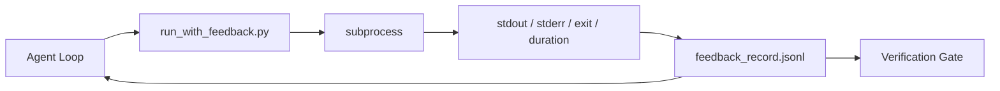

# Runtime Feedback Loops / 运行时反馈循环

> 看不到真实 command output 的 Agent 只能猜。Feedback runner 会把 stdout、stderr、exit code 和 timing 捕获成下一轮可读的 structured record。这样 Agent 响应的是事实，而不是自己对事实的预测。

**类型：** 构建
**语言：** Python（stdlib）
**前置知识：** 第 14 阶段 · 32（Minimal Workbench）, 第 14 阶段 · 35（Init Script）
**时间：** 约 50 分钟

## Learning Objectives / 学习目标

- 区分 runtime feedback 与 observability telemetry。
- 构建 feedback runner，包裹 shell commands 并持久化 structured records。
- 对大输出做 deterministic truncation，让 loop 保持在 token budget 内。
- 当 feedback 缺失时，拒绝推进 loop。

## The Problem / 问题

Agent 说 “running tests now”。下一条消息说 “all tests pass”。现实是根本没有测试运行。Agent 可能想象了输出，或者运行了命令但没有读结果，或者读了结果却静默截掉了 failure line。

Feedback runner 会移除这个缺口。每个 command 都经过 runner。每条 record 都携带 command、捕获的 stdout 和 stderr、exit code、wall-clock duration，以及一行 agent note。Agent 在下一轮读取 record。Verification gate 在任务结束时读取这些 records。

## The Concept / 概念



### What goes in a feedback record / Feedback record 包含什么

| Field | Why it matters |
|-------|----------------|
| `command` | 精确 argv，避免 shell expansion surprises |
| `stdout_tail` | 最后 N 行，deterministic truncation |
| `stderr_tail` | 最后 N 行，与 stdout 分离 |
| `exit_code` | 明确无歧义的 success signal |
| `duration_ms` | 暴露 slow probes 和 runaway processes |
| `started_at` | 用于 replay 的 timestamp |
| `agent_note` | Agent 写下的一行预期 |

### Truncation is deterministic / 截断必须确定

50 MB log 会摧毁 loop。Runner 用 `...truncated N lines...` marker 截取 head 和 tail，并且确定性处理，让同一份 output 总是产生同一条 record。不做 sampling；agent 需要看的部分（final error、final summary）通常在 tail。

### Feedback versus telemetry / Feedback 与 telemetry

Telemetry（Phase 14 · 23，OTel GenAI conventions）用于 human operators 跨时间 review runs。Feedback 用于本次 run 的下一轮。它们共享一些字段，但存在不同文件中，也有不同 retention。

### Refuse to advance without feedback / 没有 feedback 就拒绝推进

如果 runner 在捕获 exit 前出错，record 携带 `exit_code: null` 和 `error: <reason>`。Agent loop 必须拒绝在 `null` exit 上声明成功。No exit, no progress。

## Build It / 动手构建

`code/main.py` 实现：

- `run_with_feedback(command, agent_note)`，包裹 `subprocess.run`，捕获 stdout/stderr/exit/duration，确定性截断，并 append 到 `feedback_record.jsonl`。
- 一个小 loader，把 JSONL stream 成 Python list。
- 一个 demo，运行三个 commands（success、failure、slow），并打印每个 command 的最后一条 record。

运行：

```
python3 code/main.py
```

输出：追加到 `feedback_record.jsonl` 的三条 feedback records，并 inline 打印每类最后一条。跨 re-runs tail 这个文件，可以看到 loop 如何累积。

## Production patterns in the wild / 真实生产中的模式

三种模式能把 runner 强化到可发布。

**Redact at write, not at read.** 任何接触 stdout 或 stderr 的 record 都可能泄露 secrets。Runner 在 JSONL append 前运行 redaction pass：剥离匹配 `^Bearer `、`password=`、`api[_-]?key=`、`AKIA[0-9A-Z]{16}`（AWS）、`xox[baprs]-`（Slack）的行。Read time redaction 是 foot-gun；磁盘上的文件才是攻击者能触达的东西。每季度根据生产 runtime 观察到的 secret formats 审计 redaction patterns。

**Rotation policy, not a single file.** 每个 `feedback_record.jsonl` capped at 1 MB；溢出时 rotate 到 `.1`, `.2`，丢弃 `.5`。Agent loop 只读当前文件，因此 runtime cost 有界。CI artifact storage 保存完整 rotated set。没有 rotation 时，这个文件会成为每次 loader call 的瓶颈。

**Parent-command id for retry chains.** 每条 record 都有 `command_id`；retries 带 `parent_command_id`，指向上一次 attempt。Reviewer 的 “failed attempts” 列表（Phase 14 · 40）和 verification gate 的 audit 都沿着这条链追踪。没有这个链接，retries 看起来像独立成功，audit 会隐藏 failure history。

## Use It / 应用它

生产模式：

- **Claude Code Bash tool.** 这个 tool 已经捕获 stdout、stderr、exit 和 duration。本课 runner 是任何 agent product 都可用的 framework-agnostic 等价物。
- **LangGraph nodes.** 用 runner 包裹任何 shell node，让 record 持久化在 graph state 之外。
- **CI logs.** 把 JSONL 送进 CI artifact store；reviewers 无需重跑 session 也能 replay command。

Runner 是很薄的一层 wrapper，它能穿过每一次 framework migration，因为它拥有 record 的形状。

## Ship It / 交付它

`outputs/skill-feedback-runner.md` 会生成 project-specific `run_with_feedback.py`，包含正确的 truncation budget、接入 workbench 的 JSONL writer，以及 agent 每轮读取的 loader。

## Exercises / 练习

1. 给每条 record 增加 `cwd` field，让从不同目录运行的同一 command 可区分。
2. 增加 `redaction` step，剥离匹配 `^Bearer ` 或 `password=` 的行。在 fixture record 上测试。
3. 将总 `feedback_record.jsonl` 大小 capped at 1 MB，并 rotate 到 `.1`, `.2` files。说明 rotation policy。
4. 增加 `parent_command_id`，让 retry chains 可见：哪条 command 产生了下一条 command 使用的 input。
5. 把 JSONL 接进一个 tiny TUI，高亮最近的 non-zero exit。这个 TUI 必须展示哪八个 key features，才对 review 有用？

## Key Terms / 关键术语

| 术语 | 常见说法 | 实际含义 |
|------|----------------|------------------------|
| Feedback record | “Run log” | 带 command、output、exit、duration 的 structured JSONL entry |
| Tail truncation | “Trim the log” | deterministic head+tail capture，让 records 适配 token budget |
| Refuse-on-null | “Block on missing data” | 当 `exit_code` 为 null 时，loop 不能推进 |
| Agent note | “Expectation tag” | Agent 在读结果前写下的一行预测 |
| Telemetry split | “Two log files” | Feedback 给下一轮，telemetry 给 operator |

## Further Reading / 延伸阅读

- [OpenTelemetry GenAI semantic conventions](https://opentelemetry.io/docs/specs/semconv/gen-ai/)
- [Anthropic, Effective harnesses for long-running agents](https://www.anthropic.com/engineering/effective-harnesses-for-long-running-agents)
- [Guardrails AI x MLflow — deterministic safety, PII, quality validators](https://guardrailsai.com/blog/guardrails-mlflow) — redaction patterns as regression tests
- [Aport.io, Best AI Agent Guardrails 2026: Pre-Action Authorization Compared](https://aport.io/blog/best-ai-agent-guardrails-2026-pre-action-authorization-compared/) — pre/post-tool capture
- [Andrii Furmanets, AI Agents in 2026: Practical Architecture for Tools, Memory, Evals, Guardrails](https://andriifurmanets.com/blogs/ai-agents-2026-practical-architecture-tools-memory-evals-guardrails) — observability surfaces
- Phase 14 · 23 — OTel GenAI conventions for the telemetry side
- Phase 14 · 24 — agent observability platforms (Langfuse, Phoenix, Opik)
- Phase 14 · 33 — the rule that demands feedback before declaring done
- Phase 14 · 38 — the verification gate that reads the JSONL
