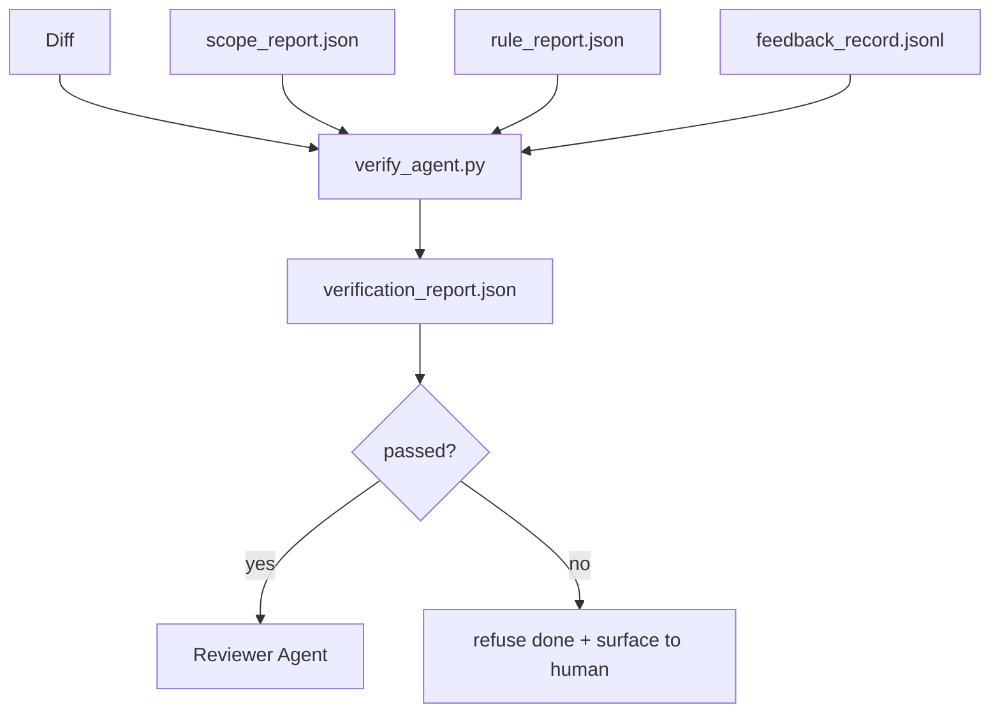

# Verification Gates / 验证门

> Agent 不能给自己的工作标记 done。Verification gate 会读取 scope contract、feedback log、rule report 和 diff，并回答一个问题：这个 task 是否真的完成？如果 gate 说 no，那么不管 chat 里怎么说，任务都没有完成。

**类型：** 构建
**语言：** Python（stdlib）
**前置知识：** 第 14 阶段 · 33（Rules）, 第 14 阶段 · 36（Scope）, 第 14 阶段 · 37（Feedback）
**时间：** 约 55 分钟

## Learning Objectives / 学习目标

- 将 verification gate 定义为 workbench artifacts 上的 deterministic function。
- 把 rule report、scope report、feedback records 和 diff 合并成单一 verdict。
- 输出 reviewer agent 和 CI 都能读取的 `verification_report.json`。
- 对任何 block-severity failure 都拒绝推进 task，无例外。

## The Problem / 问题

Agents 太容易宣布成功。三种 failure shapes 最常见：

- “Looks good.” 模型读了自己的 diff，并判定它正确。
- “Tests passed.” 说得很自信。却没有任何测试实际运行的记录。
- “Acceptance met.” Acceptance criteria 被宽松解释成 “anything resembling done.”

Workbench 的修复方式是一个 verification gate：读取 agent 已经产出的 artifacts，并做出判定。Gate 是 deterministic 的。Gate 在版本控制中。Gate 接入 CI。Agent 无法贿赂它。

## The Concept / 概念



### What the gate checks / Gate 检查什么

| Check | Source artifact | Severity |
|-------|-----------------|----------|
| All acceptance commands ran | `feedback_record.jsonl` | block |
| All acceptance commands exited zero | `feedback_record.jsonl` | block |
| Scope check has no forbidden writes | `scope_report.json` | block |
| Scope check has no off-scope writes | `scope_report.json` | block or warn |
| All block-severity rules pass | `rule_report.json` | block |
| No `null` exit codes in feedback | `feedback_record.jsonl` | block |
| Touched files match `scope.allowed_files` | both | warn |

`warn` finding 会标注 verdict；`block` finding 会阻止 `passed: true`。

### Deterministic, not probabilistic / 确定性，而不是概率性

同一组 artifacts 下，gate 每次都必须产生同一个 verdict。不要用 LLM judges。LLM judges 属于 reviewer side（Phase 14 · 39），那里目标是 qualitative evaluation，而不是状态判定。

### One report, one path / 一个 report，一个路径

Gate 为每个 task close-out 输出一个 `verification_report.json`，写入 `outputs/verification/<task_id>.json`。CI 消费同一路径。不同路径上的多个 gates 会分叉 source of truth。

### Refuse without exception / 无例外拒绝

Block-severity findings 不能被 agent override。只能由 human override，并记录 `override_reason` 和 `overridden_by` user id。Override 是 signed change，不是 agent decision。

## Build It / 动手构建

`code/main.py` 实现：

- 每个 input artifact 的 loader，全部本地 stub，保证课程 self-contained。
- 一个 `verify(task_id, artifacts) -> VerdictReport` pure function。
- 一个 printer，展示 per-check results 和 final pass/fail。
- 三个 task scenarios 的 demo：clean pass、scope creep、missing acceptance。

运行：

```
python3 code/main.py
```

输出：三份 verdict reports，每份都保存在脚本旁边。

## Production patterns in the wild / 真实生产中的模式

四种模式能把 gate 从 “另一个 lint job” 提升为 “deciding edge”。

**Defense-in-depth, not single gate.** Pre-commit hook → CI status check → pre-tool authz hook → pre-merge gate。每一层都是 deterministic，因此一层失败会被下一层抓住。microservices.io 2026 年 3 月 playbook 明确指出：pre-commit hook 不可绕过，因为它不同于 model-side skill，不依赖 agent 是否遵守 instructions。Verification gate 位于 CI / pre-merge 层。

**Defense by deterministic check, model-judge only for nuance.** Anthropic 2026 Hybrid Norm pairing：verifiable rewards（unit tests、schema checks、exit codes）回答 “did the code solve the problem?”；LLM rubrics 回答 “is the code readable, secure, on-style?” Gate 跑第一类；reviewer（Phase 14 · 39）跑第二类。混在一起会让信号坍塌。

**Signed override log, not Slack threads.** 每个 override 都向 `outputs/verification/overrides.jsonl` 写入一行：timestamp、finding code、reason、signing user、current HEAD commit。Runtime 拒绝任何缺少 signature 的 override；audit trail 被 git-tracked。这是 override policy 与 override theater 的分界线。

**Coverage floor as a first-class check.** `coverage_report.json` 输入 `coverage_floor`（默认 80%）check。如果 measured coverage 低于 floor，或比上次 merge 的 floor 降低超过 1 个百分点，gate 失败。没有这个 check，agents 会悄悄删除失败 tests，而 verification reports 仍然是 green。

**`--strict` mode promotes warns to blocks.** 对 release branches、ship-blocking PRs 或 post-incident triage，`--strict` 会把每个 warning 变成 hard fail。这个 flag 按 branch opt-in；不要作为全局默认，因为 strict-on-everything 会侵蚀日常流动。

## Use It / 应用它

生产模式：

- **CI step.** `verify_agent` job 针对 agent 的 final artifacts 运行 gate。没有 `passed: true`，merge protection 拒绝。
- **Pre-handoff hook.** Agent runtime 在生成 handoff doc 前调用 gate。没有 green verdict，就没有 handoff。
- **Manual triage.** 当 agent 宣称成功而 human 怀疑时，operators 读取 report。

Gate 是 workbench flow 中的 deciding edge。其他所有 surface 都在它上游。

## Ship It / 交付它

`outputs/skill-verification-gate.md` 会把 gate 接入具体项目：哪些 acceptance commands 输入它、哪些 rules 是 block-severity、哪些 off-scope writes 可容忍、override audit log 如何存储。

## Exercises / 练习

1. 增加 `coverage_floor` check：test command 必须产生至少 80% 的 coverage report。决定哪个 artifact 承载 floor。
2. 支持 `--strict` mode，把所有 `warn` 提升为 `block`。说明哪些情况应默认使用 strict mode。
3. 让 gate 除 JSON 外再输出 Markdown summary。说明 summary 应包含哪些字段。
4. 增加 `time_since_last_human_touch` check：human keystroke 后 60 秒内编辑的任何文件，都免除 off-scope flags。
5. 在你产品中的真实 agent diff 上运行 gate。有多少 findings 是真实问题，多少是噪声？Gate 需要在哪里成长？

## Key Terms / 关键术语

| 术语 | 常见说法 | 实际含义 |
|------|----------------|------------------------|
| Verification gate | “The check that stops things” | workbench artifacts 上的 deterministic function，输出 pass/fail verdict |
| Block severity | “Hard fail” | 阻止 `passed: true` 且需要 signed override 的 finding |
| Override log | “Why we let it through” | 带 reason 和 user id 的 signed entries，由 review 审计 |
| Acceptance command | “The proof” | zero exit 代表 `done` 的 shell command |
| One report path | “Source of truth” | `outputs/verification/<task_id>.json`，CI 与 humans 共同消费 |

## Further Reading / 延伸阅读

- [Anthropic, Harness design for long-running application development](https://www.anthropic.com/engineering/harness-design-long-running-apps)
- [OpenAI Agents SDK guardrails](https://platform.openai.com/docs/guides/agents-sdk/guardrails)
- [microservices.io, GenAI dev platform: guardrails](https://microservices.io/post/architecture/2026/03/09/genai-development-platform-part-1-development-guardrails.html) — defense in depth between pre-commit and CI
- [ICMD, The 2026 Playbook for Agentic AI Ops](https://icmd.app/article/the-2026-playbook-for-agentic-ai-ops-guardrails-costs-and-reliability-at-scale-1776661990431) — approval-gate ladder (draft → approval → auto under thresholds)
- [Type-Checked Compliance: Deterministic Guardrails (arXiv 2604.01483)](https://arxiv.org/pdf/2604.01483) — Lean 4 as the upper bound of deterministic gating
- [logi-cmd/agent-guardrails — merge gate spec](https://github.com/logi-cmd/agent-guardrails) — scope + mutation-testing gates
- [Guardrails AI x MLflow](https://guardrailsai.com/blog/guardrails-mlflow) — deterministic validators as CI scorers
- [Akira, Real-Time Guardrails for Agentic Systems](https://www.akira.ai/blog/real-time-guardrails-agentic-systems) — pre/post-tool gates
- Phase 14 · 27 — prompt injection defenses (the gate's adversarial pair)
- Phase 14 · 36 — the scope contract this gate enforces
- Phase 14 · 37 — the feedback log this gate scores
- Phase 14 · 39 — the reviewer agent the gate hands off to
