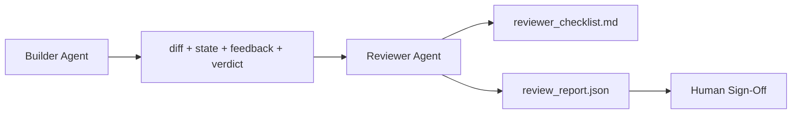

# Reviewer Agent: Separate Builder from Marker / Reviewer Agent：把 Builder 与 Marker 分开

> 写代码的 Agent 不能给自己的代码打分。Reviewer 是第二个 loop，带不同 system prompt、不同 goal，并且对 builder 产出的所有东西只有 read-only access。Builder 与 reviewer 之间的间隔，是可靠性的主要来源。

**类型：** 构建
**语言：** Python（stdlib）
**前置知识：** 第 14 阶段 · 38（Verification Gate）
**时间：** 约 55 分钟

## Learning Objectives / 学习目标

- 说明为什么同一个 agent 无法可靠地 review 自己的工作。
- 构建 reviewer agent loop，消费 builder artifacts 并输出 structured review report。
- 编写 reviewer rubric，评分具体维度，而不是凭感觉。
- 把 reviewer 接入 workbench，让 human review step 从真实 artifact 开始。

## The Problem / 问题

你让 agent 修一个 bug。它编辑四个文件，运行 tests，并报告完成。Verification gate（Phase 14 · 38）确认 acceptance 已运行且 scope 守住了。Gate 给出 `passed: true`。你合并。两天后发现，这个 fix 解决的是 bug 的另一半。

Acceptance 必要但不充分。Reviewer 会问 acceptance 无法问的问题：这是否解决了正确的问题？是否扩大 scope 却没标记？是否记录了本应被质疑的 assumptions？是否让 workbench 处于下一次 session 可以接手的状态？

## The Concept / 概念



### Reviewer rubric / Reviewer 评分规约

五个维度，每个 0 到 2 分。

| Dimension | Question |
|-----------|----------|
| Problem fit | change 是否解决了 task stated，而不是相邻 task？ |
| Scope discipline | edits 是否限制在 contract 内，或 contract 是否被有意扩大？ |
| Assumptions | 所有 hidden assumptions 是否写在可 review 的地方？ |
| Verification quality | acceptance command 是否真的证明 goal，还是只证明了更弱版本？ |
| Handoff readiness | 下一次 session 是否能从当前 state 干净接手？ |

总分 10。低于 7 是 soft fail；低于 5 是 hard fail。

### The reviewer is a separate role, not a separate model / Reviewer 是独立角色，不一定是独立模型

Reviewer 可以使用与 builder 相同的模型。纪律在于 role separation：不同 system prompt、不同 inputs、对 diff 无 write access。姿态变化带来信号变化。

### The reviewer cannot edit the diff / Reviewer 不能编辑 diff

Reviewer 读取 diff、state、feedback、verdict。它写 report。它不 patch diff。如果 report 说 “fix this”，下一轮 builder 去修；reviewer 回到 review。混合角色会消除这个间隔。

### Reviewer rubric versus verification gate / Reviewer rubric 与 verification gate

Gate（Phase 14 · 38）检查确定性事实：acceptance 是否运行、rules 是否通过、scope 是否守住。Reviewer 做 qualitative judgments：这是否是正确工作、是否有文档记录、handoff 是否可用。两者都必需。

## Build It / 动手构建

`code/main.py` 实现：

- 一个 `ReviewerInputs` dataclass，捆绑 reviewer 读取的 artifacts。
- 一个 rubric scorer，每个 dimension 一个 function。每个 function 都是 deterministic 且在本课中 stub-grade；真实实现会调用 LLM。
- 一个 `review_report.json` writer，包含五个 scores、total 和 verdict（`pass`, `soft_fail`, `hard_fail`）。
- 两个 demo cases：clean change 和 “right tests, wrong problem” change。

运行：

```
python3 code/main.py
```

输出：写入磁盘的两份 review reports，以及一张 console table 展示 dimensional scores。

## Production patterns in the wild / 真实生产中的模式

证据：Cloudflare 2026 年 4 月的 AI Code Review system 在 30 天内覆盖 5,169 repos、48,095 merge requests，运行 131,246 次 reviews。Median review 用时 3 分 39 秒。最多七个 specialist reviewers（security、performance、code quality、docs、release management、compliance、Engineering Codex）在 Review Coordinator 下并行运行，由 coordinator 去重 findings 并判断 severity。Top-tier model 只保留给 coordinator；specialists 使用更便宜 tier。

四种模式让它可扩展：

**Specialist pool, not one big reviewer.** 一个带 5-dimension rubric 的 reviewer 适合 solo repos。一旦 codebase 有 security-critical、performance-critical 和 docs surfaces，就拆成更小 prompt 的 specialists。Coordinator 做 deduplication；specialists 不跑完整 rubric。Model-tier separation 自然出现：便宜 specialists，昂贵 coordinator。

**Bias mitigation as design requirement, not optimization.** LLM judges 有四类稳定 biases（Adnan Masood, April 2026）：position bias（GPT-4 在 (A,B) vs (B,A) 排序上约 40% inconsistent）、verbosity bias（较长 outputs 约 +15% score inflation）、self-preference（judges 偏好同 model family 的 outputs）、authority（judges 高估对知名作者的引用）。缓解：评估两种排序，只计算 consistent wins；使用 1-4 scales 并显式奖励简洁；跨 model families 轮换 judges；评分前去掉作者名。

**Calibration set, not vibes.** 准备 10-20 个带 known correct verdicts 的 historical tasks。每次 prompt change 都让 reviewer 跑一遍。如果与 historical record 的一致性低于 80%，reviewer 发布前需要修订 rubric。每个团队最终都会重新发现这点；最好一开始就做。

**Hybrid norm with the gate.** Verification gate（Phase 14 · 38）处理 deterministic checks（acceptance 是否运行、tests 是否通过、scope 是否守住）。Reviewer 处理 semantic checks（这是否是正确工作、assumptions 是否记录、handoff 是否可用）。Anthropic 2026 guidance 明确强调这个 split：不要让 reviewer 重做 gate 已经证明的事情。

## Use It / 应用它

生产模式：

- **Claude Code subagents.** Builder 关闭 task 后，reviewer subagent 运行。它用 rubric scores 在 PR 上发 comment。
- **OpenAI Agents SDK handoffs.** Builder 在 task completion 时 hand off 给 Reviewer。Reviewer 可以带 findings 交回 builder，或升级给 human。
- **Two-model pairing.** Builder 用更快更便宜的模型。Reviewer 用更强模型，但 context 更小，专注 judgment。

Reviewer 是 workbench 在 humans 无法完成每次 review 时长出的第二双眼睛。

## Ship It / 交付它

`outputs/skill-reviewer-agent.md` 会生成 project-specific reviewer rubric、接入 builder artifacts 的 reviewer agent stub，以及与 verification gate 的 integration，让 human review 从 written report 而不是 blank page 开始。

## Exercises / 练习

1. 增加第六个与你 product domain 相关的 dimension。说明为什么它没有被现有五个吸收。
2. 用两个不同 system prompts（terse、verbose）运行 reviewer。哪一个产出的 report 更可能被 human 阅读？
3. 给每个 dimension 增加 `confidence` field。当最低 dimension 的 confidence 低于 0.6 时，拒绝发布 report。
4. 构建 calibration set：10 个 historical task close-outs，带 known correct verdicts。运行 reviewer。它在哪些地方不同意 historical record？
5. 增加 “request more evidence” affordance：reviewer 可在 scoring 前要求 builder 运行某个具体 test。怎样 back-off 才不会 loop？

## Key Terms / 关键术语

| 术语 | 常见说法 | 实际含义 |
|------|----------------|------------------------|
| Reviewer rubric | “Checklist” | 五维 0-2 scoring，每个 dimension 有 written question |
| Soft fail | “Needs revisions” | 总分低于 7；builder 收到 findings 去修 |
| Hard fail | “Reject” | 总分低于 5 或任一 dimension 为 0；halt 并暴露给 human |
| Role separation | “Different prompt” | 同一模型可扮演两种角色；纪律在 inputs 与 posture |
| Confidence floor | “Don't ship low-signal reports” | rubric 不确定时拒绝输出 verdict |

## Further Reading / 延伸阅读

- [OpenAI Agents SDK handoffs](https://platform.openai.com/docs/guides/agents-sdk/handoffs)
- [Anthropic Claude Code subagents](https://docs.anthropic.com/en/docs/agents-and-tools/claude-code/sub-agents)
- [Cloudflare, Orchestrating AI Code Review at Scale](https://blog.cloudflare.com/ai-code-review/) — 7-specialist + coordinator architecture, 131k runs / 30 days
- [Agent-as-a-Judge: Evaluating Agents with Agents (OpenReview / ICLR)](https://openreview.net/forum?id=DeVm3YUnpj) — DevAI benchmark, 366 hierarchical solution requirements
- [Adnan Masood, Rubric-Based Evaluations and LLM-as-a-Judge: Methodologies, Biases, Empirical Validation](https://medium.com/@adnanmasood/rubric-based-evals-llm-as-a-judge-methodologies-and-empirical-validation-in-domain-context-71936b989e80) — the 4 biases and mitigations
- [MLflow, LLM-as-a-Judge Evaluation](https://mlflow.org/llm-as-a-judge) — production tooling for separated builder/evaluator
- [LangChain, How to Calibrate LLM-as-a-Judge with Human Corrections](https://www.langchain.com/articles/llm-as-a-judge) — calibration-set workflow
- [Evidently AI, LLM-as-a-judge: a complete guide](https://www.evidentlyai.com/llm-guide/llm-as-a-judge)
- [Arize, LLM as a Judge — Primer and Pre-Built Evaluators](https://arize.com/llm-as-a-judge/)
- Phase 14 · 05 — Self-Refine and CRITIC (single-agent self-review baseline)
- Phase 14 · 30 — Eval-driven agent development (calibration set generator)
- Phase 14 · 38 — the verification gate the reviewer reads
- Phase 14 · 40 — the handoff packet the reviewer report feeds
