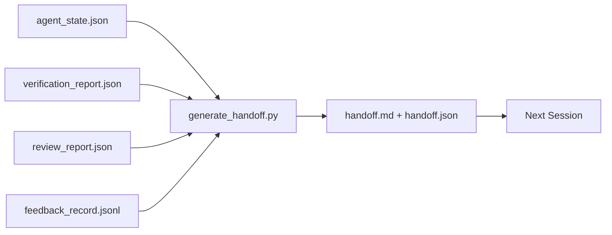

# Multi-Session Handoff / 多 Session 交接

> Session 会结束，工作不会。Handoff packet 是把 “the agent worked for an hour” 变成 “the next session is productive in the first minute” 的 artifact。要有意识地构建它，而不是事后补一句总结。

**类型：** 构建
**语言：** Python（stdlib）
**前置知识：** 第 14 阶段 · 34（Repo Memory）, 第 14 阶段 · 38（Verification）, 第 14 阶段 · 39（Reviewer）
**时间：** 约 50 分钟

## Learning Objectives / 学习目标

- 识别每个 handoff packet 需要的七个 fields。
- 从 workbench artifacts 生成 handoff，而不是手写 prose。
- 把大型 feedback logs 裁剪成适合 handoff 的 summary。
- 让下一次 session 的第一个 action 确定化。

## The Problem / 问题

Session 结束。Agent 说 “great, we made progress”。下一次 session 打开。下一个 agent 问 “where did we leave off?” 第一个 agent 的回答已经消失。下一个 agent 重新发现、重新运行相同 commands、重新向 human 问相同问题，并花三十分钟恢复上一个 session 最后三十秒的信息。

糟糕 handoff 的成本，会在任务生命周期内的每个 session 重复支付。修复方式是在 session end 自动生成 packet：改了什么、为什么改、尝试了什么、失败了什么、还剩什么、下次先做什么。

## The Concept / 概念



### Seven fields every handoff carries / 每个 handoff 都携带的七个字段

| Field | Question it answers |
|-------|---------------------|
| `summary` | 一段话说明完成了什么 |
| `changed_files` | diff 一眼总览 |
| `commands_run` | 实际执行过什么 |
| `failed_attempts` | 尝试过什么，为什么没用 |
| `open_risks` | 下一次 session 可能踩到什么，带 severity |
| `next_action` | 下一次 session 的第一个具体步骤 |
| `verdict_pointer` | verification + review reports 的路径 |

`next_action` field 是承重项。缺少 `next_action` 的 handoff，即使其他字段齐全，也只是 status report，不是 handoff。

### Handoffs are generated, not written / Handoff 应生成，而不是手写

手写 handoff 在困难日子里一定会被跳过。Generator 读取 workbench artifacts 并输出 packet。Agent 的职责是让 workbench 处于 generator 能总结的状态，而不是亲手写总结。

### Two forms: human-readable and machine-readable / 两种形态：给人读、给机器读

`handoff.md` 给 human 读。`handoff.json` 给下一个 agent 加载。两者来自同一组 source artifacts。如果它们分歧，以 JSON 为准。

### Feedback log trimming / Feedback log 裁剪

完整 `feedback_record.jsonl` 可能有数百条 entries。Handoff 只携带最后 K 条，加上所有 non-zero exit entries。下一次 session 需要时可以加载完整 log，但 packet 保持小。

### Leave a clean state / 留下干净状态

Handoff 描述工作。Clean state 让工作可恢复。两者不是一回事。如果下一次 session 打开时看到 half-applied diff、agent 忘掉的 temp file、stray branch，以及还没开始就报错的 tests，那么再完美的 `handoff.md` 也没价值。下一个 agent 会把前十分钟花在清理上一个 agent 留下的东西，而不是构建；这个成本会在任务生命周期中每个 session 叠加。

所以 session 不在 feature 工作时结束。它在 workbench 处于 generator 可以总结、下一次 session 可以信任的状态时结束。Cleanup 是自己的阶段，在 handoff 前运行；它是 check，不是习惯，因为习惯会在困难日子里被跳过。

| Check | Clean means | Dirty blocks because |
|-------|-------------|----------------------|
| Working tree | 每个 change 都已 committed，或带 note 显式 stashed | Half-applied diff 会被下一个 agent 误认为 intentional work |
| Temp artifacts | 没有遗留 `*.tmp`、scratch dirs、debug prints 或 commented-out blocks | Stray files 会污染 diff 和下一个 agent 的 mental model |
| Tests | Green，或 red 但 failure 已在 `open_risks` 中命名 | Silent red test 是下一次 session 会踩进去的陷阱 |
| Feature board | `feature_list.json` status 反映现实（Phase 14 · 36） | Stale board 会把下一次 session 送去做已完成工作 |
| Branch | 在 expected branch 上，没有 detached HEAD，没有 orphan branches | Wrong branch 会让下一次 session 的 first commit 落到错误位置 |

Cleanup phase 输出包含 blocking issues 的 `clean_state.json`；空列表是 handoff generator 写 packet 前断言的 precondition。建立在 dirty tree 上的 handoff 不是交接，而是把混乱状态甩给下一次 session。两个 artifacts 配对使用：cleanup 证明 workbench 可以安全离开，handoff 证明下一次 session 知道从哪里开始。

## Build It / 动手构建

`code/main.py` 实现：

- 一个 loader，把 state、verdict、review 和 feedback 汇总成单个 `WorkbenchSnapshot`。
- 一个 `generate_handoff(snapshot) -> (markdown, payload)` function。
- 一个 filter，选择最后 K 条 feedback entries 加上所有 non-zero exits。
- 一个 demo run，在脚本旁边写入 `handoff.md` 和 `handoff.json`。

运行：

```
python3 code/main.py
```

输出：打印出的 handoff body，以及磁盘上的两个文件。

## Production patterns in the wild / 真实生产中的模式

Codex CLI、Claude Code 和 OpenCode 各自有不同 compaction story；structured handoff packet 位于它们之上。

**Compaction strategies vary; the packet schema does not.** Codex CLI 的 POST /v1/responses/compact 是 server-side opaque AES blob（OpenAI models 的 fast path）；fallback 是 appended 为 `_summary` user-role message 的本地 “handoff summary”。Claude Code 在 95% context 时运行 five-stage progressive compaction。OpenCode 使用 timestamp-based message hiding 加 5-heading LLM summary。三种不同机制，同一个需要：把能穿过 compression 的内容序列化成 portable artifact。Packet 就是这个 artifact。

**Fresh-session handoff is not compaction.** Compaction 延长 session；handoff 干净地关闭一个 session 并启动下一个。Hermes Issue #20372 的 framing（2026 年 4 月）是对的：当 in-place compression 开始劣化时，agent 应写出 compact handoff，结束 session，并在 fresh context 中 resume。Packet 会降低这次切换的成本。错误做法是持续压缩直到质量崩塌；正确做法是提前预留一次早且干净的 handoff。

**One active handoff per branch and topic.** Multi-agent coordination 更常被 stale handoffs 打垮，而不是被坏模型输出打垮。始终包含 `branch`、`last_known_good_commit`，以及 `active | superseded | archived` 之一的 `status`。Stale handoffs 归档；只有 active handoff 驱动下一次 session。这是 handoff-as-notes 与 handoff-as-state 的区别。

**Wrap up before 50-75% context, not at the wall.** 手写模式 playbook（CLAUDE.md + HANDOVER.md）报告：在 50-75% context budget 时结束 session，比到 95% 更好。Packet generator 应在 compression artifacts 污染 source state 前运行。Context 完整时写它很便宜；模型已经丢位置后写它很贵。

## Use It / 应用它

生产模式：

- **Session-end hook.** 用户关闭 chat 时，runtime 触发 generator。Packet 写入 `outputs/handoff/<session_id>/`。
- **PR template.** Generator 的 markdown 也可以作为 PR body。Reviewers 不用打开五个其他文件就能读。
- **Cross-agent handoff.** 用一个产品构建（Claude Code），用另一个继续（Codex）。Packet 是 lingua franca。

Packet 小、规则化、便宜。每个 session 都会复利节省成本。

## Ship It / 交付它

`outputs/skill-handoff-generator.md` 会生成一个贴合项目 artifact paths 的 generator、一个运行它的 end-of-session hook，以及下一位 agent startup 时读取的 `handoff.json` schema。

## Exercises / 练习

1. 增加 `assumptions_to_validate` field，暴露 builder 记录但 reviewer 没有打到 1 分以上的每个 assumption。
2. 对 failing runs 与 passing runs 用不同方式裁剪 feedback summary。说明这种不对称。
3. 包含 “questions for the human” 列表。一个问题进入 packet，而不是停留在 chat message 中，阈值是什么？
4. 让 generator 幂等：运行两次产生相同 packet。要满足这一点，什么必须稳定？
5. 增加 “next session prereqs” 小节，列出下一次 session 行动前必须加载的 exact artifacts。

## Key Terms / 关键术语

| 术语 | 常见说法 | 实际含义 |
|------|----------------|------------------------|
| Handoff packet | “Session summary” | 生成的 artifact，携带七个 fields，同时有 markdown 和 JSON |
| Next action | “What to do first” | 启动下一次 session 的一个具体步骤 |
| Feedback trim | “Log summary” | Last K records 加每个 non-zero exit |
| Status report | “What we did” | 缺少 `next_action` 的文档；有用，但不是 handoff |
| Verdict pointer | “Receipt” | 指向 verification + review reports 的路径，用于 traceability |

## Further Reading / 延伸阅读

- [Anthropic, Effective harnesses for long-running agents](https://www.anthropic.com/engineering/effective-harnesses-for-long-running-agents)
- [OpenAI Agents SDK handoffs](https://platform.openai.com/docs/guides/agents-sdk/handoffs)
- [Codex Blog, Codex CLI Context Compaction: Architecture, Configuration, Managing Long Sessions](https://codex.danielvaughan.com/2026/03/31/codex-cli-context-compaction-architecture/) — POST /v1/responses/compact and local fallback
- [Justin3go, Shedding Heavy Memories: Context Compaction in Codex, Claude Code, OpenCode](https://justin3go.com/en/posts/2026/04/09-context-compaction-in-codex-claude-code-and-opencode) — three-vendor compaction comparison
- [JD Hodges, Claude Handoff Prompt: How to Keep Context Across Sessions (2026)](https://www.jdhodges.com/blog/ai-session-handoffs-keep-context-across-conversations/) — CLAUDE.md + HANDOVER.md, 50-75% context budget
- [Mervin Praison, Managing Handoffs in Multi-Agent Coding Sessions: Fresh Context Without Losing Continuity](https://mer.vin/2026/04/managing-handoffs-in-multi-agent-coding-sessions-fresh-context-without-losing-continuity/) — distributed-systems framing
- [Hermes Issue #20372 — automatic fresh-session handoff when compression becomes risky](https://github.com/NousResearch/hermes-agent/issues/20372)
- [Hermes Issue #499 — Context Compaction Quality Overhaul](https://github.com/NousResearch/hermes-agent/issues/499) — handoff-oriented prompts in Codex CLI
- [Microsoft Agent Framework, Compaction](https://learn.microsoft.com/en-us/agent-framework/agents/conversations/compaction)
- [OpenCode, Context Management and Compaction](https://deepwiki.com/sst/opencode/2.4-context-management-and-compaction)
- [LangChain, Context Engineering for Agents](https://www.langchain.com/blog/context-engineering-for-agents)
- Phase 14 · 34 — the state file the generator reads
- Phase 14 · 38 — the verification verdict the packet points at
- Phase 14 · 39 — the reviewer report bundled into the packet
