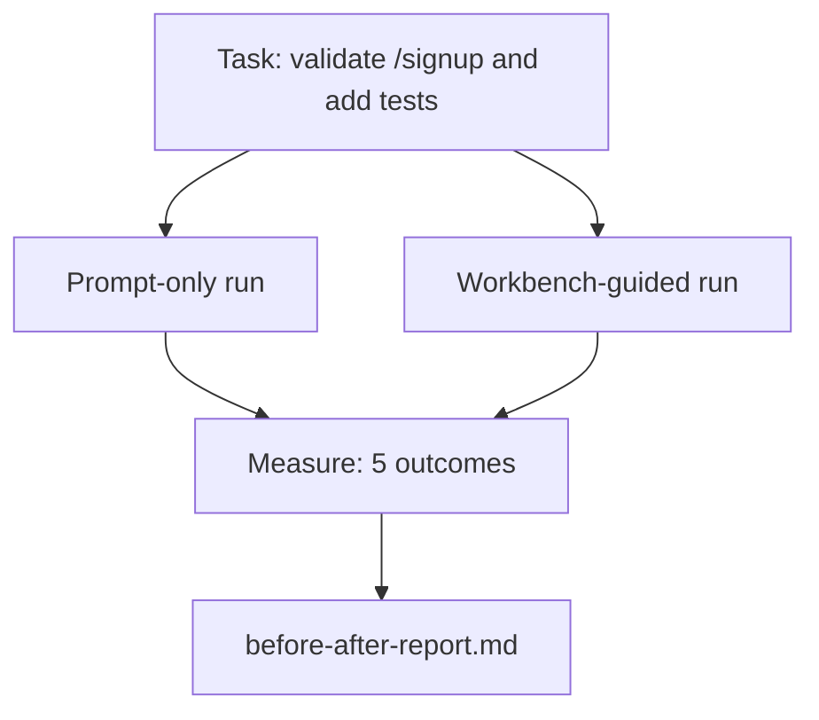

# The Workbench on a Real Repo / 真实 Repo 上的 Workbench

> 如果不能经受真实代码库的冲击，十一课 surfaces 都没有价值。本课在一个小 sample app 上把同一任务跑两遍：prompt-only 与 workbench-guided。让数字自己说话。

**类型：** 构建
**语言：** Python（stdlib）
**前置知识：** 第 14 阶段第 32-40 课
**时间：** 约 60 分钟

## Learning Objectives / 学习目标

- 在一个小应用上串起七个 workbench surfaces。
- 对同一任务运行两次（prompt-only 与 workbench-guided），并测量五个 outcomes。
- 阅读 before/after report，判断哪些 surfaces 带来最大 leverage。
- 面对 “but my model is good enough” 的质疑，能为 workbench 辩护。

## The Problem / 问题

Toy task 上的 demo 说服不了任何人。Workbench 的论据，要在一个 real-feeling repo 上、一个 real-feeling task 中成立：更少 failures、更少 reverts，并留下下一次 session 能使用的 packet。

本课提供这个 real-feeling repo，并让同一个 task 通过两条 pipelines。结果是一份 before/after report，你可以交给怀疑者。

## The Concept / 概念



### The sample app / 示例应用

`sample_app/` 中的 minimal FastAPI-style handler：

- `app.py`，包含 `/signup`（还没有 validation）。
- `test_app.py`，包含一个 happy-path test。
- `README.md` 和 `scripts/release.sh` 作为 forbidden-zone bait。

### The task / 任务

> Add input validation to `/signup`: reject passwords shorter than 8 characters, return 422 with a typed error envelope. Add a test that proves the new behavior.

### The two pipelines / 两条流水线

Prompt-only：

1. 读 README。
2. 读 `app.py`。
3. 编辑文件。
4. 声称 done。

Workbench-guided：

1. 运行 init script（Lesson 35）。
2. 读取 scope contract（Lesson 36）。
3. 读取 state（Lesson 34）。
4. 只编辑 allowed files。
5. 通过 feedback runner 运行 acceptance command（Lesson 37）。
6. 运行 verification gate（Lesson 38）。
7. 运行 reviewer（Lesson 39）。
8. 生成 handoff（Lesson 40）。

### The five outcomes measured / 测量的五个结果

| Outcome | Why it matters |
|---------|----------------|
| `tests_actually_run` | 大多数 “tests passed” claims 无法验证 |
| `acceptance_met` | 证明 goal 的 test 必须就是实际运行过的 test |
| `files_outside_scope` | Scope creep 是主导性的 silent failure |
| `handoff_quality` | 下一次 session 为此付出成本或从中受益 |
| `reviewer_total` | Gate 之上的 qualitative judgment |

## Build It / 动手构建

`code/main.py` 会在同一个 sample app fixture 上编排两条 pipelines。两条 pipelines 都是 scripted（loop 中没有 LLM），因此 measurement 可复现。脚本把 comparison 写入 `before-after-report.md` 和 `comparison.json`。

运行：

```
python3 code/main.py
```

输出：每条 pipeline 的 outcomes console table、保存到脚本旁边的 markdown report，以及给想画图的人使用的 JSON。

## Production patterns in the wild / 真实生产中的模式

怀疑者的问题是 “workbench 到底帮了多少？” 2026 年的数据比解释更有力。

**Terminal Bench Top-30 to Top-5 on the same model.** LangChain 的 *Anatomy of an Agent Harness*（2026 年 4 月）：一个 coding agent 只改变 harness，就从 Terminal Bench 2.0 的 top 30 之外跳到第五名。同一模型。不同 surfaces。二十五名的差距。

**Vercel 80% to 100% by deleting tools.** Vercel 报告：删除 agent 80% 的 tools 后，success rate 从 80% 提升到 100%。更小的 tool surface、更清晰的 scope、更少失败路径。Negative space wins。

**Harvey 2x accuracy via harness alone.** Legal agents 在没有更换模型的情况下，仅通过 harness optimization 就把 accuracy 提升超过一倍。

**88% of enterprise AI agent projects fail to reach production.** preprints.org 的 *Harness Engineering for Language Agents* paper（2026 年 3 月）把 failures 追踪到 runtime，而不是 reasoning：stale state、brittle retries、overgrown context、poor recovery from intermediate mistakes。

**Long-context collapse.** WebAgent baseline 40-50% success 在 long-context conditions 中跌到 10% 以下，主要因为 infinite loops 和 goal loss。Ralph Loop 和 handoff packet 就是为了吸收这一点。

**False negatives still exist.** Single-step factual tasks、one-line lints、formatter runs、任何模型已经逐字记住的东西 — 这些 prompt-only 更快。Benchmark 应诚实列出它们，避免把 workbench 说成永远不过度。

结论不是 “harness 永远赢”。模型会随着时间吸收 harness tricks。结论是：今天，engineering load 位于七个 surfaces 中，数字证明了这一点。

## Use It / 应用它

当以下场景出现时，本课就是你引用的 case file：

- 有人问为什么每个 PR 都带 `agent-rules.md` 和 scope contract。
- 团队想 “just for this sprint” 去掉 verification gate。
- 一个新 agent product 上线，你需要 portable benchmark 判断它是否真的省时间。

数字比解释传播得更远。

## Ship It / 交付它

`outputs/skill-workbench-benchmark.md` 是一个 portable evaluation harness：它把任何 agent product 放进两条 pipelines，在项目自己的 sample app 上运行，并报告五个 outcomes。

## Exercises / 练习

1. 增加第六个 outcome：time-to-first-meaningful-edit。如何干净测量？
2. 在你的 codebase 中一个真实 second-day task 上运行 comparison。Workbench numbers 在哪里滑落？
3. 增加一个 “false negative” pass：哪些 tasks 中 prompt-only 更快，workbench overhead 是真实成本。说明为什么仍然保留 workbench。
4. 把 scripted “agent” 替换为真实 LLM call。哪些 outcomes 会变得更 noisy？
5. 面向非工程师写一页 summary。哪些内容能留下？

## Key Terms / 关键术语

| 术语 | 常见说法 | 实际含义 |
|------|----------------|------------------------|
| Sample app | “Toy repo” | 足够小但足够真实，能覆盖七个 surfaces |
| Pipeline | “Workflow” | Agent 遵循的有序 surface reads/writes 序列 |
| Before/after report | “The receipts” | 交给怀疑者看的 artifact |
| False negative | “Workbench overkill” | prompt-only 更快的任务；需要诚实枚举 |
| Workbench benchmark | “Reliability score” | 在你的 codebase 上运行 comparison 的 portable harness |

## Further Reading / 延伸阅读

- [LangChain, The Anatomy of an Agent Harness](https://blog.langchain.com/the-anatomy-of-an-agent-harness/) — Terminal Bench Top-30 to Top-5 receipt
- [MongoDB, The Agent Harness: Why the LLM Is the Smallest Part of Your Agent System](https://www.mongodb.com/company/blog/technical/agent-harness-why-llm-is-smallest-part-of-your-agent-system) — Vercel + Harvey numbers
- [preprints.org, Harness Engineering for Language Agents](https://www.preprints.org/manuscript/202603.1756) — 88% enterprise failure rate, runtime root causes
- [HN: Improving 15 LLMs at Coding in One Afternoon. Only the Harness Changed](https://news.ycombinator.com/item?id=46988596) — replicated across 15 models
- [Cloudflare, Orchestrating AI Code Review at Scale](https://blog.cloudflare.com/ai-code-review/) — 131k review runs / 30 days in production
- [Anthropic, Building Effective Agents](https://www.anthropic.com/research/building-effective-agents)
- Phases 14 · 32 to 14 · 40 — the surfaces this lesson exercises end-to-end
- Phase 14 · 19 — SWE-bench, GAIA, AgentBench as the macro benchmarks this lesson complements
- Phase 14 · 30 — eval-driven agent development the same harness plugs into
