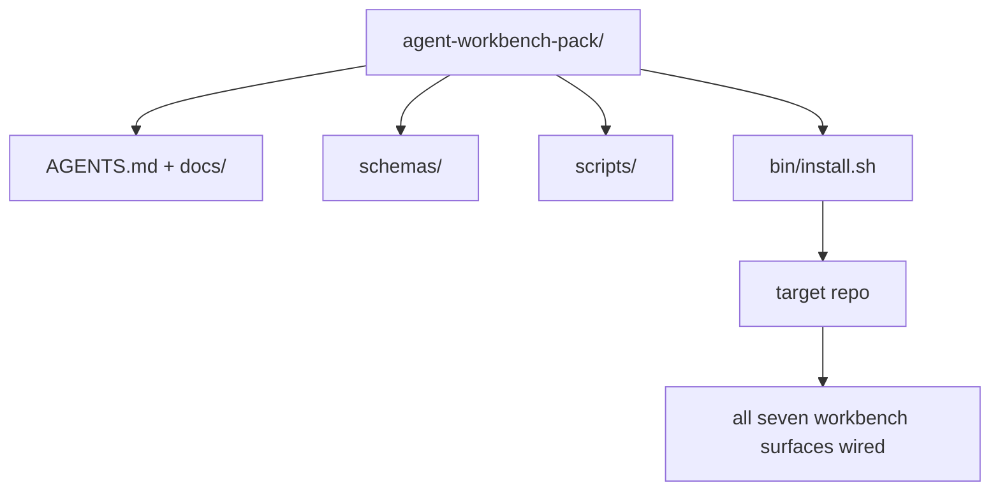

# Capstone: Ship a Reusable Agent Workbench Pack / Capstone：交付可复用 Agent Workbench Pack

> 这个 mini-track 以一个可丢进任意 repo 的 pack 结束。前面十一课沉淀的工作面被收束到一个目录中，你可以 `cp -r`，第二天早上就让 agent 可靠工作。Capstone 是这门课真正交付的成果物。

**类型：** 构建
**语言：** Python（stdlib）
**前置知识：** 第 14 阶段第 31-41 课
**时间：** 约 75 分钟

## Learning Objectives / 学习目标

- 把七个 workbench surfaces 打包进一个 drop-in directory。
- Pin schemas、scripts 和 templates，让新 repo 获得 known-good baseline。
- 增加一个 installer script，幂等地铺设 pack。
- 决定什么留在 pack 中、什么留在 pack 外，并为每个取舍辩护。

## The Problem / 问题

如果一个 workbench 分散在 Google Doc、chat history 和三个只记得一半的 scripts 中，它每个季度都会被重建一次。解法是 versioned pack：一个 repo 或 directory，包含 surfaces、schemas、scripts 和一条命令的 installer。

本课结束时，你会在磁盘上交付 `outputs/agent-workbench-pack/`，以及一个能把它放进任何 target repo 的 `bin/install.sh`。

## The Concept / 概念



### The pack layout / Pack 布局

```
outputs/agent-workbench-pack/
├── AGENTS.md
├── docs/
│   ├── agent-rules.md
│   ├── reliability-policy.md
│   ├── handoff-protocol.md
│   └── reviewer-rubric.md
├── schemas/
│   ├── agent_state.schema.json
│   ├── task_board.schema.json
│   └── scope_contract.schema.json
├── scripts/
│   ├── init_agent.py
│   ├── run_with_feedback.py
│   ├── verify_agent.py
│   └── generate_handoff.py
├── bin/
│   └── install.sh
└── README.md
```

### What stays in, what stays out / 什么留在里面，什么留在外面

In:

- Surface schemas。它们是 contract。
- 上面的四个 scripts。它们是 runtime。
- 四个 docs。它们是 rules 和 rubric。

Out:

- Project-specific tasks。Tasks 属于 target repo 的 board，不属于 pack。
- Vendor SDK calls。Pack 是 framework-agnostic。
- Onboarding prose。Pack 放在团队现有 onboarding 旁边，而不是里面。

### The installer / 安装器

一个短的 `bin/install.sh`（或 `bin/install.py`）：

1. 没有 `--force` 时，拒绝覆盖 existing pack。
2. 把 pack 复制进 target repo。
3. 如果存在 `.github/workflows/`，接入 CI。
4. 打印 next steps：填写 board、设置 acceptance commands、运行 init script。

### Versioning / 版本

Pack 携带 `VERSION` 文件。需要 migrations 的 schema bumps 和 script changes 升 major。Doc-only changes 升 patch。Target repo 的 `agent_state.json` 记录初始化时使用的 pack version。

## Build It / 动手构建

`code/main.py` 会把 pack 组装到本课旁边的 `outputs/agent-workbench-pack/`，其中预置了前面 mini-track lessons 的 schemas、scripts 和你已经写好的 docs。

运行：

```
python3 code/main.py
```

脚本会复制并 pin surfaces、写 README、打印 pack tree，并以 0 退出。重复运行是幂等的。

## Production patterns in the wild / 真实生产中的模式

只有能经受 forks、updates 和不友好 upstream 的 pack 才有价值。四种模式能做到这一点。

**`VERSION` is the contract, not the marketing.** Major bumps 需要 state migration。Minor bumps 需要 checker re-run。Patch bumps 只改 docs。Installer 每次安装都会把 `.workbench-version` 写入 target repo；如果 target 的 lock 与 pack 的 `VERSION` 不一致，`lint_pack.py` 拒绝发布。这就是 `npm`、`Cargo` 和 `pyproject.toml` 能承受十年 churn 的方式；agents 不会改变这些规则。

**Single source for cross-tool distribution.** Nx 提供一个 `nx ai-setup`，从单一 config 铺设 `AGENTS.md`、`CLAUDE.md`、`.cursor/rules/`、`.github/copilot-instructions.md` 和 MCP server。Pack 也应该如此；installer 生成 symlinks（`ln -s AGENTS.md CLAUDE.md`），让一个 source of truth 扇出到每个 coding agent。为了支持某个工具而 fork pack，是 failure mode。

**`uninstall.sh` that refuses on non-trivial state.** 卸载 pack 时不能删除用户的 `agent_state.json`、`task_board.json` 或 `outputs/`。Uninstaller 删除 schemas、scripts、docs 和 `AGENTS.md`（可用 `--keep-agents-md` opt-out），并在 state files 有任何 uncommitted changes 时拒绝继续。State 属于用户；pack 不拥有它。

**Skill-as-publishable. SkillKit-style distribution.** Pack 作为 SkillKit skill 发布：`skillkit install agent-workbench-pack` 从单一 source 把它安装到 32 个 AI agents。Pack repo 是 source of truth；SkillKit 是 distribution channel。Vendor lock-in 消失；七个 surfaces 保持不变。

## Use It / 应用它

Pack 有三种交付方式：

- **As a directory you drop into a repo.** `cp -r outputs/agent-workbench-pack /path/to/repo`.
- **As a public template repo.** Fork-and-customize，并用 `VERSION` 控制 drift。
- **As a SkillKit skill.** 接入你的 agent product，让一条命令完成铺设。

Pack 是配方；每次 install 都是一次具体实例化。

## Ship It / 交付它

`outputs/skill-workbench-pack.md` 会生成 project-tuned pack：根据团队历史锐化 rules，把 scope globs 匹配到 repo，并用一个 domain-specific entry 扩展 rubric dimensions。

## Exercises / 练习

1. 决定哪个可选 fifth doc 应该提升进 canonical pack。说明取舍。
2. 用带 `--dry-run` flag 的 Python 重写 installer。比较它与 bash 的 ergonomics。
3. 增加 `bin/uninstall.sh`，安全移除 pack，并在 state files 有 non-trivial history 时拒绝。什么算 non-trivial？
4. 增加 `lint_pack.py`，当 pack 与 `VERSION` 漂移时 fail。把它接入 pack 自己 repo 的 CI。
5. 编写从 hand-rolled workbench 迁移到这个 pack 的 runbook。怎样安排操作顺序才能最小化 downtime？

## Key Terms / 关键术语

| 术语 | 常见说法 | 实际含义 |
|------|----------------|------------------------|
| Workbench pack | “The starter kit” | 携带所有七个 surfaces 的 versioned directory |
| Installer | “Setup script” | 幂等铺设 pack 的 `bin/install.sh` |
| Pack version | “VERSION” | schema/script changes 升 major，doc-only 升 patch |
| Drop-in pack | “cp -r and go” | 第一天无需 per-repo customization 即可工作 |
| Forkable template | “GitHub template” | GitHub “Use this template” 可克隆的 public repo |

## Further Reading / 延伸阅读

- Phases 14 · 31 to 14 · 41 — every surface this pack bundles
- [SkillKit](https://github.com/rohitg00/skillkit) — install this skill across 32 AI agents
- [Nx Blog, Teach Your AI Agent How to Work in a Monorepo](https://nx.dev/blog/nx-ai-agent-skills) — single-source generator across six tools
- [agents.md — the open spec](https://agents.md/) — what your pack's router must implement
- [HKUDS/OpenHarness](https://github.com/HKUDS/OpenHarness) — reference implementation of a pack-equivalent
- [andrewgarst/agentic_harness](https://github.com/andrewgarst/agentic_harness) — Redis-backed reference with eval suite
- [Augment Code, A good AGENTS.md is a model upgrade](https://www.augmentcode.com/blog/how-to-write-good-agents-dot-md-files) — pack docs quality bar
- [Anthropic, Effective harnesses for long-running agents](https://www.anthropic.com/engineering/effective-harnesses-for-long-running-agents)
- [Anthropic, Harness design for long-running application development](https://www.anthropic.com/engineering/harness-design-long-running-apps)
- Phase 14 · 30 — eval-driven agent development that consumes the pack's verification gate
- Phase 14 · 41 — the before/after benchmark this pack improves on
