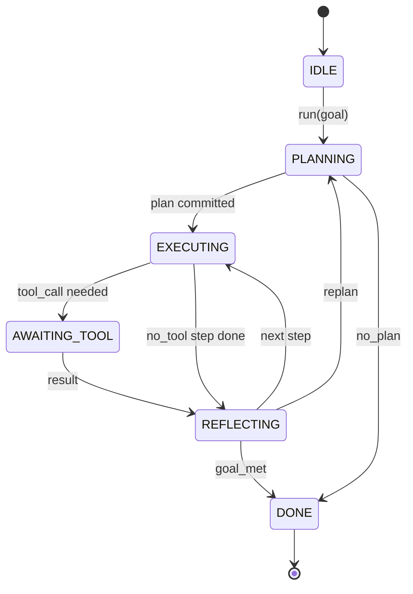

# Agent Harness Loop Contract / Agent Harness 循环契约

> Harness 才是 Agent 的主体；模型只是协处理器。本课把循环契约固定下来，让任何模型都能接入同一套运行框架。

**类型：** 构建
**语言：** Python
**前置知识：** 第 13 阶段第 01-07 课，第 14 阶段第 01 课
**时间：** 约 90 分钟

## Learning Objectives / 学习目标

- 把 Agent harness 循环描述成确定性的状态机，并明确每条状态转换。
- 实现十个生命周期 hook topic，让 operator 可以挂接 policy、telemetry 和 guardrail。
- 定义两个 pull point，让循环把控制权交还给调用方，并在新的输入上恢复。
- 在不泄露半截状态的前提下，强制执行 session 级预算：turns、tool calls、wall-clock。
- 发出包含十一个 event type 的类型化事件流，让下游 UI 和 tracer 无需窥探循环内部即可订阅。

## The Problem / 问题

一个能无人值守跑四十轮的 coding agent 不是聊天循环。它是一个状态机：节点可以被 operator 拦截，边可以被 operator 审计。只要把契约写清楚，替换模型、工具或策略就不再是重构，而是一次注册调用。

本课构建的正是这个契约。我们会命名六个状态、十个 hook topic、两个 pull point、十一个 event type，以及一个预算 envelope。harness 后续的所有部分，包括 tool registry、JSON-RPC transport、dispatcher、planner，都会插到这个形状里。

## The Concept / 概念

### The states / 状态

循环有六个状态。五个是活动状态，一个是终止状态。



`IDLE` 是唯一合法入口。`DONE` 是唯一合法出口。`AWAITING_TOOL` 是唯一会产生 pull point 的状态。其他转换都发生在循环内部。

这个状态机必须是确定性的：给定同一份 event log，harness 会回到同一个状态。这个性质让你可以重放 session 来调试，而不需要再次调用模型。

### The hook topics / Hook 主题

Hooks 是 operator 接入循环的接口。harness 会触发十个 topic，每个 topic 都可以有任意数量的 subscriber，subscriber 按注册顺序执行。subscriber 可以修改 payload、抛错中止本轮，或者返回一个 sentinel 来跳过下一步。

```text
before_plan         after_plan
before_tool_call    after_tool_call
before_step         after_step
on_error
on_pause
on_budget_exceeded
on_complete
```

这个形状接近 Claude Code、Cursor 和 OpenCode 到 2025 年中期逐渐收敛出的模式。命名是功能性的，不绑定品牌。阻止 `rm -rf` 的 hook 放在 `before_tool_call`。发送 OpenTelemetry span 的 hook 放在 `after_step`。恢复暂停 session 的 hook 放在 `on_pause`。

### The pull points / Pull point

循环在两个位置交还控制权。第一个是在 `AWAITING_TOOL`：如果没有 tool result，循环无法继续。第二个是在 `on_pause`：预算耗尽，或者某个 hook 显式要求人工复核。

pull point 不是异常，而是一次返回。调用方检查 harness state，取回 harness 需要的内容，然后调用 `resume(payload)`。harness 会从停下的位置继续。这和 Python generator 的形状相同。pull point 上的传输方式由你决定：TUI 里可以是按键，MCP 上可以是 `tools/call`，队列里可以是 job poll。

### The event stream / 事件流

循环会在契约中的固定位置追加事件到类型化 stream。stream 是 append-only 的，subscriber 可以从任意 offset 重放。这里实现的十一个 event type 是：

- `session.start` — 调用 `run(goal)` 时发出一次
- `plan.draft` — planner 返回 draft plan 时发出
- `plan.commit` — draft 被提交为 active plan 后发出
- `step.start` — 每个执行 step 开始时发出
- `step.end` — 每个执行 step 结束时发出
- `tool.call` — 需要工具的 step 把控制权交给调用方时发出
- `tool.result` — 带 tool result 恢复时发出
- `tool.error` — 带 error 恢复，或 hook 中止调用时发出
- `budget.warn` — 达到预算限制时发出
- `session.pause` — 循环因 pause（预算或 hook）而 yield 时发出
- `session.complete` — 循环到达 `DONE` 时发出一次

events 不复制 hook payload。Hooks 是命令式的：修改、阻断。Events 是观察式的：记录、发送。把二者视为正交面。

### The budget envelope / 预算 envelope

一个 session 带三个限制：turn count、tool call count、wall-clock seconds。每一轮递增 turns，每一次工具调用递增 tool calls。wall-clock 在每次状态转换时检查。任一限制达到后，循环触发 `on_budget_exceeded`，发出 `budget.warn`，然后在下一个 pull point 带着 budget-exceeded reason 转回 `IDLE`。

预算不是 kill switch，而是 yield。调用方决定是扩展预算并 resume，还是关闭 session。

## Build It / 动手构建

本课的代码固定的是循环契约，而不是模型能力。`HarnessLoop` 是主类，持有 state、触发 hooks、发出 events。`Budget` 追踪限制。`Event` 是 stream 上的类型化 envelope。`HookRegistry` 是 dispatch table。`_transition` 是唯一改变 state 的函数，因此状态机不变量集中在一处。

`main.py` 里的 deterministic planner 是替身：它返回一个硬编码三步 plan，其中两步需要 tool result。重点是循环，而不是 plan。

阅读顺序：先自上而下读 `main.py`，再读 `code/tests/test_loop.py`。测试会钉住每条转换，以及每个 hook 的触发顺序。

## Use It / 应用它

把这个契约当作后续 harness 的骨架。下一层 tool registry 只需要注册工具形状；JSON-RPC transport 只负责把调用送进来；dispatcher 只负责 timeout、retry 和 error mapping；planner 只负责给出计划。它们都不应该重新发明 Agent 循环。

在生产 harness 中，最难的不是状态机，而是让契约可执行：planner 热更新后契约仍然有效；工具返回 malformed JSON 后仍能恢复；hook 在四十轮 session 的三分之二处、于 `before_tool_call` 抛错后，状态仍然可解释。

## Ship It / 交付它

本课交付的是可复用的 loop contract：状态、hook、pull point、event stream 和 budget envelope。后续四课会依次加入 tool registry、JSON-RPC transport、dispatcher 与 plan-execute agent。到第二十四课，这个文件里的 loop 会在真实预算约束下运行真实 plan 和真实 tool。

## Exercises / 练习

1. 给 `before_tool_call` 增加一个 hook，拒绝危险命令，并确认 session 进入可重放的错误路径。
2. 写一个 subscriber，从 `session.start` offset 重放事件并恢复当前状态。
3. 增加一个 per-tool-call budget warning threshold，在真正暂停前先发出 `budget.warn`。
4. 让 `resume(payload)` 处理 malformed tool result，并确认不会跳过 `on_error`。
5. 给 `_transition` 增加测试，证明从非 `IDLE` 状态直接调用 `run(goal)` 会被拒绝。

## Key Terms / 关键术语

| 术语 | 常见说法 | 实际含义 |
|------|-----------------|------------------------|
| Harness loop | “Agent loop” | 管理 state、hooks、events、budget 和 pull points 的确定性运行壳 |
| Pull point | “Yield” | 循环把控制权还给调用方，等待 tool result 或人工确认后再 `resume` |
| Hook topic | “Lifecycle callback” | operator 可订阅的命令式接入点，可以修改 payload 或中止本轮 |
| Event stream | “Trace” | append-only 的观察记录，下游 UI 和 tracer 可以按 offset 重放 |
| Budget envelope | “Run limits” | turn、tool call 和 wall-clock 的 session 级限制，达到后 yield 而不是直接杀死 |

## Further Reading / 延伸阅读

- Phase 13 lessons 01-07：tool interface 与 protocol 基础。
- Phase 14 lesson 01：最小 Agent loop。
- Phase 19 lesson 21：接入本契约的 tool registry。
- Phase 19 lesson 22：把循环暴露给 model client 的 JSON-RPC transport。
- Phase 19 lesson 23：带 timeout、retry 和 idempotency 的 dispatcher。
