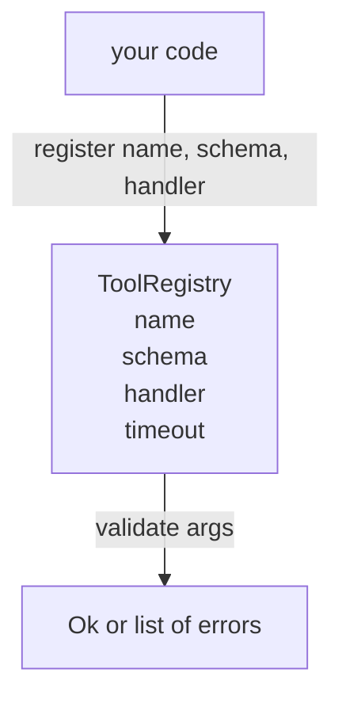

# Tool Registry with Schema Validation / 带 Schema 校验的工具注册表

> Agent 无法校验的工具，就是 Agent 不该调用的工具。先构建 registry 和 schema checker，再构建工具本身。

**类型：** 构建
**语言：** Python
**前置知识：** 第 13 阶段第 01-07 课，第 14 阶段第 01 课
**时间：** 约 90 分钟

## Learning Objectives / 学习目标

- 持有一个类型化 registry：tool name → schema → handler，让 dispatcher 查询一次后即可信任。
- 实现 JSON Schema 2020-12 的一个子集，覆盖实际 tool call 中九成会用到的 keyword。
- 返回精确的、json-pointer 形状的错误路径，让模型在一轮往返内自我修正。
- 默认拒绝重复注册，除非显式 override；静默覆盖是生产 tool catalog 漂移的根源。
- 保持 validator 纯函数化：不做 I/O、不读时间、不依赖 globals，这样 replay log 时可以重复运行。

## The Problem / 问题

2026 年的 coding agent 注册的工具数往往超过单个 context window 能容纳的数量。一个稍有规模的 harness 会注册两百个工具，而每一轮只暴露十到四十个。registry 是三个问题的真相来源：有哪些工具、参数形状是什么、应该调用哪个 handler。

我们要避免的错误是只发 handler 不发 schema，或者发了 schema 却不校验。这两种做法都会把下一层（第二十三课的 dispatcher）变成猜谜游戏，最终失败模式只剩 handler 抛出的 stack trace。

## The Concept / 概念

### What a tool record looks like / Tool record 的形状

```text
ToolRecord
  name        : str          (unique, lowercase alphanumeric and underscore segments separated by dots, e.g., snake_case.segment.case)
  description : str          (one line, shown to the model)
  schema      : dict         (JSON Schema 2020-12 subset)
  handler     : Callable     (async or sync, returns Any)
  idempotent  : bool         (dispatcher uses this for retry decisions)
  timeout_ms  : int          (override per-tool dispatcher default)
```

validator 只触碰 `schema`。`handler` 对它是不透明的。我们故意把两者分开：schema 是数据，handler 是代码。混在一起会诱导你把校验逻辑塞进 handler，而这正是本课要拦住的 bug。

### The JSON Schema 2020-12 subset / JSON Schema 2020-12 子集

完整的 2020-12 spec 很大。本课只需要八个 keyword。

```text
type           string / number / integer / boolean / object / array / null
properties     map of property name -> schema
required       list of property names
enum           list of allowed primitive values
minLength      integer, applies to strings
maxLength      integer, applies to strings
pattern        ECMA-262-compatible regex, applies to strings
items          schema applied to every array element
```

这些已经足够覆盖 tool API 的实际需要。我们不加入 `oneOf`、`anyOf`、`allOf`、`$ref` 和 conditionals，因为它们会把 validator 变成带环的 tree walker。我们在构建 registry，不是在重写完整 JSON Schema 引擎。

### Json pointer error paths / Json pointer 错误路径

校验失败时，validator 返回一组 errors。每个 error 都携带一条指向输入的 json-pointer path。pointer 是以 slash 开头的属性名和数组索引序列。

```text
{"a": {"b": [1, 2, "x"]}}
                    ^
                    /a/b/2
```

模型通常比自然语言句子更容易读懂 error path。如果 schema 要求 `args.user.email`，而模型传了 integer，错误应该是 `/user/email` 并带上 `expected_type: string`。模型下一次调用就能直接修正，不需要再来一轮解释。

### Registration and override / 注册与覆盖

`register(name, schema, handler, **opts)` 默认拒绝重复注册。调用方必须传 `override=True` 才能替换。这是运维卫生：代码库两个部分静默注册同一个 tool name，是那种生产环境里要花一周才能找到的 bug。

registry 暴露三个读方法。`get(name)` 返回 record 或抛错。`validate(name, args)` 返回 `Ok` 或 error list。`names()` 按注册顺序返回工具名。

### What the validator is and is not / Validator 是什么，不是什么

它是对 schema tree 的一次递归单遍扫描。它是纯函数。它不调用 handler，不做类型强制转换（字符串 `"42"` 不能通过 number schema），也不会静默截断。

它不是安全边界。恶意 handler 仍然可以在校验通过后做坏事。第二十三课的 dispatcher 会加入 timeout 和 sandbox 层。registry 只负责 shape。



## Build It / 动手构建

`code/main.py` 定义 `ToolRegistry`、`ToolRecord`、`ValidationError` 和八个 validator function。validator 根据 `schema["type"]` 分发；如果 schema 带 `enum` 但没有类型，则按无类型 enum check 处理。每个 type validator 返回空列表或 `ValidationError` 列表。顶层 walker 在向下递归时拼接 error，并补上 path segments。

`code/tests/test_registry.py` 覆盖注册、override、校验成功、带 path 的校验失败，以及子集中的每个 keyword。

## Use It / 应用它

dispatcher 调用工具前，只需要问 registry 两件事：这个名字是否存在，args 是否符合 schema。handler 不需要重复参数 shape 判断；transport 不需要理解 tool catalog；planner 也不需要猜参数结构。

当 tool catalog 超过五十个后，你会想加入两个扩展：对本地 definitions block 的 `$ref` resolution，以及严格形状的 `additionalProperties: false`。二者都很常见，但本课先保留核心路径，让 registry 的职责清楚可读。

## Ship It / 交付它

本课交付一个可被 dispatcher 信任的工具注册表：工具名唯一、schema 可校验、错误路径可反馈给模型、重复注册必须显式 override。第二十二课会构建把这个 registry 暴露给 model client 的 JSON-RPC stdio transport，第二十三课会在其外层包上 timeout 和 retry。

## Exercises / 练习

1. 增加 `additionalProperties: false`，让 object schema 可以拒绝多余字段。
2. 为 `$ref` 加入只指向本地 definitions 的解析，不支持远程 URL。
3. 给 `pattern` 错误返回具体字段 path 和 pattern 名称。
4. 写一个 replay 测试：同一份 args 多次校验结果必须完全一致。
5. 增加 schema lint：注册时拒绝本课子集之外的 keyword，并说明原因。

## Key Terms / 关键术语

| 术语 | 常见说法 | 实际含义 |
|------|-----------------|------------------------|
| ToolRegistry | “Tool catalog” | tool name、schema、handler 和 dispatcher hint 的真相来源 |
| JSON Schema subset | “Schema checker” | 覆盖常用 keyword 的最小校验器，不是完整 schema 引擎 |
| Json pointer | “Error path” | 指向输入中失败位置的 `/a/b/2` 路径 |
| Override | “Replace tool” | 显式允许重复注册覆盖，避免静默 catalog 漂移 |
| Pure validator | “No side effects” | 不做 I/O、不读时间、不调用 handler，因此可在 replay 中重跑 |

## Further Reading / 延伸阅读

- JSON Schema 2020-12：完整 schema 语言的参考。
- Phase 13 lessons 01-07：tool interface 与 structured output 基础。
- Phase 19 lesson 22：JSON-RPC stdio transport。
- Phase 19 lesson 23：使用 registry 的 dispatcher。
