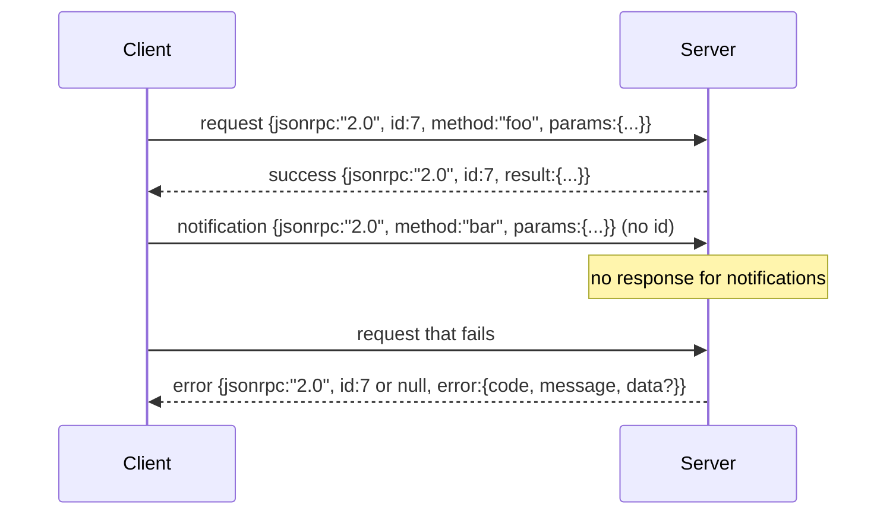

# JSON-RPC 2.0 Over Newline-Delimited Stdio / 基于换行分隔 Stdio 的 JSON-RPC 2.0

> 模型客户端和工具服务器之间的传输层，就是 stdio 上的 JSON-RPC。手写一次，你就会明白每一层 framing 到底在替你处理什么。

**类型：** 构建
**语言：** Python
**前置知识：** 第 13 阶段第 01-07 课，第 14 阶段第 01 课
**时间：** 约 90 分钟

## Learning Objectives / 学习目标

- 使用换行分隔 JSON，在 stdin/stdout 上实现 JSON-RPC 2.0。
- 映射五个标准错误码（-32700、-32600、-32601、-32602、-32603），并保留正确语义。
- 区分 request、response、notification 和 batch，而不发明新的 envelope key。
- 每行独立处理 parse error，不污染后续 stream。
- 用 `io.BytesIO` 构建一个自终止 demo，让课程无需启动子进程即可运行。

## The Problem / 问题

2026 年的 coding agent 在一个 session 中可能要和十几个 tool server 通信。每个 server 都可能是一个独立进程或远程 endpoint。JSON-RPC 2.0 自 2013 年以来一直是稳定的两页 spec。它能活下来，是因为替代方案通常会强迫你做不必要的取舍：gRPC、每次调用一个 HTTP 请求、自定义二进制协议，都会在 streaming、batching 和 transport coupling 之间选边。JSON-RPC 可以对称地跑在 stdio、socket、websocket 和 HTTP 上；只要双方遵守 spec，client 就能驱动一个从未见过的 server。

本课构建 stdio 变体：换行分隔 JSON。每个 request 一行，每个 response 一行。传输边界就是 `\n`。

## The Concept / 概念

### The wire shape / 线上的 envelope

有四种 envelope shape。两种由 client 发送，两种由 server 发送。



notification 没有 `id`，server 不得对它返回 response。如果 server 对 notification 返了 response，client 无法把它挂回任何 call site。这个规则让 framing 的数学保持简单。

batch 是 request 或 notification 的 JSON array。server 返回 response array，顺序可以任意，但每个非 notification entry 都要有一个 response。如果 batch 里全是 notification，server 什么都不发。

### The five error codes / 五个错误码

```text
-32700  Parse error      JSON could not be parsed
-32600  Invalid Request  Envelope shape is wrong
-32601  Method not found
-32602  Invalid params
-32603  Internal error
```

-32000 到 -32099 之间保留给 server-defined errors，其他属于 application-defined。本课只使用这五个标准码。如果 handler 抛错，transport 会把它包成 -32603，并把 exception class name 放到 `data.exception`。

parse error 有一个特殊规则：response 的 `id` 是 `null`，因为 request 没有被解析到能抽出 id 的程度。

### Newline framing and the BytesIO demo / 换行 framing 与 BytesIO demo

transport 一次读一行。一行是截至并包含 `\n` 的 bytes。如果某行无法 parse，transport 写出一个 `id: null` 的 -32700 response，并继续读取。stream 不会被污染。下一行重新 parse。

课程里我们把一对 `io.BytesIO` 包装成 stdin 和 stdout。server 读取 request 直到 EOF，为每个 request 写 response，然后返回。client 再读回 responses。没有进程启动，没有 timeout。由于 Python 的 `io` interface 暴露同样的 `.readline()` 和 `.write()` 契约，transport 行为和真实 subprocess pipe 相同。

### Method dispatch / Method 分发

transport 不知道有哪些 method。它把请求交给 harness 提供的 callable：`handler(method, params)`。handler 返回 result 或抛错。三个 exception class 映射到具体 code。

```text
MethodNotFound -> -32601
InvalidParams  -> -32602
Anything else  -> -32603 with exception name in data
```

transport 永远不直接看到 tool registry。registry 位于 handler 后面。这是我们想要的分层：transport 说 JSON-RPC，registry 说 tool shape，dispatcher（第二十三课）把两者缝起来。

### Stream behavior on errors / 错误时的 stream 行为

```text
client writes              server reads             server writes
---------------            -----------              -------------
{...valid request...}      parses ok                {...response, id matches...}
{...broken json...         parse fails              {id:null, error: -32700}
{...valid request...}      parses ok                {...response, id matches...}
{...missing method...}     invalid envelope         {id:X, error: -32600}
```

一行坏 JSON 不会停止 loop。缺少 `method` 字段不会停止 loop。handler exception 也不会停止 loop。transport 一直读到 EOF。

### Notifications and asymmetric flows / Notification 与非对称流

notification 是 fire-and-forget。harness 用 notification 发送 progress events、cancellation signals 和 log lines。长时间运行的工具可以用 notification 持续流式输出状态，而不需要每条状态都来回 round trip。

本课实现了一个 outbound notification helper：`write_notification`。server 在 request 进行中用它发 progress。demo 展示这个模式：收到 request，handler 发出两个 progress notifications，最后写入 final response。

## Build It / 动手构建

`code/main.py` 定义 `StdioTransport`、parse helper（`parse_request`）、三个 write helper（`write_response`、`write_error`、`write_notification`），以及 dispatch loop `serve`。错误码常量放在 module scope。

`code/tests/test_transport.py` 覆盖五个错误码、notification（不写 response）、batch（array in、array out、跳过 notification）、broken JSON（parse error 后继续），以及 handler 在调用中途写 notification 的非对称 flow。

## Use It / 应用它

这个 transport 足够支撑后续课程。把 registry 包到 handler 后面，就能用 JSON-RPC 暴露工具；把 dispatcher 包到 registry 外面，就能得到 timeout、retry 和统一 error envelope。transport 本身不需要理解这些业务语义。

生产 transport 通常再加三件事：跨转发的 correlation id（你的 `id` 已经承担这件事，但 mesh 里还需要外层 trace id）；取消 channel（比如带 in-flight call id 的 `$/cancelRequest` notification）；content-type negotiation handshake，让同一个 socket 能说 JSON-RPC 和 Streamable HTTP。

## Ship It / 交付它

本课交付一个 newline-delimited stdio JSON-RPC transport：逐行 parse、逐行 response、错误不毒化 stream、notification 不回包、batch 正确处理。它是工具服务器和模型客户端之间的最小稳定边界。

## Exercises / 练习

1. 增加 `$/cancelRequest` notification，并让 in-flight handler 能观察取消信号。
2. 给每个 response 附加外层 trace id，但不破坏 JSON-RPC envelope。
3. 增加 batch 中 response 顺序随机化测试，确认 client 依靠 `id` 而不是顺序。
4. 给 broken JSON 连续三行后仍继续服务的行为加测试。
5. 将 `BytesIO` demo 替换成真实 subprocess pipe，比较同一批 request 的响应。

## Key Terms / 关键术语

| 术语 | 常见说法 | 实际含义 |
|------|-----------------|------------------------|
| JSON-RPC 2.0 | “Tool protocol” | request、response、notification、batch 的通用 envelope |
| Newline framing | “One JSON per line” | stdio 上以 `\n` 作为 message 边界 |
| Notification | “No response call” | 无 `id` 的 fire-and-forget 消息，server 不得返回 response |
| Parse error | “Bad JSON” | -32700，`id` 必须为 `null` |
| Handler seam | “Method dispatch” | transport 与 registry/dispatcher 之间的唯一业务接入点 |

## Further Reading / 延伸阅读

- JSON-RPC 2.0 specification。
- Phase 19 lesson 21：tool registry 与 schema validation。
- Phase 19 lesson 23：function call dispatcher。
- Model Context Protocol 中的 stdio transport 设计。
