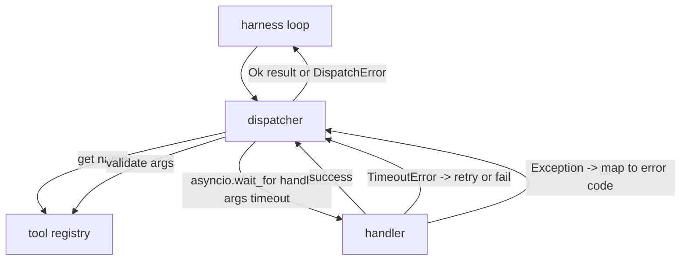
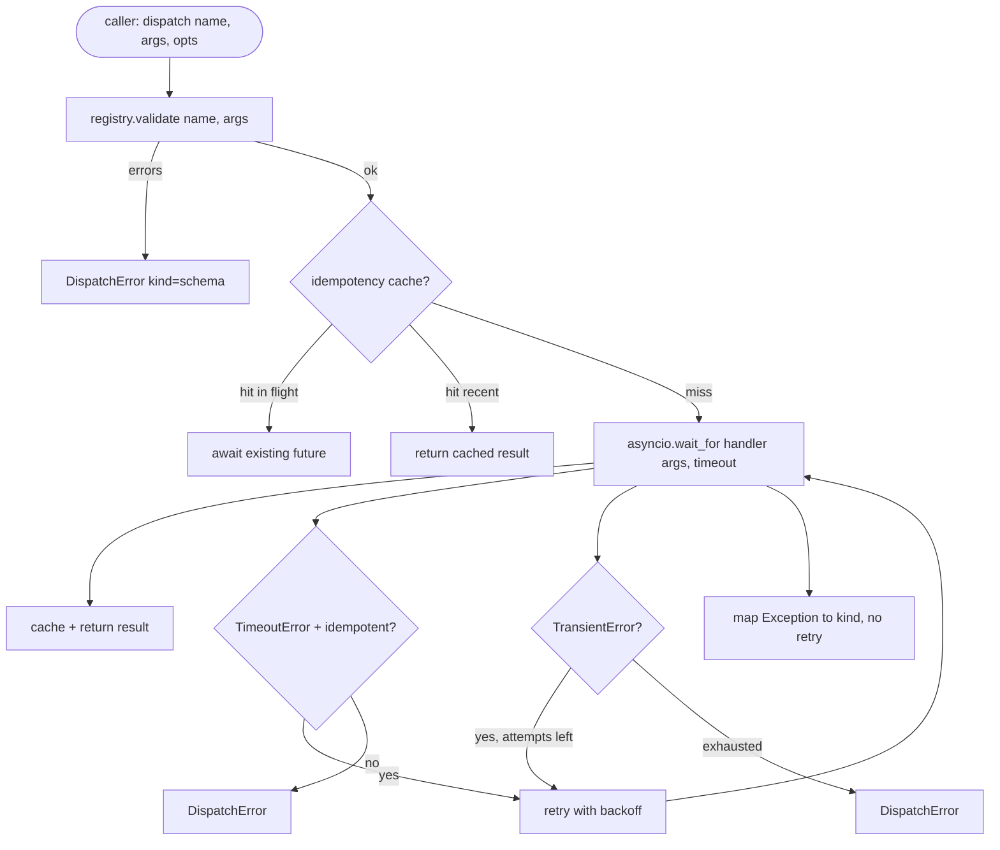

# Function Call Dispatcher / 函数调用 Dispatcher

> Dispatcher 是 harness 兑现 schema 承诺的地方：timeout、retry、dedupe、error mapping，都收束在同一个接口上。

**类型：** 构建
**语言：** Python
**前置知识：** 第 13 阶段第 01-07 课，第 14 阶段第 01 课
**时间：** 约 90 分钟

## Learning Objectives / 学习目标

- 用 per-call timeout 包住 tool handler，让循环收到类型化错误，而不是挂死。
- 实现带 jitter 和最大尝试次数的 exponential backoff retry。
- 基于 idempotency key 做 retry 去重，避免慢原始请求和 retry 并发执行两次。
- 把 handler exception 和 transport fault 映射到 harness loop 已能理解的统一 error envelope。
- 用 concurrency limit 限制并行 dispatch，避免四十个 tool call 的 fan-out 耗尽 event loop。

## The Problem / 问题

dispatcher 位于 harness loop（第二十课）和 tool registry（第二十一课）之间。transport（第二十二课）把请求送进 loop。loop 把 tool call 交给 dispatcher。dispatcher 调 registry，运行 handler，然后返回 result 或 JSON-RPC 形状的 error envelope。



dispatcher 是唯一知道 timer、retry 和 idempotency 的层。loop 不知道，registry 不知道，handler 也不应该知道。这种隔离就是本课的重点。

## The Concept / 概念

### Timeouts / 超时

每个工具都有默认 timeout。registry record 携带 `timeout_ms`。如果 harness 传入 per-call override，dispatcher 会覆盖默认值。实现上使用 `asyncio.wait_for`。超时时，handler task 被取消，dispatcher 返回 `DispatchError(kind="timeout")`。

timeout 默认不能对非幂等工具 retry。`db.write` 超时后可能已经提交，也可能没有。retry 会重复写入。dispatcher 尊重 registry record 上的 `idempotent` 标记：幂等工具可以 retry，非幂等工具不 retry。

### Retries with exponential backoff / 指数退避重试

retry policy 最多尝试三次。backoff 是带 jitter 的指数退避。

```text
attempt 1  -> delay 0
attempt 2  -> delay 0.1s * (1 + random[0..0.5])
attempt 3  -> delay 0.4s * (1 + random[0..0.5])
```

只有 `timeout` 和 `transient` error 会 retry。`schema` error、`not_found` 和 `internal` error 不 retry。schema error 是确定性的，重试不会改变结果，只会烧预算。

retry loop 会尊重 harness 传来的预算。如果调用方剩余 tool calls 为零，dispatcher 第一次尝试前就 fail fast，返回 `kind="budget_exceeded"`。

### Idempotency key dedupe / 幂等键去重

retry 在原始请求仍在飞行时触发，是非常真实的生产 bug。第一次调用卡在四点九秒（刚好低于 timeout）。五秒时 retry 发出。现在两个请求同时打向同一个 backend。如果工具是 `payments.charge`，你就扣了两次款。

dispatcher 接受可选的 `idempotency_key`。如果同一个 key 已经 in flight，新来的调用会等待已有 future，并返回同一结果。完成后 cache 保留 key 六十秒，吸收迟到的 retry。

key 是调用方的责任。harness 从 planner 派生它：`f"{step_id}:{tool_name}:{hash(args)}"`。dispatcher 不自己发明 key，因为仅从 args 派生会把语义不同的调用误认为相同。

### Error envelope / 错误 envelope

失败的 dispatch 返回单一形状。

```text
DispatchError
  kind        : "timeout" | "transient" | "schema" | "not_found" | "internal" | "budget_exceeded"
  message     : str
  attempts    : int
  jsonrpc_code: int   (one of -32601, -32602, -32603)
```

harness loop 根据 `kind` 决定下一状态。`schema` 和 `not_found` 进入 `on_error` 并触发 replan。`timeout` 和 `transient` 进入 `on_error`，是否 replan 取决于尝试次数。`budget_exceeded` 触发 `on_budget_exceeded`。

### Concurrency limit on fan-out / Fan-out 并发限制

`gather(*calls)` 会同时运行所有 coroutine。四十个 tool calls 就是四十个 open sockets 或四十条 subprocess pipes。大多数 backend 不喜欢一个 client 同时开四十个连接。

dispatcher 用 semaphore 包住 `gather`。默认并发限制是八。每个 call 在 dispatch 前获取 semaphore，完成后释放。调用方看到的是 `gather` 形状的输出，但实际调度是有界的。

### Flow for one call / 单次调用流程



## Build It / 动手构建

`code/main.py` 定义 `Dispatcher`、`DispatchError` 和 `TransientError`。dispatcher 构造时接收 registry。异步方法 `dispatch(name, args, ...)` 是唯一入口。per-attempt timeout 在 `_run_with_retries` 内用 `asyncio.wait_for` 直接应用。`gather_bounded(calls)` 用并发限制运行多个 dispatch。

`code/tests/test_dispatcher.py` 覆盖 timeout 触发、transient retry、schema error 不 retry、idempotency dedupe（两个带相同 key 的并发调用折叠为一次 handler invocation）、以及 concurrency limiting（semaphore 的行为）。

测试使用 `asyncio.sleep(0)` 和 deterministic `Counter`-based handlers，因此毫秒内结束，不依赖 wall-clock timing。

## Use It / 应用它

在 harness 中，把所有 tool call 都通过 dispatcher。loop 只处理 result 或 `DispatchError`，不直接管 retry；registry 只管 shape；handler 只管业务逻辑。这个边界能让你以后加 circuit breaker、structured logging 或 per-tool policy，而不改变循环契约。

## Ship It / 交付它

本课交付一个有界、可诊断的 dispatch seam：schema 校验、timeout、幂等 retry、统一错误 envelope 和 fan-out 限流都在同一层。第二十四课会把 dispatcher 接到 plan-and-execute agent 上，让四个组件一起运行。

## Exercises / 练习

1. 增加 `dispatch.attempt` 和 `dispatch.retry` event，并把它们接入第二十课的 event stream。
2. 实现 circuit breaker：某工具在时间窗口内失败 N 次后返回 `kind="circuit_open"`。
3. 给非幂等 timeout 增加人工 review pull point，而不是直接失败。
4. 对 retry backoff 注入 deterministic RNG，固定测试 jitter。
5. 为 idempotency cache 增加 TTL 清理测试，确认迟到 retry 被吸收但旧 key 不无限增长。

## Key Terms / 关键术语

| 术语 | 常见说法 | 实际含义 |
|------|-----------------|------------------------|
| Dispatcher | “Tool runner” | 负责 timeout、retry、idempotency、error mapping 和并发限制的调用层 |
| Idempotency key | “Retry key” | 由调用方派生的语义键，用来折叠重复请求 |
| Transient error | “Retryable failure” | 暂时性失败，可以按 policy 退避重试 |
| DispatchError | “Tool error envelope” | harness loop 可理解的统一错误结构 |
| Fan-out limit | “Concurrency cap” | 用 semaphore 限制同时运行的 tool calls |

## Further Reading / 延伸阅读

- Phase 19 lesson 20：harness loop contract。
- Phase 19 lesson 21：tool registry。
- Phase 19 lesson 22：JSON-RPC transport。
- Circuit breaker pattern：生产 dispatcher 的常见扩展。
