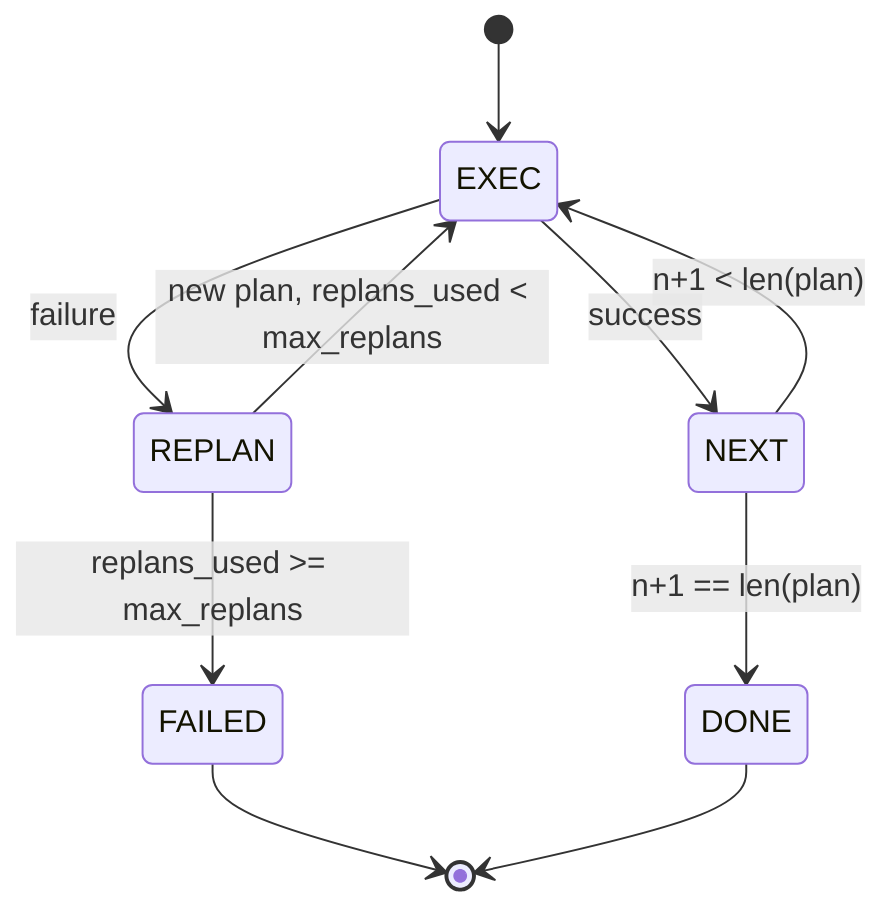

# Plan-Execute Control Flow / Plan-Execute 控制流

> 失败后无法延续的 plan 只是脚本。能 replan 的脚本才开始像 Agent。先把 replanner 构建出来。

**类型：** 构建
**语言：** Python
**前置知识：** 第 13 阶段第 01-07 课，第 14 阶段第 01 课
**时间：** 约 90 分钟

## Learning Objectives / 学习目标

- 用类型化 step 的有序列表表示 plan，让 executor 能推理进度和结果。
- 按顺序执行 step，并在失败时受控地把上下文交回 planner。
- 从当前 cursor 开始 replan，并把 prior error 放进上下文，让下一版 plan 有信息增量。
- 每次 revision 都发出 plan diff，让下游 tracer 或 UI 能显示 plan 为什么变化。
- 强制两个预算：硬 step 上限和硬 replan 上限。

## The Problem / 问题

chain-of-thought agent 发出 token，然后让 loop 猜 tool call 在哪里结束。plan-and-execute agent 先发结构化 plan，再确定性执行每一步。plan 是 harness 可以内省的数据；execution 是 harness 把这些数据交给 dispatcher。

两个组件：产生 plan 的 planner，运行 plan 的 executor。真正有意思的是 executor 遇到失败时发生什么。三种选择：

```text
1. Abort         (return failed, surface the error)
2. Skip          (mark step failed, continue with the rest)
3. Replan        (hand the error to the planner, get a new plan from the cursor)
```

`Replan` 是把脚本变成 Agent 的那一步。

## The Concept / 概念

### The Step shape / Step 形状

```text
Step
  id              : int           (monotonic within a plan revision)
  tool_name       : str
  args            : dict
  expected_outcome: str           (planner's stated success condition)
  result          : Any | None
  error           : str | None
```

`expected_outcome` 是 planner 随 step 发出的一句话成功条件。executor 不强制它。它有两个用途：replanner 在修订 plan 时读取它；event stream 发出它，让 tracer 可以显示“这一步本来应该完成 X”。

### The planner shape / Planner 形状

```python
def planner(goal: str, history: list[Step], last_error: str | None) -> list[Step]:
    ...
```

这是一个纯函数。`goal` 是用户目标。`history` 是已经执行过的 step（填入 result 和 error）。`last_error` 在第一次调用时是 None，后续则是最近一次失败消息。planner 返回从当前 cursor 开始的下一版 plan。

planner 不知道 executor，不知道 retry，不知道 timeout。它只产生 plan。

### The executor / Executor

executor 是一个小状态机。每个 step 都通过 dispatcher。结果有三类：success、failure-replannable、failure-fatal。可 replan 的失败交还给 planner。fatal failure（预算耗尽、replan ceiling 命中）返回 `FAILED` session result。



### Plan diffs on revision / 修订时的 Plan diff

planner 在失败后返回新 plan 时，executor 发出 `plan.diff` event，包含三个字段。

```text
removed: list of step ids that were in the old plan and are not in the new
added  : list of step ids in the new plan that were not in the old
revised: list of step ids whose tool_name or args changed
```

tracer 或 UI 可以把 removed steps 画成删除线，把 added steps 高亮。关键不在 diff 格式，而在于 revision 是可见 event，不是静默改写。

### Two budgets, both hard / 两个硬预算

`max_steps` 限制整个 session 的总 step 执行次数，包括 replan 后的 step。默认十二。一个线性五步 plan 如果 replan 两次、每次新增三步，就会达到十六次执行并超预算。executor 会拒绝这次 replan 并返回 FAILED。

`max_replans` 限制第一次 plan 之后 planner 被再次调用的次数。默认五。这个限制更重要。planner 如果连续五次返回同一个坏 plan，否则会一直循环到 step budget 抓住它。限制 replan 让失败更快，也让原因更清楚。

### Deterministic planner in this lesson / 本课的确定性 planner

本课不调用模型，而是提供一个根据 `last_error` 选 plan 的 deterministic planner。

```text
last_error is None    -> emit a four-step plan
last_error matches X  -> emit a three-step plan that routes around X
last_error matches Y  -> emit a two-step plan that gives up gracefully
otherwise             -> return [] (signals nothing to replan)
```

这足以测试 executor 的所有转换路径：success、replan-once、replan-twice、replan-exhaustion 和 step-budget exhaustion。

### Result shape / 结果形状

```text
SessionResult
  status      : "completed" | "failed"
  reason      : str     ("goal_met" | "step_budget" | "replan_budget" | "no_plan")
  history     : list[Step]
  revisions   : list[PlanDiff]
  events      : list[Event]
```

第二十课的 harness loop 可以直接读取它。第二十三课的 dispatcher 负责执行 step。第二十一课的 registry 负责校验 step args。第二十二课的 transport 可以通过 JSON-RPC 把整个 flow 暴露给 model client。

## Build It / 动手构建

`code/main.py` 定义 `PlanExecuteAgent`、`Step`、`PlanDiff`、`SessionResult` 和 deterministic planner。executor 是一个 `run(goal)` 方法，返回 `SessionResult`。plan diff 通过比较 step ids 和 `(tool_name, args)` tuples 计算。

`code/tests/test_agent.py` 覆盖线性成功、mid-plan failure 后 replan 一次、replan exhaustion 返回 `failed:replan_budget`、step-budget exhaustion，以及 `plan.diff` event 格式。

## Use It / 应用它

真实模型接入后，优先加两个扩展。第一是 partial-plan caching：六步 plan 前三步成功、第四步失败时，不应重跑前三步。executor 已经保留 history，planner 只需要读取它。第二是 parallel branches：当前 executor 严格顺序执行。planner 如果发出独立分支（`gather_step` 而不是 `next_step`），就可以通过 dispatcher 并发跑两个 tool calls。

这两个扩展都会增加复杂度。在线性 executor 被钉牢后再加，会简单得多。

## Ship It / 交付它

本课交付一个可重计划的 plan-execute agent：typed steps、failure handoff、plan diff、step budget 和 replan budget 都具备。它把前四课的 loop、registry、transport 和 dispatcher 串成一个可以执行结构化任务的控制流。

## Exercises / 练习

1. 给 planner 增加一个新 error pattern，并确认 replan diff 精确标出 added、removed、revised。
2. 实现 partial-plan caching：replan 后不重复已经成功的 steps。
3. 给 `max_steps` 写边界测试：刚好达到预算时可以完成，超过一次必须失败。
4. 增加 `skip` 策略，并比较它与 `replan` 在 history 中的记录差异。
5. 设计一个 `gather_step` 类型，但先只在 schema 中表达，不实现并发执行。

## Key Terms / 关键术语

| 术语 | 常见说法 | 实际含义 |
|------|-----------------|------------------------|
| Plan-and-execute | “Plan first” | 先生成结构化 plan，再由 harness 确定性执行 |
| Step | “Plan item” | 带 tool、args、expected outcome、result、error 的执行单元 |
| Replan | “Revise plan” | executor 把失败上下文交回 planner，从 cursor 生成新 plan |
| Plan diff | “Revision event” | 可视化新旧 plan 差异的 added/removed/revised 列表 |
| Replan budget | “Loop guard” | 限制失败后 planner 重新调用次数，避免无限修订 |

## Further Reading / 延伸阅读

- Phase 19 lesson 20：harness loop contract。
- Phase 19 lesson 21：tool registry。
- Phase 19 lesson 23：dispatcher。
- Phase 14 中的 ReWOO 与 plan-and-execute pattern。
