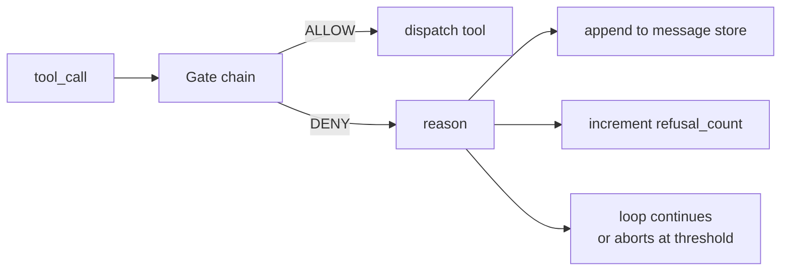
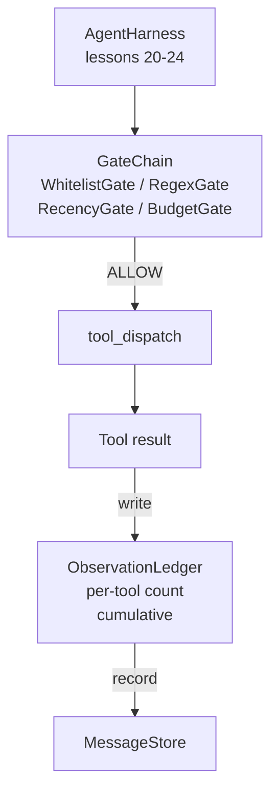

# Capstone Lesson 25: Verification Gates and the Observation Budget / 验证门与观察预算

> 没有 verification layer 的 Agent harness 只是披着工程外衣的愿望。本课构建一条确定性的 gate chain：它决定某个 tool call 是否允许发出、agent 可以看到多少工具输出，以及何时因为 agent 已读取过多内容而停止循环。整条链由小而具名的 gates 加上 observation ledger 组成，ledger 会追踪模型已经看过的每一个 token。

**类型：** 构建
**语言：** Python（stdlib）
**前置知识：** 第 19 阶段 · 20-24（Track A1: agent loop, tool registry, message store, prompt builder, model router）, 第 14 阶段 · 33（instructions as constraints）, 第 14 阶段 · 36（scope contracts）, 第 14 阶段 · 38（verification gates）
**时间：** 约 90 分钟

## Learning Objectives / 学习目标

- 构建带确定性 `evaluate(call)` 方法的 `VerificationGate` protocol。
- 用短路语义组合 budget、recency、whitelist 和 regex gates。
- 通过按 tool 和 turn 记录的 `ObservationLedger` 追踪每条 observation。
- 在累计 observation budget 将被超出时拒绝 tool call。
- 暴露结构化 `GateDecision` record，供下游 observability 消费。

## The Problem / 问题

当 Agent harness 允许模型自由调用工具时，真实使用的第一小时内就会出现三类 bug。

第一类是无界 observation。对 200K 行 repo 做一次 grep，会把五十万 token 的输出倒进下一轮。模型每 KB 只看到一个 match，其余 context 被浪费。token 账单很高，agent 在任务上的表现反而变差。

第二类是 stale recency。一个长任务积累了五十次 tool call。模型把第三轮的 `read_file` 当成当前状态反复读取；第四十七轮的编辑却没有进入视野，因为 prompt builder 先序列化了最早的 observations。

第三类是 privilege creep。一个 research task 从 `web_search` 开始，最后莫名其妙运行了 `shell`，因为模型编造了 tool name，而 harness 默认 permissive。等有人读 trace 时，`/tmp` 里已经有垃圾文件，且有一次 curl 打到了 private API。

verification gate 是 harness 中负责说“不”的组件。它不是模型，不是 judge，而是 `(call, history, ledger)` 的确定性函数，返回 ALLOW 或 DENY，并附带 reason。reason 会被记录，模型会看到，loop 继续或中止。

## The Concept / 概念



gate 是任何带 `evaluate(call, ctx) -> GateDecision` 方法的对象。chain 是有序列表。evaluation 在第一个 deny 处短路。顺序很重要：便宜的结构性 gate 应该跑在昂贵的 token-counting gate 前面。

本课提供四个 gate：

- `WhitelistGate`：允许的 tool names 是一个显式集合，集合外一律拒绝。这是最便宜的 gate，应当第一个执行。
- `RegexGate`：用 regex 匹配 tool arguments。适合拒绝带 `rm -rf` 的 shell call，或指向内部 IP 的 HTTP call。它只依赖 call payload。
- `RecencyGate`：模型只能看到最近 N 轮 observations。更早的 observation 被 mask。若某个 tool call 的结果会延长一个已经过期的 observation window，则拒绝。
- `BudgetGate`：模型在整个 session 中读过的累计 tokens 有上限。当 ledger 显示上限已到，后续每个 tool call 都拒绝。

observation ledger 是账本。每个成功的 tool call 写入一行：tool name、turn、tokens emitted、cumulative。ledger 回答两个问题：模型总共看了多少，以及它看了 tool X 多少。budget gate 读取前者；你会在练习中实现的 per-tool budget gate 读取后者。

## Architecture / 架构



harness 询问 chain。chain 点头或拒绝。如果点头，工具运行、ledger 递增、结果追加到 message store。如果拒绝，模型会收到一条 system message 形式的 refusal，loop 决定 retry 还是 abort。

## Build It / 动手构建

实现是单个 `main.py` 加测试。

1. `Observation` 和 `ToolCall` dataclasses 定义线上的形状。
2. `ObservationLedger` 记录 `(turn, tool, tokens)` 行，并回答 `cumulative()` 和 `per_tool(name)`。
3. `GateDecision` 携带 `(allow, reason, gate_name)`。
4. `VerificationGate` 是 protocol。每个 gate 实现 `evaluate(call, ctx)`。
5. `GateChain` 包住有序列表。它调用每个 gate，返回第一个 deny；如果全部通过，则返回 allow。
6. demo 运行一个极小 synthetic agent loop。三轮。第三轮触发 budget gate，loop 以 non-zero refusal count 报告干净拒绝。

token counter 故意用很粗糙的 `len(text) // 4` 启发式。本课重点是 gate plumbing，不是 tokenizer。生产中应替换成真实 tokenizer。

## Use It / 应用它

deny 比 allow 便宜。`WhitelistGate` 是 O(1) hash lookup。`RegexGate` 是 O(pattern * argv)。`RecencyGate` 读取 message store 的一小段。`BudgetGate` 读取整个 ledger。按成本升序排列，让被拒绝的调用尽早短路。

也要按 blast radius 排序。Whitelist 是最强声明：这个 tool 不在 contract 内。regex gate 其次：这个参数不在 contract 内。recency 再后：调用结构合法，但 harness 仍然关心上下文时效。budget 最后，因为它定义上只在其他 gate 都通过后才触发。

## Ship It / 交付它

前几课给了 loop、tool registry、message store、prompt builder 和 model router。本课增加模型与工具之间的层。第 26 课会交付 sandbox，dispatcher 在 gate chain 返回 ALLOW 后把 tool call 交给它。第 27 课的 eval harness 会把 refusal counts 作为质量信号。第 28 课会把 gate decisions 接入 OpenTelemetry spans。第 29 课把这些拼成一个工作的 coding agent。

运行：

```bash
cd phases/19-capstone-projects/25-verification-gates-observation-budget
python3 code/main.py
python3 -m pytest code/tests/ -v
```

demo 会打印逐轮 trace，包括每个 gate decision，并以零退出。测试覆盖 ledger、每个 gate 的独立行为、chain short-circuit，以及 synthetic loop 的端到端路径。

## Exercises / 练习

1. 实现 per-tool budget gate，让 `web_search` 和 `read_file` 有不同 token 上限。
2. 给 `RegexGate` 增加多条 pattern，并在 `GateDecision.reason` 中写出命中的规则名。
3. 将 `RecencyGate` 的窗口从 turn-based 改成 wall-clock-based，并说明 trade-off。
4. 把 refusal count 接入 eval report，观察合法工具被误拒绝时的分数变化。
5. 用真实 tokenizer 替换 `len(text) // 4`，确认 gate 行为只在边界附近变化。

## Key Terms / 关键术语

| 术语 | 常见说法 | 实际含义 |
|------|-----------------|------------------------|
| VerificationGate | “Policy check” | 对 `(call, history, ledger)` 的确定性 ALLOW/DENY 函数 |
| GateChain | “Guardrail chain” | 按顺序执行 gates，并在第一个 deny 短路 |
| ObservationLedger | “Token ledger” | 记录每次 tool output 对模型暴露了多少 tokens |
| Recency window | “Fresh context” | 只允许模型使用最近 N 轮 observation 的约束 |
| BudgetGate | “Context cap” | 累计 observation tokens 超上限后拒绝后续 tool call |

## Further Reading / 延伸阅读

- Phase 14 · 33：instructions as constraints。
- Phase 14 · 36：scope contracts。
- Phase 14 · 38：verification gates。
- Phase 19 · 26：gate 之后的 sandbox runner。
