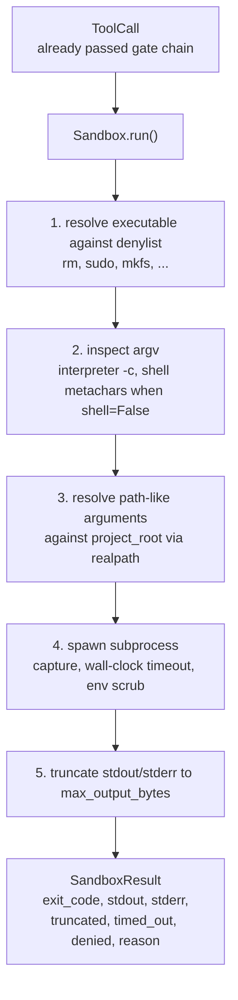
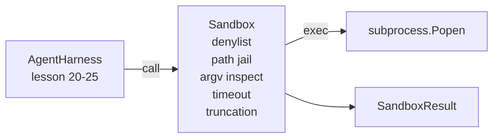

# Capstone Lesson 26: Sandbox Runner with Denylist and Path Jail / 带 Denylist 与 Path Jail 的 Sandbox Runner

> verification gate 决定某个 tool call 是否应该运行；sandbox 决定它真的运行时会发生什么。本课交付一个 subprocess runner：拒绝危险 executable、拒绝危险 argv 形状、把每个 file path 囚禁在 project root 内、截断过大的输出，并在 wall-clock timeout 后杀掉失控进程。它是模型和操作系统之间两层防线中的第二层。

**类型：** 构建
**语言：** Python（stdlib）
**前置知识：** 第 19 阶段 · 25（verification gates and observation budget）, 第 14 阶段 · 33（instructions as constraints）, 第 14 阶段 · 38（verification gates）
**时间：** 约 90 分钟

## Learning Objectives / 学习目标

- 构建一个包住 `subprocess.run` 的 `Sandbox` class，支持 timeout、capture 和 truncation。
- 按 command name 对照 denylist 拒绝命令，并按 argv 结构拒绝危险调用。
- 拒绝任何 resolve 到 declared project root 之外的 path argument。
- 在 shell mode 关闭时拒绝 shell metacharacters。
- 返回结构化 `SandboxResult`，供 observability 和 eval harness 消费。

## The Problem / 问题

一个能 shell out 的 coding agent 可以在一轮里安装后门、外泄 key、弄坏开发者机器，并制造云账单。成本最低的防御是不给它 shell。第二低成本的防御，是一个会对明确模式说“不”的 sandbox。

agent trace 中反复出现三类失败。

第一类是危险 executable。模型在修路径问题的压力下会尝试 `sudo`、`chmod -R 777`、`rm -rf`、`mkfs`、`dd`。这些不该出现在 agent run 里。denylist 同时按名称和 alias 捕获它们。

第二类是 argv trick。模型被告知不能用 shell 后，会把攻击塞进解释器：`python3 -c "import os; os.system('rm -rf /')"`、`bash -c '...'`、`node -e '...'`、`perl -e '...'`。sandbox 必须知道：任何带 `-c` 之类 flag 的 interpreter 调用，本质上只是换了皮的 shell call。

第三类是 path escape。模型被要求读取 `./src/main.py`，却读取 `../../etc/passwd`。sandbox 会用 `os.path.realpath` resolve 每个 path argument，并断言结果仍在 project root 前缀下。

sandbox 不是操作系统意义上的安全边界。具备 code execution 的坚定攻击者仍可能逃逸。这里的 sandbox 是开发时 guardrail：它让常见危险调用变得显眼，并阻止 agent 因笨拙而造成损害。

## The Concept / 概念



sandbox 有四个拒绝轴：name、argv、path、structure。每个轴都是对 call 的纯函数判断，此时还没有启动 subprocess。只有四个轴都通过后才会 spawn。

`SandboxResult` 的 exit codes 采用惯例：0 表示 success，非零表示 failure，另外有三个 sentinel code：denied（-100）、timed_out（-101）、truncated（真实 exit code 保留，同时 flag 置位）。下游课程读取这个结构化结果，而不是 parse stderr。

## Architecture / 架构



denylist 是 executable basename 的 frozenset。aliases（`/bin/rm`、`/usr/bin/rm`）都会 resolve 到同一个 basename。argv inspector 知道 interpreter 形状：如果 argv[0] 是 interpreter，且后续任一 arg 以 `-c` 或 `-e` 开头，则拒绝。shell metacharacters（`;`、`|`、`&`、`>`、`<`、backticks、`$()`）在调用没有显式要求 shell 时会导致拒绝。

path jail 是最容易出错的部分。sandbox 构造时接收一个 `project_root`。任何看起来像 path 的参数（包含 `/` 或匹配已有文件）都会通过 `os.path.realpath` 规范化，再与 project root 的 realpath 比较前缀。如果 resolved target 不在 root 下，则拒绝。symlink escape（project root 内的 symlink 指向外部）会被 realpath 检查拦住，而不是按字面路径放行。

## Build It / 动手构建

实现是 `main.py` 加 tests 目录。

1. `SandboxResult` dataclass：exit_code、stdout、stderr、truncated、timed_out、denied、reason、duration_ms。
2. `SandboxConfig` dataclass：project_root、max_output_bytes、timeout_seconds、denylist、interpreter_block。
3. `Sandbox` class：`run(argv, *, shell=False, cwd=None)` 返回 `SandboxResult`。
4. 内部 refusal helpers：`_check_executable_denylist`、`_check_argv_interpreter`、`_check_shell_metachars`、`_check_path_jail`。
5. 输出截断：设置清楚的 `truncated` flag，并在 captured stream 中写入 marker line。
6. 底部 demo：一组合法和 adversarial calls。每个都展示 result。

sandbox 默认使用 `subprocess.run(shell=False, capture_output=True)`。wall-clock timeout 使用 `timeout` 参数；遇到 `TimeoutExpired` 时，sandbox 杀掉 process group 并合成 `SandboxResult`。

## Use It / 应用它

本课 sandbox 不使用 namespaces、cgroups、seccomp、gVisor、Firecracker，也没有任何 kernel-level isolation。subprocess 能做的事情，sandbox 本身理论上也能做。保护是结构性的：agent 被拒绝最常见的危险调用，拒绝会进入 observability，而不是默默执行。

生产 agent 要叠加操作系统隔离：在 unprivileged Docker container 或 microVM 内运行，drop capabilities，把 project root 只读挂载并提供 scratch dir 写入，设置 memory 和 CPU 的 ulimit，把环境变量 scrub 成已知安全白名单。第 29 课会做其中一部分。操作系统隔离不在本课范围内。

## Ship It / 交付它

运行：

```bash
cd phases/19-capstone-projects/26-sandbox-runner-denylist
python3 code/main.py
python3 -m pytest code/tests/ -v
```

demo 会创建临时目录，放入一个干净文件，然后运行一组 calls。合法调用成功。被拒绝的调用返回 `SandboxResult`，其中 `denied=True` 并带 reason。timeout 返回 `timed_out=True`。truncation 设置 `truncated=True`。demo 打印 JSON outcome table 并以零退出。

第 25 课产生 gate chain。第 26 课是 gate 返回 ALLOW 后实际执行的 executor。第 27 课的 eval harness 会把 sandbox result 与每个 task 的 expected exit-code 对比。第 28 课会围绕每次 `Sandbox.run` 发出 `gen_ai.tool.execution` span。第 29 课把真实 coding agent 通过两层防线跑起来。

## Exercises / 练习

1. 给 denylist 增加平台差异处理：Windows 与 POSIX 的危险 executable 不完全相同。
2. 增加 per-command `max_output_bytes` override，并确认默认值仍能覆盖未知命令。
3. 给 path jail 加 symlink escape 测试：root 内 symlink 指向 `/etc` 必须被拒绝。
4. 增加 env whitelist，只把必要环境变量传给 subprocess。
5. 把 timeout refusal 接入 lesson 28 的 metrics，记录 timed-out tool call 的 p95。

## Key Terms / 关键术语

| 术语 | 常见说法 | 实际含义 |
|------|-----------------|------------------------|
| Sandbox | “Safe runner” | 在启动 subprocess 前做 denylist、argv、path 和 timeout 检查的执行壳 |
| Denylist | “Blocked commands” | 按 executable basename 拒绝危险命令和 alias |
| Path jail | “Project root only” | 通过 realpath 确认所有 path argument 不逃出 project root |
| Interpreter block | “No `-c`” | 拒绝 `python -c`、`bash -c`、`node -e` 等变相 shell |
| SandboxResult | “Structured stderr” | 结构化记录 exit code、stdout、stderr、denied、timeout 和 truncation |

## Further Reading / 延伸阅读

- Python `subprocess` 文档：timeout、capture 和 `shell=False` 行为。
- Phase 19 · 25：gate chain。
- Phase 19 · 27：eval harness。
- Phase 19 · 29：端到端 coding agent 集成。
