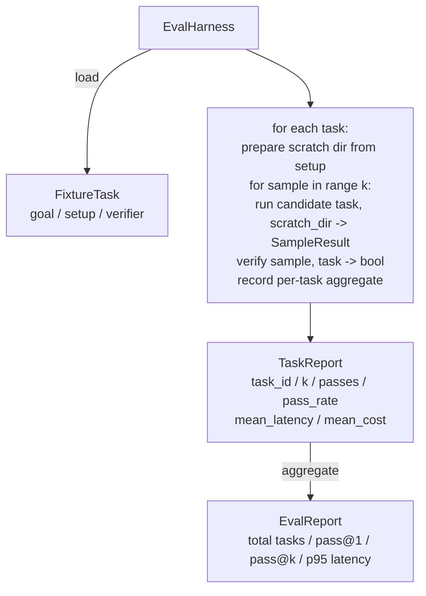

# Capstone Lesson 27: Eval Harness with Fixture Tasks / 基于 Fixture Tasks 的 Eval Harness

> coding agent 的质量，取决于你用什么任务集衡量它。本课构建一个 evaluation harness：它读取一个 fixture tasks 文件夹，让 candidate agent 跑每个任务，用确定性 verifier 判定 pass/fail，并聚合成 pass@1、pass@k、mean latency 和 mean cost。harness 是区分 regression 和 refactor 的真相来源。

**类型：** 构建
**语言：** Python（stdlib）
**前置知识：** 第 19 阶段 · 25（verification gates）, 第 19 阶段 · 26（sandbox runner）, 第 14 阶段 · 30（eval-driven agent development）, 第 14 阶段 · 19（SWE-bench and GAIA benchmarks）
**时间：** 约 90 分钟

## Learning Objectives / 学习目标

- 把 fixture task 定义为 goal、setup、verifier 三元组。
- 对每个 task 评分多次 sample run，并计算 pass@1 和 pass@k。
- 将 latency 和 cost 聚合成 mean 与 95th-percentile metrics。
- 把确定性 verifiers（file diff、exit code、regex match）接成可复用函数。
- 发出结构化 JSON report，让 regression-tracking script 可以消费。

## The Problem / 问题

没有 eval harness 的 agent benchmark 会被三类失败困住。

第一类是 unverified pass。agent 说它修好了 bug，人类扫一眼 diff，就把 suite 标绿。三周后 regression test 暴露同一个 bug。agent 当时只是推理得像样，并没有真的修好。

第二类是 undetected regression。prompt template 改动让 agent 在一个显眼任务上好 4%，在一个安静任务上坏 14%。没有 goldset 和 per-task score，regression 会进入 main，直到客户抱怨才出现。

第三类是 per-task drift。周一 eval 有 100 个 tasks，周五只有 95 个，因为有人重命名了五个 fixtures。pass rate 看起来提升 5%，但那不是真的。

harness 的作用是把这些失败变成事实。它每次以可复现顺序运行每个 fixture，并通过确定性 verifier 返回 true/false。

## The Concept / 概念

```mermaid
flowchart LR
  F1[fixtures/task_001/<br/>task.json + expected/] --> Harness
  F2[fixtures/task_002/<br/>...] --> Harness
  Harness[Harness<br/>for each task:<br/>setup / run agent k samples /<br/>verify each sample /<br/>record latency, cost]
  Harness --> Report[EvalReport<br/>pass@1 / pass@k<br/>mean ms / p95 ms<br/>mean cost]
```

`FixtureTask` 是一个小 JSON 文件，加可选的 `expected/` 目录。JSON 声明 `id`、`goal`（喂给 agent 的 prompt）、`setup` block（放进 scratch dir 的文件）和 `verifier` block。verifier block 命名 harness 的 verifier registry 中的函数，并提供参数。

三种 verifier shape 覆盖大多数有用任务。

第一种是 `file_equals`。agent 运行后，把指定文件和 expected content 对比。这能抓住“按这个精确方式修 bug”的任务。

第二种是 `regex_match`。对指定文件内容做 regex match。适合“函数必须存在并返回 X”这类有多种可接受解的任务。

第三种是 `shell_exit_zero`。harness 通过第 26 课的 sandbox 运行 shell command，只有 exit code 为零才通过。适合“测试必须通过”的任务。

harness 对每个 task 运行 `k` 次。Pass@k 是 `1 - (1 - p)^k`，其中 p 是 empirical pass rate；harness 也报告 raw counts，方便你看 variance。Latency 是每个 sample 的 wall-clock。Cost 由 agent 自报（token count、USD 或二者），harness 汇总并展示 per-task 与 aggregate 数字。

```figure
pass-at-k
```

## Architecture / 架构



candidate 是 callable：`Callable[[FixtureTask, str], SampleResult]`。harness 用 `tempfile.mkdtemp()` 创建 scratch directory，并把 path 作为普通字符串传给 candidate。harness 不关心 candidate 内部怎么工作。candidate 可以是 deterministic patch applier（对 harness 自测很有用）、真实 LLM agent、fuzzer。契约就是 `SampleResult`。

## Build It / 动手构建

`main.py` 交付：

1. `FixtureTask` dataclass。
2. `SampleResult` dataclass：success_self_reported、latency_ms、cost_units、edits。
3. `TaskReport`、`EvalReport` dataclasses，并带 `to_dict()`。
4. `VerifierRegistry`：verifier name 到函数的映射。内置 verifiers：file_equals、regex_match、shell_exit_zero。
5. `EvalHarness` class：对目录中的 tasks 运行 candidate，返回 `EvalReport`。
6. `tasks/` 中捆绑五个 fixture tasks：
   - `fizzbuzz` off-by-one
   - `factorial` 缺少 return
   - error message typo
   - empty function body
   - linked-list traversal off-by-one
7. 一个 deterministic reference candidate（`apply_known_fixes`），用于演示干净的 pass@1 = 1.0。
8. demo 打印 `EvalReport` JSON 并以零退出。

fixture tasks 以 JSON 文件放在 `tasks/`，并配有 `tasks/<id>/buggy/` 和 `tasks/<id>/expected/` 源文件。harness 把 buggy 复制到 scratch dir，交给 candidate，再用 expected 验证。

## Use It / 应用它

真实 LLM agent 是随机的。pass@1 为 0.6 看起来像失败；pass@5 为 0.95 表示 agent 大多数时候能找到正确答案，只是早期 samples 选择不稳定。此时修复方向是 sampling 和 ranking，而不一定是更多训练。pass@k 会让这种情况可见。

pass@k 必须和 pass@1 一起报告，因为 pass@k 会掩盖真实失败：如果模型二十次里只对一次，那不是有用 agent。harness 两者都展示。

## Ship It / 交付它

运行：

```bash
cd phases/19-capstone-projects/27-eval-harness-fixture-tasks
python3 code/main.py
python3 -m pytest code/tests/ -v
```

demo 以 JSON 打印 `EvalReport`，包括 pass@1、pass@5、mean latency 和 per-task breakdown。exit code 为零。测试覆盖 verifier functions、pass@k math、fixture loading，以及 bundled reference candidate 上的 harness end-to-end。

第 25 课产生 gate chain，第 26 课产生 sandbox。harness 会把 sandbox 用于任何 `shell_exit_zero` verifier。第 28 课会用 OTel trace 包住每次 harness run。第 29 课用 bundled fixture 端到端运行，并断言 reference candidate 的 pass@1 = 1.0。

## Exercises / 练习

1. 新增一个 fixture task，使用 `regex_match` 验证允许多种正确实现。
2. 给 `shell_exit_zero` verifier 增加 timeout，并确认 timeout 计入 failure。
3. 对同一 candidate 跑 `k=1`、`k=3`、`k=5`，观察 pass@k 与 raw pass counts 的关系。
4. 把 per-task cost 输出接入 CI threshold，超过预算时 fail。
5. 添加一个 verifier：比较 AST 而不是文件字符串，避免格式化差异造成假失败。

## Key Terms / 关键术语

| 术语 | 常见说法 | 实际含义 |
|------|-----------------|------------------------|
| FixtureTask | “Eval case” | goal、setup、verifier 组成的可复现任务 |
| Verifier | “Pass/fail check” | 对 candidate 输出做确定性判断的函数 |
| pass@k | “Multiple tries score” | k 次 sample 中至少一次通过的概率估计 |
| SampleResult | “Agent run record” | 单次运行的成功自报、latency、cost 和 edits |
| EvalReport | “Benchmark output” | task-level 与 aggregate metrics 的结构化 JSON |

## Further Reading / 延伸阅读

- Phase 14 · 30：eval-driven agent development。
- Phase 14 · 19：SWE-bench 与 GAIA benchmarks。
- Phase 19 · 28：把 eval harness 接入 observability。
